## Introduction
This is a repository of the best TikZ examples I have found around the web and from papers, slides, tutorials, and books. Most of the examples are simple enough to encourage anyone to start learning TikZ. By having the result (graphic) on a web page, and be able to click on it to see the code, it rapidly helps to make the connection between **code** and **output**. I find this idea fantastic.

TikZ is ideal for any kind of publications either websites, blogs, papers, articles, slides, or books because they are portable and reproducible. TikZ files are text not binaries. They don't require mouse and clicks but writing code to connect objects and elements. These object can be very simple or as sophisticated as you want. TikZ graphics can be built under any LaTex environment for any operating system: Windows, Linux or Mac OS.

There are hundreds of libraries for TikZ in all scientific fields. That makes it easier to build advanced graphics for practically any domain or discipline because you are able to start from code already written.


## Motivation

While working with Latex and TikZ file I had this question:

**How can I use the power of R to organize TikZ related files?**

**R** is very friendly to Latex and TikZ through the packages `knitr` and `rmarkdown`.

TikZ involves a source file, which carries the `tex` extension; the PDF that is generated by your Latex compiler and editor (I use *TexStudio*); the graphics output file -that could be anything imaginable. I use `png` files.


  
## How this README is built
This `README` is smartly generated with TikZ graphics and code located in the `src` folder.
This means that as you are adding, building, designing new TikZ drawings, they become available to be automatically included in this README file. It uses some `knitr` tricks. But the whole thing is awesome. 

The magic is provided by:

* the file `template.Rmd`
* the chunks of code that you can see in this `README`  


## Deployment of website in GitHub Pages (GHP)
This is a very interesting article about publshing your TikZ site: [Simple deployment to GH Pages](https://www.gnu.org/software/make/manual/html_node/Conditional-Syntax.html). I chose to publish it in `/docs` instead of the `public` folder because it is much easier. GHP does not allow to publish a website on the `public` folder, unfortunately.


## Thanks. Original repository and idea 
I found this valuable resource while exploring TikZ and R: https://github.com/walmes/Tikz

It is pretty neat and relatively simple to use and personalize because it uses Hugo, a generator of static websites; the same engine that is used by `blogdown`, `bookdown`, and others.

Thanks to **Walmes Zeviani** for the great idea of combining Latex, TikZ, R and Hugo.

Source: https://github.com/walmes/Tikz
Web: http://leg.ufpr.br/~walmes/Tikz/  


## Summary 
This is my collection of favorite TikZ graphics. It is necessary to store and organize them as gallery because it makes it easier to peek at the code for new designs.


Some useful tutorials:

  * [TikZ Adventskalender](https://tobiw.de/en/teotm/tikz-adventskalender)
  * [TikZ for the Impatient](http://math.et.info.free.fr/TikZ/bdd/TikZ-Impatient.pdf)
  * <http://www.mat.ufpb.br/lenimar/introtikz.pdf>
  * [LaTeX for Economists](http://nfpoitiers.eu/wp-content/uploads/2018/08/3-presentations_and_graphics.pdf)
  * [Configurable Graph Drawing Algorithmsfor the TikZ Graphics Description Language](https://www.tcs.uni-luebeck.de/downloads/papers/2011/2011-configurable-graph-drawing-algorithms-jannis-pohlmann.pdf)
  * [TikZ for Economics By Chiu Yu Ko](https://www.google.com/books/edition/_/t3ZZDwAAQBAJ?hl=en&gbpv=0)
  * <http://www.statistiker-wg.de/pgf/tutorials.htm>
  * [A very minimal introduction to TikZ](https://cremeronline.com/LaTeX/minimaltikz.pdf)
  * [TikZ Tutorial](https://indico.scc.kit.edu/event/48/contributions/3405/attachments/1693/2321/tikz_tutorial.pdf)
  


## Useful statistics

* There are 223 total Tikz figures saved as `.tex` files in this gallery. 
The figures are sorted by filename.
* There are 221 files under `src/` to be compiled with `pdflatex`
* There are 2 files under `src/` to be compiled with `lualatex`
* There are 18 data files under the folder `src/data` that are being used by the TikZ scripts
* There are 2 Latex classes, styles and library files under the `src/texmf` folder


## TikZ graphics and code


****

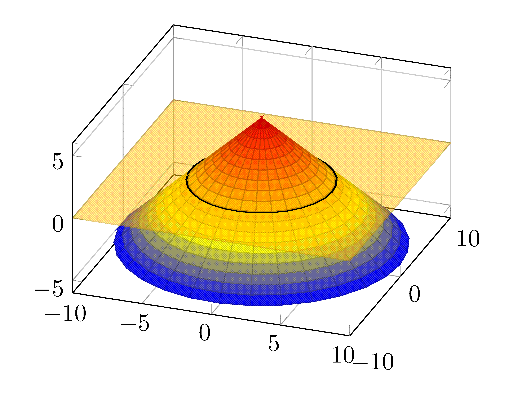

  * [3d-cone_intersection+3d+pgf.lualatex.tex](https://github.com/walmes/Tikz/blob/master/src/3d-cone_intersection+3d+pgf.lualatex.pgf)

```tex
% http://pgfplots.net/media/tikz/examples/TEX/intersection-surfaces.tex
% +3d+pgf
% compile with lualatex
%
\documentclass[border=10pt]{standalone}
%%%<
\usepackage{verbatim}
%%%>
\usepackage{pgfplots}
\pgfplotsset{width=7cm,compat=1.8}

\begin{comment}
:Title: Intersection of two surfaces
:Tags: 3D;Intersections
:Author: Jake
:Slug: intersection-surfaces

We would like to intersect a 3D plot with a plane. The problem is not to get
the two functions into a plot, but to get the two functions to visual
intersect with each other, i.e the nearest surface is in the foreground.

This can't be done automatically, unfortunately, since pgfplots can't do z
buffering between different \addplot commands.

For this concrete application, you could construct the plot "by hand", however:

First, you draw the part of the cone below 0, then you draw the plane and the
circle, then you draw the part of the cone above 0.

I've used a polar coordinate system for this, since it makes the input of
polar functions easier.

This code was written by Jake on TeX.SE.
\end{comment}
\begin{document}
  \begin{tikzpicture}
    \begin{axis}[grid=major,view={20}{40},z buffer=sort, data cs=polar]
      \addplot3 [surf, domain=0:360, domain y=5:10,samples=30, samples y=10]
      {-y+5};
      \addplot3 [data cs=cart,surf,domain=-10:10,samples=2, opacity=0.5]
      {0};
      \addplot3 [domain=0:360, samples y=0, samples=30, thick, z buffer=auto]
      (x,5.1,0);
      \addplot3 [surf,domain=0:360, domain y=0:5,samples=30, samples y=10]
      {-y+5};
    \end{axis}
  \end{tikzpicture}  
\end{document}
```
****

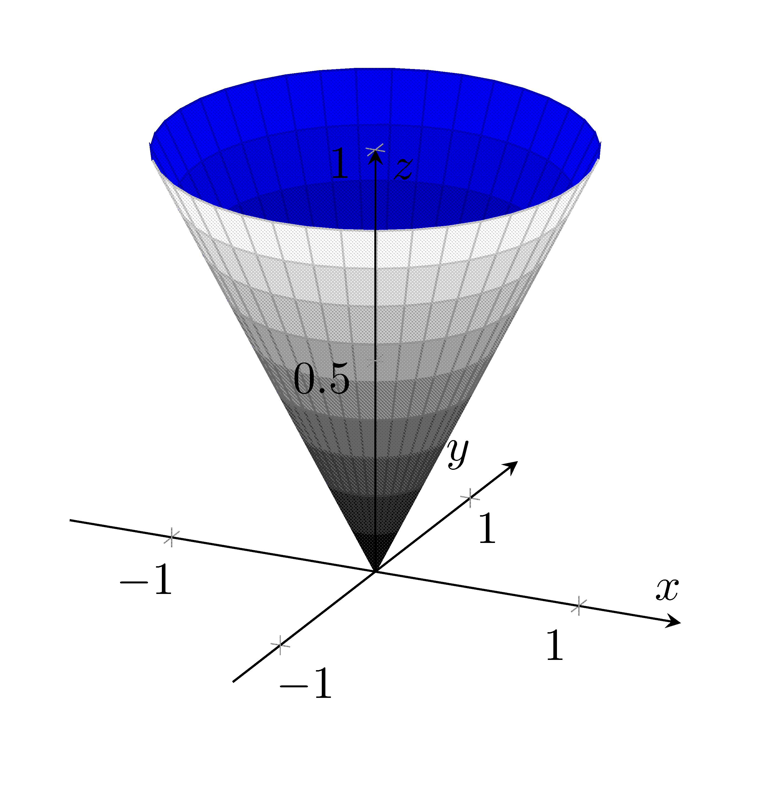

  * [3d-cone+pgf.tex](https://github.com/walmes/Tikz/blob/master/src/3d-cone+pgf.pgf)

```tex
% page 142 of book PGFPLOTS
% http://mirror.utexas.edu/ctan/graphics/pgf/contrib/pgfplots/doc/pgfplots.pdf
\documentclass[border=15pt]{standalone}
\usepackage{pgfplots}
\pgfplotsset{compat=1.16}

\begin{document}
	
	\begin{tikzpicture}
	\begin{axis}[
		axis lines=center,
		axis on top,
		xlabel={$x$},
		ylabel={$y$},
		zlabel={$z$},
		domain=0:1,y domain=0:2*pi,
		xmin=-1.5,
		xmax=1.5,
		ymin=-1.5,
		ymax=1.5,
		zmin=0.0,
		mesh/interior colormap=
			{blueblack}{color=(black) color=(blue)},
		colormap/blackwhite,
		samples=10,
		samples y=40,
		z buffer=sort,
	]
		\addplot3 [  surf]
			({x*cos(deg(y))},{x*sin(deg(y))},{x});
	\end{axis}
	\end{tikzpicture}
	
\end{document}
```
****

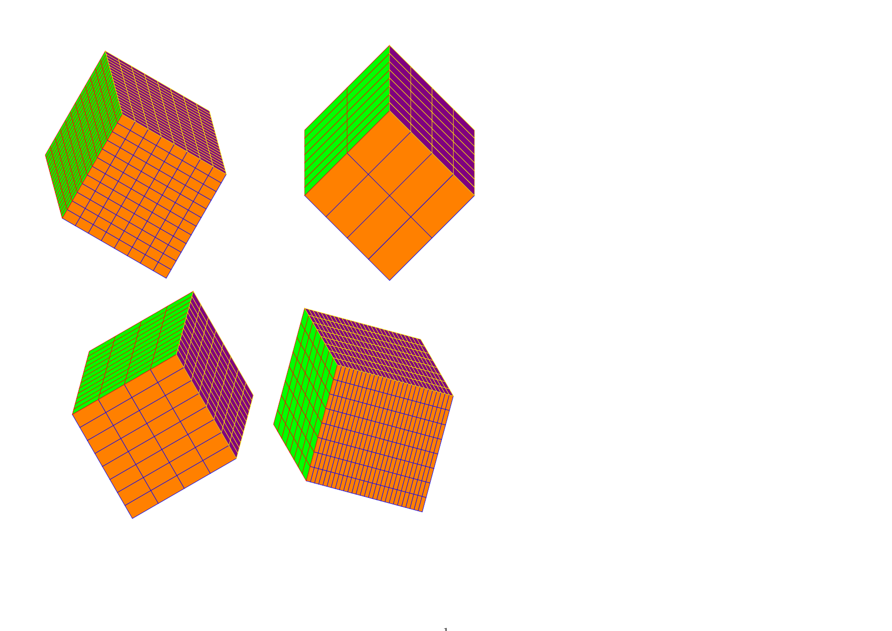

  * [3d-cube_color_rotated+3d+pgf+foreach+command+define.tex](https://github.com/walmes/Tikz/blob/master/src/3d-cube_color_rotated+3d+pgf+foreach+command+define.pgf)

```tex
\documentclass[parskip]{scrartcl}
\usepackage[margin=15mm,landscape]{geometry}
\usepackage{tikz}
\usepackage{keyval}
\usepackage{ifthen}

\makeatletter
% Standard Values for Parameters
\newcommand{\tikzcuboid@shiftx}{0}
\newcommand{\tikzcuboid@shifty}{0}
\newcommand{\tikzcuboid@dimx}{4}
\newcommand{\tikzcuboid@dimy}{4}
\newcommand{\tikzcuboid@dimz}{4}
\newcommand{\tikzcuboid@scale}{1}
\newcommand{\tikzcuboid@densityx}{1}
\newcommand{\tikzcuboid@densityy}{1}
\newcommand{\tikzcuboid@densityz}{1}
\newcommand{\tikzcuboid@rotation}{0}
\newcommand{\tikzcuboid@anglex}{0}
\newcommand{\tikzcuboid@angley}{90}
\newcommand{\tikzcuboid@anglez}{225}
\newcommand{\tikzcuboid@scalex}{1}
\newcommand{\tikzcuboid@scaley}{1}
\newcommand{\tikzcuboid@scalez}{1}
\newcommand{\tikzcuboid@linefront}{}
\newcommand{\tikzcuboid@linetop}{}
\newcommand{\tikzcuboid@lineright}{}
\newcommand{\tikzcuboid@fillfront}{}
\newcommand{\tikzcuboid@filltop}{}
\newcommand{\tikzcuboid@fillright}{}
\newcommand{\tikzcuboid@newcoords}{N}
\newcommand{\tikzcuboid@filled}{N}
\newcommand{\tikzcuboid@shaded}{N}
% Definition of Keys
\define@key{tikzcuboid}{shiftx}[\tikzcuboid@shiftx]{\renewcommand{\tikzcuboid@shiftx}{#1}}
\define@key{tikzcuboid}{shifty}[\tikzcuboid@shifty]{\renewcommand{\tikzcuboid@shifty}{#1}}
\define@key{tikzcuboid}{dimx}[\tikzcuboid@dimx]{\renewcommand{\tikzcuboid@dimx}{#1}}
\define@key{tikzcuboid}{dimy}[\tikzcuboid@dimy]{\renewcommand{\tikzcuboid@dimy}{#1}}
\define@key{tikzcuboid}{dimz}[\tikzcuboid@dimz]{\renewcommand{\tikzcuboid@dimz}{#1}}
\define@key{tikzcuboid}{scale}[\tikzcuboid@scale]{\renewcommand{\tikzcuboid@scale}{#1}}
\define@key{tikzcuboid}{densityx}[\tikzcuboid@densityx]{\renewcommand{\tikzcuboid@densityx}{#1}}
\define@key{tikzcuboid}{densityy}[\tikzcuboid@densityy]{\renewcommand{\tikzcuboid@densityy}{#1}}
\define@key{tikzcuboid}{densityz}[\tikzcuboid@densityz]{\renewcommand{\tikzcuboid@densityz}{#1}}
\define@key{tikzcuboid}{rotation}[\tikzcuboid@rotation]{\renewcommand{\tikzcuboid@rotation}{#1}}
\define@key{tikzcuboid}{anglex}[\tikzcuboid@anglex]{\renewcommand{\tikzcuboid@anglex}{#1}}
\define@key{tikzcuboid}{angley}[\tikzcuboid@angley]{\renewcommand{\tikzcuboid@angley}{#1}}
\define@key{tikzcuboid}{anglez}[\tikzcuboid@anglez]{\renewcommand{\tikzcuboid@anglez}{#1}}
\define@key{tikzcuboid}{scalex}[\tikzcuboid@scalex]{\renewcommand{\tikzcuboid@scalex}{#1}}
\define@key{tikzcuboid}{scaley}[\tikzcuboid@scaley]{\renewcommand{\tikzcuboid@scaley}{#1}}
\define@key{tikzcuboid}{scalez}[\tikzcuboid@scalez]{\renewcommand{\tikzcuboid@scalez}{#1}}
\define@key{tikzcuboid}{linefront}[\tikzcuboid@linefront]{\renewcommand{\tikzcuboid@linefront}{#1}}
\define@key{tikzcuboid}{linetop}[\tikzcuboid@linetop]{\renewcommand{\tikzcuboid@linetop}{#1}}
\define@key{tikzcuboid}{lineright}[\tikzcuboid@lineright]{\renewcommand{\tikzcuboid@lineright}{#1}}
\define@key{tikzcuboid}{fillfront}[\tikzcuboid@fillfront]{\renewcommand{\tikzcuboid@fillfront}{#1}}
\define@key{tikzcuboid}{filltop}[\tikzcuboid@filltop]{\renewcommand{\tikzcuboid@filltop}{#1}}
\define@key{tikzcuboid}{fillright}[\tikzcuboid@fillright]{\renewcommand{\tikzcuboid@fillright}{#1}}
\define@key{tikzcuboid}{newcoords}[\tikzcuboid@newcoords]{\renewcommand{\tikzcuboid@newcoords}{#1}}
\define@key{tikzcuboid}{filled}[\tikzcuboid@filled]{\renewcommand{\tikzcuboid@filled}{#1}}
\define@key{tikzcuboid}{shaded}[\tikzcuboid@shaded]{\renewcommand{\tikzcuboid@shaded}{#1}}
% Commands
\newcommand{\tikzcuboid}[1]{
    \setkeys{tikzcuboid}{#1} % Process Keys passed to command
    \begin{scope}[xshift=\tikzcuboid@shiftx,yshift=\tikzcuboid@shifty,scale=\tikzcuboid@scale,rotate=\tikzcuboid@rotation]
    \pgfmathsetmacro{\steppingx}{1/\tikzcuboid@densityx}
    \pgfmathsetmacro{\steppingy}{1/\tikzcuboid@densityy}
    \pgfmathsetmacro{\steppingz}{1/\tikzcuboid@densityz}
    \newcommand{\dimx}{\tikzcuboid@dimx}
    \newcommand{\dimy}{\tikzcuboid@dimy}
    \newcommand{\dimz}{\tikzcuboid@dimz}
    \pgfmathsetmacro{\secondx}{2*\steppingx}
    \pgfmathsetmacro{\secondy}{2*\steppingy}
    \pgfmathsetmacro{\secondz}{2*\steppingz}
    \foreach \x in {\steppingx,\secondx,...,\dimx}
    {   \foreach \y in {\steppingy,\secondy,...,\dimy}
        {   \pgfmathsetmacro{\lowx}{(\x-\steppingx)}
            \pgfmathsetmacro{\lowy}{(\y-\steppingy)}
            \filldraw[fill=orange,draw=blue] (\lowx,\lowy,\dimz) -- (\lowx,\y,\dimz) -- (\x,\y,\dimz) -- (\x,\lowy,\dimz) -- cycle;

        }
    }
    \foreach \x in {\steppingx,\secondx,...,\dimx}
    {   \foreach \z in {\steppingz,\secondz,...,\dimz}
        {   \pgfmathsetmacro{\lowx}{(\x-\steppingx)}
            \pgfmathsetmacro{\lowz}{(\z-\steppingz)}
            \filldraw[fill=green,draw=red] (\lowx,\dimy,\lowz) -- (\lowx,\dimy,\z) -- (\x,\dimy,\z) -- (\x,\dimy,\lowz) -- cycle;
        }
    }
    \foreach \y in {\steppingy,\secondy,...,\dimy}
    {   \foreach \z in {\steppingz,\secondz,...,\dimz}
        {   \pgfmathsetmacro{\lowy}{(\y-\steppingy)}
            \pgfmathsetmacro{\lowz}{(\z-\steppingz)}
            \filldraw[fill=red!50!blue,draw=yellow] (\dimx,\lowy,\lowz) -- (\dimx,\lowy,\z) -- (\dimx,\y,\z) -- (\dimx,\y,\lowz) -- cycle;
        }
    }
    \end{scope}

    % Write parameters to log file, just for checking       
%   \typeout{=============================}
%   \typeout{*****************************}
%   \typeout{tikzcuboid shiftx = \tikzcuboid@shiftx}
%   \typeout{tikzcuboid shifty = \tikzcuboid@shifty}
%   \typeout{tikzcuboid dimx = \tikzcuboid@dimx}
%   \typeout{tikzcuboid dimy = \tikzcuboid@dimy}
%   \typeout{tikzcuboid dimz = \tikzcuboid@dimz}
%   \typeout{tikzcuboid scale = \tikzcuboid@scale}
%   \typeout{tikzcuboid densityx = \tikzcuboid@densityx}
%   \typeout{tikzcuboid densityy = \tikzcuboid@densityy}
%   \typeout{tikzcuboid densityz = \tikzcuboid@densityz}
%   \typeout{tikzcuboid rotation = \tikzcuboid@rotation}
%   \typeout{tikzcuboid anglex = \tikzcuboid@anglex}
%   \typeout{tikzcuboid angley = \tikzcuboid@angley}
%   \typeout{tikzcuboid anglez = \tikzcuboid@anglez}
%   \typeout{tikzcuboid scalex = \tikzcuboid@scalex}
%   \typeout{tikzcuboid scaley = \tikzcuboid@scaley}
%   \typeout{tikzcuboid scalez = \tikzcuboid@scalez}
%   \typeout{tikzcuboid linefront = \tikzcuboid@linefront}
%   \typeout{tikzcuboid linetop = \tikzcuboid@linetop}
%   \typeout{tikzcuboid lineright = \tikzcuboid@lineright}
%   \typeout{tikzcuboid fillfront = \tikzcuboid@fillfront}
%   \typeout{tikzcuboid filltop = \tikzcuboid@filltop}
%   \typeout{tikzcuboid fillright = \tikzcuboid@fillright}
%   \typeout{tikzcuboid newcoords = \tikzcuboid@newcoords}
%   \typeout{tikzcuboid filled = \tikzcuboid@filled}
%   \typeout{tikzcuboid shaded = \tikzcuboid@shaded}
%   \typeout{*****************************}
%   \typeout{=============================}
}

\makeatother


\begin{document}


\begin{tikzpicture}
    \tikzcuboid{shiftx=0cm,%
        shifty=0cm,%
        scale=1.00,%
        rotation=30,%
        densityx=1,%
        densityy=2,%
        densityz=3%
    }
    \tikzcuboid{%
        shiftx=0cm,%
        shifty=8cm,%
        scale=1.00,%
        rotation=60,%
        densityx=3,%
        densityy=2,%
        densityz=5%
    }
    \tikzcuboid{%
        shiftx=8cm,%
        shifty=8cm,%
        scale=1.00,%
        rotation=45,%
        densityx=0.5,%
        densityy=1,%
        densityz=2%
    }
    \tikzcuboid{%
        shiftx=8cm,%
        shifty=0cm,%
        scale=1.00,%
        rotation=75,%
        densityx=2,%
        densityy=7,%
        densityz=2%
    }
\end{tikzpicture}

\end{document}
```
****


  * [3d-cubes_isometric_shaded+3d.tex](https://github.com/walmes/Tikz/blob/master/src/3d-cubes_isometric_shaded+3d.pgf)

```tex
% https://tex.stackexchange.com/questions/29877/need-help-creating-a-3d-cube-from-a-2d-set-of-nodes-in-tikz
\documentclass[parskip]{scrartcl}
\usepackage[margin=15mm,landscape]{geometry}
\usepackage{tikz}

\newif\ifcuboidshade
\newif\ifcuboidemphedge

\tikzset{
  cuboid/.is family,
  cuboid,
  shiftx/.initial=0,
  shifty/.initial=0,
  dimx/.initial=3,
  dimy/.initial=3,
  dimz/.initial=3,
  scale/.initial=1,
  densityx/.initial=1,
  densityy/.initial=1,
  densityz/.initial=1,
  rotation/.initial=0,
  anglex/.initial=0,
  angley/.initial=90,
  anglez/.initial=225,
  scalex/.initial=1,
  scaley/.initial=1,
  scalez/.initial=0.5,
  front/.style={draw=black,fill=white},
  top/.style={draw=black,fill=white},
  right/.style={draw=black,fill=white},
  shade/.is if=cuboidshade,
  shadecolordark/.initial=black,
  shadecolorlight/.initial=white,
  shadeopacity/.initial=0.15,
  shadesamples/.initial=16,
  emphedge/.is if=cuboidemphedge,
  emphstyle/.style={thick},
}

\newcommand{\tikzcuboidkey}[1]{\pgfkeysvalueof{/tikz/cuboid/#1}}

% Commands
\newcommand{\tikzcuboid}[1]{
    \tikzset{cuboid,#1} % Process Keys passed to command
  \pgfmathsetlengthmacro{\vectorxx}{\tikzcuboidkey{scalex}*cos(\tikzcuboidkey{anglex})*28.452756}
  \pgfmathsetlengthmacro{\vectorxy}{\tikzcuboidkey{scalex}*sin(\tikzcuboidkey{anglex})*28.452756}
  \pgfmathsetlengthmacro{\vectoryx}{\tikzcuboidkey{scaley}*cos(\tikzcuboidkey{angley})*28.452756}
  \pgfmathsetlengthmacro{\vectoryy}{\tikzcuboidkey{scaley}*sin(\tikzcuboidkey{angley})*28.452756}
  \pgfmathsetlengthmacro{\vectorzx}{\tikzcuboidkey{scalez}*cos(\tikzcuboidkey{anglez})*28.452756}
  \pgfmathsetlengthmacro{\vectorzy}{\tikzcuboidkey{scalez}*sin(\tikzcuboidkey{anglez})*28.452756}
  \begin{scope}[xshift=\tikzcuboidkey{shiftx}, yshift=\tikzcuboidkey{shifty}, scale=\tikzcuboidkey{scale}, rotate=\tikzcuboidkey{rotation}, x={(\vectorxx,\vectorxy)}, y={(\vectoryx,\vectoryy)}, z={(\vectorzx,\vectorzy)}]
    \pgfmathsetmacro{\steppingx}{1/\tikzcuboidkey{densityx}}
  \pgfmathsetmacro{\steppingy}{1/\tikzcuboidkey{densityy}}
  \pgfmathsetmacro{\steppingz}{1/\tikzcuboidkey{densityz}}
  \newcommand{\dimx}{\tikzcuboidkey{dimx}}
  \newcommand{\dimy}{\tikzcuboidkey{dimy}}
  \newcommand{\dimz}{\tikzcuboidkey{dimz}}
  \pgfmathsetmacro{\secondx}{2*\steppingx}
  \pgfmathsetmacro{\secondy}{2*\steppingy}
  \pgfmathsetmacro{\secondz}{2*\steppingz}
  \foreach \x in {\steppingx,\secondx,...,\dimx}
  { \foreach \y in {\steppingy,\secondy,...,\dimy}
    {   \pgfmathsetmacro{\lowx}{(\x-\steppingx)}
      \pgfmathsetmacro{\lowy}{(\y-\steppingy)}
      \filldraw[cuboid/front] (\lowx,\lowy,\dimz) -- (\lowx,\y,\dimz) -- (\x,\y,\dimz) -- (\x,\lowy,\dimz) -- cycle;
    }
    }
  \foreach \x in {\steppingx,\secondx,...,\dimx}
  { \foreach \z in {\steppingz,\secondz,...,\dimz}
    {   \pgfmathsetmacro{\lowx}{(\x-\steppingx)}
      \pgfmathsetmacro{\lowz}{(\z-\steppingz)}
      \filldraw[cuboid/top] (\lowx,\dimy,\lowz) -- (\lowx,\dimy,\z) -- (\x,\dimy,\z) -- (\x,\dimy,\lowz) -- cycle;
        }
    }
    \foreach \y in {\steppingy,\secondy,...,\dimy}
  { \foreach \z in {\steppingz,\secondz,...,\dimz}
    {   \pgfmathsetmacro{\lowy}{(\y-\steppingy)}
      \pgfmathsetmacro{\lowz}{(\z-\steppingz)}
      \filldraw[cuboid/right] (\dimx,\lowy,\lowz) -- (\dimx,\lowy,\z) -- (\dimx,\y,\z) -- (\dimx,\y,\lowz) -- cycle;
    }
  }
  \ifcuboidemphedge
    \draw[cuboid/emphstyle] (0,\dimy,0) -- (\dimx,\dimy,0) -- (\dimx,\dimy,\dimz) -- (0,\dimy,\dimz) -- cycle;%
    \draw[cuboid/emphstyle] (0,\dimy,\dimz) -- (0,0,\dimz) -- (\dimx,0,\dimz) -- (\dimx,\dimy,\dimz);%
    \draw[cuboid/emphstyle] (\dimx,\dimy,0) -- (\dimx,0,0) -- (\dimx,0,\dimz);%
    \fi

    \ifcuboidshade
    \pgfmathsetmacro{\cstepx}{\dimx/\tikzcuboidkey{shadesamples}}
    \pgfmathsetmacro{\cstepy}{\dimy/\tikzcuboidkey{shadesamples}}
    \pgfmathsetmacro{\cstepz}{\dimz/\tikzcuboidkey{shadesamples}}
    \foreach \s in {1,...,\tikzcuboidkey{shadesamples}}
    {   \pgfmathsetmacro{\lows}{\s-1}
        \pgfmathsetmacro{\cpercent}{(\lows)/(\tikzcuboidkey{shadesamples}-1)*100}
        \fill[opacity=\tikzcuboidkey{shadeopacity},color=\tikzcuboidkey{shadecolorlight}!\cpercent!\tikzcuboidkey{shadecolordark}] (0,\s*\cstepy,\dimz) -- (\s*\cstepx,\s*\cstepy,\dimz) -- (\s*\cstepx,0,\dimz) -- (\lows*\cstepx,0,\dimz) -- (\lows*\cstepx,\lows*\cstepy,\dimz) -- (0,\lows*\cstepy,\dimz) -- cycle;
        \fill[opacity=\tikzcuboidkey{shadeopacity},color=\tikzcuboidkey{shadecolorlight}!\cpercent!\tikzcuboidkey{shadecolordark}] (0,\dimy,\s*\cstepz) -- (\s*\cstepx,\dimy,\s*\cstepz) -- (\s*\cstepx,\dimy,0) -- (\lows*\cstepx,\dimy,0) -- (\lows*\cstepx,\dimy,\lows*\cstepz) -- (0,\dimy,\lows*\cstepz) -- cycle;
        \fill[opacity=\tikzcuboidkey{shadeopacity},color=\tikzcuboidkey{shadecolorlight}!\cpercent!\tikzcuboidkey{shadecolordark}] (\dimx,0,\s*\cstepz) -- (\dimx,\s*\cstepy,\s*\cstepz) -- (\dimx,\s*\cstepy,0) -- (\dimx,\lows*\cstepy,0) -- (\dimx,\lows*\cstepy,\lows*\cstepz) -- (\dimx,0,\lows*\cstepz) -- cycle;
    }
    \fi 

  \end{scope}
}

\makeatother


\begin{document}


\begin{tikzpicture}
    \tikzcuboid{%
    shiftx=0cm,%
    shifty=8cm,%
    scale=1.00,%
    rotation=0,%
    densityx=2,%
    densityy=2,%
    densityz=2,%
    dimx=3,%
    dimy=3,%
    dimz=3,%
    scalex=1,%
    scaley=1,%
    scalez=1,%
    anglex=-30,%
    angley=90,%
    anglez=210,%
    front/.style={draw=green!50!black,fill=green!50!white},%
    top/.style={draw=green!50!black,fill=green!50!white},%
    right/.style={draw=green!50!black,fill=green!50!white},%
    emphedge,%
    emphstyle/.style={line width=1pt, green!12!black,densely dashed},
    shade,%
    shadesamples=64,%
    shadeopacity=0.15,%
    }
    \tikzcuboid{%
    shiftx=8cm,%
    shifty=8cm,%
    shadeopacity=0.30,%
    }   
    \tikzcuboid{%
    shiftx=16cm,%
    shifty=8cm,%
    shadeopacity=0.60,%
    }   
    \tikzcuboid{%
    shiftx=0cm,%
    shifty=0cm,%
    scale=1.00,%
    rotation=0,%
    densityx=1,%
    densityy=1,%
    densityz=1,%
    dimx=4,%
    dimy=4,%
    dimz=4,%
    front/.style={draw=blue!75!black,fill=blue!25!white},%
    right/.style={draw=blue!25!black,fill=blue!75!white},%
    top/.style={draw=blue!50!black,fill=blue!50!white},%
    anglex=-7,%
    angley=90,%
    anglez=221.5,%
    scalex=1,%
    scaley=1,%
    scalez=0.5,%
    emphedge=false,%
    shade,%
    shadeopacity=0.15,%
    }
    \tikzcuboid{%
    shiftx=8cm,%
    shifty=0cm,%
    shadeopacity=0.30,%
    }
    \tikzcuboid{%
    shiftx=16cm,%
    shifty=0cm,%
    shadeopacity=0.60,%
    }
\end{tikzpicture}

\end{document}
```
****


  * [3d-cylinder-planes+3d.tex](https://github.com/walmes/Tikz/blob/master/src/3d-cylinder-planes+3d.pgf)

```tex
\documentclass[landscape]{article}
\usepackage{tikz}

%%%<
\usepackage{verbatim}
\usepackage[active,tightpage]{preview}
\PreviewEnvironment{tikzpicture}
\setlength\PreviewBorder{5pt}%
%%%>

\usepackage{tikz,tikz-3dplot}

\begin{document}

\begin{figure}
\centering
\tdplotsetmaincoords{70}{120}

\begin{tikzpicture}[tdplot_main_coords][scale=0.75]
	\tikzstyle{every node}=[font=\small]
	\draw[thick,-latex] (0,0,0) -- (6,0,0) node[anchor=north east]{$x$};
	\draw[thick,-latex] (0,0,0) -- (0,6,0) node[anchor=north west]{$y$};
	\draw[thick,-latex] (0,0,0) -- (0,0,6) node[anchor=south]{$z$};
	\draw [thick](0,0,0) circle (3);
	\draw [thick](0,0,4) circle (3);
	\draw [thick](1.9,-2.35,0) -- (1.9,-2.35,4) node[midway, left]{$r=r_1$ surface};
	\draw [thick](-1.9,2.35,0) -- (-1.9,2.35,4);
	\filldraw[fill=orange, nearly transparent] (-4,-4,4) -- (4,-4,4) --  (4,5,4) -- (-4,5,4) -- (-4,-4,4);
	\filldraw[fill=blue, nearly transparent] (0,0,4) -- (5.2,6,4) --  (5.2,6,0) -- (0,0,0) -- (0,0,4);
	\filldraw [color=blue](2,2.25,4) circle (0.075cm) ;
	\draw (-4,5,4) node[anchor=south]{$z=z_1$ plane};
	\draw (5.2,6,0) node[anchor=south west]{$\phi=\phi_1$ plane};
	\node at (1.8,1,4)  { $P_1(r_1,\phi_1,z_1)$};
	\draw[ultra thick,-latex](2,2.25,4) -- (3,3.45,4) node[anchor=north] {$\mathbf{a}_r$};
	\draw[ultra thick,-latex](2,2.25,4) -- (1,2.5,4) node[anchor=north west] {$\mathbf{a}_\phi$};
	\draw[ultra thick,-latex](2,2.25,4) -- (2,2.25,4.75) node[anchor=north west] {$\mathbf{a}_z$};
	\draw [thick,->](4,0,0) arc (0:45:4 and 4.5);
	\draw (3.6,2,0) node[anchor=north] {$\phi_1$};
	\draw[ultra thick,-latex](0,0,0) -- (2,2.35,0);
	\draw (1,1,0) node[anchor=north] {$r_1$};
	\draw [ultra thick] (2,2.25,4)--(1.95,2.25,0);
	
	\draw[ultra thick](0.1,0,4) -- (-0.1,0,4) node[anchor=south west] {$z_1$};
\end{tikzpicture}
\end{figure}
\end{document}
```
****


  * [3d-hypersurface-3.tex](https://github.com/walmes/Tikz/blob/master/src/3d-hypersurface-3.pgf)

```tex
% https://github.com/MartinThoma/LaTeX-examples/blob/master/tikz/hypersurface-3/hypersurface-3.tex
\documentclass{article}
\usepackage[pdftex,active,tightpage]{preview}
\setlength\PreviewBorder{2mm}
\usepackage{pgfplots}
\usepackage{units}
\pgfplotsset{compat=1.3}% <-- moves axis labels near ticklabels
                        % (respects tick label widths)
\usepackage{tikz}
\usetikzlibrary{arrows, positioning, calc, intersections, decorations.markings}

\usepackage{xcolor}
\definecolor{horizontalLineColor}{HTML}{008000}
\definecolor{verticalLineColor}{HTML}{FF0000}

\begin{document}

% Define this as a command to ensure that it is same in both cases
\newcommand*{\ShowIntersection}[2]{
\fill
    [name intersections={of=#1 and #2, name=i, total=\t}]
    [red, opacity=1, every node/.style={above left, black, opacity=1}]
    \foreach \s in {1,...,\t}{(i-\s) circle (2pt)
        node [above left] {\s}};
}

\begin{preview}
\begin{tikzpicture}
    \begin{axis}[
        grid=both,
        minor tick num=1,
        xlabel=$x$,
        ylabel=$y$,
        zlabel=$z$,
        %label distance=0mm,
        %width=8cm, height=7cm,     % size of the image
        axis lines=left,
        %tick style={draw=none},
        %xticklabels={,,},
        %yticklabels={,,}
    ]
      \addplot3[surf, colormap name=viridis] {-3/25*x*x+1/25*y*y};
    \end{axis}
\end{tikzpicture}
\end{preview}
\end{document}
```
****

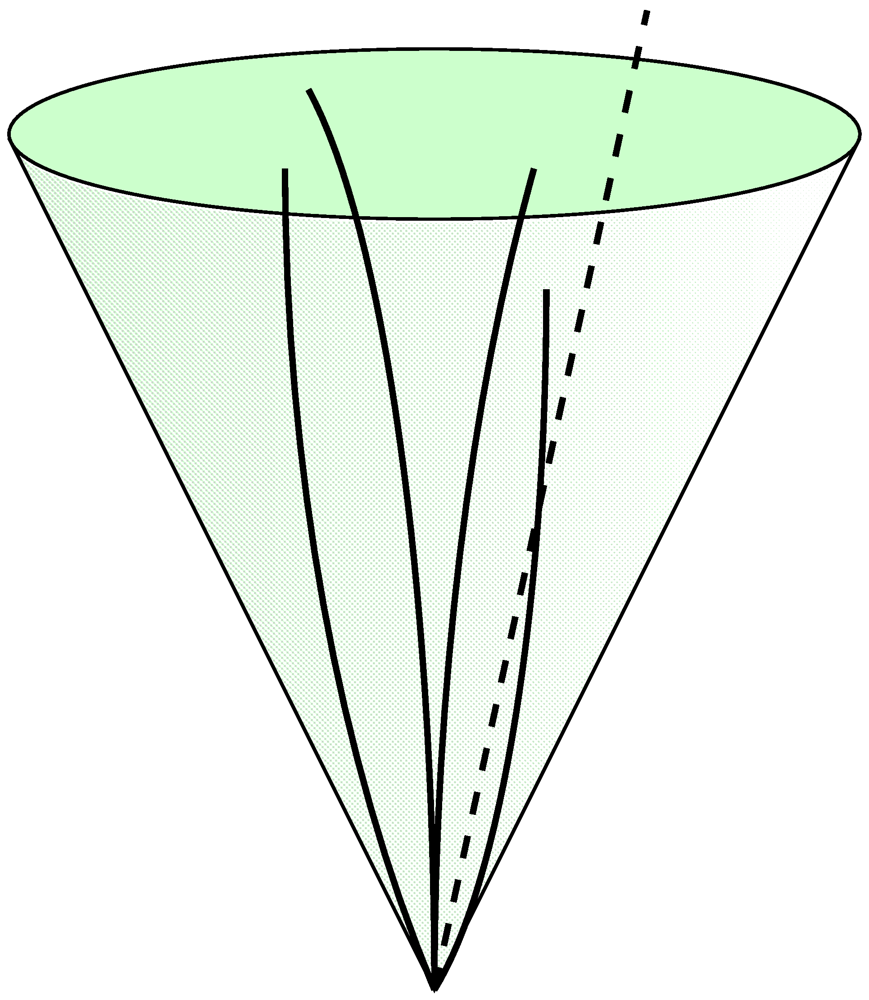

  * [3d-physics-jet-cones+3d+physics.tex](https://github.com/walmes/Tikz/blob/master/src/3d-physics-jet-cones+3d+physics.pgf)

```tex
% https://wiki.physik.uzh.ch/cms/latex:tikz:jet_cones
\documentclass{article}

\usepackage{amsmath} % for \dfrac
\usepackage{tikz}

\usepackage{tikz-3dplot}
\tikzset{>=latex} % for LaTeX arrow head
\usetikzlibrary{decorations.pathmorphing} % for snake

% colors
\definecolor{mylightred}{RGB}{255,200,200}
\definecolor{myblue}{RGB}{172,188,63}
\definecolor{mylightgreen}{RGB}{150,220,150}


% split figures into pages
\usepackage[active,tightpage]{preview}
\PreviewEnvironment{tikzpicture}
\setlength\PreviewBorder{1pt}%

\begin{document}
	

	% TikZ code
	% 2D CONE
	\begin{tikzpicture}%,scale=0.85
	
	% cone variables
	\def\x{2.0}
	\def\y{4.0}
	\def\R{\x}
	\def\yc{\y+0.02}
	\def\e{0.4}
	
	% cone shades + frame
	\shade[right color=white,left color=mylightgreen,opacity=0.3]
	(-\x,\yc) -- (-2,4) arc (180:360:{\R} and \e) -- (\x,\yc) -- (0,0) -- cycle;
	\draw[fill=green,opacity=0.2]
	(0,\yc) circle ({\R} and \e);
	\draw
	(-\x,\y) -- (0,0) -- (\x,\y);
	\draw
	(0,\yc) circle ({\R} and \e);
	
	% tracks
	\draw[thick]
	(0,0) arc (320:360:-3 and 6.0); %node[above] {1};
	\draw[thick]
	(0,0) arc (-70:  0:0.8 and 3.5); %node[above] {2};
	\draw[thick]
	(0,0) arc (  0: 70:0.9 and 4.5); %node[above] {3};
	\draw[thick]
	(0,0) arc (180:140:2 and 6.0); %node[above] {4};
	\draw[thick,dashed]
	(0,0) -- (1,4.6);
	
\end{tikzpicture}
	
	
	
	% BOOSTED TAU
	\begin{tikzpicture}
	
	% AK8 variables
	\def\x{2.4}
	\def\y{3.5}
	\def\R{\x+0.02}
	\def\yc{\y+0.08}
	\def\e{0.6}
	
	% AK8 cone
	\shade[right color=white,left color=blue,opacity=0.2]
	(-\x,\y) -- (-\x,\yc) arc (180:360:{\R} and \e) -- (\x,\y) -- (0,0) -- cycle;
	%\shade[right color=white,left color=blue,opacity=0.2]
	%(0,\yc) circle ({\R} and \e);
	%(-\x,\yc) -- ( \x,\yc) arc ( -2:182:{\R} and \e) -- (\x,\yc) -- (0,0) -- cycle;
	\draw[fill=blue,opacity=0.2]
	(0,\yc) circle ({\R} and \e);
	\draw
	(-\x,\y) -- (0,0) -- (\x,\y);
	\draw
	(0,\yc) circle ({\R} and \e);
	
	% AK4 variables
	\def\x{1.0}
	\def\y{4.0}
	\def\R{\x+0.005}
	\def\yc{\y+0.04}
	\def\e{0.4}
	
	% AK4 cone 1
	\begin{scope}[rotate=12]
	\shade[right color=white,left color=green,opacity=0.3]
	(-\x,\yc) -- (-\x,\yc) arc (180:360:{\R} and \e) -- (\x,\yc) -- (0,0) -- cycle;
	\draw[fill=green,opacity=0.2]
	(0,\yc) circle ({\R} and \e);
	\draw
	(-\x,\y) -- (0,0) -- (\x,\y);
	\draw
	(0,\yc) circle ({\R} and \e);
	\end{scope}
	
	% AK4 cone 2
	\begin{scope}[rotate=-10]
	\shade[right color=white,left color=red,opacity=0.3]
	(-\x,\yc) -- (-\x,\yc) arc (180:360:{\R} and \e) -- (\x,\yc) -- (0,0) -- cycle;
	\draw[fill=red,opacity=0.2]
	(0,\yc) circle ({\R} and \e);
	\draw
	(-\x,\y) -- (0,0) -- (\x,\y);
	\draw
	(0,\yc) circle ({\R} and \e);
	\end{scope}
	

\end{tikzpicture}

\end{document}
```
****


  * [3d-seismic_focal_mechanism+3d+set+foreach+eng.tex](https://github.com/walmes/Tikz/blob/master/src/3d-seismic_focal_mechanism+3d+set+foreach+eng.pgf)

```tex
% http://www.texample.net/media/tikz/examples/TEX/seismic-focal-mechanism-in-3d-view.tex
% Title: Seismic focal mechanism in 3D view.
% Author: Cyril Langlois
% Source:  Jacques Duma
% Site: http://math.et.info.free.fr/TikZ/index.html
%
% Adaptation for LaTeX of a figure proposed in P. Shearer's book 'Introduction
% to Seismology'.
%
% It shows the focal sphere with the fault plane and auxiliary plane (which can
% not be discriminate), limiting compression and dilatation quadrants, the first
% movement of the rock through the sphere, and the Pression and Tension axis.
%
% The figure is based on the sphere drawing's code proposed by J. Dumas in is
% book 'Tikz pour l'impatient', available online.

\documentclass[11pt]{article}
\usepackage{tikz}
\usepackage{tikz-3dplot}
%%%<
\usepackage{verbatim}
\usepackage[active,tightpage]{preview}
\PreviewEnvironment{tikzpicture}
\setlength\PreviewBorder{5pt}%
%%%>

\begin{comment}
:Title: Seismic focal mechanism in 3D view.
:Tags: 3D; Earth Sciences ; Geophysics; Seismology
:Author: Cyril Langlois
:Source: http://math.et.info.free.fr/TikZ/index.html

Adaptation for LaTeX of a figure proposed in P. Shearer's book 'Introduction to Seismology'. 

It shows the focal sphere with the fault plane and auxiliary plane (which can
not be discriminate), limiting compression and dilatation quadrants, the first
movement of the rock through the sphere, and the Pression and Tension axis.

The figure is based on the sphere drawing's code proposed by J. Dumas in is
book `Tikz pour l'impatient <http://math.et.info.free.fr/TikZ/>`_, available online.

\end{comment}

%%%%%%%%%%%
%% helper macros
%: Styles for XYZ-Coordinate Systems
%: isometric  South West : X , South East : Y , North : Z
\tikzset{isometricXYZ/.style={x={(-0.866cm,-0.5cm)}, y={(0.866cm,-0.5cm)}, z={(0cm,1cm)}}}

%: isometric South West : Z , South East : X , North : Y
\tikzset{isometricZXY/.style={x={(0.866cm,-0.5cm)}, y={(0cm,1cm)}, z={(-0.866cm,-0.5cm)}}}

%: isometric South West : Y , South East : Z , North : X
\tikzset{isometricYZX/.style={x={(0cm,1cm)}, y={(-0.866cm,-0.5cm)}, z={(0.866cm,-0.5cm)}}}

%% document-wide tikz options and styles
\begin{document}
\begin{tikzpicture} [scale=4, isometricZXY, line join=round,
        opacity=.75, text opacity=1.0,%
        >=latex,
        inner sep=0pt,%
        outer sep=2pt,%
    ]
    \def\h{5}

    \newcommand{\quadrant}[2]{
        \foreach \t in {#1} \foreach \f in {175,165,...,5}
            \draw [fill=#2]
                  ({sin(\f - \h)*cos(\t - \h)}, {sin(\f - \h)*sin(\t - \h)}, {cos(\f - \h)})
               -- ({sin(\f - \h)*cos(\t + \h)}, {sin(\f - \h)*sin(\t + \h)}, {cos(\f - \h)})
               -- ({sin(\f + \h)*cos(\t + \h)}, {sin(\f + \h)*sin(\t + \h)}, {cos(\f + \h)})
               -- ({sin(\f + \h)*cos(\t - \h)}, {sin(\f + \h)*sin(\t - \h)}, {cos(\f + \h)})
               -- cycle;
    }

    %Quadrants
    \quadrant{220,230,...,300}{black}
    \quadrant{-60,-50,...,20}{white}
    \quadrant{30,40,...,120}{black}
    \quadrant{130,140,...,210}{none}

    %Movement arrows
    \foreach \t in {225,235,...,295}
        \foreach \f in {50,40,...,0}
            \draw [red, opacity=1.0, ->, thick]
                ({sin(\f - \h)*cos(\t - \h)}, {sin(\f - \h)*sin(\t - \h)}, {cos(\f - \h)})
                -- ({(1 + 0.2*cos(90 - \f))*sin(\f - \h)*cos(\t - \h)},
                    {(1 + 0.2*cos(90 - \f))*sin(\f - \h)*sin(\t - \h)},
                    {(1 + 0.2*cos(90 - \f))*cos(\f - \h)});

    \foreach \t in {125,135,...,205}
        \foreach \f in {110,100,...,0}
            \draw [black, ->, thick]
                ({(1 + 0.2*cos(90 - \f))*sin(\f - \h)*cos(\t - \h)},
                 {(1 + 0.2*cos(90 - \f))*sin(\f - \h)*sin(\t - \h)},
                 {(1 + 0.2*cos(90 - \f))*cos(\f - \h)})
                -- ({sin(\f - \h)*cos(\t - \h)},{sin(\f - \h)*sin(\t - \h)},{cos(\f - \h)});
    \foreach \t in {35,45,...,115}
        \foreach \f in {130,120,...,0}
            \draw [red, opacity=1.0 ,->, thick]
                ({sin(\f - \h)*cos(\t - \h)}, {sin(\f - \h)*sin(\t - \h)}, {cos(\f - \h)})
                -- ({(1 + 0.2*cos(90 - \f))*sin(\f - \h)*cos(\t - \h)},
                    {(1 + 0.2*cos(90 - \f))*sin(\f - \h)*sin(\t - \h)},
                    {(1 + 0.2*cos(90 - \f))*cos(\f - \h)});

    \foreach \t in {-55,-45,...,25}
        \foreach \f in {130,120,...,0}
            \draw [black, ->, thick]
                ({(1 + 0.2*cos(90 - \f))*sin(\f - \h)*cos(\t - \h)},
                 {(1 + 0.2*cos(90 - \f))*sin(\f - \h)*sin(\t - \h)},
                 {(1 + 0.2*cos(90 - \f))*cos(\f - \h)})
              -- ({sin(\f - \h)*cos(\t - \h)},{sin(\f - \h)*sin(\t - \h)},{cos(\f - \h)});

    %Annotations
    \path ({1.5*sin(100)*cos(75)}, {1.5*sin(100)*sin(75)}, {1.5*cos(100)}) node [right] {Compression};
    \path ({1.5*sin(70)*cos(-15)}, {1.5*sin(70)*sin(-15)}, {1.5*cos(70)})  node [right] {Dilatation};
    \path ({1.25*sin(50)*cos(165)},{1.25*sin(50)*sin(165)},{1.25*cos(50)}) node [left]  {Dilatation};
    \path ({1.25*sin(30)*cos(255)},{1.25*sin(30)*sin(255)},{1.25*cos(30)}) node [left]  {Compression};

    %P and T axis
    \begin{scope}[ultra thick]
        \draw[->] ({1.75*sin(90)*cos(75)}, {1.75*sin(90)*sin(75)}, {1.75*cos(90)})
            -- ({2*sin(90)*cos(75)},{2*sin(90)*sin(75)},{2*cos(90)}) node [above] {T-axis};
        \draw[->] ({1.75*sin(90)*cos(255)},{1.75*sin(90)*sin(255)},{1.75*cos(90)})
            -- ({2*sin(90)*cos(255)},{2*sin(90)*sin(255)},{2*cos(90)}) node [below] {T-axis};
        \draw[<-] ({1.5*sin(90)*cos(-15)}, {1.5*sin(90)*sin(-15)}, {1.5*cos(90)})
            -- ({1.75*sin(90)*cos(-15)},{1.75*sin(90)*sin(-15)},{1.75*cos(90)}) node [right] {P-axis};
        \draw[<-] ({1.5*sin(90)*cos(165)}, {1.5*sin(90)*sin(165)}, {1.5*cos(90)})
            -- ({1.75*sin(90)*cos(165)},{1.75*sin(90)*sin(165)},{1.75*cos(90)}) node [left] {P-axis};
    \end{scope}

    % Label
    \node [anchor=north, yshift=-2mm] at (current bounding box.south)
        {Seismic focal mechanism and Pression-Tension axis.};
\end{tikzpicture}
\end{document}
```
****


  * [3d-solid-of-revolution.tex](https://github.com/walmes/Tikz/blob/master/src/3d-solid-of-revolution.pgf)

```tex
% https://github.com/MartinThoma/LaTeX-examples/blob/master/tikz/solid-of-revolution/solid-of-revolution.tex
% Author: Marco Miani
\documentclass[varwidth=true, border=2pt]{standalone}

\usepackage{pgfplots}
\pgfplotsset{compat=1.9}

\begin{document}
    \pgfplotsset{
        colormap={whitered}{
            color(0cm)=(white);
            color(1cm)=(orange!75!red)
        }
        %colormap={color}{color(0cm)=(white); color(1cm)=(blue)}
    }
    \begin{tikzpicture}
     \begin{axis}[view={60}{30}]
      \addplot3[surf,
      samples=50,
      domain=1:2,y domain=0:2*pi,
      z buffer=sort]
      %({(2 + tan(deg(y)))*cos((deg(x)))}, {(2 + cos(x)) * sin(x)}, {x});
      ({x * cos(deg(y))}, {x * sin(deg(y))}, {1/x});
     \end{axis}
    \end{tikzpicture}
\end{document}
```
****

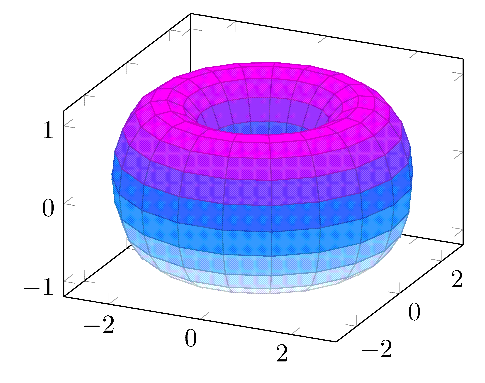

  * [3d-torus+function+3d.tex](https://github.com/walmes/Tikz/blob/master/src/3d-torus+function+3d.pgf)

```tex
% 3d-torus.tex
\documentclass[border=5pt]{standalone}
%%%<
\usepackage{verbatim}
%%%>
\usepackage{pgfplots}
\pgfplotsset{width=7cm,compat=1.8}

\begin{comment}
:Title: Torus
:Tags: Surface plots
:Author: cmhughes
:Slug: torus

For drawing a torus, we can parametrize the surface as (for example)

x(t,s) = (2+cos(t))*cos(s+pi/2) 
y(t,s) = (2+cos(t))*sin(s+pi/2) 
z(t,s) = sin(t)

where both t and s take values on [0,2pi].

This code was written by cmhughes on TeX.SE.
\end{comment}

\begin{document}
\begin{tikzpicture}
  \begin{axis}
     \addplot3[
         surf,
         colormap/cool,
         samples=20,
         domain=0:2*pi,
         y domain=0:2*pi,
         z buffer=sort
       ]
       ( {(2+cos(deg(x)))*cos(deg(y+pi/2))}, 
         {(2+cos(deg(x)))*sin(deg(y+pi/2))}, 
         {sin(deg(x))}
       );
  \end{axis}
\end{tikzpicture}
\end{document}
```
****


  * [animation-dynamic_labels.tex](https://github.com/walmes/Tikz/blob/master/src/animation-dynamic_labels.pgf)

```tex
% https://tex.stackexchange.com/a/347917/173708
% create the gif with:
% convert -delay 0 -density 120 animation-dynamic_labels.pdf animation-dynamic_labels.gif
\documentclass[tikz]{standalone}
\begin{document}
\foreach {\tangle} in {80,79,...,10}{
  \pgfmathsetmacro{\sangle}{-\tangle}
  \begin{tikzpicture}[auto]
    % constants
    \def\rinn{2}
    \def\rout{3.8}

    % just to fix the global bounding box
    \path circle[radius=\rout cm+5mm+2em];

    \draw (0,0) circle [radius=\rinn];
    \draw (0,0) circle [radius=\rout];

    \coordinate (T1) at (\tangle:\rinn);
    \coordinate (T2) at (\tangle:\rout);
    \coordinate (S1) at (\sangle:\rinn);
    \coordinate (S2) at (\sangle:\rout);

    \draw (0,0) -- (T1) -- (T2);
    \draw (0,0) -- (S1) -- (S2);

    \path (T1) ++(\tangle+45:5mm) node{T1};
    \path (T2) ++(\tangle+45:5mm) node{T2};
    \path (S1) ++(\sangle-45:5mm) node{S1};
    \path (S2) ++(\sangle-45:5mm) node{S2};

  \end{tikzpicture}
}
\end{document}
```
****


  * [box_arrows+diagram.tex](https://github.com/walmes/Tikz/blob/master/src/box_arrows+diagram.pgf)

```tex
% https://tex.stackexchange.com/a/52766/173708
\documentclass{standalone}
\usepackage{tikz}
\usetikzlibrary{shapes,positioning,arrows,calc}

\begin{document}

\begin{tikzpicture}[stack/.style={
  rectangle split, rectangle split parts=5, draw, anchor=center},
  myarrow/.style={single arrow, draw=none}]

\node [stack] (ini)  {$a=0$\nodepart{two}$b=10$%
   \nodepart{three}$c=100$\nodepart{four}$d=-10$\nodepart{five}$\cdots$};

\node [draw,rectangle,align=left,right=of ini,label=above:{Computer Program}] (mid)
  {instruction 0;\\ instruction 1;\\$\ldots$\\instruction $n$;};

\node [stack,right=of mid] (fin) {$a=10$\nodepart{two}$b=100$%
  \nodepart{three}$c=-10$\nodepart{four}$d=110$\nodepart{five}$\cdots$};

\node [above=of ini,anchor=north,align=left] {Initial values of\\variables};
\node [above=of fin,anchor=north,align=left] {Final values of\\variables};

\node [myarrow,draw,anchor=west] at ($(ini.east)+(2.5pt,0)$) {\phantom{te}} ;
\node [myarrow,draw,anchor=west] at ($(mid.east)+(2.5pt,0)$) {\phantom{te}} ;

\end{tikzpicture}

\end{document}
```
****

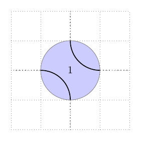

  * [circle_custom_with_arcs+symbol+geometry.tex](https://github.com/walmes/Tikz/blob/master/src/circle_custom_with_arcs+symbol+geometry.pgf)

```tex
% https://tex.stackexchange.com/questions/33150/creating-node-shapes?rq=1
\documentclass[border=10pt]{standalone}

\usepackage{tikz}

\makeatletter
\tikzset{arc style/.initial={}}
\pgfdeclareshape{circle with arcs}{
    \inheritsavedanchors[from=circle]
    \inheritanchorborder[from=circle]

    \inheritanchor[from=circle]{center}
    \inheritanchor[from=circle]{south}
    \inheritanchor[from=circle]{west}
    \inheritanchor[from=circle]{north}
    \inheritanchor[from=circle]{east}
    % etc.

    \inheritbackgroundpath[from=circle]

    \beforebackgroundpath{
        % get and set options
        \pgfkeys{/tikz/arc style/.get=\tmp}
        \expandafter\tikzset\expandafter{\tmp}
        \tikz@options

        % get radius length and center coordinates
        \radius \pgf@xa=\pgf@x
        \centerpoint \pgf@xb=\pgf@x \pgf@yb=\pgf@y

        % draw arc starting from north
        \advance\pgf@yb by\pgf@xa
        \pgfpathmoveto{\pgfpoint{\pgf@xb}{\pgf@yb}}
        \pgfpatharc{180}{270}{\pgf@xa}

        % draw arc starting from south
        \advance\pgf@yb by -2\pgf@xa
        \pgfpathmoveto{\pgfpoint{\pgf@xb}{\pgf@yb}}
        \pgfpatharc{0}{90}{\pgf@xa}

        \pgfusepath{draw}
    }
}
\makeatother

\begin{document}
\begin{tikzpicture}
    \draw[help lines, gray, dotted] (-2,-2) grid (2,2);
    \node[
        circle with arcs,
        draw=gray,
        fill=blue!20,
        minimum width=2cm,
        arc style={black,thick}
        ] (c) {1};
    \draw[thick,gray,dotted]
        (c.north) -- +(0,1)
        (c.east)  -- +(1,0)
        (c.south) -- +(0,-1)
        (c.west)  -- +(-1,0);
\end{tikzpicture}
\end{document}
```
****


  * [class_diagram+diagram.tex](https://github.com/walmes/Tikz/blob/master/src/class_diagram+diagram.pgf)

```tex
% Class diagram
% Author: Remus Mihail Prunescu
\documentclass{minimal}
\usepackage[a4paper,margin=1cm,landscape]{geometry}
\usepackage{tikz}

%%%<
\usepackage{verbatim}
\usepackage[active,tightpage]{preview}
\PreviewEnvironment{tikzpicture}
\setlength\PreviewBorder{5pt}%
%%%>

\begin{comment}
:Title:  Class diagram

\end{comment}
\usetikzlibrary{positioning,shapes,shadows,arrows}

\begin{document}
\tikzstyle{abstract}=[rectangle, draw=black, rounded corners, fill=blue!40, drop shadow,
        text centered, anchor=north, text=white, text width=3cm]
\tikzstyle{comment}=[rectangle, draw=black, rounded corners, fill=green, drop shadow,
        text centered, anchor=north, text=white, text width=3cm]
\tikzstyle{myarrow}=[->, >=open triangle 90, thick]
\tikzstyle{line}=[-, thick]
        
\begin{center}
\begin{tikzpicture}[node distance=2cm]
    \node (Item) [abstract, rectangle split, rectangle split parts=2]
        {
            \textbf{ITEM}
            \nodepart{second}name
        };
    \node (AuxNode01) [text width=4cm, below=of Item] {};
    \node (Component) [abstract, rectangle split, rectangle split parts=2, left=of AuxNode01]
        {
            \textbf{COMPONENT}
            \nodepart{second}nil
        };
    \node (System) [abstract, rectangle split, rectangle split parts=2, right=of AuxNode01]
        {
            \textbf{SYSTEM}
            \nodepart{second}parts
        };
    \node (AuxNode02) [text width=0.5cm, below=of Component] {};
    \node (Sensor) [abstract, rectangle split, rectangle split parts=2, left=of AuxNode02]
        {
            \textbf{SENSOR}
            \nodepart{second}nil
        };
    \node (Part) [abstract, rectangle split, rectangle split parts=2, right=of AuxNode02]
        {
            \textbf{PART}
            \nodepart{second}nil
        };
        
    \node (AuxNode03) [below=of Sensor] {};
    \node (Pressure) [abstract, rectangle split, rectangle split parts=2, left=of AuxNode03, xshift=2cm]
        {
            \textbf{Pressure}
            \nodepart{second}nil
        };
    \node (Temperature) [abstract, rectangle split, rectangle split parts=2, right=of AuxNode03, xshift=-2cm]
        {
            \textbf{Temperature}
            \nodepart{second}nil
        };
    \node (PressureInstants) [comment, rectangle split, rectangle split parts=2, below=0.2cm of Pressure, text justified]
        {
            \textbf{Instants}
            \nodepart{second}fw-p-suction\newline fw-p-delivery\newline fw-p-loop\newline sw-p-suction\newline sw-p-delivery
                \newline sw-p-loop
        };
    \node (ClOp) [abstract, rectangle split, rectangle split parts=2, below=0.4cm of PressureInstants]
        {
            \textbf{Closed/Open}
            \nodepart{second}nil
        };
    \node (ClOpInstants) [comment, rectangle split, rectangle split parts=2, below=0.2cm of ClOp, text justified]
        {
            \textbf{Instants}
            \nodepart{second}fw-clop-warm-up\newline sw-clop-control
        };
    \node (TemperatureInstants) [comment, rectangle split, rectangle split parts=2, below=0.2cm of Temperature, text justified]
        {
            \textbf{Instants}
            \nodepart{second}fw-t-engine\newline fw-t-heat-exch.\newline sw-t-heat-exch.
        };
    \node (Level) [abstract, rectangle split, rectangle split parts=2, below=0.4cm of TemperatureInstants]
        {
            \textbf{Level}
            \nodepart{second}nil
        };
    \node (LevelInstants) [comment, rectangle split, rectangle split parts=2, below=0.2cm of Level, text justified]
        {
            \textbf{Instants}
            \nodepart{second}fw-l-tank
        };
    \node (Ammeter) [abstract, rectangle split, rectangle split parts=2, below=0.4cm of LevelInstants]
        {
            \textbf{Ammeter}
            \nodepart{second}nil
        };
    \node (AmmeterInstants) [comment, rectangle split, rectangle split parts=2, below=0.2cm of Ammeter, text justified]
        {
            \textbf{Instants}
            \nodepart{second}fw-pump-ammeter\newline sw-pump-ammeter
        };
        
    \node (AuxNode04) [below=of Part] {};
    \node (Pump) [abstract, rectangle split, rectangle split parts=2, left=of AuxNode04, xshift=2cm]
        {
            \textbf{Pump}
            \nodepart{second}nil
        };
    \node (Valve) [abstract, rectangle split, rectangle split parts=2, right=of AuxNode04, xshift=-2cm]
        {
            \textbf{Valve}
            \nodepart{second}nil
        };
    \node (PumpInstants) [comment, rectangle split, rectangle split parts=2, below=0.2cm of Pump, text justified]
        {
            \textbf{Instants}
            \nodepart{second}fw-pump\newline sw-pump
        };
    \node (Tank) [abstract, rectangle split, rectangle split parts=2, below=0.4cm of PumpInstants]
        {
            \textbf{Tank}
            \nodepart{second}nil
        };
    \node (ValveInstants) [comment, rectangle split, rectangle split parts=2, below=0.2cm of Valve, text justified]
        {
            \textbf{Instants}
            \nodepart{second}fw-suction-valve\newline fw-delivery-valve\newline sw-suction-valve\newline sw-delivery-valve
                \newline sw-discharge-valve\newline sw-control-valve
        };
    \node (Engine) [abstract, rectangle split, rectangle split parts=2, below=0.4cm of ValveInstants]
        {
            \textbf{Engine}
            \nodepart{second}nil
        };
    \node (TankInstants) [comment, rectangle split, rectangle split parts=2, below=0.2cm of Tank, text justified]
        {
            \textbf{Instants}
            \nodepart{second}fw-expansion-tank
        };
    \node (HeatExchanger) [abstract, rectangle split, rectangle split parts=2, below=0.4cm of TankInstants]
        {
            \textbf{Heat Exchanger}
            \nodepart{second}nil
        };
    \node (HeatExchangerInstants) [comment, rectangle split, rectangle split parts=2, below=0.2cm of HeatExchanger, text justified]
        {
            \textbf{Instants}
            \nodepart{second}fw-heat-exchanger
        };
    \node (EngineInstants) [comment, rectangle split, rectangle split parts=2, below=0.2cm of Engine, text justified]
        {
            \textbf{Instants}
            \nodepart{second}fw-engine
        };
    \node (Strainer) [abstract, rectangle split, rectangle split parts=2, below=0.4cm of HeatExchangerInstants]
        {
            \textbf{Strainer}
            \nodepart{second}nil
        };
    \node (StrainerInstants) [comment, rectangle split, rectangle split parts=2, below=0.2cm of Strainer, text justified]
        {
            \textbf{Instants}
            \nodepart{second}sw-strainer
        };
    \node (Coolant) [abstract, rectangle split, rectangle split parts=2, below=0.4cm of EngineInstants]
        {
            \textbf{Coolant}
            \nodepart{second}nil
        };
    \node (CoolantInstants) [comment, rectangle split, rectangle split parts=2, below=0.2cm of Coolant, text justified]
        {
            \textbf{Instants}
            \nodepart{second}fw-coolant\newline sw-coolant
        };  

    \node (AuxNode05) [below=of System] {};
    \node (CoolingSystem) [abstract, rectangle split, rectangle split parts=2, left=of AuxNode05, xshift=2cm]
        {
            \textbf{Cooling System}
            \nodepart{second}nil
        };
    \node (CoolingLoop) [abstract, rectangle split, rectangle split parts=2, right=of AuxNode05, xshift=-2cm]
        {
            \textbf{Cooling Loop}
            \nodepart{second}nil
        };
    \node (CoolingSystemInstants) [comment, rectangle split, rectangle split parts=2, below=0.2cm of CoolingSystem, text justified]
        {
            \textbf{Instants}
            \nodepart{second}cool
        };
    \node (CoolingLoopInstants) [comment, rectangle split, rectangle split parts=2, below=0.2cm of CoolingLoop, text justified]
        {
            \textbf{Instants}
            \nodepart{second}fw-loop\newline sw-loop
        };
    
    \draw[myarrow] (Component.north) -- ++(0,0.8) -| (Item.south);
    \draw[line] (Component.north) -- ++(0,0.8) -| (System.north);
    
    \draw[myarrow] (Sensor.north) -- ++(0,0.8) -| (Component.south);
    \draw[line] (Sensor.north) -- ++(0,0.8) -| (Part.north);
    
    \draw[line] (Pressure.west) -- ++(-0.2,0);
    \draw[line] (Temperature.east) -- ++(0.2,0);
    \draw[line] (Level.east) -- ++(0.2,0);
    \draw[myarrow] (ClOp.west) -- ++(-0.2,0) -- ([yshift=0.5cm, xshift=-0.2cm] Pressure.north west) -|
     ([xshift=-1cm]Sensor.south);
    \draw[myarrow] (Ammeter.east) -- ++(0.2,0) -- ([yshift=0.5cm, xshift=0.2cm] Temperature.north east) -|
     ([xshift=1cm]Sensor.south);
     
    \draw[line] (Tank.west) -- ++(-0.2,0);
    \draw[line] (HeatExchanger.west) -- ++(-0.2,0);
    \draw[line] (Pump.west) -- ++(-0.2,0);
    \draw[line] (Valve.east) -- ++(0.2,0);
    \draw[line] (Engine.east) -- ++(0.2,0);
    \draw[myarrow] (Strainer.west) -- ++(-0.2,0) -- ([yshift=0.5cm, xshift=-0.2cm] Pump.north west) -|
     ([xshift=-1cm]Part.south);
    \draw[myarrow] (Coolant.east) -- ++(0.2,0) -- ([yshift=0.5cm, xshift=0.2cm] Valve.north east) -|
     ([xshift=1cm]Part.south);
     
    \draw[myarrow] (CoolingSystem.north) -- ++(0,0.8) -| (System.south);
    \draw[line] (CoolingSystem.north) -- ++(0,0.8) -| (CoolingLoop.north);
        
        
\end{tikzpicture}
\end{center}
\end{document}
```
****


  * [colorized_equation+equation.tex](https://github.com/walmes/Tikz/blob/master/src/colorized_equation+equation.pgf)

```tex
% https://www.overleaf.com/read/cvmtqywqgvvw#/43203532/
% https://betterexplained.com/articles/colorized-math-equations/

% \documentclass{article}
\documentclass[preview]{standalone}
\usepackage[utf8]{inputenc}
\usepackage{amsmath}
\usepackage{amssymb}
\usepackage{color}

\newcommand{\plain}{\color{black}}
\newcommand{\Frac}[2]{\genfrac{}{}{1pt}{}{#1}{#2}}	% thicker fraction line

\definecolor{c1}{RGB}{114,0,172}   % primary
\definecolor{c2}{RGB}{45,177,93}   % true
\definecolor{c3}{RGB}{251,0,29}    % false
\definecolor{c4}{RGB}{18,110,213}  % secondary
\definecolor{c5}{RGB}{255,160,109} % tertiary
\definecolor{c6}{RGB}{219,78,158}  % alt-primary 

\renewcommand{\familydefault}{\sfdefault}

\begin{document}
\begin{center}

\newcommand{\growth}{\color{c1}}
\newcommand{\unitQuantity}{\color{c2}}
\newcommand{\unitInterest}{\color{c3}}
\newcommand{\unitTime}{\color{c4}}
\newcommand{\perfectly}{\color{c5}}
\newcommand{\compounded}{\color{c6}}

$$\growth e
\plain =
\perfectly \lim_{n\to\infty}
\plain \left(
\unitQuantity 1 + \unitInterest \frac{1}{\compounded n}
\plain \right)
\unitTime^{1 \cdot \compounded n}
$$

\growth       The base for continuous growth
\plain        is
\\
\unitQuantity the unit quantity 
\unitInterest earning unit interest
\unitTime     for unit time, 
\\
\compounded   compounded
\perfectly    as fast as possible

\end{center}
\end{document}
```
****


  * [cubes_factorials+physics+3d.tex](https://github.com/walmes/Tikz/blob/master/src/cubes_factorials+physics+3d.pgf)

```tex
% include TIKZ_PREAMBLE.pgs
\documentclass[parskip]{scrartcl}

\usepackage{tikz}
\usepackage{pgfplots}

\begin{document}

\tikzset{
  vertex/.style={
    circle, minimum size=20pt, inner sep=0pt, fill=gray!10},
  axial/.style={
    rectangle, minimum size=20pt, inner sep=0pt, fill=gray!30},
  edge/.style={draw,thick,-,black},
  rotu/.style={midway},
  sinal/.style={draw, circle, inner sep=0pt, thin}
}

\def\dist{0.4}
\begin{tikzpicture}[
  scale=2, ->, thick, z={(0.45,0.35)}, node distance=0.65cm]
  \node[vertex] (v0) at (0,0,0) {$(1)$};
  \node[vertex] (v1) at (0,1,0) {$b$};
  \node[vertex] (v2) at (1,0,0) {$a$};
  \node[vertex] (v3) at (1,1,0) {$ab$};
  \node[vertex] (v4) at (0,0,1) {$c$};
  \node[vertex] (v5) at (0,1,1) {$bc$};
  \node[vertex] (v6) at (1,0,1) {$ac$};
  \node[vertex] (v7) at (1,1,1) {$abc$};
  \draw[edge] (v0) -- (v1) node[rotu, left=\dist] {$B$} -- 
    (v3) -- (v2) -- (v0) node[rotu, below=\dist] {$A$};
  \draw[edge] (v0) -- (v4) -- (v5) -- (v1);
  \draw[edge] (v2) -- (v6)
    node[rotu, below right=\dist] {$C$} -- (v7) -- (v3);
  \draw[edge] (v4) -- (v6); \draw[edge] (v5) -- (v7);
  \node[sinal, below of=v0] {$-$};
  \node[sinal, left of=v0] {$-$};
  \node[sinal, left of=v1] {$+$};
  \node[sinal, below of=v2] {$+$};
  \node[sinal, right of=v3] {$-$};
  \node[sinal, right of=v7] {$+$};
\end{tikzpicture}

\def\dist{0.4}
\def\ax{2}
\begin{tikzpicture}[
  scale=2, ->, thick, z={(0.55,0.3)}, node distance=0.65cm]
  \node[vertex, fill=yellow] (c0) at (0,0,0) {$0$};
  \node[vertex] (v0) at (-1,-1,-1) {$(1)$};
  \node[vertex] (v1) at (-1,1,-1) {$b$};
  \node[vertex] (v2) at (1,-1,-1) {$a$};
  \node[vertex] (v3) at (1,1,-1) {$ab$};
  \node[vertex] (v4) at (-1,-1,1) {$c$};
  \node[vertex] (v5) at (-1,1,1) {$bc$};
  \node[vertex] (v6) at (1,-1,1) {$ac$};
  \node[vertex] (v7) at (1,1,1) {$abc$};
  \node[axial] (a1) at (-\ax,0,0) {$W$};
  \node[axial] (a2) at (\ax,0,0) {$W$};
  \node[axial] (a3) at (0,-\ax,0) {$W$};
  \node[axial] (a4) at (0,\ax,0) {$W$};
  \node[axial] (a5) at (0,0,-\ax) {$W$};
  \node[axial] (a6) at (0,0,\ax) {$W$};
  \draw[edge] (v0) -- (v1) node[rotu, left=\dist] {$B$} -- 
    (v3) -- (v2) -- (v0) node[rotu, below=\dist] {$A$};
  \draw[edge] (v0) -- (v4) -- (v5) -- (v1);
  \draw[edge] (v2) -- (v6)
    node[rotu, below right=\dist] {$C$} -- (v7) -- (v3);
  \draw[edge] (v4) -- (v6); \draw[edge] (v5) -- (v7);
  \draw[edge] (a1) -- (c0) --(a2);
  \draw[edge] (a3) -- (c0) --(a4);
  \draw[edge] (a5) -- (c0) --(a6);
  \node[sinal, below of=v0] {$-$};
  \node[sinal, left of=v0] {$-$};
  \node[sinal, left of=v1] {$+$};
  \node[sinal, below of=v2] {$+$};
  \node[sinal, right of=v3] {$-$};
  \node[sinal, right of=v7] {$+$};
\end{tikzpicture}

\begin{tikzpicture}[
  scale=2, ->, thick, z={(0.45,0.35)}, node distance=0.65cm,
  vertex/.style={
    rectangle, minimum size=12pt, inner sep=1pt, fill=gray!10
  }]
  \node[text centered] (title) at (0.7,1.7,0)
    {Rendimento (\%) em um $2^3$};
  \node[vertex] (v0) at (0,0,0) {$54.8$};
  \node[vertex] (v1) at (0,1,0) {$48.0$};
  \node[vertex] (v2) at (1,0,0) {$86.5$};
  \node[vertex] (v3) at (1,1,0) {$63.0$};
  \node[vertex] (v4) at (0,0,1) {$63.0$};
  \node[vertex] (v5) at (0,1,1) {$58.5$};
  \node[vertex] (v6) at (1,0,1) {$93.5$};
  \node[vertex] (v7) at (1,1,1) {$72.0$};
  \draw[edge] (v0) -- (v1)
    node[rotu, rotate=90, yshift=1.2cm] {Catalizador} -- 
    (v3) -- (v2) -- (v0) node[rotu, below=0.9cm] {Temperatura};
  \draw[edge] (v0) -- (v4) -- (v5) -- (v1);
  \draw[edge] (v2) -- (v6)
    node[rotu, rotate=40, yshift=-1cm, xshift=0.5cm]
    {Concentra\c{c}\~ao} -- (v7) -- (v3);
  \draw[edge] (v4) -- (v6); \draw[edge] (v5) -- (v7);
  \node[sinal, below of=v0] {$-$};
  \node[sinal, left of=v0] {$-$};
  \node[sinal, left of=v1] {$+$};
  \node[sinal, below of=v2] {$+$};
  \node[sinal, right of=v3] {$-$};
  \node[sinal, right of=v7] {$+$};
\end{tikzpicture}


\end{document}
```
****

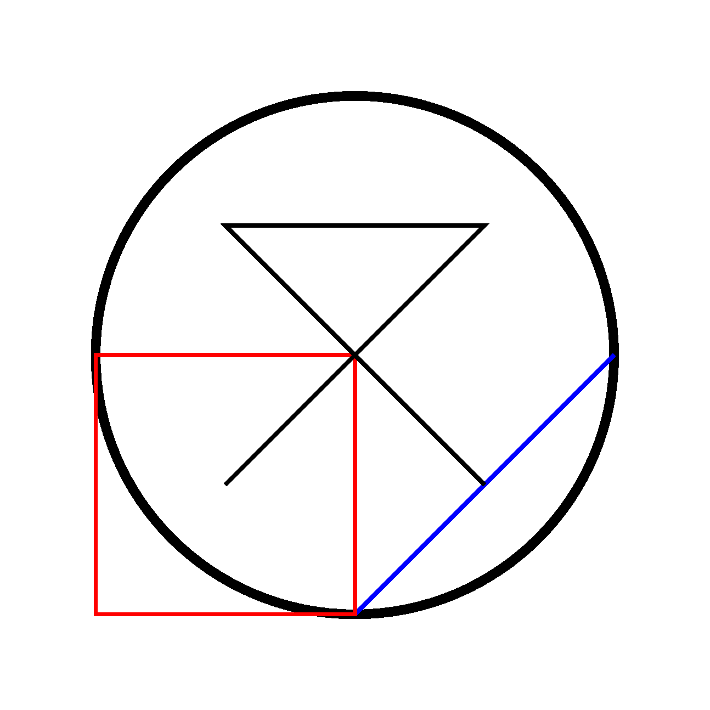

  * [custom-use_library+symbol+pkg.tex](https://github.com/walmes/Tikz/blob/master/src/custom-use_library+symbol+pkg.pgf)

```tex
% https://tex.stackexchange.com/a/247338/173708
% https://tex.stackexchange.com/questions/247202/creating-tikz-libraries?noredirect=1&lq=1
% calls tikzlibraryunitscircle.code.tex
\documentclass[border=10pt]{standalone}
\usepackage{tikz}
\usetikzlibrary{calc}
\usetikzlibrary{unitcircle}   % using  tikzlibraryunitcircle.code.tex
\begin{document}

\begin{tikzpicture}

  \path
              (0,0) pic (LL) {quadrant III}
        -- ++ (1,0) pic (LR) {quadrant IV}
        -- ++ (0,1) pic (UR) {quadrant I}
        -- cycle
        -- ++ (0,1) pic (UL) {quadrant II}
      ;
  \draw[blue] (LR-ne) -- (LR-sw);

  \draw[red] (LL-ne) rectangle (LL-sw);

  \draw (LL-center) -- (UR-center)
                    -- (UL-center)
                    -- (LR-center);
\end{tikzpicture}

\end{document}
```
****

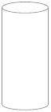

  * [cylinder_with_two_parameters+geometry+style+learn.tex](https://github.com/walmes/Tikz/blob/master/src/cylinder_with_two_parameters+geometry+style+learn.pgf)

```tex
% https://tex.stackexchange.com/a/21396/173708

\documentclass{article}
\usepackage{tikz} 
\usetikzlibrary{shapes}  

% split figures into pages
\usepackage[active,tightpage]{preview}
\PreviewEnvironment{tikzpicture}
\setlength\PreviewBorder{1pt}%


\begin{document}
	
\thispagestyle{empty} 

 \begin{tikzpicture}[
    transformer/.style 2 args={draw, 
    	cylinder, 
    	gray!80, 
    	rotate=90, 
    	minimum height=#1, 
    	minimum width=#2}]

	\node [transformer={2.3cm}{1cm}] () at (0,0.6) {};
\end{tikzpicture}  

% using n args={}{}
 \begin{tikzpicture}[
	transformer2/.style n args={2}{draw, 
		cylinder, 
		gray!50, 
		rotate=45, 
		minimum height=#1, 
		minimum width=#2}]

	\node [transformer2={2.3cm}{1cm}] () at (0,0.6) {};
\end{tikzpicture} 

%\begin{tikzpicture}[
% 	\def\mh{2.3cm}
% 	\def\mw{1cm} 	
%	transformer3/.style args={mh, mw}{draw, 
%		cylinder, 
%		gray!50, 
%		rotate=45, 
%		minimum height=mh, 
%		minimum width=mw}]
%
%	\node [transformer3={2.3cm}{1cm}] () at (0,0.6) {};
%\end{tikzpicture} 

\end{document} 
```
****

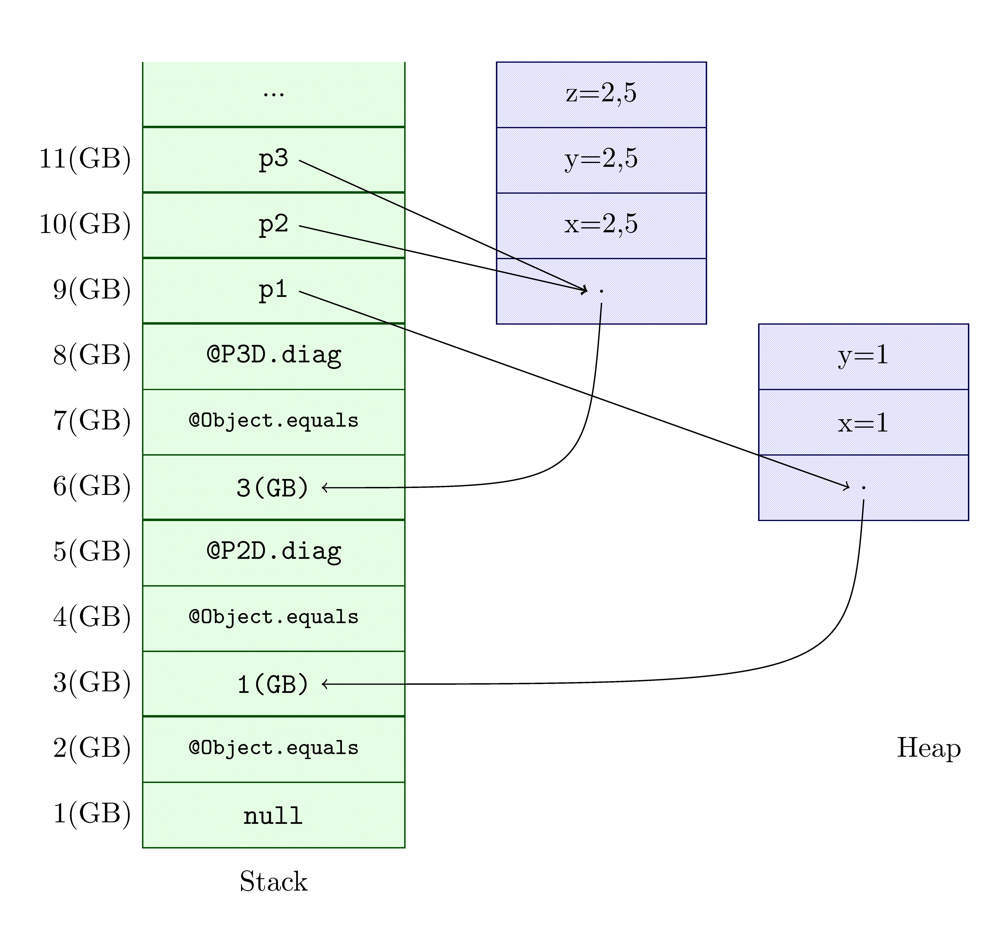

  * [drawstack+diagram.tex](https://github.com/walmes/Tikz/blob/master/src/drawstack+diagram.pgf)

```tex
% https://gitlab.com/tikz-goodies/tikz-goodies/-/blob/master/drawstack/stack-example.tex
\documentclass[tikz,border=10pt]{standalone}

\usepackage{drawstack}

% Use this instead if you don't want colors.
% \usepackage[nocolor]{drawstack}

\title{{\tt drawstack.sty}: Draw execution stack easily in LaTeX}
\author{Matthieu Moy}

\begin{document}
	
\begin{tikzpicture}[scale=.8]

	\stacktop{}
	\separator
	\cell{\texttt{p3}}        \cellcomL{11(GB)} \coordinate (p3) at (currentcell.east);
	\separator
	\cell{\texttt{p2}}        \cellcomL{10(GB)} \coordinate (p2) at (currentcell.east);
	\separator
	\cell{\texttt{p1}}        \cellcomL{ 9(GB)} \coordinate (p1) at (currentcell.east);
	\separator
	\cell{\texttt{@P3D.diag}} \cellcomL{ 8(GB)}
	\cell{\texttt{\footnotesize @Object.equals}} \cellcomL{ 7(GB)}
	\cell{\texttt{3(GB)}}     \cellcomL{ 6(GB)} \coordinate (T1) at (currentcell.east);
	\separator
	\cell{\texttt{@P2D.diag}} \cellcomL{ 5(GB)}
	\cell{\texttt{\footnotesize @Object.equals}} \cellcomL{ 4(GB)}
	\cell{\texttt{1(GB)}}     \cellcomL{ 3(GB)} \coordinate (T2) at (currentcell.east);
	\separator
	\cell{\texttt{\footnotesize @Object.equals}} \cellcomL{ 2(GB)}
	\cell{\texttt{null}}      \cellcomL{ 1(GB)}
	\cell[draw=none]{Stack}
	
	
	\drawstruct{(5,1)})
	\structcell{z=2,5}
	\structcell{y=2,5}
	\structcell{x=2,5}
	\structcell{.} \coordinate (O1) at (currentcell.west);
	\coordinate (O1l) at (currentcell.south);
	
	\drawstruct{(9,-3)}
	\structcell{y=1}
	\structcell{x=1}
	\structcell{.} \coordinate (O2) at (currentcell.west);
	\coordinate (O2l) at (currentcell.south);
	
	\draw[->] (p3) -- (O1);
	\draw[->] (p2) -- (O1);
	\draw[->] (p1) -- (O2);
	
	\draw[->] (O1l) .. controls (O1 |- T1) .. (T1);
	\draw[->] (O2l) .. controls (O2 |- T2) .. (T2);
	
	\draw (10,-10) node{Heap};

\end{tikzpicture}

\end{document}
```
****

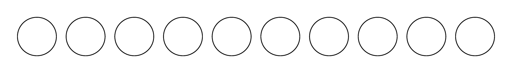

  * [elem-10_circles+elem+foreach.tex](https://github.com/walmes/Tikz/blob/master/src/elem-10_circles+elem+foreach.pgf)

```tex
% modified by +arr
% add label number to each of the circles
\documentclass[crop, border=10pt, tikz]{standalone}

\usepackage{tikz}

\begin{document}

\begin{tikzpicture}
	\foreach \x in {1,...,10} {
		\draw (\x,0) circle (0.4cm) node {\x}; % add label number
		\draw (\x,1) circle (0.4cm) node {\x}; % draw second row
	}
\end{tikzpicture}

\end{document}
```
****

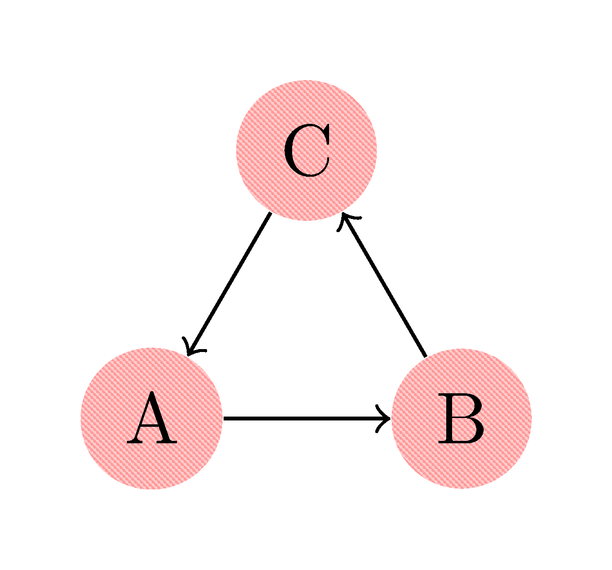

  * [elem-3_nodes_triangle+elem+foreach.tex](https://github.com/walmes/Tikz/blob/master/src/elem-3_nodes_triangle+elem+foreach.pgf)

```tex
% from Helmund slides
\documentclass[tikz,border=10pt]{standalone}
%\documentclass[crop, tikz]{standalone}

\usepackage{tikz}

\begin{document}

\begin{tikzpicture}[scale=.9, transform shape]
	\tikzstyle{every node} = [circle, fill=red!30]
	\node (a) at (0, 0) {A};
	\node (b) at +(0: 1.5) {B};
	\node (c) at +(60: 1.5) {C};
	\foreach \from / \to in {a/b, b/c, c/a}
		\draw [->] (\from) -- (\to);
\end{tikzpicture}

\end{document}
```
****

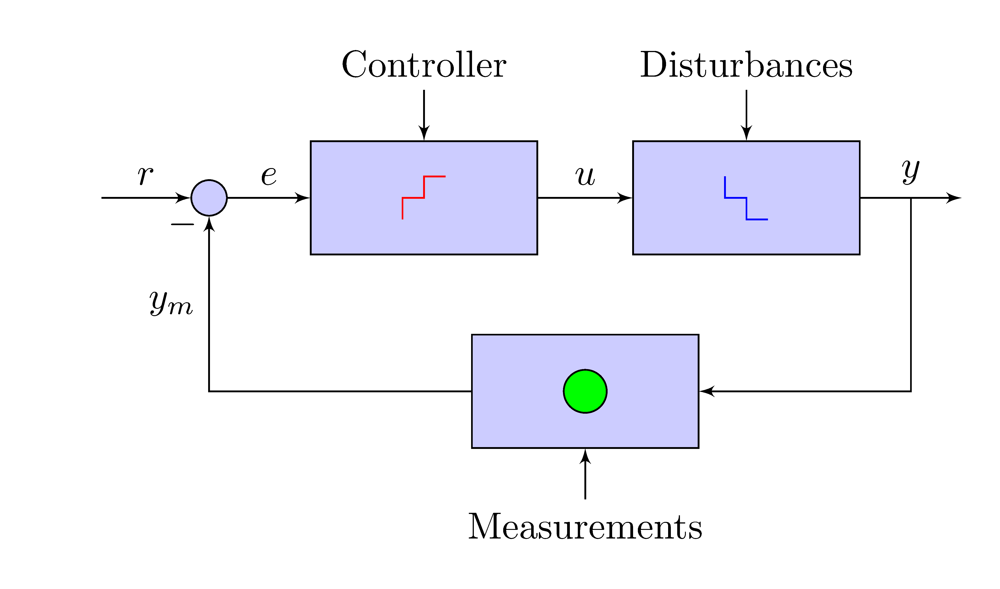

  * [elem-add_tikz_symbols_to_block_arr+symbol+diagram+command+style.tex](https://github.com/walmes/Tikz/blob/master/src/elem-add_tikz_symbols_to_block_arr+symbol+diagram+command+style.pgf)

```tex
\documentclass[border=10]{standalone}
\usepackage{tikz}
\usetikzlibrary{positioning,shapes,arrows}


\newcommand{\symbolA}{
	% red symbol
	\tikz \draw[red] (0,0)--(0,0.2)--(0.2,0.2)--(0.2,0.4)--(0.4,0.4);
}

\newcommand{\symbolB}{
	% blue symbol
	\tikz[y={(0,-1)}] \draw[blue] (0,0)--(0,0.2)--(0.2,0.2)--(0.2,0.4)--(0.4,0.4);
}

\newcommand{\symbolC}{
	% another way to add symbols
	\begin{tikzpicture}
		\draw[fill=green] (0,0) circle (0.2cm);
	\end{tikzpicture}
}

\begin{document}

\tikzstyle{block} = [draw, fill=blue!20,  rectangle, 
    minimum height=3em, minimum width=6em]
\tikzstyle{sum} = [draw, fill=blue!20, circle, node distance=1cm]
\tikzstyle{input} = [coordinate]
\tikzstyle{output} = [coordinate]
\tikzstyle{pinstyle} = [pin edge={to-, thin, black}]

% The block diagram code is probably more verbose than necessary
\begin{tikzpicture}[auto,  node distance=2cm, >=latex']

    % We start by placing the blocks
    \node [input, name=input] {};
    \node [sum, right of=input] (sum) {};
    \node [block, right of=sum] (controller) {\symbolA};
    
    % add label to controller
     \node[above of=controller] (ctrlabel)  [yshift=-0.75cm] {Controller};
     % add arrow from label to box
    \draw[->] (ctrlabel) -- (controller);
    
    % this is option 1: adding label on top
%    \node [block, right of=controller, pin={[pinstyle] above:Disturbances},
%            node distance=3cm] (system) {\symbolB};
	% this option 2: adding label on top
    \node [block, right of=controller, node distance=3cm] (system) {\symbolB};
    % add label "Disturbances" above system
    \node[above of=system] (syslabel) [yshift=-0.75cm] {Disturbances};
    \draw[->] (syslabel) -- (system);

    % We draw an edge between the controller and system block to 
    % calculate the coordinate "u". We need it to place the measurement block. 
    \draw [->] (controller) -- node[name=u] {$u$} (system);
    \node [output, right of=system] (output) {};
    \node [block, below of=u] (measurements) {\symbolC};
    
    % add label to "measurements" block
     \node[below of=measurements] (mealabel) [yshift=0.75cm] {Measurements};
    \draw[->] (mealabel) -- (measurements);
    

    % Once the nodes are placed, connecting them is easy. 
    \draw [draw,->] (input) -- node {$r$} (sum);
    \draw [->] (sum) -- node {$e$} (controller);
    \draw [->] (system) -- node [name=y] {$y$}(output);
    \draw [->] (y) |- (measurements);
%    \draw [->] (measurements) -| node[pos=0.99] {$-$} 
%        node [near end] {$y_m$} (sum);
    \draw [->] (measurements) -|  node  [near end] {$y_m$} (sum);
    \draw (sum) node [yshift=-7, xshift=-7]  {$-$};
\end{tikzpicture}
\end{document}
```
****

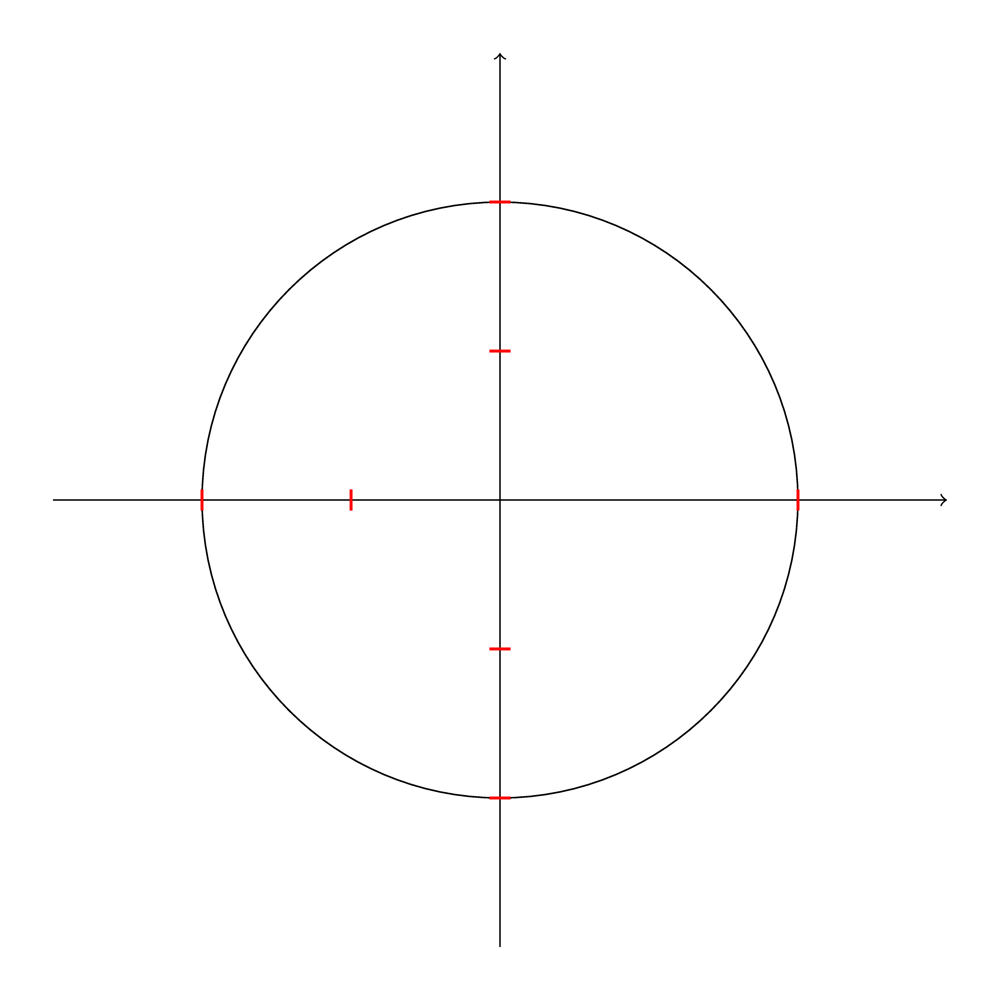

  * [elem-circle_axes_ticks+elem+geometry+foreach.tex](https://github.com/walmes/Tikz/blob/master/src/elem-circle_axes_ticks+elem+geometry+foreach.pgf)

```tex
% modified by +arr
% change tick color and thickness 
%\documentclass[tikz,border=15pt]{standalone}
\documentclass[crop,border=15pt]{standalone}

\usepackage{tikz}

\begin{document}

% ticks on the axes
\begin{tikzpicture}[scale=3]

	% draw the axes
	\draw[->] (-1.5,0) -- (1.5,0);
	\draw[->] (0,-1.5) -- (0,1.5);
	
	% draw the circle
	\draw (0,0) circle (1cm);
	
	% draw the ticks
	\foreach \x in {-1cm,-0.5cm,1cm}
		\draw[red,thick] (\x,-1pt) -- (\x,1pt);
	\foreach \y in {-1cm,-0.5cm,0.5cm,1cm}
		\draw[red, thick] (-1pt,\y) -- (1pt,\y);
		
\end{tikzpicture}

\end{document}
```
****


  * [elem-circle_grided+elem+geometry.tex](https://github.com/walmes/Tikz/blob/master/src/elem-circle_grided+elem+geometry.pgf)

```tex
% +arr: even thinner grid

\documentclass[tikz,border=10pt]{standalone}
%\documentclass[crop, tikz]{standalone}

\usepackage{tikz}

\begin{document}
	
\begin{tikzpicture}
	\draw[step=.5cm,gray!50,very thin] (-1.4,-1.4) grid(1.4,1.4);
	\draw (-1.5,0) -- (1.5,0);
	\draw (0,-1.5) -- (0,1.5);
	\draw (0,0) circle (1cm);
\end{tikzpicture}
	
\end{document}
```
****


  * [elem-circle_half+elem+geometry.tex](https://github.com/walmes/Tikz/blob/master/src/elem-circle_half+elem+geometry.pgf)

```tex
\documentclass[tikz,border=10pt]{standalone}
%\documentclass[crop, tikz]{standalone}

\usepackage{tikz}

\begin{document}
	
\begin{tikzpicture}
	% draw axis
	\draw (-1.5,0) -- (1.5,0);
	\draw (0,-1.5) -- (0,1.5);
	
	\draw (-1,0) .. controls (-1,0.555) and (-0.555,1) .. (0,1)
	.. controls (0.555,1) and (1,0.555) .. (1,0);
\end{tikzpicture}
	
\end{document}
```
****

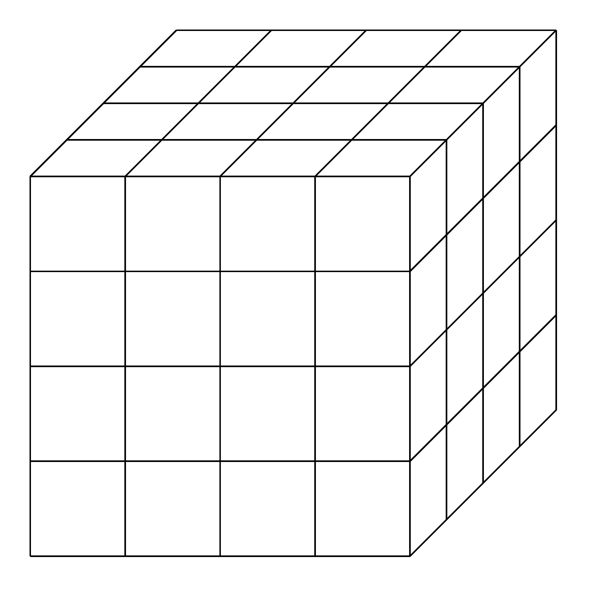

  * [elem-cube+elem+geometry+foreach.tex](https://github.com/walmes/Tikz/blob/master/src/elem-cube+elem+geometry+foreach.pgf)

```tex
\documentclass[tikz,border=10pt]{standalone}
\usepackage[margin=25mm]{geometry}
\usepackage{tikz}

%% like standalone
%\usepackage[active,tightpage]{preview}
%\PreviewEnvironment{tikzpicture}
%\setlength\PreviewBorder{5pt}%

\begin{document}

\begin{tikzpicture}
\foreach \x in{0,...,4}
{   \draw (0,\x ,4) -- (4,\x ,4);
    \draw (\x ,0,4) -- (\x ,4,4);
    \draw (4,\x ,4) -- (4,\x ,0);
    \draw (\x ,4,4) -- (\x ,4,0);
    \draw (4,0,\x ) -- (4,4,\x );
    \draw (0,4,\x ) -- (4,4,\x );
}
\end{tikzpicture}

\end{document}
```
****


  * [elem-cuboid_finer_grid+elem+foreach+command.tex](https://github.com/walmes/Tikz/blob/master/src/elem-cuboid_finer_grid+elem+foreach+command.pgf)

```tex
% arr: move draw to two tikz environments not document
%	change paper size with geometry
% add manual way of creating a cuboid

\documentclass{article}
\usepackage{geometry}
\geometry{
	a5paper,
	left=10mm,
	top=20mm,
} % https://www.overleaf.com/learn/latex/page_size_and_margins

\usepackage{tikz}


\newcommand{\tikzcuboid}[4]{% width, height, depth, scale
	% define tikz object
	\begin{tikzpicture}[scale=#4]
		\foreach \x in {0,...,#1}
		{   \draw (\x ,0  ,#3 ) -- (\x ,#2 ,#3 );
		    \draw (\x ,#2 ,#3 ) -- (\x ,#2 ,0  );
		}
		\foreach \x in {0,...,#2}
		{   \draw (#1 ,\x ,#3 ) -- (#1 ,\x ,0  );
		    \draw (0  ,\x ,#3 ) -- (#1 ,\x ,#3 );
		}
		\foreach \x in {0,...,#3}
		{   \draw (#1 ,0  ,\x ) -- (#1 ,#2 ,\x );
		    \draw (0  ,#2 ,\x ) -- (#1 ,#2 ,\x );
		}
	\end{tikzpicture}
}

\newcommand{\tikzcube}[2]{% length, scale
	\tikzcuboid{#1}{#1}{#1}{#2}
}


\begin{document}
	
\begin{tikzpicture}[scale=0.5]
	% manual way of creating a cuboid drawing lines
	\foreach \x in {0,...,11}
	{   \draw[gray] (\x, 0, 5 ) -- (\x, 7, 5 );
		\draw[gray] (\x, 7, 5 ) -- (\x, 7, 0 );
	}
	\foreach \x in {0,...,7}
	{   \draw[gray!75] (11, \x, 5) -- (11, \x, 0);
		\draw[gray!75] (0, \x, 5) -- (11, \x, 5);
	}
	\foreach \x in {0,...,5}
		{   \draw[gray!25]  (11, 0, \x ) -- (11, 7, \x);
			\draw[gray!25]  (0, 7, \x) -- (11, 7, \x);
	}
\end{tikzpicture}

\vspace{35pt}

\begin{tikzpicture}
	\tikzcuboid{11}{7}{5}{0.5}
\end{tikzpicture}

\vspace{20pt}

\begin{tikzpicture}
	\tikzcube{13}{0.25}
\end{tikzpicture}


\end{document}
```
****


  * [elem-custom-three_objects+symbols+command.tex](https://github.com/walmes/Tikz/blob/master/src/elem-custom-three_objects+symbols+command.pgf)

```tex
\documentclass[margin=10pt]{standalone}
\usepackage{tikz}

\usetikzlibrary{calc, positioning}

\tikzset{
    basic/.style={draw=black,fill=white,thick,rectangle,rounded corners=20pt, align=center},
    HeatEx/.style={draw=black,fill=white,thick,circle,minimum width=1cm},
    Tank/.style={basic, minimum width=1.5cm,minimum height=3cm,text width=1.5cm},
    3Phase/.style={basic, minimum width=4cm,minimum height=1.5cm,text width=4cm},
    Reactor/.style={basic, ultra thick,minimum width=1.5cm,minimum height=4cm,text width=1.5cm},
}

\newcommand{\COOLER}[3]{
    \node[HeatEx,right=#1 of #2](#3){};
    \draw[thick,-latex] ($(#3.south east)+(3mm,0)$) to[out=170,in=-20] ($(#3.north west)+(-3mm,0)$);
}

\newcommand{\HEATER}[4]{
    \node[HeatEx,below right=#1 and #2 of #3](#4){};
    \draw[thick,-latex] ($(#4.north east)+(3mm,0)$) to[out=200,in=20] ($(#4.south west)+(-3mm,0)$);
}

\newcommand{\TANK}[4]{
    \node[Tank,right=#1 of #2](#3){#4};
}

\newcommand{\ThreeSEP}[5]{
    \node[3Phase,right=#1 of #2](#3){#4};
    \draw[thick] (#3.south) to[out=-90,in=-90, looseness=2] node[midway] (sman) {} ($(#3.south)!.5!(#3.south east)$);
    \draw[thick,->] (sman.center) --++ (0,-1cm) -- (#5);
}

\newcommand{\REACTOR}[5]{
    \node[Reactor,below right=#1 and #2 of #3](#4){#5};
}

\begin{document}
\begin{tikzpicture}
    \node (START) {Text};
    \TANK{1cm}{START}{F1}{Tanks}
    \node[below right=of F1] (W1) {Text};
    \COOLER{1cm}{F1}{C1}
    \REACTOR{1cm}{1cm}{C1}{R1}{Reactor}
    \HEATER{1cm}{1cm}{R1}{H1}
    \ThreeSEP{1cm}{H1}{S1}{Separator}{15,-12}

%Arrows    
    \draw[thick,-latex] (START.east) to (F1.west);
    \draw[thick,-latex] (F1.south) |- (W1);
    \draw[thick,-latex] (F1.east) to (C1.west);
    \draw[thick,-latex] (C1.east) -| (R1.north);
    \draw[thick,-latex] (R1.south) |- (H1.west);
    \draw[thick,-latex] (H1.east) to (S1.west);
\end{tikzpicture}
\end{document}
```
****

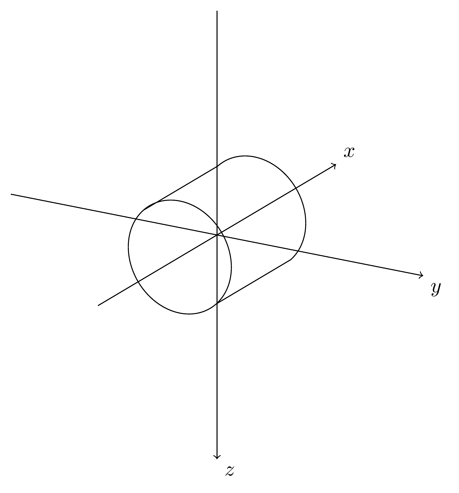

  * [elem-cylinder+elem+3d+foreach+function.tex](https://github.com/walmes/Tikz/blob/master/src/elem-cylinder+elem+3d+foreach+function.pgf)

```tex
% +3d+foreach+function
% +arr: change paper size, add comments
%	indent plot function, space parameters
% this could be the easiest way to draw 3d objects by using plot and function

\documentclass[tikz,border=5pt]{standalone}
\usetikzlibrary{shapes.geometric}
\usepackage{tikz-3dplot}


\begin{document}

\tdplotsetmaincoords{70}{30}   % projection angle

\begin{tikzpicture}[tdplot_main_coords]
	% add axis x, y, z
	\draw[->] (0,-4,0) -- (0,4,0) node[above right] {$x$};
	\draw[->] (-4,0,0) -- (4,0,0) node[below right] {$y$};
	\draw[->] (0,0,4) -- (0,0,-4) node[below right] {$z$};
	
	% using plot function to add top and bottom of cylinder
	\draw plot[variable=\x, domain=0:360, samples=180]    ( {cos(\x)}, -1.25, {sin(\x)} );
	\draw plot[variable=\x, domain=-45:135, samples=180] ( {cos(\x)},  1.25, {sin(\x)} );
	
	% draw sides of cylinder using the angles
	\foreach \x in {135,-45} { 
		\draw ({cos(\x)},-1.25,{sin(\x)}) -- ({cos(\x)},1.25,{sin(\x)});}
	%\node (a) [draw, cylinder, shape aspect=1.8, rotate=180, minimum height=25mm, minimum width=12mm] {};

\end{tikzpicture}

\end{document}
```
****

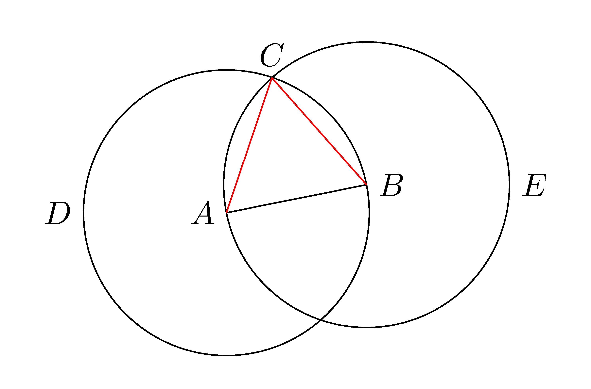

  * [elem-draw_circles_through+elem+geometry.tex](https://github.com/walmes/Tikz/blob/master/src/elem-draw_circles_through+elem+geometry.pgf)

```tex
% from Helmund slides
\documentclass[tikz,border=10pt]{standalone}
%\documentclass[crop, tikz]{standalone}

\usepackage{tikz}
\usetikzlibrary{calc,through}

\begin{document}

\begin{tikzpicture}[scale=1.2]
	% establish the coordinates for the master reference points
	\coordinate [label=left: $A$] (A) at (0, 0);
	\coordinate [label=right:$B$] (B) at (1.25, 0.25);
	
	% draw the geometries
	\draw (A) -- (B);   % line between A and B
	
	% Node D will be when we draw a circle at A (center) that passes through B
	\node (D) [draw, circle through=(B), label=left:$D$] at (A) {};
	% Node E will be when we draw a circle at B ( center) that passes through A
	\node (E) [draw, circle through=(A), label=right:$E$] at (B) {};
	
	\coordinate[label=above:$C$] (C) at (intersection 2 of D and E);
	
	\draw [red] (A) -- (C);
	\draw [red] (B) -- (C);

\end{tikzpicture}

\end{document}
```
****

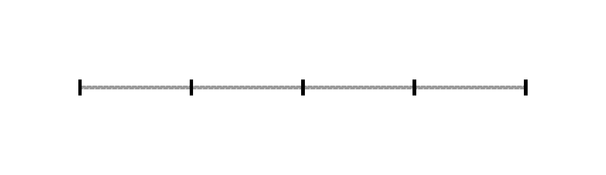

  * [elem-draw_ticks+elem+foreach.tex](https://github.com/walmes/Tikz/blob/master/src/elem-draw_ticks+elem+foreach.pgf)

```tex
% arr: add line, change color
\documentclass[tikz,border=10pt]{standalone}

\usepackage{tikz}

\begin{document}

% draw ticks
\begin{tikzpicture}
	% If you provide two numbers before the ..., the \foreach statement will use their difference for the stepping:
	\draw[gray!75] (-1,0) -- (1, 0);   % draw line
	\foreach \x in {-1,-0.5,...,1}
		\draw (\x cm,-1pt) -- (\x cm,1pt);
\end{tikzpicture}

\end{document}
```
****

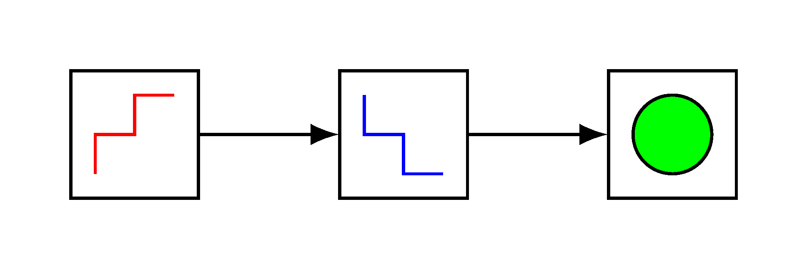

  * [elem-drawing_inside_box+elem+diagram+symbol.tex](https://github.com/walmes/Tikz/blob/master/src/elem-drawing_inside_box+elem+diagram+symbol.pgf)

```tex
% https://tex.stackexchange.com/a/55242/173708
\documentclass[border=10]{standalone}
\usepackage{tikz}
\usetikzlibrary{positioning}


\newcommand{\symbolA}{
\tikz \draw[red] (0,0)--(0,0.2)--(0.2,0.2)--(0.2,0.4)--(0.4,0.4);
}

\newcommand{\symbolB}{
\tikz[y={(0,-1)}] \draw[blue] (0,0)--(0,0.2)--(0.2,0.2)--(0.2,0.4)--(0.4,0.4);
}

\newcommand{\symbolC}{
\begin{tikzpicture}
	\draw[fill=green] (0,0) circle (0.2cm);
\end{tikzpicture}
}

\begin{document}

\begin{tikzpicture}
	\node[draw](A) at (0,0){\symbolA};
	\node[draw, right=2em of A] (B) {\symbolB};
	\node[draw, right=2em of B] (C) {\symbolC};
	\draw[-latex] (A) -- (B);
	\draw[-latex](B) -- (C);
\end{tikzpicture}

\end{document}
```
****

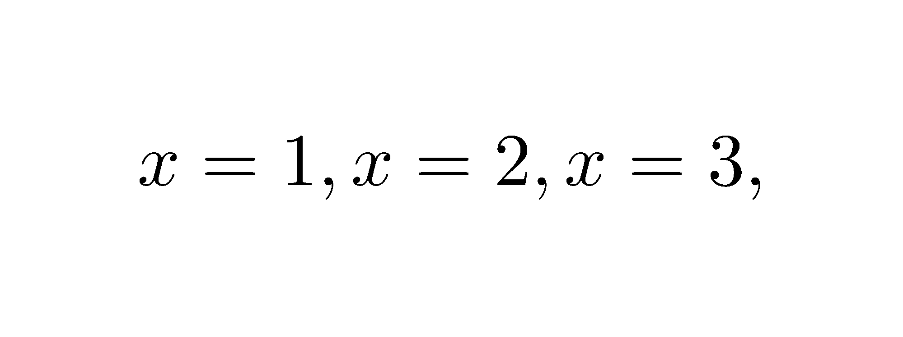

  * [elem-equation+elem+foreach.tex](https://github.com/walmes/Tikz/blob/master/src/elem-equation+elem+foreach.pgf)

```tex
\documentclass[border=15pt]{standalone}
\usepackage{tikz}

\begin{document}

% {$x =\x$, }
\begin{tikzpicture}
	\foreach \x in {1,2,3} 
		 \draw (\x,0) node (0.8cm) {$x=\x$,};
\end{tikzpicture}

\end{document}
```
****

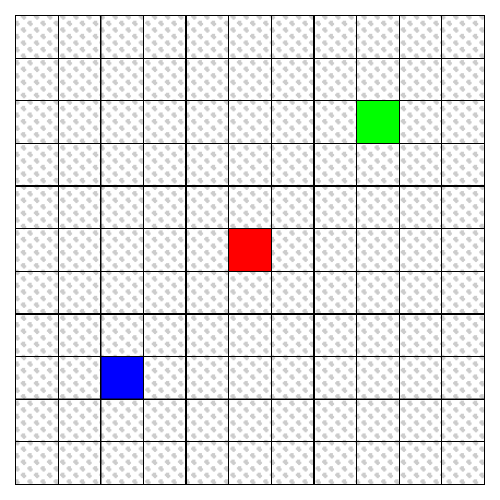

  * [elem-grid_RBG_draw_boxes+elem+foreach+style.tex](https://github.com/walmes/Tikz/blob/master/src/elem-grid_RBG_draw_boxes+elem+foreach+style.pgf)

```tex
% arr: add comments, indent code
%	change cell color to gray

\documentclass[tikz,border=10pt]{standalone}
%\documentclass[crop, tikz]{standalone}

\usepackage{tikz}

\begin{document}

\begin{tikzpicture}
	[%%%%%%%%%%%%%%%%%%%%%%%%%%%%%%
	box/.style={rectangle, draw=black, thick, minimum size=1cm, fill=gray!10},
	]%%%%%%%%%%%%%%%%%%%%%%%%%%%%%%
	
	% draw boxes based on (x,y) coordinates
	\foreach \x in {0,1,...,10} {
		\foreach \y in {0,1,...,10}   
			\node[box] at (\x, \y) {}; 
	}
	
	\node[box, fill=green] at (8,8){};  
	\node[box, fill=red  ] at (5,5){};  
	\node[box, fill=blue ] at (2,2){};  

\end{tikzpicture}

\end{document}
```
****

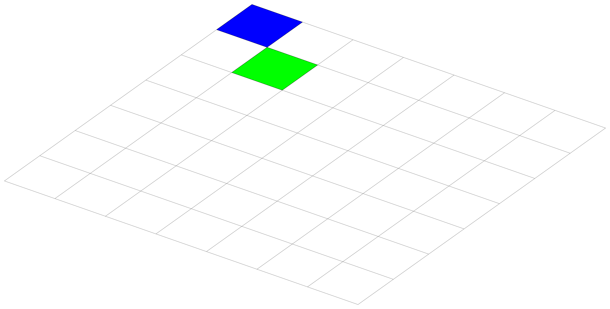

  * [elem-grid_RBG_draw_lines+elem+3d+pgf+foreach.tex](https://github.com/walmes/Tikz/blob/master/src/elem-grid_RBG_draw_lines+elem+3d+pgf+foreach.pgf)

```tex
% https://tex.stackexchange.com/a/271584/173708
% Modified by +arr for 7x7 plane, change paper size
% add comments

\documentclass[border={10}]{standalone}
\usepackage{tikz}  
\usepackage{tikz-3dplot} 

\tdplotsetmaincoords{60}{125} % view angles
\tdplotsetrotatedcoords{0}{0}{0} 

\begin{document}

\begin{tikzpicture}
    [%%%%%%%%%%%%%%%%%%%%%%%%%%%%%%%%%%
        scale=5,tdplot_rotated_coords,
        grid/.style={very thin,gray}
    ]%%%%%%%%%%%%%%%%%%%%%%%%%%%%%%%%%%

    %draw a grid in the x-y plane
    \foreach \x in {0,1,...,7}
        \foreach \y in {0,1,...,7} {
            \draw[grid] (\x,0) -- (\x,7);     % draw horizontal lines
            \draw[grid] (0,\y) -- (7,\y);  % draw vertical lines
        };
    
    \draw[fill=blue]     (0,0,0) -- (0,1,0) -- (1,1,0) -- (1,0,0) -- cycle;
    \draw[fill=green ]  (1,1,0) -- (2,1,0) -- (2,2,0) -- (1,2,0) -- cycle;

\end{tikzpicture}    
\end{document}
```
****


  * [elem-magnification+elem+geometry.tex](https://github.com/walmes/Tikz/blob/master/src/elem-magnification+elem+geometry.pgf)

```tex
\documentclass{standalone}
\usepackage{tikz} % http://ctan.org/pkg/pgf
\usetikzlibrary{spy, backgrounds}
\begin{document}

\begin{tikzpicture} [spy using outlines={circle, magnification=8, size=2cm, connect spies, transform shape}]
	  \draw[red] (2.9,0) -- (2.9,4);
	  \draw[help lines] (0,0) grid (4,4);
	  \draw (0,0) -- (3,3) -- (3,0);
	%   \begin{pgfonlayer}{background}
	%    \draw[red] (2.9,0) -- (2.9,4);
	%   \end{pgfonlayer}
	  \spy [black] on (3,3) in node [left] at (6,5.5);
\end{tikzpicture}
\end{document}
```
****

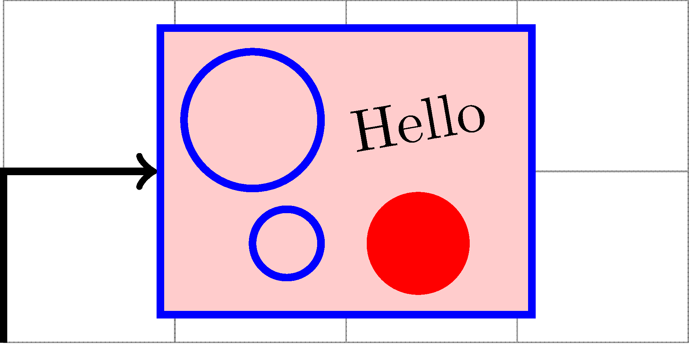

  * [elem-matrix-as_nodes+elem+matrix.tex](https://github.com/walmes/Tikz/blob/master/src/elem-matrix-as_nodes+elem+matrix.pgf)

```tex
\documentclass{standalone} 
\usepackage{tikz}

\begin{document}
\begin{tikzpicture}
	\draw[help lines] (0,0) grid (4,2);
	\node [matrix,fill=red!20,draw=blue,very thick] (my matrix) at (2,1)
	{
		\draw (0,0) circle (4mm); & \node[rotate=10] {Hello}; \\
		\draw (0.2,0) circle (2mm); & \fill[red] (0,0) circle (3mm); \\
	};
	
	\draw [very thick,->] (0,0) |- (my matrix.west);
\end{tikzpicture}
\end{document}
```
****

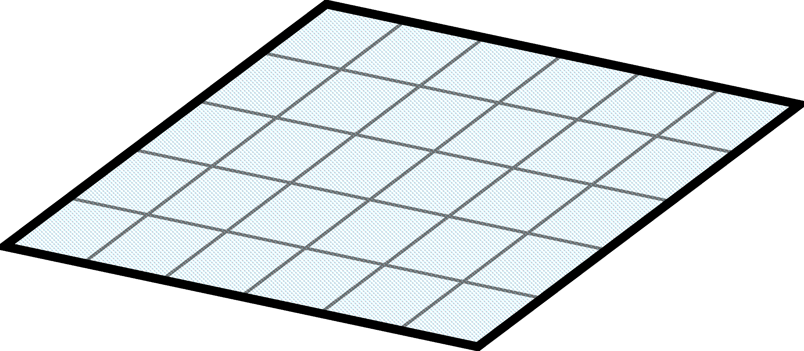

  * [elem-network-ex_doc_4-13+elem+network.tex](https://github.com/walmes/Tikz/blob/master/src/elem-network-ex_doc_4-13+elem+network.pgf)

```tex

% =============================================================================
% File      : ex_doc_4-13.tex -- example 4.13
% Author    : Jürgen Hackl <hackl.j@gmx.at>
% Creation  : 2019-08-14
% Time-stamp: <Thu 2019-08-15 09:44 juergen>
%
% Copyright (c) 2019 Jürgen Hackl <hackl.j@gmx.at>
% =============================================================================
\documentclass{standalone}
\usepackage{tikz-network}

\begin{document}
\begin{tikzpicture}[multilayer=3d]
	  \Plane[x=-.5,y=-.5,width=3,height=2.5,grid=5mm]
\end{tikzpicture}
\end{document}
% =============================================================================
% eof

%%% Local Variables:
%%% mode: latex
%%% TeX-master: t
%%% End:
```
****


  * [elem-node_connector+elem+diagram+command+params.tex](https://github.com/walmes/Tikz/blob/master/src/elem-node_connector+elem+diagram+command+params.pgf)

```tex
% https://hugoideler.com/2013/01/tikz-node-connector/
\documentclass{standalone}

\usepackage{tikz}
\usetikzlibrary{calc}
\usetikzlibrary{positioning}

\newcommand*{\connectorH}[4][]{
  \draw[#1] (#3) -| ($(#3) !#2! (#4)$) |- (#4);
}
\newcommand*{\connectorV}[4][]{
  \draw[#1] (#3) |- ($(#3) !#2! (#4)$) -| (#4);
}

\begin{document}

\begin{tikzpicture}[every node/.style={draw, minimum size=1cm, thick, fill=white}]
  \node[] (a) {A};
  \node[above right=1cm and 2cm of a] (b) {B};
  \node[below right=1cm and 2cm of a] (c) {C};

  \connectorH[->, red]{0.50}{a}{b}
  \connectorH[->, blue]{0.75}{a}{c}
\end{tikzpicture}

\end{document}
```
****

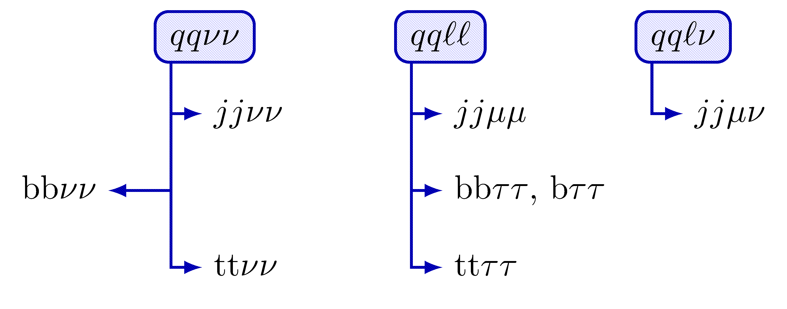

  * [elem-physics-arrows_to_nodes+elem+phsyics.tex](https://github.com/walmes/Tikz/blob/master/src/elem-physics-arrows_to_nodes+elem+phsyics.pgf)

```tex
% Author: Izaak Neutelings (September 2018)
\documentclass[border=3pt,tikz]{standalone}
\usepackage{amsmath} % for \;
\usepackage{tikz}
\usepackage{xcolor}
\colorlet{myblue}{blue!70!black}
\colorlet{mylightblue}{blue!10}
\tikzset{>=latex} % for LaTeX arrow head

\begin{document}


\begin{tikzpicture}[yscale=0.8,anchor=west]
  
  % FIRST COLUMN
  \node[anchor=west,draw=myblue,fill=mylightblue,thick,rounded corners=4,inner sep=1.5pt] (L) at (0,4) {\;\strut$qq\nu\nu$\;};  
  \node (L1) at (0.5,3) {\strut$jj\nu\nu$};
  \node (L2) at (-1.5,2) {\strut bb$\nu\nu$};
  \node (L3) at (0.5,1) {\strut tt$\nu\nu$};
  \draw[->,myblue,thick] (L.south west) ++ (0.18,0) |- (L1.west);
  \draw[->,myblue,thick] (L.south west) ++ (0.18,0) |- (L2.east);
  \draw[->,myblue,thick] (L.south west) ++ (0.18,0) |- (L3.west);
  
  % SECOND COLUMN
  \begin{scope}[shift={(2.5,0)}]
    \node[draw=myblue,fill=mylightblue,thick,rounded corners=4,inner sep=1.5pt] (M) at (0,4) {\;\strut$qq\ell\ell$\;};
    \node (M1) at (0.5,3) {\strut$jj\mu\mu$};
    \node (M2) at (0.5,2) {\strut bb$\tau\tau$, b$\tau\tau$};
    \node (M3) at (0.5,1) {\strut tt$\tau\tau$};
    \draw[->,myblue,thick] (M.south west)++(0.18,0) |- (M1.west);
    \draw[->,myblue,thick] (M.south west)++(0.18,0) |- (M2.west);
    \draw[->,myblue,thick] (M.south west)++(0.18,0) |- (M3.west);
  \end{scope}
  
  % THIRD COLUMN
  \begin{scope}[shift={(5.0,0)}]
    \node[draw=myblue,fill=mylightblue,thick,rounded corners=4,inner sep=1.5pt] (R) at (0,4) {\;\strut$qq\ell\nu$\;};
    \node (R1) at (0.5,3) {\strut$jj\mu\nu$};
    \draw[->,myblue,thick] (R.south west)++(0.18,0) |- (R1.west);
  \end{scope}

\end{tikzpicture}


\end{document}
```
****

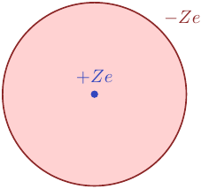

  * [elem-physics-example_atom+elem+physics.tex](https://github.com/walmes/Tikz/blob/master/src/elem-physics-example_atom+elem+physics.pgf)

```tex
% https://wiki.physik.uzh.ch/cms/latex:example_atom
    % Author: Izaak Neutelings (July, 2017)

\documentclass{article}
\usepackage{tikz}

% colors
\definecolor{mylightred}{RGB}{255,210,210}
\definecolor{myred}{RGB}{200,100,100}
\definecolor{mydarkred}{RGB}{140,40,40}
\definecolor{mylightblue}{RGB}{220,228,255}
\definecolor{myblue}{RGB}{183,191,229}
\definecolor{mydarkblue}{RGB}{50,70,190}

% split figures into pages
\usepackage[active,tightpage]{preview}
\PreviewEnvironment{tikzpicture}
\setlength\PreviewBorder{1pt}%

\begin{document}
	
	
	
% RUTHERFORD MODEL - atom model with central charge
\begin{tikzpicture}[scale=1]
	\coordinate (O)  at (0,0);
	\draw[mylightred,fill]         (O) circle (50pt);
	\draw[mydarkred,thick]         (O) circle (50pt) node[above right=34pt] {$-Ze$};
	\fill[radius=2.0pt,mydarkblue] (O) circle node[above=2pt] {$+Ze$};
\end{tikzpicture}


% RUTHERFORD MODEL - atom model with central charge and corpuscles
\begin{tikzpicture}[scale=1]
	\coordinate (O)  at (0,0);
	\draw[myred,dashed]            (O) circle (50pt);
	\fill[radius=2.0pt,mydarkblue] (O) circle node[above=2pt] {$+Ze$};
	\fill[radius=0.8pt,mydarkred]
	( 0.20, 1.20)  circle node[above right=-1pt,scale=0.75] {$-e$}
	( 0.68, 0.67)  circle node[above right=-1pt,scale=0.75] {$-e$}
	( 1.05,-1.10)  circle node[above left =-1pt,scale=0.75] {$-e$}
	( 0.75,-0.12)  circle node[      right= 2pt,scale=0.75] {$-e$}
	( 0.21,-1.30)  circle node[above left =-1pt,scale=0.75] {$-e$}
	(-0.80, 0.60)  circle node[above left =-1pt,scale=0.75] {$-e$}
	(-0.50, 1.21)  circle node[above right=-1pt,scale=0.75] {$-e$}
	(-0.08,-0.55)  circle node[above left =-1pt,scale=0.75] {$-e$}
	(-0.58,-0.95)  circle node[above left =-1pt,scale=0.75] {$-e$}
	(-1.10,-0.20)  circle node[above left =-1pt,scale=0.75] {$-e$};
\end{tikzpicture}


% THOMSON MODEL - atom model with corpuscles (electrons) in uniformly, positively charged sphere
\begin{tikzpicture}[scale=1]
	\coordinate (O)  at (0,0);
	\draw[mylightblue,fill] (O) circle (50pt);
	\draw[mydarkblue,thick] (O) circle (50pt) node[above right=34pt] {$+Ze$};
	\fill[radius=0.8pt,mydarkred]
	( 0.20, 1.20)  circle node[above right=-1pt,scale=0.75] {$-e$}
	( 0.10, 0.30)  circle node[above right=-1pt,scale=0.75] {$-e$}
	( 0.68, 0.67)  circle node[above right=-1pt,scale=0.75] {$-e$}
	( 1.05,-1.10)  circle node[above left =-1pt,scale=0.75] {$-e$}
	( 0.75,-0.12)  circle node[      right= 2pt,scale=0.75] {$-e$}
	( 0.21,-1.30)  circle node[above left =-1pt,scale=0.75] {$-e$}
	( 0.18,-0.55)  circle node[above left =-1pt,scale=0.75] {$-e$}
	(-0.80, 0.60)  circle node[above left =-1pt,scale=0.75] {$-e$}
	(-0.50, 1.21)  circle node[above right=-1pt,scale=0.75] {$-e$}
	(-0.40, 0.05)  circle node[above left =-1pt,scale=0.75] {$-e$}
	(-0.58,-0.95)  circle node[above left =-1pt,scale=0.75] {$-e$}
	(-1.10,-0.20)  circle node[above left =-1pt,scale=0.75] {$-e$};
\end{tikzpicture}
	
	
	
\end{document}
```
****


  * [elem-placing_labels_circle.tex](https://github.com/walmes/Tikz/blob/master/src/elem-placing_labels_circle.pgf)

```tex
\documentclass[border=3mm,tikz]{standalone}
%  \documentclass{scrartcl}
\usepackage{tikz}
\begin{document} 

\begin{tikzpicture}

 \node [draw,circle ] (a) { Real label}; 
 \node  at (a.60) {$\bullet$}; 
 \node [draw] at ([shift={(95:1)}]a.60) {Second label};

\end{tikzpicture}

\end{document}  
```
****


  * [elem-placing_labels.tex](https://github.com/walmes/Tikz/blob/master/src/elem-placing_labels.pgf)

```tex
% https://tex.stackexchange.com/a/58880/173708
% set node label position more precisely
\documentclass[border=3mm,tikz]{standalone}
%\documentclass{article}
\usepackage{tikz,comment}

\begin{comment}
	You can define the direction of the label by using label=<angle>:<label text>. To specify the distance on a per node distance, you have to supply it to the label options: label={[label distance=<distance>]<angle>:<label text>}
\end{comment}

\begin{document}
\begin{tikzpicture}[
	    every node/.style=draw,
	    every label/.style=draw
	]
	\node [label={[label distance=1cm]30:label}] {Node};
\end{tikzpicture}


\end{document}
```
****

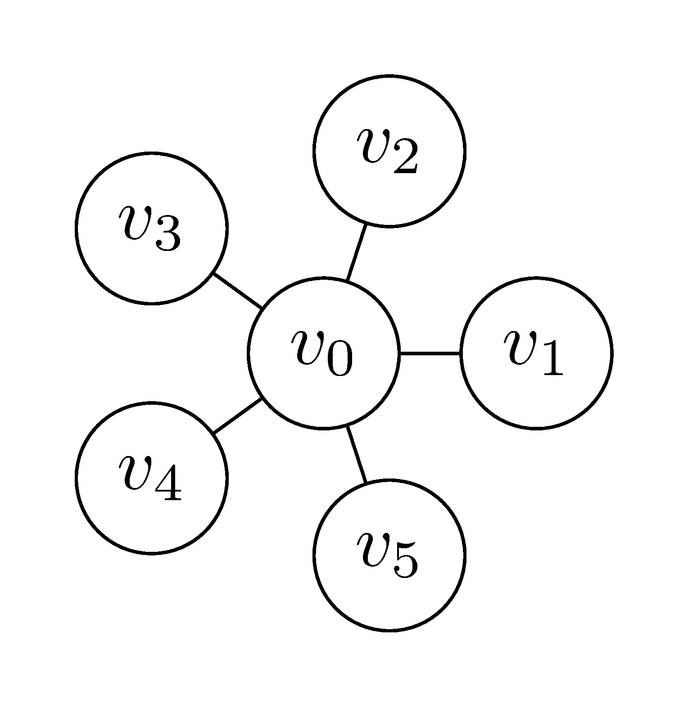

  * [elem-simple_computations_pentagon+elem+style.tex](https://github.com/walmes/Tikz/blob/master/src/elem-simple_computations_pentagon+elem+style.pgf)

```tex
% from Helmund slides
\documentclass[tikz,border=10pt]{standalone}
%\documentclass[crop, tikz]{standalone}

\usepackage{tikz}

\begin{document}

\begin{tikzpicture}
	\tikzstyle{every node} = [draw, shape=circle];
	\node (v0) at (0:    0) {$v_0$};
	\node (v1) at (0:    1) {$v_1$};
	\node (v2) at (72:   1) {$v_2$};
	\node (v3) at (2*72: 1) {$v_3$};
	\node (v4) at (3*72: 1) {$v_4$};	
	\node (v5) at (4*72: 1) {$v_5$};
	
	% draw the edges
	\draw (v0) -- (v1);
	\draw (v0) -- (v2);
	\draw (v0) -- (v3);
	\draw (v0) -- (v4);
	\draw (v0) -- (v5);
\end{tikzpicture}

\end{document}
```
****


  * [elem-stacked+elem+diagram.tex](https://github.com/walmes/Tikz/blob/master/src/elem-stacked+elem+diagram.pgf)

```tex
\documentclass[border=10pt]{standalone}
\usepackage{tikz}
\usetikzlibrary{shapes.multipart}

\begin{document}

\begin{tikzpicture}[stack/.style={rectangle split, rectangle split parts=#1,draw, anchor=center}]
	\node[stack=5]  {
	\nodepart{two}a
	\nodepart{three}b
	\nodepart{four}c
	\nodepart{five}d
	};
\end{tikzpicture}

\end{document}
```
****

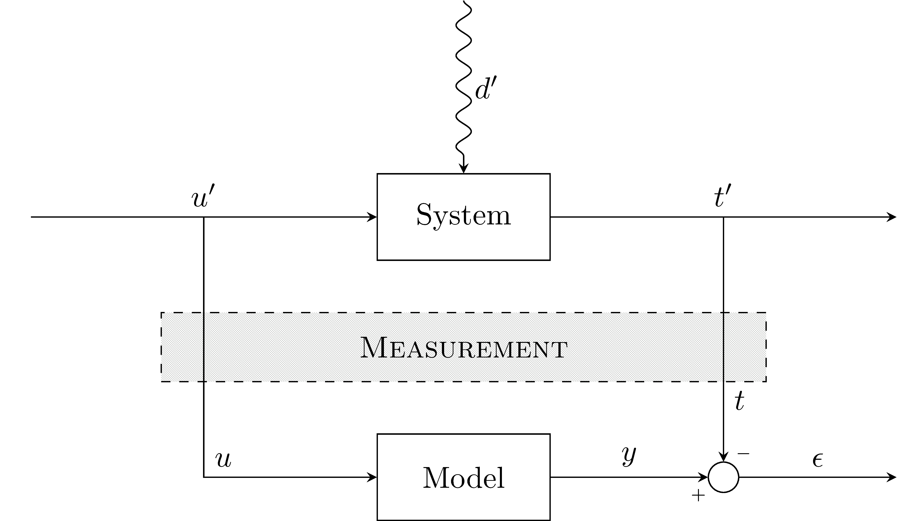

  * [elem-system_measurement_model+elem+diagram.tex](https://github.com/walmes/Tikz/blob/master/src/elem-system_measurement_model+elem+diagram.pgf)

```tex
% https://tex.stackexchange.com/a/239506/173708
\documentclass{standalone}

\usepackage{tikz}       
\usetikzlibrary{arrows, positioning, patterns, calc, decorations.pathmorphing}

\begin{document}

\tikzstyle{block} = [draw, rectangle, inner sep=6pt, minimum width=2cm, minimum height=1cm, align=center]
\tikzstyle{joint} = [draw, circle, minimum size=1em, anchor=center]
\tikzstyle{layer} = [draw, rectangle, dashed, fill=gray!20, minimum width=7cm, minimum height=8mm, align=center, anchor=center]

\begin{tikzpicture}[>=stealth, auto, node distance=2cm]
    % Place nodes
    \node [block] (system) {System};
    \node [block, below=of system] (model) {Model};
    \node [layer] at ($(system)!.5!(model)$) {\textsc{Measurement}};
    \coordinate [left=of system] (infork) {};
    \coordinate [left=of infork] (input) {};
    \coordinate [right=of system] (outfork) {};
    \coordinate [right=of outfork] (output) {};
    \coordinate [above=of system] (disturbances) {};
    \node [joint, label={[inner sep=1pt]210:\tiny\(+\)}, label={[inner sep=1pt]60:\tiny\(-\)}] (sum) at (outfork|-model) {};
    \coordinate (error) at (output|-model) {};
    % Connect nodes
    \draw [->, decorate, decoration={snake, post length=1mm}] (disturbances) -- node {\(d'\)} (system);
    \draw [->] (input) -- node {\(u'\)} (system);
    \draw [->] (system) -- node {\(t'\)} (output);
    \draw [->] (model) -- node {\(y\)} (sum);
    \draw [->] (sum) -- node {\(\epsilon\)} (error);
    \draw [->] (infork) |- node [anchor=south west] {\(u\)} (model);
    \draw [->] (outfork) -| (sum.north) node [very near end] {\(t\)};
\end{tikzpicture}

\end{document}
```
****

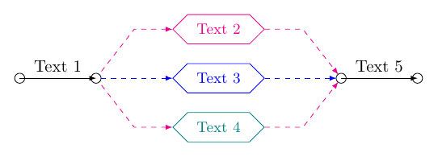

  * [elem-text_boxes_helpme+elem+diagram+text.tex](https://github.com/walmes/Tikz/blob/master/src/elem-text_boxes_helpme+elem+diagram+text.pgf)

```tex
% +arr: add circles to nodes

\documentclass[tikz, margin=3mm]{standalone}
    \usetikzlibrary{positioning, shapes.symbols}

\begin{document}
   \begin{tikzpicture}[ 
   node distance = 4mm and 16mm,
   mynode/.style = {shape=signal, signal to=west and east,
			                 draw, color = #1,
			                 text width=1.3cm, align=flush center, 
			                 inner xsep=0mm, inner ysep=2mm, font=\small}
                 ]
	% main nodes
	\node (A) [mynode=magenta]            {Text 2};
	\node (B) [mynode=blue, below=of A]   {Text 3};
	\node (C) [mynode=teal, below=of B]   {Text 4};
	
	% coordinates for lines
	\coordinate[left=of B.west]     (in2);
	\coordinate[left=of in2]        (in1);
	\coordinate[right=of B.east]    (out1);
	\coordinate[right=of out1]      (out2);
	
	% add circles to nodes
	\draw (in1) circle (3pt);
	\draw (in2) circle (3pt);
	\draw (out1) circle (3pt);
	\draw (out2) circle (3pt);
	
	% dashed arrows
	    \begin{scope}[latex-, dashed, shorten >=1mm]
			\draw[magenta] (A.west) -- + (-0.8,0) -- (in2);
			\draw[blue]     (B.west) -- (in2);
			\draw[magenta] (C.west) -- + (-0.8,0) -- (in2);
	    \end{scope}
	    
	    \begin{scope}[-latex, dashed, shorten >=1mm]
			\draw[magenta] (A.east) -- + (0.8,0) -- (out1);
			\draw[blue]     (B.east) -- (out1);
			\draw[magenta] (C.east) -- + (0.8,0) -- (out1);
	    \end{scope}
	    
	% arrows with text
	\draw[-latex] (in1) -- node[above] {Text 1} (in2);
	\draw[-latex] (out1) -- node[above] {Text 5} (out2);
	%--------------
   \end{tikzpicture}
\end{document}
```
****

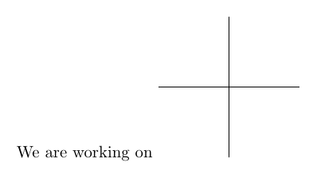

  * [elem-tikz-01+elem+geometry.tex](https://github.com/walmes/Tikz/blob/master/src/elem-tikz-01+elem+geometry.pgf)

```tex
\documentclass[border=10pt]{standalone}
\usepackage{tikz}

\begin{document}

We are working on
\begin{tikzpicture}
	\draw (-1.5,0) -- (1.5,0);
	\draw (0,-1.5) -- (0,1.5);
\end{tikzpicture}
\end{document}
```
****

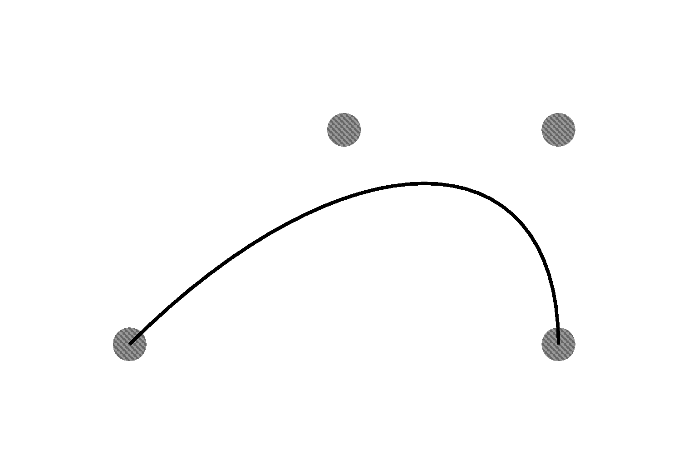

  * [elem-tikz-02+elem+geometry.tex](https://github.com/walmes/Tikz/blob/master/src/elem-tikz-02+elem+geometry.pgf)

```tex
\documentclass[tikz,border=15pt]{standalone}
\usepackage{tikz}

\begin{document}


\begin{tikzpicture}
	\filldraw [gray] (0,0) circle (2pt)
	(1,1) circle (2pt)
	(2,1) circle (2pt)
	(2,0) circle (2pt);
	\draw (0,0) .. controls (1,1) and (2,1) .. (2,0);
\end{tikzpicture}


\end{document}
```
****


  * [elem-trapezium+elem+geometry.tex](https://github.com/walmes/Tikz/blob/master/src/elem-trapezium+elem+geometry.pgf)

```tex
%\documentclass{standalone}
\documentclass[tikz,border=15pt]{standalone}
%\documentclass[crop, tikz]{standalone}

\usepackage{tikz}
\usetikzlibrary{shapes}

\begin{document}
	
\tikzset{my node/.style={trapezium, fill=#1!20, draw=#1!75, text=black}}

\begin{tikzpicture}
	\tikzset{trapezium stretches=true}
	
	\draw [help lines] grid (3,2);
	
	% draw trapeziums
	\node [my node=red] {A};
	\node [my node=green, minimum height=1.5cm] at (1, 1.25) {B};
	\node [my node=blue, minimum width=1.5cm] at (2, 0) {C};
\end{tikzpicture}
	
\end{document}
```
****


  * [fileIO-airfoil_from_data.tex](https://github.com/walmes/Tikz/blob/master/src/fileIO-airfoil_from_data.pgf)

```tex
% http://www.texample.net/tikz/examples/airfoil-profiles/
% Read airfoils from data files
% Airfoil profiles from the UIUC Airfoil Coordinates Database
% http://www.ae.uiuc.edu/m-selig/ads/coord_database.html
% Data is released under the GNU General Public Licence. See
% http://www.ae.uiuc.edu/m-selig/pd/gpl.html for more details. 
\documentclass{standalone}
\usepackage{tikz}
\usepackage{verbatim}

\begin{comment}
:Title: Airfoil profiles
:Tags: Plots, External file, Foreach

A few airfoil profiles from the extensive `UIUC Airfoil Coordinates Database`_. The data
is provided in a convenient x,y coordinate format suitable for plotting using PGF/TikZ's
``plot file`` construct.

Note that the data is released under the `GNU General Public License`_. To use the
data files with PGF/TikZ, you have to comment out the lines not containing coordinates.

Download the airfoils used in the example: `airfoildata.zip`_

.. _UIUC Airfoil Coordinates Database: http://www.ae.uiuc.edu/m-selig/ads/coord_database.html
.. _GNU General Public License: http://www.ae.uiuc.edu/m-selig/pd/gpl.html
.. _airfoildata.zip: http://www.fauskes.net/media/pgftikzexamples/data/airfoildata.zip
\end{comment}

\begin{document}

\newcounter{y}
\setcounter{y}{0}

\begin{tikzpicture}
    \foreach \lbl / \fn in {EPPLER 625/e625.dat,
                            WORTMANN FX 2/fx2.dat,
                            EPPLER 664 (EXTENDED)/e664ex.dat,
                            CLARK Y/clarcy.dat,
                            Eiffel 10 (Wright)/eiffel10.dat,
                            FX 69-PR-281/fx69pr281.dat,
                            NACA Munk M-4 airfoil/m4.dat}{
        % Some profiles look better when using plot[smooth]
        \draw[yshift=-\arabic{y}cm,scale=3] node[left=0.5cm] {\lbl}
        	% set the dasta folder in the next line
            plot file{data/\fn} -- cycle;
        \stepcounter{y}
    }
\end{tikzpicture}

\end{document}
```
****


  * [fileIO-circles_from_data.tex](https://github.com/walmes/Tikz/blob/master/src/fileIO-circles_from_data.pgf)

```tex
% https://tex.stackexchange.com/a/20500/173708
\documentclass{standalone}

\usepackage{tikz}
\usepackage{pgfplotstable}

\begin{document}
\centering
\begin{tikzpicture}
	\pgfplotstableread{./data/circles.dat}\table
	\pgfplotstablegetrowsof{\table}
	\pgfmathsetmacro{\M}{\pgfplotsretval-1}
	\pgfplotstablegetcolsof{\table}
	\pgfmathsetmacro{\N}{\pgfplotsretval-1}
	
	\foreach \row in {0,...,\M}{
	          \foreach \col in {0,...,\N}{
	                 \pgfplotstablegetelem{\row}{[index]\col}\of\table
	                 \ifnum\col=0
	                       \xdef\x{\pgfplotsretval}
	                 \fi
	                 \ifnum\col=1
	                       \xdef\y{\pgfplotsretval}
	                 \fi
	                 \ifnum\col=2
	                       \xdef\radius{\pgfplotsretval}
	                 \fi
	                 }
	                 \definecolor{mycolor}{RGB}{\pdfuniformdeviate 256,%
	                                            \pdfuniformdeviate 256,%
	                                            \pdfuniformdeviate 256}
	                 \fill[mycolor,opacity=.5] (\x,\y)circle(\radius cm);
	}
\end{tikzpicture}
\end{document}
```
****


  * [fileIO-plot_curves-read_data+fileio+plot+pgf.tex](https://github.com/walmes/Tikz/blob/master/src/fileIO-plot_curves-read_data+fileio+plot+pgf.pgf)

```tex
% http://pgfplots.net/media/tikz/examples/TEX/plot-markers.tex
\documentclass[border=10pt]{standalone}
%%%<
\usepackage{verbatim}
\usepackage{pgfplots}
\pgfplotsset{width=7cm, compat=1.8, grid style={dashed}}

\begin{comment}
:Title: Markers in a line diagram
:Tags: 2D;Markers
:Author: Elke Schubert
:Slug: plot-markers

Besides x and y values, special markers illustrate the result.

This topic was discussed on: http://texwelt.de/wissen/fragen/3363/

Data file
-------
if you want the data to be saved as you modify this file, add this:

	\usepackage{filecontents}
	
	% changes in this table make changes to CSV file
	\begin{filecontents}{data.csv}
	measuring   power1   result1   power2   result2
	1           2        0.2       3.5      0.39
	2           3        0.35      3.8      0.3
	3           4        0.45      7.9      0.35
	4           5        0.5       8.5      0.39
	5           6        0.65      8.0      0.38
	6           7        0.68      8.5      0.4
	7           8        0.7       9.5      0.41
	8           7.5      0.73      10.5     0.99
	9           6.7      0.75      {}       {}
	10          10       0.79      {}       {}
	\end{filecontents}
	%%%>

\end{comment}

\begin{document}
\begin{tikzpicture}
  \begin{axis}[
    scatter,
    scatter src = explicite,
    grid        = major, % draws coordinate grid
    xlabel      = Force $\lbrack{}$ F $\rbrack$, 
    ylabel      = Amperage $\lbrack{}$ kA $\rbrack$,
    width       = \linewidth,
    height      = 10cm,
    xmin = 0, xmax = 15,
    ymin = 0, ymax = 12,
    ]
    \addplot+ [
      visualization depends on =
        {10*\thisrow{result1} \as \perpointmarksize},
      scatter/@pre marker code/.append style =
        {/tikz/mark size = \perpointmarksize},
    ]
    table[x=measuring, y=power1, point meta=\thisrow{result1}] {./data/data.csv};
    \addplot+ [
      visualization depends on =
        {10*\thisrow{result2} \as \perpointmarksize},
      scatter/@pre marker code/.append style =
        {/tikz/mark size = \perpointmarksize}
    ]
    table [x=measuring, y=power2, point meta=\thisrow{result2}] {./data/data.csv};
    \fill [gray, fill opacity=0.25] (axis cs:5,0) rectangle (axis cs:7,12);
  \end{axis}
\end{tikzpicture}
\end{document}
```
****

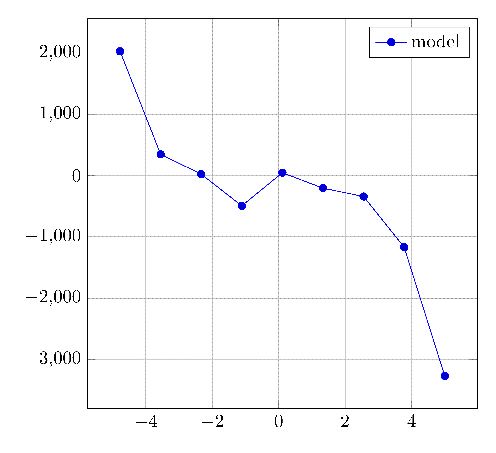

  * [fileIO-plot-two_plots_same_axis+fileio+pgf.tex](https://github.com/walmes/Tikz/blob/master/src/fileIO-plot-two_plots_same_axis+fileio+pgf.pgf)

```tex
\documentclass[border=10pt]{standalone}

\usepackage{pgfplots}
\pgfplotsset{compat=newest}


\begin{document}

% Preamble: \pgfplotsset{width=7cm,compat=newest}
\begin{tikzpicture}
    \begin{axis}
	    [
	    height=9cm,
	    width=9cm,
	    grid=major,
	    ]
	    % \addplot gnuplot[id=filesuffix]{(-x**5 - 242)};
	    \addlegendentry{model}
		    
		    \addplot coordinates {
			    (-4.77778,2027.60977)
			    (-3.55556,347.84069)
			    (-2.33333,22.58953)
			    (-1.11111,-493.50066)
			    (0.11111,46.66082)
			    (1.33333,-205.56286)
			    (2.55556,-341.40638)
			    (3.77778,-1169.24780)
			    (5.00000,-3269.56775)
			    };
		    \addlegendentry{estimate}
	    \end{axis}
    \end{tikzpicture}


\end{document}
```
****


  * [fileIO-simple_read_coordinates.tex](https://github.com/walmes/Tikz/blob/master/src/fileIO-simple_read_coordinates.pgf)

```tex
\documentclass{standalone}
\usepackage{pgfplots}
\pgfplotsset{compat=1.11}

\begin{document}
    \begin{tikzpicture}
        \begin{axis}
            \addplot table {./data/coordinates.dat};
        \end{axis}
    \end{tikzpicture}
\end{document}
```
****

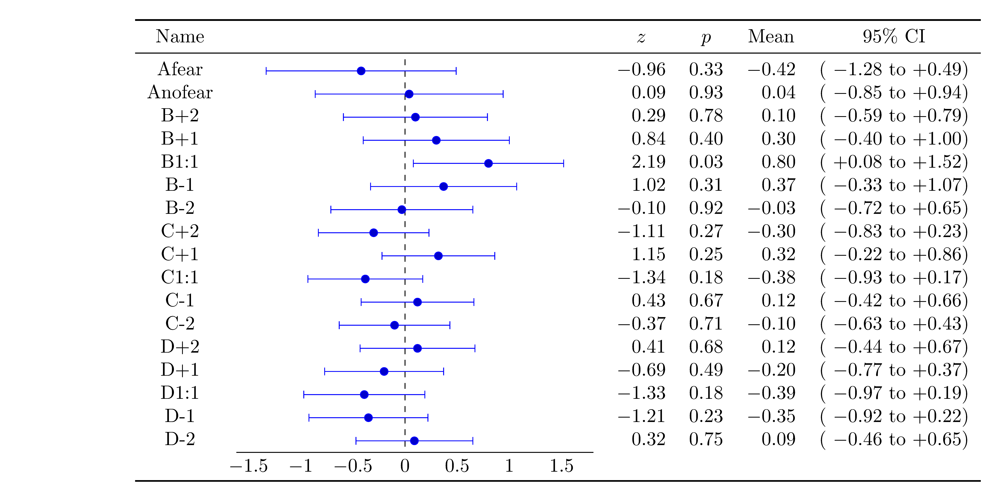

  * [fileIO-table-read_data+fileio+pgf+table.tex](https://github.com/walmes/Tikz/blob/master/src/fileIO-table-read_data+fileio+pgf+table.pgf)

```tex
% http://pgfplots.net/media/tikz/examples/TEX/graph-in-table.tex
\documentclass[border=10pt]{standalone}
%%%<
\usepackage{verbatim}

\begin{comment}

Data file
-------
if you want the data to be saved as you modify this file, add this:

	\usepackage{filecontents}
	
	\begin{filecontents}{./data/data.txt}
	name z p mean lci uci
	Afear -0.96  0.33 -0.42 -1.28 0.49
	Anofear 0.09 0.93 0.04 -0.85 0.94
	B+2 0.29 0.78 0.10 -0.59 0.79
	B+1   0.84  0.40  0.30 -0.40 1.00 
	B1:1   2.19  0.03  0.80 0.08 1.52 
	B-1   1.02  0.31  0.37 -0.33 1.07 
	B-2   -0.10  0.92  -0.03 -0.72 0.65 
	C+2   -1.11  0.27  -0.30 -0.83 0.23 
	C+1   1.15   0.25  0.32 -0.22 0.86 
	C1:1   -1.34  0.18  -0.38 -0.93 0.17 
	C-1   0.43  0.67  0.12 -0.42 0.66 
	C-2   -0.37  0.71  -0.10 -0.63 0.43 
	D+2   0.41  0.68  0.12 -0.44 0.67 
	D+1   -0.69  0.49  -0.20 -0.77 0.37 
	D1:1   -1.33  0.18  -0.39 -0.97 0.19 
	D-1   -1.21  0.23  -0.35 -0.92 0.22 
	D-2   0.32  0.75  0.09 -0.46 0.65 
	\end{filecontents}
	%%%>
\end{comment}


\usepackage{pgfplots}
\pgfplotsset{compat=1.8}
\usepackage{pgfplotstable}
\usepackage{booktabs}
\usepackage{multirow}
\begin{comment}
:Title: Graph within a table
:Tags: 2D;PGFPlotstable;Styles
:Author: Jake
:Slug: graph-in-table

We would like to plot a graph within a table column, similar to
http://texample.net/tikz/examples/weather-stations-data/ .

We will use the booktabs package for good table design,
and the multirow package.

The data is read using PGFPlotstable and the plot is typeset dynamically.

This code was written by Jake on TeX.SE.
\end{comment}

% Read data file, create new column ``upper CI boundary - mean''
\pgfplotstableread{./data/data.txt}\data
\pgfplotstableset{create on use/error/.style={
    create col/expr={\thisrow{uci}-\thisrow{mean}
    }
  }
}

% Define the command for the plot
\newcommand{\errplot}{%
  \begin{tikzpicture}[trim axis left,trim axis right]
    \begin{axis}[y=-\baselineskip,
        scale only axis,
        width             = 6.5cm,
        enlarge y limits  = {abs=0.5},
        axis y line*      = middle,
        y axis line style = dashed,
        ytick             = \empty,
        axis x line*      = bottom
      ]
      % ``mean'' must be present in the datafile,
      %``error'' is the newly generated column
      \addplot+[only marks][error bars/.cd,x dir=both, x explicit]
        table [x=mean,y expr=\coordindex,x error=error]{\data};
    \end{axis}
  \end{tikzpicture}%
}

\begin{document}
% Get number of rows in datafile
\pgfplotstablegetrowsof{\data}
\let\numberofrows=\pgfplotsretval

% Print the table
\pgfplotstabletypeset[columns={name,error,z,p,mean,ci},
  % Booktabs rules
  every head row/.style = {before row=\toprule, after row=\midrule},
  every last row/.style = {after row=[3ex]\bottomrule},
  % Set header name
  columns/name/.style = {string type, column name=Name},
  % Use the ``error'' column to call the \errplot command in a multirow cell
  % in the first row, keep empty for all other rows
  columns/error/.style = {
    column name = {},
    assign cell content/.code = {% use \multirow for Z column:
    \ifnum\pgfplotstablerow=0
    \pgfkeyssetvalue{/pgfplots/table/@cell content}
    {\multirow{\numberofrows}{6.5cm}{\errplot}}%
    \else
    \pgfkeyssetvalue{/pgfplots/table/@cell content}{}%
    \fi
    }
  },
  % Format numbers and titles
  columns/mean/.style = {column name = Mean, fixed ,fixed zerofill, dec sep align},
  columns/z/.style    = {column name = $z$, fixed, fixed zerofill, dec sep align},
  columns/p/.style    = {column name = $p$, fixed, fixed zerofill, dec sep align},
  columns/ci/.style   = {string type, column name = 95\% CI},
  % Create the ``(x to y)'' format, use \pgfmathprintnumber with `showpos`
  % to make things align nicely
  create on use/ci/.style={
    create col/assign/.code={\edef\value{(
      \noexpand\pgfmathprintnumber[showpos,fixed,fixed zerofill]{\thisrow{lci}}
      to \noexpand\pgfmathprintnumber[showpos,fixed,fixed zerofill]{\thisrow{uci}})}
      \pgfkeyslet{/pgfplots/table/create col/next content}\value
    }
  }
]{\data}
\end{document}
```
****

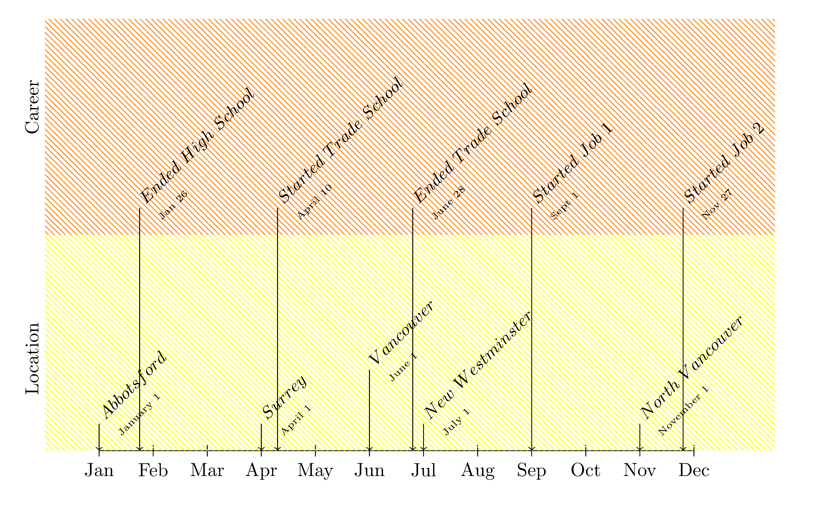

  * [fileIO-time-read-data+timeline+fileio+pgf+foreach+text.tex](https://github.com/walmes/Tikz/blob/master/src/fileIO-time-read-data+timeline+fileio+pgf+foreach+text.pgf)

```tex
% https://tex.stackexchange.com/a/457351/173708
\documentclass[border=10pt]{standalone}
\usepackage{verbatim}


\begin{comment}

Data file
-------
if you want the data to be saved as you modify this file, add this:

\usepackage{filecontents}

\begin{filecontents*}{events.csv}
X,Y,Event,Date
0,0,Abbotsford,January 1
3,0,Surrey,April 1
5,1,Vancouver,June 1
6,0,New\ Westminster,July 1
10,0,North\ Vancouver,November 1
0.75,4,Ended\ High\ School,Jan 26
3.3,4,Started\ Trade\ School,April 10
5.8,4,Ended\ Trade\ School,June 28
8,4,Started\ Job\ 1,Sept 1
10.8,4,Started\ Job\ 2,Nov 27
\end{filecontents*}
%%%>
\end{comment}

\usepackage{tikz}
\usepackage{pgfplotstable}
\pgfplotstableread[col sep=comma]{./data/events.csv}\data  %  in ./data folder
% from https://tex.stackexchange.com/a/445369/121799
\newcommand*{\ReadOutElement}[4]{%
    \pgfplotstablegetelem{#2}{#3}\of{#1}%
    \let#4\pgfplotsretval
}


%only necessary for overset
\usetikzlibrary{positioning}
\usepackage{makecell}%
\usetikzlibrary{patterns}

\begin{document}

    \begin{tikzpicture}[node distance =2mm]

       % draw horizontal line
       \draw (0,0) coordinate (baseLine) -- (11,0);

       % draw vertical lines and label below with months
       \foreach \varXcoord/\varMonth [count=\xx] in {
          0/Jan,
          1/Feb,
          2/Mar,
          3/Apr,
          4/May,
          5/Jun,
          6/Jul,
          7/Aug,
          8/Sep,
          9/Oct,
          10/Nov,
          11/Dec
       }
          \draw (\varXcoord,3pt) -- +(0,-6pt) node (qBaseTick\xx) [below] {\varMonth};

       \fill [pattern=north west lines, pattern color=yellow] (-1,0) rectangle (12.5,4); 

       \node [above left = 2.5 and 1 of baseLine,rotate=90] 
       {
         Location
       };

       \fill [pattern=north west lines, pattern color=orange] (-1,4) rectangle (12.5,8); 

       \node [above left = 7 and 1 of baseLine,rotate=90] 
       {
         Career
       };

      \pgfplotstablegetrowsof{\data}
      \pgfmathtruncatemacro{\rownumber}{\pgfplotsretval-1}
      \foreach \X in {0,...,\rownumber}
      {
          \ReadOutElement{\data}{\X}{X}{\varXcoord}
          \ReadOutElement{\data}{\X}{Y}{\varYcoord}
          \ReadOutElement{\data}{\X}{Event}{\varEvent}
          \ReadOutElement{\data}{\X}{Date}{\varDate}
          \draw[<-] (\varXcoord,0) -- (\varXcoord,\varYcoord+0.5);
          \node [above right = \varYcoord and \varXcoord + 0.5 of baseLine, rotate=45, anchor=south west] {\makecell[l]{\small${\varEvent}$\\\tiny \varDate}};
      }
   \end{tikzpicture}

\end{document}
```
****


  * [flow-android_lifecycle+block+style+learn.tex](https://github.com/walmes/Tikz/blob/master/src/flow-android_lifecycle+block+style+learn.pgf)

```tex
% Diagram of Android activity life cycle
% Author: Pavel Seda 
\documentclass[border=10pt]{standalone}
%%%<
\usepackage{verbatim}
%%%>
\begin{comment}
:Title: Diagram of Android activity life cycle
:Tags: Diagrams;Flowcharts;Charts;Styles;Computer science
:Author: Pavel Seda
:Slug: android

A flow diagram of an Android activity life cycle.
It uses basic nodes and arrows and defines node styles.
\end{comment}
\usepackage{tikz}
\usetikzlibrary{arrows.meta}

\tikzset{%
  >={Latex[width=2mm,length=2mm]},
  % Specifications for style of nodes:
            base/.style = {rectangle, rounded corners, draw=black,
                           minimum width=4cm, minimum height=1cm,
                           text centered, font=\sffamily},
  activityStarts/.style = {base, fill=blue!30},
       startstop/.style = {base, fill=red!30},
    activityRuns/.style = {base, fill=green!30},
         process/.style = {base, minimum width=2.5cm, fill=orange!15,
                           font=\ttfamily},
}
\begin{document}    
% Drawing part, node distance is 1.5 cm and every node
% is prefilled with white background
\begin{tikzpicture}[node distance=1.5cm,
    every node/.style={fill=white, font=\sffamily}, align=center]
  % Specification of nodes (position, etc.)
  \node (start)             [activityStarts]              {Activity starts};
  \node (onCreateBlock)     [process, below of=start]          {onCreate()};
  \node (onStartBlock)      [process, below of=onCreateBlock]   {onStart()};
  \node (onResumeBlock)     [process, below of=onStartBlock]   {onResume()};
  \node (activityRuns)      [activityRuns, below of=onResumeBlock]
                                                      {Activity is running};
  \node (onPauseBlock)      [process, below of=activityRuns, yshift=-1cm]
                                                                {onPause()};
  \node (onStopBlock)       [process, below of=onPauseBlock, yshift=-1cm]
                                                                 {onStop()};
  \node (onDestroyBlock)    [process, below of=onStopBlock, yshift=-1cm] 
                                                              {onDestroy()};
  \node (onRestartBlock)    [process, right of=onStartBlock, xshift=4cm]
                                                              {onRestart()};
  \node (ActivityEnds)      [startstop, left of=activityRuns, xshift=-4cm]
                                                        {Process is killed};
  \node (ActivityDestroyed) [startstop, below of=onDestroyBlock]
                                                    {Activity is shut down};     
  % Specification of lines between nodes specified above
  % with aditional nodes for description 
  \draw[->]             (start) -- (onCreateBlock);
  \draw[->]     (onCreateBlock) -- (onStartBlock);
  \draw[->]      (onStartBlock) -- (onResumeBlock);
  \draw[->]     (onResumeBlock) -- (activityRuns);
  \draw[->]      (activityRuns) -- node[text width=4cm]
                                   {Another activity comes in
                                    front of the activity} (onPauseBlock);
  \draw[->]      (onPauseBlock) -- node {The activity is no longer visible}
                                   (onStopBlock);
  \draw[->]       (onStopBlock) -- node {The activity is shut down by
                                   user or system} (onDestroyBlock);
  \draw[->]    (onRestartBlock) -- (onStartBlock);
  \draw[->]       (onStopBlock) -| node[yshift=1.25cm, text width=3cm]
                                   {The activity comes to the foreground}
                                   (onRestartBlock);
  \draw[->]    (onDestroyBlock) -- (ActivityDestroyed);
  \draw[->]      (onPauseBlock) -| node(priorityXMemory)
                                   {higher priority $\rightarrow$ more memory}
                                   (ActivityEnds);
  \draw           (onStopBlock) -| (priorityXMemory);
  \draw[->]     (ActivityEnds)  |- node [yshift=-2cm, text width=3.1cm]
                                    {User navigates back to the activity}
                                    (onCreateBlock);
  \draw[->] (onPauseBlock.east) -- ++(2.6,0) -- ++(0,2) -- ++(0,2) --                
     node[xshift=1.2cm,yshift=-1.5cm, text width=2.5cm]
     {The activity comes to the foreground}(onResumeBlock.east);
  \end{tikzpicture}
\end{document}
```
****

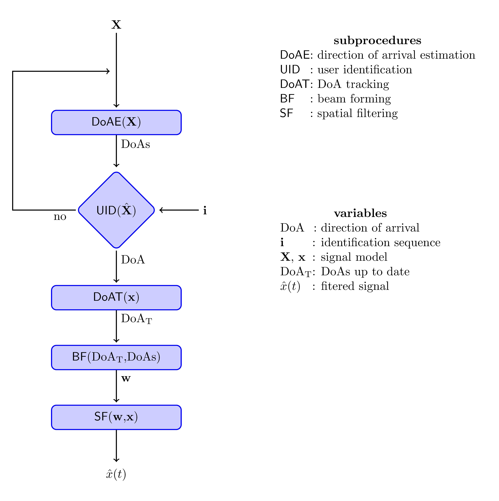

  * [flow-direction_of_arrival+diagram+matrrix+table.tex](https://github.com/walmes/Tikz/blob/master/src/flow-direction_of_arrival+diagram+matrrix+table.pgf)

```tex
% Direction-of-arrival diagram
% Author: Edgar Fuentes
\documentclass{article}
\usepackage{tikz}
%%%<
\usepackage{verbatim}
\usepackage[active,tightpage]{preview}
\PreviewEnvironment{tikzpicture}
\setlength\PreviewBorder{10pt}%
%%%>
\begin{comment}
:Title: Direction-of-arrival diagram
:Tags: Diagrams;Styles;
:Author: Edgar Fuentes
:Slug: doa-diagram

This diagram explains a spatial filter with direction of arrival estimation.
\end{comment}
\usetikzlibrary{shapes.geometric}
\usetikzlibrary{shapes.arrows}
\usepackage{array}

\begin{document}
\begin{tikzpicture} [
    auto,
    decision/.style = { diamond, draw=blue, thick, fill=blue!20,
                        text width=5em, text badly centered,
                        inner sep=1pt, rounded corners },
    block/.style    = { rectangle, draw=blue, thick, 
                        fill=blue!20, text width=10em, text centered,
                        rounded corners, minimum height=2em },
    line/.style     = { draw, thick, ->, shorten >=2pt },
  ]
  % Define nodes in a matrix
  \matrix [column sep=5mm, row sep=10mm] {
                    & \node [text centered] (x) {$\mathbf{X}$};            & \\
                    & \node (null1) {};                                    & \\
                    & \node [block] (doa) {\textsf{DoAE}($\mathbf{X}$)};   & \\
   			 		\node(null3){}; & \node [decision] (uiddes)
                        {\textsf{UID}($\hat{\mathbf{X}}$)};
                                  & \node[text centered](tra){$\mathbf{i}$}; \\
                    & \node [block] (track) {\textsf{DoAT}($\mathbf{x}$)}; & \\
                    & \node [block] (pesos)
                        {\textsf{BF}(DoA$_{\mathrm{T}}$,DoAs)};            & \\
                    & \node [block] (filtrado)
                        {\textsf{SF}($\mathbf{w}$,$\mathbf{x}$)};          & \\
                    & \node [text centered] (xf) {$\hat{x}(t)$ };          & \\
  };
  % connect all nodes defined above
  \begin{scope} [every path/.style=line]
    \path (x)        --    (doa);
    \path (doa)      --    node [near start] {DoAs} (uiddes);
    \path (tra)      --    (uiddes);
    \path (uiddes)   --++  (-3,0) node [near start] {no} |- (null1);
    \path (uiddes)   --    node [near start] {DoA} (track);
    \path (track)    --    node [near start] {DoA$_{\mathrm{T}}$} (pesos);
    \path (pesos)    --    node [near start] {\textbf{w}} (filtrado);
    \path (filtrado) --    (xf);
  \end{scope}
  %
  % legend for subprocedures
  \node (leyend) at (7.5, 5){
    \begin{tabular}{>{\sffamily}l@{: }l}
      \multicolumn{2}{c}{\textbf{subprocedures}} \\
      DoAE & direction of arrival estimation     \\
      UID  & user identification                 \\
      DoAT & DoA tracking                        \\
      BF   & beam forming                        \\
      SF   & spatial filtering
    \end{tabular}
  };
  %
  % legend for input and output variables
  \node (leyend) at (7, 0){
    \begin{tabular}{l@{: }l}
      \multicolumn{2}{c}{\textbf{variables}}              \\
      DoA                       & direction of arrival    \\
      $\mathbf{i}$              & identification sequence \\
      $\mathbf{X},\,\mathbf{x}$ & signal model            \\
      DoA$_{\mathrm{T}}$        & DoAs up to date         \\
      $\hat{x}(t)$              & fitered signal
      \end{tabular}
  };
\end{tikzpicture}
\end{document}
```
****


  * [flow-easy_flowchart+diagram.tex](https://github.com/walmes/Tikz/blob/master/src/flow-easy_flowchart+diagram.pgf)

```tex
% Flowcharting techniques for easy maintenance
% Author: Brent Longborough
\documentclass[x11names]{article}
\usepackage{tikz}
\usetikzlibrary{shapes,arrows,chains}
%%%<
\usepackage{verbatim}
\usepackage[active,tightpage]{preview}
\PreviewEnvironment{tikzpicture}
\setlength\PreviewBorder{5mm}%
%%%>
\begin{comment}
:Title: Easy-maintenance flowchart
:Tags: flowcharts
:Author: Brent Longborough
:Slug: flexible-flow-chart

  This TikZ example illustrates a number of techniques for making TikZ
  flowcharts easier to maintain:
    * Use of <on chain> and <on grid> to simplify positioning
    * Use of global <node distance> options to eliminate the need to 
      specify individual inter-node distances
    * Use of <join> to reduce the need for references to node names
    * Use of <join by> styles to tailor specific connectors
    * Use of <coordinate> nodes to provide consistent layout for
      parallel flow lines
    * A method for consistent annotation of decision box exits
    * A technique for marking coordinate nodes (for layout debugging)

    I encourage you to tinker at this file - add intermediate boxes,
    alter the global distance settings, and so on, to see how well (or
    ill!) it adapts.
\end{comment}
\begin{document}
% =================================================
% Set up a few colours
\colorlet{lcfree}{Green3}
\colorlet{lcnorm}{Blue3}
\colorlet{lccong}{Red3}
% -------------------------------------------------
% Set up a new layer for the debugging marks, and make sure it is on
% top
\pgfdeclarelayer{marx}
\pgfsetlayers{main,marx}
% A macro for marking coordinates (specific to the coordinate naming
% scheme used here). Swap the following 2 definitions to deactivate
% marks.
\providecommand{\cmark}[2][]{%
  \begin{pgfonlayer}{marx}
    \node [nmark] at (c#2#1) {#2};
  \end{pgfonlayer}{marx}
  } 
\providecommand{\cmark}[2][]{\relax} 
% -------------------------------------------------
% Start the picture
\begin{tikzpicture}[%
    >=triangle 60,              % Nice arrows; your taste may be different
    start chain=going below,    % General flow is top-to-bottom
    node distance=6mm and 60mm, % Global setup of box spacing
    every join/.style={norm},   % Default linetype for connecting boxes
    ]
% ------------------------------------------------- 
% A few box styles 
% <on chain> *and* <on grid> reduce the need for manual relative
% positioning of nodes
\tikzset{
  base/.style={draw, on chain, on grid, align=center, minimum height=4ex},
  proc/.style={base, rectangle, text width=8em},
  test/.style={base, diamond, aspect=2, text width=5em},
  term/.style={proc, rounded corners},
  % coord node style is used for placing corners of connecting lines
  coord/.style={coordinate, on chain, on grid, node distance=6mm and 25mm},
  % nmark node style is used for coordinate debugging marks
  nmark/.style={draw, cyan, circle, font={\sffamily\bfseries}},
  % -------------------------------------------------
  % Connector line styles for different parts of the diagram
  norm/.style={->, draw, lcnorm},
  free/.style={->, draw, lcfree},
  cong/.style={->, draw, lccong},
  it/.style={font={\small\itshape}}
}
% -------------------------------------------------
% Start by placing the nodes
\node [proc, densely dotted, it] (p0) {New trigger message thread};
% Use join to connect a node to the previous one 
\node [term, join]      {Trigger scheduler};
\node [proc, join] (p1) {Get quota $k > 1$};
\node [proc, join]      {Open queue};
\node [proc, join]      {Dispatch message};
\node [test, join] (t1) {Got msg?};
% No join for exits from test nodes - connections have more complex
% requirements
% We continue until all the blocks are positioned
\node [proc] (p2) {$k \mathbin{{-}{=}} 1$};
\node [proc, join] (p3) {Dispatch message};
\node [test, join] (t2) {Got msg?};
\node [test] (t3) {Capacity?};
\node [test] (t4) {$k \mathbin{{-}{=}} 1$};
% We position the next block explicitly as the first block in the
% second column.  The chain 'comes along with us'. The distance
% between columns has already been defined, so we don't need to
% specify it.
\node [proc, fill=lcfree!25, right=of p1] (p4) {Reset congestion};
\node [proc, join=by free] {Set \textsc{mq} wait flag};
\node [proc, join=by free] (p5) {Dispatch message};
\node [test, join=by free] (t5) {Got msg?};
\node [test] (t6) {Capacity?};
% Some more nodes specifically positioned (we could have avoided this,
% but try it and you'll see the result is ugly).
\node [test] (t7) [right=of t2] {$k \mathbin{{-}{=}} 1$};
\node [proc, fill=lccong!25, right=of t3] (p8) {Set congestion};
\node [proc, join=by cong, right=of t4] (p9) {Close queue};
\node [term, join] (p10) {Exit trigger message thread};
% -------------------------------------------------
% Now we place the coordinate nodes for the connectors with angles, or
% with annotations. We also mark them for debugging.
\node [coord, right=of t1] (c1)  {}; \cmark{1}   
\node [coord, right=of t3] (c3)  {}; \cmark{3}   
\node [coord, right=of t6] (c6)  {}; \cmark{6}   
\node [coord, right=of t7] (c7)  {}; \cmark{7}   
\node [coord, left=of t4]  (c4)  {}; \cmark{4}   
\node [coord, right=of t4] (c4r) {}; \cmark[r]{4}
\node [coord, left=of t7]  (c5)  {}; \cmark{5}   
% -------------------------------------------------
% A couple of boxes have annotations
\node [above=0mm of p4, it] {(Queue was empty)};
\node [above=0mm of p8, it] {(Queue was not empty)};
% -------------------------------------------------
% All the other connections come out of tests and need annotating
% First, the straight north-south connections. In each case, we first
% draw a path with a (consistently positioned) annotation node, then
% we draw the arrow itself.
\path (t1.south) to node [near start, xshift=1em] {$y$} (p2);
  \draw [*->,lcnorm] (t1.south) -- (p2);
\path (t2.south) to node [near start, xshift=1em] {$y$} (t3); 
  \draw [*->,lcnorm] (t2.south) -- (t3);
\path (t3.south) to node [near start, xshift=1em] {$y$} (t4); 
  \draw [*->,lcnorm] (t3.south) -- (t4);
\path (t5.south) to node [near start, xshift=1em] {$y$} (t6); 
  \draw [*->,lcfree] (t5.south) -- (t6);
\path (t6.south) to node [near start, xshift=1em] {$y$} (t7); 
  \draw [*->,lcfree] (t6.south) -- (t7); 
% ------------------------------------------------- 
% Now the straight east-west connections. To provide consistent
% positioning of the test exit annotations, we have positioned
% coordinates for the vertical part of the connectors. The annotation
% text is positioned on a path to the coordinate, and then the whole
% connector is drawn to its destination box.
\path (t3.east) to node [near start, yshift=1em] {$n$} (c3); 
  \draw [o->,lccong] (t3.east) -- (p8);
\path (t4.east) to node [yshift=-1em] {$k \leq 0$} (c4r); 
  \draw [o->,lcnorm] (t4.east) -- (p9);
% -------------------------------------------------
% Finally, the twisty connectors. Again, we place the annotation
% first, then draw the connector
\path (t1.east) to node [near start, yshift=1em] {$n$} (c1); 
  \draw [o->,lcfree] (t1.east) -- (c1) |- (p4);
\path (t2.east) -| node [very near start, yshift=1em] {$n$} (c1); 
  \draw [o->,lcfree] (t2.east) -| (c1);
\path (t4.west) to node [yshift=-1em] {$k>0$} (c4); 
  \draw [*->,lcnorm] (t4.west) -- (c4) |- (p3);
\path (t5.east) -| node [very near start, yshift=1em] {$n$} (c6); 
  \draw [o->,lcfree] (t5.east) -| (c6); 
\path (t6.east) to node [near start, yshift=1em] {$n$} (c6); 
  \draw [o->,lcfree] (t6.east) -| (c7); 
\path (t7.east) to node [yshift=-1em] {$k \leq 0$} (c7); 
  \draw [o->,lcfree] (t7.east) -- (c7)  |- (p9);
\path (t7.west) to node [yshift=-1em] {$k>0$} (c5); 
  \draw [*->,lcfree] (t7.west) -- (c5) |- (p5);
% -------------------------------------------------
% A last flourish which breaks all the rules
\draw [->,MediumPurple4, dotted, thick, shorten >=1mm]
  (p9.south) -- ++(5mm,-3mm)  -- ++(27mm,0) 
  |- node [black, near end, yshift=0.75em, it]
    {(When message + resources available)} (p0);
% -------------------------------------------------
\end{tikzpicture}
% =================================================
\end{document}
```
****


  * [flow-flowchart_video+diagram+style.tex](https://github.com/walmes/Tikz/blob/master/src/flow-flowchart_video+diagram+style.pgf)

```tex
% https://github.com/FriendlyUser/LatexDiagrams
\documentclass{standalone}

\usepackage{tikz}
\usetikzlibrary{arrows.meta,
                calc, chains,
                quotes,
                positioning,
                shapes.geometric}

\begin{document}

\begin{tikzpicture}[
    node distance = 8mm and 16mm,
      start chain = A going below,
      base/.style = {draw, minimum width=32mm, minimum height=8mm,
                     align=center, on chain=A},
 startstop/.style = {base, rectangle, rounded corners, fill=red!30},
   process/.style = {base, rectangle, fill=orange!30},
        io/.style = {base, trapezium, 
                     trapezium left angle=70, trapezium right angle=110,
                     fill=blue!30},
  decision/.style = {base, diamond, fill=green!30},
  every edge quotes/.style = {auto=right}]
                    ]
\node [startstop]       {Read Video};            % <-- A-1
\node [process]         {Extract Frames};
\node [io]              {Read Frame};
\node [decision]        {Completed?};
\node [process]         {Save Watermarked Video};
\node [process]         {Stop};             % <-- A-6
%
\node [process,                             % <-- A-7
       right=of A-4]    {Get Next Frame};
%%
\draw [arrows=-Stealth] 
    (A-1) edge["read data"]          (A-2)
    (A-2) edge["get watermark"]    (A-3)
    (A-3) edge[text width=3cm,"apply watermark to all frames "]       (A-4)
    (A-4) edge["yes"]            (A-5)
    (A-5) edge["exit"]          (A-6)
    (A-4) edge["no"']          (A-7)       % <-- by ' is swapped label position
    (A-7) |- ($(A-2.south east)!0.5!(A-3.north east)$)
          -| ([xshift=7mm] A-3.north)
    ;
  \end{tikzpicture}
\end{document}
```
****

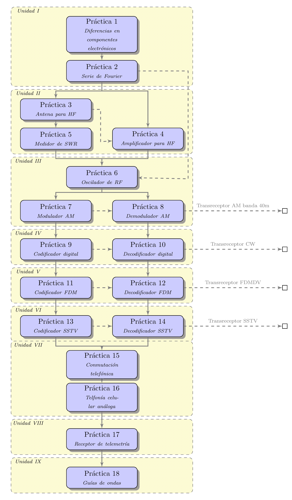

  * [flow-labs_class+diagram+style+pgf+command.tex](https://github.com/walmes/Tikz/blob/master/src/flow-labs_class+diagram+style+pgf+command.pgf)

```tex
% Schema of Labs on a class
% Author: Cristo J. Alanis
\documentclass[11pt]{article}
\usepackage{tikz} 
%%%<
\usepackage{verbatim}
\usepackage[active,tightpage]{preview}
\PreviewEnvironment{tikzpicture}
\setlength\PreviewBorder{5pt}%
%%%>
\begin{comment}
:Title: Schema of Labs on a class
:Tags: Shadows;Styles;Backgrounds;Diagrams
:Author: Cristo J. Alanis
:Slug: labs-schema

Listado de pr\'acticas
\end{comment}
\usetikzlibrary{shadows,arrows}
% Define the layers to draw the diagram
\pgfdeclarelayer{background}
\pgfdeclarelayer{foreground}
\pgfsetlayers{background,main,foreground}
 
% Define block styles  
\tikzstyle{materia}=[draw, fill=blue!20, text width=6.0em, text centered,
  minimum height=1.5em,drop shadow]
\tikzstyle{practica} = [materia, text width=8em, minimum width=10em,
  minimum height=3em, rounded corners, drop shadow]
\tikzstyle{texto} = [above, text width=6em, text centered]
\tikzstyle{linepart} = [draw, thick, color=black!50, -latex', dashed]
\tikzstyle{line} = [draw, thick, color=black!50, -latex']
\tikzstyle{ur}=[draw, text centered, minimum height=0.01em]
 
% Define distances for bordering
\newcommand{\blockdist}{1.3}
\newcommand{\edgedist}{1.5}

\newcommand{\practica}[2]{node (p#1) [practica]
  {Pr\'actica #1\\{\scriptsize\textit{#2}}}}

% Draw background
\newcommand{\background}[5]{%
  \begin{pgfonlayer}{background}
    % Left-top corner of the background rectangle
    \path (#1.west |- #2.north)+(-0.5,0.5) node (a1) {};
    % Right-bottom corner of the background rectanle
    \path (#3.east |- #4.south)+(+0.5,-0.25) node (a2) {};
    % Draw the background
    \path[fill=yellow!20,rounded corners, draw=black!50, dashed]
      (a1) rectangle (a2);
    \path (a1.east |- a1.south)+(0.8,-0.3) node (u1)[texto]
      {\scriptsize\textit{Unidad #5}};
  \end{pgfonlayer}}

\newcommand{\transreceptor}[3]{%
  \path [linepart] (#1.east) -- node [above]
    {\scriptsize Transreceptor #2} (#3);}

\begin{document}
\begin{tikzpicture}[scale=0.7,transform shape]
 
  % Draw diagram elements
  \path \practica {1}{Diferencias en componentes electr\'onicos};
  \path (p1.south)+(0.0,-1.0) \practica{2}{Serie de Fourier};
  \path (p2.south)+(-2.5,-1.5) \practica{3}{Antena para HF};
  \path (p3.south)+(0.0,-1.0) \practica{5}{Medidor de SWR};
  \path (p3.south)+(5.0,-1.0) \practica{4}{Amplificador para HF};

  \path (p4.south)+(-2.5,-1.5) \practica{6}{Oscilador de RF};
  \path (p6.south)+(-2.5,-1.25) \practica{7}{Modulador AM};
  \path (p6.south)+(2.5,-1.25) \practica{8}{Demodulador AM};
  \path (p8.east)+(+5.5,0) node (ur1)[ur] {};

  \path (p7.south)+(0.0,-1.5) \practica{9}{Codificador digital};
  \path (p8.south)+(0.0,-1.5) \practica{10}{Decodificador digital};
  \path (p10.east)+(+5.5,0) node (ur2)[ur] {};
  \path (p9.south)+(0.0,-1.5) \practica{11}{Codificador FDM};
  \path (p10.south)+(0.0,-1.5) \practica{12}{Decodificador FDM};
  \path (p12.east)+(+5.5,0) node (ur3)[ur] {};
  \path (p11.south)+(0.0,-1.5) \practica{13}{Codificador SSTV};
  \path (p12.south)+(0.0,-1.5) \practica{14}{Decodificador SSTV};
  \path (p14.east)+(+5.5,0) node (ur4)[ur] {};
  \path (p14.south)+(-2.5,-1.5) \practica{15}{Conmutaci\'on telef\'onica};
  \path (p15.south)+(0.0,-1.0) \practica{16}{Telfon\'ia celular an\'aloga};
  \path (p16.south)+(0.0,-1.5) \practica{17}{Receptor de  telemetr\'ia}; 
  \path (p17.south)+(0.0,-1.5) \practica{18}{Gu\'ias de ondas};
     
  % Draw arrows between elements
  \path [line] (p1.south) -- node [above] {} (p2);

  \path [line] (p2.south) -- +(0.0,-0.5) -- +(-2.5,-0.5)
    -- node [above, midway] {} (p3);
  \path [line] (p3.south) -- node [above] {} (p5) ;
     
  \path [line] (p2.south) -- +(0.0,-0.5) -- +(+2.5,-0.5)
    -- node [above, midway] {} (p4);
  \path [linepart] (p3.east) -- +(+0.5,-0.0) -- +(+0.5,-1.75)
    -- node [left, midway] {} (p4);
  \path [linepart] (p3.east) -- +(+0.5,-0.0) -- +(+0.5,-1.75)
    -- node [left, midway] {} (p4);

  \path [line] (p4.south) -- +(0.0,-0.5) -- +(-2.5,-0.5)
    -- node [above, midway] {} (p6);
  \path [line] (p5.south) -- +(0.0,-0.5) -- +(+2.5,-0.5)
    -- node [above, midway] {} (p6);     
  \path [linepart] (p2.east) -- +(2.75,0.0) -- +(2.75,-5.85)
    -- node [right] {} (p6);
  \path [line] (p6.south) -- +(0.0,-0.25) -- +(-2.5,-0.25)
    -- node [above, midway] {} (p7);
  \path [line] (p6.south) -- +(0.0,-0.25) -- +(+2.5,-0.25)
    -- node [above, midway] {} (p8);
  \path [linepart] (p7.east) -- node [left] {} (p8);
  \transreceptor{p8}{AM banda 40m}{ur1}

  \path [line] (p7.south) -- node [above] {} (p9) ;
  \path [line] (p8.south) -- node [above] {} (p10) ;
  \path [linepart] (p9.east) -- node [left] {} (p10);
  \transreceptor{p10}{CW}{ur2}
  \path [line] (p9.south) -- node [above] {} (p11) ;
  \path [line] (p10.south) -- node [above] {} (p12) ;
  \path [linepart] (p11.east) -- node [left] {} (p12);
  \transreceptor{p12}{FDMDV}{ur3}

  \path [line] (p11.south) -- node [above] {} (p13) ;
  \path [line] (p12.south) -- node [above] {} (p14) ;
  \path [linepart] (p13.east) -- node [left] {} (p14);   
  \transreceptor{p14}{SSTV}{ur4}

  \path [line] (p14.south) -- +(0.0,-0.5) -- +(-2.5,-0.5)
    -- node [above, midway] {} (p15);
  \path [line] (p13.south) -- +(0.0,-0.5) -- +(+2.5,-0.5)
    -- node [above, midway] {} (p15);
  \path [line] (p15.south) -- node [above] {} (p16) ;     
  \path [line] (p16.south) -- node [above] {} (p17) ;
  \path [line] (p17.south) -- node [above] {} (p18) ;
   
  \background{p3}{p1}{p4}{p2}{I}
  \background{p3}{p3}{p4}{p5}{II}
  \background{p3}{p6}{p4}{p7}{III}
  \background{p3}{p9}{p4}{p10}{IV}
  \background{p3}{p11}{p4}{p12}{V}
  \background{p3}{p13}{p4}{p14}{VI}
  \background{p3}{p15}{p4}{p16}{VII}
  \background{p3}{p17}{p4}{p17}{VIII}
  \background{p3}{p18}{p4}{p18}{IX}
\end{tikzpicture}
\end{document} 
```
****

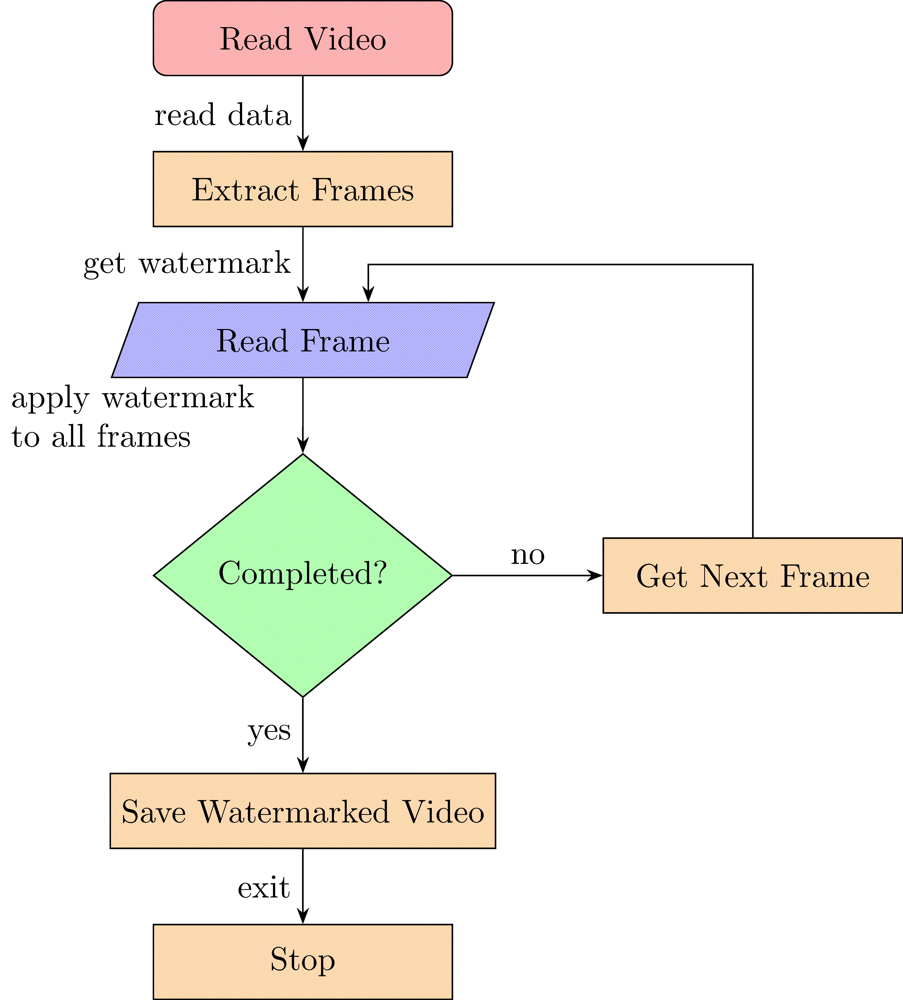

  * [flow-report_diagrams+diagram+learn+style.tex](https://github.com/walmes/Tikz/blob/master/src/flow-report_diagrams+diagram+learn+style.pgf)

```tex
\documentclass{standalone}

\usepackage{tikz}
\usetikzlibrary{arrows.meta,
                calc, chains,
                quotes,
                positioning,
                shapes.geometric}

\begin{document}

\begin{tikzpicture}[
    node distance = 8mm and 16mm,
      start chain = A going below,
      base/.style = {draw, minimum width=32mm, minimum height=8mm,
                     align=center, on chain=A},
 startstop/.style = {base, rectangle, rounded corners, fill=red!30},
   process/.style = {base, rectangle, fill=orange!30},
        io/.style = {base, trapezium, 
                     trapezium left angle=70, trapezium right angle=110,
                     fill=blue!30},
  decision/.style = {base, diamond, fill=green!30},
  every edge quotes/.style = {auto=right}]
                    ]
\node [startstop]       {Read Video};            % <-- A-1
\node [process]         {Extract Frames};
\node [io]              {Read Frame};
\node [decision]        {Completed?};
\node [process]         {Save Watermarked Video};
\node [process]         {Stop};             % <-- A-6
%
\node [process,                             % <-- A-7
       right=of A-4]    {Get Next Frame};
%%
\draw [arrows=-Stealth] 
    (A-1) edge["read data"]          (A-2)
    (A-2) edge["get watermark"]    (A-3)
    (A-3) edge[text width=3cm,"apply watermark to all frames "]       (A-4)
    (A-4) edge["yes"]            (A-5)
    (A-5) edge["exit"]          (A-6)
    (A-4) edge["no"']          (A-7)       % <-- by ' is swapped label position
    (A-7) |- ($(A-2.south east)!0.5!(A-3.north east)$)
          -| ([xshift=7mm] A-3.north)
    ;
  \end{tikzpicture}
\end{document}
```
****

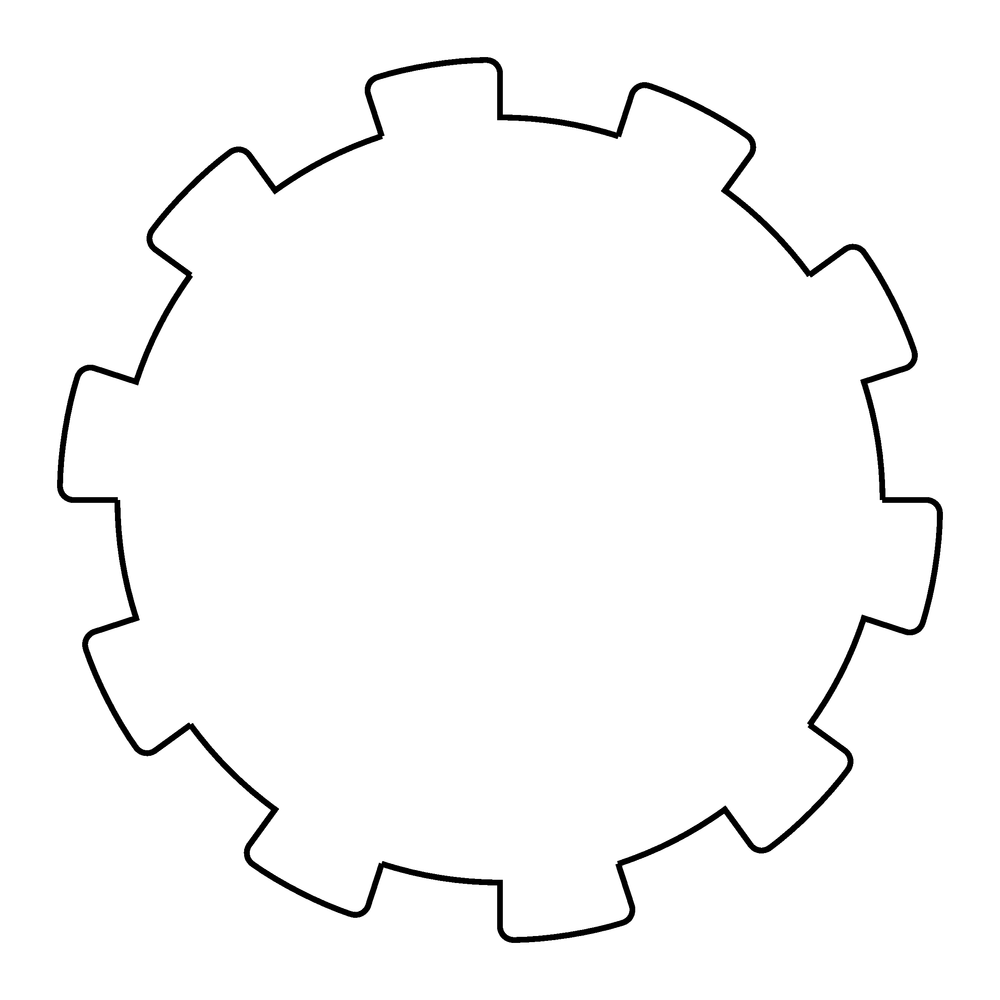

  * [gears_simple+foreach.tex](https://github.com/walmes/Tikz/blob/master/src/gears_simple+foreach.pgf)

```tex
\documentclass[border=3mm,tikz]{standalone}
%\documentclass[11pt]{scrartcl}
\usepackage{tikz}

\begin{document}
\begin{tikzpicture}

	\draw[thick]
	\foreach \i in {1,2,...,10} {%
	  [rotate=(\i-1)*36] 
	 (0:2)  arc (0:18:2) {[rounded corners=2pt] -- ++(18: 0.3)  arc (18:36:2.3) } -- ++(36: -0.3) 
	};
\end{tikzpicture}
\end{document} 
```
****

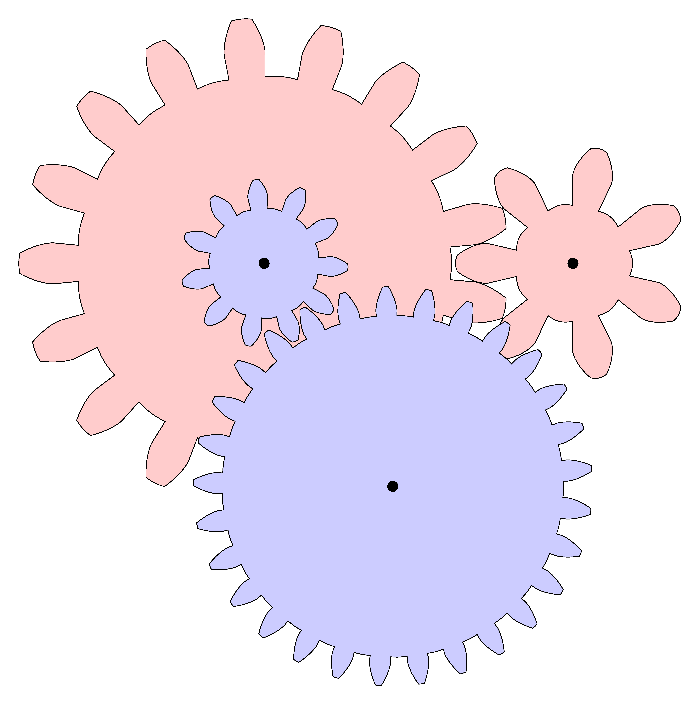

  * [gears+pgf+def.tex](https://github.com/walmes/Tikz/blob/master/src/gears+pgf+def.pgf)

```tex
% https://tex.stackexchange.com/a/299454/173708
% takes 40 seconds to compile
\documentclass[tikz,margin=10pt]{standalone}

\tikzset{pics/gear/.style n args={3}{
    code={
        \def\modu{#1}
        \def\Zb{#2}
        \def\AngleA{#3}

        \pgfmathsetmacro{\Rpr}{\Zb*\modu/2}
        \pgfmathsetmacro{\Rb}{\Rpr*cos(\AngleA)}
        \pgfmathsetmacro{\Rt}{\Rpr+\modu}
        \pgfmathsetmacro{\Rp}{\Rpr-1.25*\modu}
        \pgfmathsetmacro{\AngleT}{pi/180*acos(\Rb/\Rt)}
        \pgfmathsetmacro{\AnglePr}{pi/180*acos(\Rb/\Rpr)}
        \pgfmathsetmacro{\demiAngle}{180/\Zb}
        \pgfmathsetmacro{\Angledecal}{(\demiAngle-2*\AnglePr)/2}

        \path[pic actions] foreach \zz in{1,...,\Zb}{
            \ifnum\zz=1
                % don't use a lineto in the first iteration
                (\zz/\Zb*360-\Angledecal:\Rp)
            \else
                -- (\zz/\Zb*360-\Angledecal:\Rp)
            \fi
            to[bend right=\demiAngle]
            (\zz/\Zb*360+\Angledecal:\Rp)
            --
            plot[domain=-0:\AngleT,smooth,variable=\t]
                ({{180/pi*(-\t+tan(180/pi*\t)) +\zz/\Zb*360+\Angledecal}:\Rb/cos(180/pi*\t)})
            %
            to[bend right=\demiAngle]
                ({{180/pi*(\AngleT+tan(180/pi*-\AngleT)) +(\zz+1)/\Zb*360-\Angledecal}:
                \Rb/cos(180/pi*-\AngleT)})
            --
            plot[domain=-\AngleT:-0,smooth,variable=\t]
            ({{180/pi*(-\t+tan(180/pi*\t)) +(\zz+1)/\Zb*360-\Angledecal}:\Rb/cos(180/pi*\t)})
        } -- cycle;
    }
}}

\begin{document}
    \begin{tikzpicture}
        % observations:
        %
        %  - param #1 and #3 must be equal for gears to mesh
        %  - the required distance is (#2_1 + #2_2) * #1 / 2
        %  - for odd numbers of teeth, gears on a horizontal axis fit without rotation

        \pic[draw,fill=red!20!white]                     at (0,0)   {gear={0.50}{17}{15}};
        \pic[draw,fill=red!20!white]                     at (6,0)   {gear={0.50}{ 7}{15}};

        \pic[draw,fill=blue!20!white,rotate=-60 + 90/11] at (0,0)   {gear={0.25}{11}{20}};
        \pic[draw,fill=blue!20!white,rotate=-60 - 90/29] at (-60:5) {gear={0.25}{29}{20}};

        \foreach \p in {(0,0),(6,0),(-60:5)} \fill \p circle (3pt);
    \end{tikzpicture}
\end{document}
```
****


  * [geom-circle_bisectors_triangle+geometry.tex](https://github.com/walmes/Tikz/blob/master/src/geom-circle_bisectors_triangle+geometry.pgf)

```tex
% Perpendicular bisectors of a triangle
% Author: Sam Britt
\documentclass[tikz,border=10pt]{standalone}
%%%<
\usepackage{verbatim}
%%%>
\begin{comment}
:Title: Perpendicular bisectors of a triangle
:Tags: Coordinate calculations;Foreach;Mathematical engine;Geometry;Mathematics
:Author: Sam Britt
:Slug: bisector

A perpendicular bisector of a line segment is a line which is perpendicular
to this line and passes through its midpoint. This drawing shows
perpendicular bisectors of a triangle. They meet in the center of the
circumcircle of the triangle.

This example was written by Sam Britt answering a question on TeX.SE.
\end{comment}
\usetikzlibrary{calc}
\begin{document}
\begin{tikzpicture}
  [
    scale=3,
    >=stealth,
    point/.style = {draw, circle,  fill = black, inner sep = 1pt},
    dot/.style   = {draw, circle,  fill = black, inner sep = .2pt},
  ]

  % the circle
  \def\rad{1}
  \node (origin) at (0,0) [point, label = {below right:$P_c$}]{};
  \draw (origin) circle (\rad);

  % triangle nodes: just points on the circle
  \node (n1) at +(60:\rad) [point, label = above:$1$] {};
  \node (n2) at +(-145:\rad) [point, label = below:$2$] {};
  \node (n3) at +(-45:\rad) [point, label = {below right:$3$ $(0, 0, 0)$}] {};

  % triangle edges: connect the vertices, and leave a node at the midpoint
  \draw[->] (n3) -- node (a) [label = {above right:$\vec{v}_1$}] {} (n1);
  \draw[->] (n3) -- node (b) [label = {below right:$\vec{v}_2$}] {} (n2);
  \draw[dashed] (n2) -- (n1);

  % Bisectors
  % start at the point lying on the line from (origin) to (a), at
  % twice that distance, and then draw a path going to the point on
  % the line lying on the line from (a) to the (origin), at 3 times
  % that distance.
  \draw[dotted]
    ($ (origin) ! 2 ! (a) $)
    node [right] {Bisector 1}
    -- ($(a) ! 3 ! (origin)$ );

  % similarly for origin and b
  \draw[dotted]
    ($ (origin) ! 2 ! (b) $)
    -- ($(b) ! 3 ! (origin)$ )
    node [right] {Bisector 2};

  % short vectors
  \draw[->]
    ($ (origin) ! -.7 ! (a) $)
    -- node [below] {$\vec{u}_4$}
    ($ (origin) ! -.1 ! (a) $);
  \draw[->]
    ($ (origin) ! -.1 ! (b) $)
    -- node [right] {$\vec{u}_3$}
    ($ (origin) ! -.7 ! (b) $);

  % Right angle symbols
  \def\ralen{.5ex}  % length of the short segment
  \foreach \inter/\first/\last in {a/n3/origin, b/n2/origin}
    {
      \draw let \p1 = ($(\inter)!\ralen!(\first)$), % point along first path
                \p2 = ($(\inter)!\ralen!(\last)$),  % point along second path
                \p3 = ($(\p1)+(\p2)-(\inter)$)      % corner point
            in
              (\p1) -- (\p3) -- (\p2)               % path
              ($(\inter)!.5!(\p3)$) node [dot] {};  % center dot
    }
\end{tikzpicture}
\end{document}
```
****


  * [geom-circle_coordinate_systems+geometry.tex](https://github.com/walmes/Tikz/blob/master/src/geom-circle_coordinate_systems+geometry.pgf)

```tex
% https://github.com/PetarV-/TikZ/blob/master/Coordinate%20systems/coordinate_systems.tex
\documentclass[crop, tikz, border=10pt]{standalone}
\usepackage{tikz}

\usetikzlibrary{calc}

\definecolor{olivegreen}{rgb}{0,0.6,0}

\begin{document}
\begin{tikzpicture}[scale=0.85]
	% Axis
	\draw[thick,-stealth,black] (-3,0)--(3,0) coordinate (A) node[below] {$x$}; % x axis
	\draw[thick,-stealth,black] (0,-3)--(0,3) node[left] {$y$}; % y axis
	\draw[black,thin] (0,0) circle (2.5cm);
	
	\draw[ultra thick,red] (0,0) -- (60:2.5cm |- 0,0) node[midway,below] {$x$}; % UpOn y axis

	\draw (1,0) arc (0:60:1) node at ($(60/2:0.7)$) {$\alpha$};
	\draw[ultra thick, blue] (60:2.5cm) -- (60:2.5cm |- 0,0) node[midway,right] {$y$}; % vertical line

	\draw[ultra thick,olivegreen,rotate=60] (0,0) -- node [left] {$r$} (2.5,0) coordinate (B); 
    
	\draw[xshift=-1cm] (B) node[circle,fill,inner sep=1pt,label=above:$P$](e){};
\end{tikzpicture}
\end{document}
```
****


  * [geom-ellipse_on_coords+geometry+pgf+def+script.tex](https://github.com/walmes/Tikz/blob/master/src/geom-ellipse_on_coords+geometry+pgf+def+script.pgf)

```tex
\documentclass[0pt]{article}
\usepackage{pgf,tikz}
\usepackage{mathrsfs}
\usetikzlibrary{arrows}

\pagestyle{empty}

\begin{document}
%\SweaveOpts{concordance=TRUE}
\definecolor{ududff}{rgb}{0.30196078431372547,0.30196078431372547,1}
\definecolor{cqcqcq}{rgb}{0.7529411764705882,0.7529411764705882,0.7529411764705882}
\begin{tikzpicture}[line cap=round,line join=round,>=triangle 45,x=1cm,y=1cm]
	\draw [color=cqcqcq,, xstep=1cm,ystep=1cm] (-11.22,-7.62) grid (8.54,8.3);
	\draw[->,color=black] (-11.22,0) -- (8.54,0);
	\foreach \x in {-11,-10,-9,-8,-7,-6,-5,-4,-3,-2,-1,1,2,3,4,5,6,7,8}
	\draw[shift={(\x,0)},color=black] (0pt,2pt) -- (0pt,-2pt) node[below] {\footnotesize $\x$};
	\draw[->,color=black] (0,-7.62) -- (0,8.3);
	\foreach \y in {-7,-6,-5,-4,-3,-2,-1,1,2,3,4,5,6,7,8}
	\draw[shift={(0,\y)},color=black] (2pt,0pt) -- (-2pt,0pt) node[left] {\footnotesize $\y$};
	\draw[color=black] (0pt,-10pt) node[right] {\footnotesize $0$};
	\clip(-11.22,-7.62) rectangle (8.54,8.3);
	\draw [rotate around={-27.068368650285745:(-4.32,2.45)},line width=2pt] (-4.32,2.45) ellipse (4.618210097836655cm and 3.463721193710664cm);
	\draw (-4.98,-1.58) node[anchor=north west] {ellipse};
	\begin{scriptsize}
		\draw [fill=ududff] (-7.04,3.84) circle (2.5pt);
		\draw[color=ududff] (-6.85,4.35) node {$A$};
		\draw [fill=ududff] (-1.6,1.06) circle (2.5pt);
		\draw[color=ududff] (-1.41,1.57) node {$B$};
		\draw [fill=ududff] (-3.78,-1.26) circle (2.5pt);
		\draw[color=ududff] (-3.59,-0.75) node {$C$};
		\draw[color=black] (-5.11,6.09) node {$c$};
		\draw [fill=ududff] (-6.64,-1.24) circle (2.5pt);
		\draw[color=ududff] (-6.45,-0.73) node {$D$};
		\end{scriptsize}
\end{tikzpicture}
\end{document}
```
****

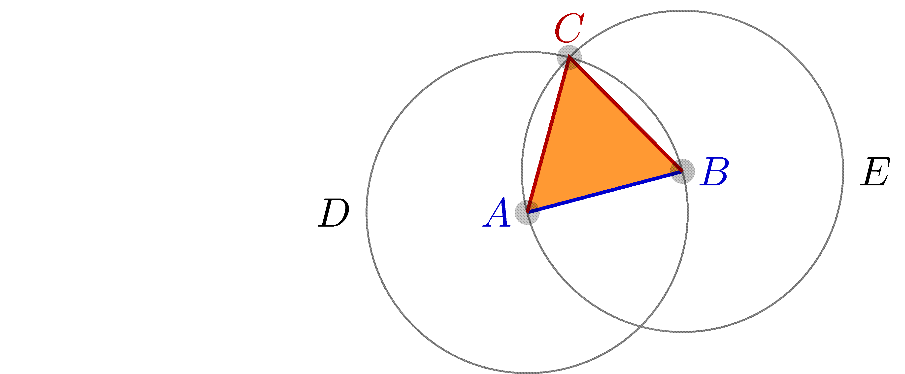

  * [geom-euclides+geometry.tex](https://github.com/walmes/Tikz/blob/master/src/geom-euclides+geometry.pgf)

```tex
\documentclass{standalone}
%\documentclass[crop, tikz]{standalone}

\usepackage{tikz}

\begin{document}

% add packages 
\usetikzlibrary{calc,intersections,through,backgrounds}

\begin{tikzpicture}[thick,help lines/.style={thin, draw=black!50}]

\def\A{\textcolor{input}{$A$}} 
\def\B{\textcolor{input}{$B$}}
\def\C{\textcolor{output}{$C$}} 
\def\D{$D$}
\def\E{$E$}

% define colors
\colorlet{input}{blue!80!black} 
\colorlet{output}{red!70!black}
\colorlet{triangle}{orange}

\coordinate [label=left:\A] (A) at ($ (0,0) + .1*(rand,rand) $);
\coordinate [label=right:\B] (B) at ($ (1.25,0.25) + .1*(rand,rand) $);

\draw [input] (A) -- (B);

\node [name path=D,help lines,draw,label=left:\D] (D) at (A) [circle through=(B)] {};
\node [name path=E,help lines,draw,label=right:\E] (E) at (B) [circle through=(A)] {};

\path [name intersections={of=D and E, by={[label=above:\C]C}}];

\draw [output] (A) -- (C) -- (B);

\foreach \point in {A,B,C}
\fill [black, opacity=.25] (\point) circle (3pt);

\begin{pgfonlayer}{background}
\fill[triangle!80] (A) -- (C) -- (B) -- cycle;
\end{pgfonlayer}

\end{tikzpicture}

\end{document}
```
****


  * [geom-hyperbola+geometry+physics.tex](https://github.com/walmes/Tikz/blob/master/src/geom-hyperbola+geometry+physics.pgf)

```tex
% https://wiki.physik.uzh.ch/cms/latex:tikz:hyperbola
    % Author: Izaak Neutelings (July, 2017)

\documentclass{article}
\usepackage{amsmath} % for \dfrac
\usepackage{tikz}
\tikzset{>=latex} % for LaTeX arrow head

\usepackage{pgfplots}                                     % for the axis environment

\usetikzlibrary{calc} % to do arithmetic with coordinates
\usetikzlibrary{angles,quotes} % for pic

% colors
\definecolor{mylightgrey}{RGB}{230,230,230}
\definecolor{mygrey}{RGB}{190,190,190}
\definecolor{mydarkgrey}{RGB}{110,110,110}
\definecolor{mygreen}{RGB}{120,220,160}
\definecolor{mydarkgreen}{RGB}{60,120,60}
\definecolor{myverydarkgreen}{RGB}{20,60,20}
\definecolor{mydarkred}{RGB}{140,40,40}

% mark right angle
\newcommand{\MarkRightAngle}[4][1.5mm]
{\coordinate (tempa) at ($(#3)!#1!(#2)$);
	\coordinate (tempb) at ($(#3)!#1!(#4)$);
	\coordinate (tempc) at ($(tempa)!0.5!(tempb)$);%midpoint
	\draw (tempa) -- ($(#3)!2!(tempc)$) -- (tempb);
}

% split figures into pages
\usepackage[active,tightpage]{preview}
\PreviewEnvironment{tikzpicture}
\setlength\PreviewBorder{1pt}%

\begin{document}
	
	
	% RUTHERFORD SCATTERING - hyperbola orbit
	\begin{tikzpicture}[scale=1]
	
	% limits & parameters
	\def\xa{-2.4}
	\def\xb{ 4}
	\def\ya{-4}
	\def\yb{ 4}
	\def\tmax{2.1}
	\def\a{1.3}
	\def\b{1}
	\def\c{{sqrt(\a^2+\b^2)}}
	\def\N{100} % number of points
	
	% coordinates
	\coordinate (O)  at (   0,  0 );
	\coordinate (A)  at (  \a,  0 );
	\coordinate (F1) at (  {sqrt(\a^2+\b^2)},   0 );
	\coordinate (F2) at ( -{sqrt(\a^2+\b^2)},   0 );
	\coordinate (P)  at ( -{\a^2/sqrt(\a^2+\b^2)}, -{\a*\b/sqrt(\a^2+\b^2)} );
	\coordinate (P1) at (\xb*\a, \yb*\b);
	\coordinate (P2) at (\xb*\a,-\yb*\b);
	\coordinate (yshift) at (0,0.4);
	
	% axes & asymptotes
	\draw[mygrey] % x axis
	(\xa*\a,0) -- (\xb*\a,0);
	\draw[dashed,mydarkgrey]
	(-\xb*\a*0.45, \ya*\b*0.45) -- (\xb*\a, \yb*\b)
	(-\xb*\a*0.45,-\ya*\b*0.45) -- (\xb*\a,-\yb*\b);
	
	% arrows
	\def\vtheta{30}
	\def\vradius{0.8}
	\draw[->,myverydarkgreen,shift=($(P1)-(yshift)$),scale=0.6]
	(0,0) -- (-\a,-\b) node[midway,below right=0pt] {${v}_i$};
	\draw[->,myverydarkgreen,shift=($(P2)+(yshift)$),scale=0.6]
	(-\a,\b) -- (0,0) node[midway,above right=-2pt] {${v}_f$};
	\draw[->,myverydarkgreen]
	(\a+0.35,{\vradius*sin(\vtheta)}) arc (180-\vtheta:180+\vtheta+10:\vradius)
	node[above right=0pt] {$v^*$};
	
	% angles
	\MarkRightAngle{F2}{P}{O}
	\pic [draw,myverydarkgreen,"$\theta$",angle radius=12,angle eccentricity=1.4] {angle = F2--O--P};
	\pic [draw,below,angle radius=16,angle eccentricity=1.4] {angle = P2--O--P1};
	\node[right=1pt,below=-2pt,myverydarkgreen] at ($(O)!0.5!(A)$)  {\small$\phi$};
	
	% hyperbola
	\draw[color=mylightgrey,line width=0.5,samples=\N,variable=\t,domain=-\tmax*0.58:\tmax*0.58] % left
	plot({-\a*cosh(\t)},{\b*sinh(\t)});
	\draw[color=mydarkgreen,line width=1,samples=\N,variable=\t,domain=-\tmax:\tmax] % right
	plot({ \a*cosh(\t)},{\b*sinh(\t)}); % {exp(\y)+exp(-\y)
	
	% nodes
	\draw[myverydarkgreen]
	(F2) -- (P) node[midway,below left=1pt,] {$b$};
	\fill[radius=1.5pt]
	(A)  circle node[above left=0pt] {A}
	(O)  circle node[above=2pt] {O};
	\fill[radius=2.5pt,mydarkred]
	(F2) circle node[above=2pt] {N};
	\draw[]
	%(O) -- (F2)
	node[left=1pt,above=0pt] at ($(F2)!0.5!(O)$) {$c$}
	node[below right] at ($(P)!0.5!(O)$)  {$a$};
	
	% alpha particle
	\draw[radius=1pt,mydarkgreen,fill]
	({ \a*cosh(\tmax*1.02)},{\b*sinh(\tmax*1.02)}) circle node[above right=0pt] {$\alpha$};
	
	\end{tikzpicture}
	
	
	
	
	
	% RUTHERFORD SCATTERING - hyperbolic orbits with different impact parameters
	\begin{tikzpicture}[scale=1]
	
	% limits & parameters
	\def\xa{-35}
	\def\xb{ 55}
	\def\ya{ -1}
	\def\yb{ 55}
	\def\tmax{4.5}
	\def\N{50} % number of points
	
	% use axes to get square box which cuts of the long curves
	\begin{axis}[ xmin=\xa,xmax=\xb,
	ymin=\ya,ymax=\yb,
	hide x axis, hide y axis,
	xticklabels={,,},yticklabels={,,}
	axis line style={draw=none}, tick style={draw=none}
	]
	
	% loop over multiples \u of impact parameters \b=\u*0.25
	\def\a{1}
	\foreach \u in {1,3,6,10,15,21,28,38}{
		\def\b{\u*0.25}
		\def\c{sqrt(\a^2+\b^2)}
		% hyperbola
		\addplot[color=mydarkgreen,line width=0.5,samples=\N,smooth,variable=\t,domain=-\tmax:\tmax]
		({   \a/\c*(-\a*cosh(\t)-\c) + \b/\c*\b*sinh(\t)  },
		{  -\b/\c*(-\a*cosh(\t)-\c) + \a/\c*\b*sinh(\t)  });
	}
	
	% nucleus
	\addplot[mydarkred,mark=*,mark size=2pt,mark options=solid] coordinates {(0,0)};
	
	\end{axis}
	
	\end{tikzpicture}
	
	
	
	
	
\end{document}
```
****


  * [geometric_representation+math+foreach+pgf+scope.tex](https://github.com/walmes/Tikz/blob/master/src/geometric_representation+math+foreach+pgf+scope.pgf)

```tex
% http://www.texample.net/media/tikz/examples/TEX/geometric-series.tex
% Geometric representation of the sum 1/4 + 1/16 + 1/64 + 1/256 + ...
% Author: Jimi Oke
\documentclass{article}
\usepackage{tikz}
%%%<
\usepackage{verbatim}
\usepackage[active,tightpage]{preview}
\PreviewEnvironment{tikzpicture}
\setlength\PreviewBorder{5pt}%
%%%>
\begin{comment}
:Title: Representation of a geometric series
:Tags: Foreach; Scopes
:Author: Jimi Oke
:Slug: geometric-series

The infinite series 1/4 + 1/16 + 1/64 + 1/256 + ... is one of the first computed infinite series in the history of mathematics, already used by Archimedes. Its sum is 1/3. 
\end{comment}
\begin{document}
\begin{tikzpicture}[scale=.35]\footnotesize
 \pgfmathsetmacro{\xone}{-.4}
 \pgfmathsetmacro{\xtwo}{ 16.4}
 \pgfmathsetmacro{\yone}{-.4}
 \pgfmathsetmacro{\ytwo}{16.4}

\begin{scope}<+->;
% grid
  \draw[step=1cm,gray,very thin] (\xone,\yone) grid (\xtwo,\ytwo);

% ticks
  \foreach \x/\xtext in { 8/\frac{1}{2}, 16/1}
  \draw[gray,xshift=\x cm] (0,.3) -- (0,0) node[below] {$\xtext$};
  \foreach \y/\ytext in {8/\frac{1}{2},16/1}
    \draw[gray, yshift=\y cm] (.3,0) -- (0,0)
    node[left] {$\ytext$};

% origin
 \draw[gray] (0,0) node[anchor=north east] {$O$};

% axes
  \draw[gray,thick,<->] (\xone, 0) -- (\xtwo, 0) node[right] {$x$};
  \draw[gray,thick,<->] (0, \yone) -- (0, \ytwo) node[above] {$y$};
\end{scope}

% function
\begin{scope}[thick,red]
  \foreach \x in {16, 8, 4, 2, 1,.5,.25}
    \draw (16-\x, 16-\x) rectangle (16,16);

  \foreach \x in {16, 8, 4, 2, 1,.5,.25}
  \filldraw[thin,red,opacity=.3] (16-\x, 16-\x)
    rectangle (16-.5*\x,16-.5*\x);

\foreach \x in {16, 8, 4, 2, 1,.5,.25}{
  \filldraw[thin,blue,opacity=.2] (16-\x, 16-.5*\x)
    rectangle (16-.5*\x,16);
  \filldraw[thin,blue,opacity=.2] (16-.5*\x, 16-\x)
    rectangle (16,16-.5*\x);}
\end{scope}
\end{tikzpicture}
\end{document} 
```
****

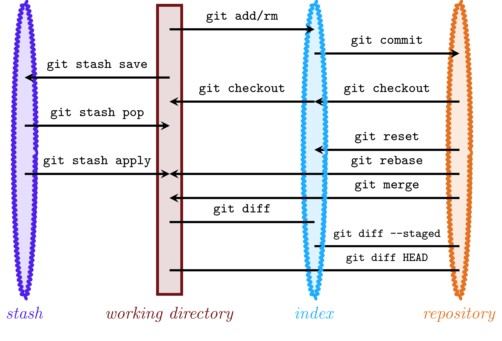

  * [git_dataflow+diagram.tex](https://github.com/walmes/Tikz/blob/master/src/git_dataflow+diagram.pgf)

```tex
% https://github.com/PetarV-/TikZ/blob/master/git%20dataflow/git_dataflow.tex
\documentclass[crop, tikz]{standalone}
\usepackage{tikz}

\usetikzlibrary{decorations.pathmorphing}

\definecolor{bluport}{HTML}{21ADFD}
\definecolor{orgport}{HTML}{E37322}
\definecolor{pplport}{HTML}{4F21E9}
\definecolor{redport}{HTML}{701315}

\begin{document}
\begin{tikzpicture}

	\fill[pplport!15] (0, 0) ellipse (0.25 and 3);
	\fill[redport!15] (2.75, -3) rectangle (3.25, 3);
	\fill[bluport!15] (6, 0) ellipse (0.25 and 3);
	\fill[orgport!15] (9, 0) ellipse (0.25 and 3);
	
	\draw[thick, pplport] (0, 0) ellipse (0.25 and 3);
	\draw[ultra thick, pplport, decorate, decoration={snake, segment length=1mm, amplitude=0.3mm}] (0, 0) ellipse (0.23 and 3.05);
	\node[text height=1em, text depth=1em, pplport] (1) at (0, -3.5) {\emph{stash}};
		
	\draw[ultra thick, redport] (2.75, -3) rectangle (3.25, 3);
	\node[text height=1em, text depth=1em, redport] (2) at (3, -3.5) {\emph{working directory}};
		
	\draw[thick, orgport] (9, 0) ellipse (0.25 and 3);
	\draw[ultra thick, orgport, decorate, decoration={snake, segment length=1mm, amplitude=0.3mm}] (9, 0) ellipse (0.23 and 3.05);
	\node[text height=1em, text depth=1em, orgport] (4) at (9, -3.5) {\emph{repository}};
	
	\draw[-stealth, very thick] (6, 2) -- node[above] {\tt\footnotesize git commit} (9, 2);
	\draw[-stealth, very thick] (9, 1) -- node[above] {\tt\footnotesize git checkout} (6, 1);
	\draw[-stealth, very thick] (9, 0) -- node[above] {\tt\footnotesize git reset} (6, 0);
	\draw[very thick] (6, -2) -- node[above] {\tt\scriptsize git diff -{}-staged} (9, -2);
	\draw[very thick] (3, -2.5) -- node[above, pos=0.75] {\tt\scriptsize git diff HEAD} (9, -2.5);
	\draw[-stealth, very thick] (9, -0.5) -- node[above, pos=0.25] {\tt\footnotesize git rebase} (3, -0.5);
	\draw[-stealth, very thick] (9, -1) -- node[above, pos=0.25] {\tt\footnotesize git merge} (3, -1);
	
	% draw the blue portal here for the portal effect
	\draw[thick, bluport] (6, 0) ellipse (0.25 and 3);
	\draw[ultra thick, bluport, decorate, decoration={snake, segment length=1mm, amplitude=0.3mm}] (6, 0) ellipse (0.23 and 3.05);
	\node[text height=1em, text depth=1em, bluport] (3) at (6, -3.5) {\emph{index}};
	
	% Redraw some lines for piercing effect through blu port
	\draw[-stealth, very thick] (6, -0.5) -- (3, -0.5);
	\draw[-stealth, very thick] (6, -1) -- (3, -1);	
	\draw[very thick] (3, -2.5) -- (6, -2.5);
	
	\draw[-stealth, very thick] (3, 2.5) -- node[above] {\tt\footnotesize git add/rm} (6, 2.5);
	\draw[-stealth, very thick] (3, 1.5) -- node[above] {\tt\footnotesize git stash save} (0, 1.5);
	\draw[-stealth, very thick] (6, 1) -- node[above] {\tt\footnotesize git checkout} (3, 1);
	\draw[-stealth, very thick] (0, 0.5) -- node[above] {\tt\footnotesize git stash pop} (3, 0.5);
	\draw[-stealth, very thick] (0, -0.5) -- node[above] {\tt\footnotesize git stash apply} (3, -0.5);
	\draw[very thick] (3, -1.5) -- node[above] {\tt\footnotesize git diff} (6, -1.5);
\end{tikzpicture}
\end{document}
```
****

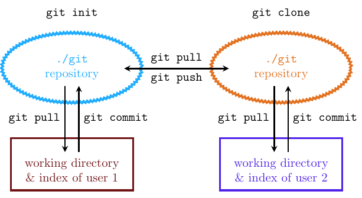

  * [git_workflow+diagram.tex](https://github.com/walmes/Tikz/blob/master/src/git_workflow+diagram.pgf)

```tex
\documentclass[crop, tikz]{standalone}
\usepackage{tikz}

\usetikzlibrary{decorations.pathmorphing}

\definecolor{bluport}{HTML}{21ADFD}
\definecolor{orgport}{HTML}{E37322}
\definecolor{pplport}{HTML}{4F21E9}
\definecolor{redport}{HTML}{701315}

\begin{document}
\begin{tikzpicture}
	\draw[thick, bluport] (0, 0) ellipse (2 and 1);
	\draw[ultra thick, bluport, decorate, decoration={snake, segment length=1mm, amplitude=0.3mm}] (0, 0) ellipse (2 and 1);
	\node[text height=1em, text depth=1em] (1) at (0, 1.5) {\tt git init};
	\node[text height=1em, text depth=1em, align=center, bluport] (1) at (0, -0.25) {\tt ./git \\ repository};
		
	\draw[thick, orgport] (6, 0) ellipse (2 and 1);
	\draw[ultra thick, orgport, decorate, decoration={snake, segment length=1mm, amplitude=0.3mm}] (6, 0) ellipse (2 and 1);
	\node[text height=1em, text depth=1em] (1) at (6, 1.5) {\tt git clone};
	\node[text height=1em, text depth=1em, align=center, orgport] (1) at (6, -0.25) {\tt ./git \\ repository};
		
	\draw[ultra thick, redport] (-1.75, -2) rectangle (1.75, -3.5);
	\node[text height=1em, text depth=1em, align=center, redport] (1) at (0, -3.25) {working directory \\ \& index of user 1};
		
	\draw[ultra thick, pplport] (4.25, -2) rectangle (7.75, -3.5);
	\node[text height=1em, text depth=1em, align=center, pplport] (1) at (6, -3.25) {working directory \\ \& index of user 2};
		
	\draw[very thick, stealth-stealth] (1.5, 0) -- node[above] {\tt git pull} node[below] {\tt git push} (4.5, 0);
		
	\draw[very thick, -stealth] (-0.2, -0.5) -- node[left] {\tt git pull} (-0.2, -2.4);
	\draw[very thick, -stealth] (0.2, -2.4) -- node[right] {\tt git commit} (0.2, -0.5);
		
	\draw[very thick, -stealth] (5.8, -0.5) -- node[left] {\tt git pull} (5.8, -2.4);
	\draw[very thick, -stealth] (6.2, -2.4) -- node[right] {\tt git commit} (6.2, -0.5);
\end{tikzpicture}
\end{document}
```
****


  * [grid_RBG+3d+foreach+learn.tex](https://github.com/walmes/Tikz/blob/master/src/grid_RBG+3d+foreach+learn.pgf)

```tex
% https://tex.stackexchange.com/a/271584/173708
\documentclass[border={10}]{standalone}
\usepackage{tikz}  
\usepackage{tikz-3dplot} 

\tdplotsetmaincoords{60}{125} % view angles
\tdplotsetrotatedcoords{0}{0}{0} 
\begin{document}

\begin{tikzpicture}
    [%%%%%%%%%%%%%%%%%%%%%%%%%%%%%%%%%%
        scale=5,tdplot_rotated_coords,
        grid/.style={very thin,gray}
    ]%%%%%%%%%%%%%%%%%%%%%%%%%%%%%%%%%%

    %draw a grid in the x-y plane
    \foreach \x in {0,1,...,10}
        \foreach \y in {0,1,...,10}
        {
            \draw[grid] (\x,0) -- (\x,10);
            \draw[grid] (0,\y) -- (10,\y);
        };
    \draw[fill=blue]  (0,0,0) -- (0,1,0) -- (1,1,0) -- (1,0,0) -- cycle;
    \draw[fill=red ]  (1,1,0) -- (2,1,0) -- (2,2,0) -- (1,2,0) -- cycle;

\end{tikzpicture}    
\end{document}
```
****

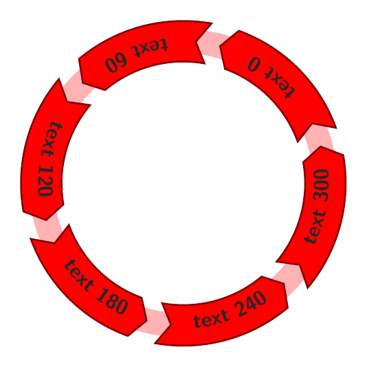

  * [impact-circular_arrows+diagram+foreach.tex](https://github.com/walmes/Tikz/blob/master/src/impact-circular_arrows+diagram+foreach.pgf)

```tex
% http://www.texample.net/media/tikz/examples/TEX/circular-arrows-text.tex
% Circular arrows with text
% Author: Tom Bombadil
\documentclass[tikz,border=10pt]{standalone}
%%%<
\usepackage{verbatim}
%%%>
\begin{comment}
:Title: Circular arrows with text
:Tags: Arrows;Decorations;Arcs;Foreach;Diagrams
:Author: Tom Bombadil
:Slug: circular-arrows-text

This example was written by Tom Bombadil answering a question on TeX.SE,
with a modification by Stefan Kottwitz adding a text font style
showing an implicit way.
\end{comment}
\usetikzlibrary{decorations.text}
\newcommand*{\mytextstyle}{\sffamily\Large\bfseries\color{black!85}}
\newcommand{\arcarrow}[8]{%
% inner radius, middle radius, outer radius, start angle,
% end angle, tip protusion angle, options, text
  \pgfmathsetmacro{\rin}{#1}
  \pgfmathsetmacro{\rmid}{#2}
  \pgfmathsetmacro{\rout}{#3}
  \pgfmathsetmacro{\astart}{#4}
  \pgfmathsetmacro{\aend}{#5}
  \pgfmathsetmacro{\atip}{#6}
  \fill[#7] (\astart:\rin) arc (\astart:\aend:\rin)
       -- (\aend+\atip:\rmid) -- (\aend:\rout) arc (\aend:\astart:\rout)
       -- (\astart+\atip:\rmid) -- cycle;
  \path[font = \sffamily, decoration = {text along path, text = {|\mytextstyle|#8},
    text align = {align = center}, raise = -0.5ex}, decorate]
    (\astart+\atip:\rmid) arc (\astart+\atip:\aend+\atip:\rmid);
}

\begin{document}
\begin{tikzpicture}
  \fill[even odd rule,red!30] circle (3.8) circle (3.2);
  \foreach \x in {0,60,...,300} {
    \arcarrow{3}{3.5}{4}{\x+20}{\x+70}{5}{red,
      draw = red!50!black, very thick}{text \x}
  }
\end{tikzpicture}
\end{document}
```
****

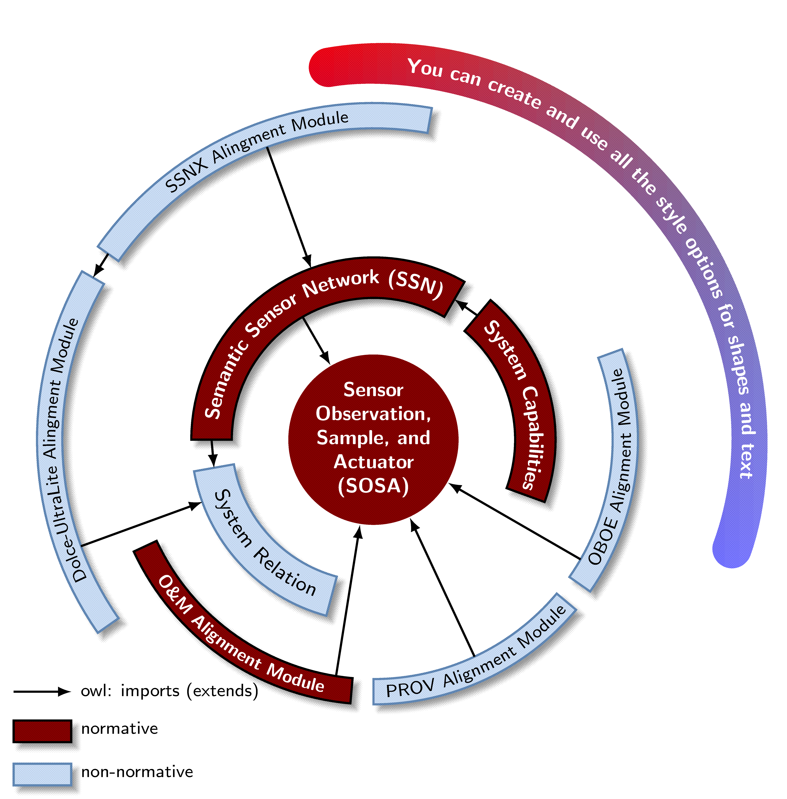

  * [impact-concentric-blocks+diagram.tex](https://github.com/walmes/Tikz/blob/master/src/impact-concentric-blocks+diagram.pgf)

```tex
% https://github.com/FriendlyUser/LatexDiagrams
\documentclass[border=5pt]{standalone}
\usepackage{xcolor}

	\definecolor{ocre}{HTML}{800000}
	\definecolor{sky}{HTML}{C6D9F1}
	\definecolor{skybox}{HTML}{5F86B3}

\usepackage{tikz}
\usepackage{pgfmath}
\usetikzlibrary{decorations.text, arrows.meta,calc,shadows.blur,shadings}

\renewcommand*\familydefault{\sfdefault} % Set font to serif family

% arctext from Andrew code with modifications:
%Variables: 1: ID, 2:Style 3:box height 4: Radious 5:start-angl 6:end-angl 7:text {format along path} 
\def\arctext[#1][#2][#3](#4)(#5)(#6)#7{

\draw[#2] (#5:#4cm+#3) coordinate (above #1) arc (#5:#6:#4cm+#3)
             -- (#6:#4) coordinate (right #1) -- (#6:#4cm-#3) coordinate (below right #1) arc (#6:#5:#4cm-#3) coordinate (below #1)
             -- (#5:#4) coordinate (left #1) -- cycle;
            \def\a#1{#4cm+#3}
            \def\b#1{#4cm-#3}
\path[
    decoration={
        raise = -0.5ex, % Controls relavite text height position.
        text  along path,
        text = {#7},
        text align = center,        
    },
    decorate
    ]
    (#5:#4) arc (#5:#6:#4);
}

%arcarrow, this is mine, for beerware purpose...
%Function: Draw an arrow from arctex coordinate specific nodes to another 
%Arrow start at the start of arctext box and could be shifted to change the position
%to avoid go over another box.
%Var: 1:Start coordinate 2:End coordinate 3:angle to shift from acrtext box  
\def\arcarrow(#1)(#2)[#3]{
    \draw[thick,->,>=latex] 
        let \p1 = (#1), \p2 = (#2), % To access cartesian coordinates x, and y.
            \n1 = {veclen(\x1,\y1)}, % Distance from the origin
            \n2 = {veclen(\x2,\y2)}, % Distance from the origin
            \n3 = {atan2(\y1,\x1)} % Angle where acrtext starts.
        in (\n3-#3: \n1) -- (\n3-#3: \n2); % Draw the arrow.
}

\begin{document}
    \begin{tikzpicture}[
        % Environment Cfg
        font=\sf    \scriptsize,
        % Styles
        myarrow/.style={
            thick,
            -latex,
        },
        Center/.style ={
            circle,
            fill=ocre,
            text=white,
            align=center,
            font =\footnotesize\bf,
            inner sep=1pt,          
        },
        RedArc/.style ={
            color=black,
            thick,
            fill=ocre,
            blur shadow, %Tikzedt not suport online view
        },
        SkyArc/.style ={
            color=skybox,
            thick,
            fill=sky,
            blur shadow, %Tikzedt not suport online view
        },
    ]

    % Drawing the center
    \node[Center](SOSA) at (0,0) { Sensor \\ Observation, \\ Sample, and \\ Actuator \\(SOSA)};
    \coordinate (SOSA-R) at (0:1.2); % To make compatible with \arcarrow macro.

    % Drawing the Tex Arcs

    % \Arctext[ID][box-style][box-height](radious)(start-angl)(end-angl){|text-styles| Text}

    \arctext[SSN][RedArc][8pt](2.25)(180)(60){|\footnotesize\bf\color{white}| Semantic Sensor Network (SSN)};
    \arctext[SCap][RedArc][8pt](2.25)(50)(-20){|\footnotesize\bf\color{white}| System Capabilities};
    \arctext[SRel][SkyArc][8pt](2.25)(190)(255){|\footnotesize\color{black}| System Relation};
    \arctext[OMAM][RedArc][5pt](3.5)(205)(265){|\scriptsize\bf\color{white}| O{\&}M Alignment Module};
    \arctext[PROV][SkyArc][5pt](3.5)(270)(320){|\scriptsize| PROV Alignment Module};
    \arctext[OBOE][SkyArc][5pt](3.5)(-35)(20){|\scriptsize| OBOE Alignment Module};
    \arctext[DUAM][SkyArc][5pt](4.5)(215)(150){|\scriptsize| Dolce-UltraLite Alingment Module};
    \arctext[SSNX][SkyArc][5pt](4.5)(145)(80){|\scriptsize| SSNX Alingment Module};

    %ADITIONAL
    \arctext[NEW][
        color=white,
        shade,      
        upper left=red,
        upper right=black!50,
        lower left=blue,
        lower right=blue!50,
        rounded corners = 8pt
        ][8pt](5.2)(100)(-20){|\footnotesize\bf\color{white}| You can create and use all the style options for shapes and text};

    %Drawing the Arrows
    %\arcarrow(above/below ID)(abobe/below ID)[shift]
    \arcarrow(below DUAM)(above SRel)[15];
    \arcarrow(below SSNX)(above SSN)[35];
    \arcarrow(below SSN)(SOSA-R)[60];
    \arcarrow(below right OMAM)(SOSA-R)[4];
    \arcarrow(below right PROV)(SOSA-R)[25];
    \arcarrow(below OBOE)(SOSA-R)[-5];

    %Same level Arrows
    \draw[myarrow] (left SSNX) -- (right DUAM);
    \draw[myarrow] (left SSN) -- (left SRel);
    \draw[myarrow] (left SCap) -- (right SSN);

     \draw[myarrow] (-5,-3.5) coordinate (legend) -- ++(.8,0) node[anchor=west] {owl: imports (extends)};
     \draw[RedArc] (legend)++(0,-0.4) rectangle ++(.8,-.3)++(0,.2) node[anchor=west] {normative};
     \draw[SkyArc] (legend)++(0,-1) rectangle ++(.8,-.3)++(0,.2) node[anchor=west, color=black] {non-normative};

    \end{tikzpicture}

\end{document}
```
****

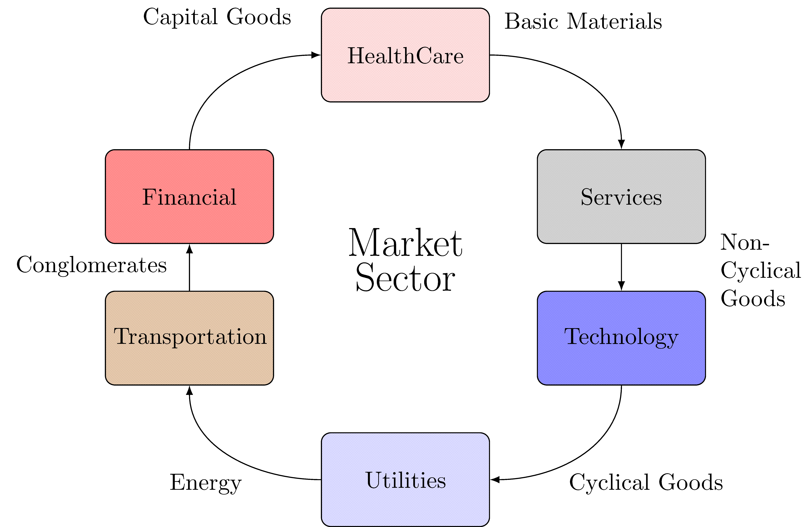

  * [impact-market_sector+diagram.tex](https://github.com/walmes/Tikz/blob/master/src/impact-market_sector+diagram.pgf)

```tex
% % https://github.com/FriendlyUser/LatexDiagrams
% Inspired by Learn Algorithmic Trading by Sebastien Donadio Packt on page 10
\documentclass{standalone}
\usepackage{tikz}
\usepackage{xcolor}
\usetikzlibrary{shapes, arrows.meta, positioning}

\begin{document}
    \pagestyle{empty}

    \begin{tikzpicture}[
        node distance=2em and 2em,
        block/.style={rectangle, draw, 
    text width=6.5em, text centered, rounded corners, minimum height=4em},
        line/.style={draw, -latex},
        ]

        \node [block, fill=gray!15!red!15] (hc) {HealthCare};
        \node [block, fill=gray!45, below right= of hc] (serv) {Services};
        \node [block, fill=blue!45, below = of serv] (tech) {Technology};
        \node [block,fill=blue!15, below left= of tech] (util) {Utilities};
        \node [block,fill=brown!45, above left= of util] (trans) {Transportation};
        \node [block, fill=red!45, above = of trans] (fin) {Financial};
        % Connections
        \path [line] (hc.east) to[out=0, in=90] (serv.north);
        \path [line] (serv.south) -- (tech);
        \path [line] (tech.south) to[out=-90, in=0] (util.east);
        \path [line] (util.west) to[out=180, in=-90] (trans.south);
         \path [line] (trans.north) -- (fin);
        \path [line] (fin.north) to[out=90, in=180] (hc.west);
        
        % Market Sectors label
        \node [draw=none, below = 5em of hc, text width = 2cm, align = center] (label) {\LARGE Market \\[1mm] Sector};
        
        \node [above left = -3em and 3em of util] () {Energy};
        \node [above right = -3em and 3em of util] () {Cyclical Goods};
        \node [above right = -1em and 0.25em of tech, text width = 3.5em] () {Non-Cyclical Goods};
        \node [above right = -1.25em and 0.25em of hc, text width = 7em] () {Basic Materials};
        \node [above left = -1.25em and 0.25em of hc, text width = 7em] () {Capital Goods};
        \node [above left = 0.25em and -3em of trans] () {Conglomerates};
    \end{tikzpicture}
\end{document}
```
****

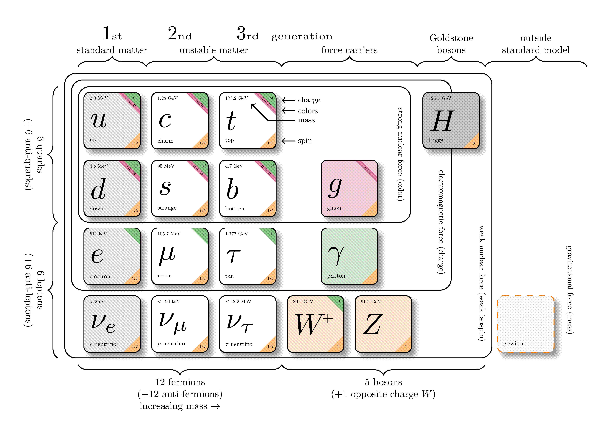

  * [impact-particles_table+physics.tex](https://github.com/walmes/Tikz/blob/master/src/impact-particles_table+physics.pgf)

```tex
% Standard model of physics
% Author: Carsten Burgard
\documentclass[border=10pt]{standalone}
\usepackage{tikz}
\usetikzlibrary{calc,positioning,shadows.blur,decorations.pathreplacing}
\usepackage{etoolbox}

\tikzset{%
        brace/.style = { decorate, decoration={brace, amplitude=5pt} },
       mbrace/.style = { decorate, decoration={brace, amplitude=5pt, mirror} },
        label/.style = { black, midway, scale=0.5, align=center },
     toplabel/.style = { label, above=.5em, anchor=south },
    leftlabel/.style = { label,rotate=-90,left=.5em,anchor=north },   
  bottomlabel/.style = { label, below=.5em, anchor=north },
        force/.style = { rotate=-90,scale=0.4 },
        round/.style = { rounded corners=2mm },
       legend/.style = { right,scale=0.4 },
        nosep/.style = { inner sep=0pt },
   generation/.style = { anchor=base },
       dasher/.style = { orange, dashed }   % color for graviton
}

% the style for each of the particles
% #1 fill color; #2 symbol; #3 name; #4 mass; #5 spin; #6 charge; #7 colors
%
\newcommand\particle[7][white]{%
  \begin{tikzpicture}[x=1cm, y=1cm]
    \path[fill=#1,blur shadow={shadow blur steps=5}] (0.1,0) -- (0.9,0)
        arc (90:0:1mm) -- (1.0,-0.9) arc (0:-90:1mm) -- (0.1,-1.0)
        arc (-90:-180:1mm) -- (0,-0.1) arc(180:90:1mm) -- cycle;
    \ifstrempty{#7}{}{\path[fill=purple!50!white]                           % colors: band, purple
        (0.6,0) --(0.7,0) -- (1.0,-0.3) -- (1.0,-0.4);}
    \ifstrempty{#6}{}{\path[fill=green!50!black!50] (0.7,0) -- (0.9,0)      % charge: corner, green
        arc (90:0:1mm) -- (1.0,-0.3);}
    \ifstrempty{#5}{}{\path[fill=orange!50!white] (1.0,-0.7) -- (1.0,-0.9)  % spin: bottom corner, orange
        arc (0:-90:1mm) -- (0.7,-1.0);}
    \draw[\ifstrempty{#2}{dasher}{black}] (0.1,0) -- (0.9,0)                % line
        arc (90:0:1mm) -- (1.0,-0.9) arc (0:-90:1mm) -- (0.1,-1.0)
        arc (-90:-180:1mm) -- (0,-0.1) arc(180:90:1mm) -- cycle;
    \ifstrempty{#7}{}{\node at(0.825,-0.175) [rotate=-45,scale=0.2] {#7};}      % colors
    \ifstrempty{#6}{}{\node at(0.9,-0.1)  [nosep,scale=0.17] {#6};}             % charge
    \ifstrempty{#5}{}{\node at(0.9,-0.9)  [nosep,scale=0.2] {#5};}              % spin
    \ifstrempty{#4}{}{\node at(0.1,-0.1)  [nosep,anchor=west,scale=0.25]{#4};}  % mass
    \ifstrempty{#3}{}{\node at(0.1,-0.85) [nosep,anchor=west,scale=0.3] {#3};}  % name
    \ifstrempty{#2}{}{\node at(0.1,-0.5)  [nosep,anchor=west,scale=1.5] {#2};}  % symbol
  \end{tikzpicture}
}


\begin{document}
\begin{tikzpicture}[x=1.2cm, y=1.2cm]
  % draw force blocks
  \draw[round] (-0.5,0.5) rectangle (4.4,-1.5);     % strong force
  \draw[round] (-0.6,0.6) rectangle (5.0,-2.5);     % electromagnetic force
  \draw[round] (-0.7,0.7) rectangle (5.6,-3.5);     % weak force

  % draw all particles  
  \node at(0, 0)   {\particle[gray!20!white]
                   {$u$}        {up}       {$2.3$ MeV}{1/2}{$2/3$}{R/G/B}};
  \node at(0,-1)   {\particle[gray!20!white]
                   {$d$}        {down}    {$4.8$ MeV}{1/2}{$-1/3$}{R/G/B}};
  \node at(0,-2)   {\particle[gray!20!white]
                   {$e$}        {electron}       {$511$ keV}{1/2}{$-1$}{}};
  \node at(0,-3)   {\particle[gray!20!white]
                   {$\nu_e$}    {$e$ neutrino}         {$<2$ eV}{1/2}{}{}};
  \node at(1, 0)   {\particle
                   {$c$}        {charm}   {$1.28$ GeV}{1/2}{$2/3$}{R/G/B}};
  \node at(1,-1)   {\particle 
                   {$s$}        {strange}  {$95$ MeV}{1/2}{$-1/3$}{R/G/B}};
  \node at(1,-2)   {\particle
                   {$\mu$}      {muon}         {$105.7$ MeV}{1/2}{$-1$}{}};
  \node at(1,-3)   {\particle
                   {$\nu_\mu$}  {$\mu$ neutrino}    {$<190$ keV}{1/2}{}{}};
  \node at(2, 0)   {\particle
                   {$t$}        {top}    {$173.2$ GeV}{1/2}{$2/3$}{R/G/B}};
  \node at(2,-1)   {\particle
                   {$b$}        {bottom}  {$4.7$ GeV}{1/2}{$-1/3$}{R/G/B}};
  \node at(2,-2)   {\particle
                   {$\tau$}     {tau}          {$1.777$ GeV}{1/2}{$-1$}{}};
  \node at(2,-3)   {\particle
                   {$\nu_\tau$} {$\tau$ neutrino}  {$<18.2$ MeV}{1/2}{}{}};
  \node at(3,-3)   {\particle[orange!20!white]
                   {$W^{\hspace{-.3ex}\scalebox{.5}{$\pm$}}$}               
                                {}              {$80.4$ GeV}{1}{$\pm1$}{}}; % W
  \node at(4,-3)   {\particle[orange!20!white]
                   {$Z$}        {}                    {$91.2$ GeV}{1}{}{}}; % Z
  \node at(3.5,-2) {\particle[green!50!black!20]
                   {$\gamma$}   {photon}                        {}{1}{}{}}; % gamma-photon
  \node at(3.5,-1) {\particle[purple!20!white]
                   {$g$}        {gluon}                    {}{1}{}{color}}; % g-gluon
  \node at(5,0)    {\particle[gray!50!white]
                   {$H$}        {Higgs}              {$125.1$ GeV}{0}{}{}}; % H-Higgs
  \node at(6.1,-3) {\particle[gray!5!white]
                   {}           {graviton}                       {}{}{}{}}; % graviton

  % add text labels for forces
  \node at(4.25,-0.5) [force]      {strong nuclear force (color)};
  \node at(4.85,-1.5) [force]    {electromagnetic force (charge)};
  \node at(5.45,-2.4) [force] {weak nuclear force (weak isospin)};
  \node at(6.75,-2.5) [force]        {gravitational force (mass)};

  % draw arrows and add labels for legends
  \draw [<-] (2.50,0.30)  -- (2.7,0.3)          node [legend] {charge};
  \draw [<-] (2.50,0.15)  -- (2.7,0.15)         node [legend] {colors};
  \draw [<-] (2.05,0.25)  -- (2.3,0) -- (2.7,0) node [legend]   {mass};
  \draw [<-] (2.50,-0.3)  -- (2.7,-0.3)         node [legend]   {spin};

  % draw vertical braces and labels
  \draw [mbrace] (-0.8,0.5)  -- (-0.8,-1.5)
                 node[leftlabel] {6 quarks\\(+6 anti-quarks)};
  \draw [mbrace] (-0.8,-1.5) -- (-0.8,-3.5)
                 node[leftlabel] {6 leptons\\(+6 anti-leptons)};
  % draw bottom braces and labels                  
  \draw [mbrace] (-0.5,-3.6) -- (2.5,-3.6)
                 node[bottomlabel]
                 {12 fermions\\(+12 anti-fermions)\\increasing mass $\to$};
  \draw [mbrace] (2.5,-3.6) -- (5.5,-3.6)
                 node[bottomlabel] {5 bosons\\(+1 opposite charge $W$)};

  % draw top braces and add text labels
  \draw [brace] (-0.5,.8) -- (0.5,.8) node[toplabel]         {standard matter};
  \draw [brace] (0.5,.8)  -- (2.5,.8) node[toplabel]         {unstable matter};
  \draw [brace] (2.5,.8)  -- (4.5,.8) node[toplabel]          {force carriers};
  \draw [brace] (4.5,.8)  -- (5.5,.8) node[toplabel]       {Goldstone\\bosons};  % two lines
  \draw [brace] (5.5,.8)  -- (7,.8)   node[toplabel] {outside\\standard model};  % two lines

  % add big numbers on top
  \node at (0,1.2)   [generation] {1\tiny st};
  \node at (1,1.2)   [generation] {2\tiny nd};
  \node at (2,1.2)   [generation] {3\tiny rd};
  \node at (2.8,1.2) [generation] {\tiny generation};
\end{tikzpicture}
\end{document}
```
****

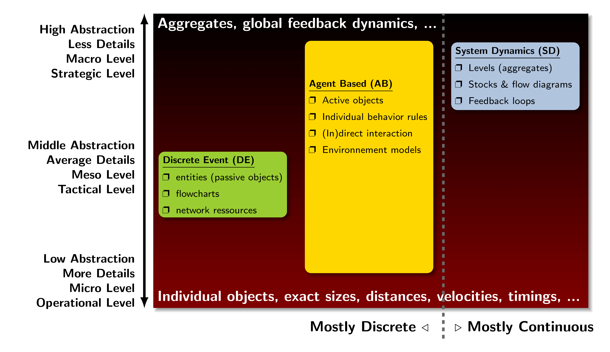

  * [impact-simulation_abstraction+physics.tex](https://github.com/walmes/Tikz/blob/master/src/impact-simulation_abstraction+physics.pgf)

```tex
% Simulation approaches versus abstraction levels
% Author: Valeria Borodin
\documentclass[border=10pt,svgnames]{standalone} 
%%%<
\usepackage{verbatim}
%%%>
\begin{comment}
:Title: Simulation approaches versus abstraction levels
:Tags: Diagrams;Shadows;Styles
:Author: Valeria Borodin
:Slug: simulation-abstraction

This is the LaTeX version of the figure from the following link:
https://en.wikipedia.org/wiki/AnyLogic#/media/File:Simulation_approaches_vs_abstraction_levels.jpg
Note that the color range is slightly modified.

This example illustrates how modelling approaches correspond
to the abstraction levels.
\end{comment}
\usepackage{tikz}
\usetikzlibrary{positioning,shadows.blur}
\usepackage{pifont}
\renewcommand{\labelitemi}{\ding{112}}
\begin{document}

\begin{tikzpicture} 
   \tikzset{
     box/.style    = { rounded corners = 5pt,
                       align           = left,
                       font            = \sffamily\footnotesize,
                       text width      = 3.45cm, 
                       blur shadow     = {shadow blur steps = 15} },    
     legend/.style = { font       = \sffamily\bfseries, 
                       align      = right,
                       text width = 3.4cm},
  }
  \node [shade,
    blur shadow  = {shadow blur steps = 15},
    text width   = 1.01\textwidth,
    top color    = black, 
    bottom color = Maroon,
    text         = white, 
    font         = \sffamily\bfseries\large] (A)
    {Aggregates, global feedback dynamics, ...  \\ \vspace{.6\textwidth} 
    Individual objects, exact sizes, distances, velocities, timings, ...};
  
  \node [box, below left  = -4.5cm and -3.85cm of A, fill = YellowGreen]
    (DE)
    {\underline{\bfseries Discrete Event (DE)}
      \begin{itemize} 
        \setlength{\itemindent} {-.5cm}
        \item entities (passive objects)
        \item flowcharts 
        \item network ressources
      \end{itemize}
    };

  \node [box, above right  = -3.5cm and .5cm of DE,
    minimum height=0.55\textwidth, fill = Gold, text depth = 0.35\textwidth]
    (AB)
    { \underline{\bfseries Agent Based (AB)} 
        \begin{itemize} \setlength{\itemindent}{-.5cm}
          \item Active objects
          \item Individual behavior rules
          \item (In)direct interaction
          \item Environnement models
          \end{itemize}  
    };

  \node [box, above right  = -2.cm and .5cm of AB, fill = LightSteelBlue]
    (SD)
    { \underline{\bfseries System Dynamics (SD)}
      \begin{itemize} \setlength{\itemindent}{-.5cm}
        \item Levels (aggregates)
        \item Stocks \& flow diagrams
        \item Feedback loops
      \end{itemize}
    };

  \node [legend, above left = -1.25cm and 4.75cm of AB] (HA)
    {High Abstraction \\ Less Details \\ Macro Level \\ Strategic Level};

  \node [legend, below = 1.5cm of HA] (MA)
    {Middle Abstraction \\ Average Details \\ Meso Level \\ Tactical Level};
  
  \node [legend, below = 1.5cm of MA] (LA)
    {Low Abstraction \\ More Details \\ Micro Level \\ Operational Level};

  \node [below = 1.25cm of AB, font = \sffamily\bfseries\large ] (d1) 
    {Mostly Discrete $\triangleleft$};

  \node [right = .5cm of d1, font = \sffamily\bfseries\large ] (d2) 
    {$\triangleright$ Mostly Continuous };
  
   \path [ draw, color = DimGray, dashed, line width = 2pt ]
     (d1.south east) + (0.3cm,0)   coordinate(x1) -- (x1|-A.north);  
   
   \path [draw, <->, >=latex, line width = 2pt ]
     (A.south west)  + (-0.25cm,0) coordinate(x2) -- (x2|-A.north);
\end{tikzpicture}
\end{document}
```
****

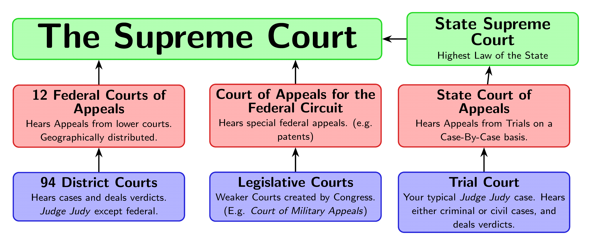

  * [impact-supreme_court-2+diagram.tex](https://github.com/walmes/Tikz/blob/master/src/impact-supreme_court-2+diagram.pgf)

```tex
% https://tex.stackexchange.com/questions/415763/tikz-nodes-are-offset-to-the-right?rq=1
\documentclass[tikz, margin=3mm]{standalone}
\usepackage[utf8]{inputenc}
\usepackage{tikz}
\usepackage[margin=1in]{geometry}
\usetikzlibrary{arrows.meta, calc, positioning}

\begin{document}

    \begin{tikzpicture}[node distance = 6mm,
   box/.style = {rectangle, rounded corners, thick,
                 draw=#1!70!gray, fill=#1!30,
                 text width=4cm, minimum height=1cm, align=flush center,
                 font=\sffamily\linespread{.8}\selectfont}]
% first row, on the bottom
\node (94-district)     [box=blue]
   {\textbf{94 District Courts}\\
    \scriptsize
    Hears cases and deals verdicts. \textit{Judge Judy} except federal.};
\node (legis-courts)    [box=blue, right=of 94-district]
   {\textbf{Legislative Courts}\\
    \scriptsize
    Weaker Courts created by Congress. (E.g. \textit{Court of Military Appeals})};
\node (trial-court)     [box=blue, below right=0mm and 4mm of legis-courts.north east]
   {\textbf{Trial Court}\\
    \scriptsize
    Your typical \textit{Judge Judy} case. Hears either criminal or civil cases, and deals verdicts.};
% second row
\node (12-appeals)      [box=red, above=of 94-district]
   {\textbf{12 Federal Courts of Appeals}\\
    \scriptsize
    Hears Appeals from lower courts. Geographically distributed.};
\node (court-appeals)   [box=red, above=of legis-courts]
   {\textbf{Court of Appeals for the Federal Circuit}\\
    \scriptsize
    Hears special federal appeals. (e.g. patents)};
\node (state-appeals)   [box=red, above=of trial-court]
   {\textbf{State Court of\\ Appeals}\\
    \scriptsize
    Hears Appeals from Trials on a Case-By-Case basis.};
% third row
% firs calculate spreme court node width
\path   let \p1 = ($(12-appeals.west)-(court-appeals.east)$),
            \n1 = {veclen(\x1,\y1)} in
        node (scotus)
            [box=green, font=\sffamily\Huge\bfseries,
             text width=\n1-2*\pgfkeysvalueof{/pgf/inner xsep},
             above=of $(12-appeals.north)!0.5!(court-appeals.north)$]
            {The Supreme Court};
\node (state)       [box=green, right = of scotus]
   {\large\textbf{State Supreme Court}\\
    \scriptsize
    Highest Law of the State};
\draw [-Stealth, thick]
    (trial-court)   edge (state-appeals)
    (state-appeals) edge (state)
    (state)         edge (scotus)
    (legis-courts)  edge (court-appeals)
    (court-appeals) edge (scotus.south -| court-appeals)
    (94-district)   edge (12-appeals)
    (12-appeals)     to  (12-appeals |- scotus.south) ;

\end{tikzpicture}
\end{document}
```
****


  * [impact-supreme_court+diagram.tex](https://github.com/walmes/Tikz/blob/master/src/impact-supreme_court+diagram.pgf)

```tex
\documentclass[border=10pt]{standalone}
\usepackage{tikz}
\usetikzlibrary{shapes.geometric, arrows.meta, positioning}
\tikzset{
  red-rounded-rectangle/.style={rectangle, rounded corners, minimum width=3cm, minimum height=1cm,text centered, draw=black, fill=red!30, align=center},
  green-rounded-rectangle/.style={rectangle, rounded corners, minimum width=3cm, minimum height=1cm,text centered, draw=black, fill=green!30, align=center},
  blue-rounded-rectangle/.style={rectangle, rounded corners, minimum width=3cm, minimum height=1cm,text centered, draw=black, fill=blue!30, align=center},
}
\begin{document}
\begin{tikzpicture}[node distance=0.5cm, >/.tip=Latex, thick]
  \node (scotus) [green-rounded-rectangle, text width = 10cm]{
    {\Huge \textbf{The Supreme Court}}
  };
  \node (state) [green-rounded-rectangle, right = of scotus, text width=4cm]{
    {\large \textbf{State Supreme Court}}\\
    Highest Law of the State
  };
  \node (state-appeals) [red-rounded-rectangle, below  = of  state, text width = 4cm]{
    {\large \textbf{State Court of Appeals}}\\
    Hears Appeals from Trials on a Case-By-Case basis.
  };
  \node (12-appeals) [red-rounded-rectangle, left=of state-appeals -| scotus, text width = 4cm] {
    {\large \textbf{12 Federal Courts of Appeals}}\\
    Hears Appeals from lower courts. Geographically distributed.
  };
  \node (94-district) [blue-rounded-rectangle, below = of 12-appeals,, text width=4cm]{
    {\large \textbf{94 District Courts}}\\
    Hears cases and deals verdicts. \textit{Judge Judy} except federal.
  };
  \node (court-appeals) [red-rounded-rectangle, right = of scotus |- state-appeals, text width=4cm]{
    {\large \textbf{Court of Appeals for the Federal Circuit}}\\
    Hears special federal appeals. (e.g. patents)
  };
  \node (legis-courts) [blue-rounded-rectangle, below= of court-appeals, text width = 4cm]{
    {\large \textbf{Legislative Courts}}\\
    Weaker Courts created by Congress. (E.g. \textit{Court of Military Appeals})
  };
  \node (trial-court) [blue-rounded-rectangle, below = of state-appeals,  text width=4cm]{
    {\large \textbf{Trial Court}}\\
    Your typical \textit{Judge Judy} case. Hears either criminal or civil cases, and deals verdicts.
  };
  \draw [->] 
  	(trial-court) 	edge (state-appeals) 
  	(state-appeals) edge (state) 
  	(state) edge (scotus) 
  	(legis-courts) edge (court-appeals) 
  	(court-appeals) edge (scotus.south -| court-appeals) 
  	(94-district) 	edge (12-appeals) 
  	(12-appeals) -- 
  	(12-appeals |- scotus.south) ;
\end{tikzpicture}
\end{document}  
```
****

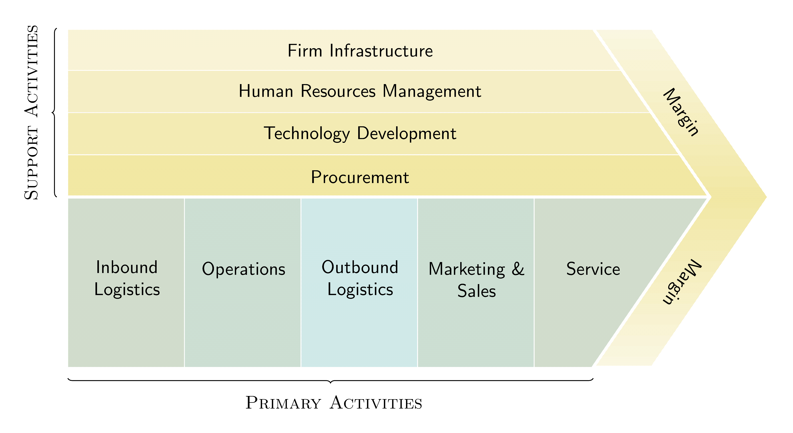

  * [impact-technologies_arrow+matrix+set+command+matrix.tex](https://github.com/walmes/Tikz/blob/master/src/impact-technologies_arrow+matrix+set+command+matrix.pgf)

```tex
% http://www.texample.net/media/tikz/examples/TEX/arrow-table.tex
% Table in the shape of an arrow
% Author: Gonzalo Medina
\documentclass{article}
\usepackage{tikz}
%%%<
\usepackage{verbatim}
\usepackage[active,tightpage]{preview}
\PreviewEnvironment{tikzpicture}
\setlength\PreviewBorder{10pt}%
%%%>
\begin{comment}
:Title: Table in the shape of an arrow
:Tags: Matrices;Arrows;Decorations
:Author: Gonzalo Medina
:Slug: arrow-table

This table is drawn using the TikZ matrix library,
in order to get the shape of an arrow.

It was written by Gonzalo Medina on TeX.SE.
Sligh modifications to the original code: sans serif font,
small caps instead of all caps style, indentation and spacing.
\end{comment}
\usetikzlibrary{calc,matrix,decorations.markings,decorations.pathreplacing}

\definecolor{colone}{RGB}{209,220,204}
\definecolor{coltwo}{RGB}{204,222,210}
\definecolor{colthree}{RGB}{207,233,232}
\definecolor{colfour}{RGB}{248,243,214}
\definecolor{colfive}{RGB}{245,238,197}
\definecolor{colsix}{RGB}{243,235,179}
\definecolor{colseven}{RGB}{241,231,163}

\tikzset{ 
  table/.style={
    matrix of nodes,
    row sep=-\pgflinewidth,
    column sep=-\pgflinewidth,
    nodes={rectangle,text width=2cm,align=center},
    text depth=1.25ex,
    text height=2.5ex,
    nodes in empty cells
  }
}

\renewcommand*{\familydefault}{\sfdefault}
\newcommand{\cbox}[1]{\parbox[t]{2cm}{\centering #1}}

\begin{document}

\begin{tikzpicture}
  \matrix (mat) [table] {
    |[fill=colfour]|      & |[fill=colfour]|  & |[fill=colfour]|
      & |[fill=colfour]|  & |[fill=colfour]|  &                   \\
    |[fill=colfive]|      & |[fill=colfive]|  & |[fill=colfive]|
      & |[fill=colfive]|  & |[fill=colfive]|  &                   \\
    |[fill=colsix]|       & |[fill=colsix]|   & |[fill=colsix]|
      & |[fill=colsix]|   & |[fill=colsix]|   & |[fill=colsix]|   \\
    |[fill=colseven]|     & |[fill=colseven]| & |[fill=colseven]|
      & |[fill=colseven]| & |[fill=colseven]| & |[fill=colseven]| \\
    |[fill=colone]|       & |[fill=coltwo]|   & |[fill=colthree]|
      & |[fill=coltwo]|   & |[fill=colone]|   & |[fill=colone]|   \\
    |[fill=colone]|       & |[fill=coltwo]|   & |[fill=colthree]|
      & |[fill=coltwo]|   & |[fill=colone]|   & |[fill=colone]|   \\
    |[fill=colone]|       & |[fill=coltwo]|   & |[fill=colthree]|
      & |[fill=coltwo]|   & |[fill=colone]|   &                   \\
    |[fill=colone]|       & |[fill=coltwo]|   & |[fill=colthree]|
      & |[fill=coltwo]|   & |[fill=colone]|   &                   \\
  };

  % horizontal rules
  \foreach \row in {2,3,4}
    \draw[white] (mat-\row-1.north west) -- (mat-\row-6.north east);
  \draw[white,ultra thick] (mat-1-1.north west) -- (mat-1-6.north east);
  \draw[white,ultra thick] (mat-5-1.north west) -- (mat-5-6.north east);

  % vertical rules
  \foreach \col in {2,3,4,5}
    \draw[white] (mat-5-\col.north west) -- (mat-8-\col.south west);

  % The labels
  \node[fill=colfour] at (mat-1-3) {Firm Infrastructure};
  \node[fill=colfive] at (mat-2-3) {Human Resources Management};
  \node[fill=colsix] at (mat-3-3) {Technology Development};
  \node[fill=colseven] at (mat-4-3) {Procurement};
  \node at ([yshift=-10pt]mat-6-1) {\cbox{Inbound Logistics}};
  \node at ([yshift=-10pt]mat-6-2) {\cbox{Operations \\\mbox{}}};
  \node at ([yshift=-10pt]mat-6-3) {\cbox{Outbound Logistics}};
  \node at ([yshift=-10pt]mat-6-4) {\cbox{Marketing \& Sales}};
  \node at ([yshift=-10pt]mat-6-5) {\cbox{Service \\\mbox{}}};
  \node[rotate = 90] at ([xshift=-52pt]mat-3-1.north)
    {\textsc{Support Activities}};
  \node at ([yshift=-19pt, xshift=-0.5cm]mat-8-3.south)
    {\textsc{Primary Activities}};

  % Erase some visible lines outside the arrow
  \fill[white] (mat-1-5.north east) -- (mat-5-6.north east)
    -- (mat-1-6.north east) -- cycle;
  \fill[white] (mat-8-5.north east) -- (mat-5-6.north east)
    -- (mat-8-6.north east) -- cycle;

  % Draw the arrow tip
  \shade[top color=colfour!70, bottom color=colfour!70,
    middle color=colseven, draw=white, ultra thick] 
    (mat-1-5.north) -- (mat-5-6.north) -- (mat-8-5.south) -- 
    (mat-8-5.south east) -- (mat-5-6.north east) -- (mat-8-5.south east) -- 
    (mat-5-6.north east) -- (mat-1-5.north east) -- cycle;

  % The slanted "Margin" labels
  \begin{scope}[decoration={markings,
    mark=at position .5 with \node[transform shape] {Margin};}]
  \path[postaction={decorate}] 
    ( $ (mat-1-5.north)!0.5!(mat-1-5.north east) $ )
    -- ( $ (mat-5-6.north)!0.5!(mat-5-6.north east) $ );
  \path[postaction={decorate}] 
    ( $ (mat-5-6.north)!0.5!(mat-5-6.north east) $ )
    -- ( $ (mat-8-5.south)!0.5!(mat-8-5.south east) $ );
  \end{scope}

  % The braces
  \draw[decorate, decoration={brace, mirror, raise=6pt}]
    (mat-1-1.north west) -- (mat-5-1.north west);
  \draw[decorate, decoration={brace, mirror, raise=6pt}]
    (mat-8-1.south west) -- (mat-8-5.south);
\end{tikzpicture}
\end{document}
```
****


  * [impact-venn+diagram.tex](https://github.com/walmes/Tikz/blob/master/src/impact-venn+diagram.pgf)

```tex
% http://www.texample.net/media/tikz/examples/TEX/venn.tex
% A Venn diagram with PDF blending
% Author: Stefan Kottwitz
% https://www.packtpub.com/hardware-and-creative/latex-cookbook
\documentclass[border=10pt]{standalone} 
%%%<
\usepackage{verbatim}
%%%>
\begin{comment}
:Title: A Venn diagram with PDF blending
:Tags: Diagrams;Cookbook
:Author: Stefan Kottwitz
:Slug: venn

PDF blend mode requires TikZ version 3.0 or above.
\end{comment}
\usepackage{tikz}
\begin{document}
\begin{tikzpicture}
  \begin{scope}[blend group = soft light]
    \fill[red!30!white]   ( 90:1.2) circle (2);
    \fill[green!30!white] (210:1.2) circle (2);
    \fill[blue!30!white]  (330:1.2) circle (2);
  \end{scope}
  \node at ( 90:2)    {Computer Science};
  \node at ( 210:2)   {Statistics};
  \node at ( 330:2)   {Coding};
  \node [font=\Large] {Data Science};
\end{tikzpicture}
\end{document}
```
****


  * [inertial_system_color+diagram+pgf+command+def+layer.tex](https://github.com/walmes/Tikz/blob/master/src/inertial_system_color+diagram+pgf+command+def+layer.pgf)

```tex
% http://www.texample.net/media/tikz/examples/TEX/inertial-navigation-system.tex
\documentclass[crop, tikz]{standalone}

\usepackage{tikz}
\usetikzlibrary{shapes,arrows}
\usepackage{amsmath,bm,times}
\usepackage{verbatim}

\begin{comment}
:Title: Inertial navigation system
:Tags: Block diagrams, Layers

A block diagram of an inertial measurement unit (IMU) combined with navigation
equations to form an inertial navigation system (INS). A handful of useful tricks have been 
used to align blocks and arrows nicely. Hard coding coordinates has been avoided as
much as possible.

\end{comment}

\newcommand{\mx}[1]{\mathbf{\bm{#1}}} % Matrix command
\newcommand{\vc}[1]{\mathbf{\bm{#1}}} % Vector command

\begin{document}
\pagestyle{empty}

% We need layers to draw the block diagram
\pgfdeclarelayer{background}
\pgfdeclarelayer{foreground}
\pgfsetlayers{background,main,foreground}

% Define a few styles and constants
\tikzstyle{sensor}=[draw, fill=blue!20, text width=5em, 
    text centered, minimum height=2.5em]
\tikzstyle{ann} = [above, text width=5em]
\tikzstyle{naveqs} = [sensor, text width=6em, fill=red!20, 
    minimum height=12em, rounded corners]
\def\blockdist{2.3}
\def\edgedist{2.5}

\begin{tikzpicture}
    \node (naveq) [naveqs] {Navigation equations};
    % Note the use of \path instead of \node at ... below. 
    \path (naveq.140)+(-\blockdist,0) node (gyros) [sensor] {Gyros};
    \path (naveq.-150)+(-\blockdist,0) node (accel) [sensor] {Accelero-meters};
    
    % Unfortunately we cant use the convenient \path (fromnode) -- (tonode) 
    % syntax here. This is because TikZ draws the path from the node centers
    % and clip the path at the node boundaries. We want horizontal lines, but
    % the sensor and naveq blocks aren't aligned horizontally. Instead we use
    % the line intersection syntax |- to calculate the correct coordinate
    \path [draw, ->] (gyros) -- node [above] {$\vc{\omega}_{ib}^b$} 
        (naveq.west |- gyros) ;
    % We could simply have written (gyros) .. (naveq.140). However, it's
    % best to avoid hard coding coordinates
    \path [draw, ->] (accel) -- node [above] {$\vc{f}^b$} 
        (naveq.west |- accel);
    \node (IMU) [below of=accel] {IMU};
    \path (naveq.south west)+(-0.6,-0.4) node (INS) {INS};
    \draw [->] (naveq.50) -- node [ann] {Velocity } + (\edgedist,0) 
        node[right] {$\vc{v}^l$};
    \draw [->] (naveq.20) -- node [ann] {Attitude} + (\edgedist,0) 
        node[right] { $\mx{R}_l^b$};
    \draw [->] (naveq.-25) -- node [ann] {Horisontal position} + (\edgedist,0)
        node [right] {$\mx{R}_e^l$};
    \draw [->] (naveq.-50) -- node [ann] {Depth} + (\edgedist,0) 
        node[right] {$z$};
    
    % Now it's time to draw the colored IMU and INS rectangles.
    % To draw them behind the blocks we use pgf layers. This way we  
    % can use the above block coordinates to place the backgrounds   
    \begin{pgfonlayer}{background}
        % Compute a few helper coordinates
        \path (gyros.west |- naveq.north)+(-0.5,0.3) node (a) {};
        \path (INS.south -| naveq.east)+(+0.3,-0.2) node (b) {};
        \path[fill=yellow!20,rounded corners, draw=black!50, dashed]
            (a) rectangle (b);
        \path (gyros.north west)+(-0.2,0.2) node (a) {};
        \path (IMU.south -| gyros.east)+(+0.2,-0.2) node (b) {};
        \path[fill=blue!10,rounded corners, draw=black!50, dashed]
            (a) rectangle (b);
    \end{pgfonlayer}
\end{tikzpicture}


\end{document}
```
****

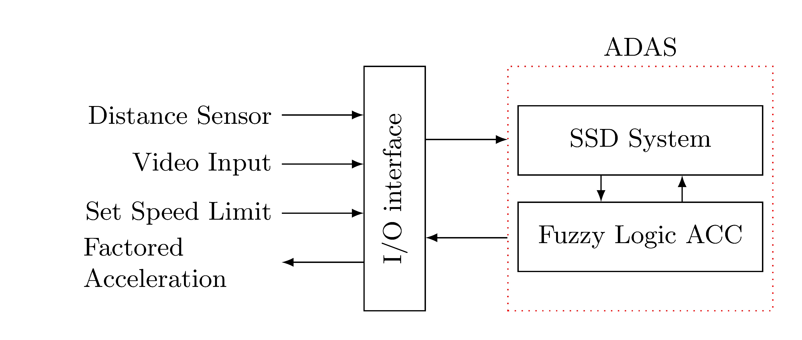

  * [io-fit+diagram.tex](https://github.com/walmes/Tikz/blob/master/src/io-fit+diagram.pgf)

```tex
% https://tex.stackexchange.com/questions/152952/drawing-this-diagram-in-tikz?rq=1
\documentclass[tikz,border=10pt]{standalone}
\usetikzlibrary{fit,positioning,calc}
\tikzset{decision/.style = {diamond, draw, fill=blue!20, text width=4.5em, text badly centered, node
                            distance=3cm, inner sep=0pt},
         block/.style    = {rectangle, draw, fill=black!25, text width=5em, text centered, rounded
                            corners, minimum height=4em},
         line/.style     = {draw, -latex'},
         cloud/.style    = {draw, ellipse,fill=red!20, node distance=3cm, minimum height=2em}
}
\begin{document}
    \begin{tikzpicture}[scale=2,font=\small]
        \node [draw=black,minimum width=3cm,minimum height=0.85cm] (io2) {SSD System};
        \node [draw=black,minimum width=3cm,minimum height=0.85cm, below =0.32cm of io2] (io3) {Fuzzy Logic ACC};
        \draw [latex-] ($(io2.south east)!0.33!(io2.south west)$) -- ($(io3.north east)!0.33!(io3.north west)$);
        \draw [-latex] ($(io2.south east)!0.66!(io2.south west)$) -- ($(io3.north east)!0.66!(io3.north west)$);
        \node[fit=(io2) (io3), draw=red, dotted,minimum height=3cm] (fit) {};
        \node[anchor=south] at (fit.north) {ADAS};
        \node [draw=black,rotate=90,anchor=north,minimum width=3cm,minimum height=0.75cm,left=1cm of fit,anchor=south] (io) {I/O interface};
        \draw[-latex] ($(io.south east)!0.3!(io.south west)$) -- ($(fit.north west)!0.3!(fit.south west)$);
        \draw[latex-] ($(io.south east)!0.7!(io.south west)$) -- ($(fit.north west)!0.7!(fit.south west)$);
        \foreach \x/\a in {0.2/2,0.4/4,0.6/6,0.8/8}{
        \coordinate (z\a) at ($(io.north east)!\x!(io.north west)$);
        }
        \draw[latex-](z2)--+(-.5,0) node[anchor=east]{Distance Sensor};
        \draw[latex-](z4)--+(-.5,0) node[anchor=east]{Video Input};
        \draw[latex-](z6)--+(-.5,0) node[anchor=east]{Set Speed Limit};
        \draw[-latex](z8)--+(-.5,0) node[anchor=east,minimum width=3.1cm,align=left]{Factored \\ Acceleration}; 
\end{tikzpicture}
\end{document}
```
****

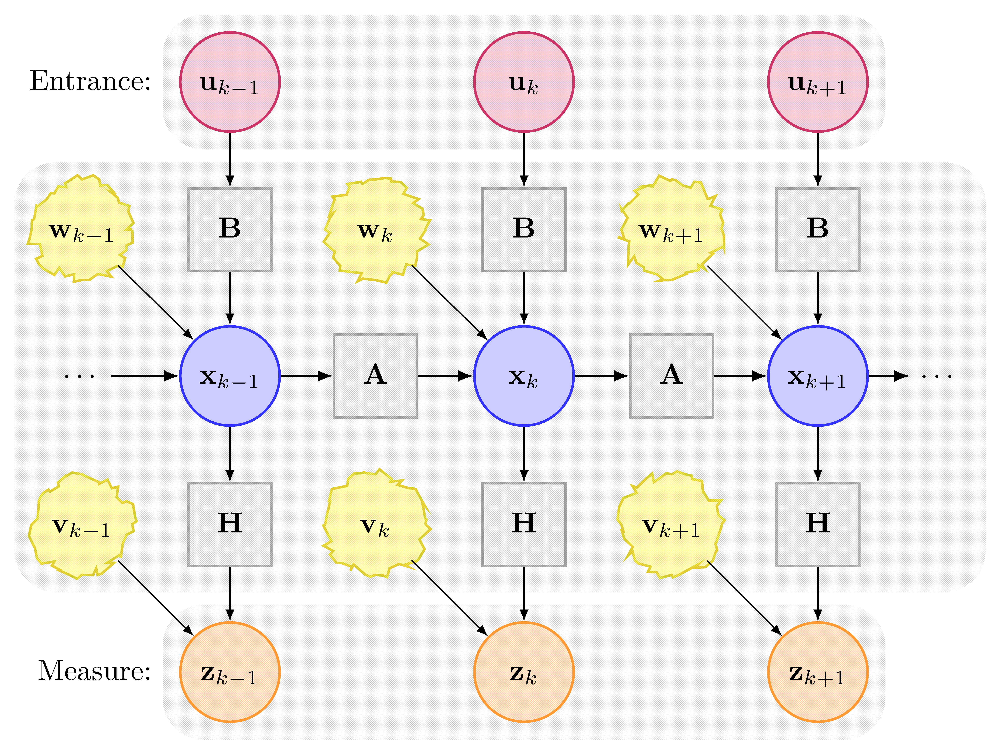

  * [kalman+diagram+set.tex](https://github.com/walmes/Tikz/blob/master/src/kalman+diagram+set.pgf)

```tex
% http://www.texample.net/media/tikz/examples/TEX/kalman-filter.tex
% Kalman filter system model
% by Burkart Lingner
% An example using TikZ/PGF 2.00
%
% Features: Decorations, Fit, Layers, Matrices, Styles
% Tags: Block diagrams, Diagrams
% Technical area: Electrical engineering

\documentclass[a4paper,10pt]{article}

\usepackage[english]{babel}
\usepackage[T1]{fontenc}
\usepackage[ansinew]{inputenc}

\usepackage{lmodern}	% font definition
\usepackage{amsmath}	% math fonts
\usepackage{amsthm}
\usepackage{amsfonts}

\usepackage{tikz}

%%%<
\usepackage{verbatim}
\usepackage[active,tightpage]{preview}
\PreviewEnvironment{tikzpicture}
\setlength\PreviewBorder{5pt}%
%%%>

\begin{comment}
:Title: Kalman Filter System Model
:Slug: kalman-filter
:Author: Burkart Lingner

This is the system model of the (linear) Kalman filter. 

\end{comment}


\usetikzlibrary{decorations.pathmorphing} % noisy shapes
\usetikzlibrary{fit}					% fitting shapes to coordinates
\usetikzlibrary{backgrounds}	% drawing the background after the foreground

\begin{document}

\begin{figure}[htbp]
\centering
% The state vector is represented by a blue circle.
% "minimum size" makes sure all circles have the same size
% independently of their contents.
\tikzstyle{state}=[circle,
                                    thick,
                                    minimum size=1.2cm,
                                    draw=blue!80,
                                    fill=blue!20]

% The measurement vector is represented by an orange circle.
\tikzstyle{measurement}=[circle,
                                                thick,
                                                minimum size=1.2cm,
                                                draw=orange!80,
                                                fill=orange!25]

% The control input vector is represented by a purple circle.
\tikzstyle{input}=[circle,
                                    thick,
                                    minimum size=1.2cm,
                                    draw=purple!80,
                                    fill=purple!20]

% The input, state transition, and measurement matrices
% are represented by gray squares.
% They have a smaller minimal size for aesthetic reasons.
\tikzstyle{matrx}=[rectangle,
                                    thick,
                                    minimum size=1cm,
                                    draw=gray!80,
                                    fill=gray!20]

% The system and measurement noise are represented by yellow
% circles with a "noisy" uneven circumference.
% This requires the TikZ library "decorations.pathmorphing".
\tikzstyle{noise}=[circle,
                                    thick,
                                    minimum size=1.2cm,
                                    draw=yellow!85!black,
                                    fill=yellow!40,
                                    decorate,
                                    decoration={random steps,
                                                            segment length=2pt,
                                                            amplitude=2pt}]

% Everything is drawn on underlying gray rectangles with
% rounded corners.
\tikzstyle{background}=[rectangle,
                                                fill=gray!10,
                                                inner sep=0.2cm,
                                                rounded corners=5mm]

\begin{tikzpicture}[>=latex,text height=1.5ex,text depth=0.25ex]
    % "text height" and "text depth" are required to vertically
    % align the labels with and without indices.
  
  % The various elements are conveniently placed using a matrix:
  \matrix[row sep=0.5cm,column sep=0.5cm] {
    % First line: Control input
    &
        \node (u_k-1) [input]{$\mathbf{u}_{k-1}$}; &
        &
        \node (u_k)   [input]{$\mathbf{u}_k$};     &
        &
        \node (u_k+1) [input]{$\mathbf{u}_{k+1}$}; &
        \\
        % Second line: System noise & input matrix
        \node (w_k-1) [noise] {$\mathbf{w}_{k-1}$}; &
        \node (B_k-1) [matrx] {$\mathbf{B}$};       &
        \node (w_k)   [noise] {$\mathbf{w}_k$};     &
        \node (B_k)   [matrx] {$\mathbf{B}$};       &
        \node (w_k+1) [noise] {$\mathbf{w}_{k+1}$}; &
        \node (B_k+1) [matrx] {$\mathbf{B}$};       &
        \\
        % Third line: State & state transition matrix
        \node (A_k-2)         {$\cdots$};           &
        \node (x_k-1) [state] {$\mathbf{x}_{k-1}$}; &
        \node (A_k-1) [matrx] {$\mathbf{A}$};       &
        \node (x_k)   [state] {$\mathbf{x}_k$};     &
        \node (A_k)   [matrx] {$\mathbf{A}$};       &
        \node (x_k+1) [state] {$\mathbf{x}_{k+1}$}; &
        \node (A_k+1)         {$\cdots$};           \\
        % Fourth line: Measurement noise & measurement matrix
        \node (v_k-1) [noise] {$\mathbf{v}_{k-1}$}; &
        \node (H_k-1) [matrx] {$\mathbf{H}$};       &
        \node (v_k)   [noise] {$\mathbf{v}_k$};     &
        \node (H_k)   [matrx] {$\mathbf{H}$};       &
        \node (v_k+1) [noise] {$\mathbf{v}_{k+1}$}; &
        \node (H_k+1) [matrx] {$\mathbf{H}$};       &
        \\
        % Fifth line: Measurement
        &
        \node (z_k-1) [measurement] {$\mathbf{z}_{k-1}$}; &
        &
        \node (z_k)   [measurement] {$\mathbf{z}_k$};     &
        &
        \node (z_k+1) [measurement] {$\mathbf{z}_{k+1}$}; &
        \\
    };
    
    % The diagram elements are now connected through arrows:
    \path[->]
        (A_k-2) edge[thick] (x_k-1)	% The main path between the
        (x_k-1) edge[thick] (A_k-1)	% states via the state
        (A_k-1) edge[thick] (x_k)		% transition matrices is
        (x_k)   edge[thick] (A_k)		% accentuated.
        (A_k)   edge[thick] (x_k+1)	% x -> A -> x -> A -> ...
        (x_k+1) edge[thick] (A_k+1)
        
        (x_k-1) edge (H_k-1)				% Output path x -> H -> z
        (H_k-1) edge (z_k-1)
        (x_k)   edge (H_k)
        (H_k)   edge (z_k)
        (x_k+1) edge (H_k+1)
        (H_k+1) edge (z_k+1)
        
        (v_k-1) edge (z_k-1)				% Output noise v -> z
        (v_k)   edge (z_k)
        (v_k+1) edge (z_k+1)
        
        (w_k-1) edge (x_k-1)				% System noise w -> x
        (w_k)   edge (x_k)
        (w_k+1) edge (x_k+1)
        
        (u_k-1) edge (B_k-1)				% Input path u -> B -> x
        (B_k-1) edge (x_k-1)
        (u_k)   edge (B_k)
        (B_k)   edge (x_k)
        (u_k+1) edge (B_k+1)
        (B_k+1) edge (x_k+1)
        ;
    
    % Now that the diagram has been drawn, background rectangles
    % can be fitted to its elements. This requires the TikZ
    % libraries "fit" and "background".
    % Control input and measurement are labeled. These labels have
    % not been translated to English as "Measurement" instead of
    % "Messung" would not look good due to it being too long a word.
    \begin{pgfonlayer}{background}
        \node [background,
                    fit=(u_k-1) (u_k+1),
                    label=left:Entrance:] {};
        \node [background,
                    fit=(w_k-1) (v_k-1) (A_k+1)] {};
        \node [background,
                    fit=(z_k-1) (z_k+1),
                    label=left:Measure:] {};
    \end{pgfonlayer}
\end{tikzpicture}

\caption{Kalman filter system model}
\end{figure}

This is the system model of the (linear) Kalman filter. At each time
step the state vector $\mathbf{x}_k$ is propagated to the new state
estimation $\mathbf{x}_{k+1}$ by multiplication with the constant state
transition matrix $\mathbf{A}$. The state vector $\mathbf{x}_{k+1}$ is
additionally influenced by the control input vector $\mathbf{u}_{k+1}$
multiplied by the input matrix $\mathbf{B}$, and the system noise vector
$\mathbf{w}_{k+1}$. The system state cannot be measured directly. The
measurement vector $\mathbf{z}_k$ consists of the information contained
within the state vector $\mathbf{x}_k$ multiplied by the measurement
matrix $\mathbf{H}$, and the additional measurement noise $\mathbf{v}_k$.

\end{document}
```
****


  * [louvre-planes.tex](https://github.com/walmes/Tikz/blob/master/src/louvre-planes.pgf)

```tex
% louvre-plaes.tex
% https://tex.stackexchange.com/q/186058/173708
\documentclass{article}
\usepackage{tikz}
\usepackage{verbatim}
\usetikzlibrary{shapes,shadows,positioning,arrows,calc,matrix,decorations.markings,decorations.pathreplacing}

% like standalone
\usepackage[active,tightpage]{preview}
\PreviewEnvironment{tikzpicture}
\setlength\PreviewBorder{5pt}%

\begin{document}

\definecolor{colone}{RGB}{209,220,204}
\definecolor{coltwo}{RGB}{204,222,210}
\definecolor{colthree}{RGB}{207,233,232}
\definecolor{colfour}{RGB}{248,243,214}
\definecolor{colfive}{RGB}{245,238,197}
\definecolor{colsix}{RGB}{243,235,179}
\definecolor{colseven}{RGB}{241,231,163}
\definecolor{colortop}{RGB}{184,223,155}
\definecolor{colorside}{RGB}{0,209,54}

\begin{figure}
\begin{tikzpicture}[every node/.style={minimum size=1cm,font=\scriptsize},on grid]
\begin{scope}[every node/.append style={yslant=-0.5},yslant=-0.5]
  \shade[right color=colorside!30, left color=colorside!50] (-1,0) rectangle +(4,3);
  \node  at (-0.5,2.25) {};
  \node at (0.5,2.75) {$Sex$};
  \node at (1.5,2.75) {$Age$};
  \node at (2.5,2.75) {$Area$};
  \node at (-0.5,1.25) {$User_3$};
  \node at (-0.5,0.75) {$...$};
  \node at (0.5,0.75) {$...$};
  \node at (2.5,0.75) {$...$};
  \node at (0.5,1.25) {$*$};
  \node at (1.5,1.25) {$4$};
   \node at (2.5,1.25) {$0$};
   \node at (-0.5,0.25) {$User_n$};
   \node at (1.5,0.75) {$...$};
   \node at (-0.5,2.25) {$user_1$};
   \node at (0.5,2.25) {$0$};
   \node at (1.5,2.25) {$*$};
   \node at (2.5,2.25) {$1$};
    \node at (-0.5,1.75) {$User_2$};
    \node at (0.5,1.75) {$1$};
    \node at (1.5,1.75) {$3$};
    \node at (2.5,1.75) {$0$};
    \node at (0.5,0.25) {$2$};
    \node at (1.5,0.25) {$*$};
    \node at (2.5,0.25) {$9$};
  \draw (-1,0) grid[ystep=0.5] (3,3);
\end{scope}
\begin{scope}[every node/.append style={yslant=0.5},yslant=0.5]
  \shade[right color=colorside!70,left color=colorside!10] (3,-3) rectangle +(5,3);
  \node at (3.5,-0.25) {};
  \node at (3.5,-0.75) {$user_1$};
  \node at (3.5,-1.25) {$user_2$};
  \node at (3.5,-1.75){$user_3$};
  \node at (3.5,-2.25) {$...$};
  \node at (3.5,-2.75) {$user_n$};
  \node at (4.5,-0.25) {$item_1$};
  \node at (4.5,-1.25) {$3$};
  \node at (4.5,-0.75) {$*$};
  \node at (4.5,-1.75) {$*$};
  \node at (4.5,-2.25) {$...$};
  \node at (4.5,-2.75) {$*$};
  \node at (5.5,-0.25) {$item_2$};
  \node at (5.5,-0.75) {$2$};
  \node at (5.5,-1.75) {$3$};
  \node at (5.5,-1.25) {$4$};
   \node at (5.5,-2.75) {$5$};
  \node at (5.5,-2.25) {$...$};
  \node at (6.5,-0.25) {$...$};
  \node at (6.5,-1.25) {$...$};
  \node at (6.5,-2.25) {$...$};
  \node at (6.5,-0.75) {$...$};
  \node at (6.5,-1.75) {$...$};
  \node at (6.5,-2.75) {$...$};
  \node at (7.5,-0.25) {$item_n$};
  \node at (7.5,-0.75) {$3$};
  \node at (7.5,-1.25) {$5$};
  \node at (7.5,-1.75) {$4$};
  \node at (7.5,-2.25) {$...$};
  \node at (7.5,-2.75) {$*$};


  \draw (3,-3) grid[ystep=0.5] (8,0);
 \end{scope}
\begin{scope}[every node/.append style={
    yslant=0.5,xslant=-1},yslant=0.5,xslant=-0.75
  ]
  \shade[bottom color=colortop!10, top color=colortop!80] (8,4) rectangle +(-5,-4);
\draw (3.0,0.0) grid[ystep=0.5] (8,4);
 \node at (3.5,3.75) {};
 \node at (3.5,3.25) {$Legal$};
 \node at (3.5,2.75) {$Fin.$};
 \node at (3.5,2.25) {$Med.$};
 \node at (3.5,1.75) {$Home$};
 \node at (3.5,1.25) {$Road$};
 \node at (3.5,0.75) {$Travel$};
  \node at (3.5,0.25) {$Din.$};
 \node at (4.5,3.75) {$item_1$};
  \node at (4.5,3.25) {$1$};
 \node at (4.5,2.75) {$0$};
 \node at (4.5,2.25) {$0$};
 \node at (4.5,1.75) {$1$};
 \node at (4.5,1.25) {$1$};
 \node at (4.5,0.75) {$0$};
 \node at (4.5,0.25) {$1$};
\node at (5.5,3.75) {$item_2$};
  \node at (5.5,3.25) {$1$};
  \node at (5.5,2.75) {$0$};
  \node at (5.5,2.25) {$0$};
  \node at (5.5,1.75) {$1$};
  \node at (5.5,1.25) {$0$};
  \node at (5.5,0.75) {$1$};
  \node at (5.5,0.25) {$1$};
 \node at (6.5,3.75) {$...$};
\node at (6.5,3.25) {$...$};
\node at (6.5,2.75) {$...$};
\node at (6.5,2.25) {$...$};
\node at (6.5,1.75) {$...$};
\node at (6.5,1.25) {$...$};
\node at (6.5,0.75) {$...$};
\node at (6.5,0.25) {$...$};
\node at (7.5,3.75) {$item_n$};
\node at (7.5,3.25) {$0$};
\node at (7.5,2.75) {$1$};
\node at (7.5,2.25) {$1$};
\node at (7.5,1.75) {$0$};
\node at (7.5,1.25) {$0$};
\node at (7.5,0.75) {$1$};
\node at (7.5,0.25) {$0$};


\end{scope}
\end{tikzpicture}
 \caption{User-Item Combined Matrix}
\label{fig:com}
\end{figure}
\end{document}
```
****


  * [mammography_bayes+diagram.tex](https://github.com/walmes/Tikz/blob/master/src/mammography_bayes+diagram.pgf)

```tex
% Mammography problem from 'Intro to Bayes'
% Author: John Henderson
\documentclass[10pt]{article}
\usepackage{tikz}
%%%<
\usepackage{verbatim}
\usepackage[active,tightpage]{preview}
\PreviewEnvironment{tikzpicture}
\setlength\PreviewBorder{5pt}%
%%%>
\begin{comment}
:Title: Mammography problem from 'Intro to Bayes'
:Tags: Nodes and Shapes;Node positioning;Text and math;Diagrams;Mathematics
:Author: John Henderson
:Slug: bayes

The following was created in response to reading about "the mammography
problem," a commonly used example illustrating the use of Bayesian
Probability, on Eliezer Yudkowsky's page, "An Intuitive Explanation of
Bayes' Theorem." The visualization presents the problem as involving
"sieves" which behave differently depending on whether the individual
passing through has or does not have cancer, illustrating the split
probability created by the reliability of a mammography (chance of
producing true positives and false positives). The illustration was posted
on LessWrong.com, a site devoted to rationality, created by Yudkowsky.
\end{comment}
\usetikzlibrary{positioning,decorations.pathreplacing,shapes}
\usepackage[english]{babel}
\usepackage{microtype}
\usepackage[hmargin=1.5cm,vmargin=1cm]{geometry}
\usepackage{amsmath}
\DeclareMathOperator{\p}{p}
\newcommand*{\cancer}{\text{cancer}}
\newcommand*{\testp}{\text{test}+}
\begin{document}
\begin{tikzpicture}[%
  % common options for blocks:
  block/.style = {draw, fill=blue!30, align=center, anchor=west,
              minimum height=0.65cm, inner sep=0},
  % common options for the circles:
  ball/.style = {circle, draw, align=center, anchor=north, inner sep=0}]

% circle illustrating all women
\node[ball,text width=3cm,fill=purple!20] (all) at (6,0) {All women};

% two circles showing split of p{cancer} and p{~cancer}
\node[ball,fill=red!70,text width=0.1cm,anchor=base] (pcan) at (3.5,-5.5) {};
\node[ball,fill=blue!40,text width=2.9cm,anchor=base] (pncan) at (8.5,-6)
   {Women without cancer\\
    $\p({\sim}\cancer) = 99\%$};

% arrows showing split from all women to cancer and ~cancer
\draw[->,thick,draw=red!50] (all.south) to [out=270,in=90] (pcan.north);
\draw[->,thick,draw=blue!80] (all.south) to [out=270,in=110] (pncan.100);

% transition from all women to actual cancer rates
\node[anchor=north,text width=10cm,inner sep=.05cm,align=center,fill=white]
  (why1) at (6,-3.7) {In measuring, we find:};

% note illustration the p{cancer} circle (text won't fit inside)
\node[inner sep=0,anchor=east,text width=3.3cm] (note1) at (3.2,-5.5) {
   Women with cancer $\p(\cancer) = 1\%$};

% draw the sieves
\node[block,anchor=north,text width=4.4cm,fill=green!50] (tray1) at
   (3.5,-8.8) {\small{$\p(\testp\mid\cancer)=0.8$}};

\node[block,anchor=north,text width=4.4cm,fill=green!50] (tray2) at
   (8.5,-8.8) {$\p(\testp\mid{\sim}\cancer)=0.096$};

% text explaining how p{cancer} and p{~cancer} behave as they
% pass through the sieves
\node[anchor=west,text width=6cm] (note1) at (-6,-9.1) {
   Now we pass both groups through the sieve; note that both
     sieves are \emph{the same}; they just behave differently
     depending on which group is passing through. \\ 
     Let $\testp=$ a positve mammography.};

% arrows showing the circles passing through the seives
\draw[->,thick,draw=red!80] (3.5,-5.9) -- (3.5,-8.6);
\draw[->,thick,draw=blue!50] (8.5,-8.1) -- (8.5,-8.6);

% numerator
\node[ball,text width=0.05cm,fill=red!70] (can) at (6,-10.5) {};

% dividing line
\draw[thick] (5,-11) -- (7,-11);

% demoniator
\node[ball,text width=0.39cm,fill=blue!40,anchor=base] (ncan) at (6.5,-11.5) {};
\node[ball,text width=0.05cm,fill=red!70,anchor=base] (can2) at (5.5,-11.5) {};

% plus sign in denominator
\draw[thick] (5.9,-11.4) -- (5.9,-11.6);
\draw[thick] (5.8,-11.5) -- (6,-11.5);

% arrows showing the output of the sieves formed the fraction
\draw[->,thick,draw=red!80] (tray1.south) to [out=280,in=180] (can);
\draw[->,thick,draw=red!80] (tray1.south) to [out=280,in=180] (can2);
\node[anchor=north,inner sep=.1cm,align=center,fill=white] (why2) at
   (3.8,-9.8) {$1\% * 80\%$};

\draw[->,thick,draw=blue!50] (tray2.south) to [out=265,in=0] (ncan);
\node[anchor=north,inner sep=.1cm,align=center,fill=white] (why2) at
   (8.4,-9.8) {$99\% * 9.6\%$};

% explanation of final formula
\node[anchor=north west,text width=6.5cm] (note2) at (-6,-12.5)
   {Finally, to find the probability that a positive test
       \emph{actually means cancer}, we look at those who passed
       through the sieve \emph{with cancer}, and divide by all who
       received a positive test, cancer or not.}; 

% illustrated fraction turned into math
\node[anchor=north,text width=10cm] (solution) at (6,-12.5) {
  \begin{align*}
      \frac{\p(\testp\mid\cancer)}{\p(\testp\mid\cancer)
        + \p(\testp\mid{\sim}\cancer)} &= \\
      \frac{1\% * 80\%}{(1\% * 80\%) + (99\% * 9.6\%)} &= 7.8\%
        = \p(\cancer\mid\testp)
   \end{align*}};
\end{tikzpicture}
\end{document}
```
****


  * [mapper-reducer.tex](https://github.com/walmes/Tikz/blob/master/src/mapper-reducer.pgf)

```tex
% https://tex.stackexchange.com/a/52703/173708

% (S) -> (M) -> (V) -> (shuffle) -> (P) -> (R) - (F)
% S for Start F for Final
\documentclass{standalone}
\usepackage{tikz}
\usetikzlibrary{%
  calc,
  fit,
  shapes,
  backgrounds
}
% the next macro is useful to create a table
\newcommand\tabins[3]{%
 \tikz[baseline=(Tab.base)] 
           \node  [rectangle split, 
                   rectangle split parts=3, 
                   draw, 
                   align=right,
                   inner sep=.5em,
                   rectangle split horizontal] (Tab)
                           {\hbox to 4ex{#1}
           \nodepart{two}  {\hbox to 8ex{\hfill #2\$}}  
           \nodepart{three}{\hbox to 3ex{#3}}}; 
}

\begin{document}
\parindent=0pt
\begin{tikzpicture}[%
   %every node/.style={transform shape},% now it's not necessary but good for a poster
  x=1.25cm,y=2cm,  
  font=\footnotesize,
  % every group of nodes have a style except for main, the style is named by a letter
  main/.style={draw,fill=yellow,inner sep=.5em},
  R/.style={draw,fill=purple!40!blue!30,inner sep=.5em},
  M/.style={draw,fill=green!80!yellow,inner sep=.5em},
  S/.style={anchor=east},
  V/.style={anchor=west},
  P/.style={anchor=center},
  F/.style={anchor=west}
  ]

% main node the reference Shuffle 
\node[main] (shuffle) {Group};
%group R reducer
\node[R] at ($(shuffle)+(8,1)$)    (R1+) {Reduce};
\node[R] at ($(shuffle)+(8, 0)$)   (R0)  {Reduce};
\node[R] at ($(shuffle)+(8,-1)$)   (R1-) {Reduce};
% group M Mapper
\node[M] at ($(shuffle)+(-6,+2.5)$)   (M3+)  {Map};
\node[M] at ($(shuffle)+(-6,+ 1.5)$)  (M2+)  {Map};
\node[M] at ($(shuffle)+(-6,+ .5)$)   (M1+)  {Map};
\node[M] at ($(shuffle)+(-6,- .5)$)   (M1-)  {Map};
\node[M] at ($(shuffle)+(-6,- 1.5)$)  (M2-)  {Map};
\node[M] at ($(shuffle)+(-6,-2.5)$)   (M3-)  {Map};
% group S Start the first nodes
\node[S] at ($(M3+)+(-1.5,0)$)  (S3+) {\Big($k_1$,\tabins{4711}{59.90}{NY}\Big)};
\node[S] at ($(M2+)+(-1.5,0)$)  (S2+) {\Big($k_2$,\tabins{4713}{142.99}{CA}\Big)};
\node[S] at ($(M1+)+(-1.5,0)$)  (S1+) {\Big($k_3$,\tabins{4714}{72.00}{NY}\Big)}; 
\node[S] at ($(M1-)+(-1.5,0)$)  (S1-) {\Big($k_4$,\tabins{4715}{108.75}{NY}\Big)}; 
\node[S] at ($(M2-)+(-1.5,0)$)  (S2-) {\Big($k_5$,\tabins{4718}{19.89}{WA}\Big)};  
\node[S] at ($(M3-)+(-1.5,0)$)  (S3-) {\Big($k_6$,\tabins{4719}{36.60}{CA}\Big)};  
% group V  why not
\node[V] at ($(M3+)+(1.5,0)$)  (V3+) {\Big(NY,59.90\$\Big)};
\node[V] at ($(M2+)+(1.5,0)$)  (V2+) {\Big(CA,142.99\$\Big)};
\node[V] at ($(M1+)+(1.5,0)$)  (V1+) {\Big(NY,72.00\$\Big)}; 
\node[V] at ($(M1-)+(1.5,0)$)  (V1-) {\Big(NY,108.75\$\Big)}; 
\node[V] at ($(M2-)+(1.5,0)$)  (V2-) {\Big(WA,19.89\$\Big)};  
\node[V] at ($(M3-)+(1.5,0)$)  (V3-) {\Big(CA,36.60\$\Big)};   

\node[P] at ($(R1+)+(-4,0)$) (P1+) {\Big(CA,\big[142.99\$,36.60\$\big]\Big)};
\node[P] at ($(R0) +(-4,0)$) (P0)  {\Big(NY,\big[59.90\$,72.00\$,108.75\big]\Big)};
\node[P] at ($(R1-)+(-4,0)$) (P1-) {\Big(WA,\big[19.89\$\big]\Big)}; 

\node[F] (F1+) at ($(R1+)+(1.5,0)$) {(CA,89.80\$)};
\node[F] (F0)  at ($(R0) +(1.5,0)$) {(NY,80.22\$)}; 
\node[F] (F1-) at ($(R1-)+(1.5,0)$) {(WA,72.00\$)}; 

% wrappers
\begin{scope}[on background layer]
    \node[fill=lightgray!50,inner sep = 4mm,fit=(shuffle),label=above:Shuffle] {}; 
\end{scope} 
\begin{scope}[on background layer]
    \node[fill=lightgray!50,inner sep = 4mm,fit=(R1+)(R1-),label=above:Reducer] {}; 
\end{scope}  
\begin{scope}[on background layer]
    \node[fill=lightgray!50,inner sep = 4mm,fit=(M3+)(M3-),label=above:Mapper] {}; 
\end{scope}

%edges

\foreach \indice in {3+,2+,1+,1-,2-,3-} \draw[->] (S\indice.east) -- (M\indice.west); 
\foreach \indice in {3+,2+,1+,1-,2-,3-} \draw[->] (M\indice.east) -- (V\indice.west);
\foreach \indice in {3+,2+,1+,1-,2-,3-} \draw[->] (V\indice.east) to [out=0,in=180] (shuffle.west); 
\foreach \indice in {1+,0,1-} \draw[->] (shuffle.east) to [out=0,in=180] (P\indice.west);  
\foreach \indice in {1+,0,1-} \draw[->] (P\indice.east) -- (R\indice.west);
\foreach \indice in {1+,0,1-} \draw[->] (R\indice.east) -- (F\indice.west);   
\end{tikzpicture} 

\end{document}     
```
****


  * [matrix-highlighting.tex](https://github.com/walmes/Tikz/blob/master/src/matrix-highlighting.pgf)

```tex
% Highlighting elements in matrices
% Author: Stefan Kottwitz
% \documentclass{article}
\documentclass[preview]{standalone}
\usepackage{tikz}
\usetikzlibrary{fit}
\tikzset{%
  highlight/.style={rectangle,rounded corners,fill=red!15,draw,fill opacity=0.5,thick,inner sep=0pt}
}
\newcommand{\tikzmark}[2]{\tikz[overlay,remember picture,baseline=(#1.base)] \node (#1) {#2};}
%
\newcommand{\Highlight}[1][submatrix]{%
    \tikz[overlay,remember picture]{
    \node[highlight,fit=(left.north west) (right.south east)] (#1) {};}
}

\begin{document}

\[
  M = \left(\begin{array}{*5{c}}
    \tikzmark{left}{1} & 2 & 3 & 4 & 5\\
    6 & 7 & 8 & 9 & 10 \\
    11 & 12 & \tikzmark{right}{13} & 14 & 15 \\
    16 & 17 & 18 & 19 & 20
  \end{array}\right)
  \Highlight[first]
  \qquad
  M^T = \left(\begin{array}{*5{c}}
    \tikzmark{left}{1} & 6 & 11 & 16 \\
    2 & 7 & 12 & 17 \\
    3 & 8 & \tikzmark{right}{13} & 18 \\
    4 & 9 & 14 & 19 \\
    5 & 10 & 15 & 20
  \end{array}\right)
\]
\Highlight[second]

\tikz[overlay,remember picture] {
  \draw[->,thick,red,dashed] (first) -- (second) node [pos=0.66,above] {Transpose};
  \node[above of=first] {$N$};
  \node[above of=second] {$N^T$};
}
\end{document}
```
****


  * [matrix-product.tex](https://github.com/walmes/Tikz/blob/master/src/matrix-product.pgf)

```tex
% https://tex.stackexchange.com/questions/264260/matrix-product-illustration?noredirect=1&lq=1
\documentclass{standalone}
\usepackage{tikz}
\usetikzlibrary{matrix,arrows.meta,positioning}

\definecolor{myyellow}{RGB}{240,217,1}
\definecolor{mygreen}{RGB}{143,188,103}
\definecolor{myred}{RGB}{234,38,40}
\definecolor{myblue}{RGB}{53,101,167}

\begin{document}

\begin{tikzpicture}[
mymatrix/.style={
  matrix of math nodes,
  outer sep=0pt,
  nodes={
    draw,
    text width=2.5em,
    align=center,
    minimum height=2.5em,
    text=gray
  },
  nodes in empty cells,
  column sep=-\pgflinewidth,
  row sep=-\pgflinewidth,
  left delimiter=[,
  right delimiter=],
  },
  mycircle/.style 2 args={
    draw=#1,
    circle,
    fill=#2,
    line width=2pt,
    inner sep=5pt
  },
  arr/.style={
  line width=4pt,
  -{Triangle[angle=60:1.5pt 3]},
  #1,
  shorten >= 3pt,
  shorten <= 3pt
  }
]
%the matrices
\matrix[mymatrix] (A)
{
|[text=black]|a_{11} & |[text=black]|a_{12} \\
a_{21} & a_{22} \\
|[text=black]|a_{31} & |[text=black]|a_{32} \\
a_{41} & a_{42} \\
};
\matrix[mymatrix,right=of A.north east,anchor=north west] (prod)
{
& & \\
& & \\
& & \\
& & \\
};
\matrix[mymatrix,above=of prod.north west,anchor=south west] (B)
{
b_{11} & |[text=black]|b_{12} & |[text=black]|b_{13} \\
b_{21} & |[text=black]|b_{22} & |[text=black]|b_{23} \\
};

%the labels for the matrices
\node[font=\huge,left=10pt of A] {$A$};
\node[font=\huge,above=2pt of B] {$B$};

%the frames in both matrices
\draw[myyellow,line width=2pt]
  ([shift={(1.2pt,-1.2pt)}]A-1-1.north west) 
  rectangle 
  ([shift={(-1.2pt,1.2pt)}]A-1-2.south east);
\draw[myyellow,line width=2pt]
  ([shift={(1.2pt,-1.2pt)}]B-1-2.north west) 
  rectangle 
  ([shift={(-1.2pt,1.2pt)}]B-2-2.south east);
\draw[mygreen,line width=2pt]
  ([shift={(1.2pt,-1.2pt)}]A-3-1.north west) 
  rectangle 
  ([shift={(-1.2pt,1.2pt)}]A-3-2.south east);
\draw[mygreen,line width=2pt]
  ([shift={(1.2pt,-1.2pt)}]B-1-3.north west) 
  rectangle 
  ([shift={(-1.2pt,1.2pt)}]B-2-3.south east);

%the filled circles in the product
\node[mycircle={myblue}{mygreen}]
  at (prod-3-3) (prod33) {};
\node[mycircle={myred}{myyellow}]
  at (prod-1-2) (prod12) {};

%the arrows
\draw[arr=myred]
  (A-1-2.east) -- (prod12); 
\draw[arr=myred]
  (B-2-2.south) -- (prod12); 
\draw[arr=myblue]
  (A-3-2.east) -- (prod33); 
\draw[arr=myblue]
  (B-2-3.south) -- (prod33); 

%the legend
\matrix[
  matrix of math nodes,
  nodes in empty cells,
  column sep=10pt,
  anchor=north,
  nodes={
    minimum height=2.2em,
    minimum width=2em,
    anchor=north west
  },
  below=5pt of current bounding box.south
  ] 
  (legend)
{
  & a_{11}b_{12} + a_{12}b_{22} \\
  & a_{31}b_{13} + a_{32}b_{23} \\
};
\node[mycircle={myblue}{mygreen}]
  at (legend-2-1) {};
\node[mycircle={myred}{myyellow}]
  at (legend-1-1) {};
\end{tikzpicture}

\end{document}
```
****

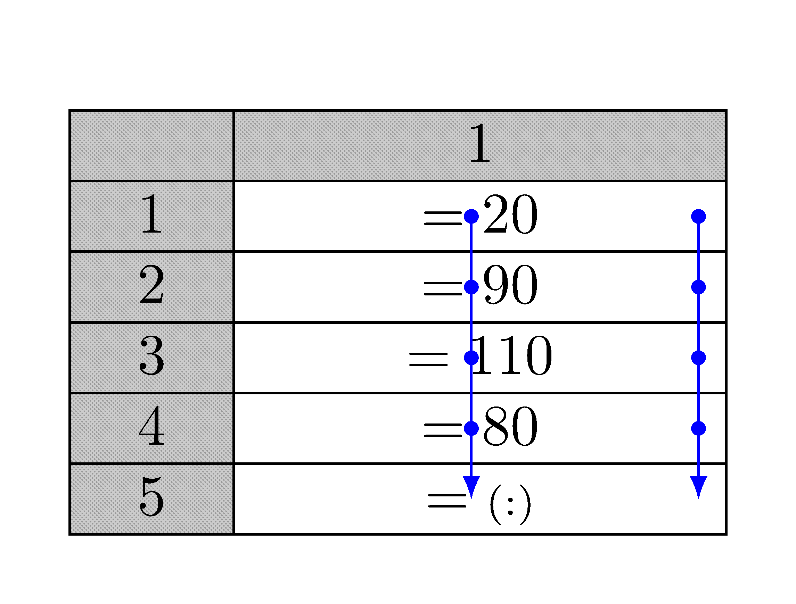

  * [matrix-spreadsheet_formula+matrix+command.tex](https://github.com/walmes/Tikz/blob/master/src/matrix-spreadsheet_formula+matrix+command.pgf)

```tex
% https://tex.stackexchange.com/a/266113/173708
\documentclass[border=3mm,tikz]{standalone}
%\documentclass{article}
\usepackage{amsmath}
\usepackage{tikz}
\usetikzlibrary{matrix}

\newcommand\funsum{}
\newcommand\scell[2]{}
\newcommand\inmblue[1]{}

\colorlet{mlightgray}{lightgray}

\begin{document}
\begin{tikzpicture}[cell/.style={rectangle,draw=black}, nodes in empty cells]
  \matrix[
  matrix of math nodes,
  row sep =-\pgflinewidth,
  column sep = -\pgflinewidth,
  nodes={anchor=center, minimum width=2cm, cell},
  column 1/.style = {nodes={minimum width=1cm, fill=mlightgray}},
  column 2/.style = {nodes={minimum width=3cm}},
  row 1/.style = {nodes={text height=1.3ex, text depth=0, fill=mlightgray}},
  row 2/.style = {text height=1.3ex, text depth=0},
  row 3/.style = {text height=1.3ex, text depth=0},
  row 4/.style = {text height=1.3ex, text depth=0},
  row 5/.style = {text height=1.3ex, text depth=0},  
  row 6/.style = {text height=1.3ex, text depth=0},
  ] (m)
  {   &  \text{1}   \\
    \text{1} & =20  \\
    \text{2} & =90  \\
    \text{3} & =110 \\
    \text{4} & =80  \\
    \text{5} & = {\scriptstyle \funsum(\scell{1}{1}:\scell{4}{1})} \\
  };
  \node[font=\Large,anchor=south] at (m.north) {\inmblue{Formulas}};
  \draw[blue,-latex] 
    ([xshift=-1.5pt]m-2-2.center) -- ([xshift=-1.5pt]m-6-2.center); 
  \foreach \x in {2,...,5}
    {\fill[blue] ([xshift=-1.5pt]m-\x-2.center) circle (1.25pt);} 
  \draw[blue,-latex] 
    ([xshift=-5pt]m-2-2.east) -- ([xshift=-5pt]m-6-2.east); 
  \foreach \x in {2,...,5}
    {\fill[blue] ([xshift=-5pt]m-\x-2.east) circle (1.25pt);} 
\end{tikzpicture}

\end{document}
```
****


  * [mind_2nd_level_concentric+mindmap.tex](https://github.com/walmes/Tikz/blob/master/src/mind_2nd_level_concentric+mindmap.pgf)

```tex
% https://tex.stackexchange.com/q/232816/173708
\documentclass[tikz,border=9]{standalone}
\usetikzlibrary{mindmap}
\usepackage{xspace}
\definecolor{joli}{RGB}{225,95,0}
\definecolor{JOLI}{RGB}{225,95,0}
\newcommand\etoc{\textcolor{joli}{\ttfamily\bfseries etoc}\xspace}
\DeclareRobustCommand\csa[1]{{\ttfamily\hyphenchar\font45 \char`\\ #1}}

\newcount\tikznumberofcurrentgrandchild

\def\tikzmycustomgrowth {%
  \pgftransformreset
  \ifnum\tikztreelevel=1
    \pgftransformrotate {(\pgfkeysvalueof{/tikz/sibling angle})*(\tikznumberofcurrentchild-1)}%
  \fi
  \ifnum\tikztreelevel=2
    \pgftransformrotate {(\pgfkeysvalueof{/tikz/sibling angle})*(\tikznumberofcurrentgrandchild-4)}%
    \global\advance\tikznumberofcurrentgrandchild by 1
 \fi
 \pgftransformxshift {\the\tikzleveldistance}%
}
\tikzset{
    branch color/.style={
        concept color=#1!white,
        every child/.append style={concept color=#1!white!30!white},
    }
}

\begin{document}
\begin{tikzpicture}[mindmap,
                    growth function=\tikzmycustomgrowth,
                    nodes={concept},
                    concept color=orange!60,
                    root concept/.append style={font=\huge, minimum size=5.5cm},
                    level 1/.append style={level distance=6.5cm, sibling angle=360/8},
                    level 1 concept/.append style={font=\Large,minimum size=4cm},
                    level 2/.append style={level distance=12.5cm, sibling angle=360/35},
                    % distance par rapport au CENTRE ! (avec le code tel qu'en ce moment)
                   ]
\tikznumberofcurrentgrandchild=0
\node [root concept]{The \etoc package} 
child [branch color=teal!60]{node {I Overview} 
child {node {3 Do I need to be a geek to use {\color {joli}\ttfamily \bfseries etoc}\xspace ?}} 
child {node {4 Line styles and toc display style}} 
child {node {5 A first example}} 
child {node {6 A second example}} 
child {node {7 Linked list of the main package commands}}} 
child [branch color=yellow!80]{node {II Arbitrarily many TOCs, and local ones too} 
child {node {8 Labeling and reusing elsewhere}} 
child {node {9 A powerful functionality of {\color {joli}\ttfamily \bfseries etoc}\xspace : the re-assignment of levels with \csa {etocsetlevel}}} 
child {node {10 The \csa {etoc\discretionary {-}{}{}set\discretionary {-}{}{}toc\discretionary {-}{}{}depth} and \csa {etoc\discretionary {-}{}{}set\discretionary {-}{}{}next\discretionary {-}{}{}toc\discretionary {-}{}{}depth} commands}} 
child {node {11 The command \csa {etoc\discretionary {-}{}{}set\discretionary {-}{}{}toc\discretionary {-}{}{}dep\discretionary {-}{}{}th.toc}}} 
child {node {12 The commands \csa {etoc\discretionary {-}{}{}depth\discretionary {-}{}{}tag.toc} and \csa {etocsettagdepth}}} 
child {node {13 Adding commands to the \texttt {.toc} file}} 
child {node {14 Two Examples}}} 
child [branch color=green!50]{node {III Surprising uses of {\color {joli}\ttfamily \bfseries etoc}\xspace } 
child {node {15 The TOC of TOCs}} 
child {node {16 Arbitrary ``Lists Of...'', \csa {etoctoccontentsline}}} 
child {node {17 A TOC with a fancy layout}} 
child {node {18 Another compatibility mode}} 
child {node {19 The TOC as a tree}} 
child {node {20 The TOC as a molecule}} 
child {node {21 The TOC as a TikZ Mindmap}} 
child {node {22 The TOC as a table}}} 
child [branch color=teal!60]{node {IV Commands for the toc line styles} 
child {node {23 The \csa {etocsetstyle} command}} 
child {node {24 The \csa {etocsetlevel} command}} 
child {node {25 Scope of commands added to the \texttt {.toc} file}} 
child {node {26 Am I also red?}}} 
child [branch color=yellow!80]{node {V Commands for the toc display style} 
child {node {27 Specifying the toc display style}} 
child {node {28 Starred variants of the \csa {tableofcontents} etc... commands}} 
child {node {29 Table of contents for this part}}} 
child [branch color=green!50]{node {VI Using and customizing {\color {joli}\ttfamily \bfseries etoc}\xspace } 
child {node {30 Summary of the main style commands}} 
child {node {31 The package default line styles: \csa {etocdefaultlines}}} 
child {node {32 Customizing {\color {joli}\ttfamily \bfseries etoc}\xspace }} 
child {node {33 One more example of colored TOC layout}}} 
child [branch color=teal!60]{node {VII Tips} 
child {node {34 ... and tricks}}} 
child [branch color=yellow!80]{node {VIII The code} 
child {node {35 Timestamp}} 
child {node {36 Change history}} 
child {node {37 Implementation}}} ;
\end{tikzpicture}
\end{document}
```
****


  * [mind_2nd_level_reactangular_frame+mindmap.tex](https://github.com/walmes/Tikz/blob/master/src/mind_2nd_level_reactangular_frame+mindmap.pgf)

```tex
% https://tex.stackexchange.com/a/232914/173708
\documentclass[tikz,border=9]{standalone}
\usetikzlibrary{mindmap}
\usepackage{xspace}
\definecolor{joli}{RGB}{225,95,0}
\definecolor{JOLI}{RGB}{225,95,0}
\newcommand\etoc{\textcolor{joli}{\ttfamily\bfseries etoc}\xspace}
\DeclareRobustCommand\csa[1]{{\ttfamily\hyphenchar\font45 \char`\\ #1}}

\newcount\tikznumberofcurrentgrandchild

\def\tikzretangulargroth{%
    \pgftransformreset
    \ifnum\tikztreelevel=1
        \pgftransformrotate{55+((\pgfkeysvalueof{/tikz/sibling angle})*(\tikznumberofcurrentchild)}%
        \pgftransformxshift{\the\tikzleveldistance}%
    \fi
    \ifnum\tikztreelevel=2
        \pgfmathsetmacro\tikzoffsetofcurrentchild{(\tikzsiblingdistance)*(\tikznumberofcurrentgrandchild)}%
        \ifdim\tikzoffsetofcurrentchild pt<\tikzlevelwidth pt
            \pgftransformxshift{\tikzlevelwidth/2-\tikzoffsetofcurrentchild}
            \pgftransformyshift{\tikzlevelheight/2}
        \else
        \pgfmathsetmacro\tikzoffsetofcurrentchild{\tikzoffsetofcurrentchild-\tikzlevelwidth}%
        \ifdim\tikzoffsetofcurrentchild pt<\tikzlevelheight pt
            \pgftransformxshift{-\tikzlevelwidth/2}
            \pgftransformyshift{\tikzlevelheight/2-\tikzoffsetofcurrentchild}
        \else
        \pgfmathsetmacro\tikzoffsetofcurrentchild{\tikzoffsetofcurrentchild-\tikzlevelheight}%
        \ifdim\tikzoffsetofcurrentchild pt<\tikzlevelwidth pt
            \pgftransformxshift{-\tikzlevelwidth/2+\tikzoffsetofcurrentchild}
            \pgftransformyshift{-\tikzlevelheight/2}
        \else
        \pgfmathsetmacro\tikzoffsetofcurrentchild{\tikzoffsetofcurrentchild-\tikzlevelwidth}%
        \ifdim\tikzoffsetofcurrentchild pt<\tikzlevelheight pt
            \pgftransformxshift{\tikzlevelwidth/2}
            \pgftransformyshift{-\tikzlevelheight/2+\tikzoffsetofcurrentchild}
        \fi\fi\fi\fi
        \global\advance\tikznumberofcurrentgrandchild by1
    \fi
}
\tikzset{
    branch color/.style={
        concept color=#1!white,
        every child/.append style={concept color=#1!white!30!white},
    },
    level width/.store in=\tikzlevelwidth,
    level height/.store in=\tikzlevelheight
}
\begin{document}
\tikznumberofcurrentgrandchild=0
\begin{tikzpicture}[
        mindmap,
        growth function=\tikzretangulargroth,
        nodes={concept},
        concept color=orange!60,
        root concept/.append style={font=\huge, minimum size=5.5cm},
        level 1/.append style={level distance=6.5cm, sibling angle=360/8},
        level 1 concept/.append style={font=\Large,minimum size=4cm},
        level 2/.append style={level width=20cm,level height=28.7cm, sibling distance=2.77cm},
                                          % A4 paper with margin=.5cm
    ]
    \node [root concept]{The \etoc package} 
        child [branch color=teal!60]{node {I Overview} 
            child {node {3 Do I need to be a geek to use {\color {joli}\ttfamily \bfseries etoc}\xspace ?}} 
            child {node {4 Line styles and toc display style}} 
            child {node {5 A first example}} 
            child {node {6 A second example}} 
            child {node {7 Linked list of the main package commands}}
        } 
        child [branch color=yellow!80]{node {II Arbitrarily many TOCs, and local ones too} 
            child {node {8 Labeling and reusing elsewhere}} 
            child {node {9 A powerful functionality of {\color {joli}\ttfamily \bfseries etoc}\xspace : the re-assignment of levels with \csa {etocsetlevel}}} 
            child {node {10 The \csa {etoc\discretionary {-}{}{}set\discretionary {-}{}{}toc\discretionary {-}{}{}depth} and \csa {etoc\discretionary {-}{}{}set\discretionary {-}{}{}next\discretionary {-}{}{}toc\discretionary {-}{}{}depth} commands}} 
            child {node {11 The command \csa {etoc\discretionary {-}{}{}set\discretionary {-}{}{}toc\discretionary {-}{}{}dep\discretionary {-}{}{}th.toc}}} 
            child {node {12 The commands \csa {etoc\discretionary {-}{}{}depth\discretionary {-}{}{}tag.toc} and \csa {etocsettagdepth}}} 
            child {node {13 Adding commands to the \texttt {.toc} file}} 
            child {node {14 Two Examples}}
        } 
        child [branch color=green!50]{node {III Surprising uses of {\color {joli}\ttfamily \bfseries etoc}\xspace } 
            child {node {15 The TOC of TOCs}} 
            child {node {16 Arbitrary ``Lists Of...'', \csa {etoctoccontentsline}}} 
            child {node {17 A TOC with a fancy layout}} 
            child {node {18 Another compatibility mode}} 
            child {node {19 The TOC as a tree}} 
            child {node {20 The TOC as a molecule}} 
            child {node {21 The TOC as a TikZ Mindmap}} 
            child {node {22 The TOC as a table}}
        } 
        child [branch color=teal!60]{node {IV Commands for the toc line styles} 
            child {node {23 The \csa {etocsetstyle} command}} 
            child {node {24 The \csa {etocsetlevel} command}} 
            child {node {25 Scope of commands added to the \texttt {.toc} file}} 
            child {node {26 Am I also red?}}
        } 
        child [branch color=yellow!80]{node {V Commands for the toc display style} 
            child {node {27 Specifying the toc display style}} 
            child {node {28 Starred variants of the \csa {tableofcontents} etc... commands}} 
            child {node {29 Table of contents for this part}}
        } 
        child [branch color=green!50]{node {VI Using and customizing {\color {joli}\ttfamily \bfseries etoc}\xspace } 
            child {node {30 Summary of the main style commands}} 
            child {node {31 The package default line styles: \csa {etocdefaultlines}}} 
            child {node {32 Customizing {\color {joli}\ttfamily \bfseries etoc}\xspace }} 
            child {node {33 One more example of colored TOC layout}}
        } 
        child [branch color=teal!60]{node {VII Tips} 
            child {node {34 ... and tricks}}
        } 
        child [branch color=yellow!80]{node {VIII The code} 
            child {node {35 Timestamp}} 
            child {node {36 Change history}} 
            child {node {37 Implementation}}
        }
    ;
\end{tikzpicture}
\end{document}
```
****


  * [mind_adjust_keys+mindmap.tex](https://github.com/walmes/Tikz/blob/master/src/mind_adjust_keys+mindmap.pgf)

```tex
% https://tex.stackexchange.com/a/153934/173708
\documentclass[article, a4paper, 12pt, oneside]{memoir}
\usepackage{tikz}
\usetikzlibrary{mindmap}
\pagestyle{empty}
\begin{document}
\begin{tikzpicture}[grow cyclic, text width=2cm, align=flush center, every node/.style=concept, concept color=orange!40,
level 1/.style={level distance=7cm,sibling angle=90},
level 2/.style={level distance=4cm,sibling angle=45}]

\node{ShareLaTeX Tutorial Videos}
   child [concept color=blue!30] { node {Beginners Series}
        child { node {First Document}}
        child { node {Sections and Paragraphs}}
        child { node {Mathematics}}
        child { node {Images}}
        child { node {bibliography}}
        child { node {Tables and Matrices}}
        child { node {Longer Documents}}
    }
    child [concept color=yellow!30] { node {Thesis Series}
        child { node {Basic Structure}}
        child { node {Page Layout}}
        child { node {Figures, Subfigures and Tables}}
        child { node {Biblatex}}
        child { node {Title Page}}
    }
    child [concept color=teal!40]  { node {Beamer Series}
        child { node {Getting Started}}
        child { node {Text, Pictures and Tables}}
        child { node {Blocks, Code and Hyperlinks}}
        child { node {Overlay Specifications}}
        child { node {Themes and Handouts}}
    }
    child [concept color=purple!50] { node {TikZ Series}
        child { node {Basic Drawing}}
        child { node {Geogebra}}
        child { node {Flow Charts}}
        child { node {Circuit Diagrams}}
        child [concept color=green!40]  { node {Mind Maps}}
    };

\end{tikzpicture}

\end{document}
```
****


  * [mind_child_manipulation+mindmap.tex](https://github.com/walmes/Tikz/blob/master/src/mind_child_manipulation+mindmap.pgf)

```tex
\PassOptionsToPackage{rgb}{xcolor}
\documentclass[tikz,border=10pt]{standalone}
\usetikzlibrary{mindmap}
\begin{document}
\begin{tikzpicture}
  \path
  [
    mindmap,
    grow cyclic,
    every node/.style=concept,
    concept color=black!10,
    level 1/.append style={level distance=5cm, sibling angle=90},
    level 2/.append style={level distance=3cm, sibling angle=45},
    root concept/.append style={concept, concept color=black!10},
  ]
  node [root concept] {Lorem}
   child [concept color=cyan!40] { node {Ipsum}
        child [level distance=40mm] { node {Lorem ipsum dolor sit amet, consectetur adipiscing elit. Lorem ipsum dolor sit amet}
            child [level distance=35mm] { node {sit}}
               }
        child { node {amet}
            child { node {consectetur}}
            child { node {adipiscing}}
            child { node {elit}}
        }
        child { node {Aliquam}
            child { node {tincidunt}}
            child { node {interdum}}
            child { node {faucibus}}
               }
        child [style={sibling angle=50}] { node {Curabitur}
            child{ node {id}}
               }
    }
    child [concept color=yellow!50] { node {malesuada}
        child { node {}}
        child { node {}}
        child { node {}}
        child { node {}}
        child { node {}}
    }
    child [concept color=red!40] { node {adipiscing}
        child { node {}}
        child { node {}}
        child { node {}}
        child { node {}}
        child { node {}}
    }
    child [concept color=green!50] { node {elit}
        child { node {}}
        child { node {}}
        child { node {}}
        child { node {}}
        child { node {}}
    };
\end{tikzpicture}
\end{document}
```
****


  * [mind_children_two+mindmap.tex](https://github.com/walmes/Tikz/blob/master/src/mind_children_two+mindmap.pgf)

```tex
% Modified by ARR to show two pictues in the same page
% changed page size; no page number
% use figure for each tizkz

% Unit circle
% Author: The Author
% What this does
\documentclass{article}
\usepackage[paperheight=6in,paperwidth=6in]{geometry}
\usepackage{tikz}


\usetikzlibrary{mindmap}

\pagestyle{empty}  % no page number

%\usepackage[top=1in,bottom=1in,right=1in,left=1in]{geometry} % margins

\begin{document}

\begin{figure}
	\begin{tikzpicture}[small mindmap,concept color=blue!80]
	\node [concept] {Root concept 1}
	child[clockwise from=0] {node[concept] {child}}
	child[clockwise from=270] {node[concept] {child}};
	\begin{scope}[concept color=red!80]
	\node [concept] at (5.6,0) {Root concept 2}
	child[clockwise from=180] {node[concept,opacity=0.5] {child}}
	child[grow=230 ] {node[concept] {child}}
	child[grow=270 ] {node[concept] {child}};
	\end{scope}
	\end{tikzpicture} 
\end{figure}

\begin{figure}
	\begin{tikzpicture}[small mindmap,concept color=blue!80]
	\node (n1) [concept] {Root concept 1}
	child[clockwise from=270] {node[concept] {child}}
	child[clockwise from=270] {node[concept] {child}};
	\begin{scope}[concept color=red]
	\node (n2) [concept] at (5,0) {Root concept 2}
	child[clockwise from=225] {node[concept, concept color=magenta] (c1) {child}}
	child[grow=0 ] {node[concept] {child}};
	\end{scope}
	
	\path (n1) to [circle connection bar switch color=from (blue!80) to (magenta)] (c1);
	\end{tikzpicture} 
\end{figure}

\end{document}
```
****


  * [mind_circle_connection+mindmap.tex](https://github.com/walmes/Tikz/blob/master/src/mind_circle_connection+mindmap.pgf)

```tex

\documentclass[tikz,border=10pt]{standalone}
%\documentclass[crop, tikz]{standalone}

\usepackage{tikz}

\begin{document}
	
\usetikzlibrary{mindmap}
\begin{tikzpicture}[outer sep=0pt]
\node (n1) at (0,0) [circle,minimum size=2cm,fill,draw,thick,red] {};
\node (n2) at (30:2.5) [circle,minimum size=1cm,fill,draw,thick,blue] {};

\path (n1) to[circle connection bar switch color=from (red) to (blue)] (n2);
\end{tikzpicture}
	
\end{document}
```
****

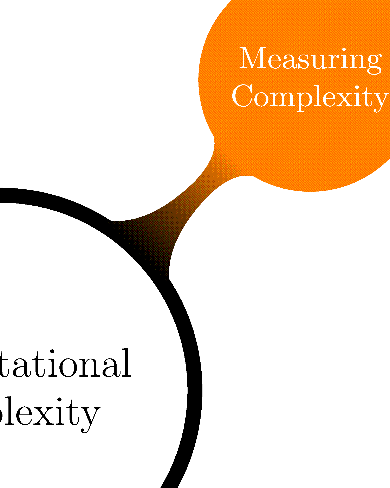

  * [mind_clip+mindmap.tex](https://github.com/walmes/Tikz/blob/master/src/mind_clip+mindmap.pgf)

```tex
\documentclass{standalone}
\usepackage{tikz}
\usetikzlibrary{mindmap}

\begin{document}

\begin{tikzpicture}[
  mindmap,
  every node/.style={concept, execute at begin node=\hskip0pt},
  root concept/.append style={
    concept color=black, fill=white, line width=1ex, text=black
  },
  text=white, grow cyclic,
  level 1/.append style={level distance=4.5cm,sibling angle=90},
  level 2/.append style={level distance=3cm,sibling angle=45}
]
\clip (0,-1) rectangle ++(4,5);
\node [root concept] {Computational Complexity}
  child [concept color=red] { node {Computational Problems}
    child { node {Problem Measures} } 
  }
  child [concept color=blue] { node {Computational Models}
    child { node {Turing Machines} }
  }
  child [concept color=orange] { node {Measuring Complexity}
    child { node {Complexity Measures} }
  }
  child [concept color=green!50!black] { node {Solving Problems}
    child { node {Exact Algorithms} }
  };
\end{tikzpicture}

\end{document}
```
****


  * [mind_computer_science+mindmap.tex](https://github.com/walmes/Tikz/blob/master/src/mind_computer_science+mindmap.pgf)

```tex
% changed by ARR
% added margins and page size to fit picture full
% Author: Till Tantau
% Source: The PGF/TikZ manual
\documentclass{article}
\usepackage[paperheight=6in,paperwidth=7in,top=0.5in, bottom=0.5in, left=0.5in, right=0.5in]{geometry}
\pagestyle{empty}

\usepackage{tikz}
\usetikzlibrary{mindmap,trees}

\begin{document}

\begin{tikzpicture}
  \path[mindmap,concept color=black,text=white]
    node[concept] {Computer Science}
    [clockwise from=0]
    child[concept color=green!50!black] {
      node[concept] {practical}
      [clockwise from=90]
      child { node[concept] {algorithms} }
      child { node[concept] {data structures} }
      child { node[concept] {pro\-gramming languages} }
      child { node[concept] {software engineer\-ing} }
    }  
    child[concept color=blue] {
      node[concept] {applied}
      [clockwise from=-30]
      child { node[concept] {databases} }
      child { node[concept] {WWW} }
    }
    child[concept color=red] { node[concept] {technical} }
    child[concept color=orange] { node[concept] {theoretical} };
\end{tikzpicture}
\end{document}
```
****


  * [mind_connecting_concepts+mindmap.tex](https://github.com/walmes/Tikz/blob/master/src/mind_connecting_concepts+mindmap.pgf)

```tex

\documentclass[tikz,border=10pt]{standalone}
%\documentclass[crop, tikz]{standalone}

\usepackage{tikz}
% needed for Mindmap
\usetikzlibrary{mindmap}

\pgfdeclarelayer{background}
\pgfsetlayers{background,main}

\begin{document}
	

\begin{tikzpicture}
	[root concept/.append style={concept color=blue!20,minimum size=2cm},
	level 1 concept/.append style={sibling angle=45},
	mindmap]
	\node [concept] {Root concept}
	[clockwise from=45]
	child { node[concept] (c1) {child}}
	child { node[concept] (c2) {child}}
	child { node[concept] (c3) {child}};
	\begin{pgfonlayer}{background}
	\draw [concept connection] (c1) edge (c2)
	edge (c3)
	(c2) edge (c3);
	\end{pgfonlayer}
\end{tikzpicture}

	
\end{document}
```
****


  * [mind_fixed+mindmap.tex](https://github.com/walmes/Tikz/blob/master/src/mind_fixed+mindmap.pgf)

```tex
% https://tex.stackexchange.com/a/153942/173708
\documentclass[article, 12pt, oneside]{memoir}

\usepackage[a2paper]{geometry}
\usepackage{tikz}
\usetikzlibrary{mindmap}
\pagestyle{empty}
\begin{document}
\begin{tikzpicture}[
    mindmap,
    grow cyclic, text width=4cm, align=flush center,
    every node/.style={concept},
    concept color=orange!40,
    level 1/.style={level distance=10cm,sibling angle=90},
    level 2/.style={level distance=6cm,sibling angle=45}]

\node [root concept] {ShareLaTeX Tutorial Videos}
   child [concept color=blue!30] { node {Beginners Series}
        child { node {First Document}}
        child { node {Sections and Paragraphs}}
        child { node {Mathematics}}
        child { node {Images}}
        child { node {bibliography}}
        child { node {Tables and Matrices}}
        child { node {Longer Documents}}
    }
    child [concept color=yellow!30] { node {Thesis Series}
        child { node {Basic Structure}}
        child { node {Page Layout}}
        child { node {Figures, Subfigures and Tables}}
        child { node {Biblatex}}
        child { node {Title Page}}
    }
    child [concept color=teal!40]  { node {Beamer Series}
        child { node {Getting Started}}
        child { node {Text, Pictures and Tables}}
        child { node {Blocks, Code and Hyperlinks}}
        child { node {Overlay Specifications}}
        child { node {Themes and Handouts}}
    }
    child [concept color=purple!50] { node {TikZ Series}
        child { node {Basic Drawing}}
        child { node {Geogebra}}
        child { node {Flow Charts}}
        child { node {Circuit Diagrams}}
        child [concept color=green!40]  { node {Mind Maps}}
    };
\end{tikzpicture}
\end{document}
```
****


  * [mind_hyperlinks+mindmap.tex](https://github.com/walmes/Tikz/blob/master/src/mind_hyperlinks+mindmap.pgf)

```tex
\documentclass{article}
\usepackage[paperheight=7in,paperwidth=7in, 
					top=0.5in, 
					bottom=0.5in, 
					left=0.5in, 
					right=0.5in]{geometry}
					
\usepackage[hidelinks]{hyperref}

\usepackage{tikz}
\usetikzlibrary{mindmap}

\begin{document}
\pagestyle{empty}

\begin{tikzpicture}
  \path[mindmap,concept color=black,text=white]
    node[concept] {Computer Science}
    [clockwise from=0]
    child[concept color=green!50!black] {
      node[concept] {\hyperlink{pract}{practical}}
      [clockwise from=90]
      child { node[concept] {algorithms} }
      child { node[concept] {data structures} }
      child { node[concept] {pro\-gramming languages} }
      child { node[concept] {software engineer\-ing} }
    }  
    child[concept color=blue] {
      node[concept] {applied}
      [clockwise from=-30]
      child { node[concept] {\hyperlink{datab}{databases}} }
      child { node[concept] {WWW} }
    }
    child[concept color=red] { node[concept] {technical} }
    child[concept color=orange] { node[concept] {theoretical} 
    };
\end{tikzpicture}
%\newpage
\begin{itemize}
\item \hypertarget{pract}{Practical}: here is some description.
\item \hypertarget{datab}{Databases}: here is some description.
\end{itemize}
\end{document}
```
****

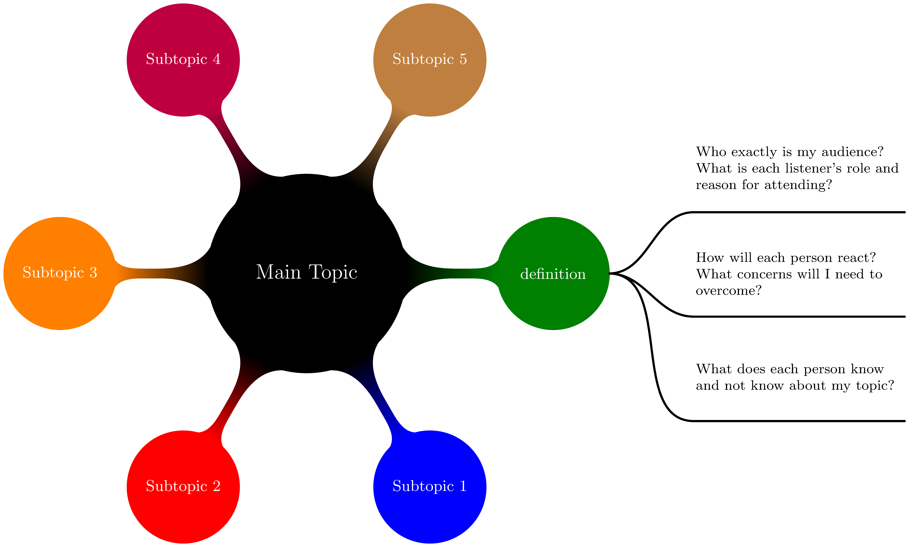

  * [mind_long_text_boxes-fixed+mindmap.tex](https://github.com/walmes/Tikz/blob/master/src/mind_long_text_boxes-fixed+mindmap.pgf)

```tex
% https://tex.stackexchange.com/a/88174/173708
\documentclass[tikz, border=2pt]{standalone}
\usetikzlibrary{mindmap,trees,positioning}
\makeatletter
\tikzset{
    non-concept/.style={
        rectangle,
        text width=12em,
        text=black,
        align=left,
    },
    cncc east/.style={
        edge from parent path={
            (\tikzparentnode.east) to[out=0, in=180] (\tikzchildnode.south west)
            -- (\tikzchildnode.south east)
        }
    }
}
\makeatother
\begin{document}
\pagestyle{empty}
\begin{tikzpicture}
  \path[mindmap, concept color=black, text=white]
    node[concept] {Main Topic}[clockwise from=0]% named \___/ node
    child[concept color=green!50!black] {
        node[concept] (def) {definition}
        [
            grow=right,
            sibling distance=14ex,
        ]
            child[level distance=5cm] 
            	{ node[non-concept] 
            		{What does each person know and not know about my topic?}                            
            	edge from parent[cncc east] }
		child[level distance=5cm] 
			{ node[non-concept] 
				{How will each person react? What concerns will I need to overcome?}                 
			edge from parent[cncc east] }
		child[level distance=5cm] 
			{ node[non-concept] 
				{Who exactly is my audience? What is each listener's role and reason for attending?} 
			edge from parent[cncc east] }
        }
    child[concept color=blue]           { node[concept]       {Subtopic 1} }
    child[concept color=red]            { node[concept]       {Subtopic 2} }
    child[concept color=orange]         { node[concept]       {Subtopic 3} }
    child[concept color=purple]         { node[concept]       {Subtopic 4} }
    child[concept color=brown]          { node[concept]       {Subtopic 5} };
\end{tikzpicture}
\end{document}
```
****

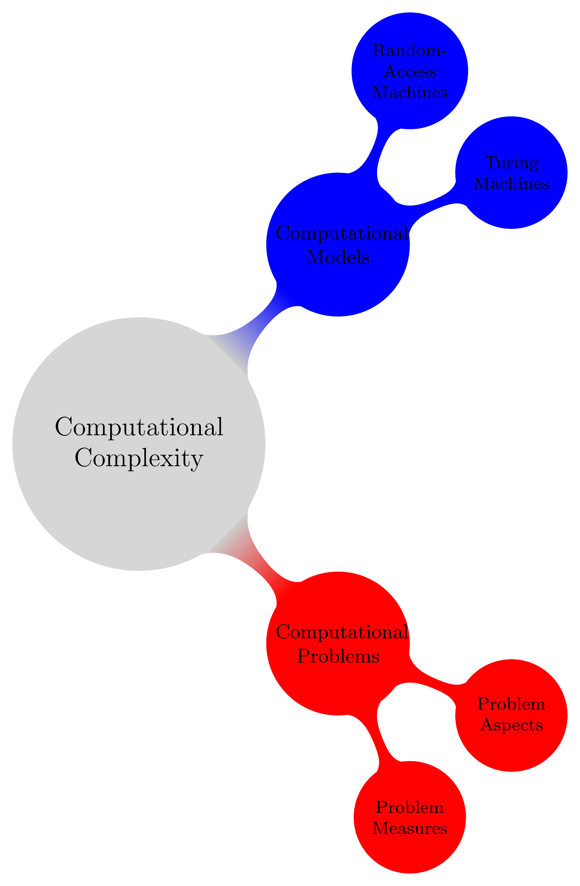

  * [mind_optional_argument+mindmap.tex](https://github.com/walmes/Tikz/blob/master/src/mind_optional_argument+mindmap.pgf)

```tex
\documentclass[margin=2mm]{standalone}

\usepackage{tikz}
\usetikzlibrary{mindmap}

\begin{document}
\begin{tikzpicture}[
    mindmap,
    every node/.style=concept,
    concept color=black!20,
    grow cyclic,
    level 1/.append style={level distance=4.5cm,sibling angle=90},
    level 2/.append style={level distance=3cm,sibling angle=45}
    ]
  \node [root concept] {Computational Complexity} % root
    child [concept color=red] { node {Computational Problems}
      child { node {Problem Measures} } 
      child { node {Problem Aspects} }
    }
    child [concept color=blue] { node {Computational Models}
      child { node {Turing Machines} }
      child { node {Random-Access Machines} }
    };
\end{tikzpicture}
\end{document}
```
****


  * [mind_scientific_interactions+mindmap.tex](https://github.com/walmes/Tikz/blob/master/src/mind_scientific_interactions+mindmap.pgf)

```tex
%%%%%%%%%%%%%%%%%%%%%%%%%%%%%%%%%%%%%%%%%%%%%%%%%%%%%%%%%%%%%%%%%%%%%%%%
% Author  : Andrei Sobolevski (April 2009)
% License : Creative Commons attribution license
% Title   : Map of scientific interactions of researchers 
%           affiliated in 2008 to the J.-V. Poncelet laboratory 
%           (UMI 2615 CNRS, http://www.poncelet.ru)
% Notes   : Produced for the 2008 annual report of the lab;
%           layout of subnodes is a result of manual optimization
% Tags    : mindmap, layers
% Submitted to TeXample.net on 16 January 2010

\documentclass{article}
\usepackage{tikz,times}
%\usepackage[paperwidth=25cm,paperheight=22cm,left=1cm,top=1cm]{geometry} % prevent print PDF and png in page 1
\usepackage{geometry}
\usetikzlibrary{mindmap,backgrounds}

%\pagestyle{empty}

\begin{document}
\centering\begin{tikzpicture}[mindmap,
  level 1 concept/.append style={level distance=130,sibling angle=30},
  extra concept/.append style={color=blue!50,text=black}]

  % Applied area: computer science and its subfields

  \begin{scope}[mindmap, concept color=orange, text=white]
    \node [concept] {Informatique}[clockwise from=-5] 
      child {node [concept] (log) {M{\'e}thodes cat{\'e}goriques}}
      child {node [concept] (alg) {Algorithmique}}
      child {node [concept] (cod) {Compression \& transmission}}
      child {node [concept] (img) {Tra{\^i}tement des images}}
      child {node [concept] (opt) {Optimisation}}
      child {node [concept] (res) {R{\'e}seaux}};
  \end{scope}

  % Applied area: theoretical physics and its subfields

  \begin{scope}[mindmap, concept color=red,text=white]
    \node [concept] at (-5,-15) {Physique}
      child [grow=-10, level distance=160]
        {node [concept] (qin) {Calcul quantique}}
      child [grow=20] 
        {node [concept] (csm) {Astronomie \& cosmologie}}
      child [grow=110] 
        {node [concept] (mat) {Mati{\`e}re condens{\'e}e}};
  \end{scope}

  % Applied area: biology and its subfields

  \begin{scope}[mindmap, concept color=green!50!black,text=white]
    \node [concept] at (6.5,-15) {Biologie} 
      child [grow=165, level distance=120] 
        {node [concept] (med) {M{\'e}decine}}
      child [grow=60] 
        {node [concept] (gen) {G{\'e}nomique}};
  \end{scope}

  % Applied area: economics (one subfield)

  \begin{scope}[mindmap, concept color=violet, text=white]
    \node [concept] at (11,-14) {{\'E}conomie}
      child [grow=70, level distance=120] 
        {node [concept] (dec) {Choix \& prise de d{\'e}cision}};
  \end{scope}

  % Researchers listed by their main specialization in mathematics

  \begin{scope}[mindmap, concept color=blue]

    % Combinatorics and discrete mathematics 
    \node [concept, text=white] at (5.2,-10.8) 
      {Combinatoire \& math{\'e}matiques discr{\`e}tes} 
      [clockwise from=150]
      child [concept color=blue!50] {node [concept] (ver) {Vereschagin}}
      child [concept color=blue!50, level distance=125] 
        {node [concept] (kab) {Kabatyanski, Tsfasman, Rybakov, Zykin}}
      child [concept color=blue!50] 
        {node [concept] (kch) {Kucherov, Roytberg}}
      child [concept color=blue!50] {node [concept] (raf) {Raffinot}}
      child [concept color=blue!50, level distance=135]
        {node [concept] (ksh) {Koshevoy}};

    % Partial differential equations
    \node [concept, text=white] at (-3,-11) 
      {Equations aux d{\'e}riv{\'e}es partielles 
        \& m{\'e}thodes num{\'e}riques}
      child [concept color=blue!50, grow=0, level distance=140] 
        {node [concept] (lhc) {Loh{\'e}ac}}
      child [concept color=blue!50, grow=60, level distance=115] 
        {node [concept] (otr) {OTARIE (Sobolevski)}}
      child [concept color=blue!50, grow=95] {node [concept] (ndr) 
        {Nadirashvili}};

    % Probability
    \node [concept, text=white] at (-7.2,-3.2) {Probabilit{\'e}s}
      child [concept color=blue!50, grow=-70, level distance=120] 
        {node [concept] (rbk) {Rybko}};

    % Logic
    \node [concept, text=white] at (11.5,-5) {Logique}
      child [concept color=blue!50, grow=165, level distance=120] 
        {node [concept] (sht) {Shehtman}};
  \end{scope}

  % Connections of researchers to applied subfields

  \begin{pgfonlayer}{background}
    \draw [circle connection bar]
      (kab) edge (cod)
      (kch) edge (alg) edge (gen)
      (lhc) edge (med)
      (ksh) edge (dec)
      (ndr) edge (mat)
      (otr) edge (opt) edge (csm) edge (img)
      (raf) edge (alg) edge (gen)
      (rbk) edge (res) edge (mat)
      (sht) edge (log) edge (dec)
      (ver) edge (qin) edge (cod);
  \end{pgfonlayer}
\end{tikzpicture}

\end{document}
```
****

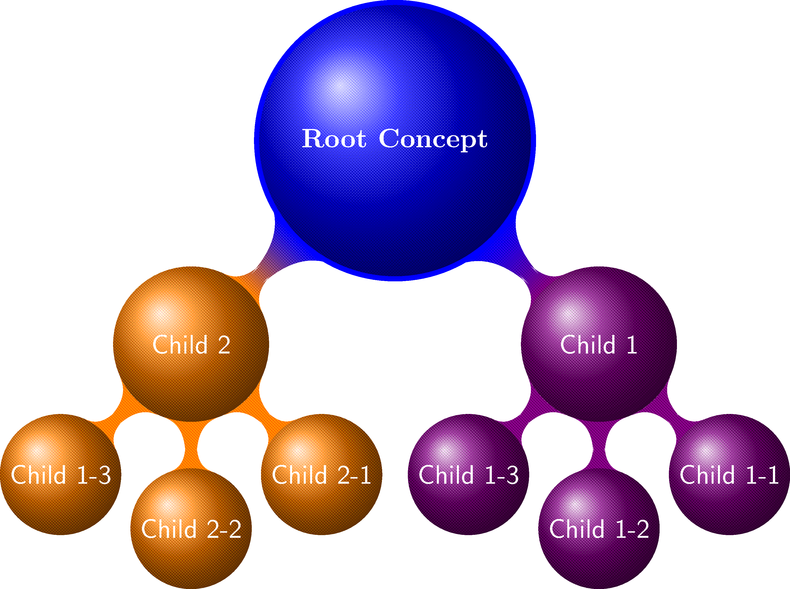

  * [mind_shaded+mindmap.tex](https://github.com/walmes/Tikz/blob/master/src/mind_shaded+mindmap.pgf)

```tex
% https://tex.stackexchange.com/questions/58249/how-to-shade-mindmap-concepts?rq=1
\documentclass[a4paper,11pt]{standalone}
\usepackage{tikz}
\usetikzlibrary{mindmap}

\tikzset{level 1 concept/.append style={font=\sf, sibling angle=90,level distance = 25mm}}
\tikzset{level 2 concept/.append style={font=\sf, sibling angle=45,level distance = 16mm}}
\tikzset{level 3 concept/.append style={font=\sf, sibling angle=45,level distance = 17mm}}
\tikzset{every node/.append style={scale=0.6}}

\begin{document}
\begin{tikzpicture}[mindmap, concept color=blue, font=\sf\bf, text=white]
\node[concept,ball color=blue]{Root Concept}[clockwise from=315]
 child [concept color=violet] {node[circle,ball color=violet] (c1){Child 1}                                
      child  {node [circle,ball color=violet](c11){Child 1-1}}
      child  {node [circle,ball color=violet](c12){Child 1-2}}
      child  {node [circle,ball color=violet](c13){Child 1-3}}                                                   
 }
 child [concept color=orange]{node [circle,ball color=orange](c2){Child 2}
     child {node [circle,ball color=orange](c21){Child 2-1}}
     child {node [circle,ball color=orange](c22){Child 2-2}}
     child {node [circle,ball color=orange](c22){Child 1-3}}
 };
\end{tikzpicture}
\end{document}
```
****

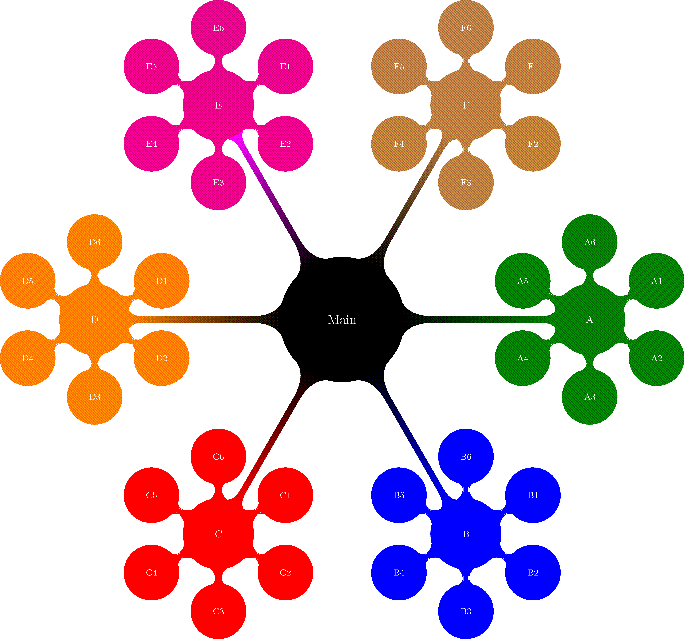

  * [mind_specific_distance+mindmap.tex](https://github.com/walmes/Tikz/blob/master/src/mind_specific_distance+mindmap.pgf)

```tex
% https://tex.stackexchange.com/questions/119625/mindmap-level-specific-child-distance?rq=1
\documentclass{standalone}
\usepackage{tikz}
\usetikzlibrary{mindmap,trees}

\begin{document}
\resizebox{!}{4 in}{%
   \begin{tikzpicture}
      \path[
         mindmap,
         concept color=black,
         text=white,
         grow cyclic,
         segment length=20cm,
level 1/.append style={level distance=8cm,sibling angle=60},
level 2/.append style={level distance=2.5cm},
      ]
      node[concept] {Main}
      [clockwise from=0]
      child[concept color=green!50!black] {%
         node[concept] {A}
         [clockwise from=30]
         child {node[concept] {A1} }
         child {node[concept] {A2} }
         child {node[concept] {A3} }
         child {node[concept] {A4} }
         child {node[concept] {A5} }
         child {node[concept] {A6} }
      }  
      child[concept color=blue] {%
         node[concept] {B}
         [clockwise from=30]
         child {node[concept] {B1} }
         child {node[concept] {B2} }
         child {node[concept] {B3} }
         child {node[concept] {B4} }
         child {node[concept] {B5} }
         child {node[concept] {B6} }
      }
      child[concept color=red] {%
         node[concept] {C}
         [clockwise from=30]
         child {node[concept] {C1} }
         child {node[concept] {C2} }
         child {node[concept] {C3} }
         child {node[concept] {C4} }
         child {node[concept] {C5} }
         child {node[concept] {C6} }
      }
      child[concept color=orange] {%
         node[concept] {D}
         [clockwise from=30]
         child {node[concept] {D1} }
         child {node[concept] {D2} }
         child {node[concept] {D3} }
         child {node[concept] {D4} }
         child {node[concept] {D5} }
         child {node[concept] {D6} }
      }
      child[concept color=magenta] {%
         node[concept] {E}
         [clockwise from=30]
         child {node[concept] {E1} }
         child {node[concept] {E2} }
         child {node[concept] {E3} }
         child {node[concept] {E4} }
         child {node[concept] {E5} }
         child {node[concept] {E6} }
      }
      child[concept color=brown] {%
         node[concept] {F}
         [clockwise from=30]
         child {node[concept] {F1} }
         child {node[concept] {F2} }
         child {node[concept] {F3} }
         child {node[concept] {F4} }
         child {node[concept] {F5} }
         child {node[concept] {F6} }
      };
   \end{tikzpicture}
}
\end{document}
```
****


  * [mind_thicker_connectors+mindmap.tex](https://github.com/walmes/Tikz/blob/master/src/mind_thicker_connectors+mindmap.pgf)

```tex
\documentclass[tikz, preview=true, border=2mm]{standalone}

\renewcommand*\familydefault{\sfdefault}

\usepackage{tikz}
\usetikzlibrary{mindmap,trees,shadows}

\begin{document}

\begin{tikzpicture}
[decoration={start radius=1cm, end radius=.5cm,amplitude=3mm,angle=30}]

% Define experience colors
\colorlet{afcolor}{blue!50}
\colorlet{mdcolor}{red!75}
\colorlet{nmndcolor}{orange!80}
\colorlet{nmescolor}{teal!70!green}
\colorlet{citscolor}{violet!75}

\begin{scope}[mindmap,
every node/.style={concept, circular drop shadow, minimum size=0pt,execute at begin node=\hskip0pt, font=\bfseries},
root concept/.append style={
    concept color=black, fill=white, line width=1.5ex, text=black, font=\huge\scshape\bfseries,},
level 1 concept/.append style={font=\bfseries},
text=white,
partner/.style={concept color=blue!80!black},
air force/.style={concept color=afcolor},
metadata/.style={concept color=mdcolor},
nmnd/.style={concept color=nmndcolor},
nmes/.style={concept color=nmescolor},
cits/.style={concept color=citscolor},
grow cyclic,
level 1/.append style={level distance=6.2cm,sibling angle=45},
level 2/.append style={level distance=3cm,sibling angle=45}]
\node [root concept] (team) {Team\\Foo}[rotate=202.5] % root
    child [partner] { node {Comp 8}
        child [nmes] { node {\small NM/ES} }
    }
    child [partner] { node {Comp 1}
        child [metadata] { node {\small Metadata} }
        child [air force] { node {\small Air Force} }
        child [nmnd] { node {\small NM/ND} }
        child [cits] { node {\small CITS} }
        child [nmes] { node {\small NM/ES} }
    }
    child [partner] { node {Comp 2}
        child [metadata] { node {\small Metadata} }
    }
    child [partner] { node (comp3) {Comp 3}
        child [air force] { node {\small Air Force} }
        child [nmnd] { node {\small NM/ND} }
        child [cits] { node (leftmost) {\small CITS} }
        child [nmes] { node {\small NM/ES} }
    }
    child [partner] { node {Comp 4}
        child [air force] { node {\small Air Force} }
        child [nmes] { node {\small NM/ES} }
    }
    child [partner] { node {Comp 5}
        child [metadata] { node {\small Metadata} }
        child [nmnd] { node {\small NM/ND} }
        child [nmes] { node {\small NM/ES} }
    }
    child [partner] { node {Comp 6}
        child [air force] { node {\small Air Force} }
        child [nmnd] { node {\small NM/ND} }
        child [nmes] { node {\small NM/ES} }
    }
    child [partner] { node {Comp 7}
        child [air force] { node {\small Air Force} }
        child [nmnd] { node {\small NM/ND} }
        child [nmes] { node {\small NM/ES} }
    };
\end{scope}

\begin{scope}[xshift=-4.5cm, yshift=-10.5cm,every node/.style={align=left,text=black}]
\matrix[row sep=0pt,column sep=1mm, align=left, nodes={align=left, anchor=west}] {
    \fill [afcolor] (0,.25ex) circle (1ex); & \node{Air Force Experience};\\
    \fill [mdcolor] (0,.25ex) circle (1ex); & \node{Metadata Environments Development Experience};\\
    \fill [nmndcolor] (0,.25ex) circle (1ex); & \node{Network Management and Network Defense Experience};\\
    \fill [nmescolor] (0,.25ex) circle (1ex); & \node{Network Management and Enterprise Services Experience};\\
    \fill [citscolor] (0,.25ex) circle (1ex); & \node{CITS Information Transport Systems Experience};\\
    };
\end{scope}
\end{tikzpicture}

\end{document}
```
****

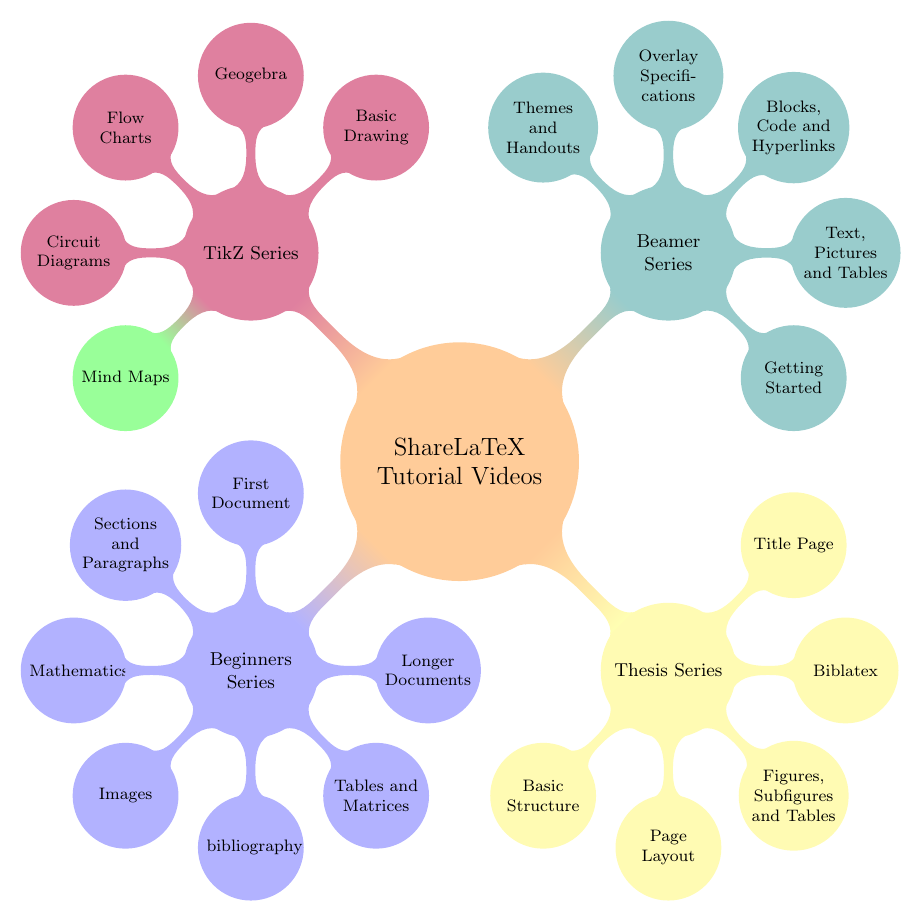

  * [mind_tutorials_videos+mindmap.tex](https://github.com/walmes/Tikz/blob/master/src/mind_tutorials_videos+mindmap.pgf)

```tex

\documentclass[tikz,border=10pt]{standalone}
%\documentclass[crop, tikz]{standalone}

\usepackage{tikz}

\begin{document}
	
%https://www.overleaf.com/learn/latex/LaTeX_Graphics_using_TikZ:_A_Tutorial_for_Beginners_(Part_5)%E2%80%94Creating_Mind_Maps
\usetikzlibrary{mindmap}
\begin{tikzpicture}[mindmap, grow cyclic, every node/.style=concept, concept color=orange!40, 
level 1/.append style={level distance=5cm,sibling angle=90},
level 2/.append style={level distance=3cm,sibling angle=45},]
\node{ShareLaTeX Tutorial Videos}
child [concept color=blue!30] { node {Beginners Series}
	child { node {First Document}}
	child { node {Sections and Paragraphs}}
	child { node {Mathematics}}
	child { node {Images}}
	child { node {bibliography}}
	child { node {Tables and Matrices}}
	child { node {Longer Documents}}
}
child [concept color=yellow!30] { node {Thesis Series}
	child { node {Basic Structure}}
	child { node {Page Layout}}
	child { node {Figures, Subfigures and Tables}}
	child { node {Biblatex}}
	child { node {Title Page}}
}
child [concept color=teal!40] { node {Beamer Series}
	child { node {Getting Started}}
	child { node {Text, Pictures and Tables}}
	child { node {Blocks, Code and Hyperlinks}}
	child { node {Overlay Specifications}}
	child { node {Themes and Handouts}}
}
child [concept color=purple!50]{ node {TikZ Series}
	child { node {Basic Drawing}}
	child { node {Geogebra}}
	child { node {Flow Charts}}
	child { node {Circuit Diagrams}}
	child [concept color=green!40] { node {Mind Maps}}
};
\end{tikzpicture}
	
\end{document}
```
****

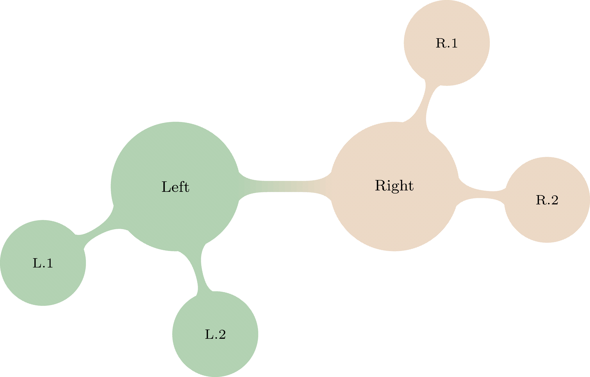

  * [mind_two_connected_roots+mindmap.tex](https://github.com/walmes/Tikz/blob/master/src/mind_two_connected_roots+mindmap.pgf)

```tex
% https://tex.stackexchange.com/questions/144826/how-do-i-create-a-tikz-mindmap-that-has-two-connected-roots
\documentclass[landscape]{standalone}
\usepackage{tikz}
\usetikzlibrary{mindmap}
\pagestyle{empty}
\begin{document}
\begin{tikzpicture}[small mindmap, outer sep=0pt, text=black]

\begin{scope}[concept color=brown!30]
\node (right) at (2,0) [concept] {Right}
  [clockwise from=70]
  child { node[concept] {R.1} }
  child { node[concept] {R.2} }
;
\end{scope}

\begin{scope}[concept color=green!40!black!30]
\node (left) at (-2,0) [concept] {Left}
  [counterclockwise from=210]
  child { node[concept] {L.1}  }
  child { node[concept] {L.2} }
;
\end{scope}

\path (left) to[circle connection bar switch color=from (green!40!black!30) to (brown!30)] (right) ;

\end{tikzpicture}
\end{document}
```
****


  * [multiline-flowchart.tex](https://github.com/walmes/Tikz/blob/master/src/multiline-flowchart.pgf)

```tex
% https://tex.stackexchange.com/questions/149602/drawing-flow-diagram-in-latex-using-tikz
\documentclass[border=10pt]{standalone}
\usepackage{tikz}
\usetikzlibrary{arrows,positioning,shapes.geometric}

\begin{document}
    \begin{tikzpicture}[>=latex']
        \tikzset{block/.style= {draw, rectangle, align=center,minimum width=2cm,minimum height=1cm},
        rblock/.style={draw, shape=rectangle,rounded corners=1.5em,align=center,minimum width=2cm,minimum height=1cm},
        input/.style={ % requires library shapes.geometric
        draw,
        trapezium,
        trapezium left angle=60,
        trapezium right angle=120,
        minimum width=2cm,
        align=center,
        minimum height=1cm
    },
        }
        \node [rblock]  (start) {Start};
        \node [block, right =2cm of start] (acquire) {Acquire Image};
        \node [block, right =2cm of acquire] (rgb2gray) {RGB to Gray};
        \node [block, right =2cm of rgb2gray] (otsu) {Localized OTSU \\ Thresholding};
        \node [block, below right =2cm and -0.5cm of start] (gchannel) {Subtract the \\ Green Channel};
        \node [block, right =2cm of gchannel] (closing) {Morphological \\ Closing};
        \node [block, right =2cm of closing] (NN) {Sign Detection \\ Using NN};
        \node [input, right =2cm of NN] (limit) {Speed \\ Limit};
        \node [coordinate, below right =1cm and 1cm of otsu] (right) {};  %% Coordinate on right and middle
        \node [coordinate,above left =1cm and 1cm of gchannel] (left) {};  %% Coordinate on left and middle

%% paths
        \path[draw,->] (start) edge (acquire)
                    (acquire) edge (rgb2gray)
                    (rgb2gray) edge (otsu)
                    (otsu.east) -| (right) -- (left) |- (gchannel)
                    (gchannel) edge (closing)
                    (closing) edge (NN)
                    (NN) edge (limit)
                    ;
    \end{tikzpicture}
\end{document}
```
****


  * [multiple_block_connections-101+diagram.tex](https://github.com/walmes/Tikz/blob/master/src/multiple_block_connections-101+diagram.pgf)

```tex
% https://tex.stackexchange.com/a/37310/173708
\documentclass[12pt,a4paper]{article}
%\documentclass[border=2pt]{standalone}
\usepackage{tikz}
\usetikzlibrary{calc}

%%%<
\usepackage{verbatim}
\usepackage[active,tightpage]{preview}
\PreviewEnvironment{tikzpicture}
\setlength\PreviewBorder{5pt}%
%%%>

\begin{document}
\begin{figure}
\begin{center}
\begin{tikzpicture}[>=stealth]
  %coordinates
  \coordinate (orig)   at (0,0);
  \coordinate (LLD)    at (4,0);
  \coordinate (AroneA) at (-1/2,11/2);
  \coordinate (ArtwoA) at (-1/2,5);
  \coordinate (ArthrA) at (-1/2,9/2);
  \coordinate (LLA)    at (1,4);
  \coordinate (LLB)    at (4,4);
  \coordinate (LLC)    at (7,4);
  \coordinate (AroneC) at (25/2,11/2);
  \coordinate (ArtwoC) at (25/2,5);
  \coordinate (ArthrC) at (25/2,9/2);
  \coordinate (conCBD) at (21/2,9/2);
  \coordinate (conCB)  at (21/2,7/2);
  \coordinate (coCBD)  at (11,5);
  \coordinate (coCB)   at (11,3);
  \coordinate (conCBA) at (23/2,11/2);
  \coordinate (conCA)  at (23/2,5/2);

  %nodes
  \node[draw, minimum width=2cm, minimum height=2cm, anchor=south west, text width=2cm, align=center] (A) at (LLA) {Impedance\\control};
  \node[draw, minimum width=2cm, minimum height=2cm, anchor=south west, text width=2cm, align=center] (B) at (LLB) {Inverse\\Dynamics};
  \node[draw, minimum width=3cm, minimum height=2cm, anchor=south west, text width=2cm, align=center] (C) at (LLC) {Manipulator\\and\\environment};
  \node[draw, minimum width=2cm, minimum height=2cm, anchor=south west, text width=2cm, align=center] (D) at (LLD) {Direct\\kinematics};

  %edges
  \draw[->] (AroneA) -- node[above]{$p_d, R_d$} ($(A.180) + (0,1/2)$);
  \draw[->] (ArtwoA) -- node[above]{$v_d$} (A.180);
  \draw[->] (ArthrA) -- node[above]{$v_d$} ($(A.180) + (0,-1/2)$);

  \draw[->] (A.0) -- node[above] {$\alpha$} (B.180);
  \draw[->] (B.0) -- node[above] {$\tau$} (C.180);

  \draw[->] ($(C.0) + (0,1/2)$) -- node[above, pos=0.2]{$h_e$} (AroneC);
  \draw[->] (C.0) -- node[above, pos=0.2]{$q$} (ArtwoC);
  \draw[->] ($(C.0) + (0,-1/2)$) -- node[above, pos=0.2]{$q$} (ArthrC);

  \path[fill] (conCBD) circle[radius=1pt] (conCB) circle[radius=1pt];
  \path[draw,->] (conCBD) -- (conCB) -| ($(B.270) + (1/2,0)$);

  \path[fill] (coCBD) circle[radius=1pt] (coCB) circle[radius=1pt];
  \path[draw,->] (coCBD)  -- (coCB) -| (B.270);

  \path[fill] (conCBA) circle[radius=1pt] (conCA) circle[radius=1pt];
  \path[draw,->] (conCBA) -- (conCA) -| ($(B.270) + (-1/2,0)$);

  \path[draw,->] (conCB) |- ($(D.0) + (0,1/2)$);
  \path[draw,->] (coCB)  |- ($(D.0) + (0,-1/2)$);

  \path[draw,->] (conCA) |- ($(A.270) + (-1/2,0) + (0,-9/2)$) -- ($(A.270) + (-1/2,0)$);

  \path[draw,->] ($(D.180) + (0,1/2)$)  -| node[above,pos=0.2] {$p_e,r_e$} ($(A.270) + (1/2,0)$);
  \path[draw,->] ($(D.180) + (0,-1/2)$) -| node[above,pos=0.15] {$v_e$} (A.270);

\end{tikzpicture}

\end{center}

\end{figure}
\end{document}
```
****

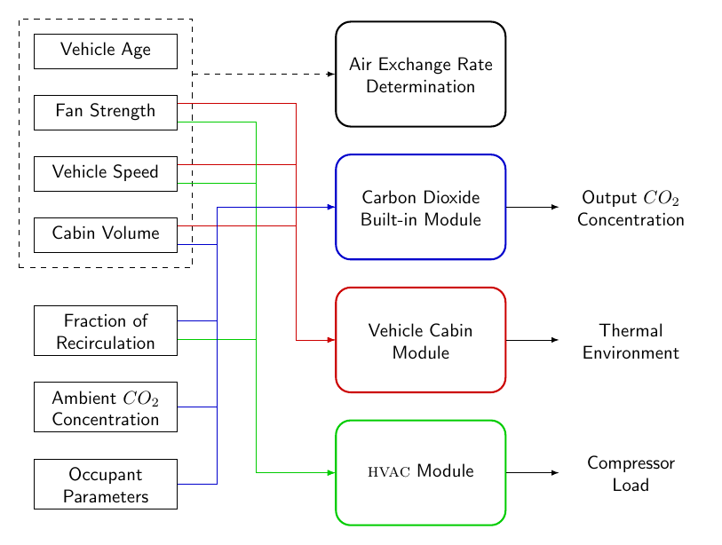

  * [multiple_blocks_interconnection+diagram.tex](https://github.com/walmes/Tikz/blob/master/src/multiple_blocks_interconnection+diagram.pgf)

```tex
% https://tex.stackexchange.com/questions/215207/looking-to-draw-this-block-diagram-in-tikz
\documentclass[border=10pt]{standalone}
\usepackage{tikz}
\usetikzlibrary{positioning,fit,calc}

\colorlet{mygreen}{green!80!black}
\colorlet{myblue}{blue!80!black}
\colorlet{myred}{red!80!black}

\begin{document}

\begin{tikzpicture}[
std/.style={
  draw,
  text width=2.5cm,
  align=center,
  font=\strut\sffamily
  },
rnd/.style={
  draw=#1,
  rounded corners=8pt,
  line width=1pt,
  align=center,
  text width=3cm,
  minimum height=2cm,
  font=\strut\sffamily
  },
vac/.style={
  text width=2.5cm,
  align=center,
  font=\strut\sffamily
  },
ar/.style={
  ->,
  >=latex
  },
node distance=0.5cm and 3cm    
]
%The nodes for the left
\node[std] (va)
  {Vehicle Age};
\node[std,below=of va] (fs)
  {Fan Strength};
\node[std,below=of fs] (vs)
  {Vehicle Speed};
\node[std,below=of vs] (cv)
  {Cabin Volume};
\node[std,below= 1cm of cv] (fr)
  {Fraction of Recirculation};
\node[std,below=of fr] (ac)
  {Ambient $CO_{2}$ Concentration};
\node[std,below=of ac] (op)
  {Occupant Parameters};

%The nodes for the center
\node[rnd,right=of va,yshift=-12.5pt] (aer)
  {Air Exchange Rate Determination};
\node[rnd=myblue,below=of aer] (cdm)
  {Carbon Dioxide Built-in Module};
\node[rnd=myred,below=of cdm] (vcm)
  {Vehicle Cabin Module};
\node[rnd=mygreen,below=of vcm] (hvac)
  {\textsc{hvac} Module};

%The nodes for the right
\node[vac,right=1cm of cdm] (occ)
  {Output $CO_{2}$ Concentration};
\node[vac,right=1cm of vcm] (the)
  {Thermal Environment};
\node[vac,right=1cm of hvac] (col)
  {Compressor Load};

%The dashed fitting node
\node[draw,dashed,inner sep=8pt,fit={(va) (cv)}]
  (fit) {};

% Some auxiliary coordinates for the arrows
\coordinate (aux1) at ( $ (va.east|-aer.west)!0.25!(aer.west) $ );
\coordinate (aux2) at ( $ (va.east|-aer.west)!0.50!(aer.west) $ );
\coordinate (aux3) at ( $ (va.east|-aer.west)!0.75!(aer.west) $ );

%The arrows from left to center
\draw[dashed,ar]
  (fit.east|-aer) -- (aer);  
\foreach \Nodo in {fs,vs,cv}
{
  \draw[ar,myred]
    ([yshift=5pt]\Nodo.east) -- ([yshift=5pt]aux3|-\Nodo.east) |- (vcm);  
}
\foreach \Nodo in {fs,vs,fr}
{
  \draw[ar,mygreen]
    ([yshift=-5pt]\Nodo.east) -- ([yshift=-5pt]aux2|-\Nodo.east) |- (hvac);  
}
\foreach \Nodo in {op,ac}
{
  \draw[ar,myblue]
    (\Nodo.east) -- (aux1|-\Nodo.east) |- (cdm);  
}
\draw[ar,myblue]
  ([yshift=5pt]fr.east) -- ([yshift=5pt]aux1|-fr.east) |- (cdm);  
\draw[myblue]
  ([yshift=-5pt]cv.east) -- ([yshift=-5pt]aux1|-cv.east);  

%The arrows from center to right
\foreach \Ori/\Dest in {cdm/occ,vcm/the,hvac/col}
{
  \draw[ar]
    (\Ori.east|-\Dest) -- (\Dest);  
}
\end{tikzpicture}

\end{document}
```
****


  * [nested+diagram.tex](https://github.com/walmes/Tikz/blob/master/src/nested+diagram.pgf)

```tex
% https://tex.stackexchange.com/questions/452323/tikz-nested-block-diagram-with-boxed-text-inside-other-blocks
\documentclass[border=3.14mm,tikz]{standalone}
\usepackage{tikz}

\usetikzlibrary{calc}
\usetikzlibrary{shapes.arrows}
\usetikzlibrary{positioning,fit,backgrounds}

\begin{document}
\begin{tikzpicture}[mynode/.style = {rectangle, draw, align=center,
            text width=4cm,fill=white,
            inner xsep=6mm, inner ysep=3mm, rounded corners},
            my arrow/.style={single arrow, draw,minimum height=1.1cm},
rotate border/.style={shape border uses incircle, shape border rotate=#1},
            font=\sffamily]
    \node[mynode, label={[name=lab]Camera \& Infrared Sensor}] (inner1) {Time Synchronization};
    \node[mynode, below=2mm of inner1] (justbelow1) {Resampling};
    %
    \node[right=1.5cm of inner1, mynode, label={[name=cal]Calibration \& alignment}] (inner2) {};
    \node[mynode, below=2mm of inner2] (justbelow2) {};
    \node[mynode, below=2mm of justbelow2] (justbelow2b) {};
    \node[mynode, below=2mm of justbelow2b] (justbelow2c) {};
    %
    \node[right=1.5cm of inner2, mynode, label={[name=img]Create obfuscated
    images}] (inner3) {};
    \node[mynode, below=2mm of inner3] (justbelow3) {};
    \node[mynode, below=2mm of justbelow3] (justbelow3b) {};
    \node[mynode, below=2mm of justbelow3b] (justbelow3c) {};
    %
    \node[right=1.5cm of inner3, mynode, label={[name=tech]Obfuscation
    techniques}] (inner4) {};
    \node[mynode, below=2mm of inner4] (justbelow4) {};
    \node[mynode, below=2mm of justbelow4] (justbelow4b) {};
    \node[mynode, below=2mm of justbelow4b] (justbelow4c) {};
    \begin{scope}[on background layer]
    \node[fit={(lab) (inner1) (justbelow4c.south-|inner1.south)}, draw,fill=red!20] (outer1) {};
    \node[fit={(cal) (inner2) (justbelow2c)}, draw,fill=red!20] (outer2) {};
    \node[fit={(img) (inner3) (justbelow3c)}, draw,fill=red!20] (outer3) {};
    \node[fit={(tech) (inner4) (justbelow4c)}, draw,fill=red!20] (outer4) {};
    \end{scope}
    \path (outer1) -- (outer2) node[pos=0.45,my arrow]{}
    (outer2) -- (outer3) node[pos=0.45,my arrow]{}
    (outer4) -- (outer3) node[pos=0.45,my arrow,shape border rotate=180]{};
    \end{tikzpicture}
\end{document}
```
****


  * [network-complex-networks-only-layer1.tex](https://github.com/walmes/Tikz/blob/master/src/network-complex-networks-only-layer1.pgf)

```tex
% from the manual, page 26

\documentclass[tikz,border=5]{standalone}
\usepackage{tikz-network}

\begin{document} 

\begin{tikzpicture}[multilayer=3d]
	\Vertices[layer=1]{data/ml_vertices.csv}
	\Edges[layer={1,1}]{data/ml_edges.csv}
\end{tikzpicture}

\end{document}
```
****


  * [network-complex-networks.tex](https://github.com/walmes/Tikz/blob/master/src/network-complex-networks.pgf)

```tex
% https://tex.stackexchange.com/a/295109/173708

\documentclass[tikz,border=5]{standalone}
\usepackage{tikz-network}   % file tikz-network.sty must be present

\begin{document} 

\begin{tikzpicture}[multilayer=3d]
	\Vertices{data/ml_vertices.csv}
	\Edges{data/ml_edges.csv}
\end{tikzpicture}

\end{document}
```
****


  * [network-ex_multilayer.lualatex.tex](https://github.com/walmes/Tikz/blob/master/src/network-ex_multilayer.lualatex.pgf)

```tex
%%%%%%%%%%%%%%%%%%%%%%%%%%%%%%%%%%%%%%%%%
%% use lualatex to compile the pdf !!! %%
%%%%%%%%%%%%%%%%%%%%%%%%%%%%%%%%%%%%%%%%%

%=============================================================================
% File:  ex_multilayer_01.tex --  tikz-network example
% Author(s): Jürgen Hackl <hackl@ibi.baug.ethz.ch>
% Creation:  20 Sep 2017
% Time-stamp: <Die 2018-06-12 07:45 juergen>
%
% Copyright (c) 2017 Jürgen Hackl <hackl@ibi.baug.ethz.ch>
%               http://www.ibi.ethz.ch
% $Id$
%
% More information on LaTeX: http://www.latex-project.org/
% LaTeX symbol list: 
%   http://www.ctan.org/tex-archive/info/symbols/comprehensive/symbols-a4.pdf
%=============================================================================

% https://github.com/hackl/tikz-network/blob/master/examples/multilayer/ex_multilayer_01.tex

\RequirePackage{luatex85}
\documentclass{standalone}

% Used packages
\usepackage{tikz-network}

\begin{document}

% Setting
\SetCoordinates[xAngle = -20]
\SetVertexStyle[MinSize = 4.5mm]
\SetLayerDistance{-5}
\SetPlaneWidth{10}
\SetPlaneHeight{10}
\begin{tikzpicture}[multilayer=3d]

	%%
	% Layer 2
	
	% Background
	\Plane[layer=2,color=orange,opacity=.6,image=./data/ex_multilayer_01_layer_02.pdf,ImageAndFill,grid=1cm,InBG]
	
	% Text
	\Text[x=1.2,y=-.1,layer=2,anchor=north west,style={scale=2.5}]{Layer $\beta$}
	
	% Vertices
	\Vertices[color=orange]{./data/ex_multilayer_01_vertices.csv}
	
	% Intra-layer edges in layer 2
	\Edges[color=black,layer={2,2}]{./data/ex_multilayer_01_edges.csv}
	\EdgesNotInBG
	
	% Inter-layer edges between layer 1 and 2
	\Edges[color=black,layer={1,2},style={dashed}]{./data/ex_multilayer_01_edges.csv}
	
	%%
	% Layer 1
	
	% Background
	\Plane[opacity=.6,image=./data/ex_multilayer_01_layer_01.pdf,ImageAndFill,grid=1cm]
	
	% Text
	\Text[x=1.2,y=-.1,layer=1,anchor=north west,style={scale=2.5}]{Layer $\alpha$}
	
	% Intra-layer edges in layer 1
	\Edges[color=black,layer={1,1}]{./data/ex_multilayer_01_edges.csv}
	
	% Vertices in layer 1
	\Vertices[layer=1]{./data/ex_multilayer_01_vertices.csv}


\end{tikzpicture}
\end{document}
%=============================================================================
% eof
%
% Local Variables:
% mode: latex
% mode: linum
% mode: auto-fill
% fill-column: 80
% TeX-master: t
% End:
```
****


  * [network-layers-and-layouts.tex](https://github.com/walmes/Tikz/blob/master/src/network-layers-and-layouts.pgf)

```tex
% manual, page 27
\documentclass[tikz,border=5]{standalone}
\usepackage{tikz-network}  % tikz-network.sty file must be present

\begin{document} 
\begin{tikzpicture}[multilayer=3d]
    \begin{Layer}[layer=1]
        \draw[very thick] (-.5,-.5) rectangle (2.5,2);
        \node at (-.5,-.5)[below right]{Layer 1};
    \end{Layer}
	\Vertices[layer=1]{data/ml_vertices.csv}
	\Edges[layer={1,1}]{data/ml_edges.csv}
\end{tikzpicture}

\end{document}
```
****


  * [network-multilayer.tex](https://github.com/walmes/Tikz/blob/master/src/network-multilayer.pgf)

```tex
% from manual https://www.researchgate.net/profile/Juergen_Hackl/publication/319894904_TikZ-network_manual/links/59cb46e2a6fdcc451d5c91ff/TikZ-network-manual.pdf?origin=publication_detail

\documentclass[tikz,border=5]{standalone}
\usepackage{tikz-network}     % tikz-network.sty file must be present

\begin{document} 
\begin{tikzpicture}[multilayer=3d]
    \Vertex[x=0.5,IdAsLabel,layer=1]{A}
    \Vertex[x=1.5,IdAsLabel,layer=1]{B}
    \Vertex[x=1.5,IdAsLabel,layer=2]{C}
    \Edge[bend=60](A)(B)
    \Edge[style=dashed](B)(C)
    \Edge(C)(C)

\end{tikzpicture}
\end{document} 
```
****


  * [network-read-csv.tex](https://github.com/walmes/Tikz/blob/master/src/network-read-csv.pgf)

```tex
% from manual https://www.researchgate.net/profile/Juergen_Hackl/publication/319894904_TikZ-network_manual/links/59cb46e2a6fdcc451d5c91ff/TikZ-network-manual.pdf?origin=publication_detail

\documentclass[tikz,border=5]{standalone}
\usepackage{tikz-network}  % tikz-network.sty file must be present

\begin{document} 
\begin{tikzpicture}
	\Vertices{data/vertices.csv}
	\Edges{data/edges.csv}

\end{tikzpicture}
\end{document} 
```
****


  * [nn-02_auto_net+neuralnet+foreach+pgf+style+learn.tex](https://github.com/walmes/Tikz/blob/master/src/nn-02_auto_net+neuralnet+foreach+pgf+style+learn.pgf)

```tex
\documentclass[tikz,border=2mm]{standalone}


\begin{document}


\begin{tikzpicture}
[   cnode/.style={draw=black,fill=#1,minimum width=3mm,circle},
]
    \node[cnode=red,label=0:$\Sigma$] (s) at (6,-3) {};
    \node at (0,-4) {$\vdots$};
    \node at (3,-4) {$\vdots$};
    \foreach \x in {1,...,4}
    {   \pgfmathparse{\x<4 ? \x : "n"}
        \node[cnode=blue,label=180:$x_{\pgfmathresult}$] (x-\x) at (0,{-\x-div(\x,4)}) {};
        \node[cnode=gray,label=90:$\varphi_{\pgfmathresult}$] (p-\x) at (3,{-\x-div(\x,4)}) {};
        \draw (p-\x) -- node[above,sloped,pos=0.3] {$\omega_{\pgfmathresult}$} (s);
    }
    \foreach \x in {1,...,4}
    {   \foreach \y in {1,...,4}
        {   \draw (x-\x) -- (p-\y);
        }
    }
\end{tikzpicture}

\end{document}
```
****

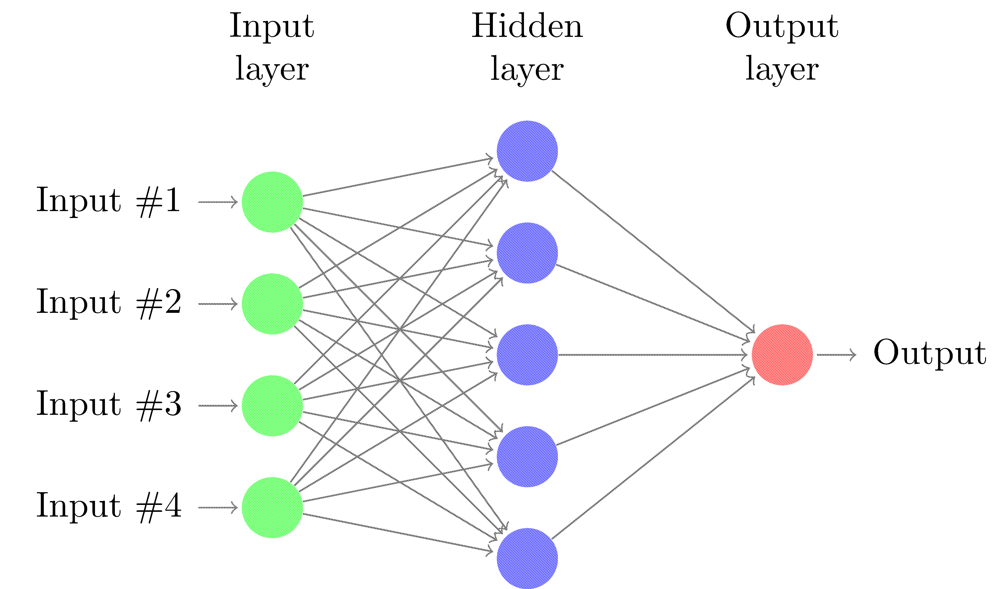

  * [nn-03_auto_net+neuralnet+foreach+style+learn.tex](https://github.com/walmes/Tikz/blob/master/src/nn-03_auto_net+neuralnet+foreach+style+learn.pgf)

```tex
\documentclass{standalone}

\usepackage{tikz}
\usepackage{verbatim}

\begin{comment}
:Title: Neural network
:Tags: Foreach

The ``\foreach`` command is very useful for quickly creating structured graphics
like this neural network diagram.

\end{comment}


\begin{document}

\pagestyle{empty}

\def\layersep{2.5cm}

\begin{tikzpicture}[shorten >=1pt,->,draw=black!50, node distance=\layersep]
    \tikzstyle{every pin edge}=[<-,shorten <=1pt]
    \tikzstyle{neuron}=[circle,fill=black!25,minimum size=17pt,inner sep=0pt]
    \tikzstyle{input neuron}=[neuron, fill=green!50];
    \tikzstyle{output neuron}=[neuron, fill=red!50];
    \tikzstyle{hidden neuron}=[neuron, fill=blue!50];
    \tikzstyle{annot} = [text width=4em, text centered]

    % Draw the input layer nodes
    \foreach \name / \y in {1,...,4}
    % This is the same as writing \foreach \name / \y in {1/1,2/2,3/3,4/4}
        \node[input neuron, pin=left:Input \#\y] (I-\name) at (0,-\y) {};

    % Draw the hidden layer nodes
    \foreach \name / \y in {1,...,5}
        \path[yshift=0.5cm]
            node[hidden neuron] (H-\name) at (\layersep,-\y cm) {};

    % Draw the output layer node
    \node[output neuron,pin={[pin edge={->}]right:Output}, right of=H-3] (O) {};
    \node[output neuron,pin={[pin edge={->}]right:Output}, right of=H-3] (1) {};

    % Connect every node in the input layer with every node in the
    % hidden layer.
    \foreach \source in {1,...,4}
        \foreach \dest in {1,...,5}
            \path (I-\source) edge (H-\dest);

    % Connect every node in the hidden layer with the output layer
    \foreach \source in {1,...,5} {
        \path (H-\source) edge (O);
        \path (H-\source) edge (1);
    
    }
    

    % Annotate the layers
    \node[annot,above of=H-1, node distance=1cm] (hl) {Hidden layer};
    \node[annot,left of=hl] {Input layer};
    \node[annot,right of=hl] {Output layer};
\end{tikzpicture}
% End of code
\end{document}
```
****

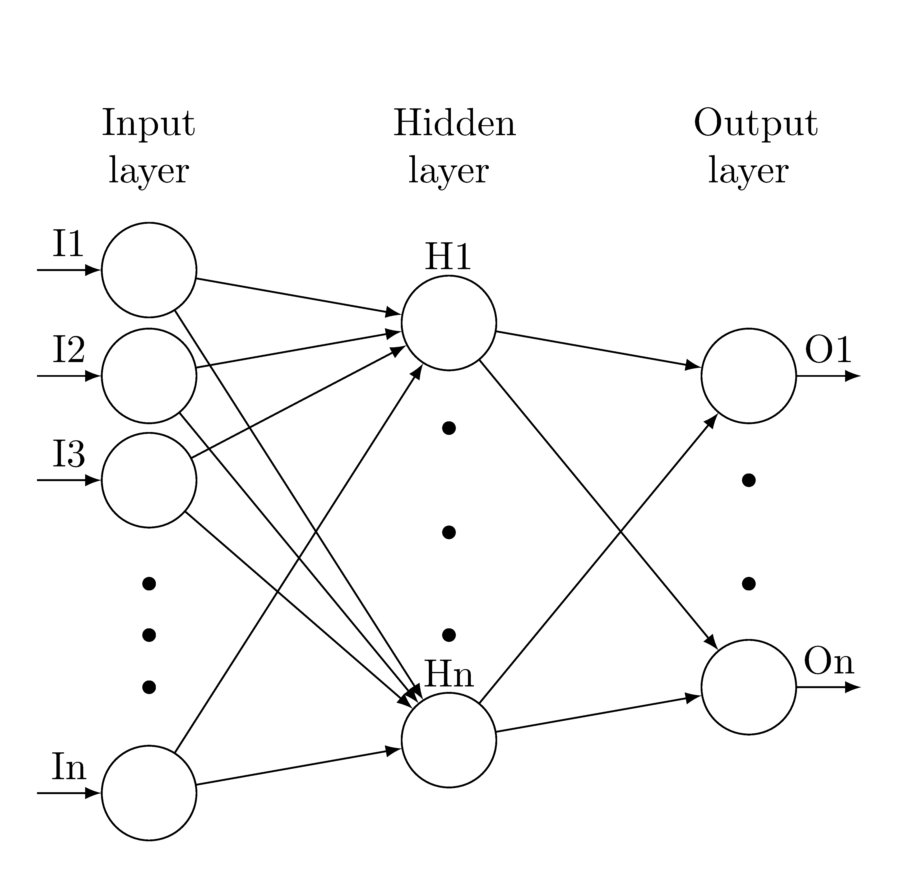

  * [nn-04_auto_net+neuralnet+matrix+style+foreach.tex](https://github.com/walmes/Tikz/blob/master/src/nn-04_auto_net+neuralnet+matrix+style+foreach.pgf)

```tex
\documentclass[landscape]{article}
\usepackage{tikz}

%%%<
\usepackage{verbatim}
\usepackage[active,tightpage]{preview}
\PreviewEnvironment{tikzpicture}
\setlength\PreviewBorder{5pt}%
%%%>


\usepackage[margin=1cm]{geometry}
\usepackage{tikz,pgfplots,pgf}
\usetikzlibrary{matrix,shapes,arrows,positioning}

\begin{document}


\begin{figure}[htp]
\centering
\begin{tikzpicture}[
plain/.style={
  draw=none,
  fill=none,
  },
dot/.style={draw,shape=circle,minimum size=3pt,inner sep=0,fill=black
  },
net/.style={
  matrix of nodes,
  nodes={
    draw,
    circle,
    inner sep=8.5pt
    },
  nodes in empty cells,
  column sep=0.6cm,
  row sep=-11pt
  },
>=latex
]
\matrix[net] (mat)
{
|[plain]| \parbox{1cm}{\centering Input\\layer} 
          & |[plain]| \parbox{1cm}{\centering Hidden\\layer} 
                       & |[plain]| \parbox{1cm}{\centering Output\\layer} \\
          & |[plain]|                 \\
|[plain]| &            & |[plain]|    \\
          & |[plain]|  &              \\
|[plain]| & |[dot]|                   \\
          & |[plain]|  & |[dot]|      \\
|[plain]| & |[dot]|    & |[plain]|    \\
|[dot]|   & |[plain]|  & |[dot]|      \\
|[dot]|   & |[dot]|    & |[plain]|    \\
|[dot]|   & |[plain]|  &              \\
|[plain]| &            & |[plain]|    \\
          & |[plain]|                 \\
};
\foreach \ai/\mi in {2/I1,4/I2,6/I3,12/In}
  \draw[<-] (mat-\ai-1) -- node[above] {\mi} +(-1cm,0);
\foreach \ai in {2,4,6,12}
{\foreach \aii/\mii in {3/H1,11/Hn}
  \draw[->] (mat-\ai-1) -- (mat-\aii-2) node[yshift=0.6cm] {\mii};
}
\foreach \ai in {3,11}
{  \draw[->] (mat-\ai-2) -- (mat-4-3);
  \draw[->] (mat-4-3) -- node[above] {O1} +(1cm,0);}
\foreach \ai in {3,11}
{  \draw[->] (mat-\ai-2) -- (mat-10-3);
  \draw[->] (mat-10-3) -- node[above] {On} +(1cm,0);}
\end{tikzpicture}

\caption{ANN diagram for Speed Sign recognition.}
\label{fig_m_3}
\end{figure}

\end{document}
```
****


  * [nn-05_auto_net_arr+neuralnet+style+foreach+learn.tex](https://github.com/walmes/Tikz/blob/master/src/nn-05_auto_net_arr+neuralnet+style+foreach+learn.pgf)

```tex
\documentclass[border=0.125cm]{standalone}
\usepackage{tikz}
\usetikzlibrary{positioning}

\begin{document}


\tikzset{%
  every neuron/.style={
    circle,
    draw,
    minimum size=1cm
  },
  neuron missing/.style={
    draw=none, 
    scale=4,
    text height=0.333cm,
    execute at begin node=\color{black}$\vdots$
  },
}

\begin{tikzpicture}[x=1.5cm, y=1.5cm, >=stealth]

	% input layer
	\foreach \m/\l [count=\y] in {1,2,3,missing,4}
	  \node [every neuron/.try, neuron \m/.try] (input-\m) at (0,2.5-\y) {};
	
	% hidden layer
	\foreach \m [count=\y] in {1,missing,2}
	  \node [every neuron/.try, neuron \m/.try ] (hidden-\m) at (2,2-\y*1.25) {};
	
	% output layer
	\foreach \m [count=\y] in {1,missing,2}
	  \node [every neuron/.try, neuron \m/.try ] (output-\m) at (4,1.5-\y) {};
	
	% labels for input layer
	\foreach \l [count=\i] in {1,2,3,n}
	  \draw [<-] (input-\i) -- ++(-1,0)
	    node [above, midway] {$I_\l$};
	
	% labels for hidden layer
	\foreach \l [count=\i] in {1,n}
	  \node [above] at (hidden-\i.north) {$H_\l$};
	
	% labels for output layer
	\foreach \l [count=\i] in {1,n}
	  \draw [->] (output-\i) -- ++(1,0)
	    node [above, midway] {$O_\l$};
	
	% connections for input layer
	\foreach \i in {1,...,4}
	  \foreach \j in {1,...,2}
	    \draw [->] (input-\i) -- (hidden-\j);
	
	% connections for hidden to output layer
	\foreach \i in {1,...,2}
	  \foreach \j in {1,...,2}
	    \draw [->] (hidden-\i) -- (output-\j);
	
	% labels for each layer at the top
	\foreach \l [count=\x from 0] in {Input, Hidden, Ouput}
	  \node [align=center, above] at (\x*2,2) {\l \\ layer};

\end{tikzpicture}

\end{document}
```
****

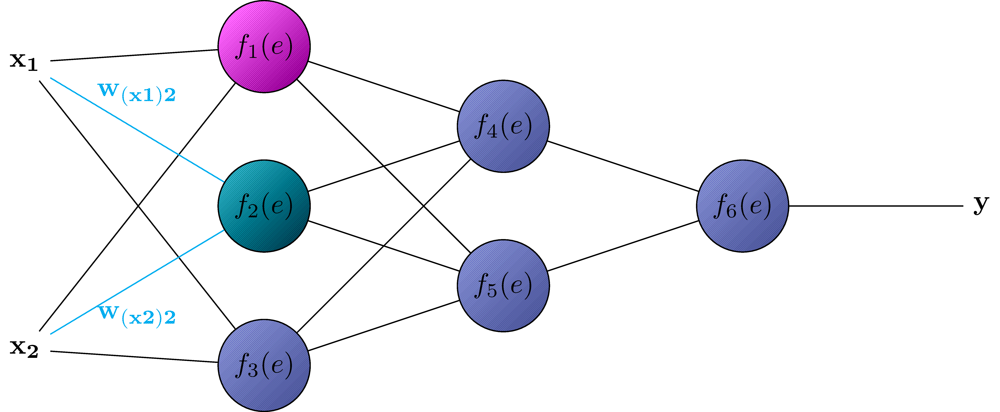

  * [nn-06_manual_net_color+neuralnet+foreach+style.tex](https://github.com/walmes/Tikz/blob/master/src/nn-06_manual_net_color+neuralnet+foreach+style.pgf)

```tex
\documentclass{standalone}
\usepackage[usenames,dvipsnames]{xcolor}
\usepackage{tikz}
\usetikzlibrary{calc}
\usetikzlibrary{arrows}

\begin{document}

  \begin{tikzpicture}
    %%Create a style for the arrows we are using
    \tikzset{normal arrow/.style={draw, thin}}
    %%Create the different coordinates to place the nodes
    \path (0,0) coordinate (1) ++(0,-2) coordinate (2) ++(0,-2) coordinate (3);
    \path (1) ++(-3,-.2) coordinate (x1);
    \path (3) ++(-3, .2) coordinate (x2);
    %%Use the calc library and partway modifiers to generate the second and third level points
    \path ($(1)!.5!(2)!3 cm!90:(2)$) coordinate (4);
    \path ($(2)!.5!(3)!3 cm!90:(3)$) coordinate (5);
    \path ($(4)!.5!(5)!3 cm!90:(5)$) coordinate (6);
    \path (6) ++(3,0) coordinate (7);
    %%Place nodes at each point using the foreach construct
    \foreach \i/\color in {1/Magenta!60,2/MidnightBlue!60,3/CadetBlue!80,4/CadetBlue!80,5/CadetBlue!80,6/CadetBlue!80}{
      \node[draw,circle,shading=axis,top color=\color, bottom color=\color!black,shading angle=45] (n\i) at (\i) {$f_{\i}(e)$};
    }
    %%Place the remaining nodes separately
    \node (nx1) at (x1) {$\mathbf{x_1}$};
    \node (nx2) at (x2) {$\mathbf{x_2}$};
    \node (ny)  at (7)  {$\mathbf{y}$};
    %%Drawing the arrows
    \path[normal arrow] (nx1) -- (n1);
    \path[normal arrow] (nx1) -- (n3);
    \path[normal arrow] (nx2) -- (n1);
    \path[normal arrow] (nx2) -- (n3);
    \path[normal arrow] (n1)  -- (n4);
    \path[normal arrow] (n1)  -- (n5);
    \path[normal arrow] (n2)  -- (n4);
    \path[normal arrow] (n2)  -- (n5);
    \path[normal arrow] (n3)  -- (n4);
    \path[normal arrow] (n3)  -- (n5);
    \path[normal arrow] (n4)  -- (n6);
    \path[normal arrow] (n5)  -- (n6);
    \path[normal arrow] (n6)  -- (ny);
    %%Drawing the cyan arrows including the labels
    \path[normal arrow,Cyan] (nx1) -- node[above=.5em,Cyan] {$\mathbf{w_{(x1)2}}$} (n2);
    \path[normal arrow,Cyan] (nx2) -- node[below=.5em,Cyan] {$\mathbf{w_{(x2)2}}$} (n2);
  \end{tikzpicture}
\end{document}
```
****


  * [nn-08-tkz-berge-01+neuralnet+scope+foreach+pkg.tex](https://github.com/walmes/Tikz/blob/master/src/nn-08-tkz-berge-01+neuralnet+scope+foreach+pkg.pgf)

```tex
\documentclass[border=5cm]{standalone}

\usepackage{tikz}    
\usepackage{xcolor}
\usepackage{tkz-berge}


\begin{document}


\begin{tikzpicture} 
    \renewcommand*{\VertexBallColor}{green!80!black}
    \GraphInit[vstyle=Shade] 
     \grComplete[RA=5]{6}
\end{tikzpicture}

\begin{tikzpicture}
    \renewcommand*{\VertexBallColor}{green!80!black}
    \GraphInit[vstyle=Shade] 

    \grPath[Math,prefix=p,RA=2,RS=0]{2} 
    \grPath[Math,prefix=q,RA=2,RS=3]{2}

    \begin{scope}[xshift=4cm, yshift=-1cm]
        \grPath[Math,prefix=r,RA=2,RS=0]{1} 
    \end{scope}

    \begin{scope}[xshift=4cm, yshift=4cm]
        \grPath[Math,prefix=s,RA=2,RS=0]{1} 
    \end{scope}

    \foreach \from in { 0,...,1}{
        \EdgeFromOneToAll{p}{q}{\from}{2}
    }
    \EdgeFromOneToAll{r}{q}{0}{2}
    \EdgeFromOneToAll{r}{p}{0}{2}

    \EdgeFromOneToAll{s}{q}{0}{2}
    \EdgeFromOneToAll{s}{p}{0}{2}
    \EdgeFromOneToAll{s}{r}{0}{1}

\end{tikzpicture}

\end{document}
```
****

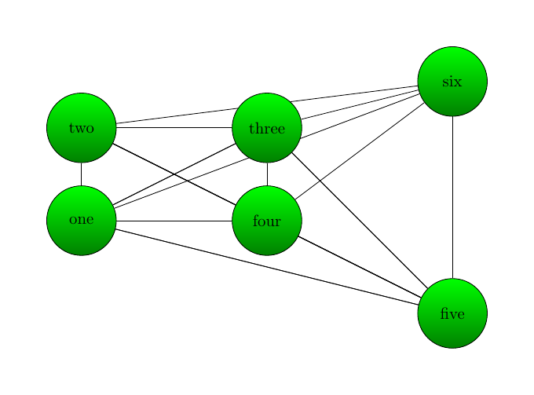

  * [nn-09_manual_net+neuralnet+foreach+scope.tex](https://github.com/walmes/Tikz/blob/master/src/nn-09_manual_net+neuralnet+foreach+scope.pgf)

```tex
\documentclass[border=1cm]{standalone}

\usepackage{tikz}
\usetikzlibrary{backgrounds}

\usepackage{xcolor}


\begin{document}

 \begin{tikzpicture}[every node/.style={circle, fill=green,minimum width=15mm,draw,shading=axis,top color=green, bottom color=green!50!black}]

 \node (a) at (0,0){ one};
 \node (b) at (0,2) {two};
 \node (c) at (4,2) {three}; 
 \node (d) at (4,0) {four}; 
 \node (e) at (8,-2) {five}; 
 \node (f) at (8,3){six}; 


\begin{scope}[on background layer]
  \foreach \alpha in {a,b,c,d,e,f}%
  {%
  \foreach \alphb in {a,b,c,d,e}%
  {%
   \draw (\alpha) -- (\alphb);%
  }}
\end{scope}
 \end{tikzpicture}


\end{document}
```
****

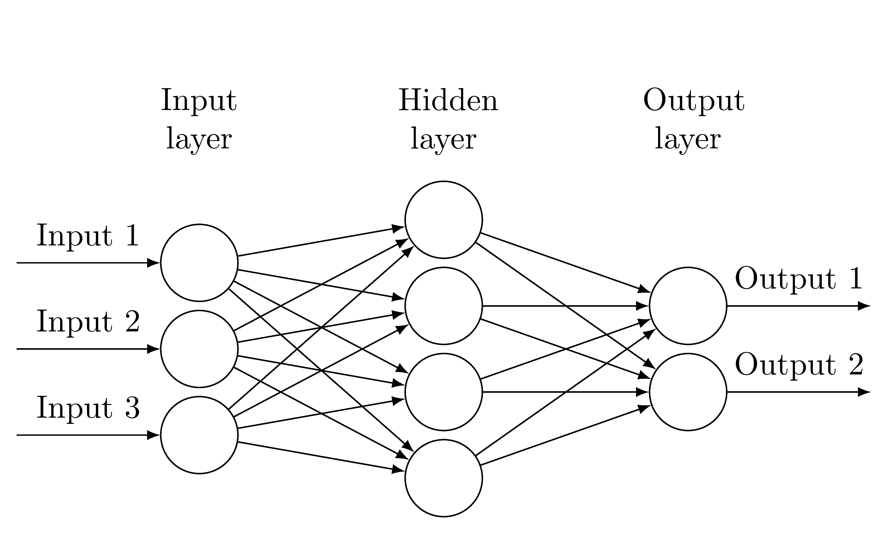

  * [nn-1h_manual_net+neuralnet+style+matrix+foreach.tex](https://github.com/walmes/Tikz/blob/master/src/nn-1h_manual_net+neuralnet+style+matrix+foreach.pgf)

```tex
% https://tex.stackexchange.com/questions/353993/neural-network-graph
\documentclass[landscape]{article}
\usepackage{tikz}

%%%<
\usepackage{verbatim}
\usepackage[active,tightpage]{preview}
\PreviewEnvironment{tikzpicture}
\setlength\PreviewBorder{5pt}%
%%%>

\usepackage{tikz}
\usetikzlibrary{matrix,chains,positioning,decorations.pathreplacing,arrows}

\begin{document}

    \begin{figure}[htp]
    \centering
    \begin{tikzpicture}[
plain/.style={
    draw=none,
    fill=none,
},
net/.style={
    matrix of nodes,
    nodes={
        draw,
        circle,
        inner sep=8.5pt
    },
    nodes in empty cells,
    column sep=0.6cm,
    row sep=-11pt
},
>=latex
]

\matrix[net] (mat)
{
    |[plain]| \parbox{1cm}{\centering Input\\layer} & |[plain]| \parbox{1cm}{\centering Hidden\\layer} & |[plain]| \parbox{1cm}{\centering Output\\layer} \\
    |[plain]| & \\
    & |[plain]| \\
    |[plain]| & &  \\
    & |[plain]| \\
    |[plain]| & &  \\
    & |[plain]| \\
    |[plain]| & \\
};
\foreach \ai [count=\mi ]in {3,5,7}
\draw[<-] (mat-\ai-1) -- node[above] {Input \mi} +(-2cm,0);
\foreach \ai in {3,5,7}
{\foreach \aii in {2,4,...,8}
    \draw[->] (mat-\ai-1) -- (mat-\aii-2);
}
\foreach \ai in {2,4,...,8}
\draw[->] (mat-\ai-2) -- (mat-6-3);

\foreach \ai in {2,4,...,8}
\draw[->] (mat-\ai-2) -- (mat-4-3);

\foreach \ai [count=\mi ]in {4,6}
\draw[->] (mat-\ai-3) -- node[above] {Output \mi} +(2cm,0);
\foreach \ai in {3,5,7}
{\foreach \aii in {2,4,...,8}
    \draw[->] (mat-\ai-1) -- (mat-\aii-2);
}
\end{tikzpicture}

\end{figure}
\end{document}
```
****

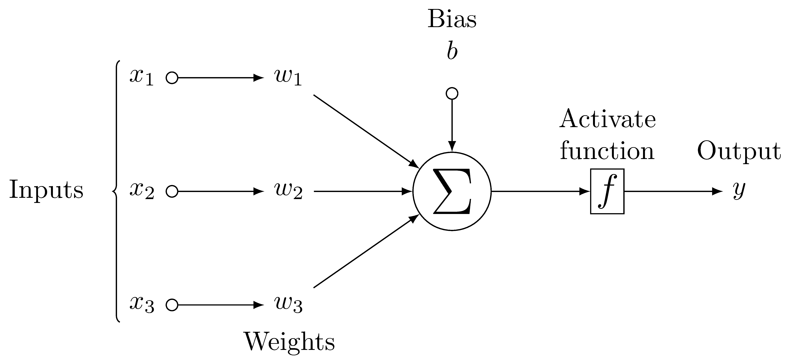

  * [nn-2_summarized+neuralnet+style+learn.tex](https://github.com/walmes/Tikz/blob/master/src/nn-2_summarized+neuralnet+style+learn.pgf)

```tex
\documentclass{standalone}
\usepackage{tikz}
\usetikzlibrary{matrix,chains,positioning,decorations.pathreplacing,arrows}


\begin{document}


\begin{tikzpicture}[
	init/.style={
	  draw,
	  circle,
	  inner sep=2pt,
	  font=\Huge,
	  join = by -latex
	},
	squa/.style={
	  draw,
	  inner sep=2pt,
	  font=\Large,
	  join = by -latex
	},
	start chain=2,node distance=13mm
	]
	\node[on chain=2] 
	  (x2) {$x_2$};
	\node[on chain=2,join=by o-latex] 
	  {$w_2$};
	\node[on chain=2,init] (sigma) 
	  {$\displaystyle\Sigma$};
	\node[on chain=2,squa,label=above:{\parbox{2cm}{\centering Activate \\ function}}]   
	  {$f$};
	\node[on chain=2,label=above:Output,join=by -latex] 
	  {$y$};
	\begin{scope}[start chain=1]
	\node[on chain=1] at (0,1.5cm) 
	  (x1) {$x_1$};
	\node[on chain=1,join=by o-latex] 
	  (w1) {$w_1$};
	\end{scope}
	\begin{scope}[start chain=3]
	\node[on chain=3] at (0,-1.5cm) 
	  (x3) {$x_3$};
	\node[on chain=3,label=below:Weights,join=by o-latex] 
	  (w3) {$w_3$};
	\end{scope}
	\node[label=above:\parbox{2cm}{\centering Bias \\ $b$}] at (sigma|-w1) (b) {};
	
	\draw[-latex] (w1) -- (sigma);
	\draw[-latex] (w3) -- (sigma);
	\draw[o-latex] (b) -- (sigma);
	
	\draw[decorate,decoration={brace,mirror}] (x1.north west) -- node[left=10pt] {Inputs} (x3.south west);
\end{tikzpicture}

\end{document}
```
****


  * [nn-2h_manual_net-color+neuralnet+set+foreach.tex](https://github.com/walmes/Tikz/blob/master/src/nn-2h_manual_net-color+neuralnet+set+foreach.pgf)

```tex
\documentclass{standalone}
\usepackage[usenames,dvipsnames]{xcolor}
\usepackage{tikz}
\usetikzlibrary{calc}
\usetikzlibrary{arrows}
\begin{document}
  \begin{tikzpicture}
    %%Create a style for the arrows we are using
    \tikzset{normal arrow/.style={draw,-triangle 45,very thick}}
    %%Create the different coordinates to place the nodes
    \path (0,0) coordinate (1) ++(0,-2) coordinate (2) ++(0,-2) coordinate (3);
    \path (1) ++(-3,-.2) coordinate (x1);
    \path (3) ++(-3, .2) coordinate (x2);
    %%Use the calc library and partway modifiers to generate the second and third level points
    \path ($(1)!.5!(2)!3 cm!90:(2)$) coordinate (4);
    \path ($(2)!.5!(3)!3 cm!90:(3)$) coordinate (5);
    \path ($(4)!.5!(5)!3 cm!90:(5)$) coordinate (6);
    \path (6) ++(3,0) coordinate (7);
    %%Place nodes at each point using the foreach construct
    \foreach \i/\color in {1/Magenta!60,2/MidnightBlue!60,3/CadetBlue!80,4/CadetBlue!80,5/CadetBlue!80,6/CadetBlue!80}{
      \node[draw,circle,shading=axis,top color=\color, bottom color=\color!black,shading angle=45] (n\i) at (\i) {$f_{\i}(e)$};
    }
    %%Place the remaining nodes separately
    \node (nx1) at (x1) {$\mathbf{x_1}$};
    \node (nx2) at (x2) {$\mathbf{x_2}$};
    \node (ny)  at (7)  {$\mathbf{y}$};
    %%Drawing the arrows
    \path[normal arrow] (nx1) -- (n1);
    \path[normal arrow] (nx1) -- (n3);
    \path[normal arrow] (nx2) -- (n1);
    \path[normal arrow] (nx2) -- (n3);
    \path[normal arrow] (n1)  -- (n4);
    \path[normal arrow] (n1)  -- (n5);
    \path[normal arrow] (n2)  -- (n4);
    \path[normal arrow] (n2)  -- (n5);
    \path[normal arrow] (n3)  -- (n4);
    \path[normal arrow] (n3)  -- (n5);
    \path[normal arrow] (n4)  -- (n6);
    \path[normal arrow] (n5)  -- (n6);
    \path[normal arrow] (n6)  -- (ny);
    %%Drawing the cyan arrows including the labels
    \path[normal arrow,Cyan] (nx1) -- node[above=.5em,Cyan] {$\mathbf{w_{(x1)2}}$} (n2);
    \path[normal arrow,Cyan] (nx2) -- node[below=.5em,Cyan] {$\mathbf{w_{(x2)2}}$} (n2);
  \end{tikzpicture}
\end{document}
```
****


  * [nn-a3c_manual_net_arr+neuralnet.tex](https://github.com/walmes/Tikz/blob/master/src/nn-a3c_manual_net_arr+neuralnet.pgf)

```tex
% https://raw.githubusercontent.com/PetarV-/TikZ/master/A3C%20neural%20network/a3c_neural_network.tex
\documentclass[crop, tikz]{standalone}
\usepackage{tikz}
\usepackage{amsmath}
\usepackage{amssymb}
\usepackage{xcolor}

\usetikzlibrary{positioning, decorations.pathmorphing}

\definecolor{olivegreen}{rgb}{0,0.6,0}

\begin{document}
\begin{tikzpicture}

	% boxes
	\path[rounded corners, fill=blue, fill opacity=0.2] (-0.4, 3.5) --  (-0.4, -3.5) -- (4, -3.5) -- (4, -0.2) -- (5, -0.2) -- (5, 3.5) -- (-0.4, 3.5) -- (-0.4, 0);
	\path[rounded corners, fill=red, fill opacity=0.2] (-0.4, -3.5) --  (-0.4, 3.5) -- (4, 3.5) -- (4, -0.2) -- (5, -0.2) -- (5, -3.5) -- (-0.4, -3.5) -- (-0.4, 0);
	\path[rounded corners, fill=white] (-0.4, 0) -- (-0.4, -3.5) -- (4, -3.5) -- (4, 3.5) -- (-0.4, 3.5) -- (-0.4, 0);
	\path[rounded corners, fill=olivegreen, fill opacity=0.2] (-0.4, 0) -- (-0.4, -3.5) -- (4, -3.5) -- (4, 3.5) -- (-0.4, 3.5) -- (-0.4, 0);
	\path [draw, dashed, very thick, rectangle, rounded corners] (-0.4, 0) -- (-0.4, -3.5) -- (5, -3.5) -- (5, 3.5) -- (-0.4, 3.5) -- (-0.4, 0);
	
	% add input nodes
	\node[circle, thick, fill=white, draw] (x1) {};
	\node[circle, thick, draw, fill=white, below=1em of x1] (x2) {};
	\node[circle, thick, fill=white, draw, below=1em of x2] (x3) {};
	\node[circle, thick, fill=white, draw, below=1em of x3] (x4) {};
	\node[circle, thick, fill=white, draw, below=1em of x4] (x5) {};
	\node[circle, thick, fill=white, draw, above=1em of x1] (x6) {};
	\node[circle, thick, fill=white, draw, above=1em of x6] (x7) {};
	\node[circle, thick, fill=white, draw, above=1em of x7] (x8) {};
	\node[circle, thick, fill=white, draw, above=1em of x8] (x9) {};

	% add 2nd layer
	\node[circle, thick, right=4em of x1, fill=white, draw] (xhh1) {};
	\node[circle, thick, draw, fill=white, below=1em of xhh1] (xhh2) {};
	\node[circle, thick, fill=white, draw, below=1em of xhh2] (xhh3) {};
	\node[circle, thick, fill=white, draw, below=1em of xhh3] (xhh4) {};
	\node[circle, thick, fill=white, draw, above=1em of xhh1] (xhh5) {};
	\node[circle, thick, fill=white, draw, above=1em of xhh5] (xhh6) {};
	\node[circle, thick, fill=white, draw, above=1em of xhh6] (xhh7) {};
	
	% 3rd layer
	\node[circle, thick, right=8em of x1, fill=white, draw] (xh1) {};
	\node[circle, thick, draw, fill=white, below=1em of xh1] (xh2) {};
	\node[circle, thick, fill=white, draw, below=1em of xh2] (xh3) {};
	\node[circle, thick, fill=white, draw, below=1em of xh3] (xh4) {};
	\node[circle, thick, fill=white, draw, above=1em of xh1] (xh5) {};
	\node[circle, thick, fill=white, draw, above=1em of xh5] (xh6) {};
	\node[circle, thick, fill=white, draw, above=1em of xh6] (xh7) {};

	% output layer
	\node[circle, very thick, fill=blue!30, draw, right=12em of x1, yshift=5em] (hm1) {};
	\node[circle, very thick, draw, fill=blue!30, below=0.5em of hm1] (hm2) {};
	\node[circle, very thick, draw, fill=blue!30, below=0.5em of hm2] (hm3) {};
	\node[circle, very thick, draw, fill=blue!30, above=0.5em of hm1] (hm4) {};
	\node[circle, very thick, draw, fill=blue!30, above=0.5em of hm4] (hm5) {};
	\node[circle, very thick, fill=red!30, draw, right=12em of x1, yshift=-5em] (hs1) {};

	% add labels for output layer
	\node[right=1.5em of hm1, blue] (mu1) {$\pi_\theta(s, \alpha_3)$};
	\node[right=1.5em of hm2, blue] (mu2) {$\pi_\theta(s, \alpha_4)$};
	\node[right=1.5em of hm3, blue] (mu3) {$\pi_\theta(s, \alpha_5)$};
	\node[right=1.5em of hm4, blue] (mu4) {$\pi_\theta(s, \alpha_2)$};
	\node[right=1.5em of hm5, blue] (mu5) {$\pi_\theta(s, \alpha_1)$};
	\node[right=1.5em of hs1, red] (s1) {$V_\psi(s)$};

	% arrows between input layer and 2nd layer
	\foreach \x in {1,...,9}
	\foreach \y in {1,...,7}
	\draw[-stealth, thick] (x\x) -- (xhh\y);

	% arrows between 2nd layer and 3rd layer
	\foreach \x in {1,...,7}
	\foreach \y in {1,...,7}
	\draw[-stealth, thick] (xhh\x) -- (xh\y);
	
	% arrows between 3rd layer and upper output layer
	\foreach \x in {1,...,7}
	\foreach \y in {1,...,5}
	\draw[-stealth, thick, blue] (xh\x) -- (hm\y);
	
	% arrows between 3rd layer and lower output layer
	\foreach \x in {1,...,7}
	\draw[-stealth, thick, red] (xh\x) -- (hs1);
	
	% decorated arrows for main output variable
	\draw[-stealth, decoration={snake, pre length=0.01mm, segment length=2mm, amplitude=0.3mm, post length=1.5mm}, decorate, thick, red] (hs1) -- (s1);
	
	% decorated arrows between upper output nodes and labels
	\foreach \x in {1,...,5}
	\draw[-stealth, decoration={snake, pre length=0.01mm, segment length=2mm, amplitude=0.3mm, post length=1.5mm}, decorate, thick, blue] (hm\x) -- (mu\x);

	% label for the whole network
	\node[left=0.75em of x1] (l1) {$s$};

\end{tikzpicture}
\end{document}
```
****


  * [nn-auto_net_4h_arr+neuralnet+matrix+foreach+style+scope.tex](https://github.com/walmes/Tikz/blob/master/src/nn-auto_net_4h_arr+neuralnet+matrix+foreach+style+scope.pgf)

```tex
% https://tex.stackexchange.com/a/371474/173708
\documentclass[border=10pt]{standalone}
\usepackage{tikz}
\usetikzlibrary{matrix,arrows.meta,quotes,shadows,decorations.pathreplacing,positioning,fadings}
\usepackage{cfr-lm}
\begin{document}
\colorlet{mewnol}{blue!75!cyan}%
\colorlet{allanol}{blue!50!black}%
\begin{tikzpicture}
  [
    lliw nn/.code={\colorlet{lliwnn}{#1}},
    lliw nn=mewnol,
    nn/.style={draw=lliwnn, inner color=white, outer color=lliwnn!5, circular drop shadow},
    font=\sffamily\plstyle,
    >=Latex,
    every edge/.append style={->},
    every edge quotes/.append style={font=\sffamily\plstyle\footnotesize,},
    semithick,
  ]
  \matrix (n) [matrix of nodes, nodes={circle, minimum size=20pt, thick}, nodes in empty cells, column sep=7.5mm, column 1/.append style={nodes={coordinate}}, column 12/.append style={nodes={coordinate}}, column 2/.append style={lliw nn=allanol}, column 11/.append style={lliw nn=allanol}]
  {
    &[10mm]&&|[nn]|&&|[nn]|&&|[nn]|&&&&[10mm]\\
    &&|[nn]|&&|[nn]|&&|[nn]|&&|[nn]|&&&\\
    &|[nn]|&&|[nn]|&&|[nn]|&&|[nn]|&&|[nn]|&&\\
    &&|[nn]|&&|[nn]|&&|[nn]|&&|[nn]|&&|[nn]|&\\
    &|[nn]|&&|[nn]|&&|[nn]|&&|[nn]|&&|[nn]|&&\\
    &&|[nn]|&&|[nn]|&&|[nn]|&&|[nn]|&&|[nn]|&\\
    &|[nn]|&&|[nn]|&&|[nn]|&&|[nn]|&&|[nn]|&&\\
    &&|[nn]|&&|[nn]|&&|[nn]|&&|[nn]|&&&\\
    &&&|[nn]|&&|[nn]|&&|[nn]|&&&&\\
  };

	% draw all nodes; 
	% add labels for input and output layers 
	\foreach \i [count=\j from 1] in {3,5,7} \draw [allanol]  (n-\i-1) edge ["Input \j"] (n-\i-2) ;
	\foreach \i [count=\j from 1] in {4,6} \draw [allanol] (n-\i-11) edge ["Output \j"] (n-\i-12)  ;
  
	% add connections between all nodes  
  \begin{scope}[every edge/.append style={draw=mewnol, opacity={random(25,100)/100}}]
	\foreach \i in {3,5,7} \draw (n-\i-10) edge (n-4-11) edge (n-6-11);
	\foreach \i in {3,5,7} \foreach \j in {2,4,6,8} \draw (n-\i-2) edge (n-\j-3) (n-\j-9) edge (n-\i-10);
	\foreach \k [evaluate=\k as \m using {int(\k+1)}, evaluate=\k as \n using {int(\k+2)} ] in {3,5,7} \foreach \i in {2,4,6,8} \foreach \j in {1,3,5,7,9} \draw  (n-\i-\k) edge (n-\j-\m) (n-\j-\m) edge (n-\i-\n) ;
  \end{scope}

	% add decorations
	% add layers for groups: input layer, hidden layers, output layer  
	\begin{scope}[decoration={brace, amplitude=7.5pt}, thick, every node/.append style={align=center}]
	 \draw [decorate, mewnol] ([xshift=-2.5pt]n-1-3.west |- n-1-3.north) ++(0,7.5pt) coordinate (l) -- ([xshift=2.5pt]n-1-10.east |- l) node [above=7.5pt,midway] {Hidden\\Layers};
	 \draw [decorate, allanol] ([xshift=-2.5pt]n-1-2.west |- l) -- ([xshift=2.5pt]n-1-2.east |- l) node [above=7.5pt,midway]  {Input\\Layer};
	 \draw [decorate, allanol] ([xshift=-2.5pt]n-1-11.west |- l) -- ([xshift=2.5pt]n-1-11.east |- l) node [above=7.5pt,midway]  {Output\\Layer};
  \end{scope}
  
  % add x-axis arrow and label
  \draw [thick, ->, allanol] ([xshift=-2.5pt,yshift=-10pt]current bounding box.south -| n-9-2.west) coordinate (ll) -- ([xshift=2.5pt]n-9-11.east |- ll) node [midway, below] {Flow of Information};
  
  % add legend and strength
  \node (cs) [every edge quotes, anchor=base west, xshift=50mm, mewnol] at ([xshift=5pt,yshift=-12.5pt]n-1-1 |- current bounding box.south) {Connection Strength};
  \fill [fill=mewnol, path fading=west] (cs.base west) ++(-5pt,\pgflinewidth) rectangle ++(-50mm,5pt) ;
  
\end{tikzpicture}
\end{document}
```
****


  * [nn-auto_net_arr+neuralnet+foreach+style+foreach.tex](https://github.com/walmes/Tikz/blob/master/src/nn-auto_net_arr+neuralnet+foreach+style+foreach.pgf)

```tex
\documentclass{standalone}

\usepackage{tikz}
\usepackage{verbatim}

% Basis: http://www.texample.net/tikz/examples/neural-network/
\begin{document}
\pagestyle{empty}

\def\layersep{2.5cm}

\begin{tikzpicture}[shorten >=1pt,->,draw=black!100, node distance=\layersep]
    \tikzstyle{every pin edge}=[<-,shorten <=1pt]
    \tikzstyle{neuron}=[circle,fill=black!25,minimum size=17pt,inner sep=0pt]
    \tikzstyle{input neuron}=[neuron, fill=white!100,draw=black];
    \tikzstyle{output neuron}=[neuron, fill=white!100,draw=black];
    \tikzstyle{hidden neuron}=[neuron, fill=white!100,draw=black];
    \tikzstyle{annot} = [text width=4em, text centered]

	% Draw the input layer nodes and the labels
	\foreach \name / \y in {1,...,3}
		% This is the same as writing \foreach \name / \y in {1/1,2/2,3/3,4/4}
		\node[input neuron, pin=left:Input \y] (I-\name) at (0,-\y) {};
	
	% Draw the hidden layer nodes
	\foreach \name / \y in {1,...,4}
	    \path[yshift=0.5cm]
	        node[hidden neuron] (H-\name) at (\layersep,-\y cm) {};
	
	% Draw the output layer node
	\node[output neuron,pin={[pin edge={->}]right:Output}, right of=H-2] (O1) {};
	\node[output neuron,pin={[pin edge={->}]right:Output}, right of=H-3] (O2) {};
	
	% Connect every node in the input layer with every node in the
	% hidden layer.
	\foreach \source in {1,...,3}
	    \foreach \dest in {1,...,4}
	        \path (I-\source) edge (H-\dest);
	
	% Connect every node in the hidden layer with the output layer
	\foreach \source in {1,...,4}
	    \path (H-\source) edge (O1);
	\foreach \source in {1,...,4}
	    \path (H-\source) edge (O2);
	
	% Annotate the layers at the top
	\node[annot,above of=H-1, node distance=1cm] (hl) {Hidden layer};
	\node[annot,left of=hl] {Input layer};
	\node[annot,right of=hl] {Output layer};

\end{tikzpicture}
% End of code
\end{document}
```
****

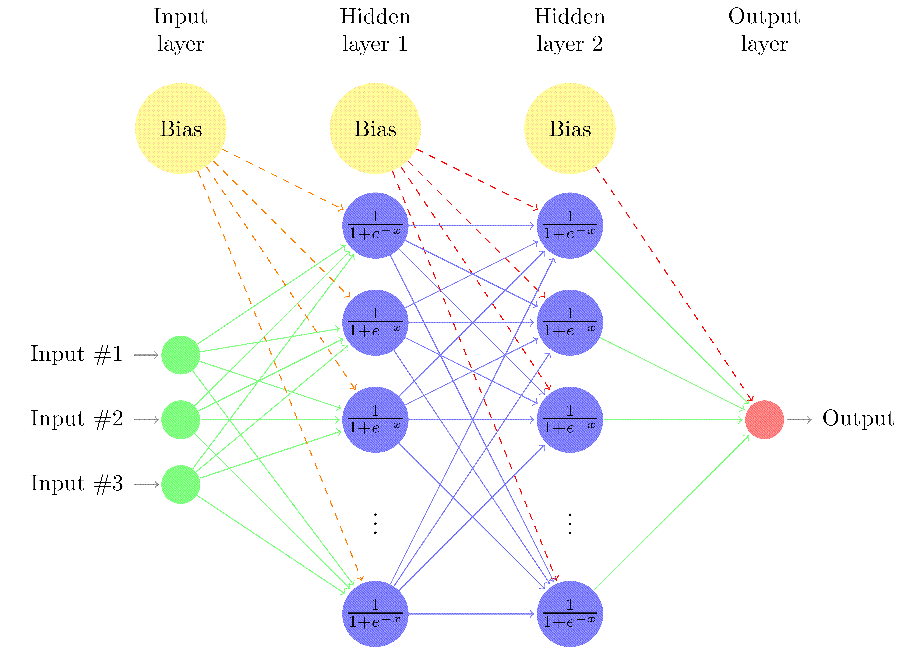

  * [nn-auto_net_bias_arr+neuralnet+learn+foreach+def+command+ifnum+style.tex](https://github.com/walmes/Tikz/blob/master/src/nn-auto_net_bias_arr+neuralnet+learn+foreach+def+command+ifnum+style.pgf)

```tex
\documentclass{standalone}
\usepackage{tikz}
\begin{document}
\pagestyle{empty}

\def\layersep{3cm}
\def\nodeinlayersep{1.5cm}

\begin{tikzpicture}[
   shorten >=1pt,->,
   draw=black!50,
    node distance=\layersep,
    every pin edge/.style={<-,shorten <=1pt},
    neuron/.style={circle,fill=black!25,minimum size=17pt,inner sep=0pt},
    input neuron/.style={neuron, fill=green!50,},
    output neuron/.style={neuron, fill=red!50},
    hidden neuron/.style={neuron, fill=blue!50},
    annot/.style={text width=4em, text centered},
    bias/.style={neuron, fill=yellow!50,minimum size=4em},%<-- added %%%
]

    % Draw the input layer nodes
    \foreach \name / \y in {1,...,3}
    	\node[input neuron, pin=left:Input \#\y] (I-\name) at (0,-\y-2.5) {};  

    % set number of hidden layers
    \newcommand\Nhidden{2}

    % Draw the hidden layer nodes
    \foreach \N in {0,...,\Nhidden} {
       \foreach \y in {0,...,5} { % <-- added 0 instead of 1 %%%%%
	     \ifnum \y=4
	     \ifnum \N>0 %<-- added %%%%%%%%%%%%%%%%%%%%%%%%%%%%%%%%%%%%%%%%%%%%
	       \node at (\N*\layersep,-\y*\nodeinlayersep) {$\vdots$};  % add dots
	       \else\fi %<-- added %%%%%%%%%%%%%%%%%%%%%%%%%%%%%%%%%%%%%%%%%%%%
	     \else
	         \ifnum \y=0 %<-- added %%%%%%%%%%%%%%%%%%%%%%%%%%%%%%%%%%
	         \ifnum \N<3 %<-- added %%%%%%%%%%%%%%%%%%%%%%%%%%%%%%%%%%
	           \node[bias] (H\N-\y) at (\N*\layersep,-\y*\nodeinlayersep ) {Bias}; %<-- added
	           \else\fi %<-- added %%%%%%%%%%%%%%%%%%%%%%%%%%%%%%%%
	         \else %<-- added %%%%%%%%%%%%%%%%%%%%%%%%%%%%%%%%%%%%%%%%%%%%
	            \ifnum \N>0 %<-- added %%%%%%%%%%%%%%%%%%%%%%%%%
	            % print function
	           \node[hidden neuron] (H\N-\y) at (\N*\layersep,-\y*\nodeinlayersep ) {$\frac{1}{1+e^{-x}}$}; %<-- added %%%%%%%%%%%
	               \else\fi %<-- added %%%%%%%%%%%%
	         \fi %<-- added %%%%%%%
	     \fi
     	}
       \ifnum \N>0 %<-- added %%%%%%
       	% print hidden layer labels at the top
    	\node[annot,above of=H\N-1, node distance=1cm,yshift=2cm] (hl\N) {Hidden layer \N}; % <- added yshift=2cm %%%%%%%%%%%%
	    \else\fi %<-- added %%%%%
    }

    % Draw the output layer node and label
    \node[output neuron,pin={[pin edge={->}]right:Output}, right of=H\Nhidden-3] (O) {}; 
    
    % Connect bias every node in the input layer with every node in the
    % hidden layer.
    \foreach \source in {1,...,3}
        \foreach \dest in {1,...,3,5} {
          % \path[yellow] (H-0) edge (H1-\dest);
          \path[dashed,orange] (H0-0) edge (H1-\dest); %<-- added %%%%%
            \path[green!50] (I-\source) edge (H1-\dest);  % change to green, yellow gets blended
     };

    % connect all hidden stuff
    \foreach [remember=\N as \lastN (initially 1)] \N in {2,...,\Nhidden}
       \foreach \source in {0,...,3,5} 
           \foreach \dest in {1,...,3,5}{
               \ifnum \source=0 %<-- added %%%%%%%%%%%%%%%%%%%%%%%
           \path[dashed,red](H\lastN-\source) edge (H\N-\dest);%<-- added 
              \else %<-- added %%%
              \path[blue!50] (H\lastN-\source) edge (H\N-\dest);%<-- added 
              \fi %<-- added %%%
              }; %<-- added %%%%

    % Connect every node in the hidden layer with the output layer
    \foreach \source in {1,...,3,5}
    	\path[green!50] (H\Nhidden-\source) edge (O);
    	\path[dashed,red] (H2-0) edge (O); %<-- added %%%%

	% Annotate the input and output layers
    \node[annot,left of=hl1] {Input layer};
    \node[annot,right of=hl\Nhidden] {Output layer};  
\end{tikzpicture}
% End of code
\end{document}
```
****


  * [nn-auto_net_color+neuralnet+foreach.tex](https://github.com/walmes/Tikz/blob/master/src/nn-auto_net_color+neuralnet+foreach.pgf)

```tex
\documentclass[border=1cm]{standalone}

\usepackage{tikz}
\usepackage{xcolor}

\begin{document}
 \begin{tikzpicture}
  \foreach \x /\alph/\name in {0/a/one, 60/b/two, 120/c/three, 180/d/four, 240/e/five, 300/f/six}{
  \node[circle, fill=green,minimum width=15mm,draw,shading=axis,top color=green, bottom color=green!50!black] (\alph) at (\x:3cm) {\name}; }

  \foreach \alpha in {a,b,c,d,e,f}%
  {%
  \foreach \alphb in {a,b,c,d,e}%
  {%
   \draw (\alpha) -- (\alphb);%
  }}

 \end{tikzpicture}


\end{document}
```
****

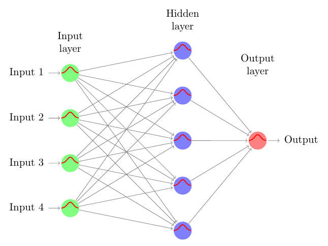

  * [nn-auto_net_icon+neuralnet+style+foreach+set+function+learn.tex](https://github.com/walmes/Tikz/blob/master/src/nn-auto_net_icon+neuralnet+style+foreach+set+function+learn.pgf)

```tex
% https://tex.stackexchange.com/questions/446948/how-to-place-a-parabola-distribution-on-top-of-a-node-in-tikz?rq=1
\documentclass[tikz,margin=2mm]{standalone}

\usepackage{tikz}

\tikzset{
    declare function={
        sig = 0.1;
        mu = 0;
        g(\x) = 1/(sig*sqrt(2*pi)) * exp(-1/2 * ((\x-mu)/sig)^2);
    }
}

\begin{document}

\begin{tikzpicture}[
    shorten >=1pt,
    ->,
    draw=black!50,
    node distance=2.5cm,
    scale=1.5,
    every pin edge/.style={<-,shorten <=1pt},
    neuron/.style={
        circle,fill=black!25,minimum size=17pt,inner sep=0pt,
        path picture={
            \draw[red,thick,-] plot[domain=-0.3:0.3,samples=11,smooth] ({\x},{0.05*g(\x)});
        },
    },
    input neuron/.style={neuron, fill=green!50},
    output neuron/.style={neuron, fill=red!50},
    hidden neuron/.style={neuron, fill=blue!50},
    annot/.style={text width=4em, text centered},
]

	% Draw the input layer nodes
	\foreach \name / \y in {1,...,4}
	% This is the same as writing \foreach \name / \y in {1/1,2/2,3/3,4/4}
	    \node[input neuron, pin=left:Input \y] (I-\name) at (0,-\y) {};
	
	% Draw the hidden layer nodes
	\foreach \name / \y in {1,...,5}
	    \path[yshift=0.5cm]
	        node[hidden neuron] (H-\name) at (2.5cm,-\y cm) {};
	
	% Draw the output layer node
	\node[output neuron,pin={[pin edge={->}]right:Output}, right of=H-3] (O) {};
	
	% Connect every node in the input layer with every node in the
	% hidden layer.
	\foreach \source in {1,...,4}
	    \foreach \dest in {1,...,5}
	        \path (I-\source) edge (H-\dest);
	
	% Connect every node in the hidden layer with the output layer
	\foreach \source in {1,...,5}
	    \path (H-\source) edge (O);
	
	% Annotate the layers
	\node[annot,above of=H-1, node distance=1cm] (hl) {Hidden layer};
	\node[annot,above of=I-1, node distance=1cm] {Input layer};
	\node[annot,above of=O] {Output layer};


\end{tikzpicture}

\end{document}
```
****


  * [nn-block_diagram-multilayer_perceptron+neuralnet+style+learn.tex](https://github.com/walmes/Tikz/blob/master/src/nn-block_diagram-multilayer_perceptron+neuralnet+style+learn.pgf)

```tex
\documentclass[crop, tikz]{standalone}
\usepackage{tikz}

\usetikzlibrary{positioning}

\tikzstyle{inputNode}=[draw,circle,minimum size=10pt,inner sep=0pt]
\tikzstyle{stateTransition}=[-stealth, thick]

\begin{document}
\begin{tikzpicture}
	\node[draw,circle,minimum size=25pt,inner sep=0pt] (x) at (0,0) {$\Sigma$ $\sigma$};

	\node[inputNode] (x0) at (-2, 1.5) {$\tiny +1$};
	\node[inputNode] (x1) at (-2, 0.75) {$\tiny x_1$};
	\node[inputNode] (x2) at (-2, 0) {$\tiny x_2$};
	\node[inputNode] (x3) at (-2, -0.75) {$\tiny x_3$};
	\node[inputNode] (xn) at (-2, -1.75) {$\tiny x_n$};

	\draw[stateTransition] (x0) to[out=0,in=120] node [midway, sloped, above] {$w_0$} (x);
	\draw[stateTransition] (x1) to[out=0,in=150] node [midway, sloped, above] {$w_1$} (x);
	\draw[stateTransition] (x2) to[out=0,in=180] node [midway, sloped, above] {$w_2$} (x);
	\draw[stateTransition] (x3) to[out=0,in=210] node [midway, sloped, above] {$w_3$} (x);
	\draw[stateTransition] (xn) to[out=0,in=240] node [midway, sloped, above] {$w_n$} (x);
	\draw[stateTransition] (x) -- (4,0) node [midway,above] {$\sigma\left(w_0 + \sum\limits_{i=1}^{n}{w_ix_i}\right)$};
	\draw[dashed] (0,-0.43) -- (0,0.43);
	\node (dots) at (-2, -1.15) {$\vdots$};
	\node[inputNode, thick] (i1) at (6, 0.75) {};
	\node[inputNode, thick] (i2) at (6, 0) {};
	\node[inputNode, thick] (i3) at (6, -0.75) {};
	
	\node[inputNode, thick] (h1) at (8, 1.5) {};
	\node[inputNode, thick] (h2) at (8, 0.75) {};
	\node[inputNode, thick] (h3) at (8, 0) {};
	\node[inputNode, thick] (h4) at (8, -0.75) {};
	\node[inputNode, thick] (h5) at (8, -1.5) {};
	
	\node[inputNode, thick] (o1) at (10, 0.75) {};
	\node[inputNode, thick] (o2) at (10, -0.75) {};
	
	\draw[stateTransition] (5, 0.75) -- node[above] {$I_1$} (i1);
	\draw[stateTransition] (5, 0) -- node[above] {$I_2$} (i2);
	\draw[stateTransition] (5, -0.75) -- node[above] {$I_3$} (i3);
	
	\draw[stateTransition] (i1) -- (h1);
	\draw[stateTransition] (i1) -- (h2);
	\draw[stateTransition] (i1) -- (h3);
	\draw[stateTransition] (i1) -- (h4);
	\draw[stateTransition] (i1) -- (h5);
	\draw[stateTransition] (i2) -- (h1);
	\draw[stateTransition] (i2) -- (h2);
	\draw[stateTransition] (i2) -- (h3);
	\draw[stateTransition] (i2) -- (h4);
	\draw[stateTransition] (i2) -- (h5);
	\draw[stateTransition] (i3) -- (h1);
	\draw[stateTransition] (i3) -- (h2);
	\draw[stateTransition] (i3) -- (h3);
	\draw[stateTransition] (i3) -- (h4);
	\draw[stateTransition] (i3) -- (h5);
	
	\draw[stateTransition] (h1) -- (o1);
	\draw[stateTransition] (h1) -- (o2);
	\draw[stateTransition] (h2) -- (o1);
	\draw[stateTransition] (h2) -- (o2);
	\draw[stateTransition] (h3) -- (o1);
	\draw[stateTransition] (h3) -- (o2);
	\draw[stateTransition] (h4) -- (o1);
	\draw[stateTransition] (h4) -- (o2);
	\draw[stateTransition] (h5) -- (o1);
	\draw[stateTransition] (h5) -- (o2);
	
	\node[above=of i1, align=center] (l1) {Input \\ layer};
	\node[right=2.3em of l1, align=center] (l2) {Hidden \\ layer};
	\node[right=2.3em of l2, align=center] (l3) {Output \\ layer};
	
	\draw[stateTransition] (o1) -- node[above] {$O_1$} (11, 0.75);
	\draw[stateTransition] (o2) -- node[above] {$O_2$} (11, -0.75);
	
	\path[dashed, double, ultra thick, gray] (x.north) edge[bend left=0] (h5.north);
	\path[dashed, double, ultra thick, gray] (x.south) edge[bend right=0] (h5.south);
\end{tikzpicture}
\end{document}
```
****

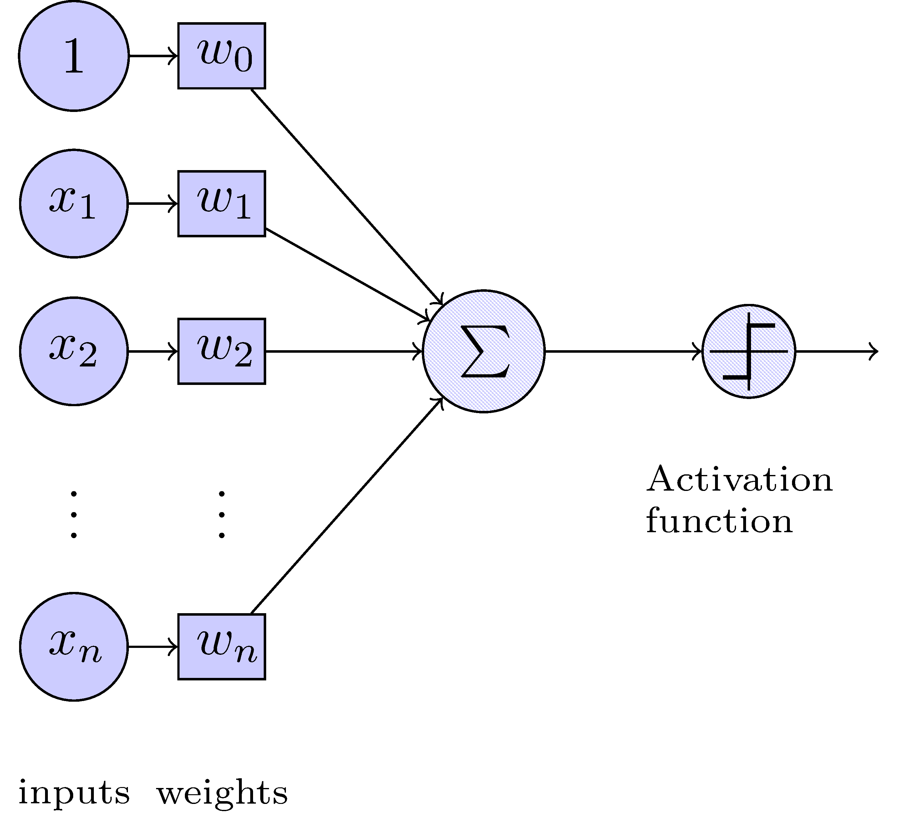

  * [nn-block_diagram-perceptron+neuralnet+set+learn.tex](https://github.com/walmes/Tikz/blob/master/src/nn-block_diagram-perceptron+neuralnet+set+learn.pgf)

```tex
\documentclass[tikz]{standalone}
\usepackage{tikz}
    \usetikzlibrary{positioning}

\tikzset{basic/.style={draw,fill=blue!20,text width=1em,text badly centered}}
\tikzset{input/.style={basic,circle}}
\tikzset{weights/.style={basic,rectangle}}
\tikzset{functions/.style={basic,circle,fill=blue!10}}

\begin{document}
    \begin{tikzpicture}
        \node[functions] (center) {};
        \node[below of=center,font=\scriptsize,text width=4em] {Activation function};
        \draw[thick] (0.5em,0.5em) -- (0,0.5em) -- (0,-0.5em) -- (-0.5em,-0.5em);
        \draw (0em,0.75em) -- (0em,-0.75em);
        \draw (0.75em,0em) -- (-0.75em,0em);
        \node[right of=center] (right) {};
            \path[draw,->] (center) -- (right);
        \node[functions,left=3em of center] (left) {$\sum$};
            \path[draw,->] (left) -- (center);
        \node[weights,left=3em of left] (2) {$w_2$} -- (2) node[input,left of=2] (l2) {$x_2$};
            \path[draw,->] (l2) -- (2);
            \path[draw,->] (2) -- (left);
        \node[below of=2] (dots) {$\vdots$} -- (dots) node[left of=dots] (ldots) {$\vdots$};
        \node[weights,below of=dots] (n) {$w_n$} -- (n) node[input,left of=n] (ln) {$x_n$};
            \path[draw,->] (ln) -- (n);
            \path[draw,->] (n) -- (left);
        \node[weights,above of=2] (1) {$w_1$} -- (1) node[input,left of=1] (l1) {$x_1$};
            \path[draw,->] (l1) -- (1);
            \path[draw,->] (1) -- (left);
        \node[weights,above of=1] (0) {$w_0$} -- (0) node[input,left of=0] (l0) {$1$};
            \path[draw,->] (l0) -- (0);
            \path[draw,->] (0) -- (left);
        \node[below of=ln,font=\scriptsize] {inputs};
        \node[below of=n,font=\scriptsize] {weights};
    \end{tikzpicture}
\end{document}
```
****

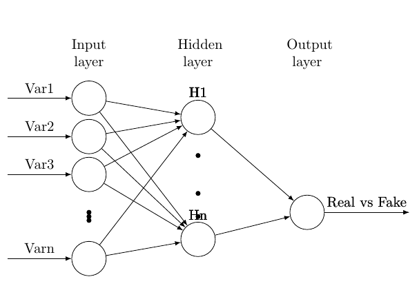

  * [nn-discriminator+neuralnet+matrix+foreach+style.tex](https://github.com/walmes/Tikz/blob/master/src/nn-discriminator+neuralnet+matrix+foreach+style.pgf)

```tex
\documentclass[landscape]{article}
\usepackage{tikz}

%%%<
\usepackage{verbatim}
\usepackage[active,tightpage]{preview}
\PreviewEnvironment{tikzpicture}
\setlength\PreviewBorder{5pt}%
%%%>

\usepackage[margin=1cm]{geometry}
\usepackage{tikz,pgfplots,pgf}
\usetikzlibrary{matrix,shapes,arrows,positioning}

\begin{document}

\begin{figure}[htp]
\centering
\begin{tikzpicture}[
	plain/.style={
	  draw=none,
	  fill=none,
	  },
	dot/.style={draw,shape=circle,minimum size=3pt,inner sep=0,fill=black
	  },
	net/.style={
	  matrix of nodes,
	  nodes={
	    draw,
	    circle,
	    inner sep=8.5pt
	    },
	  nodes in empty cells,
	  column sep=0.6cm,
	  row sep=-11pt
	  },
	>=latex
	]
	\matrix[net] (mat)
	{
	|[plain]| \parbox{1cm}{\centering Input\\layer} 
	          & |[plain]| \parbox{1cm}{\centering Hidden\\layer} 
	                       & |[plain]| \parbox{1cm}{\centering Output\\layer} \\
	          & |[plain]|                 \\
	|[plain]| &                 \\
	          & |[plain]|                \\
	|[plain]| & |[dot]|                        \\
	          & |[plain]|         \\
	|[plain]| & |[dot]|    &  |[plain]|      \\
	|[dot]|   & |[plain]|  &      \\
	|[dot]|   & |[dot]|         \\
	|[dot]|   & |[plain]|                \\
	|[plain]| &                 \\
	          & |[plain]|                 \\
	};
	\foreach \ai/\mi in {2/Var1,4/Var2,6/Var3,12/Varn}
	  \draw[<-] (mat-\ai-1) -- node[above] {\mi} +(-2cm,0);
	
	\foreach \ai in {2,4,6,12} {
	  \foreach \aii/\mii in {3/H1,11/Hn}
	    \draw[->] (mat-\ai-1) -- (mat-\aii-2) node[yshift=0.6cm] {\mii};
	}
	% output layer
	\foreach \ai in {3,11}
	{  \draw[->] (mat-\ai-2) -- (mat-8-3);
	   \draw[->] (mat-8-3) -- node[above] {Real vs Fake} +(2.5cm,0);}
	% output layer
\end{tikzpicture}

\caption{ANN diagram for the Discriminator}
\label{fig_m_3}
\end{figure}

\end{document}
```
****

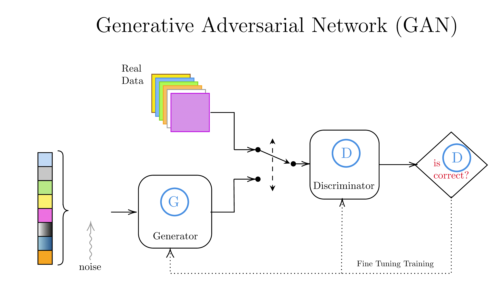

  * [nn-gan_complete+neuralnet.tex](https://github.com/walmes/Tikz/blob/master/src/nn-gan_complete+neuralnet.pgf)

```tex
\documentclass[border=10pt]{standalone}
\usepackage{tikz}

\begin{document}


% Gradient Info
  
\tikzset {_zurc7u6zg/.code = {\pgfsetadditionalshadetransform{ \pgftransformshift{\pgfpoint{0 bp } { 0 bp }  }  \pgftransformrotate{0 }  \pgftransformscale{2 }  }}}
\pgfdeclarehorizontalshading{_9951a9ewz}{150bp}{rgb(0bp)=(1,1,1);
rgb(37.5bp)=(1,1,1);
rgb(62.5bp)=(0,0,0);
rgb(100bp)=(0,0,0)}
\tikzset{_26b0l72gl/.code = {\pgfsetadditionalshadetransform{\pgftransformshift{\pgfpoint{0 bp } { 0 bp }  }  \pgftransformrotate{0 }  \pgftransformscale{2 } }}}
\pgfdeclarehorizontalshading{_cfa2kfymd} {150bp} {color(0bp)=(transparent!0);
color(37.5bp)=(transparent!0);
color(62.5bp)=(transparent!10);
color(100bp)=(transparent!10) } 
\pgfdeclarefading{_pe8x93w4q}{\tikz \fill[shading=_cfa2kfymd,_26b0l72gl] (0,0) rectangle (50bp,50bp); } 

% Gradient Info
  
\tikzset {_dat12uray/.code = {\pgfsetadditionalshadetransform{ \pgftransformshift{\pgfpoint{0 bp } { 0 bp }  }  \pgftransformrotate{0 }  \pgftransformscale{2 }  }}}
\pgfdeclarehorizontalshading{_w05td983g}{150bp}{rgb(0bp)=(0.65,0.81,0.87);
rgb(37.5bp)=(0.65,0.81,0.87);
rgb(62.5bp)=(0.14,0.33,0.54);
rgb(100bp)=(0.14,0.33,0.54)}
\tikzset{every picture/.style={line width=0.75pt}} %set default line width to 0.75pt        

\begin{tikzpicture}[x=0.75pt,y=0.75pt,yscale=-1,xscale=1]
%uncomment if require: \path (0,386.25); %set diagram left start at 0, and has height of 386.25

%Rounded Rect [id:dp5600381410432633] 
\draw   (369,181) .. controls (369,171.06) and (377.06,163) .. (387,163) -- (441,163) .. controls (450.94,163) and (459,171.06) .. (459,181) -- (459,235) .. controls (459,244.94) and (450.94,253) .. (441,253) -- (387,253) .. controls (377.06,253) and (369,244.94) .. (369,235) -- cycle ;
%Shape: Circle [id:dp5032925255170694] 
\draw  [color={rgb, 255:red, 74; green, 144; blue, 226 }  ,draw opacity=1 ][line width=1.5]  (398.28,193.22) .. controls (398.28,183.4) and (406.24,175.44) .. (416.06,175.44) .. controls (425.87,175.44) and (433.83,183.4) .. (433.83,193.22) .. controls (433.83,203.04) and (425.87,211) .. (416.06,211) .. controls (406.24,211) and (398.28,203.04) .. (398.28,193.22) -- cycle ;


%Straight Lines [id:da8271448645768573] 
\draw    (347.44,207) -- (367,207) ;
\draw [shift={(369,207)}, rotate = 180] [color={rgb, 255:red, 0; green, 0; blue, 0 }  ][line width=0.75]    (10.93,-3.29) .. controls (6.95,-1.4) and (3.31,-0.3) .. (0,0) .. controls (3.31,0.3) and (6.95,1.4) .. (10.93,3.29)   ;

%Shape: Rectangle [id:dp9964191526976391] 
\draw  [fill={rgb, 255:red, 74; green, 144; blue, 226 }  ,fill opacity=0.34 ] (14.82,192.37) -- (33.46,192.37) -- (33.46,210.6) -- (14.82,210.6) -- cycle ;
%Shape: Rectangle [id:dp3482140555452191] 
\draw  [fill={rgb, 255:red, 155; green, 155; blue, 155 }  ,fill opacity=0.56 ] (14.82,210.6) -- (33.46,210.6) -- (33.46,228.83) -- (14.82,228.83) -- cycle ;
%Shape: Rectangle [id:dp654940367376203] 
\draw  [fill={rgb, 255:red, 184; green, 233; blue, 134 }  ,fill opacity=1 ] (14.82,228.83) -- (33.46,228.83) -- (33.46,247.05) -- (14.82,247.05) -- cycle ;
%Shape: Rectangle [id:dp5306238704836159] 
\draw  [fill={rgb, 255:red, 248; green, 231; blue, 28 }  ,fill opacity=0.63 ] (14.82,247.05) -- (33.46,247.05) -- (33.46,265.28) -- (14.82,265.28) -- cycle ;
%Shape: Rectangle [id:dp8835706058360098] 
\path  [shading=_9951a9ewz,_zurc7u6zg,path fading= _pe8x93w4q ,fading transform={xshift=2}] (14.82,283.51) -- (33.46,283.51) -- (33.46,301.74) -- (14.82,301.74) -- cycle ; % for fading 
 \draw   (14.82,283.51) -- (33.46,283.51) -- (33.46,301.74) -- (14.82,301.74) -- cycle ; % for border 

%Shape: Rectangle [id:dp954891220078887] 
\path  [shading=_w05td983g,_dat12uray] (14.82,301.74) -- (33.46,301.74) -- (33.46,319.96) -- (14.82,319.96) -- cycle ; % for fading 
 \draw   (14.82,301.74) -- (33.46,301.74) -- (33.46,319.96) -- (14.82,319.96) -- cycle ; % for border 

%Shape: Rectangle [id:dp7774202257654144] 
\draw  [fill={rgb, 255:red, 245; green, 166; blue, 35 }  ,fill opacity=1 ] (14.82,319.96) -- (33.46,319.96) -- (33.46,338.19) -- (14.82,338.19) -- cycle ;
%Shape: Rectangle [id:dp20545652341663612] 
\draw  [fill={rgb, 255:red, 224; green, 16; blue, 203 }  ,fill opacity=0.6 ] (14.82,265.28) -- (33.46,265.28) -- (33.46,283.51) -- (14.82,283.51) -- cycle ;

%Shape: Circle [id:dp6187772005236754] 
\draw  [fill={rgb, 255:red, 0; green, 0; blue, 0 }  ,fill opacity=1 ] (344.43,207) .. controls (344.43,205.4) and (345.73,204.11) .. (347.32,204.11) .. controls (348.92,204.11) and (350.21,205.4) .. (350.21,207) .. controls (350.21,208.6) and (348.92,209.89) .. (347.32,209.89) .. controls (345.73,209.89) and (344.43,208.6) .. (344.43,207) -- cycle ;
%Image [id:dp846479400101296] 

\draw    (110,270) -- (141.25,270) ;
\draw [shift={(143.25,270)}, rotate = 180] [color={rgb, 255:red, 0; green, 0; blue, 0 }  ][line width=0.75]    (10.93,-3.29) .. controls (6.95,-1.4) and (3.31,-0.3) .. (0,0) .. controls (3.31,0.3) and (6.95,1.4) .. (10.93,3.29)   ;

%Straight Lines [id:da3216915680070973] 
\draw    (301.23,188.38) -- (342.28,206.2) ;
\draw [shift={(344.11,207)}, rotate = 203.47] [fill={rgb, 255:red, 0; green, 0; blue, 0 }  ][line width=0.75]  [draw opacity=0] (10.72,-5.15) -- (0,0) -- (10.72,5.15) -- (7.12,0) -- cycle    ;

%Straight Lines [id:da9690716199190742] 
\draw    (269.99,227) -- (296.35,227) ;
\draw [shift={(298.35,227)}, rotate = 180] [color={rgb, 255:red, 0; green, 0; blue, 0 }  ][line width=0.75]    (10.93,-3.29) .. controls (6.95,-1.4) and (3.31,-0.3) .. (0,0) .. controls (3.31,0.3) and (6.95,1.4) .. (10.93,3.29)   ;

%Straight Lines [id:da9710447872307109] 
\draw    (270.33,188.55) -- (296.35,188.55) ;
\draw [shift={(298.35,188.55)}, rotate = 180] [color={rgb, 255:red, 0; green, 0; blue, 0 }  ][line width=0.75]    (10.93,-3.29) .. controls (6.95,-1.4) and (3.31,-0.3) .. (0,0) .. controls (3.31,0.3) and (6.95,1.4) .. (10.93,3.29)   ;

%Shape: Brace [id:dp9505586683559769] 
\draw   (40.5,339) .. controls (45.17,339) and (47.5,336.67) .. (47.5,332) -- (47.5,278) .. controls (47.5,271.33) and (49.83,268) .. (54.5,268) .. controls (49.83,268) and (47.5,264.67) .. (47.5,258)(47.5,261) -- (47.5,197) .. controls (47.5,192.33) and (45.17,190) .. (40.5,190) ;
%Shape: Square [id:dp9131980861441146] 
\draw  [color={rgb, 255:red, 139; green, 87; blue, 42 }  ,draw opacity=1 ][fill={rgb, 255:red, 248; green, 231; blue, 28 }  ,fill opacity=1 ] (163,90) -- (213,90) -- (213,140) -- (163,140) -- cycle ;
%Shape: Square [id:dp3631151283608858] 
\draw  [color={rgb, 255:red, 74; green, 144; blue, 226 }  ,draw opacity=1 ][fill={rgb, 255:red, 129; green, 183; blue, 250 }  ,fill opacity=1 ] (168,95) -- (218,95) -- (218,145) -- (168,145) -- cycle ;
%Shape: Square [id:dp34176399727208884] 
\draw  [color={rgb, 255:red, 126; green, 211; blue, 33 }  ,draw opacity=1 ][fill={rgb, 255:red, 173; green, 250; blue, 87 }  ,fill opacity=1 ] (173,100) -- (223,100) -- (223,150) -- (173,150) -- cycle ;
%Shape: Square [id:dp4490513469836446] 
\draw  [color={rgb, 255:red, 245; green, 166; blue, 35 }  ,draw opacity=1 ][fill={rgb, 255:red, 246; green, 190; blue, 97 }  ,fill opacity=1 ] (178,105) -- (228,105) -- (228,155) -- (178,155) -- cycle ;
%Shape: Square [id:dp9277635715246153] 
\draw  [color={rgb, 255:red, 155; green, 155; blue, 155 }  ,draw opacity=1 ][fill={rgb, 255:red, 255; green, 255; blue, 255 }  ,fill opacity=1 ] (183,110) -- (233,110) -- (233,160) -- (183,160) -- cycle ;
%Shape: Square [id:dp8826163826532741] 
\draw  [color={rgb, 255:red, 189; green, 16; blue, 224 }  ,draw opacity=1 ][fill={rgb, 255:red, 214; green, 146; blue, 231 }  ,fill opacity=1 ] (188,115) -- (238,115) -- (238,165) -- (188,165) -- cycle ;

%Shape: Diamond [id:dp4450122661170127] 
\draw   (552.92,165.5) -- (599.92,208.5) -- (552.92,251.5) -- (505.92,208.5) -- cycle ;
%Shape: Circle [id:dp3964751670253476] 
\draw  [color={rgb, 255:red, 74; green, 144; blue, 226 }  ,draw opacity=1 ][line width=1.5]  (542.28,199.11) .. controls (542.28,189.29) and (550.24,181.33) .. (560.06,181.33) .. controls (569.87,181.33) and (577.83,189.29) .. (577.83,199.11) .. controls (577.83,208.93) and (569.87,216.89) .. (560.06,216.89) .. controls (550.24,216.89) and (542.28,208.93) .. (542.28,199.11) -- cycle ;

%Rounded Rect [id:dp7516306548994922] 
\draw   (145.67,240.89) .. controls (145.67,230.38) and (154.19,221.86) .. (164.69,221.86) -- (221.97,221.86) .. controls (232.48,221.86) and (241,230.38) .. (241,240.89) -- (241,297.97) .. controls (241,308.48) and (232.48,317) .. (221.97,317) -- (164.69,317) .. controls (154.19,317) and (145.67,308.48) .. (145.67,297.97) -- cycle ;
%Shape: Circle [id:dp7110991589465997] 
\draw  [color={rgb, 255:red, 74; green, 144; blue, 226 }  ,draw opacity=1 ][line width=1.5]  (175,256.75) .. controls (175,246.93) and (182.96,238.97) .. (192.78,238.97) .. controls (202.6,238.97) and (210.56,246.93) .. (210.56,256.75) .. controls (210.56,266.57) and (202.6,274.53) .. (192.78,274.53) .. controls (182.96,274.53) and (175,266.57) .. (175,256.75) -- cycle ;


%Shape: Circle [id:dp4302217162511397] 
\draw  [fill={rgb, 255:red, 0; green, 0; blue, 0 }  ,fill opacity=1 ] (298.35,188.55) .. controls (298.35,186.96) and (299.64,185.67) .. (301.23,185.67) .. controls (302.83,185.67) and (304.12,186.96) .. (304.12,188.55) .. controls (304.12,190.15) and (302.83,191.44) .. (301.23,191.44) .. controls (299.64,191.44) and (298.35,190.15) .. (298.35,188.55) -- cycle ;
%Shape: Circle [id:dp12439848135037046] 
\draw  [fill={rgb, 255:red, 0; green, 0; blue, 0 }  ,fill opacity=1 ] (298.35,227) .. controls (298.35,225.4) and (299.64,224.11) .. (301.23,224.11) .. controls (302.83,224.11) and (304.12,225.4) .. (304.12,227) .. controls (304.12,228.6) and (302.83,229.89) .. (301.23,229.89) .. controls (299.64,229.89) and (298.35,228.6) .. (298.35,227) -- cycle ;
%Straight Lines [id:da0019400862630865046] 
\draw    (459,208) -- (507,208) ;
\draw [shift={(509,208)}, rotate = 180] [color={rgb, 255:red, 0; green, 0; blue, 0 }  ][line width=0.75]    (10.93,-3.29) .. controls (6.95,-1.4) and (3.31,-0.3) .. (0,0) .. controls (3.31,0.3) and (6.95,1.4) .. (10.93,3.29)   ;

%Straight Lines [id:da8511899935039635] 
\draw  [dash pattern={on 4.5pt off 4.5pt}]  (320.25,174.59) -- (320.25,242.09) ;
\draw [shift={(320.25,244.09)}, rotate = 270] [fill={rgb, 255:red, 0; green, 0; blue, 0 }  ][line width=0.75]  [draw opacity=0] (10.72,-5.15) -- (0,0) -- (10.72,5.15) -- (7.12,0) -- cycle    ;
\draw [shift={(320.25,172.59)}, rotate = 90] [fill={rgb, 255:red, 0; green, 0; blue, 0 }  ][line width=0.75]  [draw opacity=0] (10.72,-5.15) -- (0,0) -- (10.72,5.15) -- (7.12,0) -- cycle    ;
%Straight Lines [id:da015872042166693356] 
\draw    (239.48,270) -- (270.33,270) -- (269.99,227) ;


%Straight Lines [id:da30928227034367795] 
\draw    (239.48,140) -- (270.33,140) -- (270.33,188.55) ;


%Straight Lines [id:da8043758036501951] 
\draw  [dash pattern={on 0.84pt off 2.51pt}]  (410,350) -- (410.98,253.87) ;
\draw [shift={(411,251.87)}, rotate = 450.58] [color={rgb, 255:red, 0; green, 0; blue, 0 }  ][line width=0.75]    (10.93,-3.29) .. controls (6.95,-1.4) and (3.31,-0.3) .. (0,0) .. controls (3.31,0.3) and (6.95,1.4) .. (10.93,3.29)   ;

%Straight Lines [id:da5070180950314974] 
\draw  [dash pattern={on 0.84pt off 2.51pt}]  (552.92,249.67) -- (552.92,350) -- (187,350) -- (187,320.38) ;
\draw [shift={(187,318.38)}, rotate = 450] [color={rgb, 255:red, 0; green, 0; blue, 0 }  ][line width=0.75]    (10.93,-4.9) .. controls (6.95,-2.3) and (3.31,-0.67) .. (0,0) .. controls (3.31,0.67) and (6.95,2.3) .. (10.93,4.9)   ;

%Straight Lines [id:da928376408340969] 
\draw [color={rgb, 255:red, 155; green, 155; blue, 155 }  ,draw opacity=1 ]   (83.5,332.38) .. controls (81.83,330.71) and (81.83,329.05) .. (83.5,327.38) .. controls (85.17,325.71) and (85.17,324.05) .. (83.5,322.38) .. controls (81.83,320.71) and (81.83,319.05) .. (83.5,317.38) .. controls (85.17,315.71) and (85.17,314.05) .. (83.5,312.38) .. controls (81.83,310.71) and (81.83,309.05) .. (83.5,307.38) .. controls (85.17,305.71) and (85.17,304.05) .. (83.5,302.38) .. controls (81.83,300.71) and (81.83,299.05) .. (83.5,297.38) -- (83.5,293.38) -- (83.5,285.38) ;
\draw [shift={(83.5,283.38)}, rotate = 450] [color={rgb, 255:red, 155; green, 155; blue, 155 }  ,draw opacity=1 ][line width=0.75]    (10.93,-4.9) .. controls (6.95,-2.3) and (3.31,-0.67) .. (0,0) .. controls (3.31,0.67) and (6.95,2.3) .. (10.93,4.9)   ;


% Text Node
\draw (326,28) node [scale=1.7280000000000002] [align=left] {{\large Generative Adversarial Network (GAN)}};
% Text Node
\draw (82.67,341) node  [align=left] {noise};
% Text Node
\draw (138,90) node  [align=left] {Real \\Data};
% Text Node
\draw (552.96,213.67) node  [align=left] {\textcolor[rgb]{0.82,0.01,0.11}{is }\\\textcolor[rgb]{0.82,0.01,0.11}{correct?}};
% Text Node
\draw (480,338) node [scale=0.8] [align=left] {Fine Tuning Training};
% Text Node
\draw (560.83,198.56) node [scale=1.44,color={rgb, 255:red, 74; green, 144; blue, 226 }  ,opacity=1 ] [align=left] {D};
% Text Node
\draw (416.83,192.67) node [scale=1.44,color={rgb, 255:red, 74; green, 144; blue, 226 }  ,opacity=1 ] [align=left] {D};
% Text Node
\draw (413.08,235.17) node  [align=left] {Discriminator};
% Text Node
\draw (191.56,256.2) node [scale=1.44,color={rgb, 255:red, 74; green, 144; blue, 226 }  ,opacity=1 ] [align=left] {G};
% Text Node
\draw (193.72,300.86) node  [align=left] {Generator};


\end{tikzpicture}


\end{document}
```
****

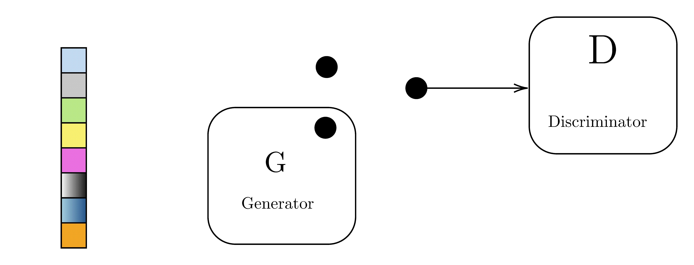

  * [nn-gan_parts+neuralnet.tex](https://github.com/walmes/Tikz/blob/master/src/nn-gan_parts+neuralnet.pgf)

```tex
\documentclass[border=10pt]{standalone}
\usepackage{tikz}

\begin{document}


% Gradient Info
  
\tikzset {_4c6h9fmv2/.code = {\pgfsetadditionalshadetransform{ \pgftransformshift{\pgfpoint{0 bp } { 0 bp }  }  \pgftransformrotate{0 }  \pgftransformscale{2 }  }}}
\pgfdeclarehorizontalshading{_w5gdki77u}{150bp}{rgb(0bp)=(1,1,1);
rgb(37.5bp)=(1,1,1);
rgb(62.5bp)=(0,0,0);
rgb(100bp)=(0,0,0)}
\tikzset{_flphwwo2w/.code = {\pgfsetadditionalshadetransform{\pgftransformshift{\pgfpoint{0 bp } { 0 bp }  }  \pgftransformrotate{0 }  \pgftransformscale{2 } }}}
\pgfdeclarehorizontalshading{_mxyd2nws7} {150bp} {color(0bp)=(transparent!0);
color(37.5bp)=(transparent!0);
color(62.5bp)=(transparent!10);
color(100bp)=(transparent!10) } 
\pgfdeclarefading{_atyxpg39b}{\tikz \fill[shading=_mxyd2nws7,_flphwwo2w] (0,0) rectangle (50bp,50bp); } 

% Gradient Info
  
\tikzset {_1vv4aec2h/.code = {\pgfsetadditionalshadetransform{ \pgftransformshift{\pgfpoint{0 bp } { 0 bp }  }  \pgftransformrotate{0 }  \pgftransformscale{2 }  }}}
\pgfdeclarehorizontalshading{_sprp2j4ay}{150bp}{rgb(0bp)=(0.65,0.81,0.87);
rgb(37.5bp)=(0.65,0.81,0.87);
rgb(62.5bp)=(0.14,0.33,0.54);
rgb(100bp)=(0.14,0.33,0.54)}
\tikzset{every picture/.style={line width=0.75pt}} %set default line width to 0.75pt        

\begin{tikzpicture}[x=0.75pt,y=0.75pt,yscale=-1,xscale=1]
%uncomment if require: \path (0,386.25); %set diagram left start at 0, and has height of 386.25

%Rounded Rect [id:dp8427758470201833] 
\draw   (388.63,108.07) .. controls (388.63,95.88) and (398.51,86) .. (410.7,86) -- (485.57,86) .. controls (497.75,86) and (507.63,95.88) .. (507.63,108.07) -- (507.63,174.27) .. controls (507.63,186.45) and (497.75,196.33) .. (485.57,196.33) -- (410.7,196.33) .. controls (398.51,196.33) and (388.63,186.45) .. (388.63,174.27) -- cycle ;
%Rounded Rect [id:dp3169403847789256] 
\draw   (129.63,181.07) .. controls (129.63,168.88) and (139.51,159) .. (151.7,159) -- (226.57,159) .. controls (238.75,159) and (248.63,168.88) .. (248.63,181.07) -- (248.63,247.27) .. controls (248.63,259.45) and (238.75,269.33) .. (226.57,269.33) -- (151.7,269.33) .. controls (139.51,269.33) and (129.63,259.45) .. (129.63,247.27) -- cycle ;

%Shape: Circle [id:dp7450020212232851] 
\draw  [fill={rgb, 255:red, 0; green, 0; blue, 0 }  ,fill opacity=1 ] (217,126.32) .. controls (217,121.72) and (220.72,118) .. (225.32,118) .. controls (229.91,118) and (233.63,121.72) .. (233.63,126.32) .. controls (233.63,130.91) and (229.91,134.63) .. (225.32,134.63) .. controls (220.72,134.63) and (217,130.91) .. (217,126.32) -- cycle ;
%Shape: Circle [id:dp005827607772636467] 
\draw  [fill={rgb, 255:red, 0; green, 0; blue, 0 }  ,fill opacity=1 ] (216,175.32) .. controls (216,170.72) and (219.72,167) .. (224.32,167) .. controls (228.91,167) and (232.63,170.72) .. (232.63,175.32) .. controls (232.63,179.91) and (228.91,183.63) .. (224.32,183.63) .. controls (219.72,183.63) and (216,179.91) .. (216,175.32) -- cycle ;
%Shape: Circle [id:dp34524209173568676] 
\draw  [fill={rgb, 255:red, 0; green, 0; blue, 0 }  ,fill opacity=1 ] (289.32,143.33) .. controls (289.32,138.74) and (293.04,135.02) .. (297.63,135.02) .. controls (302.23,135.02) and (305.95,138.74) .. (305.95,143.33) .. controls (305.95,147.93) and (302.23,151.65) .. (297.63,151.65) .. controls (293.04,151.65) and (289.32,147.93) .. (289.32,143.33) -- cycle ;
%Straight Lines [id:da8271448645768573] 
\draw    (297.63,143.33) -- (385.32,143.33) ;
\draw [shift={(387.32,143.33)}, rotate = 180] [color={rgb, 255:red, 0; green, 0; blue, 0 }  ][line width=0.75]    (10.93,-3.29) .. controls (6.95,-1.4) and (3.31,-0.3) .. (0,0) .. controls (3.31,0.3) and (6.95,1.4) .. (10.93,3.29)   ;

%Shape: Square [id:dp7469087349202225] 
\draw  [fill={rgb, 255:red, 74; green, 144; blue, 226 }  ,fill opacity=0.34 ] (11.32,110.82) -- (31.5,110.82) -- (31.5,131) -- (11.32,131) -- cycle ;
%Shape: Square [id:dp2906273668048538] 
\draw  [fill={rgb, 255:red, 155; green, 155; blue, 155 }  ,fill opacity=0.56 ] (11.32,131) -- (31.5,131) -- (31.5,151.18) -- (11.32,151.18) -- cycle ;
%Shape: Square [id:dp0257238778260086] 
\draw  [fill={rgb, 255:red, 184; green, 233; blue, 134 }  ,fill opacity=1 ] (11.32,151.18) -- (31.5,151.18) -- (31.5,171.37) -- (11.32,171.37) -- cycle ;
%Shape: Square [id:dp34631290295164263] 
\draw  [fill={rgb, 255:red, 248; green, 231; blue, 28 }  ,fill opacity=0.63 ] (11.32,171.37) -- (31.5,171.37) -- (31.5,191.55) -- (11.32,191.55) -- cycle ;
%Shape: Square [id:dp7099563053307321] 
\path  [shading=_w5gdki77u,_4c6h9fmv2,path fading= _atyxpg39b ,fading transform={xshift=2}] (11.32,211.73) -- (31.5,211.73) -- (31.5,231.92) -- (11.32,231.92) -- cycle ; % for fading 
 \draw   (11.32,211.73) -- (31.5,211.73) -- (31.5,231.92) -- (11.32,231.92) -- cycle ; % for border 

%Shape: Square [id:dp277447687834944] 
\path  [shading=_sprp2j4ay,_1vv4aec2h] (11.32,231.92) -- (31.5,231.92) -- (31.5,252.1) -- (11.32,252.1) -- cycle ; % for fading 
 \draw   (11.32,231.92) -- (31.5,231.92) -- (31.5,252.1) -- (11.32,252.1) -- cycle ; % for border 

%Shape: Square [id:dp2517468749584255] 
\draw  [fill={rgb, 255:red, 245; green, 166; blue, 35 }  ,fill opacity=1 ] (11.32,252.1) -- (31.5,252.1) -- (31.5,272.28) -- (11.32,272.28) -- cycle ;
%Shape: Square [id:dp7774821387369513] 
\draw  [fill={rgb, 255:red, 224; green, 16; blue, 203 }  ,fill opacity=0.6 ] (11.32,191.55) -- (31.5,191.55) -- (31.5,211.73) -- (11.32,211.73) -- cycle ;

% Text Node
\draw (448,112) node [scale=1.7280000000000002] [align=left] {{\Large D}};
% Text Node
\draw (443.75,170) node  [align=left] {Discriminator};
% Text Node
\draw (184,203) node [scale=1.7280000000000002] [align=left] {G};
% Text Node
\draw (185.75,236) node  [align=left] {Generator};


\end{tikzpicture}


\end{document}
```
****


  * [nn-gan_two_gan_types+neuralnet.tex](https://github.com/walmes/Tikz/blob/master/src/nn-gan_two_gan_types+neuralnet.pgf)

```tex
\documentclass[border=10pt]{standalone}
\usepackage{tikz}

\begin{document}


\tikzset{every picture/.style={line width=0.75pt}} %set default line width to 0.75pt        

\begin{tikzpicture}[x=0.75pt,y=0.75pt,yscale=-1,xscale=1]
%uncomment if require: \path (0,300); %set diagram left start at 0, and has height of 300

%Rounded Same Side Corner Rect [id:dp09824487187603104] 
\draw  [fill={rgb, 255:red, 167; green, 189; blue, 216 }  ,fill opacity=1 ] (59,53.17) .. controls (59,48.75) and (62.58,45.17) .. (67,45.17) -- (121,45.17) .. controls (125.42,45.17) and (129,48.75) .. (129,53.17) -- (129,85.17) .. controls (129,85.17) and (129,85.17) .. (129,85.17) -- (59,85.17) .. controls (59,85.17) and (59,85.17) .. (59,85.17) -- cycle ;

%Straight Lines [id:da3936283121049964] 
\draw [line width=1.5]    (94,46.37) -- (94,27.17) ;
\draw [shift={(94,24.17)}, rotate = 450] [fill={rgb, 255:red, 0; green, 0; blue, 0 }  ][line width=1.5]  [draw opacity=0] (11.61,-5.58) -- (0,0) -- (11.61,5.58) -- cycle    ;

%Straight Lines [id:da20962861468486604] 
\draw [line width=1.5]    (94,108.37) -- (94,89.17) ;
\draw [shift={(94,86.17)}, rotate = 450] [fill={rgb, 255:red, 0; green, 0; blue, 0 }  ][line width=1.5]  [draw opacity=0] (11.61,-5.58) -- (0,0) -- (11.61,5.58) -- cycle    ;


%Rounded Same Side Corner Rect [id:dp23742764202945832] 
\draw  [fill={rgb, 255:red, 236; green, 127; blue, 141 }  ,fill opacity=1 ] (111,184.5) .. controls (111,180.08) and (114.58,176.5) .. (119,176.5) -- (173,176.5) .. controls (177.42,176.5) and (181,180.08) .. (181,184.5) -- (181,216.5) .. controls (181,216.5) and (181,216.5) .. (181,216.5) -- (111,216.5) .. controls (111,216.5) and (111,216.5) .. (111,216.5) -- cycle ;

%Shape: Circle [id:dp9124405398322727] 
\draw   (133.5,260.5) .. controls (133.5,253.6) and (139.1,248) .. (146,248) .. controls (152.9,248) and (158.5,253.6) .. (158.5,260.5) .. controls (158.5,267.4) and (152.9,273) .. (146,273) .. controls (139.1,273) and (133.5,267.4) .. (133.5,260.5) -- cycle ;

%Straight Lines [id:da13727591026438046] 
\draw    (47,128.5) -- (47,118.37) -- (147,118.5) -- (147,128.5) ;


%Shape: Circle [id:dp18766521903761446] 
\draw   (34.5,141.5) .. controls (34.5,134.6) and (40.1,129) .. (47,129) .. controls (53.9,129) and (59.5,134.6) .. (59.5,141.5) .. controls (59.5,148.4) and (53.9,154) .. (47,154) .. controls (40.1,154) and (34.5,148.4) .. (34.5,141.5) -- cycle ;

%Straight Lines [id:da802599291550045] 
\draw [line width=1.5]    (147,176.7) -- (147,157.5) ;
\draw [shift={(147,154.5)}, rotate = 450] [fill={rgb, 255:red, 0; green, 0; blue, 0 }  ][line width=1.5]  [draw opacity=0] (11.61,-5.58) -- (0,0) -- (11.61,5.58) -- cycle    ;

%Straight Lines [id:da6629044704219691] 
\draw [line width=1.5]    (94,108.37) -- (94,118.37) ;


%Rounded Same Side Corner Rect [id:dp8414166975508496] 
\draw  [fill={rgb, 255:red, 167; green, 189; blue, 216 }  ,fill opacity=1 ] (280,52.8) .. controls (280,48.38) and (283.58,44.8) .. (288,44.8) -- (342,44.8) .. controls (346.42,44.8) and (350,48.38) .. (350,52.8) -- (350,84.8) .. controls (350,84.8) and (350,84.8) .. (350,84.8) -- (280,84.8) .. controls (280,84.8) and (280,84.8) .. (280,84.8) -- cycle ;

%Straight Lines [id:da2585894594076309] 
\draw [line width=1.5]    (315,46) -- (315,26.8) ;
\draw [shift={(315,23.8)}, rotate = 450] [fill={rgb, 255:red, 0; green, 0; blue, 0 }  ][line width=1.5]  [draw opacity=0] (11.61,-5.58) -- (0,0) -- (11.61,5.58) -- cycle    ;

%Straight Lines [id:da46888126052976953] 
\draw [line width=1.5]    (315,108) -- (315,88.8) ;
\draw [shift={(315,85.8)}, rotate = 450] [fill={rgb, 255:red, 0; green, 0; blue, 0 }  ][line width=1.5]  [draw opacity=0] (11.61,-5.58) -- (0,0) -- (11.61,5.58) -- cycle    ;

%Straight Lines [id:da8917552789067931] 
\draw [line width=1.5]    (315,108) -- (315,118) ;


%Rounded Same Side Corner Rect [id:dp5374022902949864] 
\draw  [fill={rgb, 255:red, 236; green, 127; blue, 141 }  ,fill opacity=1 ] (331,185.5) .. controls (331,181.08) and (334.58,177.5) .. (339,177.5) -- (393,177.5) .. controls (397.42,177.5) and (401,181.08) .. (401,185.5) -- (401,217.5) .. controls (401,217.5) and (401,217.5) .. (401,217.5) -- (331,217.5) .. controls (331,217.5) and (331,217.5) .. (331,217.5) -- cycle ;

%Shape: Circle [id:dp15401041449631925] 
\draw   (355,260.5) .. controls (355,253.6) and (360.6,248) .. (367.5,248) .. controls (374.4,248) and (380,253.6) .. (380,260.5) .. controls (380,267.4) and (374.4,273) .. (367.5,273) .. controls (360.6,273) and (355,267.4) .. (355,260.5) -- cycle ;

%Straight Lines [id:da7442630597870975] 
\draw    (267,129.5) -- (267,119.37) -- (367,119.5) -- (367,129.5) ;


%Shape: Circle [id:dp5737171836404196] 
\draw   (254.5,142.5) .. controls (254.5,135.6) and (260.1,130) .. (267,130) .. controls (273.9,130) and (279.5,135.6) .. (279.5,142.5) .. controls (279.5,149.4) and (273.9,155) .. (267,155) .. controls (260.1,155) and (254.5,149.4) .. (254.5,142.5) -- cycle ;

%Straight Lines [id:da4180267705785833] 
\draw [line width=1.5]    (367,177.7) -- (367,158.5) ;
\draw [shift={(367,155.5)}, rotate = 450] [fill={rgb, 255:red, 0; green, 0; blue, 0 }  ][line width=1.5]  [draw opacity=0] (11.61,-5.58) -- (0,0) -- (11.61,5.58) -- cycle    ;

%Shape: Circle [id:dp1910511651314143] 
\draw   (417.67,261) .. controls (417.67,254.1) and (423.26,248.5) .. (430.17,248.5) .. controls (437.07,248.5) and (442.67,254.1) .. (442.67,261) .. controls (442.67,267.9) and (437.07,273.5) .. (430.17,273.5) .. controls (423.26,273.5) and (417.67,267.9) .. (417.67,261) -- cycle ;
%Straight Lines [id:da4651457466304051] 
\draw    (430,107) -- (430,247.5) ;


%Straight Lines [id:da5203121766050092] 
\draw [line width=1.5]    (366.33,238.5) -- (366.33,219.3) ;
\draw [shift={(366.33,216.3)}, rotate = 450] [fill={rgb, 255:red, 0; green, 0; blue, 0 }  ][line width=1.5]  [draw opacity=0] (11.61,-5.58) -- (0,0) -- (11.61,5.58) -- cycle    ;

%Straight Lines [id:da937462245399049] 
\draw [line width=1.5]    (366.33,238.5) -- (366.33,248.5) ;


%Straight Lines [id:da9479077607901114] 
\draw    (368.33,238.5) -- (430,238.5) ;

\draw [shift={(366.33,238.5)}, rotate = 0] [fill={rgb, 255:red, 0; green, 0; blue, 0 }  ][line width=0.75]  [draw opacity=0] (10.72,-5.15) -- (0,0) -- (10.72,5.15) -- (7.12,0) -- cycle    ;
%Straight Lines [id:da5439740708699127] 
\draw    (318.33,107.98) -- (430,107) ;

\draw [shift={(316.33,108)}, rotate = 359.5] [fill={rgb, 255:red, 0; green, 0; blue, 0 }  ][line width=0.75]  [draw opacity=0] (10.72,-5.15) -- (0,0) -- (10.72,5.15) -- (7.12,0) -- cycle    ;
%Straight Lines [id:da9106477946558591] 
\draw [line width=1.5]    (146,238.5) -- (146,219.3) ;
\draw [shift={(146,216.3)}, rotate = 450] [fill={rgb, 255:red, 0; green, 0; blue, 0 }  ][line width=1.5]  [draw opacity=0] (11.61,-5.58) -- (0,0) -- (11.61,5.58) -- cycle    ;

%Straight Lines [id:da3221761369788204] 
\draw [line width=1.5]    (146,238.5) -- (146,248.5) ;


% Text Node
\draw (146,196.5) node [scale=1.7280000000000002] [align=left] {G};
% Text Node
\draw (147,140.5) node   {$G( z)$};
% Text Node
\draw (148,258.5) node   {$z$};
% Text Node
\draw (94,65.17) node [scale=1.7280000000000002] [align=left] {D};
% Text Node
\draw (161.5,118.5) node [scale=0.8,color={rgb, 255:red, 155; green, 155; blue, 155 }  ,opacity=1 ] [align=left] {fake};
% Text Node
\draw (32.5,117.5) node [scale=0.8,color={rgb, 255:red, 155; green, 155; blue, 155 }  ,opacity=1 ] [align=left] {real};
% Text Node
\draw (47.5,138) node   {$x$};
% Text Node
\draw (96,11.83) node  [align=left] {real/fake};
% Text Node
\draw (114.17,289) node [scale=0.8] [align=left] {a) Generative Adversarial Networks};
% Text Node
\draw (367,141.5) node   {$G( z)$};
% Text Node
\draw (381.5,119.5) node [scale=0.8,color={rgb, 255:red, 155; green, 155; blue, 155 }  ,opacity=1 ] [align=left] {fake};
% Text Node
\draw (252.5,118.5) node [scale=0.8,color={rgb, 255:red, 155; green, 155; blue, 155 }  ,opacity=1 ] [align=left] {real};
% Text Node
\draw (316,12.83) node  [align=left] {real/fake};
% Text Node
\draw (354.67,289) node [scale=0.8] [align=left] {b) Conditional GAN};
% Text Node
\draw (267.5,139) node   {$x$};
% Text Node
\draw (369.5,258.5) node   {$z$};
% Text Node
\draw (366,197.5) node [scale=1.7280000000000002] [align=left] {G};
% Text Node
\draw (315,64.8) node [scale=1.7280000000000002] [align=left] {D};
% Text Node
\draw (432.17,259) node   {$c$};


\end{tikzpicture}


\end{document}
```
****


  * [nn-gan_vertical+neuralnet.tex](https://github.com/walmes/Tikz/blob/master/src/nn-gan_vertical+neuralnet.pgf)

```tex
\documentclass[border=10pt]{standalone}
\usepackage{tikz}

\begin{document}


\tikzset{every picture/.style={line width=0.75pt}} %set default line width to 0.75pt        

\begin{tikzpicture}[x=0.75pt,y=0.75pt,yscale=-1,xscale=1]
%uncomment if require: \path (0,300); %set diagram left start at 0, and has height of 300

%Rounded Same Side Corner Rect [id:dp2451362198380881] 
\draw  [fill={rgb, 255:red, 167; green, 189; blue, 216 }  ,fill opacity=1 ] (79,54.17) .. controls (79,49.75) and (82.58,46.17) .. (87,46.17) -- (141,46.17) .. controls (145.42,46.17) and (149,49.75) .. (149,54.17) -- (149,86.17) .. controls (149,86.17) and (149,86.17) .. (149,86.17) -- (79,86.17) .. controls (79,86.17) and (79,86.17) .. (79,86.17) -- cycle ;

%Straight Lines [id:da14573772274169616] 
\draw [line width=1.5]    (114,47.37) -- (114,28.17) ;
\draw [shift={(114,25.17)}, rotate = 450] [fill={rgb, 255:red, 0; green, 0; blue, 0 }  ][line width=1.5]  [draw opacity=0] (11.61,-5.58) -- (0,0) -- (11.61,5.58) -- cycle    ;

%Straight Lines [id:da7579961352080994] 
\draw [line width=1.5]    (114,109.37) -- (114,90.17) ;
\draw [shift={(114,87.17)}, rotate = 450] [fill={rgb, 255:red, 0; green, 0; blue, 0 }  ][line width=1.5]  [draw opacity=0] (11.61,-5.58) -- (0,0) -- (11.61,5.58) -- cycle    ;


%Rounded Same Side Corner Rect [id:dp27437364893503646] 
\draw  [fill={rgb, 255:red, 236; green, 127; blue, 141 }  ,fill opacity=1 ] (131,185.5) .. controls (131,181.08) and (134.58,177.5) .. (139,177.5) -- (193,177.5) .. controls (197.42,177.5) and (201,181.08) .. (201,185.5) -- (201,217.5) .. controls (201,217.5) and (201,217.5) .. (201,217.5) -- (131,217.5) .. controls (131,217.5) and (131,217.5) .. (131,217.5) -- cycle ;

%Shape: Circle [id:dp6172800122901183] 
\draw   (153.5,261.5) .. controls (153.5,254.6) and (159.1,249) .. (166,249) .. controls (172.9,249) and (178.5,254.6) .. (178.5,261.5) .. controls (178.5,268.4) and (172.9,274) .. (166,274) .. controls (159.1,274) and (153.5,268.4) .. (153.5,261.5) -- cycle ;

%Straight Lines [id:da8111485597522028] 
\draw    (67,129.5) -- (67,119.37) -- (167,119.5) -- (167,129.5) ;


%Shape: Circle [id:dp5550396643085889] 
\draw   (54.5,142.5) .. controls (54.5,135.6) and (60.1,130) .. (67,130) .. controls (73.9,130) and (79.5,135.6) .. (79.5,142.5) .. controls (79.5,149.4) and (73.9,155) .. (67,155) .. controls (60.1,155) and (54.5,149.4) .. (54.5,142.5) -- cycle ;

%Straight Lines [id:da4358037156768244] 
\draw [line width=1.5]    (167,177.7) -- (167,158.5) ;
\draw [shift={(167,155.5)}, rotate = 450] [fill={rgb, 255:red, 0; green, 0; blue, 0 }  ][line width=1.5]  [draw opacity=0] (11.61,-5.58) -- (0,0) -- (11.61,5.58) -- cycle    ;

%Straight Lines [id:da35373187835236874] 
\draw [line width=1.5]    (114,109.37) -- (114,119.37) ;


%Straight Lines [id:da1620841210006193] 
\draw [line width=1.5]    (166,239.5) -- (166,220.3) ;
\draw [shift={(166,217.3)}, rotate = 450] [fill={rgb, 255:red, 0; green, 0; blue, 0 }  ][line width=1.5]  [draw opacity=0] (11.61,-5.58) -- (0,0) -- (11.61,5.58) -- cycle    ;

%Straight Lines [id:da9258346349543058] 
\draw [line width=1.5]    (166,239.5) -- (166,249.5) ;


% Text Node
\draw (167,141.5) node   {$G( z)$};
% Text Node
\draw (181.5,119.5) node [scale=0.8,color={rgb, 255:red, 155; green, 155; blue, 155 }  ,opacity=1 ] [align=left] {fake};
% Text Node
\draw (52.5,118.5) node [scale=0.8,color={rgb, 255:red, 155; green, 155; blue, 155 }  ,opacity=1 ] [align=left] {real};
% Text Node
\draw (116,12.83) node  [align=left] {real/fake};
% Text Node
\draw (134.17,290) node [scale=0.8] [align=left] {a) Generative Adversarial Networks};
% Text Node
\draw (67.5,139) node   {$x$};
% Text Node
\draw (168,259.5) node   {$z$};
% Text Node
\draw (166,197.5) node [scale=1.7280000000000002] [align=left] {G};
% Text Node
\draw (114,66.17) node [scale=1.7280000000000002] [align=left] {D};


\end{tikzpicture}


\end{document}
```
****

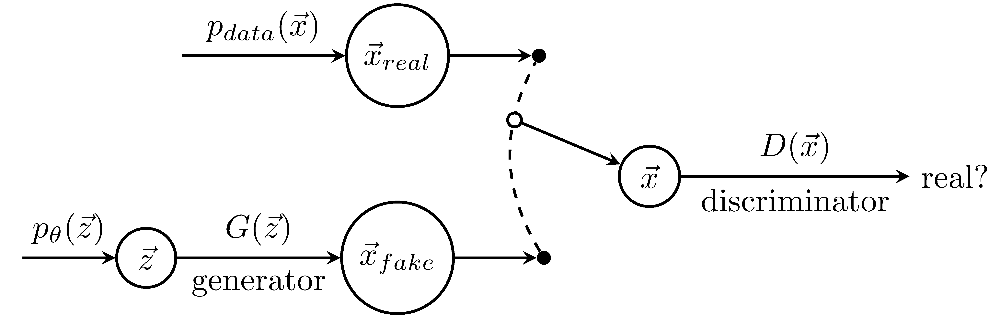

  * [nn-generative_adversarial_network_manual_net+neuralnet.tex](https://github.com/walmes/Tikz/blob/master/src/nn-generative_adversarial_network_manual_net+neuralnet.pgf)

```tex
\documentclass[crop,tikz]{standalone}
\usepackage{tikz}

\usetikzlibrary{positioning}

\begin{document}
\begin{tikzpicture}

	\node[circle, draw, thick] (z) {$\vec{z}$};
	\node[circle, draw, thick, right=5em of z] (x) {$\vec{x}_{fake}$};
	\draw[-stealth, thick] (z) -- node[above] {$G(\vec{z})$} node[below] {generator} (x);
	\node[left=of z] (i) {};
	\draw[-stealth, thick] (i) -- node[above] {$p_\theta(\vec{z})$} (z);
	\node[above=of x, circle, draw, thick] (xt) {$\vec{x}_{real}$};
	\node[left=5em of xt] (it) {};
	\draw[-stealth, thick] (it) -- node[above] {$p_{data}(\vec{x})$} (xt);
	\node[circle, draw, thick, right=5em of x, yshift=2.5em] (D) {$\vec{x}$};
	\node[right=7em of D] (out) {real?};
	\draw[-stealth, thick] (D) -- node[above] {$D(\vec{x})$} node[below] {discriminator} (out);
			
	\node[right=2.5em of x, circle, fill, inner sep=0.15em] (pt1) {};
	\node[right=2.5em of xt, circle, fill, inner sep=0.15em] (pt2) {};
			
	\draw[dashed, thick] (pt1) edge[bend left] (pt2);
			
	\node[circle, draw, thick, fill=white, inner sep=0.15em] at ([xshift=-0.9em, yshift=4em]pt1.north) (pt3) {};
			
	\draw[-stealth, thick] (x) -- (pt1);
	\draw[-stealth, thick] (xt) -- (pt2);
	\draw[-stealth, thick] (pt3) -- (D);

\end{tikzpicture}
\end{document}
```
****


  * [nn-generator+neuralnet+matrix.tex](https://github.com/walmes/Tikz/blob/master/src/nn-generator+neuralnet+matrix.pgf)

```tex
\documentclass[landscape]{article}
\usepackage{tikz}

%%%<
\usepackage{verbatim}
\usepackage[active,tightpage]{preview}
\PreviewEnvironment{tikzpicture}
\setlength\PreviewBorder{5pt}%
%%%>

\usepackage[margin=1cm]{geometry}
\usepackage{tikz,pgfplots,pgf}
\usetikzlibrary{matrix,shapes,arrows,positioning}

\begin{document}


\begin{figure}[htp]
\centering
\begin{tikzpicture}[
plain/.style={
  draw=none,
  fill=none,
  },
dot/.style={draw,shape=circle,minimum size=3pt,inner sep=0,fill=black
  },
net/.style={
  matrix of nodes,
  nodes={
    draw,
    circle,
    inner sep=8.5pt
    },
  nodes in empty cells,
  column sep=0.6cm,
  row sep=-11pt
  },
>=latex
]
\matrix[net] (mat)
{
|[plain]| \parbox{1cm}{\centering Input\\layer} 
          & |[plain]| \parbox{1cm}{\centering Hidden\\layer} 
                       & |[plain]| \parbox{1cm}{\centering Output\\layer} \\
          & |[plain]|                 \\
|[plain]| &            & |[plain]|    \\
          & |[plain]|  &              \\
|[plain]| & |[dot]|                   \\
          & |[plain]|  & |[dot]|      \\
|[plain]| & |[dot]|    & |[plain]|    \\
|[dot]|   & |[plain]|  & |[dot]|      \\
|[dot]|   & |[dot]|    & |[plain]|    \\
|[dot]|   & |[plain]|  &              \\
|[plain]| &            & |[plain]|    \\
          & |[plain]|                 \\
};
\foreach \ai/\mi in {2/B01,4/B02,6/B03,12/Bn}
  \draw[<-] (mat-\ai-1) -- node[above] {\mi} +(-1cm,0);
\foreach \ai in {2,4,6,12}
{\foreach \aii/\mii in {3/H1,11/Hn}
  \draw[->] (mat-\ai-1) -- (mat-\aii-2) node[yshift=0.6cm] {\mii};
}
\foreach \ai in {3,11}
{  \draw[->] (mat-\ai-2) -- (mat-4-3);
  \draw[->] (mat-4-3) -- node[above] {Var1} +(1cm,0);}
\foreach \ai in {3,11}
{  \draw[->] (mat-\ai-2) -- (mat-10-3);
  \draw[->] (mat-10-3) -- node[above] {Varn} +(1cm,0);}
\end{tikzpicture}

\caption{ANN diagram for the Generator.}
\label{fig_m_3}
\end{figure}

\end{document}
```
****


  * [nn-hopfield_auto_net+neuralnet+foreach+scope+learn+style+command.tex](https://github.com/walmes/Tikz/blob/master/src/nn-hopfield_auto_net+neuralnet+foreach+scope+learn+style+command.pgf)

```tex
% https://raw.githubusercontent.com/MartinThoma/LaTeX-examples/master/tikz/hopfield-network/hopfield-network.tex
\documentclass[varwidth=true, border=2pt]{standalone}
\usepackage{tikz}

\tikzstyle{neuron}=[draw,circle,minimum size=20pt,inner sep=0pt, fill=white]
\tikzstyle{stateTransition}=[very thick]
\tikzstyle{learned}=[text=red]

\begin{document}
    \newcommand\n{5}
    \begin{tikzpicture}[scale=1.3]
        \begin{scope}[rotate=17]
        %the multiplication with floats is not possible. Thus I split the loop in two.
        \foreach \number in {1,...,\n}{
            \node[neuron] (N-\number) at ({\number*(360/\n)}:1.5cm) {$x_\number$};
        }

        \foreach \number in {1,...,\n}{
            \foreach \y in {1,...,\n}{
                \draw[stateTransition] (N-\number) -- (N-\y);
            }
        }
        \end{scope}
        \begin{scope}[rotate=-1]
        \draw[learned,stateTransition] (N-1) -- (N-2) node [midway,above=-0.15cm,sloped] {$w_{1,2}$};
        \draw[learned,stateTransition] (N-1) -- (N-5) node [midway,above=-0.15cm,sloped] {$w_{1,5}$};
        \end{scope}
    \end{tikzpicture}
\end{document}
```
****


  * [nn-neural_network-1h+neuralnet+foreach.tex](https://github.com/walmes/Tikz/blob/master/src/nn-neural_network-1h+neuralnet+foreach.pgf)

```tex
% http://www.texample.net/media/tikz/examples/TEX/neural-network.tex
\documentclass{standalone}

\usepackage{tikz}
\usepackage{verbatim}

\begin{comment}
:Title: Neural network
:Tags: Foreach

The ``\foreach`` command is very useful for quickly creating structured graphics
like this neural network diagram.

\end{comment}

\begin{document}
\pagestyle{empty}

\def\layersep{2.5cm}

\begin{tikzpicture}[shorten >=1pt,->,draw=black!50, node distance=\layersep]
    \tikzstyle{every pin edge}=[<-,shorten <=1pt]
    \tikzstyle{neuron}=[circle,fill=black!25,minimum size=17pt,inner sep=0pt]
    \tikzstyle{input neuron}=[neuron, fill=green!50];
    \tikzstyle{output neuron}=[neuron, fill=red!50];
    \tikzstyle{hidden neuron}=[neuron, fill=blue!50];
    \tikzstyle{annot} = [text width=4em, text centered]

    % Draw the input layer nodes
    \foreach \name / \y in {1,...,4}
    % This is the same as writing \foreach \name / \y in {1/1,2/2,3/3,4/4}
        \node[input neuron, pin=left:Input \#\y] (I-\name) at (0,-\y) {};

    % Draw the hidden layer nodes
    \foreach \name / \y in {1,...,5}
        \path[yshift=0.5cm]
            node[hidden neuron] (H-\name) at (\layersep,-\y cm) {};

    % Draw the output layer node
    \node[output neuron,pin={[pin edge={->}]right:Output}, right of=H-3] (O) {};

    % Connect every node in the input layer with every node in the
    % hidden layer.
    \foreach \source in {1,...,4}
        \foreach \dest in {1,...,5}
            \path (I-\source) edge (H-\dest);

    % Connect every node in the hidden layer with the output layer
    \foreach \source in {1,...,5}
        \path (H-\source) edge (O);

    % Annotate the layers
    \node[annot,above of=H-1, node distance=1cm] (hl) {Hidden layer};
    \node[annot,left of=hl] {Input layer};
    \node[annot,right of=hl] {Output layer};
\end{tikzpicture}
% End of code
\end{document}
```
****


  * [nn-stacked_blocks+neuralnet+3d+def+pgf+set+style.tex](https://github.com/walmes/Tikz/blob/master/src/nn-stacked_blocks+neuralnet+3d+def+pgf+set+style.pgf)

```tex
\documentclass[tikz]{standalone}

%% Language and font encodings
\usepackage[english]{babel}
\usepackage[utf8x]{inputenc}
\usepackage[T1]{fontenc}

\usepackage{xcolor}
\definecolor{darkblue}{HTML}{1f4e79}
\definecolor{lightblue}{HTML}{00b0f0}
\definecolor{salmon}{HTML}{ff9c6b}

\usetikzlibrary{backgrounds,calc,shadings,shapes.arrows,arrows,shapes.symbols,shadows,positioning,decorations.markings,backgrounds,arrows.meta}

% Define parallelepiped shape:
\makeatletter
\pgfkeys{/pgf/.cd,
  parallelepiped offset x/.initial=2mm,
  parallelepiped offset y/.initial=2mm
}
\pgfdeclareshape{parallelepiped}
{
  \inheritsavedanchors[from=rectangle] % this is nearly a rectangle
  \inheritanchorborder[from=rectangle]
  \inheritanchor[from=rectangle]{north}
  \inheritanchor[from=rectangle]{north west}
  \inheritanchor[from=rectangle]{north east}
  \inheritanchor[from=rectangle]{center}
  \inheritanchor[from=rectangle]{west}
  \inheritanchor[from=rectangle]{east}
  \inheritanchor[from=rectangle]{mid}
  \inheritanchor[from=rectangle]{mid west}
  \inheritanchor[from=rectangle]{mid east}
  \inheritanchor[from=rectangle]{base}
  \inheritanchor[from=rectangle]{base west}
  \inheritanchor[from=rectangle]{base east}
  \inheritanchor[from=rectangle]{south}
  \inheritanchor[from=rectangle]{south west}
  \inheritanchor[from=rectangle]{south east}
  \backgroundpath{
    % store lower right in xa/ya and upper right in xb/yb
    \southwest \pgf@xa=\pgf@x \pgf@ya=\pgf@y
    \northeast \pgf@xb=\pgf@x \pgf@yb=\pgf@y
    \pgfmathsetlength\pgfutil@tempdima{\pgfkeysvalueof{/pgf/parallelepiped
      offset x}}
    \pgfmathsetlength\pgfutil@tempdimb{\pgfkeysvalueof{/pgf/parallelepiped
      offset y}}
    \def\ppd@offset{\pgfpoint{\pgfutil@tempdima}{\pgfutil@tempdimb}}
    \pgfpathmoveto{\pgfqpoint{\pgf@xa}{\pgf@ya}}
    \pgfpathlineto{\pgfqpoint{\pgf@xb}{\pgf@ya}}
    \pgfpathlineto{\pgfqpoint{\pgf@xb}{\pgf@yb}}
    \pgfpathlineto{\pgfqpoint{\pgf@xa}{\pgf@yb}}
    \pgfpathclose
    \pgfpathmoveto{\pgfqpoint{\pgf@xb}{\pgf@ya}}
    \pgfpathlineto{\pgfpointadd{\pgfpoint{\pgf@xb}{\pgf@ya}}{\ppd@offset}}
    \pgfpathlineto{\pgfpointadd{\pgfpoint{\pgf@xb}{\pgf@yb}}{\ppd@offset}}
    \pgfpathlineto{\pgfpointadd{\pgfpoint{\pgf@xa}{\pgf@yb}}{\ppd@offset}}
    \pgfpathlineto{\pgfqpoint{\pgf@xa}{\pgf@yb}}
    \pgfpathmoveto{\pgfqpoint{\pgf@xb}{\pgf@yb}}
    \pgfpathlineto{\pgfpointadd{\pgfpoint{\pgf@xb}{\pgf@yb}}{\ppd@offset}}
  }
}
\makeatother

\tikzset{
  % Dark blue blocks
  block/.style={
    parallelepiped,fill=white, draw,
    minimum width=0.8cm,
    minimum height=2.4cm,
    parallelepiped offset x=0.5cm,
    parallelepiped offset y=0.5cm,
    path picture={
      \draw[top color=darkblue,bottom color=darkblue]
        (path picture bounding box.south west) rectangle 
        (path picture bounding box.north east);
    },
    text=white,
  },
  % Orange-ish blocks
  conv/.style={
    parallelepiped,fill=white, draw,
    minimum width=0.8cm,
    minimum height=2.4cm,
    parallelepiped offset x=0.5cm,
    parallelepiped offset y=0.5cm,
    path picture={
      \draw[top color=salmon,bottom color=salmon]
        (path picture bounding box.south west) rectangle 
        (path picture bounding box.north east);
    },
    text=white,
  },
  % Taller Light blue blocks:
  plate/.style={
    parallelepiped,fill=white, draw,
    minimum width=0.1cm,
    minimum height=7.4cm,
    parallelepiped offset x=0.5cm,
    parallelepiped offset y=0.5cm,
    path picture={
      \draw[top color=lightblue,bottom color=lightblue]
        (path picture bounding box.south west) rectangle 
        (path picture bounding box.north east);
    },
    text=white,
  },
  % Arrows between blocks:
  link/.style={
    color=lightblue,
    line width=2mm,
  },
}

\begin{document}

\begin{tikzpicture}
  % The order of blocks matters since some are partially hidden behind subsequent blocks.
  \node[conv](conv1){\rotatebox{90}{Conv}};
  \node[plate,right=0.2cm of conv1](plate1){};
  % yshift to align the bottom of that blocks with the previous taller block.
  \node[block,right=0.2cm of plate1,yshift=-2.5cm](resblock1){\rotatebox{90}{ResBlock}};
  \node[block,above=0.1cm of resblock1](resblock2){\rotatebox{90}{ResBlock}};
  \node[block,above=0.1cm of resblock2](resblock3){\rotatebox{90}{ResBlock}};
  \node[block,right=0.2cm of resblock1](x1){\rotatebox{90}{(X4)}};
  \node[block,above=0.1cm of x1](x2){\rotatebox{90}{(X3)}};
  \node[block,above=0.1cm of x2](x3){\rotatebox{90}{(X2)}};
  \node[plate,right=0.2cm of x2](plate2){};
  \node[block,right=0.6cm of x2](resblock4){\rotatebox{90}{ResBlock4}};
  \node[block,right=2cm of resblock4](resblock5){\rotatebox{90}{ResBlock5}};
  \node[conv,right=0.2cm of resblock5](conv2){\rotatebox{90}{Conv}};
  \draw [-,link] ([xshift=0.2cm,yshift=0.2cm]resblock4.east) -- ([yshift=0.2cm]resblock5.west);
  \draw [-triangle 60,link] ([xshift=0.2cm,yshift=0.2cm]conv2.east) -- ([xshift=1.5cm,yshift=0.2cm]conv2.east);
\end{tikzpicture}

\end{document}
```
****

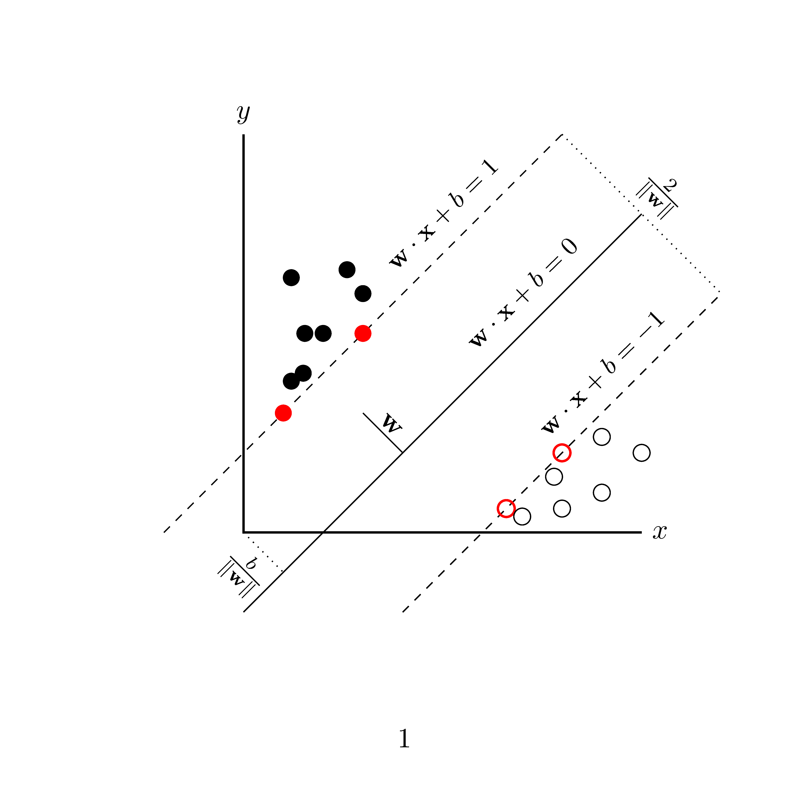

  * [nn-SVM_manual+neuralnet.tex](https://github.com/walmes/Tikz/blob/master/src/nn-SVM_manual+neuralnet.pgf)

```tex
\documentclass{article}
\usepackage[paperwidth=4in,paperheight=4in]{geometry}

\usepackage{tikz}


\begin{document}

\usetikzlibrary{arrows}
\begin{tikzpicture}
  % Draw axes
  \draw [thick] (0,5) node (yaxis) [above] {$y$}
        |- (5,0) node (xaxis) [right] {$x$};
  % draw line
  \draw (0,-1) -- (5,4); % y=x-1
  \draw[dashed] (-1,0) -- (4,5); % y=x+1
  \draw[dashed] (2,-1) -- (6,3); % y=x-3
  % \draw labels
  \draw (3.5,3) node[rotate=45,font=\small] 
        {$\mathbf{w}\cdot \mathbf{x} + b = 0$};
  \draw (2.5,4) node[rotate=45,font=\small] 
        {$\mathbf{w}\cdot \mathbf{x} + b = 1$};
  \draw (4.5,2) node[rotate=45,font=\small] 
        {$\mathbf{w}\cdot \mathbf{x} + b = -1$};
  % draw distance
  \draw[dotted] (4,5) -- (6,3);
  \draw (5.25,4.25) node[rotate=-45] {$\frac{2}{\Vert \mathbf{w} \Vert}$};
  \draw[dotted] (0,0) -- (0.5,-0.5);
  \draw (0,-0.5) node[rotate=-45] {$\frac{b}{\Vert \mathbf{w} \Vert}$};
  \draw (2,1) -- (1.5,1.5);
  \draw (1.85,1.35) node[rotate=-45] {$\mathbf{w}$};
  % draw negative dots
  \fill[red] (0.5,1.5) circle (3pt);
  \fill[red]   (1.5,2.5)   circle (3pt);
  \fill[black] (1,2.5)     circle (3pt);
  \fill[black] (0.75,2)    circle (3pt);
  \fill[black] (0.6,1.9)   circle (3pt);
  \fill[black] (0.77, 2.5) circle (3pt);
  \fill[black] (1.5,3)     circle (3pt);
  \fill[black] (1.3,3.3)   circle (3pt);
  \fill[black] (0.6,3.2)   circle (3pt);
  % draw positive dots
  \draw[red,thick] (4,1)     circle (3pt); 
  \draw[red,thick] (3.3,.3)  circle (3pt); 
  \draw[black]     (4.5,1.2) circle (3pt); 
  \draw[black]     (4.5,.5)  circle (3pt); 
  \draw[black]     (3.9,.7)  circle (3pt); 
  \draw[black]     (5,1)     circle (3pt); 
  \draw[black]     (3.5,.2)  circle (3pt); 
  \draw[black]     (4,.3)    circle (3pt); 
\end{tikzpicture}


\end{document}
```
****


  * [noise+diagram.tex](https://github.com/walmes/Tikz/blob/master/src/noise+diagram.pgf)

```tex
% http://www.texample.net/media/tikz/examples/TEX/noise-shaper.tex
% Title: Block diagram of Third order noise shaper in Compact Disc Players
% Author: Ramón Jaramillo
\documentclass[tikz,14pt,border=10pt]{standalone}
%%%<
\usepackage{verbatim}
%%%>
\begin{comment}
:Title: Block diagram of Third order noise shaper in Compact Disc Players
:Tags: Diagrams;Block diagrams;Electrical engineering
:Author: Ramón Jaramillo
:Slug: noise-shaper

This is a block diagram of a third-order noise shaper, circuit located inside
of a compact disc player.

Source: A fundamental introduction to the Compact Disc Player (1994), 
located in http://www.tc.umn.edu/~erick205/Papers/3011Paper.pdf, page 17
by Grant M. Erickson
\end{comment}
\usepackage{textcomp}
\usetikzlibrary{shapes,arrows}
\begin{document}
% Definition of blocks:
\tikzset{%
  block/.style    = {draw, thick, rectangle, minimum height = 3em,
    minimum width = 3em},
  sum/.style      = {draw, circle, node distance = 2cm}, % Adder
  input/.style    = {coordinate}, % Input
  output/.style   = {coordinate} % Output
}
% Defining string as labels of certain blocks.
\newcommand{\suma}{\Large$+$}
\newcommand{\inte}{$\displaystyle \int$}
\newcommand{\derv}{\huge$\frac{d}{dt}$}

\begin{tikzpicture}[auto, thick, node distance=2cm, >=triangle 45]
\draw
	% Drawing the blocks of first filter :
	node at (0,0)[right=-3mm]{\Large \textopenbullet}
	node [input, name=input1] {} 
	node [sum, right of=input1] (suma1) {\suma}
	node [block, right of=suma1] (inte1) {\inte}
         node at (6.8,0)[block] (Q1) {\Large $Q_1$}
         node [block, below of=inte1] (ret1) {\Large$T_1$};
    % Joining blocks. 
    % Commands \draw with options like [->] must be written individually
	\draw[->](input1) -- node {$X(Z)$}(suma1);
 	\draw[->](suma1) -- node {} (inte1);
	\draw[->](inte1) -- node {} (Q1);
	\draw[->](ret1) -| node[near end]{} (suma1);
	% Adder
\draw
	node at (5.4,-4) [sum, name=suma2] {\suma}
    	% Second stage of filter 
	node at  (1,-6) [sum, name=suma3] {\suma}
	node [block, right of=suma3] (inte2) {\inte}
	node [sum, right of=inte2] (suma4) {\suma}
	node [block, right of=suma4] (inte3) {\inte}
	node [block, right of=inte3] (Q2) {\Large$Q_2$}
	node at (9,-8) [block, name=ret2] {\Large$T_2$}
;
	% Joining the blocks of second filter
	\draw[->] (suma3) -- node {} (inte2);
	\draw[->] (inte2) -- node {} (suma4);
	\draw[->] (suma4) -- node {} (inte3);
	\draw[->] (inte3) -- node {} (Q2);
	\draw[->] (ret2) -| (suma3);
	\draw[->] (ret2) -| (suma4);
         % Third stage of filter:
	% Defining nodes:
\draw
	node at (11.5, 0) [sum, name=suma5]{\suma}
	node [output, right of=suma5]{}
	node [block, below of=suma5] (deriv1){\derv}
	node [output, right of=suma5] (sal2){}
;
	% Joining the blocks:
	\draw[->] (suma2) -| node {}(suma3);
	\draw[->] (Q1) -- (8,0) |- node {}(ret1);
	\draw[->] (8,0) |- (suma2);
	\draw[->] (5.4,0) -- (suma2);
	\draw[->] (Q1) -- node {}(suma5);
	\draw[->] (deriv1) -- node {}(suma5);
	\draw[->] (Q2) -| node {}(deriv1);
    	\draw[<->] (ret2) -| node {}(deriv1);
    	\draw[->] (suma5) -- node {$Y(Z)$}(sal2);
    	% Drawing nodes with \textbullet
\draw
	node at (8,0) {\textbullet} 
	node at (8,-2){\textbullet}
	node at (5.4,0){\textbullet}
    	node at (5,-8){\textbullet}
    	node at (11.5,-6){\textbullet}
    	;
	% Boxing and labelling noise shapers
	\draw [color=gray,thick](-0.5,-3) rectangle (9,1);
	\node at (-0.5,1) [above=5mm, right=0mm] {\textsc{first-order noise shaper}};
	\draw [color=gray,thick](-0.5,-9) rectangle (12.5,-5);
	\node at (-0.5,-9) [below=5mm, right=0mm] {\textsc{second-order noise shaper}};
\end{tikzpicture}
\end{document}
```
****

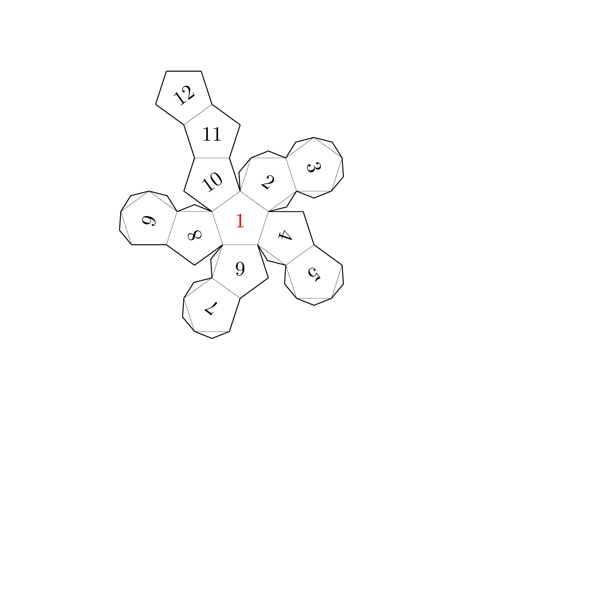

  * [paper_folding+misc+foreach.tex](https://github.com/walmes/Tikz/blob/master/src/paper_folding+misc+foreach.pgf)

```tex
%\documentclass[border=10pt]{standalone}
\documentclass{article}
\usepackage[paperwidth=4in,paperheight=4in]{geometry}
\usepackage{tikz}

\pagestyle{empty}

\begin{document}

\usetikzlibrary{folding}

\begin{tikzpicture}[transform shape]
		\tikzfoldingdodecahedron
		[folding line length=6mm,
		face 1={ \node[red] {1};},
		face 2={ \node {2};},
		face 3={ \node {3};},
		face 4={ \node {4};},
		face 5={ \node {5};},
		face 6={ \node {6};},
		face 7={ \node {7};},
		face 8={ \node {8};},
		face 9={ \node {9};},
		face 10={\node {10};},
		face 11={\node {11};},
		face 12={\node {12};}];
  \end{tikzpicture}


\end{document}
```
****


  * [physics-diagram-handshake.tex](https://github.com/walmes/Tikz/blob/master/src/physics-diagram-handshake.pgf)

```tex
\documentclass[tikz, border=5mm]{standalone}

\usetikzlibrary{arrows,shadows,positioning}

\begin{document}

\begin{tikzpicture}[font=\sffamily,>=stealth',thick,
commentl/.style={text width=3cm, align=right},
commentr/.style={commentl, align=left},]
\node[] (init) {\LARGE Initiator};
\node[right=1cm of init] (recv) {\LARGE Receiver};


\draw[->] ([yshift=-1.7cm]init.south) coordinate (fin1o) -- ([yshift=-.7cm]fin1o-|recv) coordinate (fin1e) node[pos=.3, above, sloped] {FIN};

\draw[->] ([yshift=-.3cm]fin1e) coordinate (ack1o) -- ([yshift=-.7cm]ack1o-|init) coordinate (ack1e) node[pos=.3, above, sloped] {ACK};

\draw[->] (ack1e-|recv) coordinate (fin2o) -- ([yshift=-.7cm]fin2o-|init) coordinate (fin2e) node[pos=.3, above, sloped] {FIN};

\draw[->] ([yshift=-.3cm]fin2e) coordinate (ack2o) -- ([yshift=-.7cm]ack2o-|recv) coordinate (ack2e) node[pos=.3, above, sloped] {ACK};

\draw[thick, shorten >=-1cm] (init) -- (init|-ack2e);
\draw[thick, shorten >=-1cm] (recv) -- (recv|-ack2e);

\draw[dotted] (recv.285)--([yshift=2mm]recv.285|-fin1e) coordinate[pos=.5] (aux1);

\draw[dotted] (init.255)--([yshift=2mm]init.255|-fin1o);

\draw[dotted] ([yshift=1mm]init.255|-fin2e) --([yshift=-5mm]init.255|-ack2e) coordinate (aux2);

\node[commentr, right =2mm of ack2e] {\textbf{CLOSED}};
\node[commentr, right =2mm of fin2o] {\textbf{LAST ACK}};
\node[below left = 0mm and 2mm of init.south, commentl]{\textbf{ESTABLISHED}\\[-1.5mm]{\itshape connection}};
\node[left = 2mm of fin1o.west, commentl]{{\itshape active close}\\[-1mm]\textbf{FIN\_WAIT\_1}};
\node[left = 2mm of ack1e.west, commentl]{\textbf{FIN\_WAIT\_2}};
\node[below left = -1mm and 2mm of fin2e.west, commentl]{\textbf{TIME\_WAIT}};
\node[below left = -1mm and 2mm of aux2-|init, commentl]{\textbf{CLOSED}};

\node[right = 2mm of recv|-aux1, commentr]{\textbf{ESTABLISHED}\\[-1.5mm]{\itshape connection}};
\node[right = 2mm of fin1e.west, commentr]{\textbf{CLOSE\_WAIT}\\[-1mm]{\itshape passive close}};
\end{tikzpicture}

\end{document}
```
****


  * [physics-solenoid.tex](https://github.com/walmes/Tikz/blob/master/src/physics-solenoid.pgf)

```tex
% https://wiki.physik.uzh.ch/cms/latex:tikz:solenoid
% Author: Izaak Neutelings (June 2018)
\documentclass[border=3pt,tikz]{standalone}

\usepackage{tikz}
\tikzset{>=latex} % for LaTeX arrow head
\usetikzlibrary{calc} 
\usetikzlibrary{patterns,snakes}

\begin{document}
\begin{tikzpicture}[scale=1]
  \def\R{0.8}
  \def\A{11}   % amplitude
  \def\s{6}    % coil segment length
  \def\L{8}    % coil length
  \def\a{0.5}  % coil segment aspect
  \def\dy{0.9} % vertical shift
  \def\dx{0.2} % horizontal shift
  \draw[snake=coil,thick,segment amplitude=2*\A,segment length=\s,segment aspect=\a]
    (0,0) -- (\L,0);
  \draw[<->,shorten >=5]
    (0,\dy) -- (\L,\dy) node[midway,above] {length $\ell$};
  \draw[snake=brace,mirror snake,segment amplitude=3]
    (0,-\dy) -- (\L,-\dy) node[midway,below=1] {$N$ turns};
  \draw[-,thick]
    (\L,0) -- (1.01*\L,0); % coil extension
  \draw[<->]
    (-\dx,0) -- (-\dx,\R) node[midway,left=6] {$R$};
\end{tikzpicture}
\end{document}
```
****

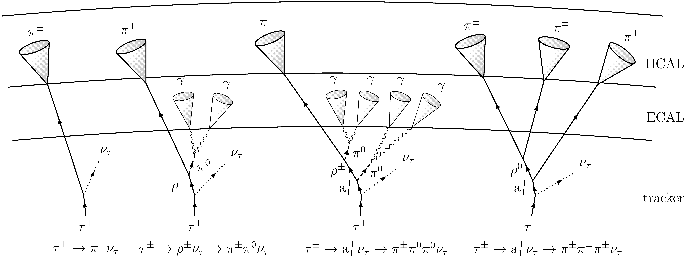

  * [physics-tau_decay_signatures+physics.tex](https://github.com/walmes/Tikz/blob/master/src/physics-tau_decay_signatures+physics.pgf)

```tex
% https://wiki.physik.uzh.ch/cms/latex:tikz:tau_decay_signatures
% Author: Izaak Neutelings (July 2017)

\documentclass{article}
\usepackage{amsmath} % for \text
\usepackage{tikz}
\tikzset{>=latex} % for LaTeX arrow head
%\definecolor{mylightred}{RGB}{255,200,200}
%\definecolor{mylightblue}{RGB}{172,188,63}
%\definecolor{mylightgreen}{RGB}{150,220,150}

% split figures into pages
\usepackage[active,tightpage]{preview}
\PreviewEnvironment{tikzpicture}
\setlength\PreviewBorder{1pt}%

% vertical custom shading
%https://tex.stackexchange.com/questions/191735/is-it-possible-to-define-the-position-of-top-bottom-and-middle-color-in-fill
\makeatletter
\tikzset{vertical custom shading/.code={%
  \pgfmathsetmacro\tikz@vcs@middle{#1}
  \pgfmathsetmacro\tikz@vcs@bottom{\tikz@vcs@middle/2}
  \pgfmathsetmacro\tikz@vcs@top{(100-\tikz@vcs@middle)/2+\tikz@vcs@middle}
  \pgfdeclareverticalshading[tikz@axis@top,tikz@axis@middle,tikz@axis@bottom]{newaxis}{100bp}{%
    color(0bp)=(tikz@axis@bottom);
    color(\tikz@vcs@bottom bp)=(tikz@axis@bottom);
    color(\tikz@vcs@middle bp)=(tikz@axis@middle);
    color(\tikz@vcs@top bp)=(tikz@axis@top);
    color(100bp)=(tikz@axis@top)}
    \pgfkeysalso{/tikz/shading=newaxis}
  }
}
\makeatother

\begin{document}


% arrow style
\usetikzlibrary{decorations.markings}
\tikzset{->-/.style={decoration={markings,
                               mark=at position .7 with {\arrow{>}}},
                               postaction={decorate}}}

% photon
\usetikzlibrary{decorations.pathmorphing}
\tikzset{photon/.style={decorate, decoration={snake,segment length=5,amplitude=1.1}}}

% cone style
\usetikzlibrary{shadows.blur}
\tikzset{mycone/.pic={
       \shadedraw[top color=white, bottom color=black!50,shading angle=50,vertical custom shading=10]
                    (-0.4,0.99) -- (0,0) -- (0.4,0.99);
       \shadedraw[top color=white, bottom color=black!20,shading angle=90]
                    (0,1) ellipse (0.4 and 0.12);}};


% TAU DECAY MODES
\begin{tikzpicture}[scale=0.9]
  
  \large
  \def\R{120}            % inner radius
  \def\hca{5}            % half central angle
  \def\hcl{\R*sin(\hca)} % half chord length c = 2Rsin(theta/2)
  \def\tracker{3}        % tracker
  \def\ECAL{4.8}         % ECAL
  \def\HCAL{7.2}         % HCAL
  \def\hclmax{(\R+\HCAL)*sin(\hca)} % mac
  
  % detectors
  \foreach \r in {\tracker,\ECAL,\HCAL}{
    \draw[thick] (0,\r) arc (90:90-\hca:\R+\r)
                 (0,\r) arc (90:90+\hca:\R+\r);
  }
  \node[left=0,above left] at ({1.08*\hclmax},{0.10*\tracker}) {tracker};
  \node[left=0,above left] at ({1.08*\hclmax},\tracker) {ECAL};
  \node[left=0,above left] at ({1.08*\hclmax},\ECAL) {HCAL};
  
  
  % DM 0
  \begin{scope}[shift={({-0.79*\hcl},0)}, rotate=6]
    \node[below] at (0,0) {$\tau^\pm$};
    \node[below=18] at (0,0) {$\tau^\pm\to\pi^\pm\nu_\tau$};
    \draw[->-,thick]                   % tau
      (0,0) -- (0,0.7) coordinate (tau);
    \draw[->-,dotted,thick,rotate=-30] % neutrinos
      (tau) -- +(0,1.3) node[right=6pt,above] {$\nu_\tau$};
    \draw[->-,       thick,rotate=12] % pion
      (tau) -- +(0,3.9) node[left=10,above=38] {$\pi^\pm$}
      pic[rotate=20,scale=1.2] {mycone};
  \end{scope}
  
  % DM 1
  \begin{scope}[shift={({-0.44*\hcl},0)}, rotate=1]
    \node[below] at (0,0) {$\tau^\pm$};
    \node[right=8pt,below=18] at (0,0) {$\tau^\pm\to\rho^\pm\nu_\tau\to\pi^\pm\pi^0\nu_\tau$};
    \draw[->-,thick]                   % tau
      (0,0) -- (0,0.7) coordinate (tau);
    \draw[->-,dotted,thick,rotate=-45] % neutrinos
      (tau) -- +(0,1.5) node[above right] {$\nu_\tau$};
    \draw[->-,       thick,rotate= 15] % rho
      (tau) -- +(0,0.7) coordinate (rho) node[midway,left] {$\rho^\pm$};
    \draw[->-,       thick,rotate= 24] % pion
      (rho) -- +(0,3.4) node[left=15,above=38] {$\pi^\pm$}
      pic[rotate=22,scale=1.2] {mycone};
    \draw[->-,densely dashed,thick,rotate=-18] % pion0
      (rho) -- +(0,0.7) coordinate (pion0) node[midway,right] {$\pi^0$};
    \draw[photon,rotate=10] % photon 1
      (pion0) -- +(0,0.9) node[left=8,above=32] {$\gamma$}
      pic[rotate=11.5,xscale=0.8] {mycone};
    \draw[photon,rotate=-30] % photon 2
      (pion0) -- +(0,1.0) node[right=15,above=30] {$\gamma$}
      pic[rotate=-24,xscale=0.8] {mycone};
  \end{scope}
  
  % DM 2
  \begin{scope}[shift={({0.09*\hcl},0)}, rotate=-3]
    \node[below] (0,0) {$\tau^\pm$};
    \node[right=14pt,below=18] at (0,0) {$\tau^\pm\to\text{a}_1^\pm\nu_\tau\to\pi^\pm\pi^0\pi^0\nu_\tau$};
    \draw[->-,thick]                   % tau
      (0,0) -- (0,0.7) coordinate (tau);
    \draw[->-,dotted,thick,rotate=-50] % neutrinos
      (tau) -- +(0,1.5) node[above right] {$\nu_\tau$};
    \draw[->-,       thick,rotate= 20] % a1
      (tau) -- +(0,0.5) coordinate (a1) node[midway,left] {$\text{a}_1^\pm$};
    \draw[->-,       thick,rotate= 34] % rho
      (a1)  -- +(0,0.8) coordinate (rho) node[midway,left] {$\rho^\pm$};
    \draw[->-,       thick,rotate= 38] % pion
      (rho) -- +(0,3.5) node[left=15,above=38] {$\pi^\pm$}
      pic[rotate=22,scale=1.2] {mycone};
    \draw[->-,densely dashed,thick,rotate=-35] % pion0
      (a1)  -- +(0,0.8) coordinate (pion01) node[midway,right] {$\pi^0$};
    \draw[->-,densely dashed,thick,rotate=-14] % pion0
      (rho) -- +(0,0.6) coordinate (pion02) node[midway,right] {$\pi^0$};
    \draw[photon,rotate= 26] % photon 1
      (pion02) -- +(0,0.6) node[left=8,above=32] {$\gamma$}
      pic[rotate=11.5,xscale=0.8] {mycone};
    \draw[photon,rotate=-20] % photon 2
      (pion02) -- +(0,0.6) node[right=12,above=32] {$\gamma$}
      pic[rotate=-22,xscale=0.8] {mycone};
    \draw[photon,rotate=-24] % photon 3
      (pion01) -- +(0,1.3) node[right=10,above=32] {$\gamma$}
      pic[rotate=-20,xscale=0.8] {mycone};
    \draw[photon,rotate=-46] % photon 4
      (pion01) -- +(0,1.8) node[right=25,above=26] {$\gamma$}
      pic[rotate=-36,xscale=0.8] {mycone};
  \end{scope}
  
  % DM 10
  \begin{scope}[shift={({0.64*\hcl},0)}, rotate=-10]
    \node[below] (0,0) {$\tau^\pm$};
    \node[right=14pt,below=18] at (0,0) {$\tau^\pm\to\text{a}_1^\pm\nu_\tau\to\pi^\pm\pi^\mp\pi^\pm\nu_\tau$};
    \draw[->-,thick]                   % tau
      (0,0) -- (0,0.7) coordinate (tau);
    \draw[->-,dotted,thick,rotate=-50] % neutrinos
      (tau) -- +(0,1.5) node[above right] {$\nu_\tau$};
    \draw[->-,       thick,rotate= 20] % a1
      (tau) -- +(0,0.5) coordinate (a1) node[midway,left] {$\text{a}_1^\pm$};
    \draw[->-,       thick,rotate= 34] % rho
      (a1)  -- +(0,0.8) coordinate (rho) node[midway,left] {$\rho^0$};
    \draw[->-,       thick,rotate= 36] % pion 1
      (rho) -- +(0,3.0) node[left=10,above=38] {$\pi^\pm$}
      pic[rotate=20,scale=1.2] {mycone};
    \draw[->-,       thick,rotate= -5] % pion 2
      (rho) -- +(0,2.7) node[right=15,above=38] {$\pi^\mp$}
      pic[rotate=-15,scale=1.2] {mycone};
    \draw[->-,       thick,rotate=-24] % pion 3
      (a1)  -- +(0,3.9) node[right=29,above=33] {$\pi^\pm$}
      pic[rotate=-38,scale=1.2] {mycone};
  \end{scope}
  
\end{tikzpicture}


% TAU DECAY MODES - DM 1 only
\begin{tikzpicture}[scale=0.9]
  
  \large
%  % arrow style
%  \usetikzlibrary{decorations.markings}
%  \tikzset{->-/.style={decoration={markings,
%                                   mark=at position .7 with {\arrow{>}}},
%                                   postaction={decorate}}}
  
  % photon
  \usetikzlibrary{decorations.pathmorphing}
  \tikzset{photon/.style={decorate, decoration={snake,segment length=5,amplitude=1.1}}}
  
  % cone style
  \usetikzlibrary{shadows.blur}
  \tikzset{mycone/.pic={
           \shadedraw[top color=white, bottom color=black!50,shading angle=50,vertical custom shading=10]
                        (-0.4,0.99) -- (0,0) -- (0.4,0.99);
           \shadedraw[top color=white, bottom color=black!20,shading angle=90]
                        (0,1) ellipse (0.4 and 0.12);}};
  
  \def\R{10}             % inner radius
  \def\hca{12}           % half central angle
  \def\hcl{\R*sin(\hca)} % half chord length c = 2Rsin(theta/2)
  \def\tracker{3}        % tracker
  \def\ECAL{4.8}         % ECAL
  \def\HCAL{7.2}         % HCAL
  \def\hclmax{(\R+\HCAL)*sin(\hca)} % mac
  
  % detectors
  \foreach \r in {\tracker,\ECAL,\HCAL}{
    \draw[thick] (0,\r) arc (90:90-\hca:\R+\r)
                 (0,\r) arc (90:90+\hca:\R+\r);
  }
  \node[left=0,above left] at ({1.1*\hclmax},{0.10*\tracker}) {tracker};
  \node[left=0,above left] at ({1.1*\hclmax},\tracker) {ECAL};
  \node[left=0,above left] at ({1.1*\hclmax},\ECAL) {HCAL};
  
  % DM 1
  \begin{scope}[shift={(0,0)}, rotate=0]
    \node[below] at (0,0) {$\tau^\pm$};
    \node[right=8pt,below=18] at (0,0) {$\tau^\pm\to\rho^\pm\nu_\tau\to\pi^\pm\pi^0\nu_\tau$};
    \draw[->-,thick]                   % tau
      (0,0) -- (0,0.7) coordinate (tau);
    \draw[->-,dotted,thick,rotate=-45] % neutrinos
      (tau) -- +(0,1.5) node[above right] {$\nu_\tau$};
    \draw[->-,       thick,rotate= 15] % rho
      (tau) -- +(0,0.7) coordinate (rho) node[midway,left] {$\rho^\pm$};
    \draw[->-,       thick,rotate= 24] % pion
      (rho) -- +(0,3.4) node[left=15,above=38] {$\pi^\pm$}
      pic[rotate=22,scale=1.2] {mycone};
    \draw[->-,densely dashed,thick,rotate=-18] % pion0
      (rho) -- +(0,0.7) coordinate (pion0) node[midway,right] {$\pi^0$};
    \draw[photon,rotate= 10] % photon 1
      (pion0) -- +(0,0.9) node[left=8,above=32] {$\gamma$}
      pic[rotate=11.5,xscale=0.8] {mycone};
    \draw[photon,rotate=-30] % photon 2
      (pion0) -- +(0,1.0) node[right=15,above=30] {$\gamma$}
      pic[rotate=-24,xscale=0.8] {mycone};
  \end{scope}
  
\end{tikzpicture}


% TAU DECAY MODES - DM 10 only
\begin{tikzpicture}[scale=0.9]
  
  \large
  
  % photon
  \usetikzlibrary{decorations.pathmorphing}
  \tikzset{photon/.style={decorate, decoration={snake,segment length=5,amplitude=1.1}}}
  
  % cone style
  \usetikzlibrary{shadows.blur}
  \tikzset{mycone/.pic={
           \shadedraw[top color=white, bottom color=black!50,shading angle=50,vertical custom shading=10]
                        (-0.4,0.99) -- (0,0) -- (0.4,0.99);
           \shadedraw[top color=white, bottom color=black!20,shading angle=90]
                        (0,1) ellipse (0.4 and 0.12);}};
  
  \def\R{10}             % inner radius
  \def\hca{14}           % half central angle
  \def\hcl{\R*sin(\hca)} % half chord length c = 2Rsin(theta/2)
  \def\tracker{3}        % tracker
  \def\ECAL{4.8}         % ECAL
  \def\HCAL{7.2}         % HCAL
  \def\hclmax{(\R+\HCAL)*sin(\hca)} % mac
  
  % detectors
  \foreach \r in {\tracker,\ECAL,\HCAL}{
    \draw[thick] (0,\r) arc (90:90-\hca:\R+\r)
                 (0,\r) arc (90:90+\hca:\R+\r);
  }
  \node[left=0,above left] at ({1.1*\hclmax},{0.10*\tracker}) {tracker};
  \node[left=0,above left] at ({1.1*\hclmax},\tracker) {ECAL};
  \node[left=0,above left] at ({1.1*\hclmax},\ECAL) {HCAL};
  
  % DM 10
  \begin{scope}[shift={(0,0)}, rotate=-3]
    \node[below] (0,0) {$\tau^\pm$};
    \node[right=14pt,below=18] at (0,0) {$\tau^\pm\to\text{a}_1^\pm\nu_\tau\to\pi^\pm\pi^\mp\pi^\pm\nu_\tau$};
    \draw[->-,thick]                   % tau
      (0,0) -- (0,0.7) coordinate (tau);
    \draw[->-,dotted,thick,rotate=-50] % neutrinos
      (tau) -- +(0,1.5) node[above right] {$\nu_\tau$};
    \draw[->-,       thick,rotate= 20] % a1
      (tau) -- +(0,0.5) coordinate (a1) node[midway,left] {$\text{a}_1^\pm$};
    \draw[->-,       thick,rotate= 34] % rho
      (a1)  -- +(0,0.8) coordinate (rho) node[midway,left] {$\rho^0$};
    \draw[->-,       thick,rotate= 36] % pion 1
      (rho) -- +(0,3.0) node[left=10,above=38] {$\pi^\pm$}
      pic[rotate=30,scale=1.2] {mycone};
    \draw[->-,       thick,rotate= -5] % pion 2
      (rho) -- +(0,2.7) node[right=15,above=38] {$\pi^\mp$}
      pic[rotate=-5,scale=1.2] {mycone};
    \draw[->-,       thick,rotate=-24] % pion 3
      (a1)  -- +(0,3.9) node[right=29,above=33] {$\pi^\pm$}
      pic[rotate=-28,scale=1.2] {mycone};
  \end{scope}
  
\end{tikzpicture}


\end{document}
```
****


  * [pirates-games.tex](https://github.com/walmes/Tikz/blob/master/src/pirates-games.pgf)

```tex
% https://github.com/FriendlyUser/LatexDiagrams
% calls library tikz-uml.sty
% https://github.com/FriendlyUser/LatexDiagrams/blob/master/EngineeringSoftwareDesign/tikz-uml.sty
\documentclass[border=3mm]{standalone}
\usepackage[english]{babel}
\usepackage{tikz-uml}
\newcommand\blank[1]{\rule[-.2ex]{#1}{.4pt}}

\begin{document}
  \begin{tikzpicture}
%\umlclass[type=interface]{InterfaceA}{}{}
%\umlclass[y=-4]{ClassA}{}{}  
%\umlimpl[stereo=realizes, pos stereo=0.5]{ClassA}{InterfaceA}
%
%\umlclass[x=4, type=interface]{InterfaceB}{}{}
%\umlclass[x=4, y=-4]{ClassB}{}{}  
%\umlimpl[]{ClassB}{InterfaceB}
%\node[] at (3,-2) {<<realizes>>}; 
\umlclass[]{Pirates Game}
	{
		WORLD\blank{0.2cm}SIZE : constant\blank{0.2cm}type = {w:1500,h:1000}  \\
		WINDOW\blank{0.2cm}WIDTH  : constant\blank{0.2cm}type = 750	\\
		WINDOW\blank{0.2cm}HEIGHT : constant\blank{0.2cm}type = 500	
	}
	{
		preload() : void \\
		create() : void \\
		GameLoop() : void \\
		CreateShip(string,Number,Number,Number) : Sprite \\
	}

\umlclass[x=-2,y=-8]{Player}
	{
		+ x : Number \\
		+ y : Number \\
		+ rotation : Number \\
		+ health : Number \\
		+ alive : Boolean \\
		+ shot  : Boolean \\
		+ bullets : Number \\
		+ speed\blank{0.2cm}x : Number \\
		+ speed\blank{0.2cm}y : Number \\
	}
	{
		update () : void \\
	}	

\umlclass[x=4,y=-6]{Bullet}
{
	+ x : Number \\
	+ y : Number \\
	+ speed\blank{0.2cm}x : Number \\
	+ speed\blank{0.2cm}y : Number \\
}
{
}	

\umlclass[x=12,y=-5]{Hearts}
{
	+ x : Number \\
	+ y : Number \\
	+ speed\blank{0.2cm}x : Number \\
	+ speed\blank{0.2cm}y : Number \\
}
{}

\umlclass[x=12,y=0]{Mini-ships}
{
	+ x : Number \\
	+ y : Number \\
	+ speed\blank{0.2cm}x : Number \\
	+ speed\blank{0.2cm}y : Number \\
	+ rotationDirection : Number \\
	+ rotation : Number
}
{
}
\umlnote[x=7,y=-10,width=7.5cm]{Player}{Interactions between players and  game objects is controlled by the server and client. Each player \\ updates their own position.}
\umlunicompo[mult1=spawns,arg1=server,mult2=bullets,pos1=0.35,pos2=0.65]{Pirates Game}{Bullet}
\umlunicompo[mult1=spawns,arg1=server,mult2=Hearts,pos1=0.15,pos2=0.85]{Pirates Game}{Hearts}
\umlunicompo[geometry=|-|,arg1=creates, mult1=server,arg2=player,mult2=client,pos1=1.5,pos2=2.6]{Pirates Game}{Player}
\umlassoc[geometry=-|,arg1=player,mult1=shoots,mult2=bullets]{Player}{Bullet}
\umlunicompo[mult1=spawns,arg1=server,mult2=Mini-ships]{Pirates Game}{Mini-ships}
\umlassoc[geometry=|-|,arg1=destroys,pos1=1.75]{Bullet}{Mini-ships}
\umlassoc[geometry=-|,arg1=destroys,pos1=0.35]{Bullet}{Hearts}
\end{tikzpicture} 
\end{document}
```
****

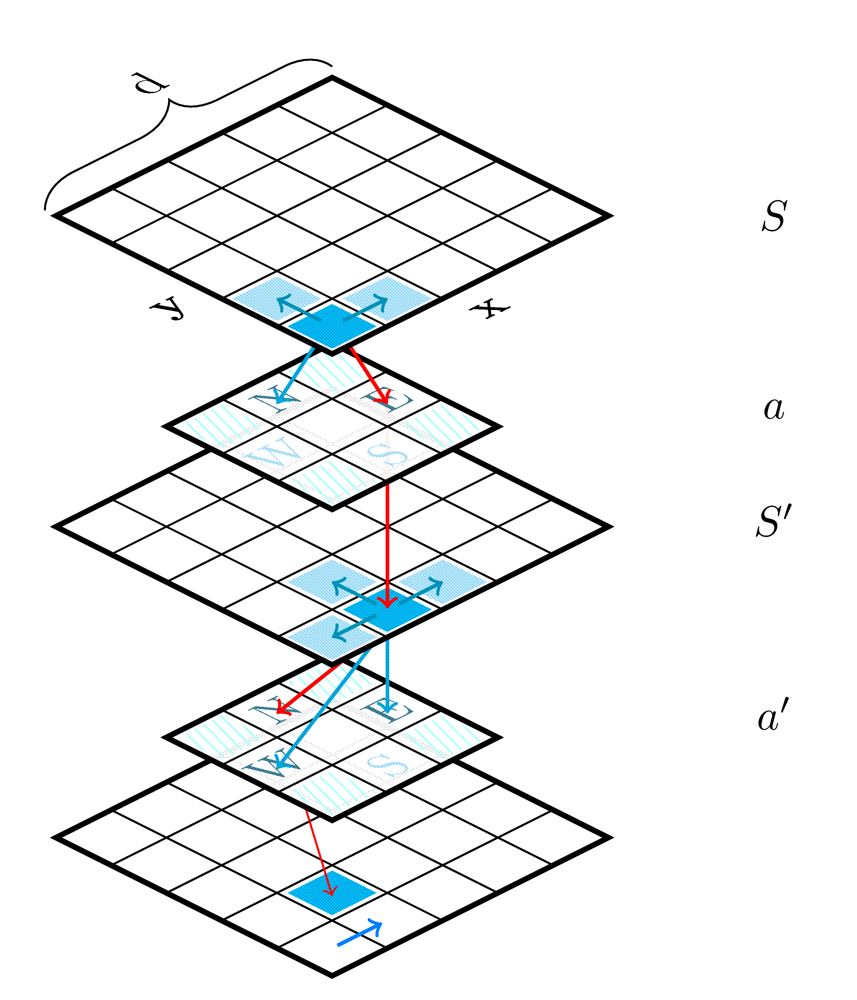

  * [planes_multiple_ocean+projection+style+scope+slant.tex](https://github.com/walmes/Tikz/blob/master/src/planes_multiple_ocean+projection+style+scope+slant.pgf)

```tex
\documentclass[border=5pt]{standalone}
\usepackage{tikz}
\usetikzlibrary{positioning, patterns, decorations.pathreplacing}
\usetikzlibrary{calc}
\usetikzlibrary{arrows,shapes,backgrounds}

\begin{document}


\begin{tikzpicture}[scale=.9,every node/.style={minimum size=1cm},on grid]

\tikzstyle{select arrow}=[->, thick,cyan!70!black]
\tikzstyle{action arrow}=[->, thick,cyan!90!black]
\tikzstyle{action good}=[thick,cyan!50!black]
\tikzstyle{action bad}=[thick,cyan!30]
\tikzstyle{active neuron}=[cyan!90]
\tikzstyle{selected neuron}=[cyan!30]
\tikzstyle{bad action}=[pattern=north west lines, pattern color=cyan!30]

%FINAL STATE. plane at the bottom
\begin{scope}[
            yshift=-160,every node/.append style={
            yslant=0.5,xslant=-1},yslant=0.5,xslant=-1
            ]

        \fill[white,fill opacity=0.9] (0,0) rectangle (2.5,2.5);
        \draw[step=5mm, black] (0,0) grid (2.5,2.5);
        \draw[black,very thick] (0,0) rectangle (2.5,2.5);
        \fill[active neuron] (0.55,0.55) rectangle (0.95,0.95);

\draw[->,thick, blue!50!cyan] (0.3,0.25) -- (0.7,0.25);
\end{scope}

\draw[action arrow, red, thin] (-0.5,-3.25) -- (0,-4.9);

%SECOND ACTION
   \begin{scope}[
    	yshift=-120,every node/.append style={
    	yslant=0.5,xslant=-1},yslant=0.5,xslant=-1
    	             ]
    	\fill[white,fill opacity=.95] (0,0) rectangle (1.5,1.5);
    	\draw[step=5mm, black] (0,0) grid (1.5,1.5);
    	\draw[black,very thick] (0,0) rectangle (1.5,1.5);

\fill[bad action] (0.05,0.05) rectangle (0.45,0.45);
\fill[bad action] (1.05,0.05) rectangle (1.45,0.45);
\fill[bad action] (1.05,1.05) rectangle (1.45,1.45);
\fill[bad action] (0.05,1.05) rectangle (0.45,1.45);

\node[action good] at (0.25,0.75) {W};
\node[action good] at (1.25,0.75) {E};
\node[action good] at (0.75,1.25) {N};
\node[action bad] at (0.75,0.25) {S};
    \end{scope}

\draw[action arrow] (0.5,-2.45) -- (0.5,-3.25);
\draw[action arrow, red] (0.5,-2.45) -- (-0.5,-3.25);
\draw[action arrow] (0.5,-2.45) -- (-0.5,-3.75);

%SECOND STATE
\begin{scope}[
            yshift=-80,every node/.append style={
            yslant=0.5,xslant=-1},yslant=0.5,xslant=-1
            ]

        \fill[white,fill opacity=0.9] (0,0) rectangle (2.5,2.5);
        \draw[step=5mm, black] (0,0) grid (2.5,2.5);
        \draw[black,very thick] (0,0) rectangle (2.5,2.5);
        \fill[active neuron] (0.55,0.05) rectangle (0.95,0.45);  
		\fill[selected neuron] (0.05,0.05) rectangle (0.45,0.45);
		\fill[selected neuron] (1.05,0.05) rectangle (1.45,0.45);
		\fill[selected neuron] (0.55,0.55) rectangle (0.95,0.95);

\draw[select arrow] (0.85,0.25) -- (1.25,0.25);
\draw[select arrow] (0.75,0.35) -- (0.75,.75);
\draw[select arrow] (0.65,0.25) -- (0.25,0.25);
\end{scope}

\draw[action arrow, red] (0.5,-0.45) -- (0.5,-2.3);

%FIRST ACTION
   \begin{scope}[
    	yshift=-40,every node/.append style={
    	yslant=0.5,xslant=-1},yslant=0.5,xslant=-1
    	             ]
    	\fill[white,fill opacity=.95] (0,0) rectangle (1.5,1.5);
    	\draw[step=5mm, black] (0,0) grid (1.5,1.5);
    	\draw[black,very thick] (0,0) rectangle (1.5,1.5);

\fill[bad action] (0.05,0.05) rectangle (0.45,0.45);
\fill[bad action] (1.05,0.05) rectangle (1.45,0.45);
\fill[bad action] (1.05,1.05) rectangle (1.45,1.45);
\fill[bad action] (0.05,1.05) rectangle (0.45,1.45);

\node[action bad] at (0.25,0.75) {W};
\node[action good] at (1.25,0.75) {E};
\node[action good] at (0.75,1.25) {N};
\node[action bad] at (0.75,0.25) {S};
    \end{scope}

\draw[action arrow, red] (0.125,0.125) -- (0.5,-0.45);
\draw[action arrow] (-0.125,0.125) -- (-0.5,-0.45);

%INITIAL STATE. plane at the top
\begin{scope}[
            every node/.append style={
            yslant=0.5,xslant=-1},yslant=0.5,xslant=-1
            ]

        \fill[white,fill opacity=0.9] (0,0) rectangle (2.5,2.5);
        \draw[step=5mm, black] (0,0) grid (2.5,2.5);
        \draw[black,very thick] (0,0) rectangle (2.5,2.5);
        \fill[active neuron] (0.05,0.05) rectangle (0.45,0.45);
		\fill[selected neuron] (0.55,0.05) rectangle (0.95,0.45);
		\fill[selected neuron] (0.05,0.55) rectangle (0.45,0.95);

\draw [decorate,decoration={brace,amplitude=10pt}] (0,2.6) -- (2.6,2.6);
\node at (1.6,3.3) {d};

\draw[select arrow] (0.25,0.35) -- (0.25,0.75);
\draw[select arrow] (0.35,0.25) -- (0.75,0.25);

\node at (1.125,-0.3) {\textbf{x}};
\node at (-0.3,1.125) {\textbf{y}};

\end{scope}

\node at (4,1.25) {$S$};
\node at (4,-0.5) {$a$};
\node at (4,-1.5) {$S'$};
\node at (4,-3.25) {$a'$};

\end{tikzpicture}
\end{document}
```
****


  * [planes-multidimensional-array-inclined.tex](https://github.com/walmes/Tikz/blob/master/src/planes-multidimensional-array-inclined.pgf)

```tex
% https://tex.stackexchange.com/a/295021/173708
\documentclass[tikz,border=5]{standalone}
\usepackage{tikz}
\usetikzlibrary{calc}

\begin{document}
\begin{tikzpicture}[x=0.5cm,y=0.5cm]
    \begin{scope}[rotate=130,]
        \draw[gray] (-4  ,-1.5) -- (6  ,3.5);
    \end{scope}
    \foreach \shift in {-5,0,5}
    {
        \foreach \x in {1,...,4}
        {
            \foreach \y in {1,...,4}
            {
                \begin{scope}[rotate=130,shift={(\shift,0.5*\shift)},]
                    \draw[fill=white] (\x,\y) rectangle (\x+1,\y+1);
                    \node at (\x+0.5,\y+0.5) {\pgfmathrnd\pgfmathparse{round(\pgfmathresult)}
                        \pgfmathprintnumber[precision=1]{\pgfmathresult}};
                \end{scope}
            }
        }
    }
    \begin{scope}[rotate=130,]
        \draw         (-4, 2.5) -- (6  ,7.5);
        \draw[dashed] (0 , 2.5) -- (10,7.5);
        \draw[dashed] (0 ,-1.5) -- (10,3.5) node[midway,anchor=south west] {Channel};
    \end{scope}
\end{tikzpicture}
\end{document}
```
****


  * [planes-multidimensional-array.tex](https://github.com/walmes/Tikz/blob/master/src/planes-multidimensional-array.pgf)

```tex
% https://tex.stackexchange.com/a/295109/173708

\documentclass[tikz,border=5]{standalone}
\begin{document} 
	
\begin{tikzpicture}[x=(15:.5cm), y=(90:.5cm), z=(330:.5cm), >=stealth]
	\draw (0, 0, 0) -- (0, 0, 10) (4, 0, 0) -- (4, 0, 10);
	\foreach \z in {0, 5, 10} \foreach \x in {0,...,3}
	  \foreach \y [evaluate={\b=random(0, 1);}] in {0,...,3}
	    \filldraw [fill=white] (\x, \y, \z) -- (\x+1, \y, \z) -- (\x+1, \y+1, \z) --
	      (\x, \y+1, \z) -- cycle (\x+.5, \y+.5, \z) node [yslant=tan(15)] {\b};
	\draw [dashed] (0, 4, 0) -- (0, 4, 10) (4, 4, 0) -- (4, 4, 10);
	\draw [->] (0, 4.5, 0)  -- (4, 4.5, 0)   node [near end, above left] {Column};
	\draw [->] (-.5, 4, 0)  -- (-.5, 0, 0)   node [midway, left] {Row};
	\draw [->] (4, 4.5, 10) -- (4, 4.5, 2.5) node [near end, above right] {Channel};
\end{tikzpicture}%
\end{document}
```
****

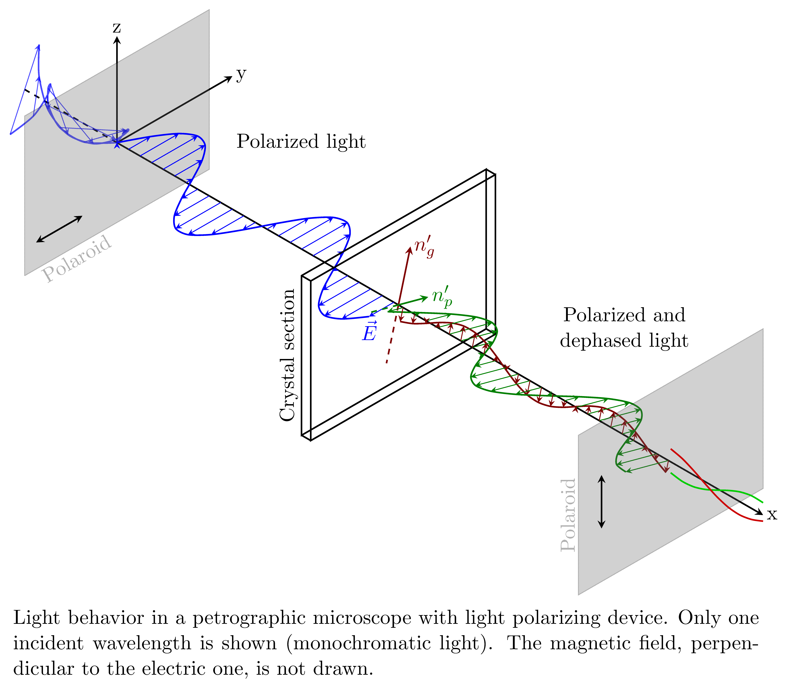

  * [planes-polarization+3d+foreach.tex](https://github.com/walmes/Tikz/blob/master/src/planes-polarization+3d+foreach.pgf)

```tex
% Polarizing microscope
% Author: Cyril Langlois
% This TikZ code sketches the light behavior during its travel in a polarizing
% petrographic microscope when a birefringent crystal thin section is inserted
% between the polarizing devices.
% 
% The goal was to correctly show the vectorial relationships between light
% electric fields during its travel through the first polaroid, the mineral
% section and the second polaroid.
\documentclass[11pt]{article}
\usepackage{tikz}
\usetikzlibrary{arrows}
%%%<
\usepackage{verbatim}
\usepackage[active,tightpage]{preview}
\PreviewEnvironment{tikzpicture}
\setlength\PreviewBorder{5pt}%
%%%>

\begin{comment}
:Title: Polarizing microscope
:Tags: 3D; Earth Sciences; Petrography; Physics
:Author: Cyril Langlois

This TikZ code sketches the light behavior during its travel in a polarizing
petrographic microscope when a birefringent crystal thin section is inserted
between the polarizing devices.

The goal was to correctly show the vectorial relationships between light
electric fields during its travel through the first polaroid, the mineral
section and the second polaroid.
\end{comment}

\begin{document}
\begin{tikzpicture}[x={(0.866cm,-0.5cm)}, y={(0.866cm,0.5cm)}, z={(0cm,1cm)}, scale=1.0,
    %Option for nice arrows
    >=stealth, %
    inner sep=0pt, outer sep=2pt,%
    axis/.style={thick,->},
    wave/.style={thick,color=#1,smooth},
    polaroid/.style={fill=black!60!white, opacity=0.3},
]
    % Colors
    \colorlet{darkgreen}{green!50!black}
    \colorlet{lightgreen}{green!80!black}
    \colorlet{darkred}{red!50!black}
    \colorlet{lightred}{red!80!black}

    % Frame
    \coordinate (O) at (0, 0, 0);
    \draw[axis] (O) -- +(14, 0,   0) node [right] {x};
    \draw[axis] (O) -- +(0,  2.5, 0) node [right] {y};
    \draw[axis] (O) -- +(0,  0,   2) node [above] {z};

    \draw[thick,dashed] (-2,0,0) -- (O);

    % monochromatic incident light with electric field
    \draw[wave=blue, opacity=0.7, variable=\x, samples at={-2,-1.75,...,0}]
        plot (\x, { cos(1.0*\x r)*sin(2.0*\x r)}, { sin(1.0*\x r)*sin(2.0*\x r)})
        plot (\x, {-cos(1.0*\x r)*sin(2.0*\x r)}, {-sin(1.0*\x r)*sin(2.0*\x r)});

    \foreach \x in{-2,-1.75,...,0}{
        \draw[color=blue, opacity=0.7,->]
            (\x,0,0) -- (\x, { cos(1.0*\x r)*sin(2.0*\x r)}, { sin(1.0*\x r)*sin(2.0*\x r)})
            (\x,0,0) -- (\x, {-cos(1.0*\x r)*sin(2.0*\x r)}, {-sin(1.0*\x r)*sin(2.0*\x r)});
    }

    \filldraw[polaroid] (0,-2,-1.5) -- (0,-2,1.5) -- (0,2,1.5) -- (0,2,-1.5) -- (0,-2,-1.5)
        node[below, sloped, near end]{Polaroid};%

    %Direction of polarization
    \draw[thick,<->] (0,-1.75,-1) -- (0,-0.75,-1);

    % Electric field vectors
    \draw[wave=blue, variable=\x,samples at={0,0.25,...,6}]
        plot (\x,{sin(2*\x r)},0)node[anchor=north]{$\vec{E}$};

    %Polarized light between polaroid and thin section
    \foreach \x in{0, 0.25,...,6}
        \draw[color=blue,->] (\x,0,0) -- (\x,{sin(2*\x r)},0);

    \draw (3,1,1) node [text width=2.5cm, text centered]{Polarized light};

    %Crystal thin section
    \begin{scope}[thick]
        \draw (6,-2,-1.5) -- (6,-2,1.5) node [above, sloped, midway]{Crystal section}
                -- (6, 2, 1.5) -- (6, 2, -1.5) -- cycle % First face
            (6,  -2, -1.5) -- (6.2, -2,-1.5)
            (6,   2, -1.5) -- (6.2,  2,-1.5)
            (6,  -2,  1.5) -- (6.2, -2, 1.5)
            (6,   2,  1.5) -- (6.2,  2, 1.5)
            (6.2,-2, -1.5) -- (6.2, -2, 1.5) -- (6.2, 2, 1.5) 
                -- (6.2, 2, -1.5) -- cycle; % Second face

        %Optical indices
        \draw[darkred, ->]       (6.1, 0, 0) -- (6.1, 0.26,  0.966) node [right] {$n_{g}'$}; % index 1
        \draw[darkred, dashed]   (6.1, 0, 0) -- (6.1,-0.26, -0.966); % index 1
        \draw[darkgreen, ->]     (6.1, 0, 0) -- (6.1, 0.644,-0.173) node [right] {$n_{p}'$}; % index 2
        \draw[darkgreen, dashed] (6.1, 0, 0) -- (6.1,-0.644, 0.173); % index 2
    \end{scope}

    %Rays leaving thin section
    \draw[wave=darkred,   variable=\x, samples at={6.2,6.45,...,12}] 
        plot (\x, {0.26*0.26*sin(2*(\x-0.5) r)},  {0.966*0.26*sin(2*(\x-0.5) r)});  %n'g-oriented ray
    \draw[wave=darkgreen, variable=\x, samples at={6.2,6.45,...,12}]
        plot (\x, {0.966*0.966*sin(2*(\x-0.1) r)},{-0.26*0.966*sin(2*(\x-0.1) r)}); %n'p-oriented ray
    \draw (10,1,1) node [text width=2.5cm, text centered] {Polarized and dephased light};

    \foreach \x in{6.2,6.45,...,12} {
        \draw[color=darkgreen, ->] (\x, 0, 0) --
            (\x, {0.966*0.966*sin(2*(\x-0.1) r)}, {-0.26*0.966*sin(2*(\x-0.1) r)});
        \draw[color=darkred,   ->] (\x, 0, 0) --
            (\x, {0.26*0.26*sin(2*(\x-0.5) r)}, {0.966*0.26*sin(2*(\x-0.5) r)});
    }

    %Second polarization
    \draw[polaroid]   (12, -2,  -1.5) -- (12, -2,   1.5)  %Polarizing filter
        node [above, sloped,midway] {Polaroid} -- (12, 2, 1.5) -- (12, 2, -1.5) -- cycle;
    \draw[thick, <->] (12, -1.5,-0.5) -- (12, -1.5, 0.5); %Polarization direction

    %Light leaving the second polaroid
    \draw[wave=lightgreen,variable=\x, samples at={12, 12.25,..., 14}]
        plot (\x,{0}, {0.966*0.966*0.26*sin(2*(\x-0.5) r)}); %n'g polarized ray
    \draw[wave=lightred,  variable=\x, samples at={12, 12.25,..., 14}]
        plot (\x,{0}, {-0.26*0.966*sin(2*(\x-0.1) r)});      %n'p polarized ray

    \node[align=justify, text width=14cm, anchor=north west, yshift=-2mm] at (current bounding box.south west)
        {Light behavior in a petrographic microscope with light polarizing
        device. Only one incident wavelength is shown (monochromatic light).
        The magnetic field, perpendicular to the electric one, is not drawn.};
\end{tikzpicture}
\end{document}
```
****

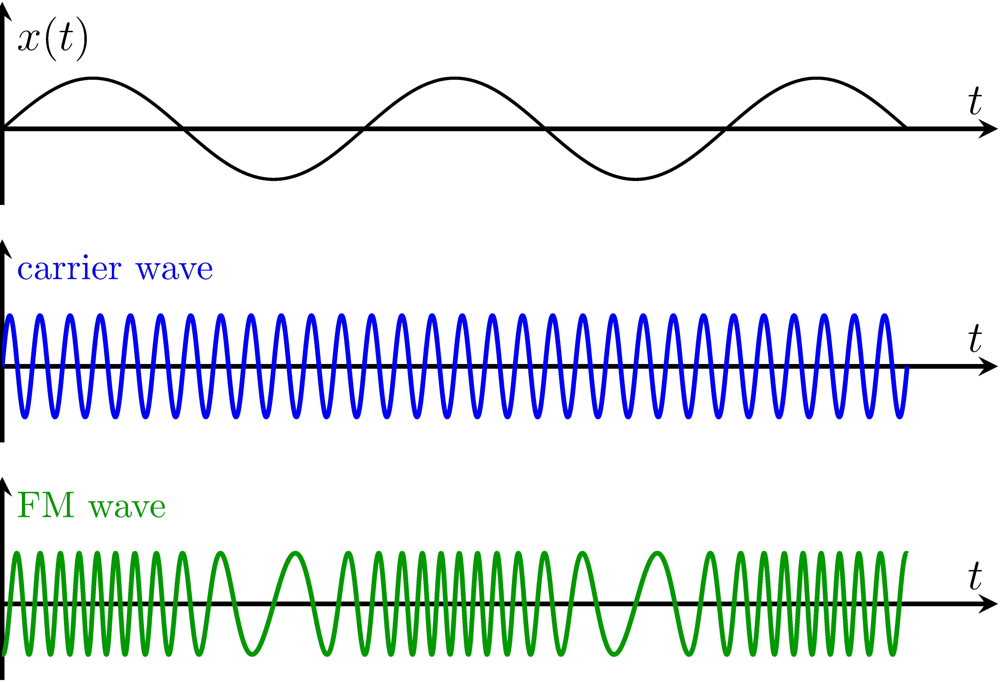

  * [plot-curves-frequency_modulation+physics.tex](https://github.com/walmes/Tikz/blob/master/src/plot-curves-frequency_modulation+physics.pgf)

```tex
% https://raw.githubusercontent.com/PetarV-/TikZ/master/Frequency%20modulation/frequency_modulation.tex
\documentclass[crop, tikz]{standalone}
\usepackage{tikz}
\usepackage{pgfplots}

\definecolor{olivegreen}{rgb}{0,0.6,0}

\begin{document}
\begin{tikzpicture}[samples=1000, domain=0:10]

	\begin{axis}[
		width=11cm, height=3.5cm,
		xtick=\empty,
		ytick=\empty,
		xlabel={\large $t$},
		ylabel={\large $x(t)$},
		xmin=0, xmax=11,
		ymin=-3, ymax=5,
		axis lines = middle,
		very thick,
		trig format = rad
	]
		\addplot [no markers, smooth, thick] {2*sin(2*pi*0.25*x)};
	\end{axis}
		
	\begin{axis}[
		at={(0, -2.25cm)},
		width=11cm, height=3.5cm,
		xtick=\empty,
		ytick=\empty,
		xlabel={\large $t$},
		ylabel={\textcolor{blue}{carrier wave}},
		xmin=0, xmax=11,
		ymin=-3, ymax=5,
		axis lines = middle,
		very thick,
		trig format = rad
	]
		\addplot [no markers, smooth, blue, very thick] {2*sin(6*pi*x)};
	\end{axis}
		
	\begin{axis}[
		at={(0, -4.5cm)},
		width=11cm, height=3.5cm,
		xtick=\empty,
		ytick=\empty,
		xlabel={\large $t$},
		ylabel={\textcolor{olivegreen}{FM wave}},
		xmin=0, xmax=11,
		ymin=-3, ymax=5,
		axis lines = middle,
		very thick,
		trig format = rad
	]
		\addplot expression [no markers, smooth, olivegreen, very thick] {2*sin(2*pi*3*x - 8*cos(2*pi*0.25*x))};
	\end{axis}
	
\end{tikzpicture}
\end{document}
```
****

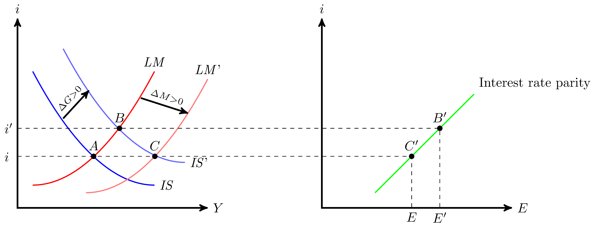

  * [plot-curves-is_lm+plot+command.tex](https://github.com/walmes/Tikz/blob/master/src/plot-curves-is_lm+plot+command.pgf)

```tex
% http://www.texample.net/media/tikz/examples/TEX/is-lm-diagram.tex
% IS-LM diagram
% Author: Rasmus Pank Roulund
\documentclass{standalone}
\usepackage{tikz}
\usepackage{verbatim}

\begin{comment}
:Title: IS-LM diagram
:Tags: Diagrams, Plots, Coord. calculations

This figure shows how an economy utilizing fixed exchange rates will
react according to the `IS-LM curve`_ (sometimes also known as `Mundell Flemming`_)

.. _IS-LM curve: http://en.wikipedia.org/wiki/IS/LM_model
.. _Mundell Flemming: http://en.wikipedia.org/wiki/Mundell-Fleming_model

:Author: Rasmus Pank Roulund

\end{comment}

\usetikzlibrary{arrows,calc}
\usepackage{relsize}
\newcommand\LM{\ensuremath{\mathit{LM}}}
\newcommand\IS{\ensuremath{\mathit{IS}}}
\begin{document}

\begin{tikzpicture}[
        scale=2,
        IS/.style={blue, thick},
        LM/.style={red, thick},
        axis/.style={very thick, ->, >=stealth', line join=miter},
        important line/.style={thick}, dashed line/.style={dashed, thin},
        every node/.style={color=black},
        dot/.style={circle,fill=black,minimum size=4pt,inner sep=0pt,
            outer sep=-1pt},
    ]
    % axis
    \draw[axis,<->] (2.5,0) node(xline)[right] {$Y$} -|
                    (0,2.5) node(yline)[above] {$i$};
    % IS-LM diagram
    \draw[LM] (0.2,0.3) coordinate (LM_1) parabola (1.8,1.8)
        coordinate (LM_2) node[above] {\LM};
    \draw[IS] (0.2,1.8) coordinate (IS_1) parabola[bend at end]
         (1.8,.3) coordinate (IS_2) node[right] {\IS};
    %Intersection is calculated "manually" since Tikz does not offer
    %intersection calculation for parabolas
    \node[dot,label=above:$A$] at (1,.68) (int1) {};
    %shifted IS-LM diagram
    \draw[xshift=.7cm, LM, red!52] (0.2,0.2) parabola (1.8,1.7)
        node[above] {\LM'};
    \draw[xshift=.4cm, yshift=.3cm, IS, blue!60] (0.2,1.8)
        parabola[bend at end] (1.8,.3)
        node[right] {\IS'};
    %Intersection of shifted IS-LM
    \path[xshift=.36cm, yshift=.35cm] (.98,.7)
        node[dot,label=above:{$B$}] (int2) {};
    \path[xshift=.805cm] (1,.68) node[dot,label=above:$C$] (int3) {};
    %arrows between intersections
    \draw[->, very thick, black, >=stealth']
        ($(int1)+1/2*(-.80,1)$) -- ($(int2)+1/2*(-.8,1)$)
        node[sloped, above, midway] {$\mathsmaller{\Delta G > 0}$};
    \draw[->, very thick, black, >=stealth']
        ($(int2)+2*(.14,.2)$) -- ($(int2)!.2cm!270:(int2)+(.9,0)$)
        node[sloped,above, midway] {$\mathsmaller{\Delta M>0}$};
        
    \begin{scope}[xshift=4cm]
        %E-diagram
        \draw[axis,<->] (0,2.5) node(eyline)[above] {$i$} |-
                        (2.5,0) node(exline)[right] {$E$};

        \draw[important line, green, xshift=.5cm]
            (.2,.2) coordinate (es) -- (1.5,1.5) coordinate (ee)
            node [above right] {Interest rate parity};
    \end{scope}
    %Lines connecting IS LM coordinates and E coordinates
    \draw[dashed] 
        let
            % Store the intersection point in \p1 for later retrieval. 
            % A convenient feature of the let operation is that we can
            % access the x and y component of the coordinate directly 
            % using the \x1 and \y1 syntax. 
            \p1=(intersection of int2--[xshift=1]int2 and es--ee)
        in
            (0,\y1) node[left]{$i'$} -|  (\x1,0)
            node[pos=0.5,dot,label=above:$B'$] {} node[below] {$E'$};

    \draw[dashed line] let
        \p1=(intersection of int3--[xshift=1]int3 and es--ee)
            in
        (0,\y1) node[left]{$i\phantom{'}$} -| (\x1,0)
        node[dot,label=above:$C'$,pos=0.5] {} node[below] {$E$};

\end{tikzpicture}
\end{document}
%%% Local Variables:
%%% mode: latex
%%% TeX-master: t
%%% End:
```
****

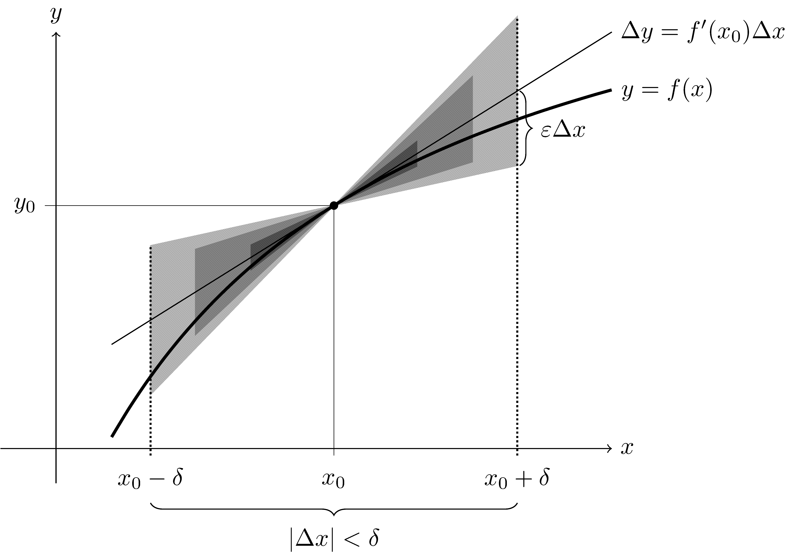

  * [plot-derivatives+plot.tex](https://github.com/walmes/Tikz/blob/master/src/plot-derivatives+plot.pgf)

```tex
\documentclass[tikz]{standalone}
\usetikzlibrary{decorations.pathreplacing}
\usepackage{mathtools}
\DeclarePairedDelimiter{\abs}{\lvert}{\rvert}
\renewcommand{\epsilon}{\varepsilon}


\begin{document}

\begin{tikzpicture}[xscale=8,yscale=5]
    \newcommand{\xmin}{-.4} \newcommand{\xmax}{.5}  \newcommand{\deltaX}{.65}
    \begin{scope}
        \draw[black,->] (-.6,-.7) -- (.5,-.7) node[right] {$x$};
        \draw[black,->] (-.5,-.8) -- (-.5,0.5) node[above] {$y$};

%       \useasboundingbox;

    \path[fill=black!30,draw=black!30] (-.33,-.33*1.65) --
        (-.33,-.33*.35) --
        (.33,.33*.35) -- (.33,.33*1.65) -- cycle;
    \draw[thick,densely dotted] (.33,-.72) 
        node[below] (delta3) {$x_0+\delta\strut$} -- (.33,.33*1.65);
    \draw[thick,densely dotted] (-.33,-.72) 
        node[below] (mdelta3) {$x_0-\delta\strut$} -- (-.33,-.33*.35);

    \fill[black!50] (-.25,-.25*3/2) -- (-.25,-.25/2) -- (.25,.25/2) -- 
        (.25,.25*3/2) -- cycle;

    \path[fill=black!70] (-.15,-.15*1.25) -- (-.15,-.15*.75) --
        (.15,.15*.75) -- (.15,.15*1.25) -- cycle;

    \node[circle,draw=black,inner sep=0pt,minimum size=3pt,fill=black] (x0y0) at (0,0) {};
    \draw[black,domain=\xmin:\xmax,samples=2] plot(\x,\x) 
        node[right] {$\Delta y = f'(x_0) \Delta x$};
    \draw[very thick,black,smooth,domain=\xmin:\xmax,samples=30] 
        plot (\x,{1-1/(\x+1)}) node[right] {$y=f(x)$};
    \draw[black,very thin] (x0y0) -- (0,{-.72}) node[below] (x0) {$x_0\strut$};
    \draw[black,very thin] (x0y0) -- (-.52,0) node[left]{$y_0$};

\end{scope}

\draw[decorate,decoration={brace,amplitude=5pt,mirror,raise=1pt}]
    (.33,.33*.35) -- 
    node[right]{\hspace{6pt}$\epsilon \Delta x$} (.33,.33);
\draw[decorate,decoration={brace,amplitude=5pt}] 
    (delta3.south) -- 
    node[below] {$\rule{0pt}{14pt}\abs{\Delta x} < \delta$} 
    (mdelta3.south);

\end{tikzpicture}
\end{document}


\end{document}
```
****


  * [plot-electromagnetic_wave+physics.tex](https://github.com/walmes/Tikz/blob/master/src/plot-electromagnetic_wave+physics.pgf)

```tex
% https://wiki.physik.uzh.ch/cms/latex:tikz:electromagnetic_wave
    % Author: Izaak Neutelings (May 2018)
% Inspiration: https://tex.stackexchange.com/questions/113900/draw-polarized-light
\documentclass[border=3pt,tikz]{article}
\usepackage[top=0.25in, bottom=0.25in]{geometry}
\usepackage{amsmath} % for \text
\usepackage{tikz}

\tikzset{>=latex} % for LaTeX arrow head

\usepackage{xcolor}

\colorlet{myblue}{black!40!blue}
\colorlet{myred}{black!40!red}

\begin{document}
	
	
	% Electromagnetic wave - black
	\begin{tikzpicture}[x=(-15:1.2), y=(90:1.0), z=(-150:1.0),
	line cap=round, line join=round,
	axis/.style={black, thick,->},
	vector/.style={>=stealth,->}]
	\large
	\def\A{1.5}
	\def\nNodes{5} % use even number
	\def\nVectorsPerNode{8}
	\def\N{\nNodes*40}
	\def\xmax{\nNodes*pi/2*1.01}
	\pgfmathsetmacro\nVectors{(\nVectorsPerNode+1)*\nNodes}
	
	\def\vE{\mathbf{E}}
	\def\vB{\mathbf{B}}
	\def\vk{\mathbf{\hat{k}}}
	
	% main axes
	\draw[axis] (0,0,0) -- ++(\xmax*1.1,0,0) node[right] {$x$};
	\draw[axis] (0,-\A*1.4,0) -- (0,\A*1.4,0) node[right] {$y$};
	\draw[axis] (0,0,-\A*1.4) -- (0,0,\A*1.4) node[above left] {$z$};
	
	% small axes
	\def\xOffset{{(\nNodes-2)*pi/2}}
	\def\yOffset{\A*1.2}
	\def\zOffset{\A*1.2}
	\draw[axis] (\xOffset,\yOffset,-\zOffset) -- ++(\A*0.6,0,0) node[right] {$\vk$};
	\draw[axis] (\xOffset,\yOffset,-\zOffset) -- ++(0,\A*0.6,0) node[right] {$\vE$};
	\draw[axis] (\xOffset,\yOffset,-\zOffset) -- ++(0,0,\A*0.6) node[above left] {$\vB$};
	
	% equation
	\node[above right] at (\xOffset,-0.5*\yOffset,4*\zOffset)
	{$\begin{aligned}
		\vE &= \mathbf{E_0}\sin(\vk\cdot\mathbf{x}-c_0t)\\
		\vB &= \mathbf{B_0}\sin(\vk\cdot\mathbf{x}-c_0t)\\
		\end{aligned}$};
	\node[below right] at (\xOffset,-0.5*\yOffset,4*\zOffset)
	{$\vE\cdot\vk = 0,\;\; \vB\cdot\vk = 0,\;\; \vB = \frac{1}{c_0}\vk\times\vE$};
	
	% waves
	\draw[very thick,variable=\t,domain=0:\nNodes*pi/2*1.01,samples=\N]
	plot (\t,{\A*sin(\t*360/pi)},0);
	\draw[very thick,variable=\t,domain=0:\nNodes*pi/2*1.01,samples=\N]
	plot (\t,0,{\A*sin(\t*360/pi)});
	
	% draw vectors
	\foreach \k [evaluate={\t=\k*pi/2/(\nVectorsPerNode+1);
		\angle=\k*90/(\nVectorsPerNode+1);
		\c=(mod(\angle,90)!=0);}]
	in {1,...,\nVectors}{
		\if\c1
		\draw[vector] (\t,0,0) -- ++(0,{\A*sin(2*\angle)},0);
		\draw[vector] (\t,0,0) -- ++(0,0,{\A*sin(2*\angle)});
		\fi
	}
	
	\end{tikzpicture}
	
	
	
	% Electromagnetic wave - circular polarization
	\begin{tikzpicture}[x=(-15:0.8), y=(90:1.0), z=(-150:1.0),
	line cap=round, line join=round,
	axis/.style={black, thick,->},
	vector/.style={>=stealth,->}]
	\large
	\def\A{1.5}
	\def\nNodes{8} % use even number
	\def\nVectorsPerNode{8}
	\def\N{\nNodes*40}
	\def\xmax{\nNodes*pi/2*1.01}
	\pgfmathsetmacro\nVectors{\nVectorsPerNode*\nNodes}
	
	\def\vE{\mathbf{E}}
	\def\vB{\mathbf{B}}
	\def\vk{\mathbf{\hat{k}}}
	
	% main axes
	\draw[axis] (0,0,0) -- ++(\xmax*1.1,0,0) node[right] {$x$};
	\draw[axis] (0,-\A*1.4,0) -- (0,\A*1.4,0) node[right] {$y$};
	\draw[axis] (0,0,-\A*1.4) -- (0,0,\A*1.4) node[above left] {$z$};
	
	% waves
	\draw[very thick,variable=\t,domain=0:\nNodes*pi/2*1.01,samples=\N]
	plot (\t,{\A*cos(\t*360/pi)},{\A*sin(\t*360/pi)});
	
	% draw vectors
	\foreach \k [evaluate={\t=\k*pi/2/\nVectorsPerNode;
		\angle=\k*90/\nVectorsPerNode;}]
	in {1,...,\nVectors}{
		\draw[vector] (\t,0,0) -- ++(0,{\A*cos(2*\angle)},{\A*sin(2*\angle)});
	}
	
	\end{tikzpicture}
	
	
	
	% Electromagnetic wave - colored
	\begin{tikzpicture}[x=(-15:1.2), y=(90:1.0), z=(-150:1.0),
	line cap=round, line join=round,
	axis/.style={black, thick,->},
	vector/.style={>=stealth,->}]
	\large
	\def\A{1.5}
	\def\nNodes{5} % use even number
	\def\nVectorsPerNode{8}
	\def\N{\nNodes*40}
	\def\xmax{\nNodes*pi/2*1.01}
	\pgfmathsetmacro\nVectors{(\nVectorsPerNode+1)*\nNodes}
	
	\def\vE{{\color{myblue}\mathbf{E}}}
	\def\vB{{\color{myred}\mathbf{B}}}
	\def\vk{\mathbf{\hat{k}}}
	
	\def\drawENode{ % draw E node and vectors with some offset
		\draw[myblue,very thick,variable=\t,domain=\iOffset*pi/2:(\iOffset+1)*pi/2*1.01,samples=40]
		plot (\t,{\A*sin(\t*360/pi)},0);
		\foreach \k [evaluate={\t=\k*pi/2/(\nVectorsPerNode+1);
			\angle=\k*90/(\nVectorsPerNode+1);}]
		in {1,...,\nVectorsPerNode}{
			\draw[vector,myblue!50]  (\iOffset*pi/2+\t,0,0) -- ++(0,{\A*sin(2*\angle+\iOffset*180)},0);
		}
	}
	\def\drawBNode{ % draw B node and vectors with some offset
		\draw[myred,very thick,variable=\t,domain=\iOffset*pi/2:(\iOffset+1)*pi/2*1.01,samples=40]
		plot (\t,0,{\A*sin(\t*360/pi)});
		\foreach \k [evaluate={\t=\k*pi/2/(\nVectorsPerNode+1);
			\angle=\k*90/(\nVectorsPerNode+1);}]
		in {1,...,\nVectorsPerNode}{
			\draw[vector,myred!50]  (\iOffset*pi/2+\t,0,0) -- ++(0,0,{\A*sin(2*\angle+\iOffset*180)});
		}
	}
	
	% main axes
	\draw[axis] (0,0,0) -- ++(\xmax*1.1,0,0) node[right] {$x$};
	\draw[axis] (0,-\A*1.4,0) -- (0,\A*1.4,0) node[right] {$y$};
	\draw[axis] (0,0,-\A*1.4) -- (0,0,\A*1.4) node[above left] {$z$};
	
	% small axes
	\def\xOffset{{(\nNodes-2)*pi/2}}
	\def\yOffset{\A*1.2}
	\def\zOffset{\A*1.2}
	\draw[axis,black] (\xOffset,\yOffset,-\zOffset) -- ++(\A*0.6,0,0) node[right,align=center] {$\mathbf{\hat{k}}$}; %\\propagation
	\draw[axis,myblue]  (\xOffset,\yOffset,-\zOffset) -- ++(0,\A*0.6,0) node[right] {$\mathbf{E}$};
	\draw[axis,myred]   (\xOffset,\yOffset,-\zOffset) -- ++(0,0,\A*0.6) node[above left] {$\mathbf{B}$};
	
	% equation
	\node[above right] at (\xOffset,-0.5*\yOffset,4*\zOffset)
	{$\begin{aligned}
		\vE &= {\color{myblue}\mathbf{E_0}}\sin(\vk\cdot\mathbf{x}-c_0t)\\
		\vB &= {\color{myred} \mathbf{B_0}}\sin(\vk\cdot\mathbf{x}-c_0t)\\
		\end{aligned}$};
	\node[below right] at (\xOffset,-0.5*\yOffset,4*\zOffset)
	{$\vE\cdot\vk = 0,\;\; \vB\cdot\vk = 0,\;\; \vB = \frac{1}{c_0}\vk\times\vE$};
	
	% draw (anti-)nodes
	\foreach \iNode [evaluate={\iOffset=\iNode-1;}] in {1,...,\nNodes}{
		\ifodd\iNode \drawBNode \drawENode % E overlaps B
		\else        \drawENode \drawBNode % B overlaps E
		\fi
	}
	
	\end{tikzpicture}
	
	
	
\end{document}
```
****

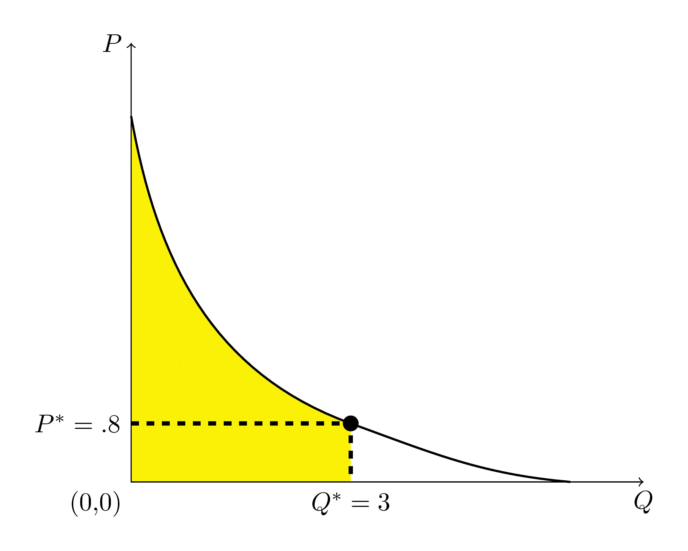

  * [plot-filled_curve+geometry.tex](https://github.com/walmes/Tikz/blob/master/src/plot-filled_curve+geometry.pgf)

```tex
\documentclass[tikz,border=10pt]{standalone}
%\documentclass[crop, tikz]{standalone}

\usepackage{tikz}

\begin{document}

\begin{tikzpicture}
	\path [fill=yellow] (0,0) -- (0,5) to [out=-80, in=160]
	(3,.8) -- (3,0) -- (0,0);
	\draw [<->] (0,6) node [left] {$P$} -- (0,0)
	node [below left] {(0,0)} -- (7,0) node [below] {$Q$};
	\draw [ultra thick, dashed] (0,.8) node [left] {$P^*=.8$} -- (3,.8)
	-- (3,0) node [below] {$Q^*=3$};
	\draw [fill] (3,.8) circle [radius=.1];
	\draw [thick] (0,5) to [out=-80, in=160] (3,.8) to
	[out=-20, in=175] (6,0);
\end{tikzpicture}

\end{document}
```
****


  * [plot-intersections+geometry.tex](https://github.com/walmes/Tikz/blob/master/src/plot-intersections+geometry.pgf)

```tex
\documentclass[tikz,border=10pt]{standalone}
%\documentclass[crop, tikz]{standalone}

\usepackage{tikz}

\begin{document}
	
\usetikzlibrary{arrows}
\begin{tikzpicture}[
scale=5,
axis/.style={very thick, ->, >=stealth'},
important line/.style={thick},
dashed line/.style={dashed, thin},
pile/.style={thick, ->, >=stealth', shorten <=2pt, shorten
	>=2pt},
every node/.style={color=black}
]
% axis
\draw[axis] (-0.1,0)  -- (1.1,0) node(xline)[right]
{$G\uparrow/T\downarrow$};
\draw[axis] (0,-0.1) -- (0,1.1) node(yline)[above] {$E$};
% Lines
\draw[important line] (.15,.15) coordinate (A) -- (.85,.85)
coordinate (B) node[right, text width=5em] {$Y^O$};
\draw[important line] (.15,.85) coordinate (C) -- (.85,.15)
coordinate (D) node[right, text width=5em] {$\mathit{NX}=x$};
% Intersection of lines
\fill[red] (intersection cs:
first line={(A) -- (B)},
second line={(C) -- (D)}) coordinate (E) circle (.4pt)
node[above,] {$A$};
% The E point is placed more or less randomly
\fill[red]  (E) +(-.075cm,-.2cm) coordinate (out) circle (.4pt)
node[below left] {$B$};
% Line connecting out and ext balances
\draw [pile] (out) -- (intersection of A--B and out--[shift={(0:1pt)}]out)
coordinate (extbal);
\fill[red] (extbal) circle (.4pt) node[above] {$C$};
% line connecting  out and int balances
\draw [pile] (out) -- (intersection of C--D and out--[shift={(0:1pt)}]out)
coordinate (intbal);
\fill[red] (intbal) circle (.4pt) node[above] {$D$};
% line between out og all balanced out :)
\draw[pile] (out) -- (E);
\end{tikzpicture}
	
\end{document}
```
****


  * [plot-linear-regression+geometry.tex](https://github.com/walmes/Tikz/blob/master/src/plot-linear-regression+geometry.pgf)

```tex
% Linear regression
% Author: Henri Menke
\documentclass[tikz,border=10pt]{standalone}
\usetikzlibrary{arrows,intersections}

\begin{document}

\begin{tikzpicture}[
    thick,
    >=stealth',
    dot/.style = {
      draw,
      fill = white,
      circle,
      inner sep = 0pt,
      minimum size = 4pt
    }
  ]
  \coordinate (O) at (0,0);
  \draw[->] (-0.3,0) -- (8,0) coordinate[label = {below:$x$}] (xmax);
  \draw[->] (0,-0.3) -- (0,5) coordinate[label = {right:$f(x)$}] (ymax);
  \path[name path=x] (0.3,0.5) -- (6.7,4.7);
  \path[name path=y] plot[smooth] coordinates {(-0.3,2) (2,1.5) (4,2.8) (6,5)};
  \scope[name intersections = {of = x and y, name = i}]
    \fill[gray!20] (i-1) -- (i-2 |- i-1) -- (i-2) -- cycle;
    \draw      (0.3,0.5) -- (6.7,4.7) node[pos=0.8, below right] {Sekante};
    \draw[red] plot[smooth] coordinates {(-0.3,2) (2,1.5) (4,2.8) (6,5)};
    \draw (i-1) node[dot, label = {above:$P$}] (i-1) {} -- node[left]
      {$f(x_0)$} (i-1 |- O) node[dot, label = {below:$x_0$}] {};
    \path (i-2) node[dot, label = {above:$Q$}] (i-2) {} -- (i-2 |- i-1)
      node[dot] (i-12) {};
    \draw           (i-12) -- (i-12 |- O) node[dot,
                              label = {below:$x_0 + \varepsilon$}] {};
    \draw[blue, <->] (i-2) -- node[right] {$f(x_0 + \varepsilon) - f(x_0)$}
                              (i-12);
    \draw[blue, <->] (i-1) -- node[below] {$\varepsilon$} (i-12);
    \path       (i-1 |- O) -- node[below] {$\varepsilon$} (i-2 |- O);
    \draw[gray]      (i-2) -- (i-2 -| xmax);
    \draw[gray, <->] ([xshift = -0.5cm]i-2 -| xmax) -- node[fill = white]
      {$f(x_0 + \varepsilon)$}  ([xshift = -0.5cm]xmax);
  \endscope
\end{tikzpicture}
\end{document}
```
****

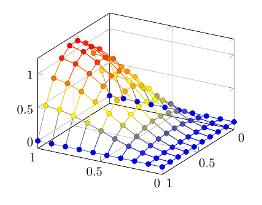

  * [plot-mesh+3d+pgf+function.tex](https://github.com/walmes/Tikz/blob/master/src/plot-mesh+3d+pgf+function.pgf)

```tex
% http://pgfplots.net/media/tikz/examples/TEX/mesh-plot.tex
\documentclass[border=10pt]{standalone}
%%%<
\usepackage{verbatim}
%%%>
\usepackage{pgfplots}
\pgfplotsset{width=7cm,compat=1.8}

\begin{comment}
:Title: Scatter plot with cubes
:Tags: 3D;Mesh plots;Manual
:Author: Christian Feuersänger
:Slug: mesh-plot

A mesh plot uses different colors for each mesh segment. The color is
determined using a "color coordinate" which is also called "meta data"
throughout this document. It is the same data which
is used for surface and scatter plots as well.

The code is from the PGFPlots 1.10 manual: "4.6.5 Mesh Plots".
\end{comment}

\begin{document}
\begin{tikzpicture}
	\begin{axis}[grid=major,view={210}{30}]
	\addplot3+[mesh,scatter,samples=10,domain=0:1] 
		{5*x*sin(2*deg(x)) * y*(1-y)};
	\end{axis}
\end{tikzpicture}
\end{document}
```
****


  * [plot-physics-functions.tex](https://github.com/walmes/Tikz/blob/master/src/plot-physics-functions.pgf)

```tex
% https://wiki.physik.uzh.ch/cms/latex:tikz:functions
    % Author: Izaak Neutelings (June, 2017)
% based on code from a friend

\documentclass{article}
\usepackage[top=0.25in]{geometry}
\usepackage{amsmath} % for \dfrac
\usepackage{tikz}
\tikzset{>=latex} % for LaTeX arrow head
\usepackage{pgfplots} % for the axis environment

%% split figures into pages
%\usepackage[active,tightpage]{preview}
%\PreviewEnvironment{tikzpicture}
%\setlength\PreviewBorder{1pt}%

\pagestyle{empty}

\begin{document}
	
	% DRAW PLOT: sin, cos, tan
	\begin{tikzpicture}[domain=-pi:pi,xscale=2/pi]
	
	% limits
	\def\xa{ -pi-0.3}
	\def\xb{3*pi+0.4}
	\def\ya{-3.4}
	\def\yb{ 3.6}
	\def\N{100} % number of points
	
	% axes & grid
	\draw[xstep=pi/2,very thin, color=gray]
	(\xa,\ya) grid (\xb,\yb);
	\draw[->]
	(\xa,0) -- (\xb,0)
	node[right] {$x$};
	\draw[->]
	(0,\ya) -- (0,\yb)
	node[left] {$y$};
	
	% ticks
	\draw[] % x
	node[below,scale=0.9] at ( -pi,   0) {$-\pi$}
	node[below,scale=0.9] at ( -pi/2, 0) {$-\dfrac{\pi}{2}$}
	node[below,scale=0.9] at (  pi,   0) {$\pi$}
	node[below,scale=0.9] at (     0, 0) {0}
	node[below,scale=0.9] at (  pi/2, 0) {$\dfrac{\pi}{2}$}
	node[below,scale=0.9] at (  pi,   0) {$\pi$}
	node[below,scale=0.9] at (3*pi/2, 0) {$\dfrac{3\pi}{2}$}
	node[below,scale=0.9] at (2*pi,   0) {$2\pi$}
	node[below,scale=0.9] at (5*pi/2, 0) {$\dfrac{5\pi}{2}$}
	node[below,scale=0.9] at (3*pi,   0) {$3\pi$};
	\draw[] % y
	node[left,scale=0.9] at ( 0,  3) {$3$}
	node[left,scale=0.9] at ( 0,  2) {$2$}
	node[left,scale=0.9] at ( 0,  1) {$1$}
	node[left,scale=0.9] at ( 0,  0) {$0$}
	node[left,scale=0.9] at ( 0, -1) {$-1$}
	node[left,scale=0.9] at ( 0, -2) {$-2$}
	node[left,scale=0.9] at ( 0, -3) {$-3$};
	
	% functions
	\def\ea{0.28}
	\def\eb{0.26}
	\draw[color=blue,samples=\N,domain=\xa:\xb] % SIN
	plot(\x,{sin(\x r)}) % r for radians
	node[above right] at (5*pi/2,1) {$\sin(x)$};
	\draw[color=red,samples=\N,domain=\xa:\xb] % COS
	plot(\x,{cos(\x r)})
	node[above left] at (2*pi,1) {$\cos(x)$};
	\draw[color=orange] % TAN
	plot[samples=\N,domain=  \xa     :   -pi/2-\eb] (\x, {tan(\x r)})
	plot[samples=\N,domain=  -pi/2+\ea:   pi/2-\eb] (\x, {tan(\x r)})
	plot[samples=\N,domain=   pi/2+\ea: 3*pi/2-\eb] (\x, {tan(\x r)})
	plot[samples=\N,domain= 3*pi/2+\ea: 5*pi/2-\eb] (\x, {tan(\x r)})
	plot[samples=\N,domain= 5*pi/2+\ea:  \xb      ] (\x, {tan(\x r)})
	node[samples=\N,right=-2pt] at (pi/2,2.5) {$\tan(x)$};
	
	\end{tikzpicture}
	
\vspace{24pt}
	
	% AXIS ENVIRONMENT: sin, cos, tan
	\begin{tikzpicture}
	\begin{axis}[enlargelimits=false,
	axis lines=middle,
	scale=1.2,
	xtick={-3.15159, -1.57080, 0,
		1.57080,  3.15159, 4.71239,
		6.28318,  7.85398, 9.42478 }, 
	xticklabels={$-\pi$, $-\frac{1}{2}\pi$, 0,
		$\frac{1}{2}\pi$, $\pi$, $\frac{3}{2}\pi$,
		$2\pi$, $\frac{5}{2}\pi$, $3\pi$ },
	ytick={-3,-2,-1,0,1,2,3},
	grid=major, % only a grid on the defined ticks
	samples=100 % number of points
	]
	
	% sin
	\addplot[blue,no marks,domain=-1.2*pi:3*pi]{sin(deg(x))}; % deg to convert radians
	\node[right=10pt,above] at (axis cs:5*pi/2,1){\color{blue}$\sin(x)$};
	
	% cos
	\addplot[red,no marks,domain=-1.2*pi:3*pi] {cos(deg(x))};
	\node[above left] at (axis cs:2*pi,1){\color{red}$\cos(x)$};
	
	% tan, multiple parts because of singularities
	\addplot[orange,no marks,domain=-1.2*pi:-0.583*pi, ]{tan(deg(x))};
	\addplot[orange,no marks,domain=-0.4*pi:5*pi/12,   ]{tan(deg(x))};
	\addplot[orange,no marks,domain=27*pi/45:17*pi/12, ]{tan(deg(x))};
	\addplot[orange,no marks,domain=1.6*pi:29*pi/12,   ]{tan(deg(x))};
	\addplot[orange,no marks,domain=2.6*pi:36*pi/12,   ]{tan(deg(x))};
	\node[right] at (axis cs:pi/2,2.5){\color{orange}$\tan(x)$};
	
	\end{axis}
	\end{tikzpicture}
	
\vspace{24pt}	
	
	% AXIS ENVIRONMENT: arcsin, arccos, arctan
	\begin{tikzpicture}
	\begin{axis}[enlargelimits=false,
	axis lines=middle,
	xtick={-2,-1,0,1,2},
	ytick={-1.570780, 1.570780, 3.14159},
	yticklabels={$-\frac{1}{2}\pi$,$\frac{1}{2}\pi$,$\pi$},
	grid=major,
	samples=100
	]
	
	% arcsin
	\addplot[domain=-1:1,no marks,blue] {rad(asin(x))};
	\node at (axis cs:1.52,1.4){\color{blue}$\arcsin(x)$};
	
	% arccos
	\addplot[domain=-1:1,no marks,red] {rad(acos(x))};
	\node at (axis cs:-1.5,2.8){\color{red}$\arccos(x)$};
	
	% arctan
	\addplot[domain=-2:2,no marks,orange] {rad(atan(x))};
	\node at (axis cs:1.52,.67){\color{orange}$\arctan(x)$};
	
	\end{axis}
	\end{tikzpicture}
	
\end{document}
```
****

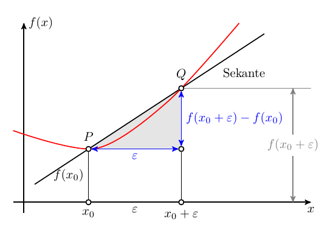

  * [plot-regression+geometry.tex](https://github.com/walmes/Tikz/blob/master/src/plot-regression+geometry.pgf)

```tex
% Linear regression
% Author: Henri Menke
\documentclass[tikz,border=10pt]{standalone}
%%%<
\usepackage{verbatim}
%%%>
\begin{comment}
:Title: Linear regression
:Tags: Foreach;Plotting;Plots;Mathematics
:Author: Henri Menke
:Slug: linear-regression

This is an illustration of linear regression.

This example was written by Henri Menke on TeXwelt.de.
http://texwelt.de/wissen/fragen/4912/skizze-zur-illustration-linearer-regression
An animated version can be found there in addition.
\end{comment}
\usetikzlibrary{arrows,intersections}
\begin{document}
\begin{tikzpicture}[
    thick,
    >=stealth',
    dot/.style = {
      draw,
      fill = white,
      circle,
      inner sep = 0pt,
      minimum size = 4pt
    }
  ]
  \coordinate (O) at (0,0);
  \draw[->] (-0.3,0) -- (8,0) coordinate[label = {below:$x$}] (xmax);
  \draw[->] (0,-0.3) -- (0,5) coordinate[label = {right:$f(x)$}] (ymax);
  \path[name path=x] (0.3,0.5) -- (6.7,4.7);
  \path[name path=y] plot[smooth] coordinates {(-0.3,2) (2,1.5) (4,2.8) (6,5)};
  \scope[name intersections = {of = x and y, name = i}]
    \fill[gray!20] (i-1) -- (i-2 |- i-1) -- (i-2) -- cycle;
    \draw      (0.3,0.5) -- (6.7,4.7) node[pos=0.8, below right] {Sekante};
    \draw[red] plot[smooth] coordinates {(-0.3,2) (2,1.5) (4,2.8) (6,5)};
    \draw (i-1) node[dot, label = {above:$P$}] (i-1) {} -- node[left]
      {$f(x_0)$} (i-1 |- O) node[dot, label = {below:$x_0$}] {};
    \path (i-2) node[dot, label = {above:$Q$}] (i-2) {} -- (i-2 |- i-1)
      node[dot] (i-12) {};
    \draw           (i-12) -- (i-12 |- O) node[dot,
                              label = {below:$x_0 + \varepsilon$}] {};
    \draw[blue, <->] (i-2) -- node[right] {$f(x_0 + \varepsilon) - f(x_0)$}
                              (i-12);
    \draw[blue, <->] (i-1) -- node[below] {$\varepsilon$} (i-12);
    \path       (i-1 |- O) -- node[below] {$\varepsilon$} (i-2 |- O);
    \draw[gray]      (i-2) -- (i-2 -| xmax);
    \draw[gray, <->] ([xshift = -0.5cm]i-2 -| xmax) -- node[fill = white]
      {$f(x_0 + \varepsilon)$}  ([xshift = -0.5cm]xmax);
  \endscope
\end{tikzpicture}
\end{document}
```
****


  * [plot-shading_regions+geometry+pgf+command+def.tex](https://github.com/walmes/Tikz/blob/master/src/plot-shading_regions+geometry+pgf+command+def.pgf)

```tex
\documentclass[border=10mm]{standalone}
\usepackage{pgfplots}
\usepackage{tkz-fct}
\usetikzlibrary{intersections,backgrounds}


\newcommand{\vasymptote}[3][]{
    \draw [densely dashed,name path=#3,#1] ({rel axis cs:0,0} -| {axis cs:#2,0}) -- ({rel axis cs:0,1} -| {axis cs:#2,0});
}

\newcommand{\gettikzxy}[3]{%
  \tikz@scan@one@point\pgfutil@firstofone#1\relax
  \edef#2{\the\pgf@x}%
  \edef#3{\the\pgf@y}%
}

\pgfplotsset{
    every axis/.append style={
        scale only axis,
        width=1.0\columnwidth,
    },
    /tikz/every picture/.append style={
        trim axis left,
        trim axis right,
    }
}

\def\Dimline[#1][#2][#3][#4]{
\begin{scope}[thin, >=stealth'] % redefine as flechas
\draw let \p1=#1, \p2=#2, \n0={veclen(\x2-\x1,\y2-\y1)} in [|<->|,
decoration={markings,mark=at position .5 with {\node[#3] at (0,0)
{#4};},
},
postaction=decorate] #1 -- #2 ;
\end{scope}
}
\begin{document}

\begin{tikzpicture}
 \begin{axis}[
	   xmin = 0, xmax = 1000,
	   ymin = 12, ymax = 16,
	   xlabel=$Q$,
	   ylabel=$P$,
	  ]
	  \addplot[name path global=supply, domain=0:1000, red] { 0.00325*x + 12.5125 };
	  \addplot[name path global=demand, domain=0:1000, blue] { -0.013*x + 22.75 };
	  \addplot[name path global=world, domain=0:1000, black] { 13 };
	  \addplot[name path global=tariff, domain=0:1000, green] { 13.65 };
	
	
	  \node at (axis cs:100, 13.3) {$A$};
	  \node at (axis cs:300, 13.3) {$B$};
	  \node at (axis cs:550, 13.3) {$C$};
	  \node at (axis cs:720, 13.1) {$D$};
	
	  \vasymptote[dashed]{350}{first}
	  \vasymptote[dashed]{700}{second}
	
	  \legend{Supply, Demand, $P_\mathrm{world}$, $P_\mathrm{tariff}$}
	
	  \path [name intersections={of=supply and world, by={a}},
	         name intersections={of=supply and tariff, by={b}},
	         name intersections={of=first and world, by={c}},
	         name intersections={of=second and world, by={d}},
	         name intersections={of=demand and tariff, by={e}},
	         name intersections={of=demand and world, by={f}}];
	
	 \begin{scope}[on background layer]
		\fill [blue,opacity=.3] (axis cs:0,13) -- (axis cs:0,13.65) -- (b) -- (a) -- cycle;
		\fill [red,opacity=.3] (a) -- (b) -- (c) -- cycle;
		\fill [green,opacity=.3] (b) -- (c) -- (d) -- (e) -- cycle;
		\fill [purple,opacity=.3] (e) -- (d) -- (f) -- cycle;
	 \end{scope}
 \end{axis}

\end{tikzpicture}

\end{document}
```
****

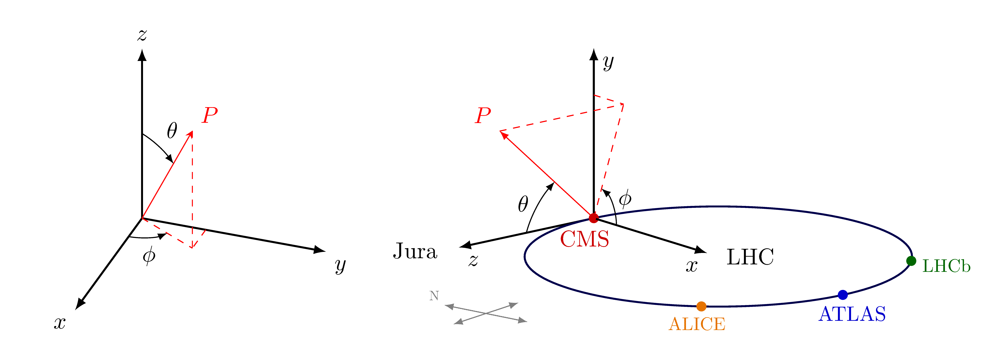

  * [plot-spherical_coords+physics+3d.tex](https://github.com/walmes/Tikz/blob/master/src/plot-spherical_coords+physics+3d.pgf)

```tex
% https://wiki.physik.uzh.ch/cms/latex:example_spherical_coordinates
    % Author: Izaak Neutelings (June 2017)
% taken from https://tex.stackexchange.com/questions/159445/draw-in-cylindrical-and-spherical-coordinates

\documentclass[border=10pt]{standalone} 
\usepackage{tikz}
\usepackage{tikz-3dplot}
\tikzset{>=latex} % for LaTeX arrow head

%% split figures into pages
%\usepackage[active,tightpage]{preview}
%\PreviewEnvironment{tikzpicture}
%\setlength\PreviewBorder{1pt}%

\begin{document}
	
	% 3D axis with spherical coordinates
	\tdplotsetmaincoords{60}{110}
	\begin{tikzpicture}[scale=3,tdplot_main_coords]
	
	% variables
	\def\rvec{.8}
	\def\thetavec{30}
	\def\phivec{60}
	
	% axes
	\coordinate (O) at (0,0,0);
	\draw[thick,->] (0,0,0) -- (1,0,0) node[anchor=north east]{$x$};
	\draw[thick,->] (0,0,0) -- (0,1,0) node[anchor=north west]{$y$};
	\draw[thick,->] (0,0,0) -- (0,0,1) node[anchor=south]{$z$};
	
	% vectors
	\tdplotsetcoord{P}{\rvec}{\thetavec}{\phivec}
	\draw[-stealth,red] (O)  -- (P) node[above right] {$P$};
	\draw[dashed,red]   (O)  -- (Pxy);
	\draw[dashed,red]   (P)  -- (Pxy);
	\draw[dashed,red]   (Py) -- (Pxy);
	
	% arcs
	\tdplotdrawarc[->]{(O)}{0.2}{0}{\phivec}
	{anchor=north}{$\phi$}
	\tdplotsetthetaplanecoords{\phivec}
	\tdplotdrawarc[->,tdplot_rotated_coords]{(0,0,0)}{0.5}{0}{\thetavec}
	{anchor=south west}{$\theta$}
	
	\end{tikzpicture}
	
	
	
	% CMS conventional coordinate system with LHC and other detectors
	\tdplotsetmaincoords{75}{50} % to reset previous setting
	\begin{tikzpicture}[scale=2.7,tdplot_main_coords,rotate around x=90]
	
	% variables
	\def\rvec{1.2}
	\def\thetavec{40}
	\def\phivec{70}
	\def\R{1.1}
	\def\w{0.3}
	
	% axes
	\coordinate (O) at (0,0,0);
	\draw[thick,->] (0,0,0) -- (1,0,0) node[below left]{$x$};
	\draw[thick,->] (0,0,0) -- (0,1,0) node[below right]{$y$};
	\draw[thick,->] (0,0,0) -- (0,0,1) node[below right]{$z$};
	\tdplotsetcoord{P}{\rvec}{\thetavec}{\phivec}
	
	% vectors
	\draw[->,red] (O) -- (P) node[above left] {$P$};
	\draw[dashed,red] (O)  -- (Pxy);
	\draw[dashed,red] (P)  -- (Pxy);
	\draw[dashed,red] (Py) -- (Pxy);
	
	% circle - LHC
	\tdplotdrawarc[thick,rotate around x=90,black!70!blue]{(\R,0,0)}{\R}{0}{360}{}{}
	
	% compass - the line between CMS and ATLAS has a ~12° declination (http://googlecompass.com)
	\begin{scope}[shift={(1.1*\R,0,1.65*\R)},rotate around y=12]
	\draw[<->,black!50] (-\w,0,0) -- (\w,0,0);
	\draw[<->,black!50] (0,0,-\w) -- (0,0,\w);
	\node[above left,black!50,scale=0.6] at (-\w,0,0) {N};
	\end{scope}
	
	% nodes
	\node[left,align=center] at (0,0,1.1) {Jura};
	\node[right] at (\R,0,0) {LHC};
	\fill[radius=0.8pt,black!20!red]
	(O) circle node[left=4pt,below=2pt] {CMS};
	\draw[thick] (0.02,0,0) -- (0.5,0,0); % partially overdraw x-axis and CMS point
	\fill[radius=0.8pt,black!20!blue]
	(2*\R,0,0) circle
	node[right=4pt,below=2pt,scale=0.9] {ATLAS};
	\fill[radius=0.8pt,black!10!orange]
	({\R*sqrt(2)/2+\R},0,{ \R*sqrt(2)/2}) circle
	node[left=2pt,below=2pt,scale=0.8] {ALICE};
	\fill[radius=0.8pt,black!60!green]
	({\R*sqrt(2)/2+\R},0,{-\R*sqrt(2)/2}) circle
	node[below=2pt,right=2pt,scale=0.8] {LHCb};
	
	% arcs
	\tdplotdrawarc[->]{(O)}{0.2}{0}{\phivec}
	{above=2pt,right=-1pt,anchor=mid west}{$\phi$}
	\tdplotdrawarc[->,rotate around z=\phivec-90,rotate around y=-90]{(0,0,0)}{0.5}{0}{\thetavec}
	{anchor=mid east}{$\theta$}
	
	\end{tikzpicture}
	
	
	
\end{document}
```
****

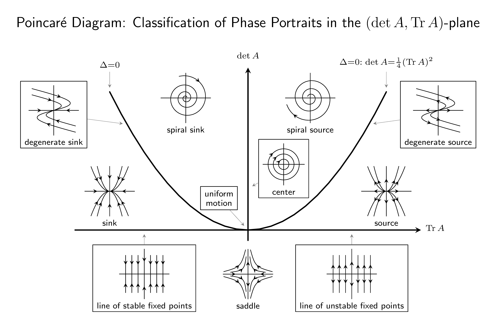

  * [poincare+physics+diagram+foreach+set+command.tex](https://github.com/walmes/Tikz/blob/master/src/poincare+physics+diagram+foreach+set+command.pgf)

```tex
% http://www.texample.net/media/tikz/examples/TEX/poincare.tex
% Poincaré Diagram: Classification of Phase Portraits in the (det A,Tr A)-plane
% Author: Gernot Salzer, 22 Jan 2017
\documentclass[tikz,border=10pt]{standalone}
%%%<
\usepackage{verbatim}
%%%>
\begin{comment}
:Title: Poincare Diagram, Classification of Phase Portraits
:Features: 
:Tags: Arcs;Foreach;Markings;Diagrams;Plots;Mathematics
:Author: Gernot Salzer
:Slug: poincare

The solutions of a system of linear differential equations can be
classified according to the trace and the determinant of the
coefficient matrix. This diagram show schematically the different
types of solutions.

Originally published on TeX.SX, tex.stackexchange.com/a/347401, 6 Jan 2017
Based on a manual drawing by Douglas R. Hundley,
http://people.whitman.edu/~hundledr/courses/M244/Poincare.pdf

You may use the code without any restrictions; no rights reserved. 
\end{comment}

\usetikzlibrary{decorations.markings}

\tikzset
 {every pin/.style = {pin edge = {<-}},    % pins are arrows from label to point
  > = stealth,                            % arrow tips look like stealth bombers
  flow/.style =    % everything marked as "flow" will be decorated with an arrow
   {decoration = {markings, mark=at position #1 with {\arrow{>}}},
    postaction = {decorate}
   },
  flow/.default = 0.5,          % default position of the arrow is in the middle
  main/.style = {line width=1pt}                    % thick lines for main graph
 }

% \newtemplate[Scaling, default 0.18]{\NameOfTemplate}{Caption}{Code}
%
% Typesets Code and stores it in the box \NameOfTemplate.
% This way we avoid nested tikzpictures when inserting the templates into the
% main picture, since nesting is not guaranteed to work.
\newcommand\newtemplate[4][0.18]%
 {\newsavebox#2%
  \savebox#2%
   {\begin{tabular}{@{}c@{}}
      \begin{tikzpicture}[scale=#1]
      #4
      \end{tikzpicture}\\[-1ex]
      \templatecaption{#3}\\[-1ex]
    \end{tabular}%
   }%
 }
\newcommand\template[1]{\usebox{#1}}             % use the Code stored in box #1
\newcommand\templatecaption[1]{{\sffamily\scriptsize#1}}       % typeset caption
\newcommand\Tr{\mathop{\mathrm{Tr}}}

\newtemplate\sink{sink}%
 {\foreach \sx in {+,-}                   % for right/left half do:
   {\draw[flow] (\sx4,0) -- (0,0);        %   draw half of horizontal axis
    \draw[flow] (0,\sx4) -- (0,0);        %   draw half of vertical axis
    \foreach \sy in {+,-}                 %   for upper/lower quadrant do:
      \foreach \a/\b in {2/1,3/0.44}      %     draw two half-parabolas
        \draw[flow,domain=\sx\a:0] plot (\x, {\sy\b*\x*\x});
   }
 }

\newtemplate\source{source}%
 {\foreach \sx in {+,-}                   % for right/left half do:
   {\draw[flow] (0,0) -- (\sx4,0);        %   draw half of horizontal axis
    \draw[flow] (0,0) -- (0,\sx4);        %   draw half of vertical axis
    \foreach \sy in {+,-}                 %   for upper/lower quadrant do:
      \foreach \a/\b in {2/1,3/0.44}      %     draw two half-parabolas
        \draw[flow,domain=0:\sx\a] plot (\x, {\sy\b*\x*\x});
   }
 }

\newtemplate\stablefp{line of stable fixed points}%
 {\draw (-4,0) -- (4,0);                  % draw horizontal axis
  \foreach \sy in {+,-}                   % for upper/lower half do:
   {\draw[flow] (0,\sy4) -- (0,0);        %   draw half of vertical axis
    \foreach \x in {-3,-2,-1,1,2,3}       %   draw six vertical half-lines
      \draw[flow] (\x,\sy3) -- (\x,0);
   }
 }

\newtemplate\unstablefp{line of unstable fixed points}%
 {\draw (-4,0) -- (4,0);                  % draw horizontal axis
  \foreach \sy in {+,-}                   % for upper/lower half do:
   {\draw[flow] (0,0) -- (0,\sy4);        %   draw half of vertical axis
    \foreach \x in {-3,-2,-1,1,2,3}       %   draw six vertical half-lines
      \draw[flow] (\x,0) -- (\x,\sy3);
   }
 }

\newtemplate\spiralsink{spiral sink}%
 {\draw (-4,0) -- (4,0);                  % draw horizontal axis
  \draw (0,-4) -- (0,4);                  % draw vertical axis
  \draw [samples=100,smooth,domain=27:7]  % draw spiral
       plot ({\x r}:{0.005*\x*\x});       % Using "flow" here gives "Dimension
  \def\x{26}                              %        too large", so we draw a tiny
  \draw[->] ({\x r}:{0.005*\x*\x}) -- +(0.01,-0.01);%     tangent for the arrow.
 }

\newtemplate\spiralsource{spiral source}%
 {\draw (-4,0) -- (4,0);                  % draw horizontal axis
  \draw (0,-4) -- (0,4);                  % draw vertical axis
  \draw [samples=100,smooth,domain=10:28] % draw spiral
       plot ({-\x r}:{0.005*\x*\x});      % Using "flow" here gives "Dimension
  \def\x{27.5}                            %        too large", so we draw a tiny
  \draw[<-] ({-\x r}:{0.005*\x*\x}) -- +(0.01,-0.008);%   tangent for the arrow.
 }

\newtemplate[0.15]\centre{center}% British spelling since \center is in use
 {\draw (-4,0) -- (4,0);                  % draw horizontal axis
  \draw (0,-4) -- (0,4);                  % draw vertical axis
  \foreach \r in {1,2,3}                  % draw three circles
    \draw[flow=0.63] (\r,0) arc (0:-360:\r cm);
 }

\newtemplate\saddle{saddle}%
 {\foreach \sx in {+,-}                   % for right/left half do:
   {\draw[flow] (\sx4,0) -- (0,0);        %   draw half of horizontal axis
    \draw[flow] (0,0) -- (0,\sx4);        %   draw half of vertical axis
    \foreach \sy in {+,-}                 %   for upper/lower quadrant do:
      \foreach \a/\b/\c/\d in {2.8/0.3/0.7/0.6, 3.9/0.4/1.3/1.1}
        \draw[flow] (\sx\a,\sy\b)         %     draw two bent lines
          .. controls (\sx\c,\sy\d) and (\sx\d,\sy\c)
          .. (\sx\b,\sy\a);
   }
 }

\newtemplate\degensink{degenerate sink}%
 {\draw (0,-4) -- (0,4);                  % draw vertical axis
  \foreach \s in {+,-}                    % for upper/lower half do:
   {\draw[flow] (\s4,0) -- (0,0);         %   draw half of horizontal axis
    \foreach \a/\b/\c/\d in {3.5/4/1.5/1, 2.5/2/1/0.8}
      \draw[flow] (\s-3.5,\s\a)           %   draw two bent lines
        .. controls (\s\b,\s\c) and (\s\b,\s\d)
        .. (0,0);
   }
 }

\newtemplate\degensource{degenerate source}%
 {\draw (0,-4) -- (0,4);                  % draw vertical axis
  \foreach \s in {+,-}                    % for upper/lower half do:
   {\draw[flow] (0,0) -- (\s4,0);         %   draw half of horizontal axis
    \foreach \a/\b/\c/\d in {3.5/4/1.5/1, 2.5/2/1/0.8}
      \draw[flow] (0,0)                   %   draw two bent lines
        .. controls (\s\b,\s\d) and (\s\b,\s\c)
        .. (\s-3.5,\s\a);
   }
 }

\begin{document}
\begin{tikzpicture}[line cap=round,line join=round]
  % MAIN DIAGRAM
  \draw [main,->] (0,-0.3) -- (0,4.7)                            % vertical axis
    node [label={[above]$\scriptstyle\det A$}] {}
    node [label={[above,yshift=0.8cm]%
      {\sffamily\large Poincar\'e Diagram: Classification of Phase
      Portraits in the $(\det A,\Tr A)$-plane}}] {};
  \draw [main,->] (-5,0) -- (5,0)                              % horizontal axis
    node [label={[right,yshift=-0.5ex]$\scriptstyle\Tr A$}] {}; 
  \draw [main, domain=-4:4] plot (\x, {0.25*\x*\x});                % main graph
  \node at (-4,4) [pin={[above]$\scriptstyle\Delta=0$}] {};
  \node at ( 4,4) [pin={[above,align=left]%
    {$\scriptstyle\Delta=0:\;\det A=\frac{1}{4}(\Tr A)^2$}}] {};
  % TEMPLATES describing areas
  \node at ( 0  ,-1.4) {\template\saddle};
  \node at (-4  , 1  ) {\template\sink};
  \node at ( 4  , 1  ) {\template\source}; 
  \node at (-1.8, 3.7) {\template\spiralsink};
  \node at ( 1.8, 3.7) {\template\spiralsource};
  % TEMPLATES labeling lines and points
  \node at ( 0  , 1.2) [pin={[draw,right,xshift=0.3cm]%
    \template\centre}] {};
  \node at (-3  , 0  ) [pin={[draw,below,yshift=-1cm]%
    \template\stablefp}] {};
  \node at ( 3  , 0  ) [pin={[draw,below,yshift=-1cm]%
    \template\unstablefp}] {};
  \node at (-3.5,{0.25*3.5*3.5}) [pin={[draw,left,xshift=-1.15cm,yshift=-0.3cm]%
    \template\degensink}] {};
  \node at ( 3.5,{0.25*3.5*3.5}) [pin={[draw,right,xshift=0.9cm,yshift=-0.3cm]%
    \template\degensource}] {};
  \node at ( 0  , 0  ) [pin={[draw,above left,align=center,xshift=-0.3cm]%
    \templatecaption{uniform}\\[-1ex]\templatecaption{motion}}] {};
\end{tikzpicture}
\end{document}
```
****


  * [porter_model+diagram.tex](https://github.com/walmes/Tikz/blob/master/src/porter_model+diagram.pgf)

```tex
% http://www.texample.net/media/tikz/examples/TEX/porter-model.tex
% Porter model
% Author: Charles-Axel Dein
\documentclass[10pt,a4paper]{article} 

\usepackage[hmargin=2cm,vmargin=1cm]{geometry}
\renewcommand{\rmdefault}{bch} % change default font

\usepackage[english]{babel}
\usepackage[utf8]{inputenc}
\usepackage{tikz} 
\usetikzlibrary{arrows,decorations.pathmorphing,backgrounds,fit,positioning,shapes.symbols,chains}

%%%<
\usepackage{verbatim}
\usepackage[active,tightpage,floats]{preview}
\setlength\PreviewBorder{5pt}%
%%%>

\begin{comment}
:Title: Porter model

A Porter five (or six) forces model.


\end{comment}

%%%%%%%%%%%%%%%%%%%%%%%%%%%%%%%%%%%%
%%% BEGIN DOCUMENT
\begin{document}

\begin{figure}[h]

\centering
\begin{tikzpicture}
[node distance = 1cm, auto,font=\footnotesize,
% STYLES
every node/.style={node distance=3cm},
% The comment style is used to describe the characteristics of each force
comment/.style={rectangle, inner sep= 5pt, text width=4cm, node distance=0.25cm, font=\scriptsize\sffamily},
% The force style is used to draw the forces' name
force/.style={rectangle, draw, fill=black!10, inner sep=5pt, text width=4cm, text badly centered, minimum height=1.2cm, font=\bfseries\footnotesize\sffamily}] 

% Draw forces
\node [force] (rivalry) {Rivalry among existing competitors};
\node [force, above of=rivalry] (substitutes) {Threat of substitutes};
\node [force, text width=3cm, dashed, left=1cm of substitutes] (state) {Public policies};
\node [force, left=1cm of rivalry] (suppliers) {Bargaining power of suppliers};
\node [force, right=1cm of rivalry] (users) {Bargaining power of users};
\node [force, below of=rivalry] (entrants) {Threat of new entrants};

%%%%%%%%%%%%%%%
% Change data from here

% RIVALRY
\node [comment, below=0.25 of rivalry] (comment-rivalry) {(+) A war against Microsoft\\
(+) Limiting sunk costs\\
(+) Coopetition};

% SUPPLIERS
\node [comment, below=0.25cm of suppliers] {(+) Efficiency\\
(+) Attracting other developers\\
(+) Creating a Chrome community};

% SUBSTITUTES
\node [comment, right=0.25 of substitutes] {(+) Portability};

% USERS
\node [comment, below=0.25 of users] {(+) Increasing the user information\\
(+) Reducing the switching costs};

% NEW ENTRANTS
\node [comment, right=0.25 of entrants] {(+) EC vs. Microsoft};

% PUBLIC POLICIES
\node [comment, text width=3cm, below=0.25 of state] {(+) Positively framed\\
(+) Transparency\\
(--) A new monopoly?};

%%%%%%%%%%%%%%%%

% Draw the links between forces
\path[->,thick] 
(substitutes) edge (rivalry)
(suppliers) edge (rivalry)
(users) edge (rivalry)
(entrants) edge (comment-rivalry);

\end{tikzpicture} 
\caption{FOSS in Chrome influences industry structure by increasing competition}
\label{fig:6forces}
\end{figure}

\end{document}
```
****

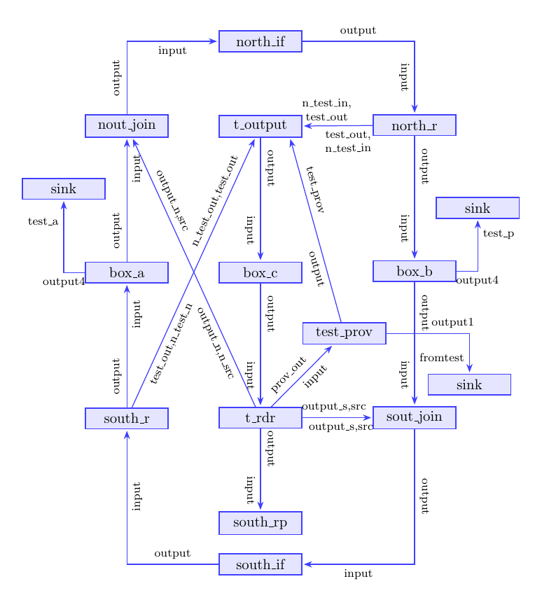

  * [positioning_blocks+diagram+foreach+scope+set+frame.tex](https://github.com/walmes/Tikz/blob/master/src/positioning_blocks+diagram+foreach+scope+set+frame.pgf)

```tex
% https://tex.stackexchange.com/a/403931/173708
\documentclass[border=15pt]{standalone}
%\usepackage{showframe}
\usepackage{tikz}
\usetikzlibrary{arrows.meta,positioning}
\usepackage[latin1]{inputenc}

\tikzset{
  line/.style={>=Stealth, semithick, draw=blue!75},
  post/.style={line,->, shorten >=1pt},
  node_box/.style={rectangle, thick, draw=blue!75, fill=blue!10,minimum width=20mm, minimum height=5mm},
  labelnode/.style={auto, sloped, font=\footnotesize,align=center},
}

\begin{document}
%\begin{center}
\begin{tikzpicture}[node distance=3cm and 1.7cm]
	\begin{scope}[every node/.style={node_box}]
	  \node                                       (south_if)    {south\_if};
	  \node [above left=of south_if,xshift=5mm]   (south_r)     {south\_r};
	  \node [above=of south_r]                    (box_a)       {box\_a};
	  \node [above=of box_a]                      (nout_join)   {nout\_join};
	  \node [above right=of south_if]             (sout_join)   {sout\_join};
	  \node [above=of sout_join]                  (box_b)       {box\_b};
	  \node [above=of box_b]                      (north_r)     {north\_r};
	  \node [above left=of north_r,yshift=-1.5cm] (north_if)    {north\_if};
	%
	  \node [at={(south_if |- box_a)}]            (box_c)  {box\_c};
	  \node [at={(box_c|-sout_join)}]             (t_rdr)       {t\_rdr};
	%
	  \node [above=of box_c]                       (t_output)    {t\_output};
	  \node [below=2cm of t_rdr]                   (south_rp)    {south\_rp};
	  \node [above right=1.5cm and 0mm of t_rdr]   (test_prov)   {test\_prov};
	  \node [below right=7mm and 1cm of test_prov] (sink_prov)   {sink};
	  \node [above left=1.5cm and -5mm of box_a]   (sink_test_a) {sink};
	  \node [above right=1cm and -5mm of box_b]    (sink_test_p) {sink};
	\end{scope}
	
	\begin{scope}[every node/.style={labelnode}]
	
	\foreach \i/\j in  {%
	    box_b/sout_join,
	    box_a/nout_join,
	    north_r/box_b,
	    box_c/t_rdr,
	    t_rdr/south_rp,
	    t_output/box_c,
	    south_r/box_a}
	  \draw [post] (\i) -- (\j)
	     node[above,near start] {output}
	     node[below,near end,swap] {input};
	
	\foreach \i/\j in{%
	    nout_join/north_if,
	    sout_join/south_if}
	  \draw [post] (\i) |- (\j)
	    node[above,near start] {output}
	    node[below,near end,swap] {input};
	
	\foreach \i/\j in{%
	    north_if/north_r,
	    south_if/south_r}
	  \draw [post] (\i) -| (\j)
	    node[above,near start] {output}
	    node[below,near end,swap] {input};
	
	\draw [post] (t_rdr) -- (test_prov)
	  node[above,pos=0.4] {prov\_out}
	  node[below,pos=0.6] {input};
	
	\draw [post] (test_prov) -- ([xshift=-3mm]t_output.south east)
	  node[above,pos=0.7] {test\_prov}
	  node[below,pos=0.3] {output};
	
	\draw [post] (t_rdr) -- (sout_join)
	  node[above,pos=0.45] {output\_s,src}
	  node[below,pos=0.55] {output\_s,src};
	
	\draw [post] (test_prov) -| (sink_prov)
	  node[above,pos=0.4] {output1}
	  node[left,sloped=false,pos=0.8] {fromtest};
	
	\draw [post] (north_r) -- (t_output)
	  node[above,pos=0.65] {n\_test\_in,\\test\_out}
	  node[below,pos=0.35] {test\_out,\\n\_test\_in};
	
	\draw [post] (box_a) -| (sink_test_a)
	  node[left,sloped=false,pos=0.85] {test\_a}
	  node[below,pos=0.49] {output4};
	
	\draw [post] (box_b) -| (sink_test_p)
	  node[right,sloped=false,pos=0.85] {test\_p}
	  node[below,pos=0.49] {output4};
	
	\draw [post] (t_rdr) -- (nout_join)
	  node[below,near start] {output\_n,n\_src}
	  node[above,near end] {output\_n,src};
	
	\draw [post] (south_r) -- (t_output)
	  node[below,near start] {test\_out,n\_test\_n}
	  node[above,near end] {n\_test\_out,test\_out};
	
	\end{scope}

\end{tikzpicture}
%\end{center}
\end{document}
```
****

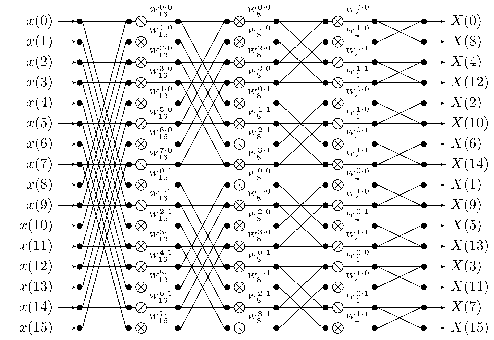

  * [radix_signal_flow+math+diagram+foreach+style+counter.tex](https://github.com/walmes/Tikz/blob/master/src/radix_signal_flow+math+diagram+foreach+style+counter.pgf)

```tex
\documentclass{standalone}

\usepackage{tikz}

\usetikzlibrary{arrows}
\usepackage{verbatim}

\begin{comment}
:Title: Radix-2 FFT signal flow
:Slug: radix2fft
:Tags: Foreach

Radix-2 signal flow graph for a 16 point fast Fourier transform (FFT).
This diagram is quite complex. However, the most difficult part is keeping
track of all the indexes. The ``foreach`` command is used extensively to
get compact code.

| Source: The diagram was inspired by content on `this web page`__.

.. __: http://www.ece.uvic.ca/499/2004a/group05/html/background.html

\end{comment}

\begin{document}
\pagestyle{empty}

\tikzstyle{n}= [circle, fill, minimum size=4pt,inner sep=0pt, outer sep=0pt]
\tikzstyle{mul} = [circle,draw,inner sep=-1pt]

% Define two helper counters
\newcounter{x}\newcounter{y}
\begin{tikzpicture}[yscale=0.5, xscale=1.2, node distance=0.3cm, auto]
    % The strategy is to create nodes with names: N-column-row
    % Input nodes are named N-0-0 ... N-0-15
    % Output nodes are named N-10-0 ... N-10-15

    % Draw inputs
    \foreach \y in {0,...,15}
        \node[n, pin={[pin edge={latex'-,black}]left:$x(\y)$}]
              (N-0-\y) at (0,-\y) {};
    % Draw outputs
    \foreach \y / \idx in {0/0,1/8,2/4,3/12,4/2,5/10,6,7/14,
                           8/1,9,10/5,11/13,12/3,13/11,14/7,15}
        \node[n, pin={[pin edge={-latex',black}]right:$X(\idx)$}]
              (N-10-\y) at (7,-\y) {};
   % draw connector nodes
    \foreach \y in {0,...,15}
        \foreach \x / \c in {1/1,2/3,3/4,4/6,5/7,6/9}
            \node[n, name=N-\c-\y] at (\x,-\y) {};
    % draw x nodes
    \foreach \y in {0,...,15}
        \foreach \x / \c  in {1/2,4/5,7/8}
            \node[mul, right of=N-\x-\y] (N-\c-\y) {${\times}$};

    % horizontal connections
    % Note the use of simple counter arithmetics to get correct
    % indexes.
    \foreach \y in {0,...,15}
        \foreach \x in {0,1,3,4,6,7,9}
        {
            \setcounter{x}{\x}\stepcounter{x}
            \path (N-\x-\y) edge[-] (N-\arabic{x}-\y);
       }
    % Draw the W_16 coefficients
    \setcounter{y}{0}
    \foreach \i / \j in {0/0,1/0,2/0,3/0,4/0,5/0,6/0,7/0,
                            0/1,1/1,2/1,3/1,4/1,5/1,6/1,7/1}
    {
        \path (N-2-\arabic{y}) edge[-] node {\tiny $W^{\i\cdot\j}_{16}$}
                (N-3-\arabic{y});
        \stepcounter{y}
    }
    % Draw the W_8 coefficients
    \setcounter{y}{0}
    \foreach \i / \j in {0/0,1/0,2/0,3/0,0/1,1/1,2/1,3/1,
                         0/0,1/0,2/0,3/0,0/1,1/1,2/1,3/1}
    {
        \path (N-5-\arabic{y}) edge[-] node {\tiny $W^{\i\cdot\j}_{8}$}
              (N-6-\arabic{y});
        \addtocounter{y}{1}
    }

    % Draw the W_4 coefficients
    \setcounter{y}{0}
    \foreach \i / \j in {0/0,1/0,0/1,1/1,0/0,1/0,0/1,1/1,
                            0/0,1/0,0/1,1/1,0/0,1/0,0/1,1/1}
    {
        \path (N-8-\arabic{y}) edge[-] node {\tiny $W^{\i\cdot\j}_{4}$}
              (N-9-\arabic{y});
        \stepcounter{y}
    }
    % Connect nodes
    \foreach \sourcey / \desty in {0/8,1/9,2/10,3/11,
                                   4/12,5/13,6/14,7/15,
                                   8/0,9/1,10/2,11/3,
                                   12/4,13/5,14/6,15/7}
       \path (N-0-\sourcey.east) edge[-] (N-1-\desty.west);
    \foreach \sourcey / \desty in {0/4,1/5,2/6,3/7,
                                   4/0,5/1,6/2,7/3,
                                   8/12,9/13,10/14,11/15,
                                   12/8,13/9,14/10,15/11}
        \path (N-3-\sourcey.east) edge[-] (N-4-\desty.west);
    \foreach \sourcey / \desty in {0/2,1/3,2/0,3/1,
                                   4/6,5/7,6/4,7/5,
                                   8/10,9/11,10/8,11/9,
                                   12/14,13/15,14/12,15/13}
        \path (N-6-\sourcey.east) edge[-] (N-7-\desty.west);
    \foreach \sourcey / \desty in {0/1,1/0,2/3,3/2,
                                   4/5,5/4,6/7,7/6,
                                   8/9,9/8,10/11,11/10,
                                   12/13,13/12,14/15,15/14}
        \path (N-9-\sourcey.east) edge[-] (N-10-\desty.west);

\end{tikzpicture}

\end{document}
```
****


  * [scenario_tree+diagram.tex](https://github.com/walmes/Tikz/blob/master/src/scenario_tree+diagram.pgf)

```tex
% http://www.texample.net/media/tikz/examples/TEX/scenario-tree.tex
% Scenario tree
% Author: Rasmus Pank Roulund
\documentclass[border=5pt]{standalone}
\usepackage{tikz}
\usepackage{verbatim}

\begin{comment}
:Title: Scenario tree
:Tags: Trees

A scenario tree from the field of economics. The figure is a replication of a figure 4 from
Barry Eichengreen's NBER paper on "Hegemonic Stability Theories of the International Monetary System" 
from 1987 (PDF_). 

.. _PDF: http://papers.nber.org/papers/W2193.pdf

:Author: Rasmus Pank Roulund

\end{comment}

\usetikzlibrary{shapes}
\usepackage{amsmath}
\usepackage{xspace}
\newcommand{\A}{\ensuremath{\mathcal{A}}\xspace}
\newcommand{\B}{\ensuremath{\mathcal{B}}\xspace}
\newcommand\pa[1]{\ensuremath{\left(#1\right)}}
\begin{document}
\begin{tikzpicture}[
    grow=right,
    level 1/.style={sibling distance=3.5cm,level distance=5.2cm},
    level 2/.style={sibling distance=3.5cm, level distance=6.7cm},
    edge from parent/.style={very thick,draw=blue!40!black!60,
        shorten >=5pt, shorten <=5pt},
    edge from parent path={(\tikzparentnode.east) -- (\tikzchildnode.west)},
    kant/.style={text width=2cm, text centered, sloped},
    every node/.style={text ragged, inner sep=2mm},
    punkt/.style={rectangle, rounded corners, shade, top color=white,
    bottom color=blue!50!black!20, draw=blue!40!black!60, very
    thick }
    ]

\node[punkt, text width=5.5em] {Country~\B}
    %Lower part lv1
    child {
        node[punkt] [rectangle split, rectangle split, rectangle split parts=3,
         text ragged] {
            \textbf{Scenario  1}
                  \nodepart{second}
            $\text{Country \B}\colon    s\bar{Q}$
                  \nodepart{third}
            $\text{Country \A}\colon\pa{1-s}\bar{Q}$
        }
        edge from parent
            node[kant, below, pos=.6] {Unchanged parity}
    }
    %Upper part, lv1
    child {
        node[punkt, text width=6em] {Country~\A}
        %child 1
        child {
            node [punkt,rectangle split, rectangle split,
            rectangle split parts=3] {
                \textbf{Scenario  2}
                \nodepart{second}
                $\text{Country \B}\colon s\bar{Q}+2\alpha\Delta E -sc$
                \nodepart{third}
                $\text{Country \A}\colon\pa{1-s}\bar{Q}-\alpha\Delta E -
                \pa{1-s}c$
            }
            edge from parent
                node[below, kant,  pos=.6] {Unchanged parity}
        }
        %child 2
        child {
            node [punkt, rectangle split, rectangle split parts=3]{
                \textbf{Scenario 3}
                \nodepart{second}
                $\text{Country \B}\colon s\bar{Q}-2sc$
                \nodepart{third}
                $\text{Country \A}\colon\pa{1-s}\bar{Q}-2\pa{1-s}c$
            }
            edge from parent
                node[kant, above] {Devalues}}
            edge from parent{
                node[kant, above] {Devalues}}
    };
\end{tikzpicture}
\end{document}
```
****


  * [server_player+diagram.tex](https://github.com/walmes/Tikz/blob/master/src/server_player+diagram.pgf)

```tex
% https://tex.stackexchange.com/questions/188582/tikz-is-it-possible-to-draw-this-block-diagram
\documentclass[border=3pt]{standalone}
\usepackage{tikz}
\usetikzlibrary{positioning,fit,patterns}

\tikzset{
  pics/media/.style ={
    code = { %
      \node[text width=2cm,minimum height=2cm,#1] (back) {};
      \node[draw,anchor=center,fill=white] at ([yshift=5pt]back.center) {Media};
      \draw[dashed] (back.north west) rectangle (back.south east);
    }
  },
  pics/media/.default={pattern=north east lines},
  aes/.style={
    draw,
    fill=red!30
  },
  rsa/.style={
    draw,
    rounded corners,
    fill=blue!30
  },
  ar/.style={
    ->,
    >=latex,
    shorten >= 3pt,
    shorten <= 3pt,    
  },
  ar2/.style={
    ->,
    >=latex,
    line width=2pt,
    shorten >= 3pt,
    shorten <= 3pt,    
  }
}

\newcommand\mediaencryptedbox[3][1cm]{
\node[
  draw,
  thick,
  rounded corners,
  #2,
  text width=3.5cm,
  minimum height=4.5cm,
  anchor=north west,
  yshift=#1
  ]
  (#3)
  {};
\node[
  aes,
  anchor=north
  ]
  at (#3.north) 
  {AES key}; 
\pic at (#3.center) (sm3) {media};
\node[
  anchor=south
  ]
  (rsa)  
  at (sm3back.north) 
  {Encrypted with RSA};
\node[
  anchor=north
  ] 
  at (sm3back.south) 
  {Encrypted with AES};
\draw
  (#3.west|-rsa.south) -- (#3.east|-rsa.south);
}

\begin{document}

\begin{tikzpicture}

% The Server
\pic (sm1) {media={fill=gray!30}};
\pic[right=of sm1back] (sm2) {media};
\mediaencryptedbox{right=of sm2back}{box1}
\node[
  aes,
  anchor=north,
  above=of sm2back.north
  ]
  (aes1)
  {AES key};  
\draw[ar]
  (aes1) -- (sm2back.north) ;  
\draw[ar]
  (aes1.south east) to[out=-60,in=180] coordinate (aux1) (box1.north west) ;
\node[
  anchor=west,
  rsa
  ]
  at (aux1|-aes1)
  (rsa1)
  {RSA public key};    

\draw[ar]
  (rsa1) -- (aux1) ;  

\draw[ar2]
  (sm1back.east) -- (sm2back.west);
\draw[ar2]
  (sm2back.east) -- (box1.west|-sm2back.east);

\node[
  inner sep=10pt,
  draw,
  dashed,fit={(sm1back.north west) (box1.south east) (aes1)}
  ]
  (server) 
  {};
\node[
  anchor=south west,
  font=\Large
  ]
  at ([shift={(15pt,5pt)}]server.north west)
  {Server};      

% The Player
\mediaencryptedbox[2.2cm]{right=6cm of box1}{box2}
\node[
  anchor=north west,
  rsa,
  above left=of box2
  ]
  (rsa2)
  {RSA public key};    
\draw[ar]
  (rsa2.south) 
    to[out=-80,in=160]
    node[align=center,anchor=east,shift={(10pt,-20pt)}] {RSA decryption \\ (slow)} 
  ([yshift=-20pt]box2.north west);
\draw[ar]
  ([yshift=-10pt]box2.north east) 
    to[out=0,in=0]
    node[align=center,anchor=west,shift={(5pt,0pt)}] (AESd) {AES decryption \\ (fast)} 
  (sm3back.east);
\node[
  inner sep=10pt,
  draw,
  dashed,fit={(rsa2) (box2.south east) (AESd)}
  ]
  (player) 
  {};
\node[
  anchor=south west,
  font=\Large
  ]
  at ([shift={(15pt,5pt)}]player.north west)
  {Player};

\draw[ar2]
  (server.east) -- (player.west|-server.east);        
\draw[ar2]
  ([yshift=10pt]sm3back.south east) -- ++(3cm,0) node[near end,anchor=south west] {Streaming};
\end{tikzpicture}

\end{document}
```
****

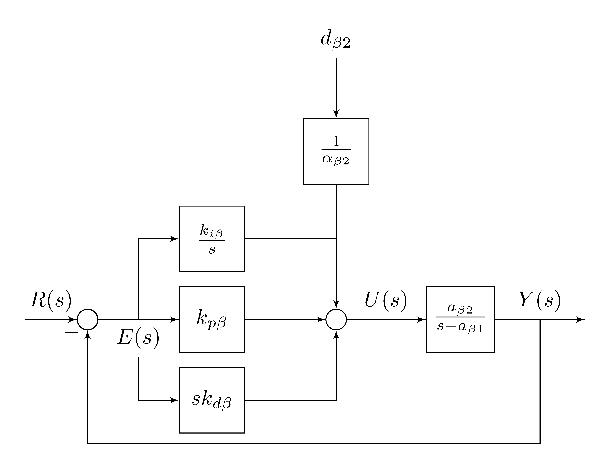

  * [simple-right+diagram.tex](https://github.com/walmes/Tikz/blob/master/src/simple-right+diagram.pgf)

```tex
\documentclass[tikz,border=10pt]{standalone}
\usepackage{tikz}
\usetikzlibrary{shapes,arrows,positioning,calc}

\begin{document}
	
	\tikzset{
		block/.style = {draw, fill=white, rectangle, minimum height=3em, minimum width=3em},
		tmp/.style  = {coordinate}, 
		sum/.style= {draw, fill=white, circle, node distance=1cm},
		input/.style = {coordinate},
		output/.style= {coordinate},
		pinstyle/.style = {pin edge={to-,thin,black}
		}
	}
	
	
	
	%\begin{figure}[!htb]
	%\centering
	
	\begin{tikzpicture}[auto, node distance=2cm,>=latex']
	\node [input, name=rinput] (rinput) {};
	\node [sum, right of=rinput] (sum1) {};
	\node [block, right of=sum1] (controller) {$k_{p\beta}$};
	\node [block, above of=controller,node distance=1.3cm] (up){$\frac{k_{i\beta}}{s}$};
	\node [block, below of=controller,node distance=1.3cm] (rate) {$sk_{d\beta}$};
	\node [sum, right of=controller,node distance=2cm] (sum2) {};
	\node [block, above = 2cm of sum2](extra){$\frac{1}{\alpha_{\beta2}}$};  %
	\node [block, right of=sum2,node distance=2cm] (system) 
	{$\frac{a_{\beta 2}}{s+a_{\beta 1}}$};
	\node [output, right of=system, node distance=2cm] (output) {};
	\node [tmp, below of=controller] (tmp1){$H(s)$};
	\draw [->] (rinput) -- node{$R(s)$} (sum1);
	\draw [->] (sum1) --node[name=z,anchor=north]{$E(s)$} (controller);
	\draw [->] (controller) -- (sum2);
	\draw [->] (sum2) -- node{$U(s)$} (system);
	\draw [->] (system) -- node [name=y] {$Y(s)$}(output);
	\draw [->] (z) |- (rate);
	\draw [->] (rate) -| (sum2);
	\draw [->] (z) |- (up);
	\draw [->] (up) -| (sum2);
	\draw [->] (y) |- (tmp1)-| node[pos=0.99] {$-$} (sum1);
	\draw [->] (extra)--(sum2);
	\draw [->] ($(0,1.5cm)+(extra)$)node[above]{$d_{\beta 2}$} -- (extra);
	\end{tikzpicture}
	%\caption{A PID Control System} \label{fig6_10}
	%\end{figure}
	
\end{document}
```
****


  * [simple-wrong+diagram.tex](https://github.com/walmes/Tikz/blob/master/src/simple-wrong+diagram.pgf)

```tex
\documentclass[tikz,border=10pt]{standalone}

\usepackage{tikz}
\usetikzlibrary{shapes,arrows}
\begin{document}
	
	\tikzstyle{block} = [draw, fill=white, rectangle, 
	minimum height=3em, minimum width=6em]
	\tikzstyle{sum} = [draw, fill=white, circle, node distance=1cm]
	\tikzstyle{input} = [coordinate]
	\tikzstyle{output} = [coordinate]
	\tikzstyle{pinstyle} = [pin edge={to-,thin,black}]
	
	\begin{tikzpicture}[auto, node distance=2cm,>=latex']
	
	\node [input, name=input] {};
	\node [sum, right of=input] (sum) {};
	\node [block, right of=sum] (controller) {Controller};
	\node [block, right of=controller, pin={[pinstyle]above:D},
	node distance=3cm] (system) {System};
	
	\draw [->] (controller) -- node[name=u] {$u$} (system);
	\node [output, right of=system] (output) {};
	\node [block, below of=u] (measurements) {Measurements};
	
	\draw [draw,->] (input) -- node {$r$} (sum);
	\draw [->] (sum) -- node {$e$} (controller);
	\draw [->] (system) -- node [name=y] {$y$}(output);
	\draw [->] (y) |- (measurements);
	\draw [->] (measurements) -| node[pos=0.99] {$-$} 
	node [near end] {$y_m$} (sum);
	\end{tikzpicture}
\end{document}
```
****

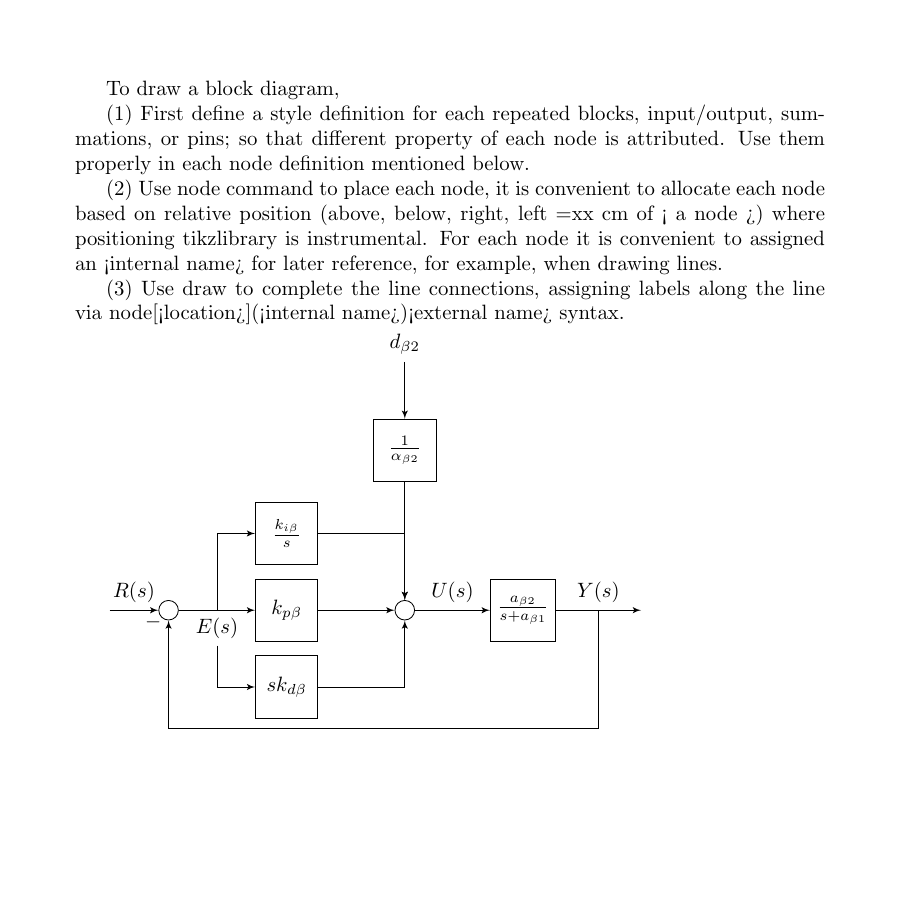

  * [steps+diagram.tex](https://github.com/walmes/Tikz/blob/master/src/steps+diagram.pgf)

```tex
% https://tex.stackexchange.com/a/175979/173708
\documentclass{article}
\usepackage[paperheight=6in,paperwidth=6in, 
					top=0.5in, 
					bottom=0.5in, 
					left=0.5in, 
					right=0.5in]{geometry}

\pagestyle{empty}

\usepackage{tikz}
\usepackage{verbatim}
\usetikzlibrary{shapes,arrows,positioning,calc}

\begin{comment}
	
	To draw a block diagram,
	
	(1) First define a style definition for each repeated blocks, input/output, summations, or pins; so that different property of each node is attributed. Use them properly in each node definition mentioned below.
	
	(2) Use node command to place each node, it is convenient to allocate each node based on relative position (above, below, right, left =xx cm of < a node >) where positioning tikzlibrary is instrumental. For each node it is convenient to assigned an <internal name> for later reference, for example, when drawing lines.
	
	(3) Use draw to complete the line connections, assigning labels along the line via node[<location>](<internal name>){<external name>} syntax. 
	
\end{comment}	

\begin{document}
	
	To draw a block diagram,
	
	(1) First define a style definition for each repeated blocks, input/output, summations, or pins; so that different property of each node is attributed. Use them properly in each node definition mentioned below.
	
	(2) Use node command to place each node, it is convenient to allocate each node based on relative position (above, below, right, left =xx cm of < a node >) where positioning tikzlibrary is instrumental. For each node it is convenient to assigned an <internal name> for later reference, for example, when drawing lines.
	
	(3) Use draw to complete the line connections, assigning labels along the line via node[<location>](<internal name>){<external name>} syntax. 

\tikzset{
block/.style = {draw, fill=white, rectangle, minimum height=3em, minimum width=3em},
tmp/.style  = {coordinate}, 
sum/.style= {draw, fill=white, circle, node distance=1cm},
input/.style = {coordinate},
output/.style= {coordinate},
pinstyle/.style = {pin edge={to-,thin,black}
}
}


%\begin{figure}[!htb]
%\centering
\begin{tikzpicture}[auto, node distance=2cm,>=latex']
    \node [input, name=rinput] (rinput) {};
    \node [sum, right of=rinput] (sum1) {};
    \node [block, right of=sum1] (controller) {$k_{p\beta}$};
    \node [block, above of=controller,node distance=1.3cm] (up){$\frac{k_{i\beta}}{s}$};
    \node [block, below of=controller,node distance=1.3cm] (rate) {$sk_{d\beta}$};
    \node [sum, right of=controller,node distance=2cm] (sum2) {};
    \node [block, above = 2cm of sum2](extra){$\frac{1}{\alpha_{\beta2}}$};  %
    \node [block, right of=sum2,node distance=2cm] (system) 
{$\frac{a_{\beta 2}}{s+a_{\beta 1}}$};
    \node [output, right of=system, node distance=2cm] (output) {};
    \node [tmp, below of=controller] (tmp1){$H(s)$};
    \draw [->] (rinput) -- node{$R(s)$} (sum1);
    \draw [->] (sum1) --node[name=z,anchor=north]{$E(s)$} (controller);
    \draw [->] (controller) -- (sum2);
    \draw [->] (sum2) -- node{$U(s)$} (system);
    \draw [->] (system) -- node [name=y] {$Y(s)$}(output);
    \draw [->] (z) |- (rate);
    \draw [->] (rate) -| (sum2);
    \draw [->] (z) |- (up);
    \draw [->] (up) -| (sum2);
    \draw [->] (y) |- (tmp1)-| node[pos=0.99] {$-$} (sum1);
    \draw [->] (extra)--(sum2);
    \draw [->] ($(0,1.5cm)+(extra)$)node[above]{$d_{\beta 2}$} -- (extra);
    \end{tikzpicture}
%\caption{A PID Control System} \label{fig6_10}
%\end{figure}

\end{document}
```
****


  * [time-1990-2010-arr+timeline+foreach+learn.tex](https://github.com/walmes/Tikz/blob/master/src/time-1990-2010-arr+timeline+foreach+learn.pgf)

```tex
% https://stackoverflow.com/a/2444380/5270873
% commented
\documentclass[tikz]{standalone}

\usepackage{verbatim}
\begin{document}
\newlength\yearposx

\begin{tikzpicture}[scale=0.57] % timeline 1990-2010->
    % define coordinates (begin, used, end, arrow); doesn't draw anything yet
    % this is nice because we are creating the reference names for each of the years
    \foreach \x in {1990,1992,2000,2002,2004,2005,2008,2009,2010,2011} {
        \pgfmathsetlength\yearposx{(\x-1990)*1cm};
        \coordinate (y\x)   at (\yearposx,0);
        \coordinate (y\x t) at (\yearposx,+3pt);    % coordinate y at top
        \coordinate (y\x b) at (\yearposx,-3pt);    % coordinate y at bottom
    }

    % draw horizontal line with arrow at the right end
    \draw [->] (y1990) -- (y2011);
    
    % draw ticks
   \foreach \x in {1992,2000,2002,2004,2005,2008,2009}
        \draw (y\x t) -- (y\x b);

    % annotate
    % print years below
    \foreach \x in {1992,2002,2005,2009}
        \node at (y\x) [below=3pt] {\x};

    % print years above
    \foreach \x in {2000,2004,2008}
        \node at (y\x) [above=3pt] {\x};
        
%	\draw node at (y1993) -- [below=5pt] {93};

\end{tikzpicture}
\end{document}
```
****


  * [time-added-dots+timeline+style+text.tex](https://github.com/walmes/Tikz/blob/master/src/time-added-dots+timeline+style+text.pgf)

```tex
% https://tex.stackexchange.com/a/303028/173708
\documentclass{article}
\usepackage{tikz}
\usetikzlibrary{arrows,positioning,decorations.pathreplacing}
\usepackage{lipsum}

\begin{document}
\lipsum[1]

\begin{center}
\makebox[\textwidth]{
\begin{tikzpicture}[
  every node/.style = {align=center},
        Line/.style = {-angle 90, shorten <=-2pt},
  Brace/.style args = {#1}{semithick, 
  							decorate, 
  							decoration={brace, 
  								#1, 
  								raise=20pt, 
  								pre=moveto, 
  								pre length=2pt, 
  								post=moveto, 
  								post length=2pt,}},
          ys/.style = {yshift=#1}
                  ]
	\linespread{0.8}                    
	\coordinate (a) at (0,0);
	\coordinate[right=30mm of a]    (b);
	\coordinate[right=30mm of b]    (c);
	\coordinate[right= 20mm of c]   (d);
	\coordinate[right=24mm of d]    (e);
	\coordinate[right= 5mm of e]    (f);
	\coordinate[right=22mm of f]    (g);
	
	%  adding * specs to the Line \draw macros for the dot
	\draw[Line,*-]  (a) --  (g) node[right] {$x$};
	\draw[Line, *-] (b) --  (c) ;
	\draw[Line, *-] (d) --  (e) ;
	\draw[Line, *-] (f) --  (g) ;
	
	\draw[Brace=mirror] (a) -- node[below=20pt] {Compensation} (b);
	\draw[Brace=mirror] (b) -- node[below=20pt] {Gift} (d);
	
	\draw ([ys=0mm] a) node[below] {0} -- (a);
	\draw ([ys=0mm] b) node[below] {$\theta s$} -- (b);
	\draw[Line, shorten >=4pt] ([ys=10mm]  c) node[above] {$\delta$} -- (c);
	\draw[Line, shorten >=4pt] ([ys=10mm]  d) node[above] {$x(\delta)$} -- (d);
	\draw ([ys=0mm]  d) node[below] {$\theta s + w$} -- (d);
	
	\draw ([ys=0mm]  f) node[below] {$z$} -- (f);
\end{tikzpicture}
}
\end{center}
\lipsum[2]
\end{document}
```
****

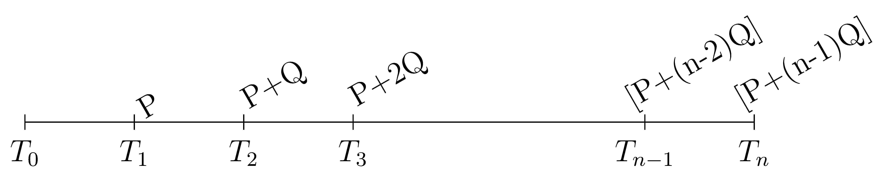

  * [time-angling-text-1+timeline+foreach+learn.tex](https://github.com/walmes/Tikz/blob/master/src/time-angling-text-1+timeline+foreach+learn.pgf)

```tex
% https://tex.stackexchange.com/a/390396/173708
\documentclass[12pt,a4paper]{standalone}
\usepackage[utf8]{inputenc}
\usepackage{graphicx,tikz}

\begin{document}
\begin{tikzpicture}[scale=1,rotLabel/.style={above,rotate=30,anchor=200}]
 % draw horizontal line 
  \draw (0,0) -- (10,0);
  % draw vertical lines
   \foreach \x in {0,1.5,3,4.5,8.5,10}
   \draw (\x cm,3pt) -- (\x cm,-3pt);
    % draw nodes
   \draw (0,0) node[below=3pt] {$T_0$ } node[rotLabel] {};
   \draw (1.5,0) node[below=3pt] {$T_1$} node[rotLabel] {P};
   \draw (3,0) node[below=3pt] {$T_2$} node[rotLabel] {P+Q};
   \draw (4.5,0) node[below=3pt] {$T_3$} node[rotLabel] {P+2Q};
   \draw (8.5,0) node[below=3pt] {$T_{n-1}$} node[rotLabel] {[P+(n-2)Q]};
   \draw (10,0) node[below=3pt] {$T_n$} node[rotLabel] {[P+(n-1)Q]};
   \end{tikzpicture}
\end{document}
```
****

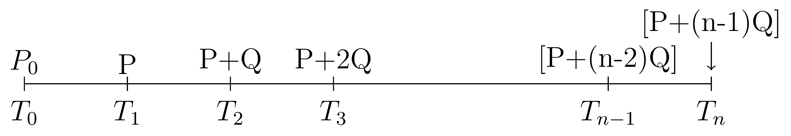

  * [time-angling-text-2+timeline+foreach+learn.tex](https://github.com/walmes/Tikz/blob/master/src/time-angling-text-2+timeline+foreach+learn.pgf)

```tex
% https://tex.stackexchange.com/a/390396/173708
\documentclass[12pt,a4paper]{standalone}
\usepackage[utf8]{inputenc}
\usepackage{graphicx,tikz}
\begin{document}
\begin{tikzpicture}[scale=1,rotLabel/.style={above,rotate=30,anchor=200}]
 % draw horizontal line 
  \draw (0,0) -- (10,0);
  % draw vertical lines
   \foreach \x in {0,1.5,3,4.5,8.5,10}
   \draw (\x cm,3pt) -- (\x cm,-3pt);
    % draw nodes
   \draw (0,0) node[below=3pt] {$T_0$ } node[above=0pt] {$P_0$};
   \draw (1.5,0) node[below=3pt] {$T_1$} node[above=0pt] {P};
   \draw (3,0) node[below=3pt] {$T_2$} node[above=0pt] {P+Q};
   \draw (4.5,0) node[below=3pt] {$T_3$} node[above=0pt] {P+2Q};
   \draw (8.5,0) node[below=3pt] {$T_{n-1}$} node[above=0pt] {[P+(n-2)Q]};
\draw (10,0) node[below=3pt] {$T_n$} node[above=15pt] {[P+(n-1)Q]};
\draw[<-] (10,0.2) -- ++(0,1em);
   \end{tikzpicture}
\end{document}
```
****


  * [time-angling-text-3+timeline+foreach+learn.tex](https://github.com/walmes/Tikz/blob/master/src/time-angling-text-3+timeline+foreach+learn.pgf)

```tex
% https://tex.stackexchange.com/a/390392/173708
\documentclass{standalone}
\usepackage{tikz}
\begin{document}
	
\begin{tikzpicture}
% draw horizontal line   
\draw (0,0) -- (10,0);

% draw vertical lines
\foreach \x in {0,1.5,3,4.5,8.5,10}
\draw (\x cm,3pt) -- (\x cm,-3pt);

% draw nodes
\draw (0,0) node[below=3pt] {$T_0$ } node[above=3pt] {};
\draw (1.5,0) node[below=3pt] {$T_1$} node[above=3pt] {P};
\draw (3,0) node[below=3pt] {$T_2$} node[above=3pt] {P+Q};
\draw (4.5,0) node[below=3pt] {$T_3$} node[above=3pt] {P+2Q};
\draw (8.5,0) node[below=3pt] {$T_{n-1}$} node[above=3pt, anchor= south east, rotate=-45] {[P+(n-2)Q]};
\draw (10,0) node[below=3pt] {$T_n$} node[above=3pt, anchor= south east, rotate=-45] {[P+(n-1)Q]};

\end{tikzpicture}

\vspace{30pt}As AboAmmar said, you could also rotate all the labels:

\begin{tikzpicture}[mylabel/.style={above=3pt, anchor= south east, rotate=-45}]
% draw horizontal line   
\draw (0,0) -- (10,0);

% draw vertical lines
\foreach \x in {0,1.5,3,4.5,8.5,10}
\draw (\x cm,3pt) -- (\x cm,-3pt);

% draw nodes
\draw (0,0) node[below=3pt] {$T_0$ } node[mylabel] {};
\draw (1.5,0) node[below=3pt] {$T_1$} node[mylabel] {P};
\draw (3,0) node[below=3pt] {$T_2$} node[mylabel] {P+Q};
\draw (4.5,0) node[below=3pt] {$T_3$} node[mylabel] {P+2Q};
\draw (8.5,0) node[below=3pt] {$T_{n-1}$} node[mylabel] {[P+(n-2)Q]};
\draw (10,0) node[below=3pt] {$T_n$} node[mylabel] {[P+(n-1)Q]};

\end{tikzpicture}
\end{document}
```
****


  * [time-annuity+timeline+foreach+learn.tex](https://github.com/walmes/Tikz/blob/master/src/time-annuity+timeline+foreach+learn.pgf)

```tex
% https://www.latex4technics.com/?note=5rc
% https://tex.stackexchange.com/a/241153/173708
\documentclass[tikz]{standalone}

\begin{document}
\begin{tikzpicture}
  \draw[line width=1pt] (0,0) -- node[below=1mm,pos=0.6,scale=2] {$\cdots$} (10,0)node[right=4mm]{(periods)};
  \foreach \x/\y in {0/0,1/1,2/2,3/3,9/$n-1$,10/$n$}{
    \draw[line width=1pt] (\x,-2mm)node[below](\x){\strut\y} -- (\x,2mm)node[above]{$\$ 1$};
    }
    \draw[-latex] (0,-7mm) -- +(0,-10mm)node[below]{$A_{ni}$};
    \draw[-latex] (10,-7mm) -- +(0,-10mm)node[below]{$S_{ni}$};
\end{tikzpicture}
\end{document}
```
****


  * [time-arrows_to_nodes-arr+timeline+tree+scope+learn.tex](https://github.com/walmes/Tikz/blob/master/src/time-arrows_to_nodes-arr+timeline+tree+scope+learn.pgf)

```tex
% https://wiki.physik.uzh.ch/cms/latex:tikz:arrows_to_nodes

% How to break text lines: https://tex.stackexchange.com/a/124114/173708

% Author: Izaak Neutelings (September 2018)
\documentclass[border=3pt,tikz]{standalone}
\usepackage{amsmath} % for \;
\usepackage{tikz}
\usepackage{xcolor}

\colorlet{myblue}{blue!70!black}
\colorlet{mylightblue}{blue!10}
\tikzset{>=latex} % for LaTeX arrow head

\begin{document}


\begin{tikzpicture}[yscale=0.8,anchor=west]
  
  % FIRST COLUMN
  \node[anchor=west,draw=myblue,fill=mylightblue,thick,rounded corners=4,inner sep=1.5pt] (L) at (0,4) {\;\strut$qq\nu\nu$\;};  
  \node (L1) at (0.5,3) {\strut$jj\nu\nu$};
  \node (L2) at (-1.5,2) [draw, text width=1cm] {common text};   % break a line in two
  \node (L3) at (0.5,1) {\strut tt$\nu\nu$};
  \draw[->,myblue,thick] (L.south west) ++ (0.18,0) |- (L1.west);
  \draw[->,myblue,thick] (L.south west) ++ (0.18,0) |- (L2.east);
  \draw[->,myblue,thick] (L.south west) ++ (0.18,0) |- (L3.west);
  
  % SECOND COLUMN
  \begin{scope}[shift={(2.5,0)}]
    \node[draw=myblue,fill=mylightblue,thick,rounded corners=4,inner sep=1.5pt] (M) at (0,4) {\;\strut$qq\ell\ell$\;};
    \node (M1) at (0.5,3) {\strut$jj\mu\mu$};
    \node (M2) at (0.5,2) {\strut bb$\tau\tau$, b$\tau\tau$};
    \node (M3) at (0.5,1) {\strut tt$\tau\tau$};
    \draw[->,myblue,thick] (M.south west)++(0.18,0) |- (M1.west);
    \draw[->,myblue,thick] (M.south west)++(0.18,0) |- (M2.west);
    \draw[->,myblue,thick] (M.south west)++(0.18,0) |- (M3.west);
  \end{scope}
  
  % THIRD COLUMN
  \begin{scope}[shift={(5.0,0)}]
    \node[draw=myblue,fill=mylightblue,thick,rounded corners=4,inner sep=1.5pt] (R) at (0,4) {\;\strut$qq\ell\nu$\;};
    \node (R1) at (0.5,3) {\strut$jj\mu\nu$};
    \draw[->,myblue,thick] (R.south west)++(0.18,0) |- (R1.west);
  \end{scope}

\end{tikzpicture}


\end{document}
```
****


  * [time-arrows-circles+timeline+pgf+set.tex](https://github.com/walmes/Tikz/blob/master/src/time-arrows-circles+timeline+pgf+set.pgf)

```tex
% https://tex.stackexchange.com/a/108776/173708

\documentclass{standalone}
\usepackage[margin=3cm]{geometry}
\usepackage{ragged2e}
\usepackage{fourier}
\usepackage{tikz} 
\usetikzlibrary{chains,shapes.arrows,fit}

\definecolor{arrowcolor}{RGB}{201,216,232}% color for the arrow filling
\definecolor{circlecolor}{RGB}{79,129,189}% color for the inner circles filling
\colorlet{textcolor}{white}% color for the text inside the circles
\colorlet{bordercolor}{white}% color for the outer border of circles

\pgfdeclarelayer{background}
\pgfsetlayers{background,main}

\newcounter{task}

\newlength\taskwidth% width of the box for the task description
\newlength\taskvsep% vertical distance between the task description and arrow

\setlength\taskwidth{2.5cm}
\setlength\taskvsep{17pt}

\def\taskpos{}
\def\taskanchor{}

\newcommand\task[1]{%
  {\parbox[t]{\taskwidth}{\scriptsize\Centering#1}}}

\tikzset{
inner/.style={
  on chain,
  circle,
  inner sep=4pt,
  fill=circlecolor,
  line width=1.5pt,
  draw=bordercolor,
  text width=1.2em,
  align=center,
  text height=1.25ex,
  text depth=0ex
},
on grid
}

\newcommand\Task[2][]{%
\node[inner xsep=0pt] (c1) {\phantom{A}};
\stepcounter{task}
\ifodd\thetask\relax
  \renewcommand\taskpos{\taskvsep}\renewcommand\taskanchor{south}
\else
  \renewcommand\taskpos{-\taskvsep}\renewcommand\taskanchor{north}
\fi
\node[inner,font=\footnotesize\sffamily\color{textcolor}]    
  (c\the\numexpr\value{task}+1\relax) {#1};
\node[anchor=\taskanchor,yshift=\taskpos] 
  at (c\the\numexpr\value{task}+1\relax) {\task{#2}};
}

\newcommand\drawarrow{% the arrow is placed in the background layer 
                                                     % after the node for the tasks have been placed
\ifnum\thetask=0\relax
  \node[on chain] (c1) {}; % if no \Task command is used, the arrow will be drawn
\fi
\node[on chain] (f) {};
\begin{pgfonlayer}{background}
\node[
  inner sep=10pt,
  single arrow,
  single arrow head extend=0.8cm,
  draw=none,
  fill=arrowcolor,
  fit= (c1) (f)
] (arrow) {};
\fill[white] % the decoration at the tail of the arrow
  (arrow.before tail) -- (c1|-arrow.west) -- (arrow.after tail) -- cycle;
\end{pgfonlayer}
}

\newenvironment{timeline}[1][node distance=.75\taskwidth]
  {\par\noindent\begin{tikzpicture}[start chain,#1]}
  {\drawarrow\end{tikzpicture}\par}

\begin{document}

\begin{timeline}
	\Task{Complete oral presentation\\ 27/04/2012}
	\Task{Work on user interface and some modulation \\ 28/04/2012}
	\Task{Work on and complete proposal to hand in \\ 29/04/2012}
	\Task{Hand in proposal and astart working on Software planning \\ 04/05/2012}
	\Task{Hand in Software planning and work on more content \\ 06/05/2012}
	\Task{Complete full user UI with action listeners \\ 12/05/2012}
	\Task{Complete beta testing and debug \\ May 13th to May 29th}
	\end{timeline}
	
	\vspace{1cm}
	
	\definecolor{arrowcolor}{RGB}{144,168,65}
	\colorlet{circlecolor}{white}
	\definecolor{bordercolor}{RGB}{168,89,65}
	\colorlet{textcolor}{bordercolor}
	\setlength\taskwidth{1.7cm}
	
	\begin{timeline}
	\Task[M]{Grilled cheese sandwiches on whole-wheat bread, one peach}
	\Task[Tu]{Penne pasta Caprese salad}
	\Task[W]{Zucchini muffins with cream cheese, grapes, and watermelon}
	\Task[Th]{Peanut butter and banana sandwiches, popcorn, one peach}
	\Task[F]{Cream cheese and cucumber sandwich, grapes, and blueberries}
	\Task[Sa]{Grilled fish with lemon, grilled corn, and whole-wheat biscuits}
	\Task[Su]{Yogurth with honey and blueberries}
\end{timeline}

\end{document}
```
****


  * [time-arrows-on-periods+timeline+foreach+style+learn.tex](https://github.com/walmes/Tikz/blob/master/src/time-arrows-on-periods+timeline+foreach+style+learn.pgf)

```tex
% https://tex.stackexchange.com/a/452487/173708
\documentclass[tikz,border=3.14mm]{standalone}
\usetikzlibrary{shapes.arrows,arrows.meta}

\begin{document}
	
\begin{tikzpicture}[font=\sffamily, 
	bullet/.style={fill=black, 
		circle, 
		text=white, 
		font=\sffamily\bfseries, 
		inner sep=1.2pt}]
	
	\draw[thick,-{Triangle[open]}] (-0.2,0) -- (8.5,0);
	\foreach \X in {1,2,3} {
		\draw ({(\X-1)*4},0.1) -- ({(\X-1)*4},-0.1);
		\draw[thick,dashed] ({(\X-1)*4},0) -- ++(0,2)
		node[above,bullet]{\X};}
	\node [double arrow, fill=gray!60,minimum height=3.6cm] at (2,1) {Fast Forwarding};
	\node [double arrow, fill=gray!60,minimum height=3.6cm] at (6,1) {Monitoring};
	\draw[orange,very thick,latex-latex] (0,-0.7) -- (8,-0.7) node[midway,bullet]{4};
	\node[anchor=north] at (0,0) {0};
	\node[anchor=north east] at (8,0) {Time};
\end{tikzpicture}
\end{document}
```
****

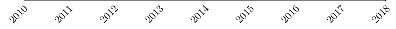

  * [time-auto_time_scale+timeline+foreach+pgf.tex](https://github.com/walmes/Tikz/blob/master/src/time-auto_time_scale+timeline+foreach+pgf.pgf)

```tex
% https://tex.stackexchange.com/a/459332/173708
\documentclass{standalone}
\usepackage{tikz}

\begin{document}
\pagenumbering{gobble}
\begin{tikzpicture}
	\pgfmathtruncatemacro\start{2010} %Start year
	\pgfmathtruncatemacro\ende{2018}  %End year
	\pgfmathtruncatemacro\differenz{\ende-\start}
	
	\draw[->](0,0) -- (\textwidth, 0);
	\foreach \j in {0,..., \differenz} {
	    \pgfmathsetlengthmacro\tmp{\j*\textwidth/\differenz}
	    \pgfmathtruncatemacro\jahr{\start+\j}
	    \draw (\tmp,0) node[rotate=45, left, yshift=-6pt] {\jahr};
	}
\end{tikzpicture}
\end{document}
```
****

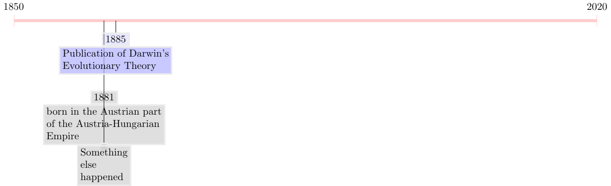

  * [time-biographical-cornerstones-arr+timeline+style+learn+text.tex](https://github.com/walmes/Tikz/blob/master/src/time-biographical-cornerstones-arr+timeline+style+learn+text.pgf)

```tex
% https://tex.stackexchange.com/a/297685/173708
% modified, commented
\documentclass{standalone}
\usepackage{tikz}
\usetikzlibrary{arrows.meta,positioning}

\begin{document}

% remove subsection
% remove /begin{center}

\begin{tikzpicture}[node distance = 0mm,
	TN/.style args = {#1/#2}{% as Transparency Node
	    fill=#1,
	    fill opacity=#2,
	    text opacity=1, 
	    align=flush left,
	    inner sep=1mm, 
	    outer sep=0.25mm, 
	    draw=gray!15,
	    line width=0.5mm,
	    below},	        
    TN/.default = gray!50/0.5,
	L/.style = {% as Line
	    draw=red!20, 
	    line width=1mm,
	    {Bar[width=4mm,line width=0.4pt]}-{Bar[width=4mm,line width=0.4pt]}
        }
    ]
    
	\draw[L]    ( 0,0)  coordinate (s)
	                    node[above=2mm] {1850} -- + 
	            (20,0)  node[above=2mm] {2020};
	            
	\draw (3.1,0) -- + (0,-2.4)
	        node (e1)   [TN]              {1881}
	        node (e1a)  [TN,below=of e1]  {born in the Austrian part\\
	                                       of the Austria-Hungarian\\
	                                       Empire};

	\draw (3.1,0) -- + (0,-4.2)
	        node (e1y)   [TN]              {}
	        node (e1t)  [TN,below=of e1a]  {Something\\
	                                       else\\
	                                       happened};
	                                       
	                                       
	\draw (3.5,0) -- + (0,-0.4) 
	        node (e2)   [TN=blue!30/0.3]  {1885}
	        node (e2a)  [TN=blue!30/0.7,
	                     below=of e2]    {Publication of Darwin's\\
	                                      Evolutionary Theory};
\end{tikzpicture}

\end{document}
```
****

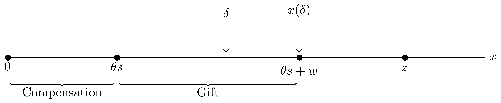

  * [time-brace-and-dots-arr+timeline+style+text.tex](https://github.com/walmes/Tikz/blob/master/src/time-brace-and-dots-arr+timeline+style+text.pgf)

```tex
\documentclass[]{standalone}
\usepackage{tikz}
\usetikzlibrary{arrows,positioning,decorations.pathreplacing}

\begin{document}

\begin{tikzpicture}[
	every node/.style = {align=center},
	Line/.style = {-angle 90, shorten <=-2pt},
	Brace/.style args = {#1}{semithick, 
							decorate, 
							decoration={brace, 
								#1, 
								raise=20pt, 
								pre=moveto, 
								pre length=2pt, 
								post=moveto, 
								post length=2pt,}},
	ys/.style = {yshift=#1}
	]
	\linespread{0.8}                    
	\coordinate (a) at (0,0);
	\coordinate[right=30mm of a]    (b);
	\coordinate[right=30mm of b]    (c);
	\coordinate[right= 20mm of c]   (d);
	\coordinate[right=24mm of d]    (e);
	\coordinate[right= 5mm of e]    (f);
	\coordinate[right=22mm of f]    (g);
	
	%  adding * specs to the Line \draw macros for the dot
	\draw[Line,*-]  (a) --  (g) node[right] {$x$}; % long line starting with dot
	\draw[Line, *-] (b) --  (c) ; % second dot
	\draw[Line, *-] (d) --  (e) ; % 3rd dot
	\draw[Line, *-] (f) --  (g) ; % 4th dot
	
	\draw[Brace=mirror] (a) -- node[below=20pt] {Compensation} (b);   % add 1st brace
	\draw[Brace=mirror] (b) -- node[below=20pt] {Gift} (d);           % add 2nd brace
	
	\draw ([ys=0mm] a) node[below] {0} -- (a);                                  % label with zero
	\draw ([ys=0mm] b) node[below] {$\theta s$} -- (b);                         % label with theta
	\draw[Line, shorten >=4pt] ([ys=10mm]  c) node[above] {$\delta$} -- (c);    % arrow delta above
	\draw[Line, shorten >=4pt] ([ys=10mm]  d) node[above] {$x(\delta)$} -- (d); % arrow with x of delta
	\draw ([ys=-1mm]  d) node[below] {$\theta s + w$} -- (d); % theta and omega; no arrow
	\draw ([ys=-1mm]  f) node[below] {$z$} -- (f);            % zeta; no arrow
	
\end{tikzpicture}

\end{document}
```
****

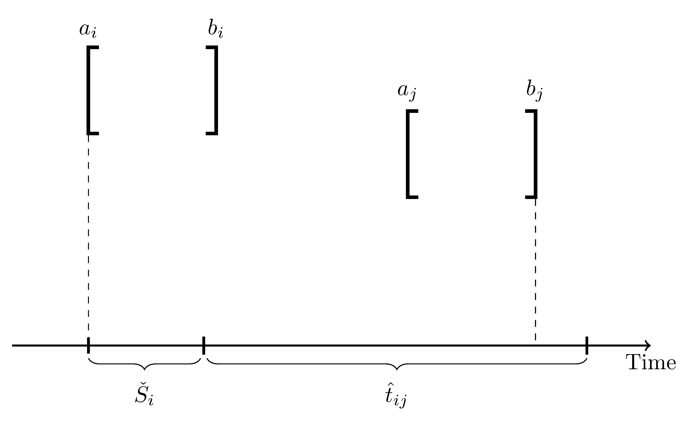

  * [time-bracketed-intervals+timeline+decoration.tex](https://github.com/walmes/Tikz/blob/master/src/time-bracketed-intervals+timeline+decoration.pgf)

```tex
% https://tex.stackexchange.com/a/211972/173708
\documentclass[tikz,border=5]{standalone}
\usetikzlibrary{decorations.pathreplacing}
\begin{document}
  \begin{tikzpicture}
    \draw[thick,->] (0,0) -- (10,0)node[below] {Time};    
    \node[scale=4,inner sep=0pt,outer sep=0pt,anchor=west,label=above:$a_i$] (ail) at (1,4) {[};
    \node[scale=4,inner sep=0pt,outer sep=0pt,anchor=west,label=above:$b_i$] (air) at (3,4) {]};
    \draw[dashed] (ail) -- +(0,-4)node[pos=1](a){};
    \draw[very thick] (a.north)--(a.south);
    \draw[very thick] (3,4pt) -- (3,-4pt);
    \draw[very thick] (9,4pt) -- (9,-4pt);
    \node[scale=4,inner sep=0pt,outer sep=0pt,anchor=west,label=above:$a_j$] (ajl) at (6,3) {[};
    \node[scale=4,inner sep=0pt,outer sep=0pt,anchor=west,label=above:$b_j$] (ajr) at (8,3) {]};
    \draw[dashed] (ajr) -- +(0,-3);
    \draw[decorate, decoration={brace, amplitude=5pt},] ([yshift=-0.2cm]2.95,0)-- node[below=0.25cm]
         {$\check{S}_i$}([yshift=-0.2cm]a.center);	
    \draw[decorate, decoration={brace, amplitude=5pt},] ([yshift=-0.2cm]9,0)-- node[below=0.25cm]
         {$\hat{t}_{ij}$}([yshift=-0.2cm]3.05,0);
  \end{tikzpicture}

\end{document}
```
****

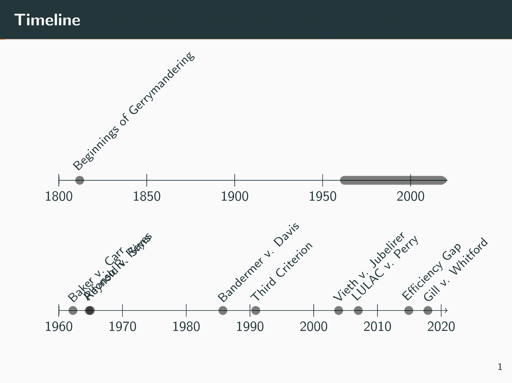

  * [time-chronology-break-arr+timeline+text+advanced.tex](https://github.com/walmes/Tikz/blob/master/src/time-chronology-break-arr+timeline+text+advanced.pgf)

```tex
% https://tex.stackexchange.com/a/439457/173708
\documentclass[10pt]{beamer}

\usetheme[progressbar=frametitle]{metropolis}
\usepackage{appendixnumberbeamer}
\usepackage{chronology}

\newlength{\myunit}
\makeatletter%
\newif\ifchronology@star%
\renewenvironment{chronology}{%
    \@ifstar{\chronology@startrue\chronology@i*}{\chronology@starfalse\chronology@i*}%
}{%
\end{tikzpicture}%
\end{lrbox}%
\usebox{\timelinebox}
}%
\def\chronology@i*{%
\@ifnextchar[{\chronology@ii*}{\chronology@ii*[{5}]}%
}%
\def\chronology@ii*[#1]#2#3#4#5{%
\newif\ifflipped%
\ifchronology@star%
\flippedtrue%
\else%
\flippedfalse%
\fi%
\setcounter{step}{#1}%
\setcounter{yearstart}{#2}\setcounter{yearstop}{#3}%
\setcounter{deltayears}{\theyearstop-\theyearstart}%
\setlength{\timelinewidth}{#4}%
\setlength{\myunit}{#5}%
\pgfmathsetcounter{stepstart}{\theyearstart-mod(\theyearstart,\thestep)}%
\pgfmathsetcounter{stepstop}{\theyearstop-mod(\theyearstop,\thestep)}%
\addtocounter{step}{\thestepstart}%
\begin{lrbox}{\timelinebox}%
\begin{tikzpicture}[baseline={(current bounding box.north)}]%,x=\timelinewidth,y=\p@]%
\draw [|->] (0,0) -- (\timelinewidth, 0);%
%\foreach \x in {1,...,\thedeltayears}%
%\draw[xshift=\x/\thedeltayears*\timelinewidth] (0,-.5\myunit) -- (0,.5\myunit);%
\addtocounter{deltayears}{1}%
\foreach \x in {\thestepstart,\thestep,...,\thestepstop}{%
    \pgfmathsetlength\xstop{(\x-\theyearstart)/\thedeltayears*\timelinewidth}%
    \draw[xshift=\xstop] (0,-\myunit) -- (0,\myunit);%
    \ifflipped%
    \node[chrontickslabel] at (\xstop,0) [above=\myunit] {\x};%
    \else%
    \node[chrontickslabel] at (\xstop,0) [below=\myunit] {\x};%
    \fi%
}%
}%
\makeatother%

\RenewDocumentCommand{\event}{o m m}{%
    \pgfmathsetlength\xstop{(#2-\theyearstart)/\thedeltayears*\timelinewidth}%
    \IfNoValueTF {#1} {%
        \ifflipped%
        \draw[chronevent]%
        (\xstop, 0) circle (.7\myunit);%
        \draw[chronevent]
        (\xstop,-.5\myunit+2pt) node[flippedeventlabel] {#3};%
        \else%
        \draw[chronevent]%
        (\xstop, 0) circle (.7\myunit);%
        \draw[chronevent]
        (\xstop,.5\myunit-2pt) node[eventlabel] {#3} ;%
        \fi%
    }{%
        \pgfmathsetlength\xstart{(#1-\theyearstart)/\thedeltayears*\timelinewidth}%
        \ifflipped%
        \draw[chronevent,rounded corners=.7\myunit]%
        (\xstart,-.7\myunit) rectangle%
        node[flippedeventlabel] {#3} (\xstop,.7\myunit) [below=\myunit];%
        \else%
        \draw[chronevent,rounded corners=.7\myunit]%
        (\xstart,-.7\myunit) rectangle%
        node[eventlabel] {#3} (\xstop,.7\myunit);%
        \fi%
    }%
}


\begin{document}
\begin{frame}{Timeline}
\vspace*{-5ex}
\begin{chronology}[50]{1800}{2020}{.9\linewidth}{1ex}
    \event{\decimaldate{}{}{1812}}{\small Beginnings of Gerrymandering}
    \event[\decimaldate{}{}{1960}]{\decimaldate{}{}{2020}}{}
\end{chronology}

\par
\begin{chronology}[10]{1960}{2020}{.9\linewidth}{1ex}
    \event{\decimaldate{26}{3}{1962}}{\small Baker v. Carr}
    \event{\decimaldate{15}{12}{1964}}{\small Reynold v. Sims}
    \event{\decimaldate{15}{10}{1964}}{\small Alfonso R. Reyes}
    \event{\decimaldate{2}{10}{1985}}{\small Bandermer v. Davis}
    \event{\decimaldate{}{}{1991}}{\small Third Criterion}
    \event{\decimaldate{}{}{2004}}{\small Vieth v. Jubelirer}
    \event{\decimaldate{31}{12}{2006}}{\small LULAC v. Perry}
    \event{\decimaldate{}{}{2015}}{\small Efficiency Gap}
    \event{\decimaldate{}{}{2018}}{\small Gill v. Whitford}
\end{chronology}
\end{frame}
\end{document}
```
****

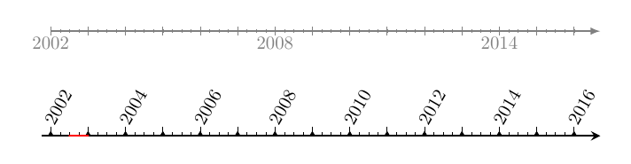

  * [time-colored_custom_draw+timeline+text+pgf.tex](https://github.com/walmes/Tikz/blob/master/src/time-colored_custom_draw+timeline+text+pgf.pgf)

```tex
% https://tex.stackexchange.com/a/349215/173708
\documentclass[margin=5mm]{standalone}
\usepackage{tikz}
\usetikzlibrary{arrows.meta}% Unecessary (only for the second example)

\tikzset{
  timeline/.style={-latex}%
  ,timeline style/.style={timeline/.append style={#1}}%
  ,year label/.style={below}%
  ,year label style/.style={year label/.append style={#1}}%
  ,year tick/.style={tick size=5pt}%
  ,year tick style/.style={year tick/.append style={#1}}%
  ,minor tick/.style={tick size=2pt, very thin}%
  ,minor tick style/.style={minor tick/.append style={#1}}%
  ,tick size/.code={\def\ticksize{#1}}%
  ,labeled years step/.code={\def\yearlabelstep{#1}}%
  ,minor tick step/.code={\def\minortickstep{#1}}%
  ,year tick step/.code={\def\yeartickstep{#1}}%
  ,enlarge timeline/.code={\def\enlarge{#1}}
}
\newcommand*{\drawtimeline}[4][]{%
  \def\fromyear{#2}%
  \def\toyear{#3}%
  \def\timelinesize{#4}%
  \pgfmathsetmacro{\timelinesizept}{\timelinesize}
  \begin{scope}[x=1pt, y=1pt, % Change main units to pt
                labeled years step=1,% Set some defaults
                minor tick step=0.25,%
                enlarge timeline=1.05,%
                year tick step=1,#1]
    \pgfmathsetmacro{\yearticksep}{\timelinesize/((\toyear-\fromyear)/\yeartickstep)}
    \pgfmathsetmacro{\minorticksep}{\timelinesize/((\toyear-\fromyear)/\minortickstep)}
    \pgfmathsetmacro{\minorticklast}{\minorticksep/\minortickstep)}
    \foreach \y[remember=\y as \lasty (initially 0), count=\i from \fromyear] in {0,\yearticksep,...,\timelinesizept}{
        \coordinate (Y-\i) at (\y,0);
        \draw[year tick] (\y,-\ticksize/2) --  ++(0,\ticksize);
        \ifnum\i=\toyear\breakforeach\else
        \foreach \q[count=\j from 0] in {0,\minorticksep,...,\minorticklast}{
            \coordinate (Y-\i-\j) at (\q+\y,0);
            \draw[minor tick] (\q+\y,-\ticksize/2) -- ++(0,\ticksize);
        };\fi
    };

    \pgfmathsetmacro{\nextyear}{int(\fromyear+\yearlabelstep)}
    \foreach \y in {\fromyear,\nextyear,...,\toyear} \node[year label] at (Y-\y) {\y};
    \draw[timeline] (0,0) -- +(\enlarge*\timelinesizept,0);% Timeline
  \end{scope}%
}

\begin{document}
    \begin{tikzpicture}[event/.style={very thick, solid, line cap=round}]
        \drawtimeline[%
            gray,
            timeline style={thick},
            labeled years step=6,
            minor tick step=0.25]{2002}{2016}{10cm};
        \drawtimeline[
            yshift=-2cm,
            labeled years step=2,
            timeline style={-stealth, shorten <=-5pt, very thick},
            year tick style={{Triangle[reversed, scale=0.75]}-, tick size=5pt, yshift=2.5pt},
            minor tick style={tick size=2pt, yshift=1pt},
            year label style={anchor=west, rotate=60, outer sep=2pt, yshift=4pt}]{2002}{2016}{10cm};
         \draw[event, red] (Y-2002-2) -- (Y-2003);
    \end{tikzpicture}
\end{document}
```
****

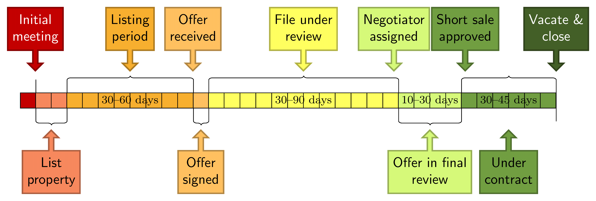

  * [time-colored-periods+timeline+set+command+environment+text.tex](https://github.com/walmes/Tikz/blob/master/src/time-colored-periods+timeline+set+command+environment+text.pgf)

```tex
% https://tex.stackexchange.com/a/232097/173708

\documentclass[tikz,border=5pt]{standalone}
\usetikzlibrary{calc,positioning,shapes.multipart,decorations.pathreplacing,shapes.arrows}

\definecolor{red1}{RGB}{195,0,0}
\definecolor{red2}{RGB}{246,136,93}
\definecolor{yellow1}{RGB}{247,175,47}
\definecolor{yellow2}{RGB}{255,192,96}
\definecolor{yellow3}{RGB}{255,255,96}
\definecolor{green1}{RGB}{214,249,121}
\definecolor{green2}{RGB}{113,158,65}

% vertical separation between timeline and text boxes
\def\TextShift{15pt}

\tikzset{
  myrect/.style={
    rectangle split, 
    rectangle split horizontal,
    rectangle split parts=#1,
    draw,
    anchor=west,
  },
  mytext/.style={
    arrow box,
    draw=#1!70!black,
    fill=#1,
    align=center,
    line width=1pt,
    font=\sffamily
  },
  mytextb/.style={
    mytext=#1,
    anchor=north,
    arrow box arrows={north:0.5cm}  
  },
  mytexta/.style={
    mytext=#1,
    anchor=south,
    arrow box arrows={south:0.5cm}  
  }
}

\newcommand\AddTextA[4][]{
  \node[mytexta=#2,#1] at #3 {#4};
}
\newcommand\AddTextB[4][]{
  \node[mytextb=#2,#1] at #3 {#4};
}
\newcommand\AddText[5][]{
  \if#5l\relax
    \node[mytextb=#2,yshift=-\TextShift,#1] 
      at (part#4.south west) {\strut#3\strut};
  \fi
  \if#5L\relax
    \node[mytexta=#2,yshift=\TextShift,#1] 
      at (part#4.north west) {\strut#3\strut};
  \fi
  \if#5m\relax
    \node[mytextb=#2,yshift=-\TextShift,#1] 
      at ( $ (part#4.south west)!0.5!(part#4.south east) $ ) {\strut#3\strut};
  \fi
  \if#5M\relax
    \node[mytexta=#2,yshift=\TextShift,#1] 
      at ( $ (part#4.north west)!0.5!(part#4.north east) $ ) {\strut#3\strut};
  \fi
  \if#5r\relax
    \node[mytextb=#2,yshift=-\TextShift,#1] 
      at (part#4.south east) {\strut#3\strut};
  \fi
  \if#5R\relax
    \node[mytexta=#2,yshift=\TextShift,#1] 
      at (part#4.north east) {\strut#3\strut};
  \fi
}

\newcommand\TimeLine[1]{%
\coordinate (part0);  
\foreach \Longitud/\Color/\Texto [count=\ti] in {#1}
{
  \node[
    myrect=\Longitud,
    fill=\Color,
    right=of part\the\numexpr\ti-1\relax
    ] 
      (part\ti)
      {};
  \draw 
    ([yshift=-15pt]part\ti.east) coordinate (upper\ti) -- 
    ([yshift=15pt]part\ti.east) coordinate (lower\ti);
  \node[font=\footnotesize]
    at (part\ti.center) {\Texto};  
  \gdef\lastpart{\ti}
}
\foreach \Nodo in {2,...,\lastpart}
{
  \ifodd\Nodo\relax
  \draw[decoration={brace,mirror},decorate] 
    (lower\Nodo) -- (lower\the\numexpr\Nodo-1\relax);
  \else
  \draw[decoration=brace,decorate] 
    (upper\Nodo) -- (upper\the\numexpr\Nodo-1\relax);
  \fi    
}
}

\newenvironment{timeline}[1][]
  {\begin{tikzpicture}[node distance=0pt and -\pgflinewidth,#1]}
  {\end{tikzpicture}}

\begin{document}

\begin{timeline}
	\TimeLine{%
	    1/red1/{},%
	    2/red2/{},%
	    8/yellow1/{30--60 days},%
	    1/yellow2/{},%
	    12/yellow3/{30--90 days},%
	    4/green1/{10--30 days},%
	    6/green2/{30--45 days}%
	  }
	\AddText[text=white]{red1}{Initial \\ meeting}{2}{L}
	\AddText{red2}{List \\ property}{2}{m}
	\AddText{yellow1}{Listing \\ period}{3}{M}
	\AddText{yellow2}{Offer \\ received}{4}{L}
	\AddText{yellow2}{Offer \\ signed}{4}{m}
	\AddText{yellow3}{File under \\ review}{5}{M}
	\AddText[xshift=-3pt]{green1}{Negotiator \\ assigned}{6}{L}
	\AddText{green1}{Offer in final \\ review}{6}{m}
	\AddText[xshift=3pt]{green2}{Short sale\\ approved}{7}{L}
	\AddText{green2}{Under \\ contract}{7}{m}
	\AddText[text=white]{green2!60!black}{Vacate \& \\ close}{7}{R}
\end{timeline}

\end{document}
```
****

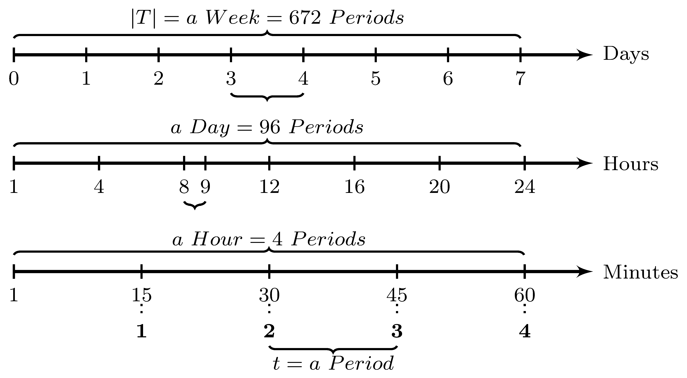

  * [time-days-hours-minutes+timeline+foreach+set+multi.tex](https://github.com/walmes/Tikz/blob/master/src/time-days-hours-minutes+timeline+foreach+set+multi.pgf)

```tex
% https://www.latex4technics.com/?note=m4u
% https://tex.stackexchange.com/q/210367/173708

 \documentclass[tikz]{standalone}
\begin{document}

\begin{tikzpicture}[y=1cm, x=1cm, thick, font=\footnotesize]    
\usetikzlibrary{arrows,decorations.pathreplacing}

\tikzset{
   brace_top/.style={
     decoration={brace},
     decorate
   },
   brace_bottom/.style={
     decoration={brace, mirror},
     decorate
   }
}

% time line week
\draw[line width=1.2pt, ->, >=latex'](0,0) -- coordinate (x axis) (8,0) node[right] {Days}; 
\foreach \x in {0,...,7} \draw (\x,0.1) -- (\x,-0.1) node[below] {\x};

% top brace
\node (start_week) at (0,0.1) {};
\node (end_week) at (7,0.1) {};
\draw [brace_top] (start_week.north) -- node [above, pos=0.5] {$|T| =a~Week = 672~Periods$} (end_week.north);

% low brace
\node (start_day_u) at (3,-0.4) {};
\node (end_day_u) at (4,-0.4) {};
\draw [brace_bottom] (start_day_u.south) -- node [below, pos=0.5] {} (end_day_u.south);

% time line day
\draw[line width=1.2pt, ->, >=latex'](0,-1.5) -- coordinate (x axis) (8,-1.5) node[right] {Hours}; 
\draw (0,-1.4) -- (0,-1.6) node[below] {1};
\foreach \x in {4,8,12,16,20,24} \draw (\x/3.4,-1.4) -- (\x/3.4,-1.6) node[below] {\x};
\draw (9/3.4,-1.4) -- (9/3.4,-1.6) node[below] {9};

% top brace
\node (start_day) at (0,-1.4) {};
\node (end_day) at (7,-1.4) {};
\draw [brace_top] (start_day.north) -- node [above, pos=0.5] {$ a~Day = 96~Periods$} (end_day.north);

% low brace
\node (start_hour_u) at (8/3.4,-1.9) {};
\node (end_hour_u) at (9/3.4,-1.9) {};
\draw [brace_bottom] (start_hour_u.south) -- node [below, pos=0.5] {} (end_hour_u.south);

% time line hour
\draw[line width=1.2pt, ->, >=latex'](0,-3.0) -- coordinate (x axis) (8,-3.0) node[right] {Minutes}; 
\draw (0,-2.9) -- (0,-3.1) node[below] {1};
\foreach \x in {15,30,45,60} \draw (\x/8.5,-2.9) -- (\x/8.5,-3.1) node[below] {\x};

% top brace
\node (start_hour) at (0,-2.9) {};
\node (end_hour) at (7.05,-2.9) {};
\draw [brace_top] (start_hour.north) -- node [above, pos=0.5] {$ a~Hour = 4~Periods$} (end_hour.north);

% time line period
\foreach \x in {1,...,4} \draw[dotted] (15*\x/8.5,-3.45) -- (15*\x/8.5,-3.6) node[below] {\textbf{\x}};

% low brace period
\node (start_period) at (30/8.5,-3.9) {};
\node (end_period) at (45/8.5,-3.9) {};
\draw [brace_bottom] (start_period.south) -- node [below, pos=0.5] {$t=a~Period$} (end_period.south);

\end{tikzpicture}
\end{document}
```
****

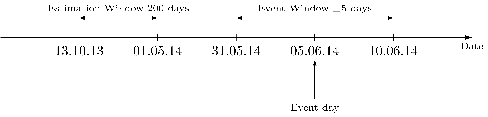

  * [time-estimated-window+timeline+decoration+text.tex](https://github.com/walmes/Tikz/blob/master/src/time-estimated-window+timeline+decoration+text.pgf)

```tex
% https://tex.stackexchange.com/a/483817/173708
\documentclass[tikz]{standalone}
\usetikzlibrary{decorations.pathreplacing,positioning, arrows.meta}
\begin{document}
\begin{tikzpicture}[x=2cm,>=latex]
	\draw[thick,->] (0,0) -- (6,0) node[below,font=\scriptsize] {Date};
	\draw (1,.1)--(1,-.1) node[below] {13.10.13};
	\draw (2,.1)--(2,-.1) node[below] {01.05.14};
	\draw (3,.1)--(3,-.1) node[below] {31.05.14};
	\draw (4,.1)--(4,-.1) node[below] (x) {05.06.14};
	\draw (5,.1)--(5,-.1) node[below] {10.06.14};
	
	\draw[<->] (1,.5)--(2,.5) node[midway,above,font=\scriptsize] {Estimation Window 200 days};
	\draw[<->] (3,.5)--(5,.5) node[midway,above,font=\scriptsize] {Event Window $\pm5$ days};
	\draw[<-] (x.south) --++ (0,-1) node[below,font=\scriptsize] {Event day};
\end{tikzpicture}
\end{document}
```
****


  * [time-events-and-periods+timeline+set+command+pgf+scope.tex](https://github.com/walmes/Tikz/blob/master/src/time-events-and-periods+timeline+set+command+pgf+scope.pgf)

```tex
% https://tex.stackexchange.com/a/442718/173708
\PassOptionsToPackage{table,dvipsnames,svgnames}{xcolor}
\documentclass[tikz,margin=1cm]{standalone}
\usetikzlibrary{arrows.meta,calc,positioning}

\colorlet{A}{gray}
\colorlet{B}{lightgray}
\pgfdeclarelayer{background}
\pgfdeclarelayer{timeline}
\pgfdeclarelayer{period}
\pgfdeclarelayer{foreground}
\pgfsetlayers{background,timeline,period,main,foreground}

%https://tex.stackexchange.com/a/349215
\tikzset{
  timeline/.style={arrows={}}%
  ,timeline style/.style={timeline/.append style={#1}}%
  ,year label/.style={font=\Huge\sffamily\bfseries,below}%
  ,year label style/.style={year label/.append style={#1}}%
  ,year tick/.style={tick size=5pt}%
  ,year tick style/.style={year tick/.append style={#1}}%
  ,minor tick/.style={tick size=2pt, very thin}%
  ,minor tick style/.style={minor tick/.append style={#1}}%
  ,period/.style={solid,line width=\timelinewidth,line cap=square}%
  ,periodbox/.style={font=\Huge\sffamily\bfseries,text=black}%
  ,eventline/.style={draw,red,thick,line cap=round,line join=round}%
  ,eventbox/.style={rectangle,rounded corners=3pt,inner sep=3pt,fill=red!25!white,text width=3cm,anchor=west,text=black,align=left,font=\large}%
  ,tick size/.code={\def\ticksize{#1}}%
  ,labeled years step/.code={\def\yearlabelstep{#1}}%
  ,minor tick step/.code={\def\minortickstep{#1}}%
  ,year tick step/.code={\def\yeartickstep{#1}}%
  ,enlarge timeline/.code={\def\enlarge{#1}}%
  ,eventboxa/.style={eventbox,text width=#1,draw=A,fill=none}%
  ,eventboxb/.style={eventbox,text width=#1,draw=A,fill=none}%
}

% Still from %https://tex.stackexchange.com/a/349215
\newcommand*{\drawtimeline}[5][]{%
  \def\fromyear{#2}%
  \def\toyear{#3}%
  \def\timelinesize{#4}%
  \def\timelinewidth{#5}%
  \pgfmathsetmacro{\timelinesizept}{\timelinesize}%
  \pgfmathsetmacro{\timelinewidthpt}{\timelinewidth}%
  \pgfmathsetmacro{\timelineoffset}{\timelinewidth/2}
  \pgfmathsetmacro{\timelineoffsetpt}{\timelineoffset}
%
  \begin{scope}[x=1pt, y=1pt, % Change main units to pt
                labeled years step=1,% Set some defaults
                minor tick step=0.25,%
                enlarge timeline=0cm,%
                year tick step=1,#1]
    \pgfmathsetmacro{\enlargept}{\enlarge}
    \pgfmathsetmacro{\yearticksep}{\timelinesize/((\toyear-\fromyear)/\yeartickstep)}
    \pgfmathsetmacro{\minorticksep}{\timelinesize/((\toyear-\fromyear)/\minortickstep)}
    \pgfmathsetmacro{\minorticklast}{\minorticksep/\minortickstep}
    \foreach \y[remember=\y as \lasty (initially 0), count=\i from \fromyear] in {0,\yearticksep,...,\timelinesizept}{
        \coordinate (Y-\i) at (\y,0);
        \draw[year tick] (\y,-\ticksize/2) --  ++(0,\ticksize);
        \ifnum\i=\toyear\breakforeach\else
        \foreach \q[count=\j from 0] in {0,\minorticksep,...,\minorticklast}{
            \coordinate (Y-\i-\j) at (\q+\y,0);
                \begin{pgfonlayer}{timeline}
            \draw[minor tick] (\q+\y,-\ticksize/2) -- ++(0,\ticksize);
                \end{pgfonlayer}
        };\fi};%
    \pgfmathsetmacro{\nextyear}{int(\fromyear+\yearlabelstep)}
    \begin{pgfonlayer}{timeline}
    \draw[timeline] (0,0) -- ++(-\enlargept,0) (0,0) -- ++(\timelinesizept,0) coordinate (end) -- ++(\enlargept,0);% Timeline
    \end{pgfonlayer}
%    \foreach \y in {\fromyear,\nextyear,...,\toyear} \node[year label] at (Y-\y) {\y};
  \end{scope}%
}
% Put a period identifier midway between the start and end of the period
% 1 = color of timeline segment
% 2 = period start
% 3 = period end
% 4 = period text
\newcommand{\period}[5]{\begin{pgfonlayer}{period} \draw[period,#1] (Y-#2) -- (Y-#3) node[periodbox,#5,midway,text=white] {\begin{tabular}{l} #4 \end{tabular}}; \end{pgfonlayer}}

%This somewhat follows @cfr's Chronos. It was certainly inspired by Chronos.
%https://tex.stackexchange.com/a/349236

% 1 = format of line and box
% 2 = starting coordinate
% 3 = pin associated with starting coordinate (well suited to using polar coordinate)
% 4 = branch at top of pin (well suited to using polar coordinate)
% 5 = Any extra formatting of node
% 6 = Name of node
% 7 = Node content

\newcommand{\vevent}[7]{\begin{pgfonlayer}{timeline} \draw[eventline,#1](Y-#2) -- ++(#3) -- ++(#4) node[#5] (#6) {#7}; \end{pgfonlayer}}

\begin{document}
    \begin{tikzpicture}
        \drawtimeline[
            labeled years step=1,
            minor tick step=0.083333,
            timeline style={draw=gray,line width=\timelinewidthpt},
            minor tick style={-,lightgray,tick size=3pt,line width=3pt,yshift=-\timelineoffsetpt},           
            ]%
            {2017}{2019}{50cm}{2cm};
%
    \period{A}{2017-0}{2017-2}{2017\\J-F}{}
    \period{B}{2017-2}{2017-4}{M-A}{}
    \period{A}{2017-4}{2017-6}{M-J}{}
    \period{B}{2017-6}{2017-8}{J-A}{}
    \period{A}{2017-8}{2017-10}{S-O}{}
    \period{B}{2017-10}{2017-12}{N-D}{}
    \period{A}{2018-0}{2018-2}{2018\\J-F}{}
    \period{B}{2018-2}{2018-4}{M-A}{}
    \period{A}{2018-4}{2018-6}{M-J}{}
    \period{B}{2018-6}{2018-8}{J-A}{}
%
    \vevent{A}{2017-0}{90:2.5cm}{45:0.5cm}{eventboxa=5cm,anchor=west}{H}{Start of ZoW consortium\\10 Jan}
    \vevent{A}{2017-6}{-90:2.5cm}{-45:0.5cm}{eventboxa=4cm,anchor=west}{H}{1st Symposium\\8 Jun}    
    \vevent{A}{2017-7}{90:2.5cm}{45:0.5cm}{eventboxa=4cm,anchor=west}{H}{1st Symposium\\8 Jun} 
    \vevent{A}{2017-12}{-90:2.5cm}{-45:0.5cm}{eventboxa=4cm,anchor=west}{H}{2nd Symposium\\8 Jun} 
    \vevent{A}{2018-0}{90:2.5cm}{45:0.5cm}{eventboxa=4cm,anchor=west}{H}{Storm\\Jan} 
    \vevent{A}{2018-0}{90:4.5cm}{45:0.5cm}{eventboxa=4cm,anchor=west}{H}{Storm\\18 Jan} 
    \vevent{A}{2018-6}{-90:2.5cm}{-45:0.5cm}{eventboxa=4cm,anchor=west}{H}{3rd Symposium\\14 Jun}
%
    \node[draw=none,rectangle,fill=cyan,text width=10cm,minimum height=1cm,text=black,align=center,font=\Large] (AA) at  ([yshift=-5cm]Y-2018-5) {Internship};       
    \node[below=0.5cm of AA,font=\large] {12 Feb - 10 Aug};            
    \end{tikzpicture}
\end{document}
```
****

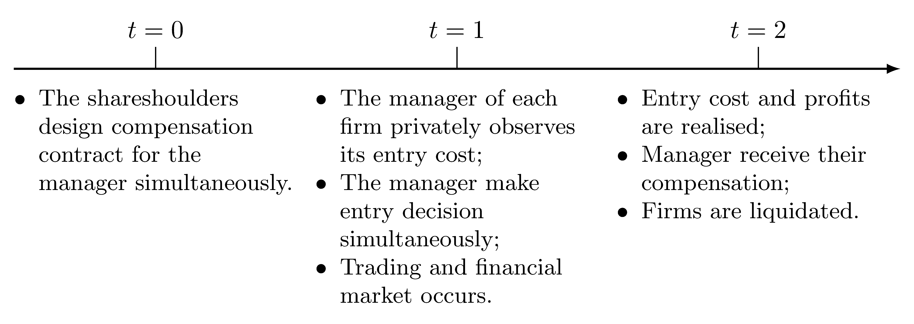

  * [time-long-labels-enumitem+timeline+text+style+foreach.tex](https://github.com/walmes/Tikz/blob/master/src/time-long-labels-enumitem+timeline+text+style+foreach.pgf)

```tex

\documentclass[landscape]{article}
\usepackage{tikz}

%%%<
\usepackage{verbatim}
\usepackage[active,tightpage]{preview}
\PreviewEnvironment{tikzpicture}
\setlength\PreviewBorder{5pt}%
%%%>
\usepackage{tikz}
\usetikzlibrary{positioning}
\usepackage{enumitem}

\begin{document}
    \begin{figure}
    \setlist[itemize]{nosep, leftmargin=*}
    
\begin{tikzpicture}[
 node distance = 0mm and 0.02\linewidth,
    box/.style = {inner xsep=0pt, outer sep=0pt,
                  text width=0.32\linewidth,
                  align=left, font=\small}
                    ]
\node (n1) [box]
        {   \begin{itemize}
        \item   The shareshoulders design compensation contract for the manager simultaneously.
            \end{itemize}
        };
\node (n2) [box, below right=of n1.north east]
        {   \begin{itemize}
        \item   The manager of each firm privately observes its entry cost;
        \item   The manager make entry decision simultaneously;
        \item   Trading and financial market occurs.
            \end{itemize}
        };
\node (n3) [box, below right=of n2.north east]
        {   \begin{itemize}
        \item   Entry cost and profits are realised;
        \item   Manager receive their compensation;
        \item   Firms are liquidated.
         \end{itemize}
         };
\draw[thick, -latex]    (n1.north west) -- (n3.north east);
\foreach \x [count=\xx from 1] in {0,1,2}
    \draw (n\xx.north) -- + (0,3mm) node[above] {$t=\x$};
\end{tikzpicture}
    \end{figure}
\end{document}
```
****


  * [time-long-labels+timeline+text+learn.tex](https://github.com/walmes/Tikz/blob/master/src/time-long-labels+timeline+text+learn.pgf)

```tex
% https://tex.stackexchange.com/a/447784/173708

\documentclass[tikz, border=5pt]{standalone}

\usepackage{tikz}
\usepackage{lipsum}

\begin{document}
\begin{tikzpicture}
	\usetikzlibrary{calc}
	
	% draw arrow
	\coordinate (start) at (-4,0);
	\coordinate (end) at (26,0);
	\draw [line width=2pt, -stealth] (start) -- (end);
	
	% You can use `foreach` to improve the following codes
	\coordinate (s0) at (1,0);
	\coordinate (t0) at ($(s0)+(0,0.3)$);
	\coordinate (s1) at (11,0);
	\coordinate (t1) at ($(s1)+(0,0.3)$);
	\coordinate (s2) at (21,0);
	\coordinate (t2) at ($(s2)+(0,0.3)$);
	
	% draw ticks
	\draw [line width=2pt] (s0) -- (t0);
	\node [anchor=south] at (t0.north) {$t=0$};
	
	\draw [line width=2pt] (t1) -- (s1);
	\node [anchor=south] at (t1.north) {$t=1$};
	
	\draw [line width=2pt] (t2) -- (s2);
	\node [anchor=south] at (t2.north) {$t=2$};
	
	% add texts
	\node [anchor=north, align=left, text width=9cm] at (s0.south) {
	\begin{itemize}
	\item \lipsum[1]
	\item \lipsum[2]
	\end{itemize}
	};
	
	\node [anchor=north, align=left, text width=9cm] at (s1.south) {
	\begin{itemize}
	\item \lipsum[3]
	\item \lipsum[4]
	\end{itemize}
	};
	
	\node [anchor=north, align=left, text width=9cm] at (s2.south) {
	\begin{itemize}
	\item \lipsum[5]
	\item \lipsum[6]
	\end{itemize}
	};

\end{tikzpicture}
\end{document}
```
****


  * [time-long-text+timeline+text+foreach.tex](https://github.com/walmes/Tikz/blob/master/src/time-long-text+timeline+text+foreach.pgf)

```tex
% https://tex.stackexchange.com/a/539169/173708
\documentclass[landscape]{article}
\usepackage{tikz}

%%%<
\usepackage{verbatim}
\usepackage[active,tightpage]{preview}
\PreviewEnvironment{tikzpicture}
\setlength\PreviewBorder{5pt}%
%%%>
\usepackage{tikz}
\usetikzlibrary{positioning}
\begin{document}
\begin{figure}
\begin{tikzpicture}[x=2.5cm,nodes={text width=2.2cm,align=left}]
	\draw[black,->,thick,>=latex,line cap=rect]
	  (0,0) -- (5,0);
	\foreach \Text [count=\Xc starting from 0] in 
		{{Due\~no dise\~na y ofrece un esquema de incentivos $w(a)$.},%
		 {Gerente acepta o rechaza.},%
		 {Gerente elige una (verificable) $a\in\lbrace m,s\rbrace$.},%
		 {Naturaleza juega.},%
		 {Flujos de caja $x$ y los beneficios $b$ son realizados. Compensaci\'on
		  $w(a)$ es pagada.}}  
		{\fill (\Xc,0) circle[radius=1.5pt];
		\node[below=0.2ex] at (\Xc,0) {\Text};}  
\end{tikzpicture}
\end{figure}
\end{document}
```
****


  * [time-multiple-lines+timeline+set+pgf+foreach+command+scope+text.tex](https://github.com/walmes/Tikz/blob/master/src/time-multiple-lines+timeline+set+pgf+foreach+command+scope+text.pgf)

```tex
% https://tex.stackexchange.com/a/448018/173708
\documentclass[12pt]{article}
\usepackage[a4paper, margin=1cm]{geometry}
\usepackage{tikz}
\pagestyle{empty}

\newcommand{\anno}{1} % starting year
\newcommand{\target}{31} % ending year
\newcommand{\alto}{3} % height

\tikzset{
    start date/.code args = {#1/#2}{
        \def\dstart{#1}
        \def\mstart{#2}
    },
    end date/.code args = {#1/#2}{
        \def\dend{#1}
        \def\mend{#2}
    },
    event color/.style = {
        fill=#1!50, draw=#1,
    },
}

\pgfmathsetmacro{\myend}{\target+1-\anno}
\pgfmathsetmacro{\myspacing}{16/(\target-1-\anno)}


\newcommand{\eventpoint}[2][]{
    \begin{scope}[#1]
    \pgfmathsetmacro{\mmstart}{((13-\mstart)*4)}
    \pgfmathsetmacro{\mmend}{((13-\mend)*4)}
    \ifnum\mstart=\mend
       \filldraw (\dstart, \mmstart ) rectangle (\dend, \mmend+1) node [font=\scriptsize, text centered, midway, inner sep=0pt] {#2};
    \else
       \filldraw (\dstart, \mmstart ) rectangle (31, \mmstart+1) node [font=\scriptsize, text centered, midway, inner sep=0pt] {#2};
      \filldraw (0, \mmend ) rectangle (\dend, \mmend+1) node [font=\scriptsize, text centered, midway, inner sep=0pt] {#2};
    \fi
    \end{scope}
}

\begin{document}
\centering
\begin{tikzpicture}[x=\myspacing cm,y=5mm]

	%creating the sublines needed and formating them
	\foreach \y in {0,4,8,12,16,20,24,28,32,36,40,44,48}{
	\draw[|->, -latex] (-.5,\y) -- (\myend+.5,\y);
	\path (0,0) -- (0,\alto);
	\foreach \x [evaluate=\x as \day using int(\x)] in {0,10,20,30}{
	    \draw (\x,\y) node[below=7pt,font=\footnotesize] {$\day$};
	    \draw (\x,\y -.2) -- (\x,\y +.2);
	    \draw[loosely dotted] (\x,\y +.2) -- (\x,\y+ \alto-0.5);
	}
	\foreach \tick in {0,...,\myend}{
	    \draw (\tick,\y +.1) -- (\tick,\y -.1);
	}
	}
	
	%trying to add the events
	\eventpoint[start date=15/7,end date=25/7,event color=green]{test}
	\eventpoint[start date=17/8,end date=19/9,event color=red,yshift=5pt]{test 2} % shift just to show you can hook into standard tikz keys to change the event's features ad-hoc

\end{tikzpicture}
\end{document}
```
****

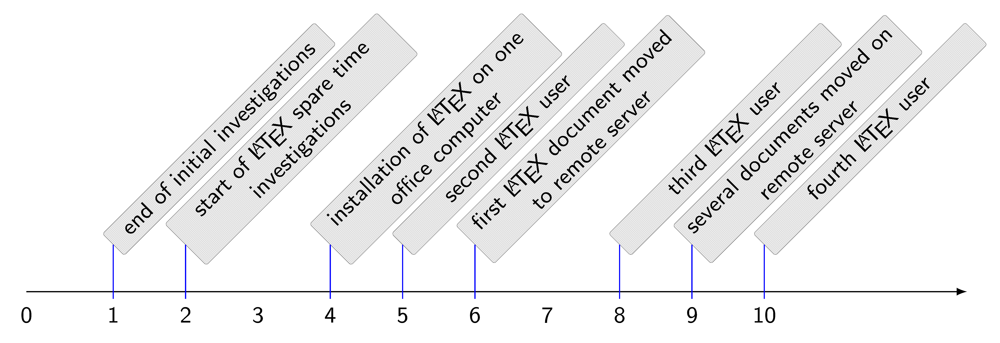

  * [time-rotated-labels+timeline+foreach+text+set+learn.tex](https://github.com/walmes/Tikz/blob/master/src/time-rotated-labels+timeline+foreach+text+set+learn.pgf)

```tex
% https://tex.stackexchange.com/a/57300/173708

\documentclass[landscape]{article}
\usepackage{tikz}

%%%<
\usepackage{verbatim}
\usepackage[active,tightpage]{preview}
\PreviewEnvironment{tikzpicture}
\setlength\PreviewBorder{5pt}%
%%%>
\usepackage{tikz}
\usetikzlibrary{calc,patterns,decorations.pathmorphing,decorations.markings,}
\begin{document}
\begin{figure}[h]
\begin{tikzpicture}[scale=1]
	\small \sf 
	\tikzset{label/.style={draw=gray, ultra thin, rounded corners=.25ex, fill=gray!20,text width=4cm, text badly centered,  inner sep=.5ex, above = 2em, anchor=west,rotate=45}}
	\tikzset{tick/.style={below=3pt}}
	\tikzset{thinline/.style={ultra thin}}
	
	\draw (0,0) -- (10,0);
	%draw arrow 
	\draw (0,0)[->, -latex] -- (13,0);
	%draw 
	\draw (0,0)[->, -latex] -- (13,0);
	%draw vertical lines
	%\foreach \x in {1.2,2.2,4.2,5.2,6.2,8.2,9.2,10.2} 
	%               \draw (\x cm,2ex) node (\x) {*};
	%draw nodes
	\draw (0,0)   node (A0) [tick] {0} node (B0)[] {};
	\draw (1.2,0) node(A1) [tick] {1} node (B1) [label]  {end of initial investigations};
	\draw (2.2,0) node (A2) [tick] {2} node (B2) [label]  {start of \LaTeX{} spare time investigations};
	\draw (3.2,0) node[tick] (A3) {3} node (B3) [] {};
	\draw (4.2,0) node[tick] (A4) {4} node (B4) [label]  {installation of \LaTeX{} on one office computer};
	\draw (5.2,0) node[tick] (A5) {5} node (B5) [label] {second \LaTeX{} user};
	\draw (6.2,0) node[tick] (A6) {6} node (B6) [label] {first \LaTeX{} document moved to remote server};
	\draw (7.2,0) node[tick] (A7) {7} node (B7) []  {};
	\draw (8.2,0) node[tick] (A8) {8} node (B8) [label]  {third \LaTeX{} user};
	\draw (9.2,0) node[tick] (A9) {9} node (B9) [label]  {several documents moved on remote server};
	\draw (10.2,0) node[tick] (A10) {10} node (B10)[label] {fourth \LaTeX{} user};
	
	\foreach \nn in {1,2,4,5,6,8,9,10}
	{   \draw[blue] (B\nn.west) -- ++(0,-0.75);
	}

\end{tikzpicture}
\caption{chronology of events (time in months)}
\end{figure}
\end{document}
```
****


  * [time-rounded-box-arr+timeline+pgf+style+foreach+learn.tex](https://github.com/walmes/Tikz/blob/master/src/time-rounded-box-arr+timeline+pgf+style+foreach+learn.pgf)

```tex
% https://tex.stackexchange.com/a/493707/173708
\documentclass{standalone}
\usepackage[margin=1in]{geometry}
\usepackage{tikz}
\usetikzlibrary{positioning,arrows.meta}

\tikzdeclarecoordinatesystem{timeline}{% #1 is the date in years
    \pgfmathsetmacro\myx{(#1-1975)/3}
    \pgfpointxy{\myx}{0}
}
\begin{document}

\begin{tikzpicture}[line cap=rect, 
    event/.style={fill, 
        font=\tiny,
        text=white,
        inner sep=0.4ex,
        text height=1ex, 
        text depth=0.4ex, 
        rounded corners}, 
    bullet/.style={circle, 
        fill, 
        minimum size=4pt,   % added, new
        node contents={}, 
        inner sep=1pt}]
    
	\draw (timeline cs:1975) -- (timeline cs:2020);
	\foreach \X in {1975,1980,...,2020} {
	    \draw (timeline cs:\X) -- ++(0,0.2) node[above,font=\tiny]{\X};}
	    
	\draw[blue!80] (timeline cs:1977) node[bullet] -- node{1977} ++ (0,-0.8) node[below,event]{A New Hope};
	\draw[orange] (timeline cs:1980.4) node[bullet] -- node{1980} ++ (0,-1.6) node[below,event]{The Empire Strikes Back};
	\draw[green!80!black] (timeline cs:1984) node[bullet] -- ++ (0,-0.8) node[below,event]{Return of the Jedi};
	\draw[purple!80] (timeline cs:2002.5) node[bullet] -- node{2002} ++ (0,-0.8) node[below,event] (Clone) {Attack of the Clones};
	\node[red,left=0.3em of Clone,event] (Phantom) {The Phantom Menace};    % set name and print movie
	\draw[red] (timeline cs:1999) node[bullet]  to[out=-90,in=90] (Phantom); % draw the line from bullet to label
	\node[brown!80!black,right=0.3em of Clone,event] (Sith) {Revenge of the Sith};    % set name and print movie
	\draw[brown!80!black] (timeline cs:2005.5) node[bullet] to[out=-90,in=90] (Sith); % draw line
	\draw[pink!90!black] (timeline cs:2016) node[bullet] -- node{2016} ++ (0.2,0.8) node[above,event] {The Force Awakens};
\end{tikzpicture}
\end{document}
```
****


  * [time-simple_project+timeline+text+foreach+learn.tex](https://github.com/walmes/Tikz/blob/master/src/time-simple_project+timeline+text+foreach+learn.pgf)

```tex
% https://github.com/FriendlyUser/LatexDiagrams
\documentclass[6pt]{standalone}
\usepackage{tikz}
\usetikzlibrary{snakes}
\usepackage{fullpage}

\begin{document}


%
%\begin{figure}
%\caption{Time Line}
%\centering
%\resizebox{\linewidth}{!}{% Resize table to fit within

\begin{tikzpicture}[]
%draw horizontal line
\draw (0,0) -- (41/1.7,0);
%draw vertical lines
\foreach \x in {0, 8, 15, 22, 29, 36, 41}{
   \draw (\x/1.7,3pt) -- (\x/1.7,-3pt);
}
%draw nodes
\draw (0,0) node[text width = 85pt,align=center,below=3pt] {\textbf{Submit Project Proposal}} node[above=3pt] {Nov 17 2017};
\draw (8/1.7,0) node[below=3pt] {Find Game Engine} node[above=3pt] {Nov 20 2017};
\draw (15/1.7,0) node[text width = 100pt,align=center,below=3pt] {Create Server-Client Architecture} node[above=3pt] {Nov 25 2017};
\draw (22/1.7,0) node[text width = 100pt,align=center,below=3pt] {Implement Game Logic} node[above=3pt] {Nov 29 2017};
\draw (29/1.7,0) node[text width = 100pt,align=center,below=3pt] {Add Music and Effects} node[above=3pt] {Dec 1 2017};
\draw (36/1.7,0) node[text width = 100pt,align=center,below=3pt] {\textbf{In Class Demo}} node[above=3pt] {Dec 2 2017};
\draw (41/1.7,0) node[below=3pt] {\textbf{Finish Report}} node[above=3pt] {Dec 12 2017};
\end{tikzpicture}
%}
%\label{fig:time_line}
%\end{figure}
\end{document}
```
****


  * [time-simple+timeline+foreach+snake+decoration+learn.tex](https://github.com/walmes/Tikz/blob/master/src/time-simple+timeline+foreach+snake+decoration+learn.pgf)

```tex
% https://stackoverflow.com/a/4170985/5270873

\documentclass{standalone}
\usepackage{tikz}
\usetikzlibrary{decorations.pathmorphing}


\begin{document}

\begin{tikzpicture}
	%draw horizontal line
	\draw (0,0) -- (2,0);
	\draw[decorate,decoration={snake,pre length=5mm, post length=5mm}] (2,0) -- (4,0);
	\draw (4,0) -- (5,0);
	\draw[decorate,decoration={snake,pre length=5mm, post length=5mm}] (5,0) -- (7,0);
	
	%draw vertical lines
	\foreach \x in {0,1,2,4,5,7}
	\draw (\x cm,3pt) -- (\x cm,-3pt);
	
	%draw nodes
	\draw (0,0) node[below=3pt] {$ 0 $} node[above=3pt] {$   $};
	\draw (1,0) node[below=3pt] {$ 1 $} node[above=3pt] {$ 10 $};
	\draw (2,0) node[below=3pt] {$ 2 $} node[above=3pt] {$ 20 $};
	\draw (3,0) node[below=3pt] {$  $} node[above=3pt] {$  $};
	\draw (4,0) node[below=3pt] {$ 5 $} node[above=3pt] {$ 50 $};
	\draw (5,0) node[below=3pt] {$ 6 $} node[above=3pt] {$ 60 $};
	\draw (6,0) node[below=3pt] {$  $} node[above=3pt] {$  $};
	\draw (7,0) node[below=3pt] {$ n $} node[above=3pt] {$ 10n $};
\end{tikzpicture}

\end{document}
```
****


  * [time-snake_frames_and_arrows+timeline+figure+foreach.tex](https://github.com/walmes/Tikz/blob/master/src/time-snake_frames_and_arrows+timeline+figure+foreach.pgf)

```tex
\PassOptionsToPackage{demo}{graphicx}
\documentclass[tikz, border=10mm]{standalone}
\usepackage[francais]{babel}
\usepackage[utf8]{inputenc}
\usepackage[T1]{fontenc}
\usetikzlibrary{positioning,calc,arrows.meta}
\begin{document}
  \begin{tikzpicture}
    [
      my text/.style={rounded corners=2pt, text width=50mm, font=\sffamily, draw=blue!20!black!50, line width=.5pt, align=left},
      my arrow/.style={rounded corners=2pt, draw=blue!20!cyan, line width=2.5mm, -{Triangle[]}},
    ]

    \node (b1) [my text] {1938: naissance de la société SNCASE (Société nationale de construction aéronautique du sud-est).};
    \node (b2) [right=5mm of b1, my text] {1943: le premier appareil à voilure tournante voit le jour à Marignane.\\1956: la SNCASE se transforme en SUD-EST-AVIATION.};
    \node (b3) [right=5mm of b2, my text] {1957: SUD-EST-AVIATION se transforme en SUD-AVIATION};

    \node (a2) [above=5mm of b2] {\includegraphics[width=30mm]{stato}};
    \node (a1) [left=25mm of a2] {\includegraphics[width=30mm]{hydravion}};
    \node (a3) [right=25mm of a2] {\includegraphics[width=30mm]{sudaviation}};

    \node (c1) [below=25mm of b1] {\includegraphics[width=30mm]{snias}};
    \node (c2) [right=25mm of c1] {\includegraphics[width=30mm]{aerospatiale}};
    \node (c3) [right=25mm of c2] {\includegraphics[width=30mm]{eurocopter}};

    \node (d3) [below=5mm of c3, my text] {1992: La division ``hélicoptère'' de l'entreprise Aerospatiale s'unit avec l'hélicoptériste allemand, MBB, pour donner naissance à Eurocopter.\\1998: Eurocopter devient Eurocopter EADS company en fusionnant avec le groupe espagnol CASA.};
    \node (d2) [left=5mm of d3, my text] {1984: la SNIAS devient AEROSPATIALE. Son activité est concentrée dans les domaines de l'aéronautique, de l'espace, ainsi que de l'étude et la production d'avions et d'hélicoptères};
    \node (d1) [left=5mm of d2, my text] {1970: SUD-AVIATION, NORD-AVIATION, SEREB fusionnent et donnent naissance à la SNIAS (Société Nationale industrielle aérospatiale).};

    \node (e) [below=25mm of d2] {\includegraphics[width=120mm]{airbushelicopters}};

    \node (f) [below=5mm of e, my text] {2014: le groupe tourne une page de son histoire et se renomme Airbus Helicopters};

    \foreach \i/\j in {a1/a2, a2/a3, c1/c2, c2/c3}
    \path [my arrow] (\i) -- (\j);

    \path [my arrow] (a3) -| ($(b3.south east) + (5mm,0)$) |- ($(b2.south -| b3)!1/2!(c2.north -| b3) + (0,5mm)$) -| (c1);
    \path [my arrow] (c3) -| ($(d3.south east) + (5mm,0)$) |- ($(d3.south -| d3)!1/2!(e.north -| d3) + (0,5mm)$) -| (e);

  \end{tikzpicture}

\end{document}
```
****


  * [time-snake_timescale+physics+timeline+def+foreach+multi+learn.tex](https://github.com/walmes/Tikz/blob/master/src/time-snake_timescale+physics+timeline+def+foreach+multi+learn.pgf)

```tex
% Author: Izaak Neutelings (July, 2017)

\documentclass{article}
\usepackage{amsmath} % for \dfrac
\usepackage{tikz}
\usepackage{calc} % for simple arithmetic
\tikzset{>=latex} % for LaTeX arrow head

% split figures into pages
\usepackage[active,tightpage]{preview}
\PreviewEnvironment{tikzpicture}
\setlength\PreviewBorder{1pt}%

\begin{document}

% TIMELINE - particle physics
% sources: http://web.ihep.su/dbserv/compas/src/
%          http://www.particleadventure.org/other/history/
%          https://en.wikipedia.org/wiki/Timeline_of_particle_discoveries
\large
\begin{tikzpicture}[] %[minimum height=10pt, text height=10pt,text depth=10pt,

  % limits
  \newcount\yearOne; \yearOne=1900
  \newcount\yoffset;
  \def\w{18}       % width of axes
  \def\n{4}        % number of decades
  \def\lt{0.40}    %  ten tick length
  \def\lf{0.36}    % five tick length
  \def\lo{0.30}    %  one tick length
  \def\lext{0.07}  % left extension of axes
  \def\rext{1.045} % left extension of axes
  
  % help functions
  \def\yearLabel(#1,#2,#3){\node[above,black!60!blue] at ({(#1-\yearOne)*\w/\n/10},{\lt*#2}) {#3};}
  \def\yearArrowLabel(#1,#2,#3,#4){
    \def\xy{{(#1-\yearOne)*\w/\n/10}}; \pgfmathparse{int(#2*100)};
    \ifnum \pgfmathresult<0 % below
      \def\yyp{{(\lt*(0.90+#2))}}; \def\yyw{{(\yyp-\lt*#3)}}
      \draw[<-,thick,black!50!blue,align=center]
        (\xy,\yyp) -- (\xy,\yyw)
        node[below,black!80!blue] at (\xy,\yyw) {\strut #4};
    \else % under
      \def\yyp{{(\lt*(0.10+#2)}}; \def\yyw{{(\yyp+\lt*#3)}}
      \draw[<-,thick,black!60!blue,align=center]
        (\xy,\yyp) -- (\xy,\yyw)
        node[above] at (\xy,\yyw) {#4};
    \fi}
  \def\yearArrowLabelRed(#1,#2,#3,#4){
    \def\xy{{(#1-\yearOne)*\w/\n/10}}; \pgfmathparse{int(#2*100)};
      \def\yyp{{(\lt*(0.90+#2))}}; \def\yyw{{(\yyp-\lt*#3)}}
      \fill[red,radius=2pt] (\xy,0) circle;
      \draw[<-,thick,black!25!red,align=center]
        (\xy,\yyp) -- (\xy,\yyw)
        node[below,black!40!red] at (\xy,\yyw) {\strut #4};
     }  
  
  
  %---------------%
  %  1900 - 1940  %
  %---------------%
  
  % axis
  \draw[thick] (-\w*0.07,0) -- (\w*\rext,0);
  
  % ticks
  \foreach \tick in {0,1,...,\n}{
    \def\x{{\tick*\w/\n}}
    \def\year{\the\numexpr \yearOne+\tick*10 \relax}
    \draw[thick] (\x,-\lt) -- (\x,\lt) % ten tick
                 node[above] {\year};
	
	\ifnum \tick<\n
      \draw[thick] ({(\x+\w/\n/2)},0) -- ({(\x+\w/\n/2)},\lf); % five tick
      \foreach \ticko in {1,2,3,4,6,7,8,9}{
        \def\xo{{(\x+\ticko*\w/\n/10)}}
  	    \draw[thick] (\xo,0) -- (\xo,\lo);  % one tick
	}\fi
  }
  
  % extra ticks
  \draw[thick] (-1*\w/\n/10,0) -- (-1*\w/\n/10,\lo);
  \draw[thick] (-2*\w/\n/10,0) -- (-2*\w/\n/10,\lo);
  \draw[thick] ({\w+\w/\n/10},0) -- ({\w+\w/\n/10},\lo);
  
  % labels
  \yearArrowLabel(1897.83,-1.2,1.5,
                  $\text{e}^-$)      % electron 10/1897 Thomson
  \yearArrowLabel(1905.25,-1.2,1.5,
                  $\gamma$)          % photon   03/1905 Einstein
  \yearArrowLabel(1913.17, 1.2,1.5,
                  atom nucleus)      % nucleus  02/1913 Rutherford
  \yearArrowLabel(1917.50,-1.2,1.5,
                  $\text{p}^+$)      % proton      1917 Rutherford (Philos. Mag., Ser. 6, Vol. 37, 581 (1919))
  \yearArrowLabel(1932.50, 1.2,1.5,
                  anti-matter)       % anti-matter
  \yearArrowLabel(1932.50,-1.2,1.5,
                  $\text{e}^+$\\     % positron    1932 Anderson
                  $\text{n}^0$)      % neutron     1932 Chadwick
  \yearArrowLabel(1936.50,-1.2,1.5,
                  $\mu^\pm$)         % muon        1936
  
  
  
  %---------------%
  %  1940 - 1980  %
  %---------------%
  
  \yearOne=1940; \advance\yoffset by 120
  \begin{scope}[yshift=-\yoffset]
    
    % axis
    \draw[thick] (-\w*\lext,0) -- (\w*\rext,0);
    
    % ticks
    \foreach \tick in {0,1,...,\n}{
      \def\x{{\tick*\w/\n}}
      \def\year{\the\numexpr \yearOne+\tick*10 \relax}
      \draw[thick] (\x,-\lt) -- (\x,\lt) % ten tick
	               node[above] {\year};
      \ifnum \tick<\n
        \draw[thick] ({(\x+\w/\n/2)},0) -- ({(\x+\w/\n/2)},\lf); % five tick
        \foreach \ticko in {1,2,3,4,6,7,8,9}{
          \def\xo{{(\x+\ticko*\w/\n/10)}}
  	      \draw[thick] (\xo,0) -- (\xo,\lo);  % one tick
	  }\fi
    }

    % extra ticks
    \draw[thick] (-1*\w/\n/10,0) -- (-1*\w/\n/10,\lo);
    \draw[thick] (-2*\w/\n/10,0) -- (-2*\w/\n/10,\lo);
    \draw[thick] ({\w+\w/\n/10},0) -- ({\w+\w/\n/10},\lo);
  
    % labels
    \yearArrowLabel(1947.42,-1.2,1.5,
                    $\pi^\pm$\\            % pions    05/1947 Lattes, Muirhead, Occhialini, Powell
                    $\text{K}^0$)          % neutral kaons 12/1947 Rochester & Butler, Nature, 160, 855
    \yearArrowLabel(1949.00,-1.2,1.5,
                    $\text{K}^\pm$)        % kaons    12/1949 Powell, Fowler, Perkins, Nature, 163, 82
    \yearArrowLabel(1950.10,-2.2,1.8,
                  \,$\pi^0$)               % pi0      01/1950 Caltech
    \yearArrowLabel(1952.00,-1.2,1.5,
                    $\Lambda^0$\\          % Lambda0  12/1950 Hopper, Biswas, Phys. Rev. 80, 1099
                    $\Delta$)              % 1952 Anderson, Fermi, (Chicago Cyclotron), Phys. Rev., 85, 936
                                           % 1956 Ashkin (Rochester cyclotron), Phys. Rev., 101, 1149
     % Sigma+ 1953 Bonetti, Nuovo Cimento, 10, 1; Danysz, Pniewski, Phil. Mag., 44, 348; Cosmotron Brookhaven, Phys. Rev., 93, 109
     % Xi- "negative hyperon" 1954 Cowan (Caltech), Phys. Rev., 94, 161
    \yearArrowLabel(1953.20,-1.2,1.5,\,\,$\Sigma^\pm$\\\,\,$\Xi^-$)
    \yearArrowLabel(1955.92,-1.2,1.5,$\overline{\text{p}}$\,) % 11/1955 Chamberlain, Segrè (Bevatron) Phys. Rev. 100, 947
    \yearArrowLabel(1956.75,-1.2,1.5,$\nu_\text{e}$\\$\overline{\text{n}}$) % 09/1956 Reines, Cowan, Nature, 178, 446
    \yearArrowLabel(1957.80,-1.2,1.5,$\Sigma^0$) % 
    \yearArrowLabel(1959.00,-1.2,1.5,$\Xi^0$) % Xi 1959 (1964 Brookhaven)
    % 1960  Sigma*(1385) Phys. Rev. Lett., 5, 520
    \yearArrowLabel(1961.20,-1.2,1.5,
                    $\rho$\\            % 1961 Erwin (Cosmotron) Phys. Rev. Lett., 6, 628
                    $\omega$\\          % 1961 Maglic, Alvarez, Phys. Rev. Lett., 7, 178
                    $\eta$\\            % 1961 Pevsner, Phys. Rev. Lett., 7, 421
                    $\text{K}^*$)       % 1961 Alston, Phys. Rev. Lett., 6, 300, 1962 Phys. Rev. Lett., 9, 330
    % 19.. strangeness "associated-production", Pais
    % 1962 Eightfold Way, Gell-Man
    \yearArrowLabel(1962.58,-1.2,1.5,\vspace{2pt}
                    $\nu_\mu$\\         % 07/1962, Ledderman, Danby, Phys. Rev. Lett. 9, 36
                    $\phi$)             % 1962, Pjerrou Phys. Rev. Lett., 9, 114, Bertanza, Phys. Rev. Lett., 9, 180
    % 1962 f particle?
    \yearArrowLabel(1964.10,-1.2,1.5,
                    $\alpha_2$\\        %
                    \,$\eta^*$\\        %
                    \,\,$\Omega^-$)     % 02/1964, Barnes, Brookhaven, Phys. Rev. Lett. 12, 204
    \yearArrowLabel(1964.50, 1.2,1.2,
                    quark model\\
                    \small{up, down, strange}) % Gell-Mann
    % 1967 Steven Weinberg, Abdus Salam: electroweak unification
    \yearArrowLabel(1974.50, 1.2,1.2,
                    \qquad\qquad Standard Model\\
                    \small{charm})     % charm
    % 1974 November Revolution
    \yearArrowLabel(1974.50,-1.2,1.5,$\text{J/}\Psi$\,\,\\$\Psi'$\\\,$\Psi''$) % 
    %\yearLabel(1973,4.0,Standard Model) % Standard Model
    % tau 1975 Perl, Abrams, Phys. Rev. Lett. 35, 1489
    \yearArrowLabel(1976.00,-1.2,1.5,$\tau$\\$\chi_\text{c}$) % 
    \yearArrowLabel(1976.90,-1.2,1.5,
                    $\text{D}$        ) % 1976 SLAC
    \yearArrowLabel(1977.75, 1.2,1.2,
                    \small{bottom} )    % bottom
    \yearArrowLabel(1977.75,-1.2,1.5,$\Upsilon$\\\,$\Upsilon'$\\\,\,$\Upsilon''$\\\small\ldots) % Fermilab
    \yearArrowLabel(1979.65,-1.2,1.5,$\Lambda_\text{c}$\\$\Sigma_\text{c}$) % 
    
  \end{scope}
    
    
    
  %---------------%
  %  1980 - 2020  %
  %---------------%
  
  \yearOne=1980; \advance\yoffset by 130
  \begin{scope}[yshift=-\yoffset]
    
    % axis
    \draw[->,thick] (-\w*\lext,0) -- (\w*1.06,0);
    
    % ticks
    \foreach \tick in {0,1,...,\n}{
      \def\x{{\tick*\w/\n}}
      \def\year{\the\numexpr \yearOne+\tick*10 \relax}
      \draw[thick] (\x,-\lt) -- (\x,\lt) % ten tick
	               node[above] {\year};
      \ifnum \tick<\n
        \draw[thick] ({(\x+\w/\n/2)},0) -- ({(\x+\w/\n/2)},\lf); % five tick
        \foreach \ticko in {1,2,3,4,6,7,8,9}{
          \def\xo{{(\x+\ticko*\w/\n/10)}}
  	      \draw[thick] (\xo,0) -- (\xo,\lo);  % one tick
	  }\fi
    }
    
    % extra ticks
    \draw[thick] (-1*\w/\n/10,0) -- (-1*\w/\n/10,\lo);
    \draw[thick] (-2*\w/\n/10,0) -- (-2*\w/\n/10,\lo);
    \draw[thick] ({\w+\w/\n/10},0) -- ({\w+\w/\n/10},\lo);
  
    % labels
    \yearArrowLabel(1980.40,-1.2,1.5,
                    $\eta_\text{c}$   )  % 
    \yearArrowLabel(1981.30,-1.2,1.5,
                    B                 )  % 
    \yearArrowLabel(1983.05,-1.2,1.5,
              \mbox{$\text{W}^\pm$\hspace{4pt}}\\
                    $\text{D}_\text{s}$\\
                    $\Xi_\text{c}$    )  % 
    \yearArrowLabel(1984.00,-1.2,1.5,
              \mbox{\hspace{12pt}$\text{Z}^0$} ) % 
    \yearArrowLabel(1991.60,-1.2,1.5,$\text{B}_\text{s}$\\$\Lambda_\text{b}$)  % Bs Fermilab
    \yearArrowLabel(1995.30,-1.2,1.5,t)  % 
    \yearArrowLabel(1995.30, 1.2,1.2,
                    \small{top}      )   %  
    \yearArrowLabel(2000.60,-1.2,1.5,$\nu_\tau$)  % 
    \yearArrowLabel(2012.50,-1.2,1.5,H)  % 
    \yearArrowLabelRed(2017.7,-1.2,1.5,X\\\,$\text{B}'$) % low mass
    
  \end{scope}
    
    
    
\end{tikzpicture}
  
  

\end{document}
```
****

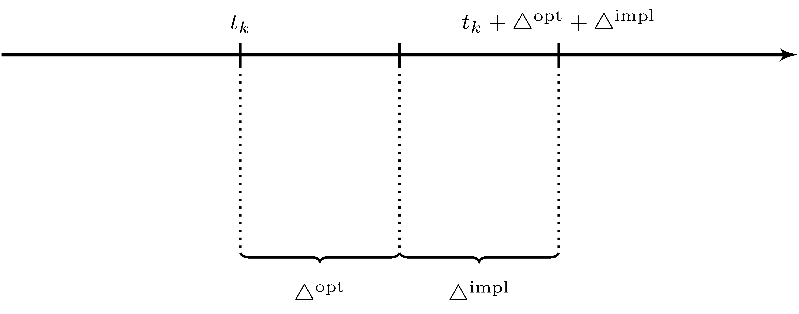

  * [time-t-delta-t+timeline+text+decoration.tex](https://github.com/walmes/Tikz/blob/master/src/time-t-delta-t+timeline+text+decoration.pgf)

```tex
% https://tex.stackexchange.com/a/102046/173708
\documentclass[tikz]{standalone}
\usetikzlibrary{arrows,decorations.pathreplacing}
\usepackage{amsmath}
\begin{document}
\begin{tikzpicture}[y=1cm, x=1cm, thick, font=\footnotesize]    
% axis
\draw[line width=1.2pt, ->, >=latex'](0,0) -- coordinate (x axis) (10,0);       

% time points
\draw (3,-4pt) coordinate (t_k)          -- (3,4pt) node[anchor=south] {$t_{k}$};
\draw (5,-4pt) coordinate (t_k_opt)      -- (5,4pt) node[anchor=south] {};
\draw (7,-4pt) coordinate (t_k_opt_impl) -- (7,4pt) node[anchor=south]
                                {$t_{k}+\triangle^{\text{opt}}+\triangle^{\text{impl}}$};

% curly braces
\draw[decorate,decoration={brace,amplitude=3pt,mirror}] 
    (3,-2.5) coordinate (t_k_unten) -- (5,-2.5) coordinate (t_k_opt_unten); 
\node at (4,-3){$\triangle^{\text{opt}}$};
\draw[decorate,decoration={brace,amplitude=3pt,mirror}] 
    (t_k_opt_unten) -- (7,-2.5) coordinate (t_k_opt_impl_unten); 
\node at (6,-3){$\triangle^{\text{impl}}$};

% vertical dotted lines
\draw[dotted] (t_k)          -- (t_k_unten);
\draw[dotted] (t_k_opt)      -- (t_k_opt_unten);
\draw[dotted] (t_k_opt_impl) -- (t_k_opt_impl_unten);
\end{tikzpicture}
\end{document}
```
****


  * [time-time_evolution+timeline+3d+foreach+set+command.tex](https://github.com/walmes/Tikz/blob/master/src/time-time_evolution+timeline+3d+foreach+set+command.pgf)

```tex
% http://www.texample.net/media/tikz/examples/TEX/events.tex
% Time course of events in an experiment
% Author: Rudolf Siegel
\documentclass[tikz,border=10pt]{standalone}
%%%<
\usepackage{verbatim}
%%%>

\begin{comment}
:Title: Time course of events in an experiment
:Tags: Styles;Foreach;Paths;Positioning;Scopes;Psychology
:Author: Rudolf Siegel
:Slug: events

A diagram depicting time course of events in an experiment. Every frame
represents a screen presented to a participant. This kind of diagram is
mostly used in (cognitive) psychology and neuroscience.
\end{comment}

\usetikzlibrary{positioning}

\begin{document}
\begin{tikzpicture}
  \tikzset{
        basefont/.style = {font = \Large\sffamily},
          timing/.style = {basefont, sloped,above,},
           label/.style = {basefont, align = left},
          screen/.style = {basefont, white, align = center,
                           minimum size = 6cm, fill = black!60, draw = white}};
		
  % macro for defining screens
  \newcommand*{\screen}[4]{%
    \begin{scope}
    	[xshift = #3, 
		 yshift = #4,
         every node/.append style = {yslant = 0.33},
         yslant = 0.33,
         local bounding box = #1]
      	\node[screen] at (3cm,3cm) {#2};
    \end{scope}
  } 	
  % define several screens
  \screen{frame1}{\textbf+} {0}     {0}
  \screen{frame2}{stimuli 1}{150} {-60}
  \screen{frame3}{}         {300}{-120}
  \screen{frame4}{stimuli 2}{450}{-180}
  \screen{frame5}{recording}{600}{-240}
  \coordinate [xshift=750,yshift=-300] (frame6);
    	
  % add annotations
  \foreach \i / \content in {
      1/fixation cross,
      2/picture,
      3/blank screen,
      4/word,
      5/recording\\(depending on response)
    }
    \node[label, above right=5em and 1em of frame\i.east]
      (f\i-label) {\content};

  % add time course
  \foreach \j [count=\i] / \content in {
      2/800\,ms,
      3/2000\,ms,
      4/500-2000\,ms,
      5/2000\,ms,
      6/till response
    }
    \path[ultra thick] (frame\i.south west) edge 
      node[timing] {\content} (frame\j.south west);

  % some manual addition
  \path[ultra thick,->] (frame5.south west) edge 
    node[timing, below] {next trial} (frame6);
\end{tikzpicture}
\end{document}
```
****


  * [time-timeline+physics+timeline+def+foreach+multi+learn.tex](https://github.com/walmes/Tikz/blob/master/src/time-timeline+physics+timeline+def+foreach+multi+learn.pgf)

```tex
% Author: Izaak Neutelings (July, 2017)

\documentclass{article}
\usepackage{amsmath} % for \dfrac
\usepackage{tikz}
\usepackage{calc} % for simple arithmetic
\tikzset{>=latex} % for LaTeX arrow head

% split figures into pages
\usepackage[active,tightpage]{preview}
\PreviewEnvironment{tikzpicture}
\setlength\PreviewBorder{1pt}%

\begin{document}


% TIMELINE - simple
\begin{tikzpicture}[]
  
  % limits
  \newcount\yearOne; \yearOne=1900
  \def\w{15}    % width of axes
  \def\n{4}     % number of decades
  \def\lt{0.40} %  ten tick length
  \def\lf{0.36} % five tick length
  \def\lo{0.30} %  one tick length
  
  % help functions
  \def\yearLabel(#1,#2){\node[above] at ({(#1-\yearOne)*\w/\n/10},\lt) {#2};}
  \def\yearArrowLabel(#1,#2,#3,#4){
    \def\xy{{(#1-\yearOne)*\w/\n/10}}; \pgfmathparse{int(#2*100)};
    \ifnum \pgfmathresult<0
      \def\yyp{{(\lt*(0.90+#2))}}; \def\yyw{{(\yyp-\lt*#3)}}
      \draw[<-,thick,black,align=center] (\xy,\yyp) -- (\xy,\yyw) node[below,black] at (\xy,\yyw) {#4};
    \else
      \def\yyp{{(\lt*(0.10+#2)}}; \def\yyw{{(\yyp+\lt*#3)}}
      \draw[<-,thick,black,align=center] (\xy,\yyp) -- (\xy,\yyw) node[above,black] at (\xy,\yyw) {#4};
    \fi}
  
  % axis
  %\draw[thick] (0,0) -- (\w,0);
  \draw[->,thick] (-\w*0.03,0) -- (\w*1.03,0);
  
  % ticks
  \foreach \tick in {0,1,...,\n}{
    \def\x{{\tick*\w/\n}}
    \def\year{\the\numexpr \yearOne+\tick*10 \relax}
  	\draw[thick] (\x,\lt) -- (\x,-\lt) % ten tick
	             node[below] {\year};
	
	\ifnum \tick<\n
	  \draw[thick] ({(\x+\w/\n/2)},0) -- ({(\x+\w/\n/2)},\lf); % five tick
      \foreach \ticko in {1,2,3,4,6,7,8,9}{
        \def\xo{{(\x+\ticko*\w/\n/10)}}
  	    \draw[thick] (\xo,0) -- (\xo,\lo);  % one tick
	}\fi
  }
  
  % label
  \yearLabel(1923,lol)
  \yearArrowLabel(1932.2, 1.0,1.0,foo)
  \yearArrowLabel(1937.2, 1.0,1.5,foo bar)
  \yearArrowLabel(1907.5, 0.0,1.5,small)
  \yearArrowLabel(1915.6,-1.0,2.0,\small this is small a sentence)
  \yearArrowLabel(1924.2,-1.2,1.2,$p\lambda=h$)
  
\end{tikzpicture}


% LOGARITHMIC SCALE
\large
\begin{tikzpicture}[]
  
  % limits
  \newcount\nOne; \nOne=-10
  \def\w{18}      % width of axes
  \def\n{29}      % number of decades
  \def\noffset{1} % offset labels
  \def\nskip{3}   % skip number
  \def\la{2.00}   % arrow length
  \def\lt{0.20}   % tick length
  \def\ls{0.15}   % tick length (skipped)
  
  % help functions
  \def\myx(#1){{(#1-\nOne)*\w/\n}}
  \def\arrowLabel(#1,#2,#3,#4){
    \def\xy{(#1-\nOne)*\w/\n}; \pgfmathparse{int(#2*100)};
    \ifnum \pgfmathresult<0
      \def\yyp{{(\lt*(-0.10+#2))}}; \def\yyw{{(\yyp-\la*\lt*#3)}}
      \draw[<-,thick,black!50!blue,align=center]
        (\myx(#1),\yyp) -- (\myx(#1),\yyw)
        node[below,black!80!blue] {#4}; %,fill=white
    \else
      \def\yyp{{(\lt*(0.10+#2)}}; \def\yyw{{(\yyp+\la*\lt*#3)}}
      \draw[<-,thick,black!50!blue,align=center]
        (\myx(#1),\yyp) -- (\myx(#1),\yyw)
        node[above,black!80!blue] {#4};
    \fi}
  \def\arrowLabelRed(#1,#2,#3,#4){
    \def\yyp{{(\lt*(-0.10+#2))}}; \def\yyw{{(\yyp-\la*\lt*#3)}}
    \fill[red,radius=2pt] (\myx(#1),0) circle;
    \draw[<-,thick,black!25!red,align=center]
      (\myx(#1),\yyp) -- (\myx(#1),\yyw)
      node[below,black!40!red] {\strut#4}; %,fill=white
    }
  
  % axis
  \draw[->,thick] (-\w*0.03,0) -- (\w*1.06,0)
                  node[right=4pt,below=6pt] {[GeV]};
  
  % ticks
  \foreach \tick in {0,1,...,\n}{
    \def\x{{\tick*\w/\n}}
    \def\dec{\the\numexpr \nOne+\tick \relax}
	\pgfmathparse{Mod(\tick-\noffset,\nskip)==0?1:0}
	\ifnum\pgfmathresult>0
	  \draw[thick] (\x,\lt) -- (\x,-\lt) % ten tick
	               node[below] {$10^{\dec}$}; % label
	\else
      \draw[thick] (\x,\ls) -- (\x,-\ls); % ten tick
	\fi
  }
  
  % label
  \arrowLabel(-9.52,1.2,2.5,neutrino) % log(0.0000000003)=-9.523 (0.3 eV)
  \arrowLabel(-3.29,1.2,1.5,electron) % log(0.000510)=-3.292 (0.510 MeV)
  \arrowLabel(-0.03,1.2,2.5,proton)   % log(0.938)=-0.03
  \arrowLabel( 1.90,1.2,5.7,$\text{W}^\pm$, $\text{Z}$) % log(80)=1.90, log(90)=1.95
  \arrowLabel( 2.25,1.2,2.4,\qquad Higgs\\\quad top) % log(125)=2.10, log(175)=2.24
  \arrowLabel( 4.15,-1.2,1.6,LHC)     % log(1400)=4.146
  \arrowLabel(16.00,1.2,2.5,GUT)      % 10^25 eV = 10^16 GeV
  \arrowLabel(19.09,1.2,4.0,Planck)   % Planck % quantum gravity % 1.22x10^19 . GeV
  
  % low mass
  \arrowLabelRed(1.477,-1.2,3.0,X)    % ln(30) = 1.477
  \arrowLabelRed(2.230,-1.2,3.0,$\text{B}'$) % ln(170) = 2.230
  
  % stretch
  \draw[<->,thick,black!20!orange]
    ({(2.6-\nOne)*\w/\n},0.95) -- ({(15.6-\nOne)*\w/\n},0.95)
    node[midway,below=1pt] {particle desert ?}
    node[midway,above=1pt] {new physics ?};
  
\end{tikzpicture}


% TIMELINE - particle physics
% sources: http://web.ihep.su/dbserv/compas/src/
%          http://www.particleadventure.org/other/history/
%          https://en.wikipedia.org/wiki/Timeline_of_particle_discoveries
\large
\begin{tikzpicture}[] %[minimum height=10pt, text height=10pt,text depth=10pt,

  % limits
  \newcount\yearOne; \yearOne=1900
  \newcount\yoffset;
  \def\w{18}       % width of axes
  \def\n{4}        % number of decades
  \def\lt{0.40}    %  ten tick length
  \def\lf{0.36}    % five tick length
  \def\lo{0.30}    %  one tick length
  \def\lext{0.07}  % left extension of axes
  \def\rext{1.045} % left extension of axes
  
  % help functions
  \def\yearLabel(#1,#2,#3){\node[above,black!60!blue] at ({(#1-\yearOne)*\w/\n/10},{\lt*#2}) {#3};}
  \def\yearArrowLabel(#1,#2,#3,#4){
    \def\xy{{(#1-\yearOne)*\w/\n/10}}; \pgfmathparse{int(#2*100)};
    \ifnum \pgfmathresult<0 % below
      \def\yyp{{(\lt*(0.90+#2))}}; \def\yyw{{(\yyp-\lt*#3)}}
      \draw[<-,thick,black!50!blue,align=center]
        (\xy,\yyp) -- (\xy,\yyw)
        node[below,black!80!blue] at (\xy,\yyw) {\strut #4};
    \else % under
      \def\yyp{{(\lt*(0.10+#2)}}; \def\yyw{{(\yyp+\lt*#3)}}
      \draw[<-,thick,black!60!blue,align=center]
        (\xy,\yyp) -- (\xy,\yyw)
        node[above] at (\xy,\yyw) {#4};
    \fi}
  \def\yearArrowLabelRed(#1,#2,#3,#4){
    \def\xy{{(#1-\yearOne)*\w/\n/10}}; \pgfmathparse{int(#2*100)};
      \def\yyp{{(\lt*(0.90+#2))}}; \def\yyw{{(\yyp-\lt*#3)}}
      \fill[red,radius=2pt] (\xy,0) circle;
      \draw[<-,thick,black!25!red,align=center]
        (\xy,\yyp) -- (\xy,\yyw)
        node[below,black!40!red] at (\xy,\yyw) {\strut #4};
     }  
  
  
  %---------------%
  %  1900 - 1940  %
  %---------------%
  
  % axis
  \draw[thick] (-\w*0.07,0) -- (\w*\rext,0);
  
  % ticks
  \foreach \tick in {0,1,...,\n}{
    \def\x{{\tick*\w/\n}}
    \def\year{\the\numexpr \yearOne+\tick*10 \relax}
    \draw[thick] (\x,-\lt) -- (\x,\lt) % ten tick
                 node[above] {\year};
	
	\ifnum \tick<\n
      \draw[thick] ({(\x+\w/\n/2)},0) -- ({(\x+\w/\n/2)},\lf); % five tick
      \foreach \ticko in {1,2,3,4,6,7,8,9}{
        \def\xo{{(\x+\ticko*\w/\n/10)}}
  	    \draw[thick] (\xo,0) -- (\xo,\lo);  % one tick
	}\fi
  }
  
  % extra ticks
  \draw[thick] (-1*\w/\n/10,0) -- (-1*\w/\n/10,\lo);
  \draw[thick] (-2*\w/\n/10,0) -- (-2*\w/\n/10,\lo);
  \draw[thick] ({\w+\w/\n/10},0) -- ({\w+\w/\n/10},\lo);
  
  % labels
  \yearArrowLabel(1897.83,-1.2,1.5,
                  $\text{e}^-$)      % electron 10/1897 Thomson
  \yearArrowLabel(1905.25,-1.2,1.5,
                  $\gamma$)          % photon   03/1905 Einstein
  \yearArrowLabel(1913.17, 1.2,1.5,
                  atom nucleus)      % nucleus  02/1913 Rutherford
  \yearArrowLabel(1917.50,-1.2,1.5,
                  $\text{p}^+$)      % proton      1917 Rutherford (Philos. Mag., Ser. 6, Vol. 37, 581 (1919))
  \yearArrowLabel(1932.50, 1.2,1.5,
                  anti-matter)       % anti-matter
  \yearArrowLabel(1932.50,-1.2,1.5,
                  $\text{e}^+$\\     % positron    1932 Anderson
                  $\text{n}^0$)      % neutron     1932 Chadwick
  \yearArrowLabel(1936.50,-1.2,1.5,
                  $\mu^\pm$)         % muon        1936
  
  
  
  %---------------%
  %  1940 - 1980  %
  %---------------%
  
  \yearOne=1940; \advance\yoffset by 120
  \begin{scope}[yshift=-\yoffset]
    
    % axis
    \draw[thick] (-\w*\lext,0) -- (\w*\rext,0);
    
    % ticks
    \foreach \tick in {0,1,...,\n}{
      \def\x{{\tick*\w/\n}}
      \def\year{\the\numexpr \yearOne+\tick*10 \relax}
      \draw[thick] (\x,-\lt) -- (\x,\lt) % ten tick
	               node[above] {\year};
      \ifnum \tick<\n
        \draw[thick] ({(\x+\w/\n/2)},0) -- ({(\x+\w/\n/2)},\lf); % five tick
        \foreach \ticko in {1,2,3,4,6,7,8,9}{
          \def\xo{{(\x+\ticko*\w/\n/10)}}
  	      \draw[thick] (\xo,0) -- (\xo,\lo);  % one tick
	  }\fi
    }

    % extra ticks
    \draw[thick] (-1*\w/\n/10,0) -- (-1*\w/\n/10,\lo);
    \draw[thick] (-2*\w/\n/10,0) -- (-2*\w/\n/10,\lo);
    \draw[thick] ({\w+\w/\n/10},0) -- ({\w+\w/\n/10},\lo);
  
    % labels
    \yearArrowLabel(1947.42,-1.2,1.5,
                    $\pi^\pm$\\            % pions    05/1947 Lattes, Muirhead, Occhialini, Powell
                    $\text{K}^0$)          % neutral kaons 12/1947 Rochester & Butler, Nature, 160, 855
    \yearArrowLabel(1949.00,-1.2,1.5,
                    $\text{K}^\pm$)        % kaons    12/1949 Powell, Fowler, Perkins, Nature, 163, 82
    \yearArrowLabel(1950.10,-2.2,1.8,
                  \,$\pi^0$)               % pi0      01/1950 Caltech
    \yearArrowLabel(1952.00,-1.2,1.5,
                    $\Lambda^0$\\          % Lambda0  12/1950 Hopper, Biswas, Phys. Rev. 80, 1099
                    $\Delta$)              % 1952 Anderson, Fermi, (Chicago Cyclotron), Phys. Rev., 85, 936
                                           % 1956 Ashkin (Rochester cyclotron), Phys. Rev., 101, 1149
     % Sigma+ 1953 Bonetti, Nuovo Cimento, 10, 1; Danysz, Pniewski, Phil. Mag., 44, 348; Cosmotron Brookhaven, Phys. Rev., 93, 109
     % Xi- "negative hyperon" 1954 Cowan (Caltech), Phys. Rev., 94, 161
    \yearArrowLabel(1953.20,-1.2,1.5,\,\,$\Sigma^\pm$\\\,\,$\Xi^-$)
    \yearArrowLabel(1955.92,-1.2,1.5,$\overline{\text{p}}$\,) % 11/1955 Chamberlain, Segrè (Bevatron) Phys. Rev. 100, 947
    \yearArrowLabel(1956.75,-1.2,1.5,$\nu_\text{e}$\\$\overline{\text{n}}$) % 09/1956 Reines, Cowan, Nature, 178, 446
    \yearArrowLabel(1957.80,-1.2,1.5,$\Sigma^0$) % 
    \yearArrowLabel(1959.00,-1.2,1.5,$\Xi^0$) % Xi 1959 (1964 Brookhaven)
    % 1960  Sigma*(1385) Phys. Rev. Lett., 5, 520
    \yearArrowLabel(1961.20,-1.2,1.5,
                    $\rho$\\            % 1961 Erwin (Cosmotron) Phys. Rev. Lett., 6, 628
                    $\omega$\\          % 1961 Maglic, Alvarez, Phys. Rev. Lett., 7, 178
                    $\eta$\\            % 1961 Pevsner, Phys. Rev. Lett., 7, 421
                    $\text{K}^*$)       % 1961 Alston, Phys. Rev. Lett., 6, 300, 1962 Phys. Rev. Lett., 9, 330
    % 19.. strangeness "associated-production", Pais
    % 1962 Eightfold Way, Gell-Man
    \yearArrowLabel(1962.58,-1.2,1.5,\vspace{2pt}
                    $\nu_\mu$\\         % 07/1962, Ledderman, Danby, Phys. Rev. Lett. 9, 36
                    $\phi$)             % 1962, Pjerrou Phys. Rev. Lett., 9, 114, Bertanza, Phys. Rev. Lett., 9, 180
    % 1962 f particle?
    \yearArrowLabel(1964.10,-1.2,1.5,
                    $\alpha_2$\\        %
                    \,$\eta^*$\\        %
                    \,\,$\Omega^-$)     % 02/1964, Barnes, Brookhaven, Phys. Rev. Lett. 12, 204
    \yearArrowLabel(1964.50, 1.2,1.2,
                    quark model\\
                    \small{up, down, strange}) % Gell-Mann
    % 1967 Steven Weinberg, Abdus Salam: electroweak unification
    \yearArrowLabel(1974.50, 1.2,1.2,
                    \qquad\qquad Standard Model\\
                    \small{charm})     % charm
    % 1974 November Revolution
    \yearArrowLabel(1974.50,-1.2,1.5,$\text{J/}\Psi$\,\,\\$\Psi'$\\\,$\Psi''$) % 
    %\yearLabel(1973,4.0,Standard Model) % Standard Model
    % tau 1975 Perl, Abrams, Phys. Rev. Lett. 35, 1489
    \yearArrowLabel(1976.00,-1.2,1.5,$\tau$\\$\chi_\text{c}$) % 
    \yearArrowLabel(1976.90,-1.2,1.5,
                    $\text{D}$        ) % 1976 SLAC
    \yearArrowLabel(1977.75, 1.2,1.2,
                    \small{bottom} )    % bottom
    \yearArrowLabel(1977.75,-1.2,1.5,$\Upsilon$\\\,$\Upsilon'$\\\,\,$\Upsilon''$\\\small\ldots) % Fermilab
    \yearArrowLabel(1979.65,-1.2,1.5,$\Lambda_\text{c}$\\$\Sigma_\text{c}$) % 
    
  \end{scope}
    
    
    
  %---------------%
  %  1980 - 2020  %
  %---------------%
  
  \yearOne=1980; \advance\yoffset by 130
  \begin{scope}[yshift=-\yoffset]
    
    % axis
    \draw[->,thick] (-\w*\lext,0) -- (\w*1.06,0);
    
    % ticks
    \foreach \tick in {0,1,...,\n}{
      \def\x{{\tick*\w/\n}}
      \def\year{\the\numexpr \yearOne+\tick*10 \relax}
      \draw[thick] (\x,-\lt) -- (\x,\lt) % ten tick
	               node[above] {\year};
      \ifnum \tick<\n
        \draw[thick] ({(\x+\w/\n/2)},0) -- ({(\x+\w/\n/2)},\lf); % five tick
        \foreach \ticko in {1,2,3,4,6,7,8,9}{
          \def\xo{{(\x+\ticko*\w/\n/10)}}
  	      \draw[thick] (\xo,0) -- (\xo,\lo);  % one tick
	  }\fi
    }
    
    % extra ticks
    \draw[thick] (-1*\w/\n/10,0) -- (-1*\w/\n/10,\lo);
    \draw[thick] (-2*\w/\n/10,0) -- (-2*\w/\n/10,\lo);
    \draw[thick] ({\w+\w/\n/10},0) -- ({\w+\w/\n/10},\lo);
  
    % labels
    \yearArrowLabel(1980.40,-1.2,1.5,
                    $\eta_\text{c}$   )  % 
    \yearArrowLabel(1981.30,-1.2,1.5,
                    B                 )  % 
    \yearArrowLabel(1983.05,-1.2,1.5,
              \mbox{$\text{W}^\pm$\hspace{4pt}}\\
                    $\text{D}_\text{s}$\\
                    $\Xi_\text{c}$    )  % 
    \yearArrowLabel(1984.00,-1.2,1.5,
              \mbox{\hspace{12pt}$\text{Z}^0$} ) % 
    \yearArrowLabel(1991.60,-1.2,1.5,$\text{B}_\text{s}$\\$\Lambda_\text{b}$)  % Bs Fermilab
    \yearArrowLabel(1995.30,-1.2,1.5,t)  % 
    \yearArrowLabel(1995.30, 1.2,1.2,
                    \small{top}      )   %  
    \yearArrowLabel(2000.60,-1.2,1.5,$\nu_\tau$)  % 
    \yearArrowLabel(2012.50,-1.2,1.5,H)  % 
    \yearArrowLabelRed(2017.7,-1.2,1.5,X\\\,$\text{B}'$) % low mass
    
  \end{scope}
    
    
    
\end{tikzpicture}
  
  

\end{document}
```
****


  * [time-tow-lined-braces+timeline+command+text+foreach+tabular+learn.tex](https://github.com/walmes/Tikz/blob/master/src/time-tow-lined-braces+timeline+command+text+foreach+tabular+learn.pgf)

```tex
% https://tex.stackexchange.com/a/215994/173708
\documentclass[tikz,border=5mm]{standalone}
\newcommand{\mytab}[1]{%
\begin{tabular}{@{}c@{}}
#1
\end{tabular}
}
\begin{document}
\begin{tikzpicture}
	\draw (0,0) -- (11,0);
	\foreach \x in {0.8,4,5.5,7,10.2}
		\draw(\x cm,3pt) -- (\x cm, -3pt);
	\draw (0.8,0) node[below=3pt] {$T_0$};
	\draw (4,0) node[below=3pt] {$T_1$};
	\draw (5.5,0) node[below=3pt] {$0$};
	\draw (7,0) node[below=3pt] {$T_2$};
	\draw (10.2,0) node[below=3pt] {$T_3$};
	\draw (2.35,0) node[above=6pt, align=center] {
	                        $\left(\mytab{estimation \\ window}\right]$};
\end{tikzpicture}
\end{document}
```
****


  * [time-two_courses_horizontal+timeline+foreach+learn.tex](https://github.com/walmes/Tikz/blob/master/src/time-two_courses_horizontal+timeline+foreach+learn.pgf)

```tex
% https://tex.stackexchange.com/a/239139/173708
\documentclass{standalone}
\usepackage[utf8]{inputenc}
\usepackage{tikz}
\usetikzlibrary{snakes}
\usepackage{fullpage}
\usepackage{graphicx}
\usetikzlibrary{calc}


\begin{document}
\resizebox{\linewidth}{!}{% Resize table to fit within
\begin{tikzpicture}[snake=zigzag, line before snake = 5mm, line after snake = 5mm]
	%draw 1st horizontal line
	\draw (0,0) -- (19/2,0);
	\draw[snake] (19/2,0) -- (25/2,0);
	\draw (25/2,0) -- (30/2,0);
	\draw[snake] (30/2,0) -- (35/2,0);
	\draw (35/2,0) -- (40/2,0);
	%draw vertical lines
	\foreach \x in {0, 5, 10, 19, 30, 40}{
	   \draw (\x/2,3pt) -- (\x/2,-3pt);
	}
	%draw nodes
	\draw (-2,0) node { PHYS1060 };
	
	\draw (0,0) node[below=3pt] { Pre-test published } node[above=3pt] { Jan 4, 2014  };
	\draw (5/2,0) node[below=3pt] { Nudge } node[above=3pt] { Jan 9, 2014  };
	\draw (10/2,0) node[below=3pt] { First class } node[above=3pt] { Jan 13, 2014  };
	\draw (19/2,0) node[below=3pt] { Pre-test due } node[above=3pt] { Jan 22, 2014  };
	\draw (30/2,0) node[below=3pt] { Midterm } node[above=3pt] { Feb 17, 2014  };
	\draw (40/2,0) node[below=3pt] { Final Exam} node[above=3pt] { May 5, 2014  };
	
	%draw 2nd horizontal line
	\draw (-2,-2) node { PHYS1050 };
	\draw (0,-2) -- (19/2,-2);
	\draw[snake] (19/2,-2) -- (25/2,-2);
	\draw (25/2,-2) -- (30/2,-2);
	\draw[snake] (30/2,-2) -- (35/2,-2);
	\draw (35/2,-2) -- (40/2,-2);
	draw vertical lines
	\foreach \x in {0, 5, 10, 19, 30, 40}{
	   \draw ($(0,-2)+(\x/2, 3pt)$) -- ($(0,-2)+(\x/2, -3pt)$);
	}
		
	%draw nodes
	\draw (0,-2) node[below=3pt] { Pre-test published } node[above=3pt] { Aug 10, 2014  };
	\draw (5/2,-2) node[below=3pt] { First class } node[above=3pt] { Aug 27, 2014  };
	\draw (10/2,-2) node[below=3pt] { Nudge } node[above=3pt] { Sept 4, 2014  };
	\draw (19/2,-2) node[below=3pt] { Pre-test due } node[above=3pt] { Sept 7, 2014  };
	\draw (30/2,-2) node[below=3pt] { Midterm } node[above=3pt] { ?, 2014  };
	\draw (40/2,-2) node[below=3pt] { Final Exam} node[above=3pt] { ?, 2014  };	


\end{tikzpicture}
}

\end{document}
```
****


  * [time-vertical-multiple-on-year+timeline+text+environment+command+learn.tex](https://github.com/walmes/Tikz/blob/master/src/time-vertical-multiple-on-year+timeline+text+environment+command+learn.pgf)

```tex
% https://tex.stackexchange.com/a/197140/173708
\documentclass[10pt]{article}

\usepackage[paperwidth=210mm,%
    paperheight=297mm,%
    tmargin=7.5mm,%
    rmargin=7.5mm,%
    bmargin=7.5mm,%
    lmargin=7.5mm,
    vscale=1,%
    hscale=1]{geometry}

\usepackage[utf8]{inputenc}
\usepackage[T1]{fontenc}

\usepackage{tikz}

\usetikzlibrary{arrows, calc, decorations.markings, positioning}

\pagestyle{empty}


% create an environment
\makeatletter
\newenvironment{timeline}[6]{%
    % #1 is startyear
    % #2 is tlendyear
    % #3 is yearcolumnwidth
    % #4 is rulecolumnwidth
    % #5 is entrycolumnwidth
    % #6 is timelineheight

    \newcommand{\startyear}{#1}
    \newcommand{\tlendyear}{#2}

    \newcommand{\yearcolumnwidth}{#3}
    \newcommand{\rulecolumnwidth}{#4}
    \newcommand{\entrycolumnwidth}{#5}
    \newcommand{\timelineheight}{#6}

    \newcommand{\templength}{}

    \newcommand{\entrycounter}{0}

    % https://tex.stackexchange.com/questions/85528/checking-whether-or-not-a-node-has-been-previously-defined
    % https://tex.stackexchange.com/questions/37709/how-can-i-know-if-a-node-is-already-defined
    \long\def\ifnodedefined##1##2##3{%
        \@ifundefined{pgf@sh@ns@##1}{##3}{##2}%
    }

    \newcommand{\ifnodeundefined}[2]{%
        \ifnodedefined{##1}{}{##2}
    }

    \newcommand{\drawtimeline}{%
        \draw[timelinerule] (\yearcolumnwidth+5pt, 0pt) -- (\yearcolumnwidth+5pt, -\timelineheight);
        \draw (\yearcolumnwidth+0pt, -10pt) -- (\yearcolumnwidth+10pt, -10pt);
        \draw (\yearcolumnwidth+0pt, -\timelineheight+15pt) -- (\yearcolumnwidth+10pt, -\timelineheight+15pt);

        \pgfmathsetlengthmacro{\templength}{neg(add(multiply(subtract(\startyear, \startyear), divide(subtract(\timelineheight, 25), subtract(\tlendyear, \startyear))), 10))}
        \node[year] (year-\startyear) at (\yearcolumnwidth, \templength) {\startyear};

        \pgfmathsetlengthmacro{\templength}{neg(add(multiply(subtract(\tlendyear, \startyear), divide(subtract(\timelineheight, 25), subtract(\tlendyear, \startyear))), 10))}
        \node[year] (year-\tlendyear) at (\yearcolumnwidth, \templength) {\tlendyear};
    }

    \newcommand{\entry}[2]{%
        % #1 is the year
        % #2 is the entry text

        \pgfmathtruncatemacro{\lastentrycount}{\entrycounter}
        \pgfmathtruncatemacro{\entrycounter}{\entrycounter + 1}

        \ifdim \lastentrycount pt > 0 pt%
            \node[entry] (entry-\entrycounter) [below of=entry-\lastentrycount] {##2};
        \else%
            \pgfmathsetlengthmacro{\templength}{neg(add(multiply(subtract(\startyear, \startyear), divide(subtract(\timelineheight, 25), subtract(\tlendyear, \startyear))), 10))}
            \node[entry] (entry-\entrycounter) at (\yearcolumnwidth+\rulecolumnwidth+10pt, \templength) {##2};
        \fi

        \ifnodeundefined{year-##1}{%
            \pgfmathsetlengthmacro{\templength}{neg(add(multiply(subtract(##1, \startyear), divide(subtract(\timelineheight, 25), subtract(\tlendyear, \startyear))), 10))}
            \draw (\yearcolumnwidth+2.5pt, \templength) -- (\yearcolumnwidth+7.5pt, \templength);
            \node[year] (year-##1) at (\yearcolumnwidth, \templength) {##1};
        }

        \draw ($(year-##1.east)+(2.5pt, 0pt)$) -- ($(year-##1.east)+(7.5pt, 0pt)$) -- ($(entry-\entrycounter.west)-(5pt,0)$) -- (entry-\entrycounter.west);
    }

    \newcommand{\plainentry}[2]{% plainentry won't print date in the timeline
        % #1 is the year
        % #2 is the entry text

        \pgfmathtruncatemacro{\lastentrycount}{\entrycounter}
        \pgfmathtruncatemacro{\entrycounter}{\entrycounter + 1}

        \ifdim \lastentrycount pt > 0 pt%
            \node[entry] (entry-\entrycounter) [below of=entry-\lastentrycount] {##2};
        \else%
            \pgfmathsetlengthmacro{\templength}{neg(add(multiply(subtract(\startyear, \startyear), divide(subtract(\timelineheight, 25), subtract(\tlendyear, \startyear))), 10))}
            \node[entry] (entry-\entrycounter) at (\yearcolumnwidth+\rulecolumnwidth+10pt, \templength) {##2};
        \fi

        \ifnodeundefined{invisible-year-##1}{%
            \pgfmathsetlengthmacro{\templength}{neg(add(multiply(subtract(##1, \startyear), divide(subtract(\timelineheight, 25), subtract(\tlendyear, \startyear))), 10))}
            \draw (\yearcolumnwidth+2.5pt, \templength) -- (\yearcolumnwidth+7.5pt, \templength);
            \node[year] (invisible-year-##1) at (\yearcolumnwidth, \templength) {};
        }

        \draw ($(invisible-year-##1.east)+(2.5pt, 0pt)$) -- ($(invisible-year-##1.east)+(7.5pt, 0pt)$) -- ($(entry-\entrycounter.west)-(5pt,0)$) -- (entry-\entrycounter.west);
    }

    \begin{tikzpicture}
        \tikzstyle{entry} = [%
            align=left,%
            text width=\entrycolumnwidth,%
            node distance=10mm,%
            anchor=west]
        \tikzstyle{year} = [anchor=east]
        \tikzstyle{timelinerule} = [%
            draw,%
            decoration={markings, mark=at position 1 with {\arrow[scale=1.5]{latex'}}},%
            postaction={decorate},%
            shorten >=0.4pt]

        \drawtimeline
}
{
    \end{tikzpicture}
    \let\startyear\@undefined
    \let\tlendyear\@undefined
    \let\yearcolumnwidth\@undefined
    \let\rulecolumnwidth\@undefined
    \let\entrycolumnwidth\@undefined
    \let\timelineheight\@undefined
    \let\entrycounter\@undefined
    \let\ifnodedefined\@undefined
    \let\ifnodeundefined\@undefined
    \let\drawtimeline\@undefined
    \let\entry\@undefined
}
\makeatother


% first timeline

\begin{document}

\begin{timeline}{1900}{1990}{2cm}{2.5cm}{5cm}{12cm}
	\entry{1903}{Wilbur and Orville Wright fly the first powered airplane}
	\entry{1914}{Assassination of Franz Ferdinand}
	\plainentry{1917}{The October Revolution}
	\entry{1928}{Discovery of Penicillin}
	\plainentry{1929}{Stock Market Crash of 1929}
	\entry{1941}{Attack on Pearl Harbor}
	\plainentry{1944}{D-Day}
	\entry{1945}{The Bombing of Hiroshima}
	\plainentry{1947}{Creation of Israel as a Jewish State}
	\entry{1963}{US president John F. Kennedy assassinated in Dallas}
	\entry{1969}{The Moon Landing}
	\plainentry{1989}{Fall of the Berlin Wall}
\end{timeline}

\bigskip

Text from: A Brief History of LaTeX http://www.xent.com/FoRK-archive/feb98/0307.html

\smallskip

% second timeline
\begin{timeline}{1974}{1985}{2cm}{7cm}{10cm}{0.45\textheight}
	\entry{1974}{Donald Knuth stops submitting papers to the AMS because ``the finished
	product was just too painful for me to look at''.}
	\entry{1977}{Knuth begins his research on typography.}
	\entry{1978}{Knuth delivers an AMS Gibbs Lecture entitled Mathematical Typography to the AMS membership at its annual meeting.}
	\entry{1979}{Digital Equipment Corporation and the AMS jointly publish Knuth's TeX and METAFONT: New Directions in Typesetting.}
	\entry{1980}{The first draft of Spivak's Joy of TeX is announced in TUGboat, vol. 1, no. 1.}
	% multiple events on a year
	\entry{1982}{Spivak announces AMS-TeX at the joint math meetings.}
	\entry{1982}{Version 0 of Spivak's Joy of TeX is released.}
	\entry{1982}{Knuth releases dvitype, a model DVI driver.}
	\entry{1983}{Lamport writes a LaTeX manual, the earliest known LaTeX manual in existence.}
	% multiple events on a year
	\entry{1984}{Addison-Wesley publishes Knuth's The TeXbook, destined to become the definitive TeX reference.}
	\entry{1984}{Lamport releases version 2.06a of the LaTeX macros.}
	% multiple events on a year
	\entry{1985}{The Computer Modern (CM) fonts replace the American Modern (AM) fonts in TeX.}
	\entry{1985}{Patashnik releases BibTeX version 0.98 for LaTeX 2.08. [``BibTeX 1.0'', TUGboat, vol. 15, no. 3, pp. 269--274, Sept. 1994.}
\end{timeline}

\end{document}
```
****


  * [time-year-event+timeline+set+foreach+learn.tex](https://github.com/walmes/Tikz/blob/master/src/time-year-event+timeline+set+foreach+learn.pgf)

```tex
% https://tex.stackexchange.com/a/369484/173708
\documentclass[margin=10pt]{standalone}
\usepackage{tikz}

\usetikzlibrary{
    shapes.geometric
    ,positioning
}
\tikzset{
    zeitmarkernode/.style={
        isosceles triangle
        ,minimum height=2.5mm
        ,inner sep=0pt
        ,anchor=apex
    },
    zeitmarker/.pic={%
        \node[zeitmarkernode,pic actions,rotate=-90](-o){};
        \node[zeitmarkernode,pic actions,rotate=90](-u){};
    }
}
\begin{document}
    \begin{tikzpicture}[x=6cm,thick]
    % Achse und Beschriftung unterhalb
    \draw (11.9,0) -- (12,0) coordinate (s) -- (12+18/25,0) coordinate (a) 
        -- (12+27/25,0) coordinate (b) -- (14,0) coordinate (e) -- (14.2,0);
    \foreach \c/\zeit in {s/2000,a/2018,b/2027,e/2050}
        \draw (\c) node[below=.5cm of \c] {\zeit} -- +(0,.1) -- +(0,-.1);

    % Markierungen, Beschriftungen oberhalb und Verbindungen
    \foreach[count=\i] \descr/\c/\hshift in {%
        approach 1/s/5mm,%
        approach 2/a/5mm,%
        approach 3/b/5mm,%
        approach 4/e/3mm%
    }{
        \pic[fill=blue] (zm\i) at (\c) {zeitmarker};
        \node[above=1cm of zm\i-o,xshift=\hshift] (zm\i) {\emph{\descr}};
        \coordinate(h) at ([yshift=5mm]zm\i-o);
        \draw[blue](h) edge (zm\i) edge (zm\i-o);
    }
    \node[below left =.5cm and 1cm of s, text width=5em, align=center, text height=1.5ex,text depth=.25ex] {\emph{Year}};
    \node[above left =.5cm and 1cm of s, text width=5em, align=center] {\emph{Approaches}};
    \end{tikzpicture}
\end{document}
```
****


  * [transparent_circles+multi+pgf+set.tex](https://github.com/walmes/Tikz/blob/master/src/transparent_circles+multi+pgf+set.pgf)

```tex
% https://tex.stackexchange.com/a/48596/173708
\documentclass{scrartcl}
\usepackage{tikz}
\usetikzlibrary{calc}  

% split figures into pages
\usepackage[active,tightpage]{preview}
\PreviewEnvironment{tikzpicture}
\setlength\PreviewBorder{1pt}%

\begin{document} 

% If their areas of the circle nodes represent some numbers with proportionality 
% then you need to know exactly the radius. The radius depends of minimum width 
% and of \pgflinewidth.
%
% we have : radius = (minimum width + line width) / 2  if inner sep = 0pt
%
% In the next example, I choice first minimum width=2cm then minimum width=2cm,
% line width=5mm and finally line width=5mm,minimum width=2cm-\pgflinewidth 
% with in all cases inner sep= 0 pt.
%

	
\begin{tikzpicture} 
  \draw[help lines,step=0.1,,draw=orange] (0,0) grid (8,1); 
  \draw[help lines] (0,0) grid (8,1);     
  \node[minimum width=2cm,circle,inner sep=0pt,fill=blue!20,fill opacity=.5]{};
  \node[minimum width=2cm,circle,inner sep=0pt,fill=blue!20,fill opacity=.5,
        line width=5mm,draw=gray,opacity=.5] at (3,0){}; 
  \node[circle,inner sep=0pt,fill=blue!20,,fill opacity=.5,
        line width=5mm,draw=gray,opacity=.5,minimum width=2cm-\pgflinewidth]  at (6,0) {}; 
\end{tikzpicture}  

% Now if I want to get three circles with areas equal to pi, 2pi and 3pi 
% I created a macro `def\lw{2mm}` to change quickly the line width in all nodes

\tikzset{myrad/.style 2 args={circle,inner sep=0pt,minimum width=(2*(sqrt(#1)*1 cm ) - \pgflinewidth,fill=#2,draw=#2,fill opacity=.5,opacity=.8}}    

\begin{tikzpicture} 
	\def\lw{2mm}
	\draw[help lines,step=0.1,,draw=orange] (0,0) grid (8,1); 
	\draw[help lines] (0,0) grid (8,1);     
	\node[line width=\lw,myrad={1}{blue!20}]  at (0,0) {1}; 
	\node[line width=\lw,myrad={2}{red!20}]  at (3,0) {2};
	\node[line width=\lw, myrad={3}{green!20}]  at (7,0) {3};   
\end{tikzpicture}  

% Finally If you want nodes with areas equal to 1 cm^2, 2 cm^2 and 3 cm^2 : 
% I change the line width for the second group of nodes

\begin{tikzpicture} 
	\def\lw{2mm}
	\draw[help lines,step=0.1,,draw=orange] (0,0) grid (8,1); 
	\draw[help lines] (0,0) grid (8,1);     
	\node[line width=\lw,myrad={1}{blue!20}]  at (0,0) {1}; 
	\node[line width=\lw,myrad={2}{red!20}]  at (3,0) {2};
	\node[line width=\lw, myrad={3}{green!20}]  at (7,0) {3};   
\end{tikzpicture}    

\begin{tikzpicture} 
	\def\lw{5mm}
	\draw[help lines,step=0.1,,draw=orange] (0,0) grid (8,1); 
	\draw[help lines] (0,0) grid (8,1);     
	\node[line width=\lw,myrad={1}{blue!20}]  at (0,0) {1}; 
	\node[line width=\lw,myrad={2}{red!20}]  at (3,0) {2};
	\node[line width=\lw, myrad={3}{green!20}]  at (7,0) {3};   
\end{tikzpicture}

%To avoid this kind of problem, we can use circles instead of circle nodes. But we need to adjust the radius wit the pgflinewidth. In the next example,I want a radius = 2cm so I need to use : radius=2cm-0.5\pgflinewidth. Then I need to create a node with the same dimensions.
%
%Like the question about node and rectangle here, we can associate a node to the shape The main problem : we can't use scale but it's more easy to place a label.

\tikzset{set node/.style={insert path={% 
	\pgfextra{% 
		\node[inner sep=0pt,outer sep = 0pt,draw=black, % draw= none only to show what I do
		circle,
		minimum width=2*\pgfkeysvalueof{/tikz/x radius}+0.5\pgflinewidth](#1) {};
}}}}

\begin{tikzpicture}
	\draw[help lines] (-3,-3) grid (3,3);
	\draw[blue,line width=5mm,opacity=.2] (0,0) circle [radius=2cm-0.5\pgflinewidth,set node=C1]  ; 
	\draw[thick,->] (3,-3) -- (C1.east);
\end{tikzpicture}

\end{document} 
```
****

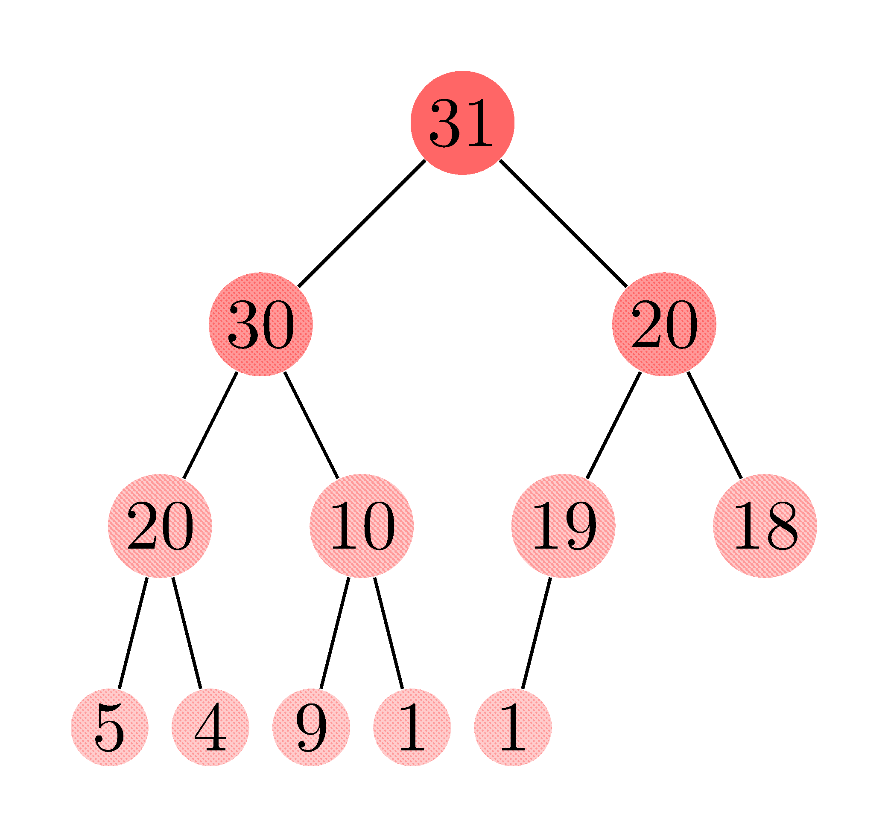

  * [tree_sibiling+tree.tex](https://github.com/walmes/Tikz/blob/master/src/tree_sibiling+tree.pgf)

```tex

\documentclass[tikz,border=10pt]{standalone}
%\documentclass[crop, tikz]{standalone}

\usepackage{tikz}

\begin{document}
	
\begin{tikzpicture}
[level distance=10mm,
every node/.style={fill=red!60,circle,inner sep=1pt},
level 1/.style={sibling distance=20mm,nodes={fill=red!45}},
level 2/.style={sibling distance=10mm,nodes={fill=red!30}},
level 3/.style={sibling distance=5mm,nodes={fill=red!25}}]
\node {31}
child {node {30}
	child {node {20}
		child {node {5}}
		child {node {4}}
	}
	child {node {10}
		child {node {9}}
		child {node {1}}
	}
}
child {node {20}
	child {node {19}
		child {node {1}}
		child[missing]
	}
	child {node {18}}
};
\end{tikzpicture}
	
\end{document}
```
****

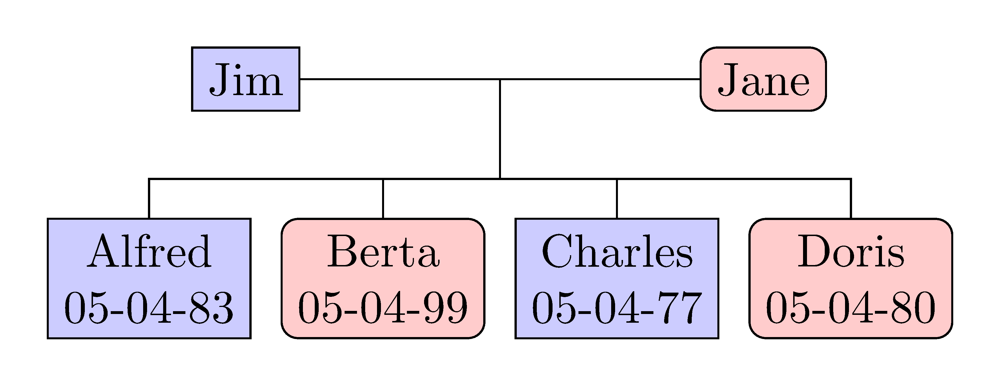

  * [tree-break_text_lines+tree.tex](https://github.com/walmes/Tikz/blob/master/src/tree-break_text_lines+tree.pgf)

```tex
% https://tex.stackexchange.com/a/50906/173708

\documentclass[border=10pt]{standalone}
\usepackage{tikz}
\usetikzlibrary{trees}

\begin{document}
	\begin{tikzpicture}[
		man/.style={rectangle, 
					draw, 
					fill=blue!20, 
					align=center},
		woman/.style={rectangle, 
						draw, 
						fill=red!20,
						rounded corners=.8ex, 
						align=center},
		grandchild/.style={grow=down, 
							xshift=1em, 
							anchor=west,
							edge from parent path={(\tikzparentnode.south) |- (\tikzchildnode.west)}},
		first/.style={level distance=6ex},
		second/.style={level distance=12ex},
		third/.style={level distance=18ex},
		level 1/.style={sibling distance=5em}]
		% Parents
		\coordinate
		child[grow=left] {node[man,anchor=east]{Jim}}
		child[grow=right] {node[woman,anchor=west]{Jane}}
		child[grow=down,level distance=0ex]
		[edge from parent fork down]
		% Children and grandchildren
		child{node[man] {Alfred \\ 05-04-83}}
		child{node[woman] {Berta \\ 05-04-99}}
		child {node[man] {Charles \\ 05-04-77}}
		child {node[woman]{Doris \\ 05-04-80}};        
	\end{tikzpicture}
\end{document}
```
****

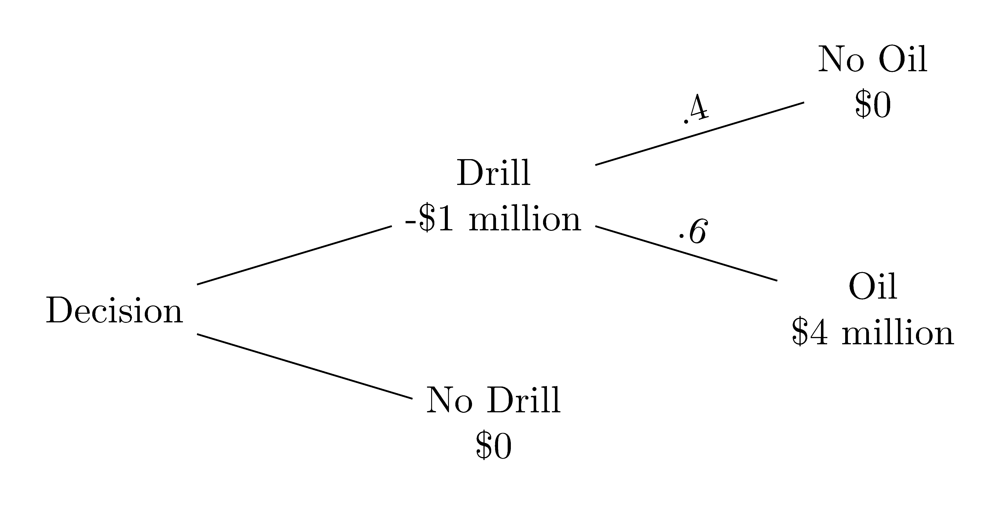

  * [tree-decision_to_drill+tree+command.tex](https://github.com/walmes/Tikz/blob/master/src/tree-decision_to_drill+tree+command.pgf)

```tex
% https://tex.stackexchange.com/questions/287034/how-to-reduce-line-space-in-node-labels
\documentclass[border=3mm,tikz]{standalone}

\renewcommand\baselinestretch{1.5}% <--- probably it is in your document preamble 
                                  % or it is invoked with some option in 
                                  % \documentclass{...} which you use in your document. 

\begin{document}
\begin{tikzpicture}
	[grow = right, sibling distance = 6em, level distance = 10em, align=center, sloped]
	%---
	\linespread{1}% <--- locally defined vertical line spacing in nodes
	%---
	  \node {Decision}
	    child {node {No Drill\\\$0} }
	    child {node {Drill\\-\$1 million}
	      child {node {Oil\\\$4 million} edge from parent node [above] {.6} }
	      child {node {No Oil\\\$0} edge from parent node [above] {.4} }
	      };
\end{tikzpicture}
\end{document}
```
****

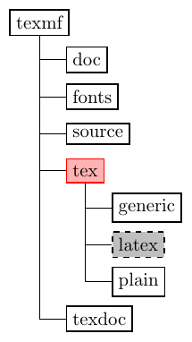

  * [tree-filesystem+diagram.tex](https://github.com/walmes/Tikz/blob/master/src/tree-filesystem+diagram.pgf)

```tex
% http://www.texample.net/media/tikz/examples/TEX/filesystem-tree.tex
% Author: Frantisek Burian
\documentclass{minimal}
\usepackage{tikz}
%%%<
\usepackage{verbatim}
\usepackage[active,tightpage]{preview}
\PreviewEnvironment{tikzpicture}
\setlength\PreviewBorder{5pt}%
%%%>

\begin{comment}
:Title: Filesystem tree
:Tags: Trees; Styles
:Author: Frantisek Burian
:Slug: filesystem-tree
\end{comment}

\usetikzlibrary{trees}

\begin{document}
\tikzstyle{every node}=[draw=black,thick,anchor=west]
\tikzstyle{selected}=[draw=red,fill=red!30]
\tikzstyle{optional}=[dashed,fill=gray!50]
\begin{tikzpicture}[%
  grow via three points={one child at (0.5,-0.7) and
  two children at (0.5,-0.7) and (0.5,-1.4)},
  edge from parent path={(\tikzparentnode.south) |- (\tikzchildnode.west)}]
  \node {texmf}
    child { node {doc}}		
    child { node {fonts}}
    child { node {source}}
    child { node [selected] {tex}
      child { node {generic}}
      child { node [optional] {latex}}
      child { node {plain}}
    }
    child [missing] {}				
    child [missing] {}				
    child [missing] {}				
    child { node {texdoc}};
\end{tikzpicture}
\end{document}
```
****


  * [tree-networked_game.tex](https://github.com/walmes/Tikz/blob/master/src/tree-networked_game.pgf)

```tex
% % https://github.com/FriendlyUser/LatexDiagrams
\documentclass{standalone}
\usepackage{forest}
\usetikzlibrary{arrows.meta,shapes,positioning,shadows,trees}
%
\tikzset{
    basic/.style  = {draw, text width=2cm, drop shadow, font=\sffamily, rectangle},
    root/.style   = {basic, rounded corners=2pt, thin, align=center,
                     fill=green!30},
    onode/.style = {basic, thin, rounded corners=2pt, align=center, fill=green!60,text width=3cm,},
    tnode/.style = {basic, thin, align=left, fill=pink!60, text width=6.5em},
    xnode/.style = {basic, thin, rounded corners=2pt, align=center, fill=blue!20,text width=5cm,},
    wnode/.style = {basic, thin, align=left, fill=pink!10!blue!80!red!10, text width=6.5em},
    edge from parent/.style={draw=black, edge from parent fork right}

}
%
\begin{document}
\begin{forest} for tree={
    grow=east,
    growth parent anchor=east,
    parent anchor=east,
    child anchor=west,
    edge path={\noexpand\path[\forestoption{edge},->, >={latex}] 
         (!u.parent anchor) -- +(5pt,0pt) |- (.child anchor)
         \forestoption{edge label};}
}
[Networked Game Work BreakDown, root
    [Software Engineering Report, xnode
        [Setting shape, tnode]
        [Choosing color, tnode]
        [Adding shading, tnode] ]
    [Game Demo Preparation, onode
        [Using a Matrix, tnode]
        [Relatively, tnode]
        [Absolutely, tnode] 
        [Using overlays, wnode] ]
    [Project Proposal and Game Logic, onode
        [Default arrows, tnode]
        [Arrow library, tnode]
        [Resizing tips, tnode] 
        [Shortening, tnode]
        [Bending, tnode] ] ]
\end{forest}
\end{document}
```


## Implementation of a simple tag system for files

I am implementing a very primitive tag system based of identifiers that are included in the filenames. I started to do this in TikZ because the graphics could belong to different categories at the same time. My plan is using what is available in the operating systems. Tools like `grep`, `find`, `regex`, etc., should make this possible. I have done a pilot of this and seems to be working.

To tag the file -as you will see in the repository- I use the plus sign. I tried different symbols and this symbol is not obfuscated as a search string.

* Characters that pass the search test at OS level: `@`, `!`, `=`, `+`.
* Character that do not pass: `#`.

