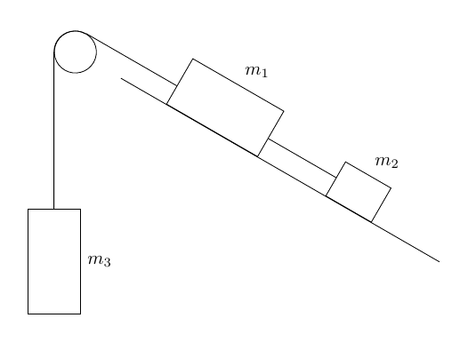
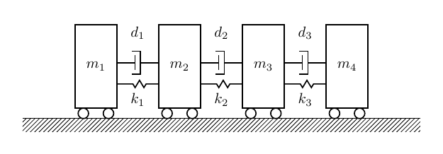
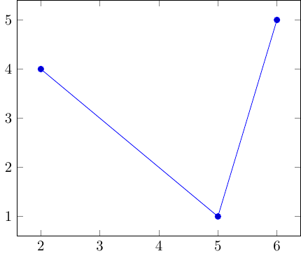

## Introduction
This is a repository of the best TikZ examples I have found around the web and from papers, slides, tutorials, and books. Most of the examples are simple enough to encourage anyone to start learning TikZ. By having the result (graphic) on a web page, and be able to click on it to see the code, it rapidly helps to make the connection between **code** and **output**. I find this idea fantastic.

TikZ is ideal for any kind of publications either websites, blogs, papers, articles, slides, or books because they are portable and reproducible. TikZ files are text not binaries. They don't require mouse and clicks but writing code to connect objects and elements. These object can be very simple or as sophisticated as you want. TikZ graphics can be built under any LaTex environment for any operating system: Windows, Linux or Mac OS.

There are hundreds of libraries for TikZ in all scientific fields. That makes it easier to build advanced graphics for practically any domain or discipline because you are able to start from code already written.


## Motivation

While working with Latex and TikZ file I had this question:

**How can I use the power of R to organize TikZ related files?**

**R** is very friendly to Latex and TikZ through the packages `knitr` and `rmarkdown`.

TikZ involves a source file, which carries the `tex` extension; the PDF that is generated by your Latex compiler and editor (I use *TexStudio*); the graphics output file -that could be anything imaginable. I use `png` files.


  
## How this README is built
This `README` is smartly generated with TikZ graphics and code located in the `src` folder.
This means that as you are adding, building, designing new TikZ drawings, they become available to be automatically included in this README file. It uses some `knitr` tricks. But the whole thing is awesome. 

The magic is provided by:

* the file `template.Rmd`
* the chunks of code that you can see in this `README`  


## Deployment of website in GitHub Pages (GHP)
This is a very interesting article about publshing your TikZ site: [Simple deployment to GH Pages](https://www.gnu.org/software/make/manual/html_node/Conditional-Syntax.html). I chose to publish it in `/docs` instead of the `public` folder because it is much easier to deploy. GHP does not allow to publish a website on a folder named `public`, unfortunately.


## Thanks. Original repository and idea 
I found this valuable resource while exploring TikZ and R: https://github.com/walmes/Tikz

It is pretty neat and relatively simple to use and personalize because it uses Hugo, a generator of static websites; the same engine that is used by `blogdown`, `bookdown`, and others.

Thanks to **Walmes Zeviani** for the great idea of combining Latex, TikZ, R and Hugo.

Source: https://github.com/walmes/Tikz
Web: http://leg.ufpr.br/~walmes/Tikz/  


## Summary 
This is my collection of favorite TikZ graphics. It is necessary to store and organize them as gallery because it makes it easier to peek at the code for new designs.


Some useful tutorials:

  * [TikZ Adventskalender](https://tobiw.de/en/teotm/tikz-adventskalender)
  * [TikZ for the Impatient](http://math.et.info.free.fr/TikZ/bdd/TikZ-Impatient.pdf)
  * <http://www.mat.ufpb.br/lenimar/introtikz.pdf>
  * [LaTeX for Economists](http://nfpoitiers.eu/wp-content/uploads/2018/08/3-presentations_and_graphics.pdf)
  * [Configurable Graph Drawing Algorithmsfor the TikZ Graphics Description Language](https://www.tcs.uni-luebeck.de/downloads/papers/2011/2011-configurable-graph-drawing-algorithms-jannis-pohlmann.pdf)
  * [TikZ for Economics By Chiu Yu Ko](https://www.google.com/books/edition/_/t3ZZDwAAQBAJ?hl=en&gbpv=0)
  * <http://www.statistiker-wg.de/pgf/tutorials.htm>
  * [A very minimal introduction to TikZ](https://cremeronline.com/LaTeX/minimaltikz.pdf)
  * [TikZ Tutorial](https://indico.scc.kit.edu/event/48/contributions/3405/attachments/1693/2321/tikz_tutorial.pdf)
  


## Useful statistics

* There are 16 total Tikz figures saved as `.tex` files in this gallery. 
The figures are sorted by filename.
* There are 14 files under `src/` to be compiled with `pdflatex`
* There are 2 files under `src/` to be compiled with `lualatex`
* There are 19 data files under the folder `src/data` that are being used by the TikZ scripts
* There are 2 Latex classes, styles and library files under the `src/texmf` folder


## TikZ graphics and code


****


  
  * [3d-cone_intersection+3d+pgf.lualatex.tex](https://github.com/f0nzie/tikz_favorites/blob/master/src/3d-cone_intersection+3d+pgf.lualatex.tex)

```tex
% http://pgfplots.net/media/tikz/examples/TEX/intersection-surfaces.tex
% +3d+pgf
% compile with lualatex
%
\documentclass[border=10pt]{standalone}
%%%<
\usepackage{verbatim}
%%%>
\usepackage{pgfplots}
\pgfplotsset{width=7cm,compat=1.8}

\begin{comment}
:Title: Intersection of two surfaces
:Tags: 3D;Intersections
:Author: Jake
:Slug: intersection-surfaces

We would like to intersect a 3D plot with a plane. The problem is not to get
the two functions into a plot, but to get the two functions to visual
intersect with each other, i.e the nearest surface is in the foreground.

This can't be done automatically, unfortunately, since pgfplots can't do z
buffering between different \addplot commands.

For this concrete application, you could construct the plot "by hand", however:

First, you draw the part of the cone below 0, then you draw the plane and the
circle, then you draw the part of the cone above 0.

I've used a polar coordinate system for this, since it makes the input of
polar functions easier.

This code was written by Jake on TeX.SE.
\end{comment}
\begin{document}
  \begin{tikzpicture}
    \begin{axis}[grid=major,view={20}{40},z buffer=sort, data cs=polar]
      \addplot3 [surf, domain=0:360, domain y=5:10,samples=30, samples y=10]
      {-y+5};
      \addplot3 [data cs=cart,surf,domain=-10:10,samples=2, opacity=0.5]
      {0};
      \addplot3 [domain=0:360, samples y=0, samples=30, thick, z buffer=auto]
      (x,5.1,0);
      \addplot3 [surf,domain=0:360, domain y=0:5,samples=30, samples y=10]
      {-y+5};
    \end{axis}
  \end{tikzpicture}  
\end{document}
```
****


  
  * [3d-gradient-colored.tex](https://github.com/f0nzie/tikz_favorites/blob/master/src/3d-gradient-colored.tex)

```tex
% https://github.com/MartinThoma/LaTeX-examples/blob/master/tikz/3d-gradient-colored/3d-gradient-colored.tex
\documentclass[varwidth=true, border=2pt]{standalone}

\usepackage[usenames,dvipsnames]{xcolor}
\usepackage{pgfplots}
\pgfplotsset{compat=1.13}
\usetikzlibrary{arrows.meta}

\begin{document}
\pgfplotsset{
    colormap={whitered}{
        color(0.000cm)=(blue!50!black);
        color(0.125cm)=(blue);
        color(0.250cm)=(SkyBlue);
        color(0.375cm)=(SkyBlue);
        color(0.500cm)=(SpringGreen);
        color(0.625cm)=(yellow);
        color(0.750cm)=(yellow);
        color(0.875cm)=(red);
        color(1.000cm)=(red!50!black)
    }
}
\begin{tikzpicture}
    \begin{axis}[
        domain=-2:2,
        view={0}{90},
        axis background/.style={fill=white},
        xmin=-2, xmax=2,
        ymin=-2, ymax=2,
        axis equal image,
        point meta rel=per plot
    ]
        \addplot3[surf,
                  samples=50,
                  shader=interp,
                  colormap name=whitered]
                {x/exp(x^2+y^2)};
        % \addplot3[contour gnuplot={number=15, labels=false},
        %           very thick,
        %           samples=30]
        %         {x/exp(x^2+y^2)};
        \addplot3[blue,
        point meta={
            sqrt(
                ((1-2*x^2)*exp(-x^2-y^2))^2+
                (-2*x*y*exp(-x^2-y^2))^2
            )
        },
                  quiver={
                          u={(1-2*x^2)*exp(-x^2-y^2)},
                          v={-2*x*y*exp(-x^2-y^2)},
                          scale arrows=0.3,
                          every arrow/.append style={%
                             -{Latex[scale length={max(0.01,\pgfplotspointmetatransformed/1000)}]},
                             },
                         },
                         samples=15]
                {x/exp(x^2+y^2)};
    \end{axis}
\end{tikzpicture}
\end{document}
```
****


  
  * [elem-highlight_curve.tex](https://github.com/f0nzie/tikz_favorites/blob/master/src/elem-highlight_curve.tex)

```tex
% https://latexdraw.com/how-to-highlight-parts-of-a-function-and-change-the-background-color-in-latex-using-tikz/
\documentclass[dvipsnames]{standalone}

\usepackage{tikz}
\usepackage{pgfplots}
\pgfplotsset{compat = newest}

\begin{document}
	\begin{tikzpicture}
	\begin{axis}[
	xmin = 0, xmax = 7,
	ymin = -20, ymax = 20,
	width = 8cm,
	height = 6.5cm,
	xtick distance = 1,
	ytick distance = 4,
	smooth,
	xlabel=$x$-axis,
	ylabel=$y$-axis,
	set layers,
	]
	\begin{pgfonlayer}{axis background}
	\fill [yellow!5] (0,-20) rectangle (7,20);
	\end{pgfonlayer}
	\addplot[Green!20, domain = 0:7, line width=4mm] {(x-1)*(x-3)^2*(x-6)};
	\addplot[Green!30, domain = 0:7, line width=2mm] {(x-1)*(x-3)^2*(x-6)};
	\addplot[Green, domain = 0:7, thick] {(x-1)*(x-3)^2*(x-6)};
	\end{axis}
	\end{tikzpicture}
\end{document}
```
****



  
  * [elem-mass_inclined_plane.tex](https://github.com/f0nzie/tikz_favorites/blob/master/src/elem-mass_inclined_plane.tex)

```tex
% https://tex.stackexchange.com/a/13405/173708
\documentclass[border=15pt]{standalone}
\usepackage{tikz}
\usetikzlibrary{calc}

\begin{document}

\begin{tikzpicture}[every node/.style={draw}]

\begin{scope}[rotate=-30]
\node at (3,0) [draw,name=A,rectangle, minimum width=2cm,minimum height=1cm,anchor=south,label=$m_1$,transform shape] {};
\node at (6,0) [name=B,rectangle, minimum width=1cm,minimum height=0.75cm,anchor=south,label=$m_2$,transform shape] {};
\node at (0,0) [name=C,circle,minimum size=.8cm,transform shape] {};

\draw (C.north) -- ($(A.south west)!(C.north)!(A.north west)$);
\draw ($(A.south east)!(C.north)!(A.north east)$) -- ($(B.south west)!(C.north)!(B.north west)$);
\draw(1,0) -- (8,0);
\end{scope}


\node at (-0.4,-5) [draw,name=D,rectangle, minimum width=1cm,minimum height=2cm,anchor=south,label=right:$m_3$] {};
\draw ($(D.north west)!(C.210)!(D.north east)$) -- (C.210)  arc [start angle=180,end angle=60,radius=0.4cm];
\end{tikzpicture}
\end{document}
```
****



  
  * [eng-machanical_system.tex](https://github.com/f0nzie/tikz_favorites/blob/master/src/eng-machanical_system.tex)

```tex
% http://blog.jakob-wankel.de/2017/01/25/drawing-a-mechanical-system-with-tikz-in-latex/
\documentclass[border=15pt]{standalone}

\usepackage{tikz}
\usetikzlibrary{calc,patterns,decorations.pathmorphing,decorations.markings}


\begin{document}

\begin{tikzpicture}
\tikzstyle{spring}=[thick,decorate,decoration={zigzag,pre length=0.3cm,post length=0.3cm,segment length=6}]
\tikzstyle{damper}=[thick,decoration={markings,  
	mark connection node=dmp,
	mark=at position 0.5 with 
	{
		\node (dmp) [thick,inner sep=0pt,transform shape,rotate=-90,minimum width=15pt,minimum height=3pt,draw=none] {};
		\draw [thick] ($(dmp.north east)+(2pt,0)$) -- (dmp.south east) -- (dmp.south west) -- ($(dmp.north west)+(2pt,0)$);
		\draw [thick] ($(dmp.north)+(0,-5pt)$) -- ($(dmp.north)+(0,5pt)$);
	}
}, decorate]
\tikzstyle{ground}=[fill,pattern=north east lines,draw=none,minimum width=0.75cm,minimum height=0.3cm]

\node (M) [draw,outer sep=0pt,thick,minimum width=1cm, minimum height=2cm] {$m_1$};
\node (M2) [draw,outer sep=0pt,thick,minimum width=1cm, minimum height=2cm] at (2,0) {$m_2$};
\node (M3) [draw,outer sep=0pt,thick,minimum width=1cm, minimum height=2cm] at (4,0) {$m_3$};
\node (M4) [draw,outer sep=0pt,thick,minimum width=1cm, minimum height=2cm] at (6,0) {$m_4$};

\node (ground) [ground,anchor=north,xshift=3cm,yshift=-0.25cm,minimum width=9.5cm] at (M.south) {};

\draw (ground.north east) -- (ground.north west);
\draw [thick] (M.south west) ++ (0.2cm,-0.125cm) circle (0.125cm)  (M.south east) ++ (-0.2cm,-0.125cm) circle (0.125cm);
\draw [thick] (M2.south west) ++ (0.2cm,-0.125cm) circle (0.125cm)  (M2.south east) ++ (-0.2cm,-0.125cm) circle (0.125cm);
\draw [thick] (M3.south west) ++ (0.2cm,-0.125cm) circle (0.125cm)  (M3.south east) ++ (-0.2cm,-0.125cm) circle (0.125cm);
\draw [thick] (M4.south west) ++ (0.2cm,-0.125cm) circle (0.125cm)  (M4.south east) ++ (-0.2cm,-0.125cm) circle (0.125cm);

\draw [spring] (M2.220) -- ($(M.north east)!(M.220)!(M.south east)$);
\draw [spring] (M3.220) -- ($(M2.north east)!(M2.220)!(M2.south east)$);
\draw [spring] (M4.220) -- ($(M3.north east)!(M3.220)!(M3.south east)$);

\draw [damper] (M2.170) -- ($(M.north east)!(M2.170)!(M.south east)$);
\draw [damper] (M3.170) -- ($(M2.north east)!(M3.170)!(M2.south east)$);
\draw [damper] (M4.170) -- ($(M3.north east)!(M4.170)!(M3.south east)$);

\node at (1,.8) {$d_1$};
\node at (3,.8) {$d_2$};
\node at (5,.8) {$d_3$};

\node at (1,-.8) {$k_1$};
\node at (3,-.8) {$k_2$};
\node at (5,-.8) {$k_3$};

\end{tikzpicture}

\end{document}
```
****


  
  * [eng-quarter_car_model.tex](https://github.com/f0nzie/tikz_favorites/blob/master/src/eng-quarter_car_model.tex)

```tex
% https://tex.stackexchange.com/a/240917/173708
\documentclass[tikz,border=10pt]{standalone}
\usepackage{tikz}

\usetikzlibrary{arrows, calc,decorations.pathmorphing,positioning,decorations.markings}

\tikzset{
    shadedrec/.style={
        rectangle,
        draw=black,
        top color=gray, 
        bottom color=white, 
        shading angle={135},
        text width=3cm,
        inner sep=1em,
        rounded corners=1.2ex,
        very thick,
        text centered},
    snake arrow/.style={
        decorate,
        decoration={zigzag,amplitude=3mm,segment length=5mm,post length=0mm}},
    damper/.style={
        very thick,
        decoration={markings,  
        mark connection node=dmp,
        mark=at position 0.5 with 
        {
            \node (dmp) [very thick,transform shape,text width=.3cm,rotate=-90,minimum height=3pt,draw=none, fill=black,outer xsep=2pt, outer ysep=1pt] {};
            \draw [very thick] ($(dmp.north east)+(-.6pt,0)$) -- ($(dmp.south east)+(-.6pt,0)$) -- ($(dmp.south west)+(-.6pt,0)$) -- ($(dmp.north west)+(-.6pt,0)$);
            \draw [very thick,rotate=-90] ($(dmp.north)+(0,-5pt)$) -- ($(dmp.north)+(0,5pt)$);
        }
    }, decorate}
}

\begin{document}
\pagestyle{empty}

\begin{tikzpicture}

% Shapes

    \node[shadedrec, anchor=center] (S1) at (4,3) {$M$};
    \node[shadedrec, anchor=center, below=2 of S1] (S2) {$m$};

%Nodes side
    \node[anchor=center,text centered,right=2cm of S1.east] (sm) {Sprung mass};
    \node[below=of sm] (susp) {Suspension};
    \node[below=of susp] (usm) {Unsprung mass};
    \node[below=of usm] {Tire};

% Paths

%side arrows
    \draw[->,very thick] (S1.west) -- ++ (-1.5,0) -- ++ (0,-1.5) node[below] {$Z$};
    \draw[->,very thick] (S2.west) -- ++ (-1.5,0) -- ++ (0,-1.5) node[below] {$Z_u$};

%zigzag lines
    \draw[very thick, snake arrow] ($(S1.south west)!.5!(S1.south)$) -- ++ (0,-2) node[left,midway,xshift=-1em] {$K_s$};
    \draw[very thick, snake arrow] (S2.south) -- ++ (0,-2) 
        node[left,midway,xshift=-1em] {$K_t$};

%Connector shape
    \draw[damper] ($(S2.north east)!.5!(S2.north)$) -- ($(S1.south east)!.5!(S1.south)$) node[right,midway,xshift=1em] {$C_s$};


% Road
    \coordinate (A) at ($(S2.west)+(5.5,-2.45)$);
    \draw[->,very thick] (A) -- ++(-7,0) -- ++ (0,-1.5) node[below] {$Z_r$};

\begin{scope}[shift={($(S2.west)+(-1.5,-2.45)$)}]

    \foreach \x in {0.5,1,...,7} { %This one draws the little diagonal lines
    \draw (\x,0) -- ({\x-.5},-.5);
    }

\end{scope} 
\end{tikzpicture}

\end{document}
```
****


  
  * [eng-spring_mass.tex](https://github.com/f0nzie/tikz_favorites/blob/master/src/eng-spring_mass.tex)

```tex
% https://tex.stackexchange.com/a/13952/173708
\documentclass[border=15pt]{standalone}
\usepackage{tikz}
\usetikzlibrary{calc,patterns,decorations.pathmorphing,decorations.markings}

\begin{document}

\begin{tikzpicture}[every node/.style={draw,outer sep=0pt,thick}]
\tikzstyle{spring}=[thick,decorate,decoration={zigzag,pre length=0.3cm,post length=0.3cm,segment length=6}]
\tikzstyle{damper}=[thick,decoration={markings,  
  mark connection node=dmp,
  mark=at position 0.5 with 
  {
    \node (dmp) [thick,inner sep=0pt,transform shape,rotate=-90,minimum width=15pt,minimum height=3pt,draw=none] {};
    \draw [thick] ($(dmp.north east)+(2pt,0)$) -- (dmp.south east) -- (dmp.south west) -- ($(dmp.north west)+(2pt,0)$);
    \draw [thick] ($(dmp.north)+(0,-5pt)$) -- ($(dmp.north)+(0,5pt)$);
  }
}, decorate]
\tikzstyle{ground}=[fill,pattern=north east lines,draw=none,minimum width=0.75cm,minimum height=0.3cm]


\node (M) [minimum width=3.5cm,minimum height=2cm] {mass, $m$};

\node (ground1) at (M.south) [ground,yshift=-1.5cm,xshift=-1.25cm,anchor=north] {};
\draw (ground1.north west) -- (ground1.north east);
\draw [spring] (ground1.north) -- ($(M.south east)!(ground1.north)!(M.south west)$);

\node (ground2) at (M.south) [ground,yshift=-1.5cm,anchor=north] {};
\draw (ground2.north west) -- (ground2.north east);
\draw [damper] (ground2.north) -- ($(M.south east)!(ground2.north)!(M.south west)$);

\node (ground3) at (M.south) [ground,yshift=-1.5cm,xshift=1.25cm,anchor=north] {};
\draw (ground3.north west) -- (ground3.north east);
\draw [spring] (ground3.north) -- ($(M.south east)!(ground3.north)!(M.south west)$);

\draw [-latex,ultra thick] (M.north) ++(0,0.2cm) -- +(0,1cm);

\begin{scope}[xshift=7cm]
\node (M) [minimum width=1cm, minimum height=2.5cm] {$m$};

\node (ground) [ground,anchor=north,yshift=-0.25cm,minimum width=1.5cm] at (M.south) {};
\draw (ground.north east) -- (ground.north west);
\draw [thick] (M.south west) ++ (0.2cm,-0.125cm) circle (0.125cm)  (M.south east) ++ (-0.2cm,-0.125cm) circle (0.125cm);

\node (wall) [ground, rotate=-90, minimum width=3cm,yshift=-3cm] {};
\draw (wall.north east) -- (wall.north west);

\draw [spring] (wall.170) -- ($(M.north west)!(wall.170)!(M.south west)$);
\draw [damper] (wall.10) -- ($(M.north west)!(wall.10)!(M.south west)$);

\draw [-latex,ultra thick] (M.east) ++ (0.2cm,0) -- +(1cm,0);
\end{scope}
\end{tikzpicture}

\end{document}
```
****


  
  * [fileIO-plot_curves-read_data+fileio+plot+pgf.tex](https://github.com/f0nzie/tikz_favorites/blob/master/src/fileIO-plot_curves-read_data+fileio+plot+pgf.tex)

```tex
% http://pgfplots.net/media/tikz/examples/TEX/plot-markers.tex
\documentclass[border=10pt]{standalone}
%%%<
\usepackage{verbatim}
\usepackage{pgfplots}
\pgfplotsset{width=7cm, compat=1.8, grid style={dashed}}

\begin{comment}
:Title: Markers in a line diagram
:Tags: 2D;Markers
:Author: Elke Schubert
:Slug: plot-markers

Besides x and y values, special markers illustrate the result.

This topic was discussed on: http://texwelt.de/wissen/fragen/3363/

Data file
-------
if you want the data to be saved as you modify this file, add this:

	\usepackage{filecontents}
	
	% changes in this table make changes to CSV file
	\begin{filecontents}{data.csv}
	measuring   power1   result1   power2   result2
	1           2        0.2       3.5      0.39
	2           3        0.35      3.8      0.3
	3           4        0.45      7.9      0.35
	4           5        0.5       8.5      0.39
	5           6        0.65      8.0      0.38
	6           7        0.68      8.5      0.4
	7           8        0.7       9.5      0.41
	8           7.5      0.73      10.5     0.99
	9           6.7      0.75      {}       {}
	10          10       0.79      {}       {}
	\end{filecontents}
	%%%>

\end{comment}

\begin{document}
\begin{tikzpicture}
  \begin{axis}[
    scatter,
    scatter src = explicite,
    grid        = major, % draws coordinate grid
    xlabel      = Force $\lbrack{}$ F $\rbrack$, 
    ylabel      = Amperage $\lbrack{}$ kA $\rbrack$,
    width       = \linewidth,
    height      = 10cm,
    xmin = 0, xmax = 15,
    ymin = 0, ymax = 12,
    ]
    \addplot+ [
      visualization depends on =
        {10*\thisrow{result1} \as \perpointmarksize},
      scatter/@pre marker code/.append style =
        {/tikz/mark size = \perpointmarksize},
    ]
    table[x=measuring, y=power1, point meta=\thisrow{result1}] {./data/data.csv};
    \addplot+ [
      visualization depends on =
        {10*\thisrow{result2} \as \perpointmarksize},
      scatter/@pre marker code/.append style =
        {/tikz/mark size = \perpointmarksize}
    ]
    table [x=measuring, y=power2, point meta=\thisrow{result2}] {./data/data.csv};
    \fill [gray, fill opacity=0.25] (axis cs:5,0) rectangle (axis cs:7,12);
  \end{axis}
\end{tikzpicture}
\end{document}
```
****


  
  * [fileIO-plot-two_plots_same_axis+fileio+pgf.tex](https://github.com/f0nzie/tikz_favorites/blob/master/src/fileIO-plot-two_plots_same_axis+fileio+pgf.tex)

```tex
\documentclass[border=10pt]{standalone}

\usepackage{pgfplots}
\pgfplotsset{compat=newest}


\begin{document}

% Preamble: \pgfplotsset{width=7cm,compat=newest}
\begin{tikzpicture}
    \begin{axis}
	    [
	    height=9cm,
	    width=9cm,
	    grid=major,
	    ]
	    % \addplot gnuplot[id=filesuffix]{(-x**5 - 242)};
	    \addlegendentry{model}
		    
		    \addplot coordinates {
			    (-4.77778,2027.60977)
			    (-3.55556,347.84069)
			    (-2.33333,22.58953)
			    (-1.11111,-493.50066)
			    (0.11111,46.66082)
			    (1.33333,-205.56286)
			    (2.55556,-341.40638)
			    (3.77778,-1169.24780)
			    (5.00000,-3269.56775)
			    };
		    \addlegendentry{estimate}
	    \end{axis}
    \end{tikzpicture}


\end{document}
```
****



  
  * [fileIO-simple_read_coordinates.tex](https://github.com/f0nzie/tikz_favorites/blob/master/src/fileIO-simple_read_coordinates.tex)

```tex
\documentclass{standalone}
\usepackage{pgfplots}
\pgfplotsset{compat=1.11}

\begin{document}
    \begin{tikzpicture}
        \begin{axis}
            \addplot table {./data/coordinates.dat};
        \end{axis}
    \end{tikzpicture}
\end{document}
```
****


  
  * [fileIO-table-read_data+fileio+pgf+table.tex](https://github.com/f0nzie/tikz_favorites/blob/master/src/fileIO-table-read_data+fileio+pgf+table.tex)

```tex
% http://pgfplots.net/media/tikz/examples/TEX/graph-in-table.tex
\documentclass[border=10pt]{standalone}
%%%<
\usepackage{verbatim}

\begin{comment}

Data file
-------
if you want the data to be saved as you modify this file, add this:

	\usepackage{filecontents}
	
	\begin{filecontents}{./data/data.txt}
	name z p mean lci uci
	Afear -0.96  0.33 -0.42 -1.28 0.49
	Anofear 0.09 0.93 0.04 -0.85 0.94
	B+2 0.29 0.78 0.10 -0.59 0.79
	B+1   0.84  0.40  0.30 -0.40 1.00 
	B1:1   2.19  0.03  0.80 0.08 1.52 
	B-1   1.02  0.31  0.37 -0.33 1.07 
	B-2   -0.10  0.92  -0.03 -0.72 0.65 
	C+2   -1.11  0.27  -0.30 -0.83 0.23 
	C+1   1.15   0.25  0.32 -0.22 0.86 
	C1:1   -1.34  0.18  -0.38 -0.93 0.17 
	C-1   0.43  0.67  0.12 -0.42 0.66 
	C-2   -0.37  0.71  -0.10 -0.63 0.43 
	D+2   0.41  0.68  0.12 -0.44 0.67 
	D+1   -0.69  0.49  -0.20 -0.77 0.37 
	D1:1   -1.33  0.18  -0.39 -0.97 0.19 
	D-1   -1.21  0.23  -0.35 -0.92 0.22 
	D-2   0.32  0.75  0.09 -0.46 0.65 
	\end{filecontents}
	%%%>
\end{comment}


\usepackage{pgfplots}
\pgfplotsset{compat=1.8}
\usepackage{pgfplotstable}
\usepackage{booktabs}
\usepackage{multirow}
\begin{comment}
:Title: Graph within a table
:Tags: 2D;PGFPlotstable;Styles
:Author: Jake
:Slug: graph-in-table

We would like to plot a graph within a table column, similar to
http://texample.net/tikz/examples/weather-stations-data/ .

We will use the booktabs package for good table design,
and the multirow package.

The data is read using PGFPlotstable and the plot is typeset dynamically.

This code was written by Jake on TeX.SE.
\end{comment}

% Read data file, create new column ``upper CI boundary - mean''
\pgfplotstableread{./data/data.txt}\data
\pgfplotstableset{create on use/error/.style={
    create col/expr={\thisrow{uci}-\thisrow{mean}
    }
  }
}

% Define the command for the plot
\newcommand{\errplot}{%
  \begin{tikzpicture}[trim axis left,trim axis right]
    \begin{axis}[y=-\baselineskip,
        scale only axis,
        width             = 6.5cm,
        enlarge y limits  = {abs=0.5},
        axis y line*      = middle,
        y axis line style = dashed,
        ytick             = \empty,
        axis x line*      = bottom
      ]
      % ``mean'' must be present in the datafile,
      %``error'' is the newly generated column
      \addplot+[only marks][error bars/.cd,x dir=both, x explicit]
        table [x=mean,y expr=\coordindex,x error=error]{\data};
    \end{axis}
  \end{tikzpicture}%
}

\begin{document}
% Get number of rows in datafile
\pgfplotstablegetrowsof{\data}
\let\numberofrows=\pgfplotsretval

% Print the table
\pgfplotstabletypeset[columns={name,error,z,p,mean,ci},
  % Booktabs rules
  every head row/.style = {before row=\toprule, after row=\midrule},
  every last row/.style = {after row=[3ex]\bottomrule},
  % Set header name
  columns/name/.style = {string type, column name=Name},
  % Use the ``error'' column to call the \errplot command in a multirow cell
  % in the first row, keep empty for all other rows
  columns/error/.style = {
    column name = {},
    assign cell content/.code = {% use \multirow for Z column:
    \ifnum\pgfplotstablerow=0
    \pgfkeyssetvalue{/pgfplots/table/@cell content}
    {\multirow{\numberofrows}{6.5cm}{\errplot}}%
    \else
    \pgfkeyssetvalue{/pgfplots/table/@cell content}{}%
    \fi
    }
  },
  % Format numbers and titles
  columns/mean/.style = {column name = Mean, fixed ,fixed zerofill, dec sep align},
  columns/z/.style    = {column name = $z$, fixed, fixed zerofill, dec sep align},
  columns/p/.style    = {column name = $p$, fixed, fixed zerofill, dec sep align},
  columns/ci/.style   = {string type, column name = 95\% CI},
  % Create the ``(x to y)'' format, use \pgfmathprintnumber with `showpos`
  % to make things align nicely
  create on use/ci/.style={
    create col/assign/.code={\edef\value{(
      \noexpand\pgfmathprintnumber[showpos,fixed,fixed zerofill]{\thisrow{lci}}
      to \noexpand\pgfmathprintnumber[showpos,fixed,fixed zerofill]{\thisrow{uci}})}
      \pgfkeyslet{/pgfplots/table/create col/next content}\value
    }
  }
]{\data}
\end{document}
```
****


  
  * [fileIO-time-read-data+timeline+fileio+pgf+foreach+text.tex](https://github.com/f0nzie/tikz_favorites/blob/master/src/fileIO-time-read-data+timeline+fileio+pgf+foreach+text.tex)

```tex
% https://tex.stackexchange.com/a/457351/173708
\documentclass[border=10pt]{standalone}
\usepackage{verbatim}


\begin{comment}

Data file
-------
if you want the data to be saved as you modify this file, add this:

\usepackage{filecontents}

\begin{filecontents*}{events.csv}
X,Y,Event,Date
0,0,Abbotsford,January 1
3,0,Surrey,April 1
5,1,Vancouver,June 1
6,0,New\ Westminster,July 1
10,0,North\ Vancouver,November 1
0.75,4,Ended\ High\ School,Jan 26
3.3,4,Started\ Trade\ School,April 10
5.8,4,Ended\ Trade\ School,June 28
8,4,Started\ Job\ 1,Sept 1
10.8,4,Started\ Job\ 2,Nov 27
\end{filecontents*}
%%%>
\end{comment}

\usepackage{tikz}
\usepackage{pgfplotstable}
\pgfplotstableread[col sep=comma]{./data/events.csv}\data  %  in ./data folder
% from https://tex.stackexchange.com/a/445369/121799
\newcommand*{\ReadOutElement}[4]{%
    \pgfplotstablegetelem{#2}{#3}\of{#1}%
    \let#4\pgfplotsretval
}


%only necessary for overset
\usetikzlibrary{positioning}
\usepackage{makecell}%
\usetikzlibrary{patterns}

\begin{document}

    \begin{tikzpicture}[node distance =2mm]

       % draw horizontal line
       \draw (0,0) coordinate (baseLine) -- (11,0);

       % draw vertical lines and label below with months
       \foreach \varXcoord/\varMonth [count=\xx] in {
          0/Jan,
          1/Feb,
          2/Mar,
          3/Apr,
          4/May,
          5/Jun,
          6/Jul,
          7/Aug,
          8/Sep,
          9/Oct,
          10/Nov,
          11/Dec
       }
          \draw (\varXcoord,3pt) -- +(0,-6pt) node (qBaseTick\xx) [below] {\varMonth};

       \fill [pattern=north west lines, pattern color=yellow] (-1,0) rectangle (12.5,4); 

       \node [above left = 2.5 and 1 of baseLine,rotate=90] 
       {
         Location
       };

       \fill [pattern=north west lines, pattern color=orange] (-1,4) rectangle (12.5,8); 

       \node [above left = 7 and 1 of baseLine,rotate=90] 
       {
         Career
       };

      \pgfplotstablegetrowsof{\data}
      \pgfmathtruncatemacro{\rownumber}{\pgfplotsretval-1}
      \foreach \X in {0,...,\rownumber}
      {
          \ReadOutElement{\data}{\X}{X}{\varXcoord}
          \ReadOutElement{\data}{\X}{Y}{\varYcoord}
          \ReadOutElement{\data}{\X}{Event}{\varEvent}
          \ReadOutElement{\data}{\X}{Date}{\varDate}
          \draw[<-] (\varXcoord,0) -- (\varXcoord,\varYcoord+0.5);
          \node [above right = \varYcoord and \varXcoord + 0.5 of baseLine, rotate=45, anchor=south west] {\makecell[l]{\small${\varEvent}$\\\tiny \varDate}};
      }
   \end{tikzpicture}

\end{document}
```
****


  
  * [network-complex-networks.tex](https://github.com/f0nzie/tikz_favorites/blob/master/src/network-complex-networks.tex)

```tex
% https://tex.stackexchange.com/a/295109/173708

\documentclass[tikz,border=5]{standalone}
\usepackage{tikz-network}   % file tikz-network.sty must be present

\begin{document} 

\begin{tikzpicture}[multilayer=3d]
	\Vertices{data/ml_vertices.csv}
	\Edges{data/ml_edges.csv}
\end{tikzpicture}

\end{document}
```
****


  
  * [network-ex_multilayer.lualatex.tex](https://github.com/f0nzie/tikz_favorites/blob/master/src/network-ex_multilayer.lualatex.tex)

```tex
%%%%%%%%%%%%%%%%%%%%%%%%%%%%%%%%%%%%%%%%%
%% use lualatex to compile the pdf !!! %%
%%%%%%%%%%%%%%%%%%%%%%%%%%%%%%%%%%%%%%%%%

%=============================================================================
% File:  ex_multilayer_01.tex --  tikz-network example
% Author(s): Jürgen Hackl <hackl@ibi.baug.ethz.ch>
% Creation:  20 Sep 2017
% Time-stamp: <Die 2018-06-12 07:45 juergen>
%
% Copyright (c) 2017 Jürgen Hackl <hackl@ibi.baug.ethz.ch>
%               http://www.ibi.ethz.ch
% $Id$
%
% More information on LaTeX: http://www.latex-project.org/
% LaTeX symbol list: 
%   http://www.ctan.org/tex-archive/info/symbols/comprehensive/symbols-a4.pdf
%=============================================================================

% https://github.com/hackl/tikz-network/blob/master/examples/multilayer/ex_multilayer_01.tex

\RequirePackage{luatex85}
\documentclass{standalone}

% Used packages
\usepackage{tikz-network}

\begin{document}

% Setting
\SetCoordinates[xAngle = -20]
\SetVertexStyle[MinSize = 4.5mm]
\SetLayerDistance{-5}
\SetPlaneWidth{10}
\SetPlaneHeight{10}
\begin{tikzpicture}[multilayer=3d]

	%%
	% Layer 2
	
	% Background
	\Plane[layer=2,color=orange,opacity=.6,image=./data/ex_multilayer_01_layer_02.pdf,ImageAndFill,grid=1cm,InBG]
	
	% Text
	\Text[x=1.2,y=-.1,layer=2,anchor=north west,style={scale=2.5}]{Layer $\beta$}
	
	% Vertices
	\Vertices[color=orange]{./data/ex_multilayer_01_vertices.csv}
	
	% Intra-layer edges in layer 2
	\Edges[color=black,layer={2,2}]{./data/ex_multilayer_01_edges.csv}
	\EdgesNotInBG
	
	% Inter-layer edges between layer 1 and 2
	\Edges[color=black,layer={1,2},style={dashed}]{./data/ex_multilayer_01_edges.csv}
	
	%%
	% Layer 1
	
	% Background
	\Plane[opacity=.6,image=./data/ex_multilayer_01_layer_01.pdf,ImageAndFill,grid=1cm]
	
	% Text
	\Text[x=1.2,y=-.1,layer=1,anchor=north west,style={scale=2.5}]{Layer $\alpha$}
	
	% Intra-layer edges in layer 1
	\Edges[color=black,layer={1,1}]{./data/ex_multilayer_01_edges.csv}
	
	% Vertices in layer 1
	\Vertices[layer=1]{./data/ex_multilayer_01_vertices.csv}


\end{tikzpicture}
\end{document}
%=============================================================================
% eof
%
% Local Variables:
% mode: latex
% mode: linum
% mode: auto-fill
% fill-column: 80
% TeX-master: t
% End:
```
****


  
  * [network-layers-and-layouts.tex](https://github.com/f0nzie/tikz_favorites/blob/master/src/network-layers-and-layouts.tex)

```tex
% manual, page 27
\documentclass[tikz,border=5]{standalone}
\usepackage{tikz-network}  % tikz-network.sty file must be present

\begin{document} 
\begin{tikzpicture}[multilayer=3d]
    \begin{Layer}[layer=1]
        \draw[very thick] (-.5,-.5) rectangle (2.5,2);
        \node at (-.5,-.5)[below right]{Layer 1};
    \end{Layer}
	\Vertices[layer=1]{data/ml_vertices.csv}
	\Edges[layer={1,1}]{data/ml_edges.csv}
\end{tikzpicture}

\end{document}
```
****


  
  * [physics-vanderpol_oscilator.tex](https://github.com/f0nzie/tikz_favorites/blob/master/src/physics-vanderpol_oscilator.tex)

```tex
% https://latexdraw.com/phase-portrait-of-van-der-pol-oscillator/
\documentclass[border=0.2cm]{standalone}
 
\usepackage{pgfplots}
\pgfplotsset{compat = newest}
 
% Define arrow's style
\usetikzlibrary{decorations.markings}
 
% Arrow style
\tikzset{decorated arrows/.style={
    postaction={
        decorate,
        decoration={
            markings,
            mark=between positions 0 and 1 step 15mm with {\arrow[black]{stealth};}
            }
        },
    }
}
 
 
\begin{document}
\begin{tikzpicture}
 
\begin{axis}[
    grid=both,
    grid style={dashed,red!20},
    xmin = -4, xmax = 4,
    ymin = -4, ymax = 4,
    width = \textwidth,
    height = 0.7\textwidth,
    xlabel = {$x$},
    ylabel = {$y$},
    title={Phase Portrait of Van Der Pol Oscillator},
    view = {0}{90},
]
 
% Vector Field
\addplot3[
    quiver = {
        u = {y/sqrt(y^2+(0.8*(1-x^2)*y-x)^2)},
        v = {(0.8*(1-x^2)*y-x)/sqrt(y^2+(0.8*(1-x^2)*y-x)^2)},
        scale arrows = 0.25,
        },
    -stealth,
    domain = -4:4,
    domain y = -4:4,
    lightgray] 
{0};
 
% Plot the Limit Cycle       
\addplot[ultra thick, red, decorated arrows] file {./data/vanderpol.txt};
 
\end{axis}
\end{tikzpicture}
 
\end{document}
```

[1] TRUE


## Implementation of a simple tag system for files

I am implementing a very primitive tag system based of identifiers that are included in the filenames. I started to do this in TikZ because the graphics could belong to different categories at the same time. My plan is using what is available in the operating systems. Tools like `grep`, `find`, `regex`, etc., should make this possible. I have done a pilot of this and seems to be working.

To tag the file -as you will see in the repository- I use the plus sign. I tried different symbols and this symbol is not obfuscated as a search string.

* Characters that pass the search test at OS level: `@`, `!`, `=`, `+`.
* Character that do not pass: `#`.

