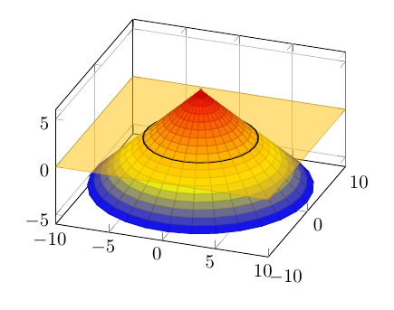
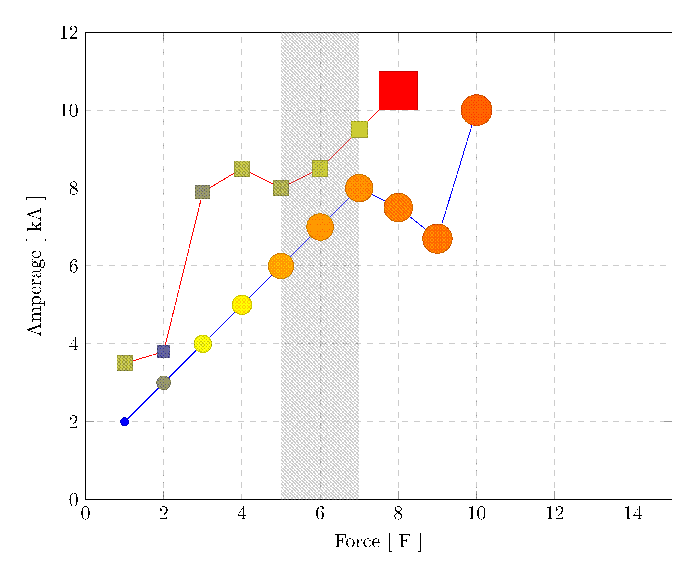
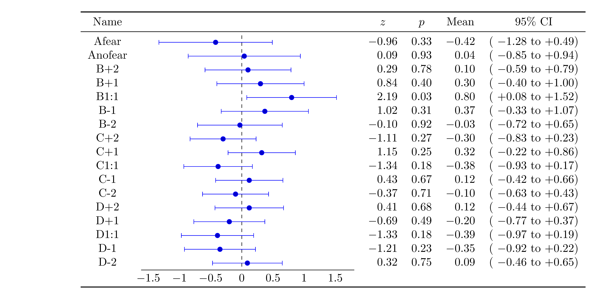
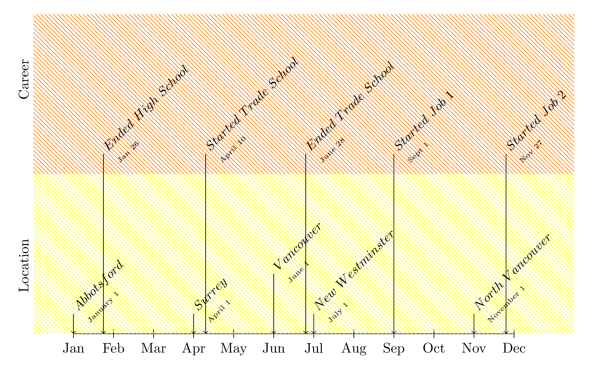

****



  * [3d-cone_intersection+3d+pgf.tex](https://github.com/walmes/Tikz/blob/master/src/3d-cone_intersection+3d+pgf.pgf)

`r a`
```{r}
# change pgf to tex
cat(readLines("./src/3d-cone_intersection+3d+pgf.tex"), sep = "\n")
```
`r b`
****


  * [3d-cube_color_rotated+3d+pgf+foreach+command+define.tex](https://github.com/walmes/Tikz/blob/master/src/3d-cube_color_rotated+3d+pgf+foreach+command+define.pgf)

`r a`
```{r}
# change pgf to tex
cat(readLines("./src/3d-cube_color_rotated+3d+pgf+foreach+command+define.tex"), sep = "\n")
```
`r b`
****


  * [3d-cubes_isometric_shaded+3d.tex](https://github.com/walmes/Tikz/blob/master/src/3d-cubes_isometric_shaded+3d.pgf)

`r a`
```{r}
# change pgf to tex
cat(readLines("./src/3d-cubes_isometric_shaded+3d.tex"), sep = "\n")
```
`r b`
****


  * [3d-cylinder-planes+3d.tex](https://github.com/walmes/Tikz/blob/master/src/3d-cylinder-planes+3d.pgf)

`r a`
```{r}
# change pgf to tex
cat(readLines("./src/3d-cylinder-planes+3d.tex"), sep = "\n")
```
`r b`
****


  * [3d-hypersurface-3.tex](https://github.com/walmes/Tikz/blob/master/src/3d-hypersurface-3.pgf)

`r a`
```{r}
# change pgf to tex
cat(readLines("./src/3d-hypersurface-3.tex"), sep = "\n")
```
`r b`
****


  * [3d-physics-jet-cones+3d+physics.tex](https://github.com/walmes/Tikz/blob/master/src/3d-physics-jet-cones+3d+physics.pgf)

`r a`
```{r}
# change pgf to tex
cat(readLines("./src/3d-physics-jet-cones+3d+physics.tex"), sep = "\n")
```
`r b`
****


  * [3d-seismic_focal_mechanism+3d+set+foreach+eng.tex](https://github.com/walmes/Tikz/blob/master/src/3d-seismic_focal_mechanism+3d+set+foreach+eng.pgf)

`r a`
```{r}
# change pgf to tex
cat(readLines("./src/3d-seismic_focal_mechanism+3d+set+foreach+eng.tex"), sep = "\n")
```
`r b`
****


  * [3d-solid-of-revolution.tex](https://github.com/walmes/Tikz/blob/master/src/3d-solid-of-revolution.pgf)

`r a`
```{r}
# change pgf to tex
cat(readLines("./src/3d-solid-of-revolution.tex"), sep = "\n")
```
`r b`
****


  * [3d-torus+function+3d.tex](https://github.com/walmes/Tikz/blob/master/src/3d-torus+function+3d.pgf)

`r a`
```{r}
# change pgf to tex
cat(readLines("./src/3d-torus+function+3d.tex"), sep = "\n")
```
`r b`
****


  * [animation-dynamic_labels.tex](https://github.com/walmes/Tikz/blob/master/src/animation-dynamic_labels.pgf)

`r a`
```{r}
# change pgf to tex
cat(readLines("./src/animation-dynamic_labels.tex"), sep = "\n")
```
`r b`
****


  * [box_arrows+diagram.tex](https://github.com/walmes/Tikz/blob/master/src/box_arrows+diagram.pgf)

`r a`
```{r}
# change pgf to tex
cat(readLines("./src/box_arrows+diagram.tex"), sep = "\n")
```
`r b`
****


  * [circle_custom_with_arcs+symbol+geometry.tex](https://github.com/walmes/Tikz/blob/master/src/circle_custom_with_arcs+symbol+geometry.pgf)

`r a`
```{r}
# change pgf to tex
cat(readLines("./src/circle_custom_with_arcs+symbol+geometry.tex"), sep = "\n")
```
`r b`
****


  * [class_diagram+diagram.tex](https://github.com/walmes/Tikz/blob/master/src/class_diagram+diagram.pgf)

`r a`
```{r}
# change pgf to tex
cat(readLines("./src/class_diagram+diagram.tex"), sep = "\n")
```
`r b`
****


  * [colorized_equation+equation.tex](https://github.com/walmes/Tikz/blob/master/src/colorized_equation+equation.pgf)

`r a`
```{r}
# change pgf to tex
cat(readLines("./src/colorized_equation+equation.tex"), sep = "\n")
```
`r b`
****


  * [cubes_factorials+physics+3d.tex](https://github.com/walmes/Tikz/blob/master/src/cubes_factorials+physics+3d.pgf)

`r a`
```{r}
# change pgf to tex
cat(readLines("./src/cubes_factorials+physics+3d.tex"), sep = "\n")
```
`r b`
****


  * [custom-use_library+symbol+pkg.tex](https://github.com/walmes/Tikz/blob/master/src/custom-use_library+symbol+pkg.pgf)

`r a`
```{r}
# change pgf to tex
cat(readLines("./src/custom-use_library+symbol+pkg.tex"), sep = "\n")
```
`r b`
****


  * [cylinder_with_two_parameters+geometry+style+learn.tex](https://github.com/walmes/Tikz/blob/master/src/cylinder_with_two_parameters+geometry+style+learn.pgf)

`r a`
```{r}
# change pgf to tex
cat(readLines("./src/cylinder_with_two_parameters+geometry+style+learn.tex"), sep = "\n")
```
`r b`
****


  * [drawstack+diagram.tex](https://github.com/walmes/Tikz/blob/master/src/drawstack+diagram.pgf)

`r a`
```{r}
# change pgf to tex
cat(readLines("./src/drawstack+diagram.tex"), sep = "\n")
```
`r b`
****


  * [elem-10_circles+elem+foreach.tex](https://github.com/walmes/Tikz/blob/master/src/elem-10_circles+elem+foreach.pgf)

`r a`
```{r}
# change pgf to tex
cat(readLines("./src/elem-10_circles+elem+foreach.tex"), sep = "\n")
```
`r b`
****


  * [elem-3_nodes_triangle+elem+foreach.tex](https://github.com/walmes/Tikz/blob/master/src/elem-3_nodes_triangle+elem+foreach.pgf)

`r a`
```{r}
# change pgf to tex
cat(readLines("./src/elem-3_nodes_triangle+elem+foreach.tex"), sep = "\n")
```
`r b`
****


  * [elem-add_tikz_symbols_to_block_arr+symbol+diagram+command+style.tex](https://github.com/walmes/Tikz/blob/master/src/elem-add_tikz_symbols_to_block_arr+symbol+diagram+command+style.pgf)

`r a`
```{r}
# change pgf to tex
cat(readLines("./src/elem-add_tikz_symbols_to_block_arr+symbol+diagram+command+style.tex"), sep = "\n")
```
`r b`
****


  * [elem-circle_axes_ticks+elem+geometry+foreach.tex](https://github.com/walmes/Tikz/blob/master/src/elem-circle_axes_ticks+elem+geometry+foreach.pgf)

`r a`
```{r}
# change pgf to tex
cat(readLines("./src/elem-circle_axes_ticks+elem+geometry+foreach.tex"), sep = "\n")
```
`r b`
****


  * [elem-circle_grided+elem+geometry.tex](https://github.com/walmes/Tikz/blob/master/src/elem-circle_grided+elem+geometry.pgf)

`r a`
```{r}
# change pgf to tex
cat(readLines("./src/elem-circle_grided+elem+geometry.tex"), sep = "\n")
```
`r b`
****


  * [elem-circle_half+elem+geometry.tex](https://github.com/walmes/Tikz/blob/master/src/elem-circle_half+elem+geometry.pgf)

`r a`
```{r}
# change pgf to tex
cat(readLines("./src/elem-circle_half+elem+geometry.tex"), sep = "\n")
```
`r b`
****


  * [elem-cube+elem+geometry+foreach.tex](https://github.com/walmes/Tikz/blob/master/src/elem-cube+elem+geometry+foreach.pgf)

`r a`
```{r}
# change pgf to tex
cat(readLines("./src/elem-cube+elem+geometry+foreach.tex"), sep = "\n")
```
`r b`
****


  * [elem-cuboid_finer_grid+elem+foreach+command.tex](https://github.com/walmes/Tikz/blob/master/src/elem-cuboid_finer_grid+elem+foreach+command.pgf)

`r a`
```{r}
# change pgf to tex
cat(readLines("./src/elem-cuboid_finer_grid+elem+foreach+command.tex"), sep = "\n")
```
`r b`
****


  * [elem-custom-three_objects+symbols+command.tex](https://github.com/walmes/Tikz/blob/master/src/elem-custom-three_objects+symbols+command.pgf)

`r a`
```{r}
# change pgf to tex
cat(readLines("./src/elem-custom-three_objects+symbols+command.tex"), sep = "\n")
```
`r b`
****


  * [elem-cylinder+elem+3d+foreach+function.tex](https://github.com/walmes/Tikz/blob/master/src/elem-cylinder+elem+3d+foreach+function.pgf)

`r a`
```{r}
# change pgf to tex
cat(readLines("./src/elem-cylinder+elem+3d+foreach+function.tex"), sep = "\n")
```
`r b`
****


  * [elem-draw_circles_through+elem+geometry.tex](https://github.com/walmes/Tikz/blob/master/src/elem-draw_circles_through+elem+geometry.pgf)

`r a`
```{r}
# change pgf to tex
cat(readLines("./src/elem-draw_circles_through+elem+geometry.tex"), sep = "\n")
```
`r b`
****


  * [elem-draw_ticks+elem+foreach.tex](https://github.com/walmes/Tikz/blob/master/src/elem-draw_ticks+elem+foreach.pgf)

`r a`
```{r}
# change pgf to tex
cat(readLines("./src/elem-draw_ticks+elem+foreach.tex"), sep = "\n")
```
`r b`
****


  * [elem-drawing_inside_box+elem+diagram+symbol.tex](https://github.com/walmes/Tikz/blob/master/src/elem-drawing_inside_box+elem+diagram+symbol.pgf)

`r a`
```{r}
# change pgf to tex
cat(readLines("./src/elem-drawing_inside_box+elem+diagram+symbol.tex"), sep = "\n")
```
`r b`
****


  * [elem-equation+elem+foreach.tex](https://github.com/walmes/Tikz/blob/master/src/elem-equation+elem+foreach.pgf)

`r a`
```{r}
# change pgf to tex
cat(readLines("./src/elem-equation+elem+foreach.tex"), sep = "\n")
```
`r b`
****


  * [elem-grid_RBG_draw_boxes+elem+foreach+style.tex](https://github.com/walmes/Tikz/blob/master/src/elem-grid_RBG_draw_boxes+elem+foreach+style.pgf)

`r a`
```{r}
# change pgf to tex
cat(readLines("./src/elem-grid_RBG_draw_boxes+elem+foreach+style.tex"), sep = "\n")
```
`r b`
****


  * [elem-grid_RBG_draw_lines+elem+3d+pgf+foreach.tex](https://github.com/walmes/Tikz/blob/master/src/elem-grid_RBG_draw_lines+elem+3d+pgf+foreach.pgf)

`r a`
```{r}
# change pgf to tex
cat(readLines("./src/elem-grid_RBG_draw_lines+elem+3d+pgf+foreach.tex"), sep = "\n")
```
`r b`
****


  * [elem-magnification+elem+geometry.tex](https://github.com/walmes/Tikz/blob/master/src/elem-magnification+elem+geometry.pgf)

`r a`
```{r}
# change pgf to tex
cat(readLines("./src/elem-magnification+elem+geometry.tex"), sep = "\n")
```
`r b`
****


  * [elem-matrix-as_nodes+elem+matrix.tex](https://github.com/walmes/Tikz/blob/master/src/elem-matrix-as_nodes+elem+matrix.pgf)

`r a`
```{r}
# change pgf to tex
cat(readLines("./src/elem-matrix-as_nodes+elem+matrix.tex"), sep = "\n")
```
`r b`
****


  * [elem-network-ex_doc_4-13+elem+network.tex](https://github.com/walmes/Tikz/blob/master/src/elem-network-ex_doc_4-13+elem+network.pgf)

`r a`
```{r}
# change pgf to tex
cat(readLines("./src/elem-network-ex_doc_4-13+elem+network.tex"), sep = "\n")
```
`r b`
****


  * [elem-node_connector+elem+diagram+command+params.tex](https://github.com/walmes/Tikz/blob/master/src/elem-node_connector+elem+diagram+command+params.pgf)

`r a`
```{r}
# change pgf to tex
cat(readLines("./src/elem-node_connector+elem+diagram+command+params.tex"), sep = "\n")
```
`r b`
****


  * [elem-physics-arrows_to_nodes+elem+phsyics.tex](https://github.com/walmes/Tikz/blob/master/src/elem-physics-arrows_to_nodes+elem+phsyics.pgf)

`r a`
```{r}
# change pgf to tex
cat(readLines("./src/elem-physics-arrows_to_nodes+elem+phsyics.tex"), sep = "\n")
```
`r b`
****


  * [elem-physics-example_atom+elem+physics.tex](https://github.com/walmes/Tikz/blob/master/src/elem-physics-example_atom+elem+physics.pgf)

`r a`
```{r}
# change pgf to tex
cat(readLines("./src/elem-physics-example_atom+elem+physics.tex"), sep = "\n")
```
`r b`
****


  * [elem-placing_labels_circle.tex](https://github.com/walmes/Tikz/blob/master/src/elem-placing_labels_circle.pgf)

`r a`
```{r}
# change pgf to tex
cat(readLines("./src/elem-placing_labels_circle.tex"), sep = "\n")
```
`r b`
****


  * [elem-placing_labels.tex](https://github.com/walmes/Tikz/blob/master/src/elem-placing_labels.pgf)

`r a`
```{r}
# change pgf to tex
cat(readLines("./src/elem-placing_labels.tex"), sep = "\n")
```
`r b`
****


  * [elem-simple_computations_pentagon+elem+style.tex](https://github.com/walmes/Tikz/blob/master/src/elem-simple_computations_pentagon+elem+style.pgf)

`r a`
```{r}
# change pgf to tex
cat(readLines("./src/elem-simple_computations_pentagon+elem+style.tex"), sep = "\n")
```
`r b`
****


  * [elem-stacked+elem+diagram.tex](https://github.com/walmes/Tikz/blob/master/src/elem-stacked+elem+diagram.pgf)

`r a`
```{r}
# change pgf to tex
cat(readLines("./src/elem-stacked+elem+diagram.tex"), sep = "\n")
```
`r b`
****


  * [elem-system_measurement_model+elem+diagram.tex](https://github.com/walmes/Tikz/blob/master/src/elem-system_measurement_model+elem+diagram.pgf)

`r a`
```{r}
# change pgf to tex
cat(readLines("./src/elem-system_measurement_model+elem+diagram.tex"), sep = "\n")
```
`r b`
****


  * [elem-text_boxes_helpme+elem+diagram+text.tex](https://github.com/walmes/Tikz/blob/master/src/elem-text_boxes_helpme+elem+diagram+text.pgf)

`r a`
```{r}
# change pgf to tex
cat(readLines("./src/elem-text_boxes_helpme+elem+diagram+text.tex"), sep = "\n")
```
`r b`
****


  * [elem-tikz-01+elem+geometry.tex](https://github.com/walmes/Tikz/blob/master/src/elem-tikz-01+elem+geometry.pgf)

`r a`
```{r}
# change pgf to tex
cat(readLines("./src/elem-tikz-01+elem+geometry.tex"), sep = "\n")
```
`r b`
****


  * [elem-tikz-02+elem+geometry.tex](https://github.com/walmes/Tikz/blob/master/src/elem-tikz-02+elem+geometry.pgf)

`r a`
```{r}
# change pgf to tex
cat(readLines("./src/elem-tikz-02+elem+geometry.tex"), sep = "\n")
```
`r b`
****


  * [elem-trapezium+elem+geometry.tex](https://github.com/walmes/Tikz/blob/master/src/elem-trapezium+elem+geometry.pgf)

`r a`
```{r}
# change pgf to tex
cat(readLines("./src/elem-trapezium+elem+geometry.tex"), sep = "\n")
```
`r b`
****


  * [flow-android_lifecycle+block+style+learn.tex](https://github.com/walmes/Tikz/blob/master/src/flow-android_lifecycle+block+style+learn.pgf)

`r a`
```{r}
# change pgf to tex
cat(readLines("./src/flow-android_lifecycle+block+style+learn.tex"), sep = "\n")
```
`r b`
****


  * [flow-direction_of_arrival+diagram+matrrix+table.tex](https://github.com/walmes/Tikz/blob/master/src/flow-direction_of_arrival+diagram+matrrix+table.pgf)

`r a`
```{r}
# change pgf to tex
cat(readLines("./src/flow-direction_of_arrival+diagram+matrrix+table.tex"), sep = "\n")
```
`r b`
****


  * [flow-easy_flowchart+diagram.tex](https://github.com/walmes/Tikz/blob/master/src/flow-easy_flowchart+diagram.pgf)

`r a`
```{r}
# change pgf to tex
cat(readLines("./src/flow-easy_flowchart+diagram.tex"), sep = "\n")
```
`r b`
****


  * [flow-flowchart_video+diagram+style.tex](https://github.com/walmes/Tikz/blob/master/src/flow-flowchart_video+diagram+style.pgf)

`r a`
```{r}
# change pgf to tex
cat(readLines("./src/flow-flowchart_video+diagram+style.tex"), sep = "\n")
```
`r b`
****


  * [flow-labs_class+diagram+style+pgf+command.tex](https://github.com/walmes/Tikz/blob/master/src/flow-labs_class+diagram+style+pgf+command.pgf)

`r a`
```{r}
# change pgf to tex
cat(readLines("./src/flow-labs_class+diagram+style+pgf+command.tex"), sep = "\n")
```
`r b`
****


  * [flow-report_diagrams+diagram+learn+style.tex](https://github.com/walmes/Tikz/blob/master/src/flow-report_diagrams+diagram+learn+style.pgf)

`r a`
```{r}
# change pgf to tex
cat(readLines("./src/flow-report_diagrams+diagram+learn+style.tex"), sep = "\n")
```
`r b`
****


  * [gears_simple+foreach.tex](https://github.com/walmes/Tikz/blob/master/src/gears_simple+foreach.pgf)

`r a`
```{r}
# change pgf to tex
cat(readLines("./src/gears_simple+foreach.tex"), sep = "\n")
```
`r b`
****


  * [gears+pgf+def.tex](https://github.com/walmes/Tikz/blob/master/src/gears+pgf+def.pgf)

`r a`
```{r}
# change pgf to tex
cat(readLines("./src/gears+pgf+def.tex"), sep = "\n")
```
`r b`
****


  * [geom-circle_bisectors_triangle+geometry.tex](https://github.com/walmes/Tikz/blob/master/src/geom-circle_bisectors_triangle+geometry.pgf)

`r a`
```{r}
# change pgf to tex
cat(readLines("./src/geom-circle_bisectors_triangle+geometry.tex"), sep = "\n")
```
`r b`
****


  * [geom-circle_coordinate_systems+geometry.tex](https://github.com/walmes/Tikz/blob/master/src/geom-circle_coordinate_systems+geometry.pgf)

`r a`
```{r}
# change pgf to tex
cat(readLines("./src/geom-circle_coordinate_systems+geometry.tex"), sep = "\n")
```
`r b`
****


  * [geom-ellipse_on_coords+geometry+pgf+def+script.tex](https://github.com/walmes/Tikz/blob/master/src/geom-ellipse_on_coords+geometry+pgf+def+script.pgf)

`r a`
```{r}
# change pgf to tex
cat(readLines("./src/geom-ellipse_on_coords+geometry+pgf+def+script.tex"), sep = "\n")
```
`r b`
****


  * [geom-euclides+geometry.tex](https://github.com/walmes/Tikz/blob/master/src/geom-euclides+geometry.pgf)

`r a`
```{r}
# change pgf to tex
cat(readLines("./src/geom-euclides+geometry.tex"), sep = "\n")
```
`r b`
****


  * [geom-hyperbola+geometry+physics.tex](https://github.com/walmes/Tikz/blob/master/src/geom-hyperbola+geometry+physics.pgf)

`r a`
```{r}
# change pgf to tex
cat(readLines("./src/geom-hyperbola+geometry+physics.tex"), sep = "\n")
```
`r b`
****


  * [geometric_representation+math+foreach+pgf+scope.tex](https://github.com/walmes/Tikz/blob/master/src/geometric_representation+math+foreach+pgf+scope.pgf)

`r a`
```{r}
# change pgf to tex
cat(readLines("./src/geometric_representation+math+foreach+pgf+scope.tex"), sep = "\n")
```
`r b`
****


  * [git_dataflow+diagram.tex](https://github.com/walmes/Tikz/blob/master/src/git_dataflow+diagram.pgf)

`r a`
```{r}
# change pgf to tex
cat(readLines("./src/git_dataflow+diagram.tex"), sep = "\n")
```
`r b`
****


  * [git_workflow+diagram.tex](https://github.com/walmes/Tikz/blob/master/src/git_workflow+diagram.pgf)

`r a`
```{r}
# change pgf to tex
cat(readLines("./src/git_workflow+diagram.tex"), sep = "\n")
```
`r b`
****


  * [grid_RBG+3d+foreach+learn.tex](https://github.com/walmes/Tikz/blob/master/src/grid_RBG+3d+foreach+learn.pgf)

`r a`
```{r}
# change pgf to tex
cat(readLines("./src/grid_RBG+3d+foreach+learn.tex"), sep = "\n")
```
`r b`
****


  * [impact-circular_arrows+diagram+foreach.tex](https://github.com/walmes/Tikz/blob/master/src/impact-circular_arrows+diagram+foreach.pgf)

`r a`
```{r}
# change pgf to tex
cat(readLines("./src/impact-circular_arrows+diagram+foreach.tex"), sep = "\n")
```
`r b`
****


  * [impact-concentric-blocks+diagram.tex](https://github.com/walmes/Tikz/blob/master/src/impact-concentric-blocks+diagram.pgf)

`r a`
```{r}
# change pgf to tex
cat(readLines("./src/impact-concentric-blocks+diagram.tex"), sep = "\n")
```
`r b`
****


  * [impact-market_sector+diagram.tex](https://github.com/walmes/Tikz/blob/master/src/impact-market_sector+diagram.pgf)

`r a`
```{r}
# change pgf to tex
cat(readLines("./src/impact-market_sector+diagram.tex"), sep = "\n")
```
`r b`
****


  * [impact-particles_table+physics.tex](https://github.com/walmes/Tikz/blob/master/src/impact-particles_table+physics.pgf)

`r a`
```{r}
# change pgf to tex
cat(readLines("./src/impact-particles_table+physics.tex"), sep = "\n")
```
`r b`
****


  * [impact-simulation_abstraction+physics.tex](https://github.com/walmes/Tikz/blob/master/src/impact-simulation_abstraction+physics.pgf)

`r a`
```{r}
# change pgf to tex
cat(readLines("./src/impact-simulation_abstraction+physics.tex"), sep = "\n")
```
`r b`
****


  * [impact-supreme_court-2+diagram.tex](https://github.com/walmes/Tikz/blob/master/src/impact-supreme_court-2+diagram.pgf)

`r a`
```{r}
# change pgf to tex
cat(readLines("./src/impact-supreme_court-2+diagram.tex"), sep = "\n")
```
`r b`
****


  * [impact-supreme_court+diagram.tex](https://github.com/walmes/Tikz/blob/master/src/impact-supreme_court+diagram.pgf)

`r a`
```{r}
# change pgf to tex
cat(readLines("./src/impact-supreme_court+diagram.tex"), sep = "\n")
```
`r b`
****


  * [impact-technologies_arrow+matrix+set+command+matrix.tex](https://github.com/walmes/Tikz/blob/master/src/impact-technologies_arrow+matrix+set+command+matrix.pgf)

`r a`
```{r}
# change pgf to tex
cat(readLines("./src/impact-technologies_arrow+matrix+set+command+matrix.tex"), sep = "\n")
```
`r b`
****


  * [impact-venn+diagram.tex](https://github.com/walmes/Tikz/blob/master/src/impact-venn+diagram.pgf)

`r a`
```{r}
# change pgf to tex
cat(readLines("./src/impact-venn+diagram.tex"), sep = "\n")
```
`r b`
****


  * [inertial_system_color+diagram+pgf+command+def+layer.tex](https://github.com/walmes/Tikz/blob/master/src/inertial_system_color+diagram+pgf+command+def+layer.pgf)

`r a`
```{r}
# change pgf to tex
cat(readLines("./src/inertial_system_color+diagram+pgf+command+def+layer.tex"), sep = "\n")
```
`r b`
****


  * [io-fit+diagram.tex](https://github.com/walmes/Tikz/blob/master/src/io-fit+diagram.pgf)

`r a`
```{r}
# change pgf to tex
cat(readLines("./src/io-fit+diagram.tex"), sep = "\n")
```
`r b`
****


  * [kalman+diagram+set.tex](https://github.com/walmes/Tikz/blob/master/src/kalman+diagram+set.pgf)

`r a`
```{r}
# change pgf to tex
cat(readLines("./src/kalman+diagram+set.tex"), sep = "\n")
```
`r b`
****


  * [louvre-planes.tex](https://github.com/walmes/Tikz/blob/master/src/louvre-planes.pgf)

`r a`
```{r}
# change pgf to tex
cat(readLines("./src/louvre-planes.tex"), sep = "\n")
```
`r b`
****


  * [mammography_bayes+diagram.tex](https://github.com/walmes/Tikz/blob/master/src/mammography_bayes+diagram.pgf)

`r a`
```{r}
# change pgf to tex
cat(readLines("./src/mammography_bayes+diagram.tex"), sep = "\n")
```
`r b`
****


  * [mapper-reducer.tex](https://github.com/walmes/Tikz/blob/master/src/mapper-reducer.pgf)

`r a`
```{r}
# change pgf to tex
cat(readLines("./src/mapper-reducer.tex"), sep = "\n")
```
`r b`
****


  * [matrix-highlighting.tex](https://github.com/walmes/Tikz/blob/master/src/matrix-highlighting.pgf)

`r a`
```{r}
# change pgf to tex
cat(readLines("./src/matrix-highlighting.tex"), sep = "\n")
```
`r b`
****


  * [matrix-product.tex](https://github.com/walmes/Tikz/blob/master/src/matrix-product.pgf)

`r a`
```{r}
# change pgf to tex
cat(readLines("./src/matrix-product.tex"), sep = "\n")
```
`r b`
****


  * [matrix-spreadsheet_formula+matrix+command.tex](https://github.com/walmes/Tikz/blob/master/src/matrix-spreadsheet_formula+matrix+command.pgf)

`r a`
```{r}
# change pgf to tex
cat(readLines("./src/matrix-spreadsheet_formula+matrix+command.tex"), sep = "\n")
```
`r b`
****


  * [mind_2nd_level_concentric+mindmap.tex](https://github.com/walmes/Tikz/blob/master/src/mind_2nd_level_concentric+mindmap.pgf)

`r a`
```{r}
# change pgf to tex
cat(readLines("./src/mind_2nd_level_concentric+mindmap.tex"), sep = "\n")
```
`r b`
****


  * [mind_2nd_level_reactangular_frame+mindmap.tex](https://github.com/walmes/Tikz/blob/master/src/mind_2nd_level_reactangular_frame+mindmap.pgf)

`r a`
```{r}
# change pgf to tex
cat(readLines("./src/mind_2nd_level_reactangular_frame+mindmap.tex"), sep = "\n")
```
`r b`
****


  * [mind_adjust_keys+mindmap.tex](https://github.com/walmes/Tikz/blob/master/src/mind_adjust_keys+mindmap.pgf)

`r a`
```{r}
# change pgf to tex
cat(readLines("./src/mind_adjust_keys+mindmap.tex"), sep = "\n")
```
`r b`
****


  * [mind_child_manipulation+mindmap.tex](https://github.com/walmes/Tikz/blob/master/src/mind_child_manipulation+mindmap.pgf)

`r a`
```{r}
# change pgf to tex
cat(readLines("./src/mind_child_manipulation+mindmap.tex"), sep = "\n")
```
`r b`
****


  * [mind_children_two+mindmap.tex](https://github.com/walmes/Tikz/blob/master/src/mind_children_two+mindmap.pgf)

`r a`
```{r}
# change pgf to tex
cat(readLines("./src/mind_children_two+mindmap.tex"), sep = "\n")
```
`r b`
****


  * [mind_circle_connection+mindmap.tex](https://github.com/walmes/Tikz/blob/master/src/mind_circle_connection+mindmap.pgf)

`r a`
```{r}
# change pgf to tex
cat(readLines("./src/mind_circle_connection+mindmap.tex"), sep = "\n")
```
`r b`
****


  * [mind_clip+mindmap.tex](https://github.com/walmes/Tikz/blob/master/src/mind_clip+mindmap.pgf)

`r a`
```{r}
# change pgf to tex
cat(readLines("./src/mind_clip+mindmap.tex"), sep = "\n")
```
`r b`
****


  * [mind_computer_science+mindmap.tex](https://github.com/walmes/Tikz/blob/master/src/mind_computer_science+mindmap.pgf)

`r a`
```{r}
# change pgf to tex
cat(readLines("./src/mind_computer_science+mindmap.tex"), sep = "\n")
```
`r b`
****


  * [mind_connecting_concepts+mindmap.tex](https://github.com/walmes/Tikz/blob/master/src/mind_connecting_concepts+mindmap.pgf)

`r a`
```{r}
# change pgf to tex
cat(readLines("./src/mind_connecting_concepts+mindmap.tex"), sep = "\n")
```
`r b`
****


  * [mind_fixed+mindmap.tex](https://github.com/walmes/Tikz/blob/master/src/mind_fixed+mindmap.pgf)

`r a`
```{r}
# change pgf to tex
cat(readLines("./src/mind_fixed+mindmap.tex"), sep = "\n")
```
`r b`
****


  * [mind_hyperlinks+mindmap.tex](https://github.com/walmes/Tikz/blob/master/src/mind_hyperlinks+mindmap.pgf)

`r a`
```{r}
# change pgf to tex
cat(readLines("./src/mind_hyperlinks+mindmap.tex"), sep = "\n")
```
`r b`
****


  * [mind_long_text_boxes-fixed+mindmap.tex](https://github.com/walmes/Tikz/blob/master/src/mind_long_text_boxes-fixed+mindmap.pgf)

`r a`
```{r}
# change pgf to tex
cat(readLines("./src/mind_long_text_boxes-fixed+mindmap.tex"), sep = "\n")
```
`r b`
****


  * [mind_optional_argument+mindmap.tex](https://github.com/walmes/Tikz/blob/master/src/mind_optional_argument+mindmap.pgf)

`r a`
```{r}
# change pgf to tex
cat(readLines("./src/mind_optional_argument+mindmap.tex"), sep = "\n")
```
`r b`
****


  * [mind_scientific_interactions+mindmap.tex](https://github.com/walmes/Tikz/blob/master/src/mind_scientific_interactions+mindmap.pgf)

`r a`
```{r}
# change pgf to tex
cat(readLines("./src/mind_scientific_interactions+mindmap.tex"), sep = "\n")
```
`r b`
****


  * [mind_shaded+mindmap.tex](https://github.com/walmes/Tikz/blob/master/src/mind_shaded+mindmap.pgf)

`r a`
```{r}
# change pgf to tex
cat(readLines("./src/mind_shaded+mindmap.tex"), sep = "\n")
```
`r b`
****


  * [mind_specific_distance+mindmap.tex](https://github.com/walmes/Tikz/blob/master/src/mind_specific_distance+mindmap.pgf)

`r a`
```{r}
# change pgf to tex
cat(readLines("./src/mind_specific_distance+mindmap.tex"), sep = "\n")
```
`r b`
****


  * [mind_thicker_connectors+mindmap.tex](https://github.com/walmes/Tikz/blob/master/src/mind_thicker_connectors+mindmap.pgf)

`r a`
```{r}
# change pgf to tex
cat(readLines("./src/mind_thicker_connectors+mindmap.tex"), sep = "\n")
```
`r b`
****


  * [mind_tutorials_videos+mindmap.tex](https://github.com/walmes/Tikz/blob/master/src/mind_tutorials_videos+mindmap.pgf)

`r a`
```{r}
# change pgf to tex
cat(readLines("./src/mind_tutorials_videos+mindmap.tex"), sep = "\n")
```
`r b`
****


  * [mind_two_connected_roots+mindmap.tex](https://github.com/walmes/Tikz/blob/master/src/mind_two_connected_roots+mindmap.pgf)

`r a`
```{r}
# change pgf to tex
cat(readLines("./src/mind_two_connected_roots+mindmap.tex"), sep = "\n")
```
`r b`
****


  * [multiline-flowchart.tex](https://github.com/walmes/Tikz/blob/master/src/multiline-flowchart.pgf)

`r a`
```{r}
# change pgf to tex
cat(readLines("./src/multiline-flowchart.tex"), sep = "\n")
```
`r b`
****


  * [multiple_block_connections-101+diagram.tex](https://github.com/walmes/Tikz/blob/master/src/multiple_block_connections-101+diagram.pgf)

`r a`
```{r}
# change pgf to tex
cat(readLines("./src/multiple_block_connections-101+diagram.tex"), sep = "\n")
```
`r b`
****


  * [multiple_blocks_interconnection+diagram.tex](https://github.com/walmes/Tikz/blob/master/src/multiple_blocks_interconnection+diagram.pgf)

`r a`
```{r}
# change pgf to tex
cat(readLines("./src/multiple_blocks_interconnection+diagram.tex"), sep = "\n")
```
`r b`
****


  * [nested+diagram.tex](https://github.com/walmes/Tikz/blob/master/src/nested+diagram.pgf)

`r a`
```{r}
# change pgf to tex
cat(readLines("./src/nested+diagram.tex"), sep = "\n")
```
`r b`
****


  * [network-complex-networks-only-layer1.tex](https://github.com/walmes/Tikz/blob/master/src/network-complex-networks-only-layer1.pgf)

`r a`
```{r}
# change pgf to tex
cat(readLines("./src/network-complex-networks-only-layer1.tex"), sep = "\n")
```
`r b`
****


  * [network-complex-networks.tex](https://github.com/walmes/Tikz/blob/master/src/network-complex-networks.pgf)

`r a`
```{r}
# change pgf to tex
cat(readLines("./src/network-complex-networks.tex"), sep = "\n")
```
`r b`
****


  * [network-layers-and-layouts.tex](https://github.com/walmes/Tikz/blob/master/src/network-layers-and-layouts.pgf)

`r a`
```{r}
# change pgf to tex
cat(readLines("./src/network-layers-and-layouts.tex"), sep = "\n")
```
`r b`
****


  * [network-multilayer.tex](https://github.com/walmes/Tikz/blob/master/src/network-multilayer.pgf)

`r a`
```{r}
# change pgf to tex
cat(readLines("./src/network-multilayer.tex"), sep = "\n")
```
`r b`
****


  * [network-read-csv.tex](https://github.com/walmes/Tikz/blob/master/src/network-read-csv.pgf)

`r a`
```{r}
# change pgf to tex
cat(readLines("./src/network-read-csv.tex"), sep = "\n")
```
`r b`
****


  * [nn-02_auto_net+neuralnet+foreach+pgf+style+learn.tex](https://github.com/walmes/Tikz/blob/master/src/nn-02_auto_net+neuralnet+foreach+pgf+style+learn.pgf)

`r a`
```{r}
# change pgf to tex
cat(readLines("./src/nn-02_auto_net+neuralnet+foreach+pgf+style+learn.tex"), sep = "\n")
```
`r b`
****


  * [nn-03_auto_net+neuralnet+foreach+style+learn.tex](https://github.com/walmes/Tikz/blob/master/src/nn-03_auto_net+neuralnet+foreach+style+learn.pgf)

`r a`
```{r}
# change pgf to tex
cat(readLines("./src/nn-03_auto_net+neuralnet+foreach+style+learn.tex"), sep = "\n")
```
`r b`
****


  * [nn-04_auto_net+neuralnet+matrix+style+foreach.tex](https://github.com/walmes/Tikz/blob/master/src/nn-04_auto_net+neuralnet+matrix+style+foreach.pgf)

`r a`
```{r}
# change pgf to tex
cat(readLines("./src/nn-04_auto_net+neuralnet+matrix+style+foreach.tex"), sep = "\n")
```
`r b`
****


  * [nn-05_auto_net_arr+neuralnet+style+foreach+learn.tex](https://github.com/walmes/Tikz/blob/master/src/nn-05_auto_net_arr+neuralnet+style+foreach+learn.pgf)

`r a`
```{r}
# change pgf to tex
cat(readLines("./src/nn-05_auto_net_arr+neuralnet+style+foreach+learn.tex"), sep = "\n")
```
`r b`
****


  * [nn-06_manual_net_color+neuralnet+foreach+style.tex](https://github.com/walmes/Tikz/blob/master/src/nn-06_manual_net_color+neuralnet+foreach+style.pgf)

`r a`
```{r}
# change pgf to tex
cat(readLines("./src/nn-06_manual_net_color+neuralnet+foreach+style.tex"), sep = "\n")
```
`r b`
****


  * [nn-08-tkz-berge-01+neuralnet+scope+foreach+pkg.tex](https://github.com/walmes/Tikz/blob/master/src/nn-08-tkz-berge-01+neuralnet+scope+foreach+pkg.pgf)

`r a`
```{r}
# change pgf to tex
cat(readLines("./src/nn-08-tkz-berge-01+neuralnet+scope+foreach+pkg.tex"), sep = "\n")
```
`r b`
****


  * [nn-09_manual_net+neuralnet+foreach+scope.tex](https://github.com/walmes/Tikz/blob/master/src/nn-09_manual_net+neuralnet+foreach+scope.pgf)

`r a`
```{r}
# change pgf to tex
cat(readLines("./src/nn-09_manual_net+neuralnet+foreach+scope.tex"), sep = "\n")
```
`r b`
****


  * [nn-1h_manual_net+neuralnet+style+matrix+foreach.tex](https://github.com/walmes/Tikz/blob/master/src/nn-1h_manual_net+neuralnet+style+matrix+foreach.pgf)

`r a`
```{r}
# change pgf to tex
cat(readLines("./src/nn-1h_manual_net+neuralnet+style+matrix+foreach.tex"), sep = "\n")
```
`r b`
****


  * [nn-2_summarized+neuralnet+style+learn.tex](https://github.com/walmes/Tikz/blob/master/src/nn-2_summarized+neuralnet+style+learn.pgf)

`r a`
```{r}
# change pgf to tex
cat(readLines("./src/nn-2_summarized+neuralnet+style+learn.tex"), sep = "\n")
```
`r b`
****


  * [nn-2h_manual_net-color+neuralnet+set+foreach.tex](https://github.com/walmes/Tikz/blob/master/src/nn-2h_manual_net-color+neuralnet+set+foreach.pgf)

`r a`
```{r}
# change pgf to tex
cat(readLines("./src/nn-2h_manual_net-color+neuralnet+set+foreach.tex"), sep = "\n")
```
`r b`
****


  * [nn-a3c_manual_net_arr+neuralnet.tex](https://github.com/walmes/Tikz/blob/master/src/nn-a3c_manual_net_arr+neuralnet.pgf)

`r a`
```{r}
# change pgf to tex
cat(readLines("./src/nn-a3c_manual_net_arr+neuralnet.tex"), sep = "\n")
```
`r b`
****


  * [nn-auto_net_4h_arr+neuralnet+matrix+foreach+style+scope.tex](https://github.com/walmes/Tikz/blob/master/src/nn-auto_net_4h_arr+neuralnet+matrix+foreach+style+scope.pgf)

`r a`
```{r}
# change pgf to tex
cat(readLines("./src/nn-auto_net_4h_arr+neuralnet+matrix+foreach+style+scope.tex"), sep = "\n")
```
`r b`
****


  * [nn-auto_net_arr+neuralnet+foreach+style+foreach.tex](https://github.com/walmes/Tikz/blob/master/src/nn-auto_net_arr+neuralnet+foreach+style+foreach.pgf)

`r a`
```{r}
# change pgf to tex
cat(readLines("./src/nn-auto_net_arr+neuralnet+foreach+style+foreach.tex"), sep = "\n")
```
`r b`
****


  * [nn-auto_net_bias_arr+neuralnet+learn+foreach+def+command+ifnum+style.tex](https://github.com/walmes/Tikz/blob/master/src/nn-auto_net_bias_arr+neuralnet+learn+foreach+def+command+ifnum+style.pgf)

`r a`
```{r}
# change pgf to tex
cat(readLines("./src/nn-auto_net_bias_arr+neuralnet+learn+foreach+def+command+ifnum+style.tex"), sep = "\n")
```
`r b`
****


  * [nn-auto_net_color+neuralnet+foreach.tex](https://github.com/walmes/Tikz/blob/master/src/nn-auto_net_color+neuralnet+foreach.pgf)

`r a`
```{r}
# change pgf to tex
cat(readLines("./src/nn-auto_net_color+neuralnet+foreach.tex"), sep = "\n")
```
`r b`
****


  * [nn-auto_net_icon+neuralnet+style+foreach+set+function+learn.tex](https://github.com/walmes/Tikz/blob/master/src/nn-auto_net_icon+neuralnet+style+foreach+set+function+learn.pgf)

`r a`
```{r}
# change pgf to tex
cat(readLines("./src/nn-auto_net_icon+neuralnet+style+foreach+set+function+learn.tex"), sep = "\n")
```
`r b`
****


  * [nn-block_diagram-multilayer_perceptron+neuralnet+style+learn.tex](https://github.com/walmes/Tikz/blob/master/src/nn-block_diagram-multilayer_perceptron+neuralnet+style+learn.pgf)

`r a`
```{r}
# change pgf to tex
cat(readLines("./src/nn-block_diagram-multilayer_perceptron+neuralnet+style+learn.tex"), sep = "\n")
```
`r b`
****


  * [nn-block_diagram-perceptron+neuralnet+set+learn.tex](https://github.com/walmes/Tikz/blob/master/src/nn-block_diagram-perceptron+neuralnet+set+learn.pgf)

`r a`
```{r}
# change pgf to tex
cat(readLines("./src/nn-block_diagram-perceptron+neuralnet+set+learn.tex"), sep = "\n")
```
`r b`
****


  * [nn-discriminator+neuralnet+matrix+foreach+style.tex](https://github.com/walmes/Tikz/blob/master/src/nn-discriminator+neuralnet+matrix+foreach+style.pgf)

`r a`
```{r}
# change pgf to tex
cat(readLines("./src/nn-discriminator+neuralnet+matrix+foreach+style.tex"), sep = "\n")
```
`r b`
****


  * [nn-gan_complete+neuralnet.tex](https://github.com/walmes/Tikz/blob/master/src/nn-gan_complete+neuralnet.pgf)

`r a`
```{r}
# change pgf to tex
cat(readLines("./src/nn-gan_complete+neuralnet.tex"), sep = "\n")
```
`r b`
****


  * [nn-gan_parts+neuralnet.tex](https://github.com/walmes/Tikz/blob/master/src/nn-gan_parts+neuralnet.pgf)

`r a`
```{r}
# change pgf to tex
cat(readLines("./src/nn-gan_parts+neuralnet.tex"), sep = "\n")
```
`r b`
****


  * [nn-gan_two_gan_types+neuralnet.tex](https://github.com/walmes/Tikz/blob/master/src/nn-gan_two_gan_types+neuralnet.pgf)

`r a`
```{r}
# change pgf to tex
cat(readLines("./src/nn-gan_two_gan_types+neuralnet.tex"), sep = "\n")
```
`r b`
****


  * [nn-gan_vertical+neuralnet.tex](https://github.com/walmes/Tikz/blob/master/src/nn-gan_vertical+neuralnet.pgf)

`r a`
```{r}
# change pgf to tex
cat(readLines("./src/nn-gan_vertical+neuralnet.tex"), sep = "\n")
```
`r b`
****


  * [nn-generative_adversarial_network_manual_net+neuralnet.tex](https://github.com/walmes/Tikz/blob/master/src/nn-generative_adversarial_network_manual_net+neuralnet.pgf)

`r a`
```{r}
# change pgf to tex
cat(readLines("./src/nn-generative_adversarial_network_manual_net+neuralnet.tex"), sep = "\n")
```
`r b`
****


  * [nn-generator+neuralnet+matrix.tex](https://github.com/walmes/Tikz/blob/master/src/nn-generator+neuralnet+matrix.pgf)

`r a`
```{r}
# change pgf to tex
cat(readLines("./src/nn-generator+neuralnet+matrix.tex"), sep = "\n")
```
`r b`
****


  * [nn-hopfield_auto_net+neuralnet+foreach+scope+learn+style+command.tex](https://github.com/walmes/Tikz/blob/master/src/nn-hopfield_auto_net+neuralnet+foreach+scope+learn+style+command.pgf)

`r a`
```{r}
# change pgf to tex
cat(readLines("./src/nn-hopfield_auto_net+neuralnet+foreach+scope+learn+style+command.tex"), sep = "\n")
```
`r b`
****


  * [nn-neural_network-1h+neuralnet+foreach.tex](https://github.com/walmes/Tikz/blob/master/src/nn-neural_network-1h+neuralnet+foreach.pgf)

`r a`
```{r}
# change pgf to tex
cat(readLines("./src/nn-neural_network-1h+neuralnet+foreach.tex"), sep = "\n")
```
`r b`
****


  * [nn-stacked_blocks+neuralnet+3d+def+pgf+set+style.tex](https://github.com/walmes/Tikz/blob/master/src/nn-stacked_blocks+neuralnet+3d+def+pgf+set+style.pgf)

`r a`
```{r}
# change pgf to tex
cat(readLines("./src/nn-stacked_blocks+neuralnet+3d+def+pgf+set+style.tex"), sep = "\n")
```
`r b`
****


  * [nn-SVM_manual+neuralnet.tex](https://github.com/walmes/Tikz/blob/master/src/nn-SVM_manual+neuralnet.pgf)

`r a`
```{r}
# change pgf to tex
cat(readLines("./src/nn-SVM_manual+neuralnet.tex"), sep = "\n")
```
`r b`
****


  * [noise+diagram.tex](https://github.com/walmes/Tikz/blob/master/src/noise+diagram.pgf)

`r a`
```{r}
# change pgf to tex
cat(readLines("./src/noise+diagram.tex"), sep = "\n")
```
`r b`
****


  * [paper_folding+misc+foreach.tex](https://github.com/walmes/Tikz/blob/master/src/paper_folding+misc+foreach.pgf)

`r a`
```{r}
# change pgf to tex
cat(readLines("./src/paper_folding+misc+foreach.tex"), sep = "\n")
```
`r b`
****


  * [physics-diagram-handshake.tex](https://github.com/walmes/Tikz/blob/master/src/physics-diagram-handshake.pgf)

`r a`
```{r}
# change pgf to tex
cat(readLines("./src/physics-diagram-handshake.tex"), sep = "\n")
```
`r b`
****


  * [physics-solenoid.tex](https://github.com/walmes/Tikz/blob/master/src/physics-solenoid.pgf)

`r a`
```{r}
# change pgf to tex
cat(readLines("./src/physics-solenoid.tex"), sep = "\n")
```
`r b`
****


  * [physics-tau_decay_signatures+physics.tex](https://github.com/walmes/Tikz/blob/master/src/physics-tau_decay_signatures+physics.pgf)

`r a`
```{r}
# change pgf to tex
cat(readLines("./src/physics-tau_decay_signatures+physics.tex"), sep = "\n")
```
`r b`
****


  * [pirates-games.tex](https://github.com/walmes/Tikz/blob/master/src/pirates-games.pgf)

`r a`
```{r}
# change pgf to tex
cat(readLines("./src/pirates-games.tex"), sep = "\n")
```
`r b`
****


  * [planes_multiple_ocean+projection+style+scope+slant.tex](https://github.com/walmes/Tikz/blob/master/src/planes_multiple_ocean+projection+style+scope+slant.pgf)

`r a`
```{r}
# change pgf to tex
cat(readLines("./src/planes_multiple_ocean+projection+style+scope+slant.tex"), sep = "\n")
```
`r b`
****


  * [planes-multidimensional-array-inclined.tex](https://github.com/walmes/Tikz/blob/master/src/planes-multidimensional-array-inclined.pgf)

`r a`
```{r}
# change pgf to tex
cat(readLines("./src/planes-multidimensional-array-inclined.tex"), sep = "\n")
```
`r b`
****


  * [planes-multidimensional-array.tex](https://github.com/walmes/Tikz/blob/master/src/planes-multidimensional-array.pgf)

`r a`
```{r}
# change pgf to tex
cat(readLines("./src/planes-multidimensional-array.tex"), sep = "\n")
```
`r b`
****


  * [planes-polarization+3d+foreach.tex](https://github.com/walmes/Tikz/blob/master/src/planes-polarization+3d+foreach.pgf)

`r a`
```{r}
# change pgf to tex
cat(readLines("./src/planes-polarization+3d+foreach.tex"), sep = "\n")
```
`r b`
****


  * [plot-curves-frequency_modulation+physics.tex](https://github.com/walmes/Tikz/blob/master/src/plot-curves-frequency_modulation+physics.pgf)

`r a`
```{r}
# change pgf to tex
cat(readLines("./src/plot-curves-frequency_modulation+physics.tex"), sep = "\n")
```
`r b`
****


  * [plot-curves-is_lm+plot+command.tex](https://github.com/walmes/Tikz/blob/master/src/plot-curves-is_lm+plot+command.pgf)

`r a`
```{r}
# change pgf to tex
cat(readLines("./src/plot-curves-is_lm+plot+command.tex"), sep = "\n")
```
`r b`
****



  * [plot-curves-read_data+fileio+plot+pgf.tex](https://github.com/walmes/Tikz/blob/master/src/plot-curves-read_data+fileio+plot+pgf.pgf)

`r a`
```{r}
# change pgf to tex
cat(readLines("./src/plot-curves-read_data+fileio+plot+pgf.tex"), sep = "\n")
```
`r b`
****


  * [plot-derivatives+plot.tex](https://github.com/walmes/Tikz/blob/master/src/plot-derivatives+plot.pgf)

`r a`
```{r}
# change pgf to tex
cat(readLines("./src/plot-derivatives+plot.tex"), sep = "\n")
```
`r b`
****


  * [plot-electromagnetic_wave+physics.tex](https://github.com/walmes/Tikz/blob/master/src/plot-electromagnetic_wave+physics.pgf)

`r a`
```{r}
# change pgf to tex
cat(readLines("./src/plot-electromagnetic_wave+physics.tex"), sep = "\n")
```
`r b`
****


  * [plot-filled_curve+geometry.tex](https://github.com/walmes/Tikz/blob/master/src/plot-filled_curve+geometry.pgf)

`r a`
```{r}
# change pgf to tex
cat(readLines("./src/plot-filled_curve+geometry.tex"), sep = "\n")
```
`r b`
****


  * [plot-intersections+geometry.tex](https://github.com/walmes/Tikz/blob/master/src/plot-intersections+geometry.pgf)

`r a`
```{r}
# change pgf to tex
cat(readLines("./src/plot-intersections+geometry.tex"), sep = "\n")
```
`r b`
****


  * [plot-linear-regression+geometry.tex](https://github.com/walmes/Tikz/blob/master/src/plot-linear-regression+geometry.pgf)

`r a`
```{r}
# change pgf to tex
cat(readLines("./src/plot-linear-regression+geometry.tex"), sep = "\n")
```
`r b`
****


  * [plot-mesh+3d+pgf+function.tex](https://github.com/walmes/Tikz/blob/master/src/plot-mesh+3d+pgf+function.pgf)

`r a`
```{r}
# change pgf to tex
cat(readLines("./src/plot-mesh+3d+pgf+function.tex"), sep = "\n")
```
`r b`
****


  * [plot-physics-functions.tex](https://github.com/walmes/Tikz/blob/master/src/plot-physics-functions.pgf)

`r a`
```{r}
# change pgf to tex
cat(readLines("./src/plot-physics-functions.tex"), sep = "\n")
```
`r b`
****


  * [plot-regression+geometry.tex](https://github.com/walmes/Tikz/blob/master/src/plot-regression+geometry.pgf)

`r a`
```{r}
# change pgf to tex
cat(readLines("./src/plot-regression+geometry.tex"), sep = "\n")
```
`r b`
****


  * [plot-shading_regions+geometry+pgf+command+def.tex](https://github.com/walmes/Tikz/blob/master/src/plot-shading_regions+geometry+pgf+command+def.pgf)

`r a`
```{r}
# change pgf to tex
cat(readLines("./src/plot-shading_regions+geometry+pgf+command+def.tex"), sep = "\n")
```
`r b`
****


  * [plot-spherical_coords+physics+3d.tex](https://github.com/walmes/Tikz/blob/master/src/plot-spherical_coords+physics+3d.pgf)

`r a`
```{r}
# change pgf to tex
cat(readLines("./src/plot-spherical_coords+physics+3d.tex"), sep = "\n")
```
`r b`
****


  * [plot-two_plots_same_axis+fileio+pgf.tex](https://github.com/walmes/Tikz/blob/master/src/plot-two_plots_same_axis+fileio+pgf.pgf)

`r a`
```{r}
# change pgf to tex
cat(readLines("./src/plot-two_plots_same_axis+fileio+pgf.tex"), sep = "\n")
```
`r b`
****


  * [poincare+physics+diagram+foreach+set+command.tex](https://github.com/walmes/Tikz/blob/master/src/poincare+physics+diagram+foreach+set+command.pgf)

`r a`
```{r}
# change pgf to tex
cat(readLines("./src/poincare+physics+diagram+foreach+set+command.tex"), sep = "\n")
```
`r b`
****


  * [porter_model+diagram.tex](https://github.com/walmes/Tikz/blob/master/src/porter_model+diagram.pgf)

`r a`
```{r}
# change pgf to tex
cat(readLines("./src/porter_model+diagram.tex"), sep = "\n")
```
`r b`
****


  * [positioning_blocks+diagram+foreach+scope+set+frame.tex](https://github.com/walmes/Tikz/blob/master/src/positioning_blocks+diagram+foreach+scope+set+frame.pgf)

`r a`
```{r}
# change pgf to tex
cat(readLines("./src/positioning_blocks+diagram+foreach+scope+set+frame.tex"), sep = "\n")
```
`r b`
****


  * [radix_signal_flow+math+diagram+foreach+style+counter.tex](https://github.com/walmes/Tikz/blob/master/src/radix_signal_flow+math+diagram+foreach+style+counter.pgf)

`r a`
```{r}
# change pgf to tex
cat(readLines("./src/radix_signal_flow+math+diagram+foreach+style+counter.tex"), sep = "\n")
```
`r b`
****


  * [scenario_tree+diagram.tex](https://github.com/walmes/Tikz/blob/master/src/scenario_tree+diagram.pgf)

`r a`
```{r}
# change pgf to tex
cat(readLines("./src/scenario_tree+diagram.tex"), sep = "\n")
```
`r b`
****


  * [server_player+diagram.tex](https://github.com/walmes/Tikz/blob/master/src/server_player+diagram.pgf)

`r a`
```{r}
# change pgf to tex
cat(readLines("./src/server_player+diagram.tex"), sep = "\n")
```
`r b`
****


  * [simple-right+diagram.tex](https://github.com/walmes/Tikz/blob/master/src/simple-right+diagram.pgf)

`r a`
```{r}
# change pgf to tex
cat(readLines("./src/simple-right+diagram.tex"), sep = "\n")
```
`r b`
****


  * [simple-wrong+diagram.tex](https://github.com/walmes/Tikz/blob/master/src/simple-wrong+diagram.pgf)

`r a`
```{r}
# change pgf to tex
cat(readLines("./src/simple-wrong+diagram.tex"), sep = "\n")
```
`r b`
****


  * [steps+diagram.tex](https://github.com/walmes/Tikz/blob/master/src/steps+diagram.pgf)

`r a`
```{r}
# change pgf to tex
cat(readLines("./src/steps+diagram.tex"), sep = "\n")
```
`r b`
****



  * [table-read_data+fileio+pgf+table.tex](https://github.com/walmes/Tikz/blob/master/src/table-read_data+fileio+pgf+table.pgf)

`r a`
```{r}
# change pgf to tex
cat(readLines("./src/table-read_data+fileio+pgf+table.tex"), sep = "\n")
```
`r b`
****


  * [time-1990-2010-arr+timeline+foreach+learn.tex](https://github.com/walmes/Tikz/blob/master/src/time-1990-2010-arr+timeline+foreach+learn.pgf)

`r a`
```{r}
# change pgf to tex
cat(readLines("./src/time-1990-2010-arr+timeline+foreach+learn.tex"), sep = "\n")
```
`r b`
****


  * [time-added-dots+timeline+style+text.tex](https://github.com/walmes/Tikz/blob/master/src/time-added-dots+timeline+style+text.pgf)

`r a`
```{r}
# change pgf to tex
cat(readLines("./src/time-added-dots+timeline+style+text.tex"), sep = "\n")
```
`r b`
****


  * [time-angling-text-1+timeline+foreach+learn.tex](https://github.com/walmes/Tikz/blob/master/src/time-angling-text-1+timeline+foreach+learn.pgf)

`r a`
```{r}
# change pgf to tex
cat(readLines("./src/time-angling-text-1+timeline+foreach+learn.tex"), sep = "\n")
```
`r b`
****


  * [time-angling-text-2+timeline+foreach+learn.tex](https://github.com/walmes/Tikz/blob/master/src/time-angling-text-2+timeline+foreach+learn.pgf)

`r a`
```{r}
# change pgf to tex
cat(readLines("./src/time-angling-text-2+timeline+foreach+learn.tex"), sep = "\n")
```
`r b`
****


  * [time-angling-text-3+timeline+foreach+learn.tex](https://github.com/walmes/Tikz/blob/master/src/time-angling-text-3+timeline+foreach+learn.pgf)

`r a`
```{r}
# change pgf to tex
cat(readLines("./src/time-angling-text-3+timeline+foreach+learn.tex"), sep = "\n")
```
`r b`
****


  * [time-annuity+timeline+foreach+learn.tex](https://github.com/walmes/Tikz/blob/master/src/time-annuity+timeline+foreach+learn.pgf)

`r a`
```{r}
# change pgf to tex
cat(readLines("./src/time-annuity+timeline+foreach+learn.tex"), sep = "\n")
```
`r b`
****


  * [time-arrows_to_nodes-arr+timeline+tree+scope+learn.tex](https://github.com/walmes/Tikz/blob/master/src/time-arrows_to_nodes-arr+timeline+tree+scope+learn.pgf)

`r a`
```{r}
# change pgf to tex
cat(readLines("./src/time-arrows_to_nodes-arr+timeline+tree+scope+learn.tex"), sep = "\n")
```
`r b`
****


  * [time-arrows-circles+timeline+pgf+set.tex](https://github.com/walmes/Tikz/blob/master/src/time-arrows-circles+timeline+pgf+set.pgf)

`r a`
```{r}
# change pgf to tex
cat(readLines("./src/time-arrows-circles+timeline+pgf+set.tex"), sep = "\n")
```
`r b`
****


  * [time-arrows-on-periods+timeline+foreach+style+learn.tex](https://github.com/walmes/Tikz/blob/master/src/time-arrows-on-periods+timeline+foreach+style+learn.pgf)

`r a`
```{r}
# change pgf to tex
cat(readLines("./src/time-arrows-on-periods+timeline+foreach+style+learn.tex"), sep = "\n")
```
`r b`
****


  * [time-auto_time_scale+timeline+foreach+pgf.tex](https://github.com/walmes/Tikz/blob/master/src/time-auto_time_scale+timeline+foreach+pgf.pgf)

`r a`
```{r}
# change pgf to tex
cat(readLines("./src/time-auto_time_scale+timeline+foreach+pgf.tex"), sep = "\n")
```
`r b`
****


  * [time-biographical-cornerstones-arr+timeline+style+learn+text.tex](https://github.com/walmes/Tikz/blob/master/src/time-biographical-cornerstones-arr+timeline+style+learn+text.pgf)

`r a`
```{r}
# change pgf to tex
cat(readLines("./src/time-biographical-cornerstones-arr+timeline+style+learn+text.tex"), sep = "\n")
```
`r b`
****


  * [time-brace-and-dots-arr+timeline+style+text.tex](https://github.com/walmes/Tikz/blob/master/src/time-brace-and-dots-arr+timeline+style+text.pgf)

`r a`
```{r}
# change pgf to tex
cat(readLines("./src/time-brace-and-dots-arr+timeline+style+text.tex"), sep = "\n")
```
`r b`
****


  * [time-bracketed-intervals+timeline+decoration.tex](https://github.com/walmes/Tikz/blob/master/src/time-bracketed-intervals+timeline+decoration.pgf)

`r a`
```{r}
# change pgf to tex
cat(readLines("./src/time-bracketed-intervals+timeline+decoration.tex"), sep = "\n")
```
`r b`
****


  * [time-chronology-break-arr+timeline+text+advanced.tex](https://github.com/walmes/Tikz/blob/master/src/time-chronology-break-arr+timeline+text+advanced.pgf)

`r a`
```{r}
# change pgf to tex
cat(readLines("./src/time-chronology-break-arr+timeline+text+advanced.tex"), sep = "\n")
```
`r b`
****


  * [time-colored_custom_draw+timeline+text+pgf.tex](https://github.com/walmes/Tikz/blob/master/src/time-colored_custom_draw+timeline+text+pgf.pgf)

`r a`
```{r}
# change pgf to tex
cat(readLines("./src/time-colored_custom_draw+timeline+text+pgf.tex"), sep = "\n")
```
`r b`
****


  * [time-colored-periods+timeline+set+command+environment+text.tex](https://github.com/walmes/Tikz/blob/master/src/time-colored-periods+timeline+set+command+environment+text.pgf)

`r a`
```{r}
# change pgf to tex
cat(readLines("./src/time-colored-periods+timeline+set+command+environment+text.tex"), sep = "\n")
```
`r b`
****


  * [time-days-hours-minutes+timeline+foreach+set+multi.tex](https://github.com/walmes/Tikz/blob/master/src/time-days-hours-minutes+timeline+foreach+set+multi.pgf)

`r a`
```{r}
# change pgf to tex
cat(readLines("./src/time-days-hours-minutes+timeline+foreach+set+multi.tex"), sep = "\n")
```
`r b`
****


  * [time-estimated-window+timeline+decoration+text.tex](https://github.com/walmes/Tikz/blob/master/src/time-estimated-window+timeline+decoration+text.pgf)

`r a`
```{r}
# change pgf to tex
cat(readLines("./src/time-estimated-window+timeline+decoration+text.tex"), sep = "\n")
```
`r b`
****


  * [time-events-and-periods+timeline+set+command+pgf+scope.tex](https://github.com/walmes/Tikz/blob/master/src/time-events-and-periods+timeline+set+command+pgf+scope.pgf)

`r a`
```{r}
# change pgf to tex
cat(readLines("./src/time-events-and-periods+timeline+set+command+pgf+scope.tex"), sep = "\n")
```
`r b`
****


  * [time-long-labels-enumitem+timeline+text+style+foreach.tex](https://github.com/walmes/Tikz/blob/master/src/time-long-labels-enumitem+timeline+text+style+foreach.pgf)

`r a`
```{r}
# change pgf to tex
cat(readLines("./src/time-long-labels-enumitem+timeline+text+style+foreach.tex"), sep = "\n")
```
`r b`
****


  * [time-long-labels+timeline+text+learn.tex](https://github.com/walmes/Tikz/blob/master/src/time-long-labels+timeline+text+learn.pgf)

`r a`
```{r}
# change pgf to tex
cat(readLines("./src/time-long-labels+timeline+text+learn.tex"), sep = "\n")
```
`r b`
****


  * [time-long-text+timeline+text+foreach.tex](https://github.com/walmes/Tikz/blob/master/src/time-long-text+timeline+text+foreach.pgf)

`r a`
```{r}
# change pgf to tex
cat(readLines("./src/time-long-text+timeline+text+foreach.tex"), sep = "\n")
```
`r b`
****


  * [time-multiple-lines+timeline+set+pgf+foreach+command+scope+text.tex](https://github.com/walmes/Tikz/blob/master/src/time-multiple-lines+timeline+set+pgf+foreach+command+scope+text.pgf)

`r a`
```{r}
# change pgf to tex
cat(readLines("./src/time-multiple-lines+timeline+set+pgf+foreach+command+scope+text.tex"), sep = "\n")
```
`r b`
****



  * [time-read-data+timeline+fileio+pgf+foreach+text.tex](https://github.com/walmes/Tikz/blob/master/src/time-read-data+timeline+fileio+pgf+foreach+text.pgf)

`r a`
```{r}
# change pgf to tex
cat(readLines("./src/time-read-data+timeline+fileio+pgf+foreach+text.tex"), sep = "\n")
```
`r b`
****


  * [time-rotated-labels+timeline+foreach+text+set+learn.tex](https://github.com/walmes/Tikz/blob/master/src/time-rotated-labels+timeline+foreach+text+set+learn.pgf)

`r a`
```{r}
# change pgf to tex
cat(readLines("./src/time-rotated-labels+timeline+foreach+text+set+learn.tex"), sep = "\n")
```
`r b`
****


  * [time-rounded-box-arr+timeline+pgf+style+foreach+learn.tex](https://github.com/walmes/Tikz/blob/master/src/time-rounded-box-arr+timeline+pgf+style+foreach+learn.pgf)

`r a`
```{r}
# change pgf to tex
cat(readLines("./src/time-rounded-box-arr+timeline+pgf+style+foreach+learn.tex"), sep = "\n")
```
`r b`
****


  * [time-simple_project+timeline+text+foreach+learn.tex](https://github.com/walmes/Tikz/blob/master/src/time-simple_project+timeline+text+foreach+learn.pgf)

`r a`
```{r}
# change pgf to tex
cat(readLines("./src/time-simple_project+timeline+text+foreach+learn.tex"), sep = "\n")
```
`r b`
****


  * [time-simple+timeline+foreach+snake+decoration+learn.tex](https://github.com/walmes/Tikz/blob/master/src/time-simple+timeline+foreach+snake+decoration+learn.pgf)

`r a`
```{r}
# change pgf to tex
cat(readLines("./src/time-simple+timeline+foreach+snake+decoration+learn.tex"), sep = "\n")
```
`r b`
****


  * [time-snake_frames_and_arrows+timeline+figure+foreach.tex](https://github.com/walmes/Tikz/blob/master/src/time-snake_frames_and_arrows+timeline+figure+foreach.pgf)

`r a`
```{r}
# change pgf to tex
cat(readLines("./src/time-snake_frames_and_arrows+timeline+figure+foreach.tex"), sep = "\n")
```
`r b`
****


  * [time-snake_timescale+physics+timeline+def+foreach+multi+learn.tex](https://github.com/walmes/Tikz/blob/master/src/time-snake_timescale+physics+timeline+def+foreach+multi+learn.pgf)

`r a`
```{r}
# change pgf to tex
cat(readLines("./src/time-snake_timescale+physics+timeline+def+foreach+multi+learn.tex"), sep = "\n")
```
`r b`
****


  * [time-t-delta-t+timeline+text+decoration.tex](https://github.com/walmes/Tikz/blob/master/src/time-t-delta-t+timeline+text+decoration.pgf)

`r a`
```{r}
# change pgf to tex
cat(readLines("./src/time-t-delta-t+timeline+text+decoration.tex"), sep = "\n")
```
`r b`
****


  * [time-time_evolution+timeline+3d+foreach+set+command.tex](https://github.com/walmes/Tikz/blob/master/src/time-time_evolution+timeline+3d+foreach+set+command.pgf)

`r a`
```{r}
# change pgf to tex
cat(readLines("./src/time-time_evolution+timeline+3d+foreach+set+command.tex"), sep = "\n")
```
`r b`
****


  * [time-timeline+physics+timeline+def+foreach+multi+learn.tex](https://github.com/walmes/Tikz/blob/master/src/time-timeline+physics+timeline+def+foreach+multi+learn.pgf)

`r a`
```{r}
# change pgf to tex
cat(readLines("./src/time-timeline+physics+timeline+def+foreach+multi+learn.tex"), sep = "\n")
```
`r b`
****


  * [time-tow-lined-braces+timeline+command+text+foreach+tabular+learn.tex](https://github.com/walmes/Tikz/blob/master/src/time-tow-lined-braces+timeline+command+text+foreach+tabular+learn.pgf)

`r a`
```{r}
# change pgf to tex
cat(readLines("./src/time-tow-lined-braces+timeline+command+text+foreach+tabular+learn.tex"), sep = "\n")
```
`r b`
****


  * [time-two_courses_horizontal+timeline+foreach+learn.tex](https://github.com/walmes/Tikz/blob/master/src/time-two_courses_horizontal+timeline+foreach+learn.pgf)

`r a`
```{r}
# change pgf to tex
cat(readLines("./src/time-two_courses_horizontal+timeline+foreach+learn.tex"), sep = "\n")
```
`r b`
****


  * [time-vertical-multiple-on-year+timeline+text+environment+command+learn.tex](https://github.com/walmes/Tikz/blob/master/src/time-vertical-multiple-on-year+timeline+text+environment+command+learn.pgf)

`r a`
```{r}
# change pgf to tex
cat(readLines("./src/time-vertical-multiple-on-year+timeline+text+environment+command+learn.tex"), sep = "\n")
```
`r b`
****


  * [time-year-event+timeline+set+foreach+learn.tex](https://github.com/walmes/Tikz/blob/master/src/time-year-event+timeline+set+foreach+learn.pgf)

`r a`
```{r}
# change pgf to tex
cat(readLines("./src/time-year-event+timeline+set+foreach+learn.tex"), sep = "\n")
```
`r b`
****


  * [transparent_circles+multi+pgf+set.tex](https://github.com/walmes/Tikz/blob/master/src/transparent_circles+multi+pgf+set.pgf)

`r a`
```{r}
# change pgf to tex
cat(readLines("./src/transparent_circles+multi+pgf+set.tex"), sep = "\n")
```
`r b`
****


  * [tree_sibiling+tree.tex](https://github.com/walmes/Tikz/blob/master/src/tree_sibiling+tree.pgf)

`r a`
```{r}
# change pgf to tex
cat(readLines("./src/tree_sibiling+tree.tex"), sep = "\n")
```
`r b`
****


  * [tree-break_text_lines+tree.tex](https://github.com/walmes/Tikz/blob/master/src/tree-break_text_lines+tree.pgf)

`r a`
```{r}
# change pgf to tex
cat(readLines("./src/tree-break_text_lines+tree.tex"), sep = "\n")
```
`r b`
****


  * [tree-decision_to_drill+tree+command.tex](https://github.com/walmes/Tikz/blob/master/src/tree-decision_to_drill+tree+command.pgf)

`r a`
```{r}
# change pgf to tex
cat(readLines("./src/tree-decision_to_drill+tree+command.tex"), sep = "\n")
```
`r b`
****


  * [tree-filesystem+diagram.tex](https://github.com/walmes/Tikz/blob/master/src/tree-filesystem+diagram.pgf)

`r a`
```{r}
# change pgf to tex
cat(readLines("./src/tree-filesystem+diagram.tex"), sep = "\n")
```
`r b`
****


  * [tree-networked_game.tex](https://github.com/walmes/Tikz/blob/master/src/tree-networked_game.pgf)

`r a`
```{r}
# change pgf to tex
cat(readLines("./src/tree-networked_game.tex"), sep = "\n")
```
`r b`
