****

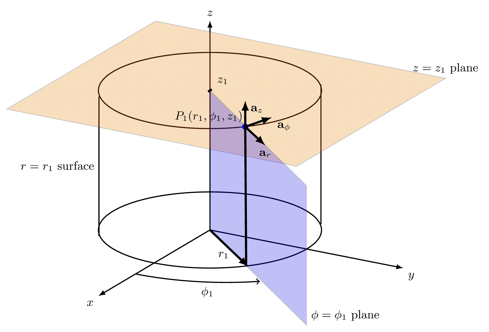

  * [3d-cylinder-planes+3d.tex](https://github.com/walmes/Tikz/blob/master/src/3d-cylinder-planes+3d.pgf)

`r a`
```{r}
# change pgf to tex
cat(readLines("./src/3d-cylinder-planes+3d.tex"), sep = "\n")
```
`r b`
****


  * [3d-seismic_focal_mechanism+3d+set+foreach+eng.tex](https://github.com/walmes/Tikz/blob/master/src/3d-seismic_focal_mechanism+3d+set+foreach+eng.pgf)

`r a`
```{r}
# change pgf to tex
cat(readLines("./src/3d-seismic_focal_mechanism+3d+set+foreach+eng.tex"), sep = "\n")
```
`r b`
****

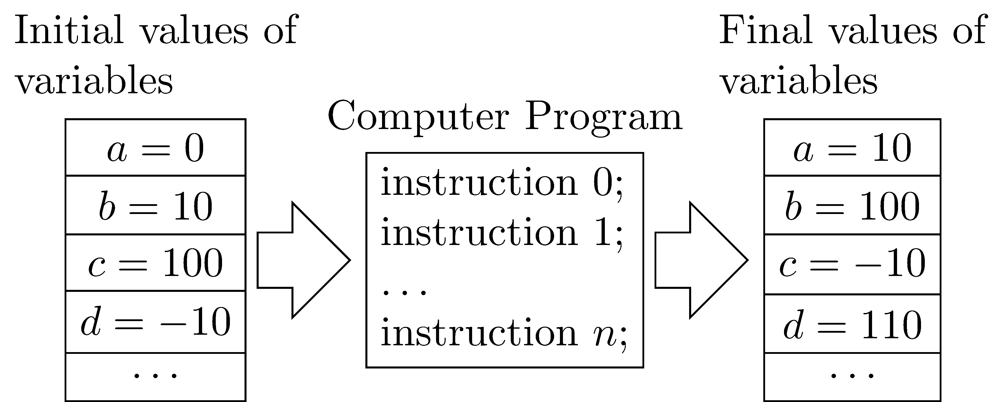

  * [box_arrows+diagram.tex](https://github.com/walmes/Tikz/blob/master/src/box_arrows+diagram.pgf)

`r a`
```{r}
# change pgf to tex
cat(readLines("./src/box_arrows+diagram.tex"), sep = "\n")
```
`r b`
****


  * [colorized_equation+equation.tex](https://github.com/walmes/Tikz/blob/master/src/colorized_equation+equation.pgf)

`r a`
```{r}
# change pgf to tex
cat(readLines("./src/colorized_equation+equation.tex"), sep = "\n")
```
`r b`
****


  * [cubes_factorials+physics+3d.tex](https://github.com/walmes/Tikz/blob/master/src/cubes_factorials+physics+3d.pgf)

`r a`
```{r}
# change pgf to tex
cat(readLines("./src/cubes_factorials+physics+3d.tex"), sep = "\n")
```
`r b`
****

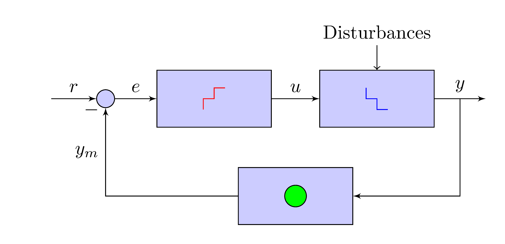

  * [drawing_inside_box_bigger+symbol+diagram+command+style.tex](https://github.com/walmes/Tikz/blob/master/src/drawing_inside_box_bigger+symbol+diagram+command+style.pgf)

`r a`
```{r}
# change pgf to tex
cat(readLines("./src/drawing_inside_box_bigger+symbol+diagram+command+style.tex"), sep = "\n")
```
`r b`
****


  * [elem-circle_grided+elem+geometry.tex](https://github.com/walmes/Tikz/blob/master/src/elem-circle_grided+elem+geometry.pgf)

`r a`
```{r}
# change pgf to tex
cat(readLines("./src/elem-circle_grided+elem+geometry.tex"), sep = "\n")
```
`r b`
****

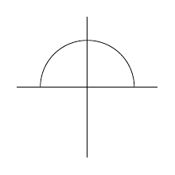

  * [elem-circle_half+elem+geometry.tex](https://github.com/walmes/Tikz/blob/master/src/elem-circle_half+elem+geometry.pgf)

`r a`
```{r}
# change pgf to tex
cat(readLines("./src/elem-circle_half+elem+geometry.tex"), sep = "\n")
```
`r b`
****

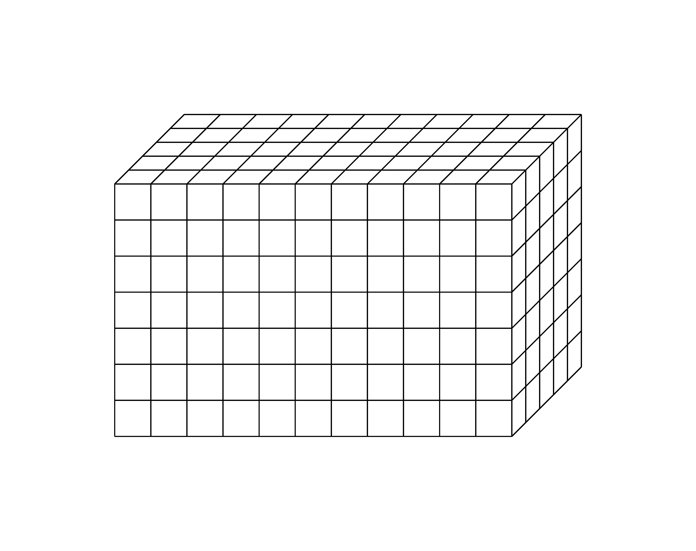

  * [elem-cube_finer_grid+elem+foreach+command.tex](https://github.com/walmes/Tikz/blob/master/src/elem-cube_finer_grid+elem+foreach+command.pgf)

`r a`
```{r}
# change pgf to tex
cat(readLines("./src/elem-cube_finer_grid+elem+foreach+command.tex"), sep = "\n")
```
`r b`
****


  * [elem-grid_RBG-7x7+elem+3d+pgf+foreach.tex](https://github.com/walmes/Tikz/blob/master/src/elem-grid_RBG-7x7+elem+3d+pgf+foreach.pgf)

`r a`
```{r}
# change pgf to tex
cat(readLines("./src/elem-grid_RBG-7x7+elem+3d+pgf+foreach.tex"), sep = "\n")
```
`r b`
****

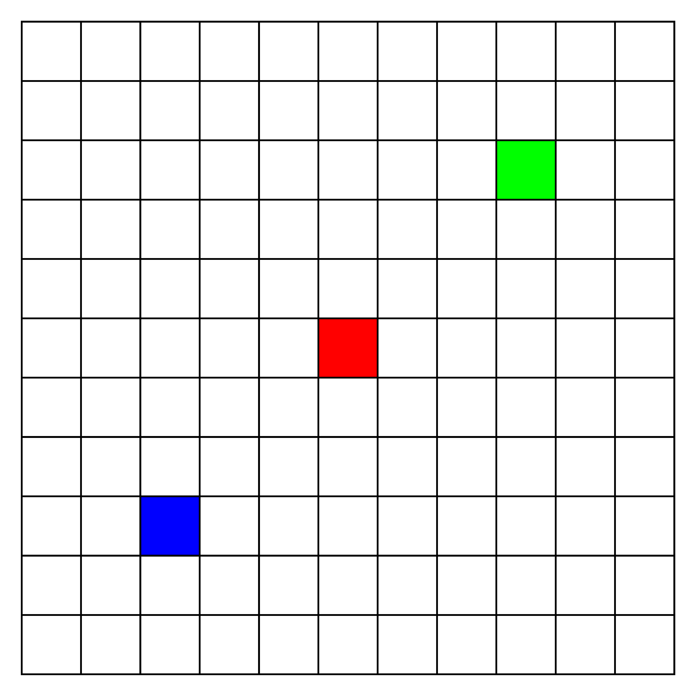

  * [elem-grid_RBG+elem+foreach+style.tex](https://github.com/walmes/Tikz/blob/master/src/elem-grid_RBG+elem+foreach+style.pgf)

`r a`
```{r}
# change pgf to tex
cat(readLines("./src/elem-grid_RBG+elem+foreach+style.tex"), sep = "\n")
```
`r b`
****

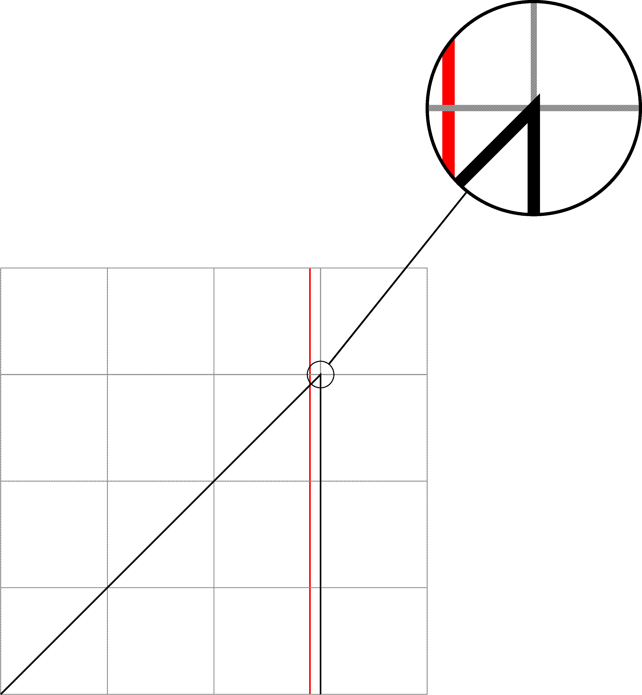

  * [elem-magnification+elem+geometry.tex](https://github.com/walmes/Tikz/blob/master/src/elem-magnification+elem+geometry.pgf)

`r a`
```{r}
# change pgf to tex
cat(readLines("./src/elem-magnification+elem+geometry.tex"), sep = "\n")
```
`r b`
****

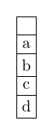

  * [elem-stacked+elem+diagram.tex](https://github.com/walmes/Tikz/blob/master/src/elem-stacked+elem+diagram.pgf)

`r a`
```{r}
# change pgf to tex
cat(readLines("./src/elem-stacked+elem+diagram.tex"), sep = "\n")
```
`r b`
****

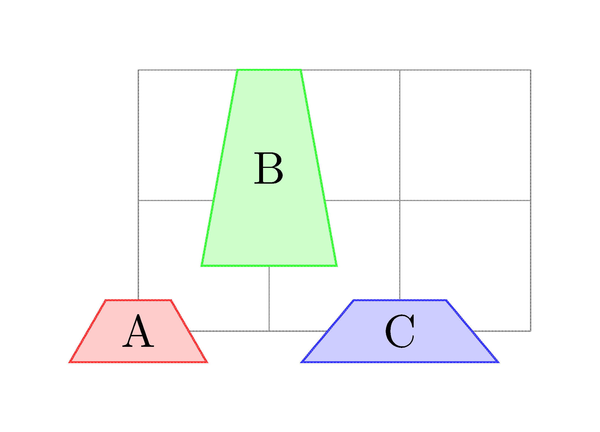

  * [elem-trapezium+elem+geometry.tex](https://github.com/walmes/Tikz/blob/master/src/elem-trapezium+elem+geometry.pgf)

`r a`
```{r}
# change pgf to tex
cat(readLines("./src/elem-trapezium+elem+geometry.tex"), sep = "\n")
```
`r b`
****

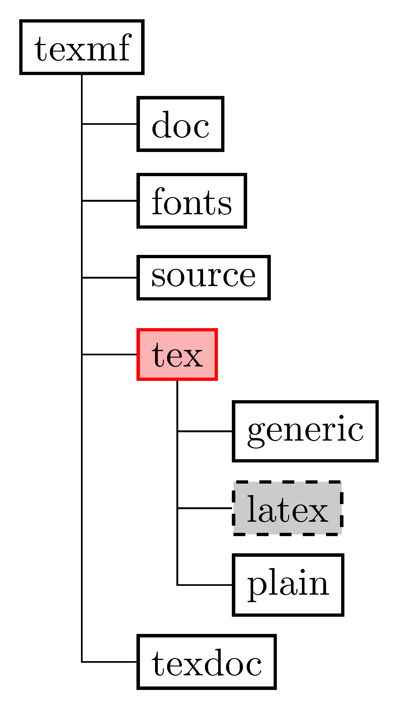

  * [filesystem_tree+diagram.tex](https://github.com/walmes/Tikz/blob/master/src/filesystem_tree+diagram.pgf)

`r a`
```{r}
# change pgf to tex
cat(readLines("./src/filesystem_tree+diagram.tex"), sep = "\n")
```
`r b`
****

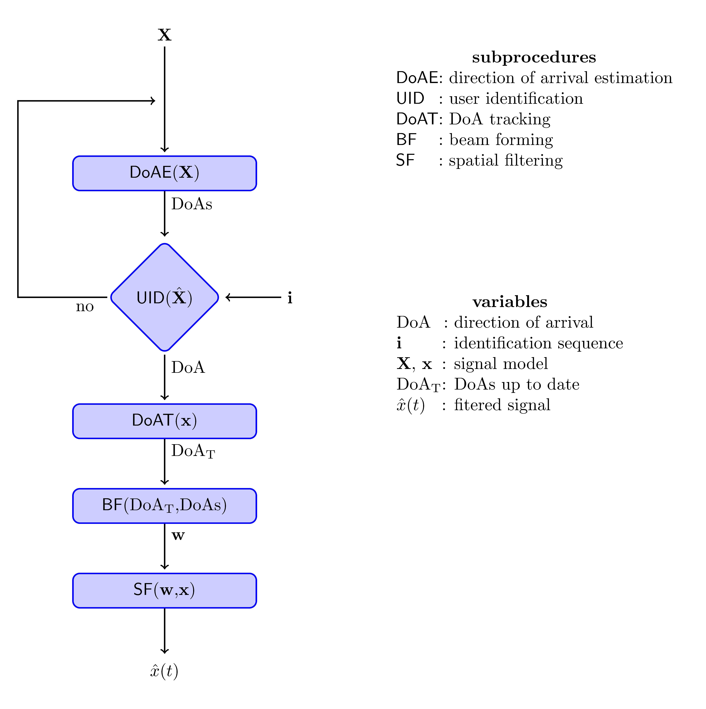

  * [flow-direction_of_arrival+diagram.tex](https://github.com/walmes/Tikz/blob/master/src/flow-direction_of_arrival+diagram.pgf)

`r a`
```{r}
# change pgf to tex
cat(readLines("./src/flow-direction_of_arrival+diagram.tex"), sep = "\n")
```
`r b`
****

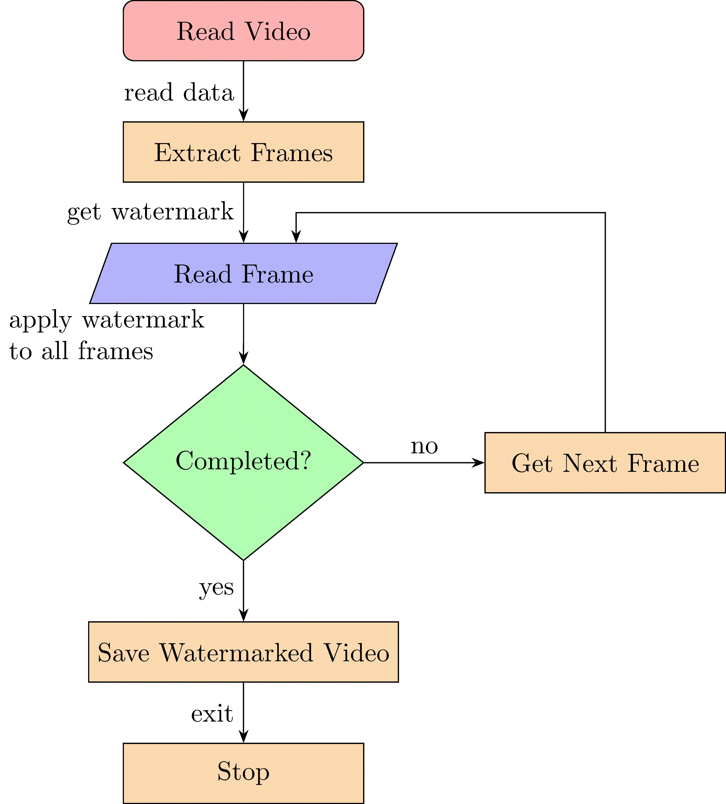

  * [flow-flowchart_video+diagram+style.tex](https://github.com/walmes/Tikz/blob/master/src/flow-flowchart_video+diagram+style.pgf)

`r a`
```{r}
# change pgf to tex
cat(readLines("./src/flow-flowchart_video+diagram+style.tex"), sep = "\n")
```
`r b`
****

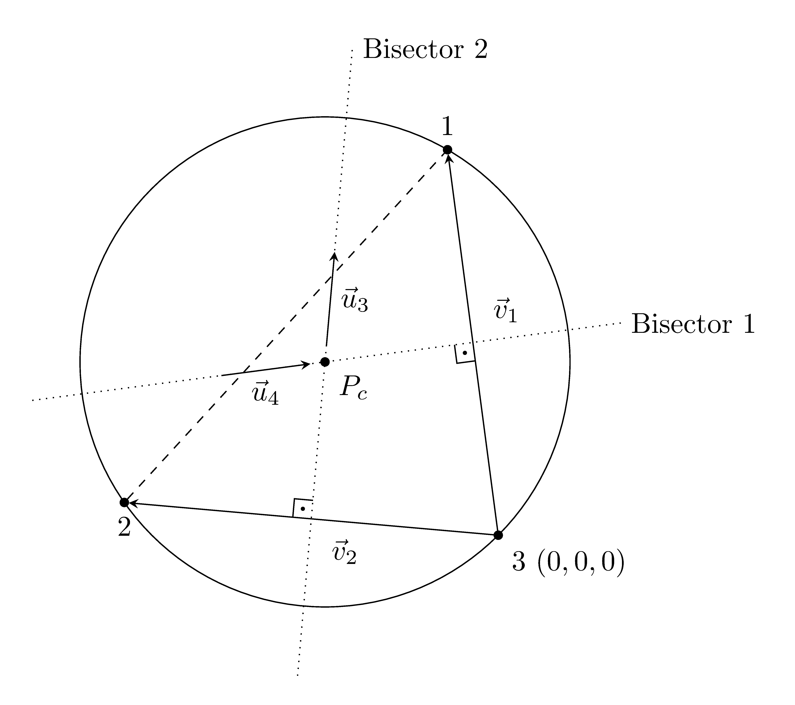

  * [geom-circle_bisectors_triangle+geometry.tex](https://github.com/walmes/Tikz/blob/master/src/geom-circle_bisectors_triangle+geometry.pgf)

`r a`
```{r}
# change pgf to tex
cat(readLines("./src/geom-circle_bisectors_triangle+geometry.tex"), sep = "\n")
```
`r b`
****

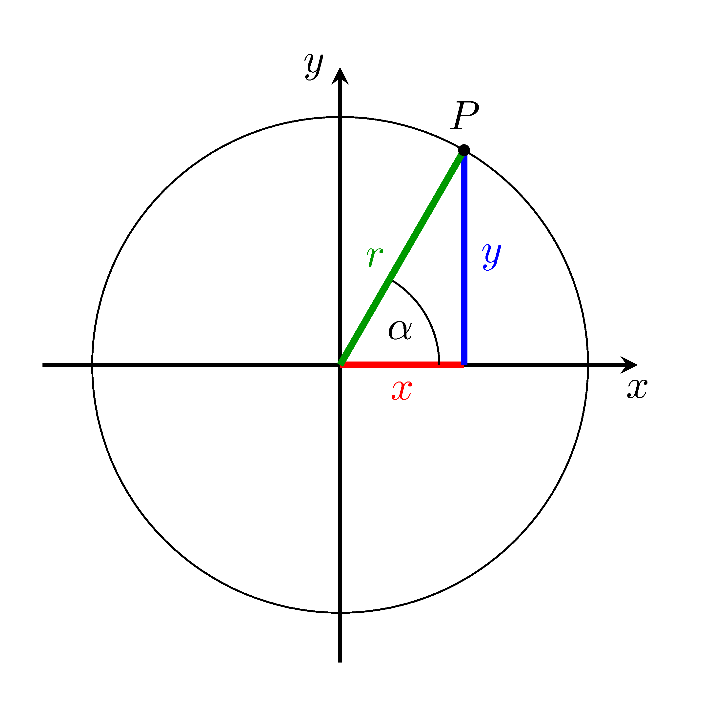

  * [geom-circle_coordinate_systems+geometry.tex](https://github.com/walmes/Tikz/blob/master/src/geom-circle_coordinate_systems+geometry.pgf)

`r a`
```{r}
# change pgf to tex
cat(readLines("./src/geom-circle_coordinate_systems+geometry.tex"), sep = "\n")
```
`r b`
****

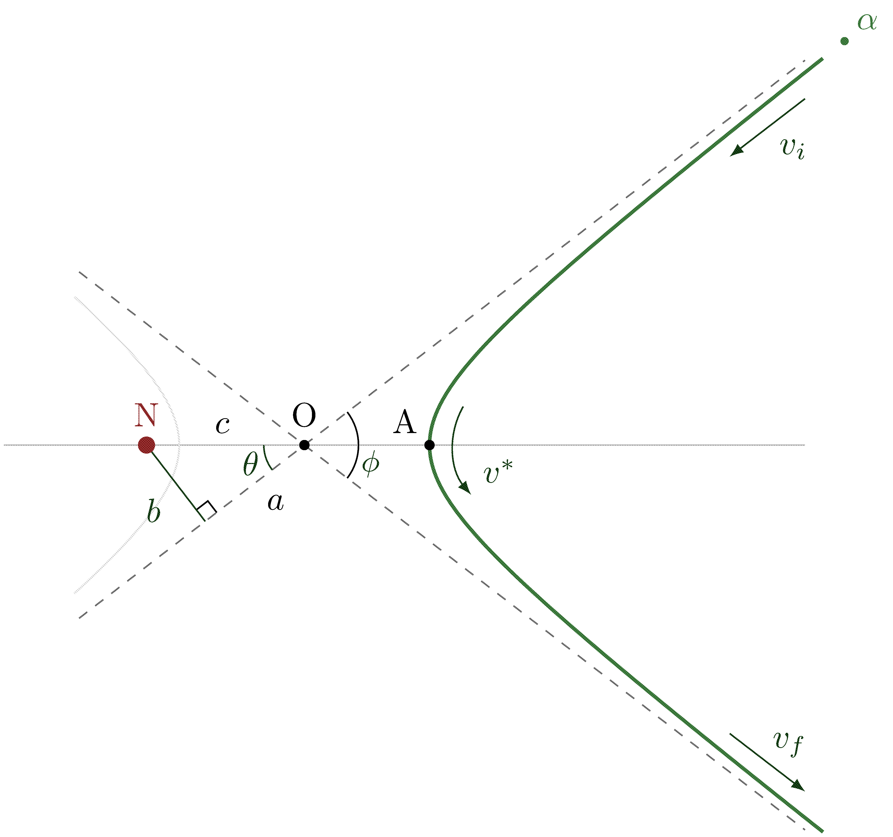

  * [geom-hyperbola+geometry+physics.tex](https://github.com/walmes/Tikz/blob/master/src/geom-hyperbola+geometry+physics.pgf)

`r a`
```{r}
# change pgf to tex
cat(readLines("./src/geom-hyperbola+geometry+physics.tex"), sep = "\n")
```
`r b`
****

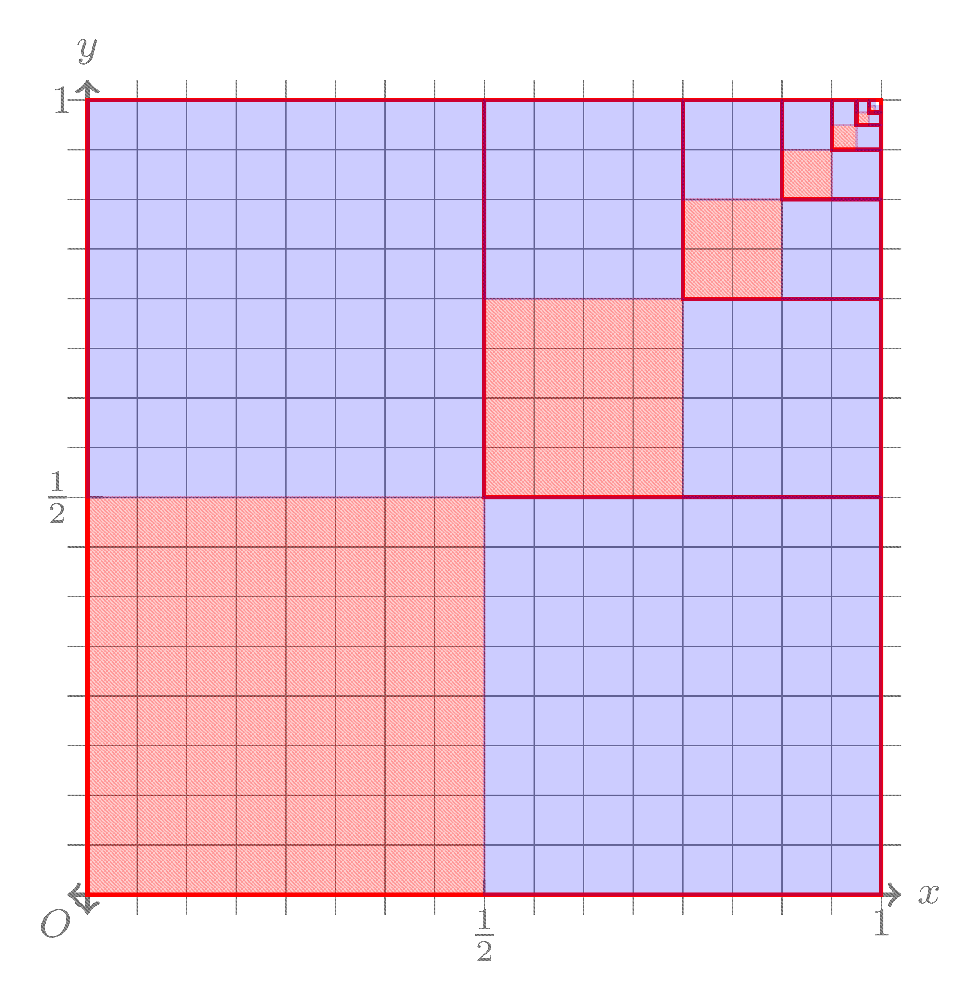

  * [geometric_representation+math+foreach+pgf+scope.tex](https://github.com/walmes/Tikz/blob/master/src/geometric_representation+math+foreach+pgf+scope.pgf)

`r a`
```{r}
# change pgf to tex
cat(readLines("./src/geometric_representation+math+foreach+pgf+scope.tex"), sep = "\n")
```
`r b`
****

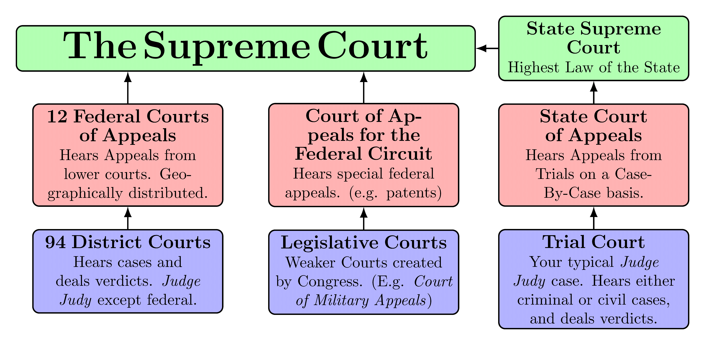

  * [impact-supreme_court+diagram.tex](https://github.com/walmes/Tikz/blob/master/src/impact-supreme_court+diagram.pgf)

`r a`
```{r}
# change pgf to tex
cat(readLines("./src/impact-supreme_court+diagram.tex"), sep = "\n")
```
`r b`
****

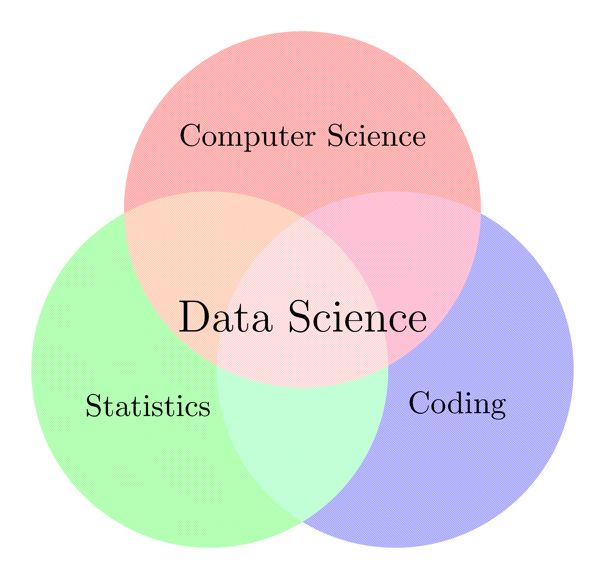

  * [impact-venn+diagram.tex](https://github.com/walmes/Tikz/blob/master/src/impact-venn+diagram.pgf)

`r a`
```{r}
# change pgf to tex
cat(readLines("./src/impact-venn+diagram.tex"), sep = "\n")
```
`r b`
****

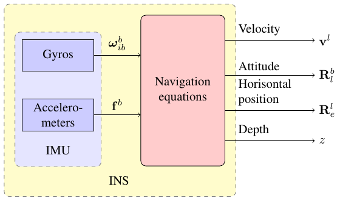

  * [inertial_system_color+diagram+pgf+command+def+layer.tex](https://github.com/walmes/Tikz/blob/master/src/inertial_system_color+diagram+pgf+command+def+layer.pgf)

`r a`
```{r}
# change pgf to tex
cat(readLines("./src/inertial_system_color+diagram+pgf+command+def+layer.tex"), sep = "\n")
```
`r b`
****


  * [mammography_bayes+diagram.tex](https://github.com/walmes/Tikz/blob/master/src/mammography_bayes+diagram.pgf)

`r a`
```{r}
# change pgf to tex
cat(readLines("./src/mammography_bayes+diagram.tex"), sep = "\n")
```
`r b`
****


  * [mapper-reducer.tex](https://github.com/walmes/Tikz/blob/master/src/mapper-reducer.pgf)

`r a`
```{r}
# change pgf to tex
cat(readLines("./src/mapper-reducer.tex"), sep = "\n")
```
`r b`
****


  * [mind_child_manipulation+mindmap.tex](https://github.com/walmes/Tikz/blob/master/src/mind_child_manipulation+mindmap.pgf)

`r a`
```{r}
# change pgf to tex
cat(readLines("./src/mind_child_manipulation+mindmap.tex"), sep = "\n")
```
`r b`
****

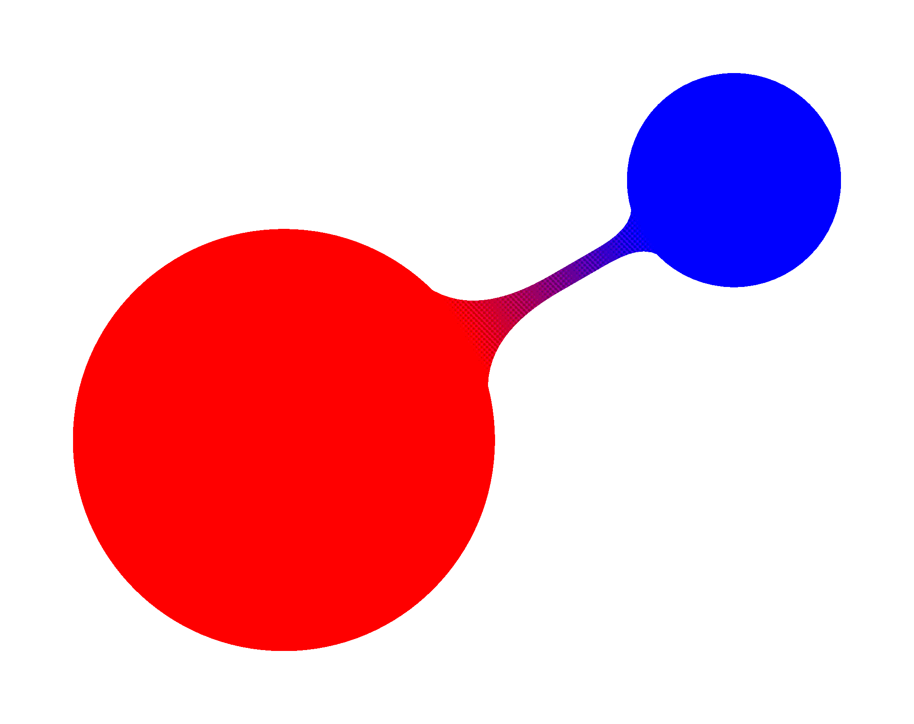

  * [mind_circle_connection+mindmap.tex](https://github.com/walmes/Tikz/blob/master/src/mind_circle_connection+mindmap.pgf)

`r a`
```{r}
# change pgf to tex
cat(readLines("./src/mind_circle_connection+mindmap.tex"), sep = "\n")
```
`r b`
****


  * [mind_computer_science+mindmap.tex](https://github.com/walmes/Tikz/blob/master/src/mind_computer_science+mindmap.pgf)

`r a`
```{r}
# change pgf to tex
cat(readLines("./src/mind_computer_science+mindmap.tex"), sep = "\n")
```
`r b`
****

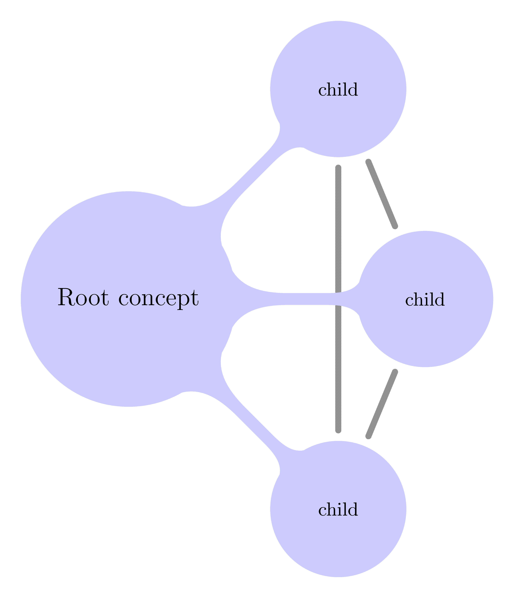

  * [mind_connecting_concepts+mindmap.tex](https://github.com/walmes/Tikz/blob/master/src/mind_connecting_concepts+mindmap.pgf)

`r a`
```{r}
# change pgf to tex
cat(readLines("./src/mind_connecting_concepts+mindmap.tex"), sep = "\n")
```
`r b`
****


  * [mind_fixed+mindmap.tex](https://github.com/walmes/Tikz/blob/master/src/mind_fixed+mindmap.pgf)

`r a`
```{r}
# change pgf to tex
cat(readLines("./src/mind_fixed+mindmap.tex"), sep = "\n")
```
`r b`
****

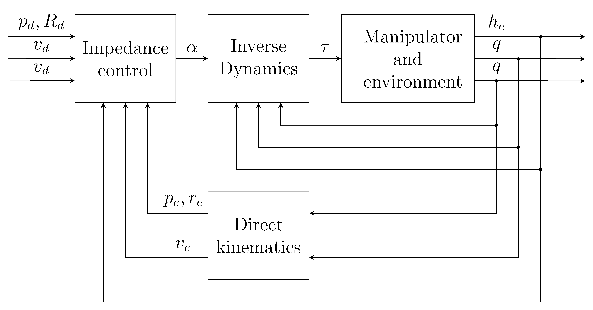

  * [multiple_block_connections-101+diagram.tex](https://github.com/walmes/Tikz/blob/master/src/multiple_block_connections-101+diagram.pgf)

`r a`
```{r}
# change pgf to tex
cat(readLines("./src/multiple_block_connections-101+diagram.tex"), sep = "\n")
```
`r b`
****

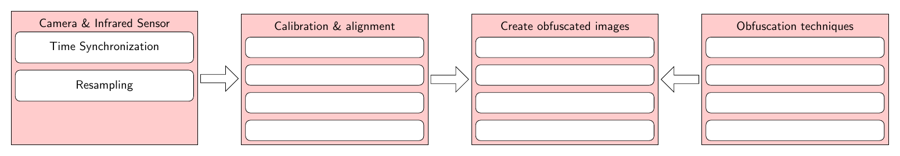

  * [nested+diagram.tex](https://github.com/walmes/Tikz/blob/master/src/nested+diagram.pgf)

`r a`
```{r}
# change pgf to tex
cat(readLines("./src/nested+diagram.tex"), sep = "\n")
```
`r b`
****

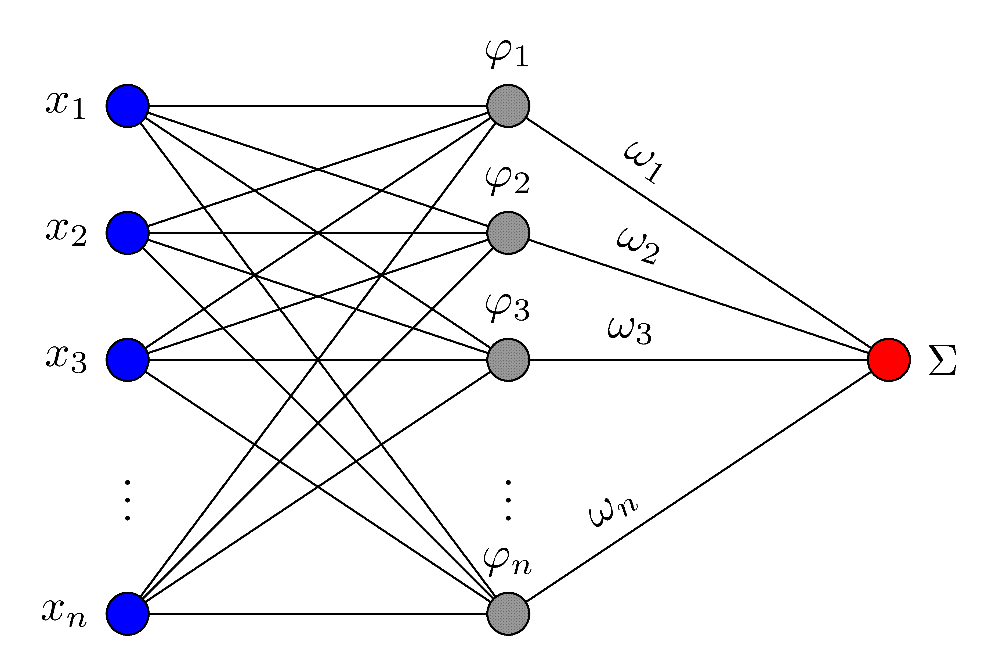

  * [nn-02_auto_net+neuralnet+foreach+pgf+style+learn.tex](https://github.com/walmes/Tikz/blob/master/src/nn-02_auto_net+neuralnet+foreach+pgf+style+learn.pgf)

`r a`
```{r}
# change pgf to tex
cat(readLines("./src/nn-02_auto_net+neuralnet+foreach+pgf+style+learn.tex"), sep = "\n")
```
`r b`
****

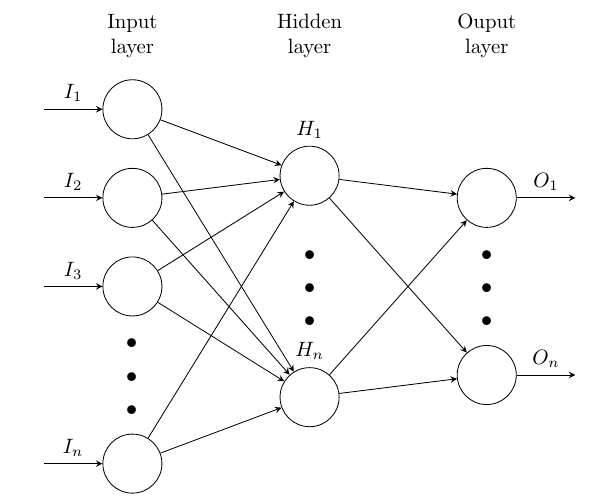

  * [nn-05_auto_net_arr+neuralnet+style+foreach+learn.tex](https://github.com/walmes/Tikz/blob/master/src/nn-05_auto_net_arr+neuralnet+style+foreach+learn.pgf)

`r a`
```{r}
# change pgf to tex
cat(readLines("./src/nn-05_auto_net_arr+neuralnet+style+foreach+learn.tex"), sep = "\n")
```
`r b`
****


  * [nn-08-tkz-berge-01+neuralnet+scope+foreach+pkg.tex](https://github.com/walmes/Tikz/blob/master/src/nn-08-tkz-berge-01+neuralnet+scope+foreach+pkg.pgf)

`r a`
```{r}
# change pgf to tex
cat(readLines("./src/nn-08-tkz-berge-01+neuralnet+scope+foreach+pkg.tex"), sep = "\n")
```
`r b`
****

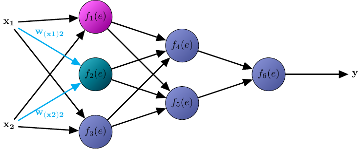

  * [nn-2h_manual_net-color+neuralnet+set+foreach.tex](https://github.com/walmes/Tikz/blob/master/src/nn-2h_manual_net-color+neuralnet+set+foreach.pgf)

`r a`
```{r}
# change pgf to tex
cat(readLines("./src/nn-2h_manual_net-color+neuralnet+set+foreach.tex"), sep = "\n")
```
`r b`
****


  * [nn-a3c_manual_net_arr+neuralnet.tex](https://github.com/walmes/Tikz/blob/master/src/nn-a3c_manual_net_arr+neuralnet.pgf)

`r a`
```{r}
# change pgf to tex
cat(readLines("./src/nn-a3c_manual_net_arr+neuralnet.tex"), sep = "\n")
```
`r b`
****

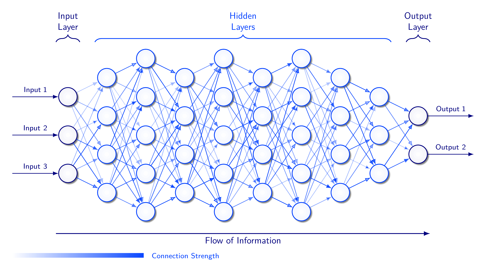

  * [nn-auto_net_4h_arr+neuralnet+matrix+foreach+style+scope.tex](https://github.com/walmes/Tikz/blob/master/src/nn-auto_net_4h_arr+neuralnet+matrix+foreach+style+scope.pgf)

`r a`
```{r}
# change pgf to tex
cat(readLines("./src/nn-auto_net_4h_arr+neuralnet+matrix+foreach+style+scope.tex"), sep = "\n")
```
`r b`
****

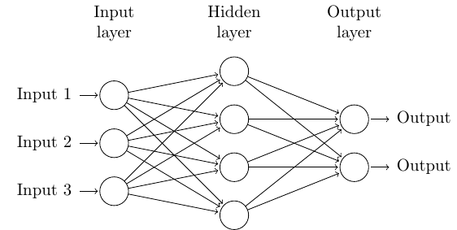

  * [nn-auto_net_arr+neuralnet+foreach+style+foreach.tex](https://github.com/walmes/Tikz/blob/master/src/nn-auto_net_arr+neuralnet+foreach+style+foreach.pgf)

`r a`
```{r}
# change pgf to tex
cat(readLines("./src/nn-auto_net_arr+neuralnet+foreach+style+foreach.tex"), sep = "\n")
```
`r b`
****

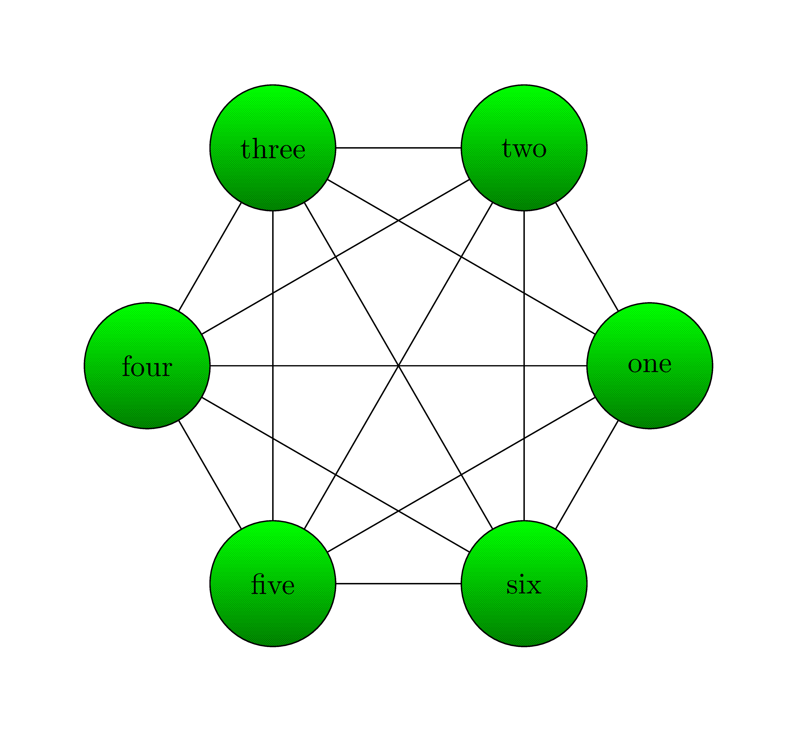

  * [nn-auto_net_color+neuralnet+foreach.tex](https://github.com/walmes/Tikz/blob/master/src/nn-auto_net_color+neuralnet+foreach.pgf)

`r a`
```{r}
# change pgf to tex
cat(readLines("./src/nn-auto_net_color+neuralnet+foreach.tex"), sep = "\n")
```
`r b`
****

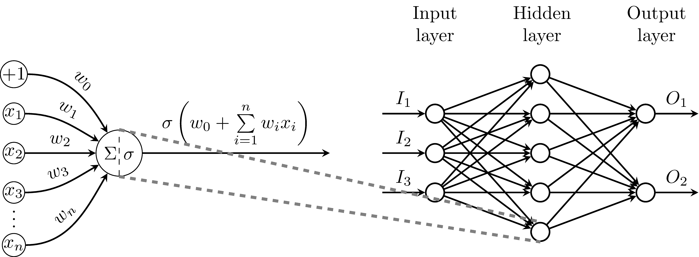

  * [nn-block_diagram-multilayer_perceptron+neuralnet+style+learn.tex](https://github.com/walmes/Tikz/blob/master/src/nn-block_diagram-multilayer_perceptron+neuralnet+style+learn.pgf)

`r a`
```{r}
# change pgf to tex
cat(readLines("./src/nn-block_diagram-multilayer_perceptron+neuralnet+style+learn.tex"), sep = "\n")
```
`r b`
****

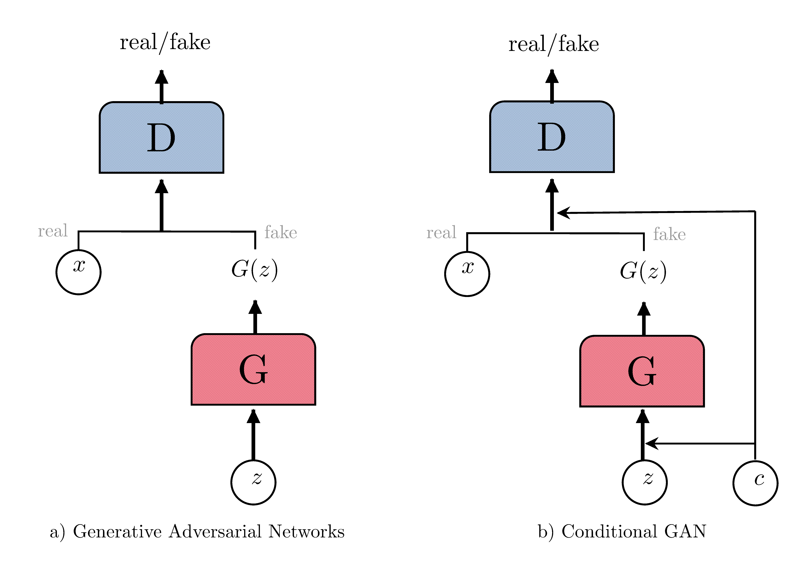

  * [nn-gan_two_gan_types+neuralnet.tex](https://github.com/walmes/Tikz/blob/master/src/nn-gan_two_gan_types+neuralnet.pgf)

`r a`
```{r}
# change pgf to tex
cat(readLines("./src/nn-gan_two_gan_types+neuralnet.tex"), sep = "\n")
```
`r b`
****

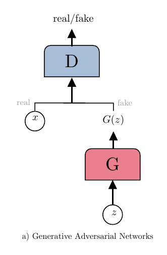

  * [nn-gan_vertical+neuralnet.tex](https://github.com/walmes/Tikz/blob/master/src/nn-gan_vertical+neuralnet.pgf)

`r a`
```{r}
# change pgf to tex
cat(readLines("./src/nn-gan_vertical+neuralnet.tex"), sep = "\n")
```
`r b`
****

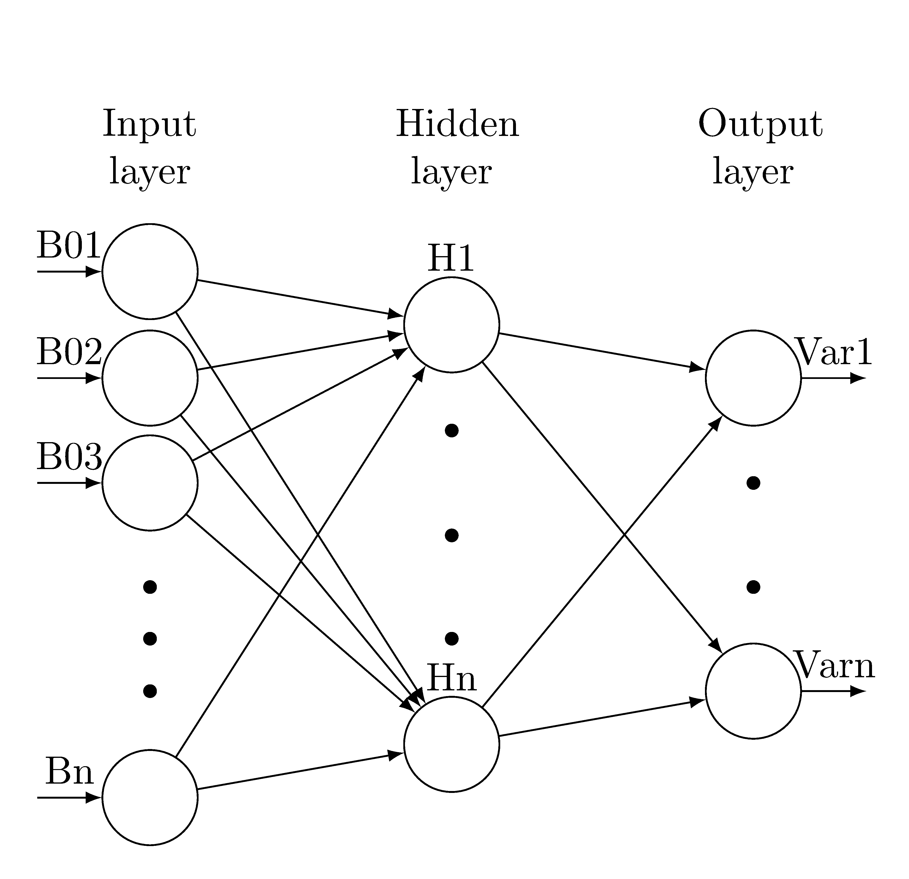

  * [nn-generator+neuralnet+matrix.tex](https://github.com/walmes/Tikz/blob/master/src/nn-generator+neuralnet+matrix.pgf)

`r a`
```{r}
# change pgf to tex
cat(readLines("./src/nn-generator+neuralnet+matrix.tex"), sep = "\n")
```
`r b`
****

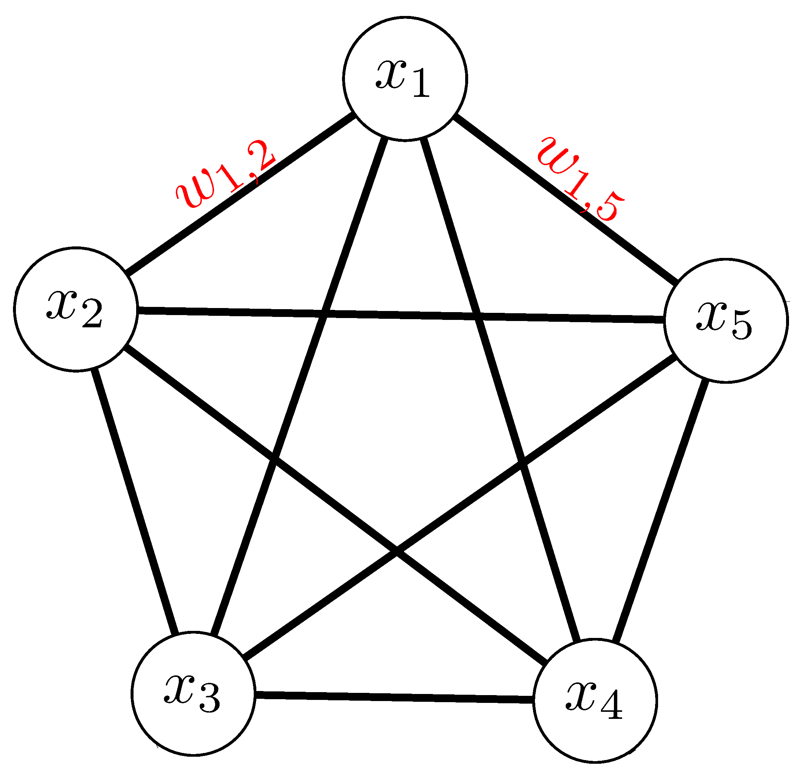

  * [nn-hopfield_auto_net+neuralnet+foreach+scope+learn+style+command.tex](https://github.com/walmes/Tikz/blob/master/src/nn-hopfield_auto_net+neuralnet+foreach+scope+learn+style+command.pgf)

`r a`
```{r}
# change pgf to tex
cat(readLines("./src/nn-hopfield_auto_net+neuralnet+foreach+scope+learn+style+command.tex"), sep = "\n")
```
`r b`
****

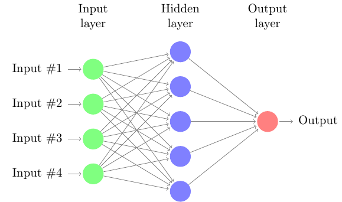

  * [nn-neural_network-1h+neuralnet+foreach.tex](https://github.com/walmes/Tikz/blob/master/src/nn-neural_network-1h+neuralnet+foreach.pgf)

`r a`
```{r}
# change pgf to tex
cat(readLines("./src/nn-neural_network-1h+neuralnet+foreach.tex"), sep = "\n")
```
`r b`
****

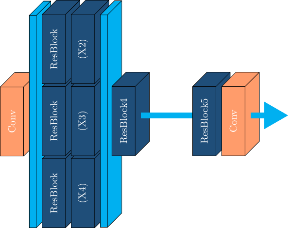

  * [nn-stacked_blocks+neuralnet+3d+def+pgf+set+style.tex](https://github.com/walmes/Tikz/blob/master/src/nn-stacked_blocks+neuralnet+3d+def+pgf+set+style.pgf)

`r a`
```{r}
# change pgf to tex
cat(readLines("./src/nn-stacked_blocks+neuralnet+3d+def+pgf+set+style.tex"), sep = "\n")
```
`r b`
****

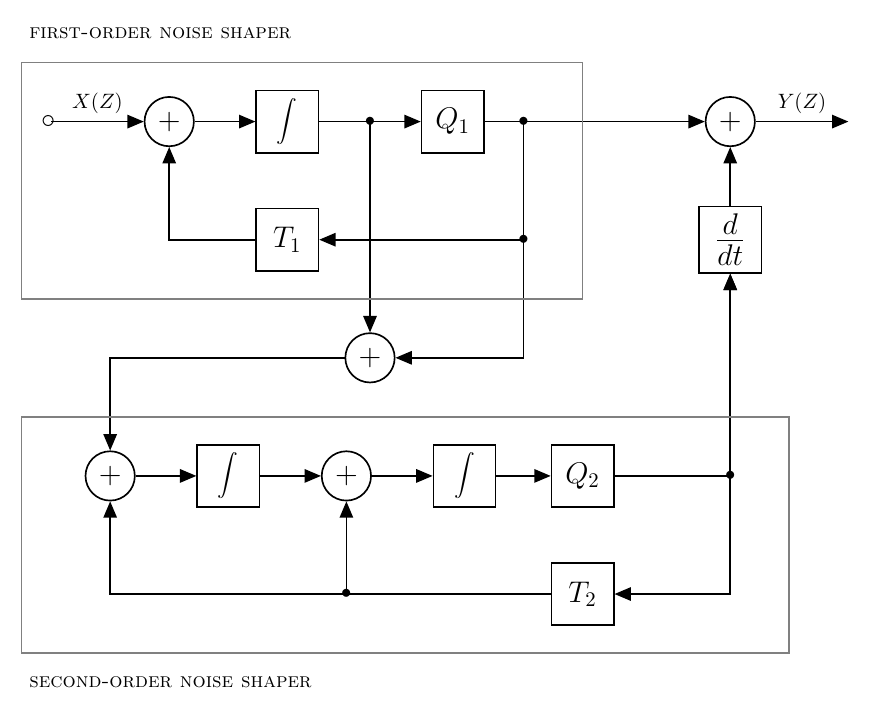

  * [noise+diagram.tex](https://github.com/walmes/Tikz/blob/master/src/noise+diagram.pgf)

`r a`
```{r}
# change pgf to tex
cat(readLines("./src/noise+diagram.tex"), sep = "\n")
```
`r b`
****


  * [physics-solenoid.tex](https://github.com/walmes/Tikz/blob/master/src/physics-solenoid.pgf)

`r a`
```{r}
# change pgf to tex
cat(readLines("./src/physics-solenoid.tex"), sep = "\n")
```
`r b`
****


  * [pirates-games.tex](https://github.com/walmes/Tikz/blob/master/src/pirates-games.pgf)

`r a`
```{r}
# change pgf to tex
cat(readLines("./src/pirates-games.tex"), sep = "\n")
```
`r b`
****

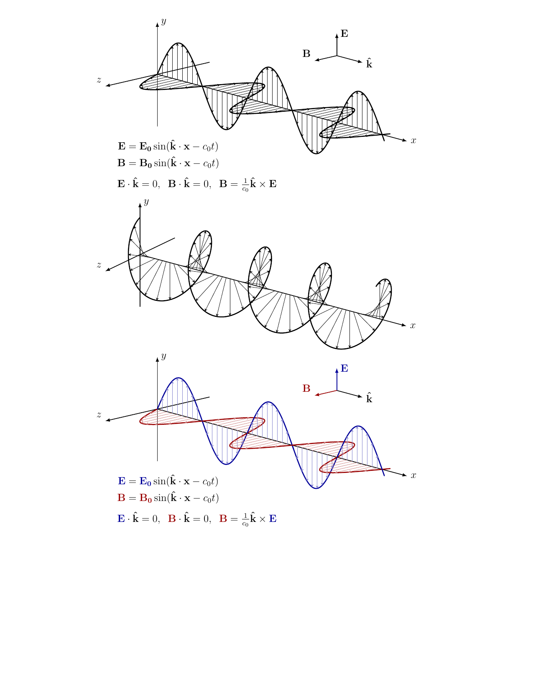

  * [plot-electromagnetic_wave+physics.tex](https://github.com/walmes/Tikz/blob/master/src/plot-electromagnetic_wave+physics.pgf)

`r a`
```{r}
# change pgf to tex
cat(readLines("./src/plot-electromagnetic_wave+physics.tex"), sep = "\n")
```
`r b`
****

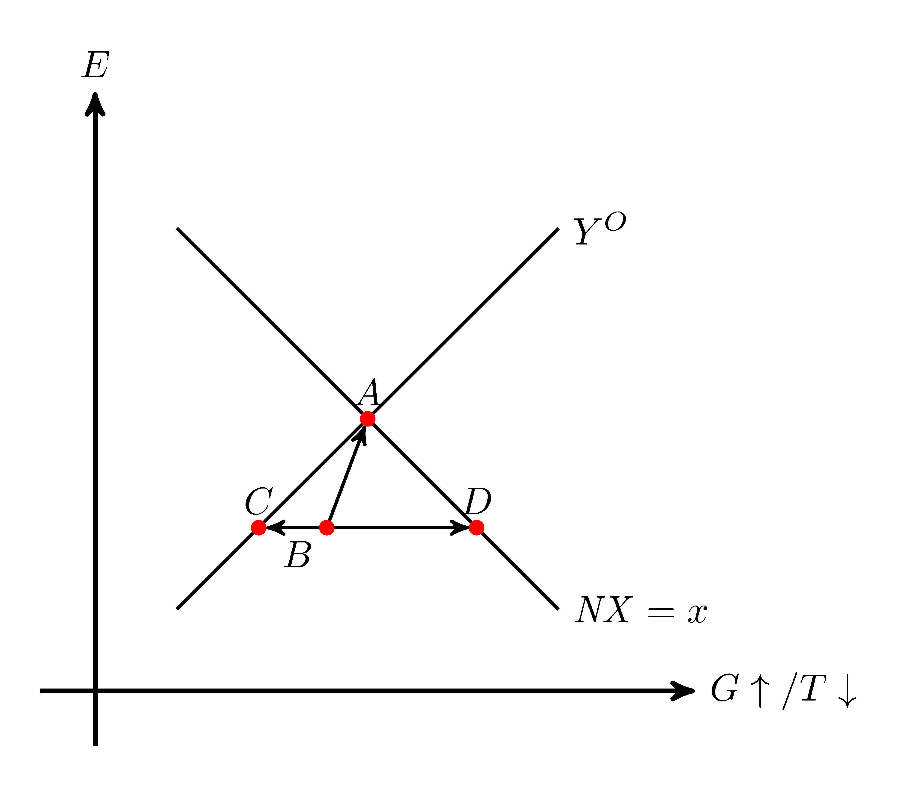

  * [plot-intersections+geometry.tex](https://github.com/walmes/Tikz/blob/master/src/plot-intersections+geometry.pgf)

`r a`
```{r}
# change pgf to tex
cat(readLines("./src/plot-intersections+geometry.tex"), sep = "\n")
```
`r b`
****

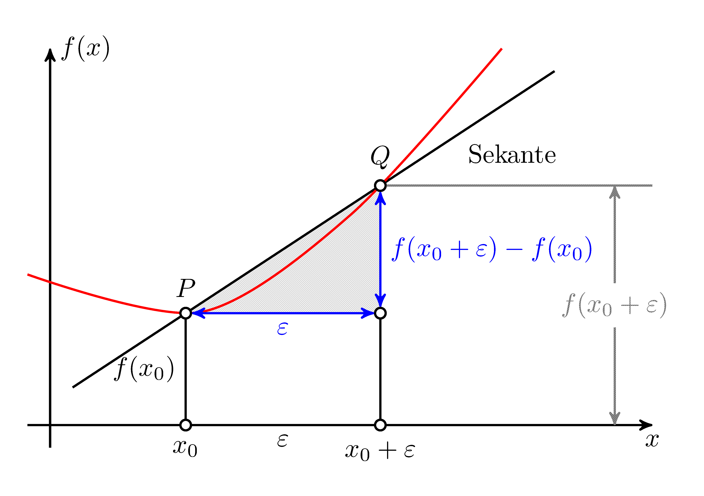

  * [plot-linear-regression+geometry.tex](https://github.com/walmes/Tikz/blob/master/src/plot-linear-regression+geometry.pgf)

`r a`
```{r}
# change pgf to tex
cat(readLines("./src/plot-linear-regression+geometry.tex"), sep = "\n")
```
`r b`
****


  * [plot-physics-functions.tex](https://github.com/walmes/Tikz/blob/master/src/plot-physics-functions.pgf)

`r a`
```{r}
# change pgf to tex
cat(readLines("./src/plot-physics-functions.tex"), sep = "\n")
```
`r b`
****

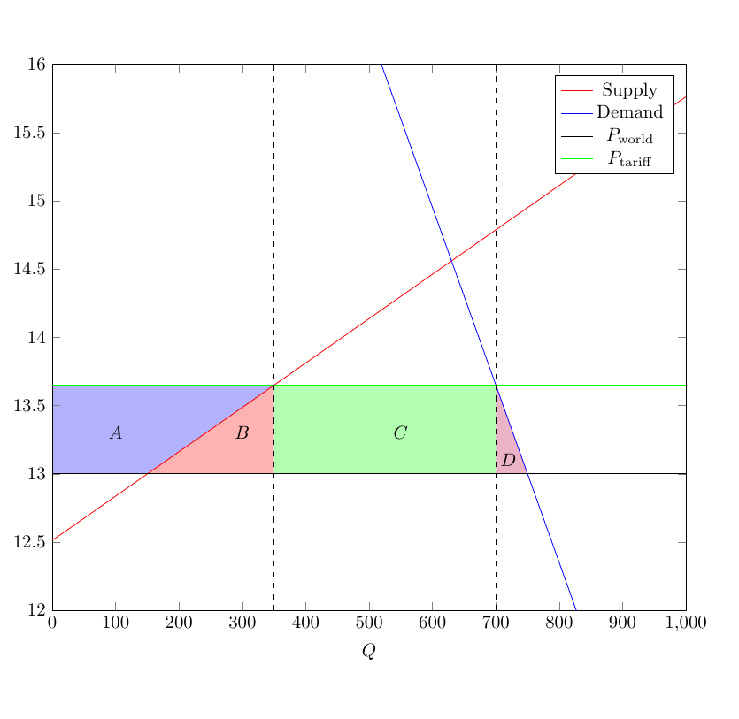

  * [plot-shading_regions+geometry+pgf+command+def.tex](https://github.com/walmes/Tikz/blob/master/src/plot-shading_regions+geometry+pgf+command+def.pgf)

`r a`
```{r}
# change pgf to tex
cat(readLines("./src/plot-shading_regions+geometry+pgf+command+def.tex"), sep = "\n")
```
`r b`
****

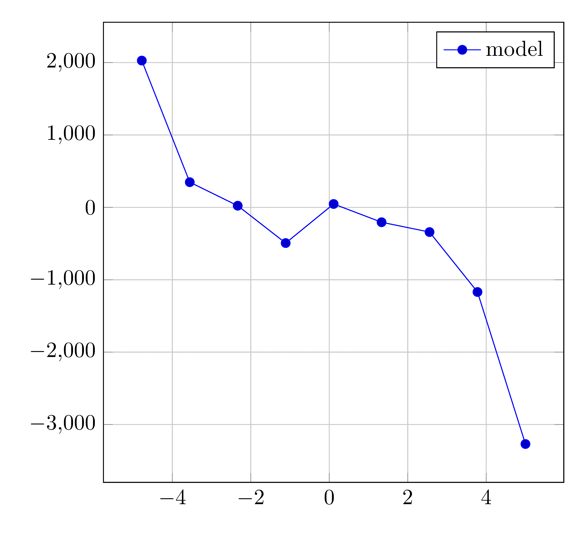

  * [plot-two_plots_same_axis+fileio+pgf.tex](https://github.com/walmes/Tikz/blob/master/src/plot-two_plots_same_axis+fileio+pgf.pgf)

`r a`
```{r}
# change pgf to tex
cat(readLines("./src/plot-two_plots_same_axis+fileio+pgf.tex"), sep = "\n")
```
`r b`
****

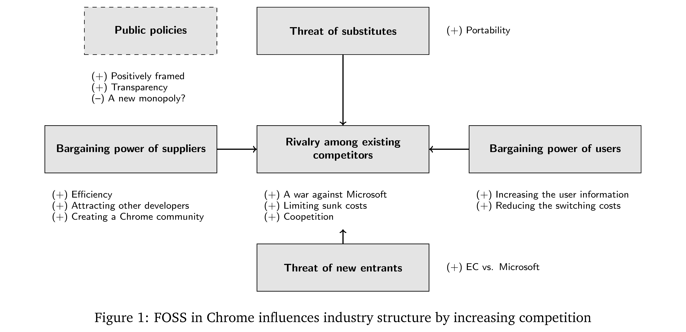

  * [porter_model+diagram.tex](https://github.com/walmes/Tikz/blob/master/src/porter_model+diagram.pgf)

`r a`
```{r}
# change pgf to tex
cat(readLines("./src/porter_model+diagram.tex"), sep = "\n")
```
`r b`
****

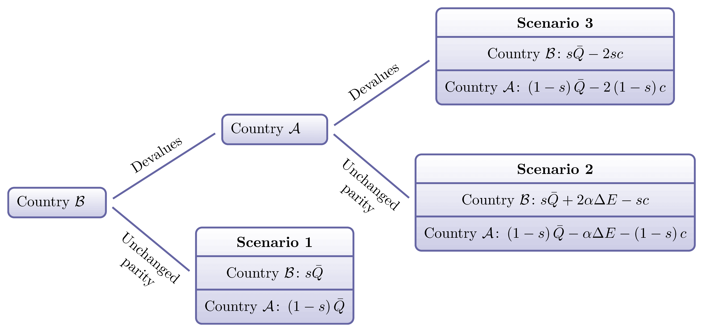

  * [scenario_tree+diagram.tex](https://github.com/walmes/Tikz/blob/master/src/scenario_tree+diagram.pgf)

`r a`
```{r}
# change pgf to tex
cat(readLines("./src/scenario_tree+diagram.tex"), sep = "\n")
```
`r b`
****


  * [server_player+diagram.tex](https://github.com/walmes/Tikz/blob/master/src/server_player+diagram.pgf)

`r a`
```{r}
# change pgf to tex
cat(readLines("./src/server_player+diagram.tex"), sep = "\n")
```
`r b`
****

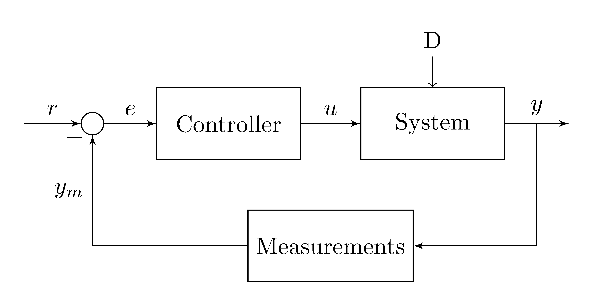

  * [simple-wrong+diagram.tex](https://github.com/walmes/Tikz/blob/master/src/simple-wrong+diagram.pgf)

`r a`
```{r}
# change pgf to tex
cat(readLines("./src/simple-wrong+diagram.tex"), sep = "\n")
```
`r b`
****


  * [time-added-dots+timeline+style+text.tex](https://github.com/walmes/Tikz/blob/master/src/time-added-dots+timeline+style+text.pgf)

`r a`
```{r}
# change pgf to tex
cat(readLines("./src/time-added-dots+timeline+style+text.tex"), sep = "\n")
```
`r b`
****

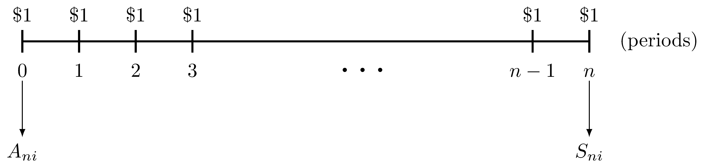

  * [time-annuity+timeline+foreach+learn.tex](https://github.com/walmes/Tikz/blob/master/src/time-annuity+timeline+foreach+learn.pgf)

`r a`
```{r}
# change pgf to tex
cat(readLines("./src/time-annuity+timeline+foreach+learn.tex"), sep = "\n")
```
`r b`
****

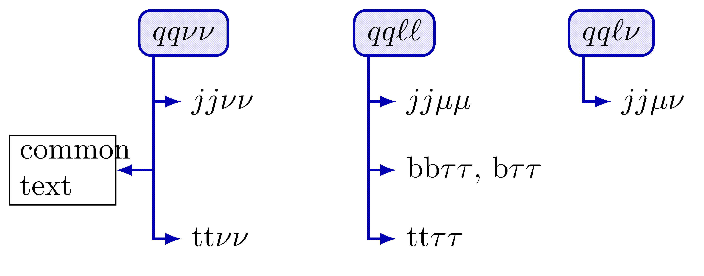

  * [time-arrows_to_nodes-arr+timeline+tree+scope+learn.tex](https://github.com/walmes/Tikz/blob/master/src/time-arrows_to_nodes-arr+timeline+tree+scope+learn.pgf)

`r a`
```{r}
# change pgf to tex
cat(readLines("./src/time-arrows_to_nodes-arr+timeline+tree+scope+learn.tex"), sep = "\n")
```
`r b`
****


  * [time-arrows-circles+timeline+pgf+set.tex](https://github.com/walmes/Tikz/blob/master/src/time-arrows-circles+timeline+pgf+set.pgf)

`r a`
```{r}
# change pgf to tex
cat(readLines("./src/time-arrows-circles+timeline+pgf+set.tex"), sep = "\n")
```
`r b`
****

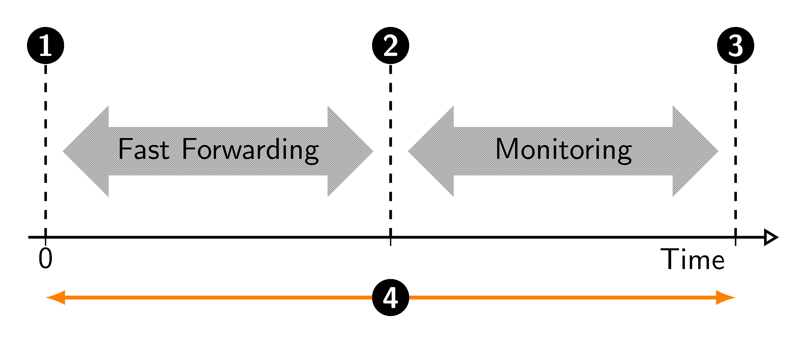

  * [time-arrows-on-periods+timeline+foreach+style+learn.tex](https://github.com/walmes/Tikz/blob/master/src/time-arrows-on-periods+timeline+foreach+style+learn.pgf)

`r a`
```{r}
# change pgf to tex
cat(readLines("./src/time-arrows-on-periods+timeline+foreach+style+learn.tex"), sep = "\n")
```
`r b`
****


  * [time-events-and-periods+timeline+set+command+pgf+scope.tex](https://github.com/walmes/Tikz/blob/master/src/time-events-and-periods+timeline+set+command+pgf+scope.pgf)

`r a`
```{r}
# change pgf to tex
cat(readLines("./src/time-events-and-periods+timeline+set+command+pgf+scope.tex"), sep = "\n")
```
`r b`
****

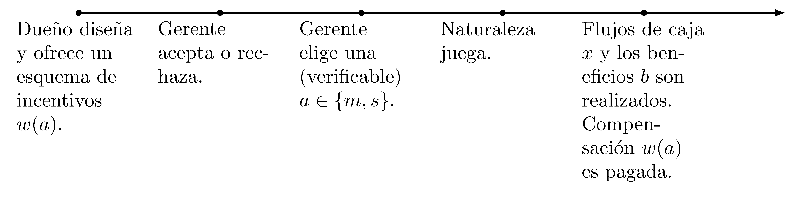

  * [time-long-text+timeline+text+foreach.tex](https://github.com/walmes/Tikz/blob/master/src/time-long-text+timeline+text+foreach.pgf)

`r a`
```{r}
# change pgf to tex
cat(readLines("./src/time-long-text+timeline+text+foreach.tex"), sep = "\n")
```
`r b`
****

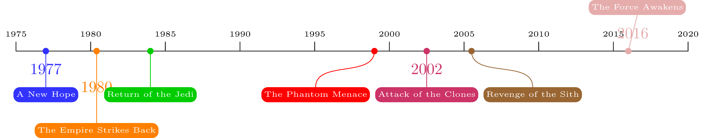

  * [time-rounded-box-arr+timeline+pgf+style+foreach+learn.tex](https://github.com/walmes/Tikz/blob/master/src/time-rounded-box-arr+timeline+pgf+style+foreach+learn.pgf)

`r a`
```{r}
# change pgf to tex
cat(readLines("./src/time-rounded-box-arr+timeline+pgf+style+foreach+learn.tex"), sep = "\n")
```
`r b`
****

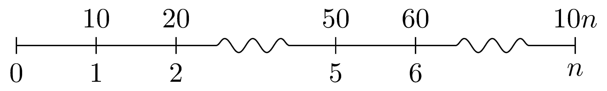

  * [time-simple+timeline+foreach+snake+decoration+learn.tex](https://github.com/walmes/Tikz/blob/master/src/time-simple+timeline+foreach+snake+decoration+learn.pgf)

`r a`
```{r}
# change pgf to tex
cat(readLines("./src/time-simple+timeline+foreach+snake+decoration+learn.tex"), sep = "\n")
```
`r b`
****

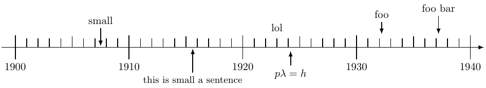

  * [time-timeline+physics+timeline+def+foreach+multi+learn.tex](https://github.com/walmes/Tikz/blob/master/src/time-timeline+physics+timeline+def+foreach+multi+learn.pgf)

`r a`
```{r}
# change pgf to tex
cat(readLines("./src/time-timeline+physics+timeline+def+foreach+multi+learn.tex"), sep = "\n")
```
`r b`
****

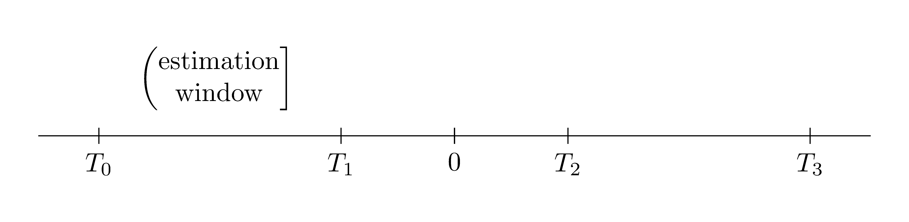

  * [time-tow-lined-braces+timeline+command+text+foreach+tabular+learn.tex](https://github.com/walmes/Tikz/blob/master/src/time-tow-lined-braces+timeline+command+text+foreach+tabular+learn.pgf)

`r a`
```{r}
# change pgf to tex
cat(readLines("./src/time-tow-lined-braces+timeline+command+text+foreach+tabular+learn.tex"), sep = "\n")
```
`r b`
****


  * [time-two_courses_horizontal+timeline+foreach+learn.tex](https://github.com/walmes/Tikz/blob/master/src/time-two_courses_horizontal+timeline+foreach+learn.pgf)

`r a`
```{r}
# change pgf to tex
cat(readLines("./src/time-two_courses_horizontal+timeline+foreach+learn.tex"), sep = "\n")
```
`r b`
****


  * [time-vertical-multiple-on-year+timeline+text+environment+command+learn.tex](https://github.com/walmes/Tikz/blob/master/src/time-vertical-multiple-on-year+timeline+text+environment+command+learn.pgf)

`r a`
```{r}
# change pgf to tex
cat(readLines("./src/time-vertical-multiple-on-year+timeline+text+environment+command+learn.tex"), sep = "\n")
```
`r b`
****

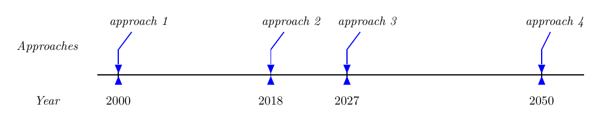

  * [time-year-event+timeline+set+foreach+learn.tex](https://github.com/walmes/Tikz/blob/master/src/time-year-event+timeline+set+foreach+learn.pgf)

`r a`
```{r}
# change pgf to tex
cat(readLines("./src/time-year-event+timeline+set+foreach+learn.tex"), sep = "\n")
```
`r b`
****

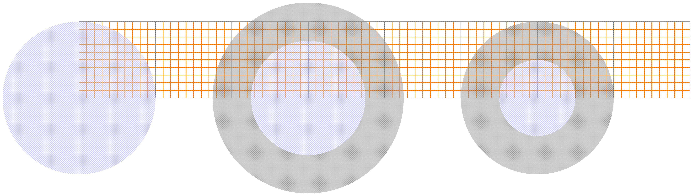

  * [transparent_circles+multi+pgf+set.tex](https://github.com/walmes/Tikz/blob/master/src/transparent_circles+multi+pgf+set.pgf)

`r a`
```{r}
# change pgf to tex
cat(readLines("./src/transparent_circles+multi+pgf+set.tex"), sep = "\n")
```
`r b`
