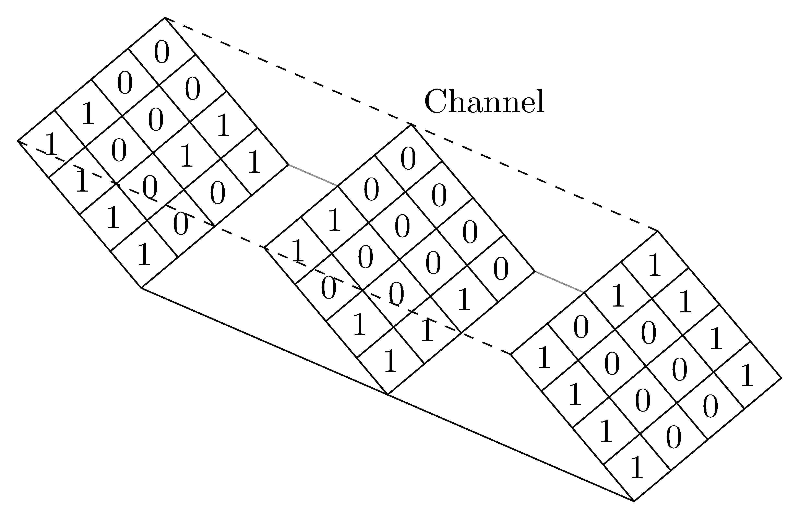
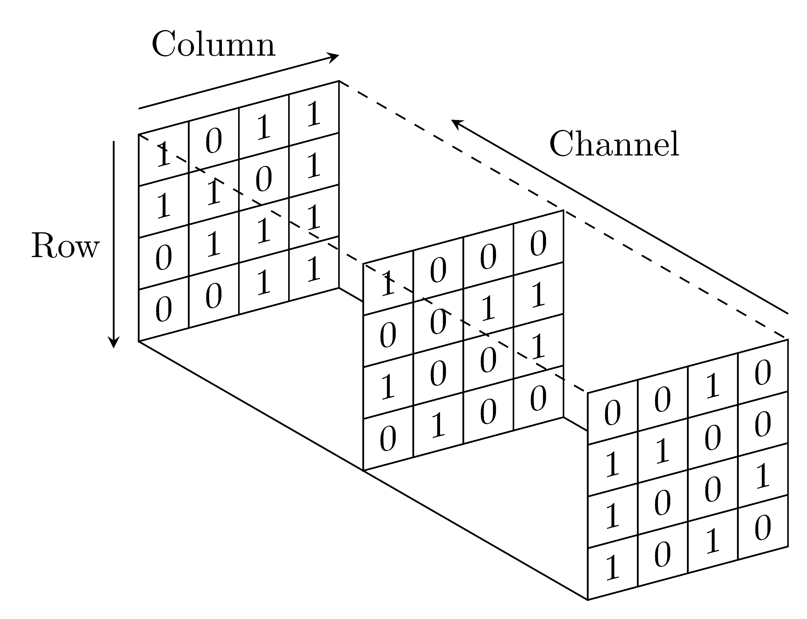
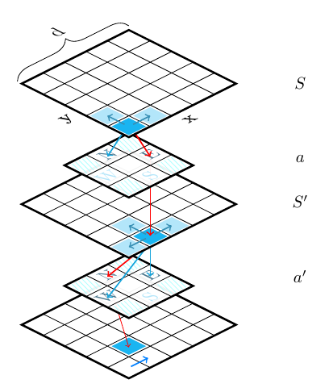
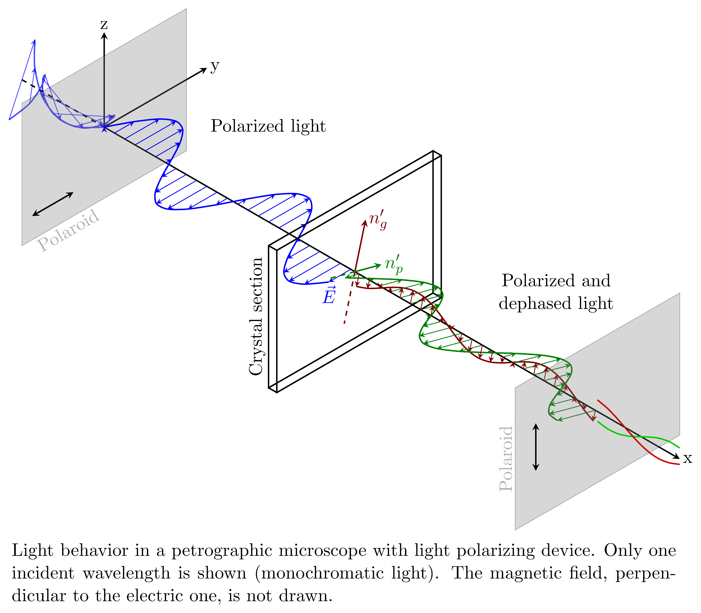

****


  * [1990-2010-arr+timeline+foreach+learn.tex](https://github.com/walmes/Tikz/blob/master/src/1990-2010-arr+timeline+foreach+learn.pgf)

`r a`
```{r}
# change pgf to tex
cat(readLines("./src/1990-2010-arr+timeline+foreach+learn.tex"), sep = "\n")
```
`r b`
****


  * [added-dots+timeline+style+text.tex](https://github.com/walmes/Tikz/blob/master/src/added-dots+timeline+style+text.pgf)

`r a`
```{r}
# change pgf to tex
cat(readLines("./src/added-dots+timeline+style+text.tex"), sep = "\n")
```
`r b`
****


  * [android_lifecycle+bloc+style+learn.tex](https://github.com/walmes/Tikz/blob/master/src/android_lifecycle+bloc+style+learn.pgf)

`r a`
```{r}
# change pgf to tex
cat(readLines("./src/android_lifecycle+bloc+style+learn.tex"), sep = "\n")
```
`r b`
****


  * [angling-text-1+timeline+foreach+learn.tex](https://github.com/walmes/Tikz/blob/master/src/angling-text-1+timeline+foreach+learn.pgf)

`r a`
```{r}
# change pgf to tex
cat(readLines("./src/angling-text-1+timeline+foreach+learn.tex"), sep = "\n")
```
`r b`
****


  * [angling-text-2+timeline+foreach+learn.tex](https://github.com/walmes/Tikz/blob/master/src/angling-text-2+timeline+foreach+learn.pgf)

`r a`
```{r}
# change pgf to tex
cat(readLines("./src/angling-text-2+timeline+foreach+learn.tex"), sep = "\n")
```
`r b`
****


  * [angling-text-3+timeline+foreach+learn.tex](https://github.com/walmes/Tikz/blob/master/src/angling-text-3+timeline+foreach+learn.pgf)

`r a`
```{r}
# change pgf to tex
cat(readLines("./src/angling-text-3+timeline+foreach+learn.tex"), sep = "\n")
```
`r b`
****


  * [annuity+timeline+foreach+learn.tex](https://github.com/walmes/Tikz/blob/master/src/annuity+timeline+foreach+learn.pgf)

`r a`
```{r}
# change pgf to tex
cat(readLines("./src/annuity+timeline+foreach+learn.tex"), sep = "\n")
```
`r b`
****


  * [arrows_to_nodes-arr+timeline+tree+scope+learn.tex](https://github.com/walmes/Tikz/blob/master/src/arrows_to_nodes-arr+timeline+tree+scope+learn.pgf)

`r a`
```{r}
# change pgf to tex
cat(readLines("./src/arrows_to_nodes-arr+timeline+tree+scope+learn.tex"), sep = "\n")
```
`r b`
****


  * [arrows-circles+timeline+pgf+set.tex](https://github.com/walmes/Tikz/blob/master/src/arrows-circles+timeline+pgf+set.pgf)

`r a`
```{r}
# change pgf to tex
cat(readLines("./src/arrows-circles+timeline+pgf+set.tex"), sep = "\n")
```
`r b`
****


  * [arrows-on-periods+timeline+foreach+style+learn.tex](https://github.com/walmes/Tikz/blob/master/src/arrows-on-periods+timeline+foreach+style+learn.pgf)

`r a`
```{r}
# change pgf to tex
cat(readLines("./src/arrows-on-periods+timeline+foreach+style+learn.tex"), sep = "\n")
```
`r b`
****


  * [auto_time_scale+timeline+foreach+pgf.tex](https://github.com/walmes/Tikz/blob/master/src/auto_time_scale+timeline+foreach+pgf.pgf)

`r a`
```{r}
# change pgf to tex
cat(readLines("./src/auto_time_scale+timeline+foreach+pgf.tex"), sep = "\n")
```
`r b`
****


  * [biographical-cornerstones-arr+timeline+style+learn+text.tex](https://github.com/walmes/Tikz/blob/master/src/biographical-cornerstones-arr+timeline+style+learn+text.pgf)

`r a`
```{r}
# change pgf to tex
cat(readLines("./src/biographical-cornerstones-arr+timeline+style+learn+text.tex"), sep = "\n")
```
`r b`
****


  * [bisectors_triangle+geometry.tex](https://github.com/walmes/Tikz/blob/master/src/bisectors_triangle+geometry.pgf)

`r a`
```{r}
# change pgf to tex
cat(readLines("./src/bisectors_triangle+geometry.tex"), sep = "\n")
```
`r b`
****


  * [block_diagram-multilayer_perceptron+neuralnet+style+learn.tex](https://github.com/walmes/Tikz/blob/master/src/block_diagram-multilayer_perceptron+neuralnet+style+learn.pgf)

`r a`
```{r}
# change pgf to tex
cat(readLines("./src/block_diagram-multilayer_perceptron+neuralnet+style+learn.tex"), sep = "\n")
```
`r b`
****


  * [block_diagram-perceptron+neuralnet+set+learn.tex](https://github.com/walmes/Tikz/blob/master/src/block_diagram-perceptron+neuralnet+set+learn.pgf)

`r a`
```{r}
# change pgf to tex
cat(readLines("./src/block_diagram-perceptron+neuralnet+set+learn.tex"), sep = "\n")
```
`r b`
****


  * [box_arrows+block.tex](https://github.com/walmes/Tikz/blob/master/src/box_arrows+block.pgf)

`r a`
```{r}
# change pgf to tex
cat(readLines("./src/box_arrows+block.tex"), sep = "\n")
```
`r b`
****


  * [brace-and-dots-arr+timeline+style+text.tex](https://github.com/walmes/Tikz/blob/master/src/brace-and-dots-arr+timeline+style+text.pgf)

`r a`
```{r}
# change pgf to tex
cat(readLines("./src/brace-and-dots-arr+timeline+style+text.tex"), sep = "\n")
```
`r b`
****


  * [bracketed-intervals+timeline+decoration.tex](https://github.com/walmes/Tikz/blob/master/src/bracketed-intervals+timeline+decoration.pgf)

`r a`
```{r}
# change pgf to tex
cat(readLines("./src/bracketed-intervals+timeline+decoration.tex"), sep = "\n")
```
`r b`
****


  * [chronology-break-arr+timeline+text+advanced.tex](https://github.com/walmes/Tikz/blob/master/src/chronology-break-arr+timeline+text+advanced.pgf)

`r a`
```{r}
# change pgf to tex
cat(readLines("./src/chronology-break-arr+timeline+text+advanced.tex"), sep = "\n")
```
`r b`
****


  * [class_diagram+block.tex](https://github.com/walmes/Tikz/blob/master/src/class_diagram+block.pgf)

`r a`
```{r}
# change pgf to tex
cat(readLines("./src/class_diagram+block.tex"), sep = "\n")
```
`r b`
****


  * [colored_custom_draw+timeline+text+pgf.tex](https://github.com/walmes/Tikz/blob/master/src/colored_custom_draw+timeline+text+pgf.pgf)

`r a`
```{r}
# change pgf to tex
cat(readLines("./src/colored_custom_draw+timeline+text+pgf.tex"), sep = "\n")
```
`r b`
****


  * [colored-periods+timeline+set+command+environment+text.tex](https://github.com/walmes/Tikz/blob/master/src/colored-periods+timeline+set+command+environment+text.pgf)

`r a`
```{r}
# change pgf to tex
cat(readLines("./src/colored-periods+timeline+set+command+environment+text.tex"), sep = "\n")
```
`r b`
****


  * [colorized_equation.tex](https://github.com/walmes/Tikz/blob/master/src/colorized_equation.pgf)

`r a`
```{r}
# change pgf to tex
cat(readLines("./src/colorized_equation.tex"), sep = "\n")
```
`r b`
****


  * [concentric-blocks.tex](https://github.com/walmes/Tikz/blob/master/src/concentric-blocks.pgf)

`r a`
```{r}
# change pgf to tex
cat(readLines("./src/concentric-blocks.tex"), sep = "\n")
```
`r b`
****


  * [cone_intersection+3d+pgf.tex](https://github.com/walmes/Tikz/blob/master/src/cone_intersection+3d+pgf.pgf)

`r a`
```{r}
# change pgf to tex
cat(readLines("./src/cone_intersection+3d+pgf.tex"), sep = "\n")
```
`r b`
****


  * [controller_system+style+learn+blocks.tex](https://github.com/walmes/Tikz/blob/master/src/controller_system+style+learn+blocks.pgf)

`r a`
```{r}
# change pgf to tex
cat(readLines("./src/controller_system+style+learn+blocks.tex"), sep = "\n")
```
`r b`
****


  * [coordinate_systems+geometry.tex](https://github.com/walmes/Tikz/blob/master/src/coordinate_systems+geometry.pgf)

`r a`
```{r}
# change pgf to tex
cat(readLines("./src/coordinate_systems+geometry.tex"), sep = "\n")
```
`r b`
****


  * [cube_color_rotated.tex](https://github.com/walmes/Tikz/blob/master/src/cube_color_rotated.pgf)

`r a`
```{r}
# change pgf to tex
cat(readLines("./src/cube_color_rotated.tex"), sep = "\n")
```
`r b`
****


  * [cube_finer_grid.tex](https://github.com/walmes/Tikz/blob/master/src/cube_finer_grid.pgf)

`r a`
```{r}
# change pgf to tex
cat(readLines("./src/cube_finer_grid.tex"), sep = "\n")
```
`r b`
****


  * [cube.tex](https://github.com/walmes/Tikz/blob/master/src/cube.pgf)

`r a`
```{r}
# change pgf to tex
cat(readLines("./src/cube.tex"), sep = "\n")
```
`r b`
****


  * [cubes_factorials.tex](https://github.com/walmes/Tikz/blob/master/src/cubes_factorials.pgf)

`r a`
```{r}
# change pgf to tex
cat(readLines("./src/cubes_factorials.tex"), sep = "\n")
```
`r b`
****


  * [cubes_isometric_shaded.tex](https://github.com/walmes/Tikz/blob/master/src/cubes_isometric_shaded.pgf)

`r a`
```{r}
# change pgf to tex
cat(readLines("./src/cubes_isometric_shaded.tex"), sep = "\n")
```
`r b`
****


  * [curves-is_lm.tex](https://github.com/walmes/Tikz/blob/master/src/curves-is_lm.pgf)

`r a`
```{r}
# change pgf to tex
cat(readLines("./src/curves-is_lm.tex"), sep = "\n")
```
`r b`
****


  * [custom-circle_with_arcs+geometry.tex](https://github.com/walmes/Tikz/blob/master/src/custom-circle_with_arcs+geometry.pgf)

`r a`
```{r}
# change pgf to tex
cat(readLines("./src/custom-circle_with_arcs+geometry.tex"), sep = "\n")
```
`r b`
****


  * [custom-three_objects.tex](https://github.com/walmes/Tikz/blob/master/src/custom-three_objects.pgf)

`r a`
```{r}
# change pgf to tex
cat(readLines("./src/custom-three_objects.tex"), sep = "\n")
```
`r b`
****


  * [custom-use_library.tex](https://github.com/walmes/Tikz/blob/master/src/custom-use_library.pgf)

`r a`
```{r}
# change pgf to tex
cat(readLines("./src/custom-use_library.tex"), sep = "\n")
```
`r b`
****


  * [cylinder-planes+3d.tex](https://github.com/walmes/Tikz/blob/master/src/cylinder-planes+3d.pgf)

`r a`
```{r}
# change pgf to tex
cat(readLines("./src/cylinder-planes+3d.tex"), sep = "\n")
```
`r b`
****


  * [cylinder+3d+foreach+function.tex](https://github.com/walmes/Tikz/blob/master/src/cylinder+3d+foreach+function.pgf)

`r a`
```{r}
# change pgf to tex
cat(readLines("./src/cylinder+3d+foreach+function.tex"), sep = "\n")
```
`r b`
****


  * [days-hours-minutes+timeline+foreach+set+multi.tex](https://github.com/walmes/Tikz/blob/master/src/days-hours-minutes+timeline+foreach+set+multi.pgf)

`r a`
```{r}
# change pgf to tex
cat(readLines("./src/days-hours-minutes+timeline+foreach+set+multi.tex"), sep = "\n")
```
`r b`
****


  * [derivatives.tex](https://github.com/walmes/Tikz/blob/master/src/derivatives.pgf)

`r a`
```{r}
# change pgf to tex
cat(readLines("./src/derivatives.tex"), sep = "\n")
```
`r b`
****


  * [diagrams-venn_diagram.tex](https://github.com/walmes/Tikz/blob/master/src/diagrams-venn_diagram.pgf)

`r a`
```{r}
# change pgf to tex
cat(readLines("./src/diagrams-venn_diagram.tex"), sep = "\n")
```
`r b`
****


  * [direction_of_arrival+block.tex](https://github.com/walmes/Tikz/blob/master/src/direction_of_arrival+block.pgf)

`r a`
```{r}
# change pgf to tex
cat(readLines("./src/direction_of_arrival+block.tex"), sep = "\n")
```
`r b`
****


  * [discriminator+neuralnet+matrix+foreach+style.tex](https://github.com/walmes/Tikz/blob/master/src/discriminator+neuralnet+matrix+foreach+style.pgf)

`r a`
```{r}
# change pgf to tex
cat(readLines("./src/discriminator+neuralnet+matrix+foreach+style.tex"), sep = "\n")
```
`r b`
****


  * [drawing_inside_box_bigger.tex](https://github.com/walmes/Tikz/blob/master/src/drawing_inside_box_bigger.pgf)

`r a`
```{r}
# change pgf to tex
cat(readLines("./src/drawing_inside_box_bigger.tex"), sep = "\n")
```
`r b`
****


  * [drawing_inside_box+block.tex](https://github.com/walmes/Tikz/blob/master/src/drawing_inside_box+block.pgf)

`r a`
```{r}
# change pgf to tex
cat(readLines("./src/drawing_inside_box+block.tex"), sep = "\n")
```
`r b`
****


  * [drawstack+block.tex](https://github.com/walmes/Tikz/blob/master/src/drawstack+block.pgf)

`r a`
```{r}
# change pgf to tex
cat(readLines("./src/drawstack+block.tex"), sep = "\n")
```
`r b`
****


  * [easy_flowchart+block.tex](https://github.com/walmes/Tikz/blob/master/src/easy_flowchart+block.pgf)

`r a`
```{r}
# change pgf to tex
cat(readLines("./src/easy_flowchart+block.tex"), sep = "\n")
```
`r b`
****


  * [ellipse_on_coords+geometry.tex](https://github.com/walmes/Tikz/blob/master/src/ellipse_on_coords+geometry.pgf)

`r a`
```{r}
# change pgf to tex
cat(readLines("./src/ellipse_on_coords+geometry.tex"), sep = "\n")
```
`r b`
****


  * [estimated-window+timeline+decoration+text.tex](https://github.com/walmes/Tikz/blob/master/src/estimated-window+timeline+decoration+text.pgf)

`r a`
```{r}
# change pgf to tex
cat(readLines("./src/estimated-window+timeline+decoration+text.tex"), sep = "\n")
```
`r b`
****


  * [euclides+geometry.tex](https://github.com/walmes/Tikz/blob/master/src/euclides+geometry.pgf)

`r a`
```{r}
# change pgf to tex
cat(readLines("./src/euclides+geometry.tex"), sep = "\n")
```
`r b`
****


  * [events-and-periods+timeline+set+command+pgf+scope.tex](https://github.com/walmes/Tikz/blob/master/src/events-and-periods+timeline+set+command+pgf+scope.pgf)

`r a`
```{r}
# change pgf to tex
cat(readLines("./src/events-and-periods+timeline+set+command+pgf+scope.tex"), sep = "\n")
```
`r b`
****


  * [filesystem_tree+block.tex](https://github.com/walmes/Tikz/blob/master/src/filesystem_tree+block.pgf)

`r a`
```{r}
# change pgf to tex
cat(readLines("./src/filesystem_tree+block.tex"), sep = "\n")
```
`r b`
****


  * [filled_curve+geometry.tex](https://github.com/walmes/Tikz/blob/master/src/filled_curve+geometry.pgf)

`r a`
```{r}
# change pgf to tex
cat(readLines("./src/filled_curve+geometry.tex"), sep = "\n")
```
`r b`
****


  * [flowchart_video.tex](https://github.com/walmes/Tikz/blob/master/src/flowchart_video.pgf)

`r a`
```{r}
# change pgf to tex
cat(readLines("./src/flowchart_video.tex"), sep = "\n")
```
`r b`
****


  * [foreach_ticks.tex](https://github.com/walmes/Tikz/blob/master/src/foreach_ticks.pgf)

`r a`
```{r}
# change pgf to tex
cat(readLines("./src/foreach_ticks.tex"), sep = "\n")
```
`r b`
****


  * [foreach-10_circles.tex](https://github.com/walmes/Tikz/blob/master/src/foreach-10_circles.pgf)

`r a`
```{r}
# change pgf to tex
cat(readLines("./src/foreach-10_circles.tex"), sep = "\n")
```
`r b`
****


  * [foreach-axes_ticks.tex](https://github.com/walmes/Tikz/blob/master/src/foreach-axes_ticks.pgf)

`r a`
```{r}
# change pgf to tex
cat(readLines("./src/foreach-axes_ticks.tex"), sep = "\n")
```
`r b`
****


  * [foreach-circular_arrows.tex](https://github.com/walmes/Tikz/blob/master/src/foreach-circular_arrows.pgf)

`r a`
```{r}
# change pgf to tex
cat(readLines("./src/foreach-circular_arrows.tex"), sep = "\n")
```
`r b`
****


  * [foreach-draw_ticks.tex](https://github.com/walmes/Tikz/blob/master/src/foreach-draw_ticks.pgf)

`r a`
```{r}
# change pgf to tex
cat(readLines("./src/foreach-draw_ticks.tex"), sep = "\n")
```
`r b`
****


  * [foreach-equation.tex](https://github.com/walmes/Tikz/blob/master/src/foreach-equation.pgf)

`r a`
```{r}
# change pgf to tex
cat(readLines("./src/foreach-equation.tex"), sep = "\n")
```
`r b`
****


  * [foreach-geometric_representation.tex](https://github.com/walmes/Tikz/blob/master/src/foreach-geometric_representation.pgf)

`r a`
```{r}
# change pgf to tex
cat(readLines("./src/foreach-geometric_representation.tex"), sep = "\n")
```
`r b`
****


  * [foreach-grid_RBG-3d-7x7.tex](https://github.com/walmes/Tikz/blob/master/src/foreach-grid_RBG-3d-7x7.pgf)

`r a`
```{r}
# change pgf to tex
cat(readLines("./src/foreach-grid_RBG-3d-7x7.tex"), sep = "\n")
```
`r b`
****


  * [foreach-grid_RBG-3d.tex](https://github.com/walmes/Tikz/blob/master/src/foreach-grid_RBG-3d.pgf)

`r a`
```{r}
# change pgf to tex
cat(readLines("./src/foreach-grid_RBG-3d.tex"), sep = "\n")
```
`r b`
****


  * [foreach-grid_RBG.tex](https://github.com/walmes/Tikz/blob/master/src/foreach-grid_RBG.pgf)

`r a`
```{r}
# change pgf to tex
cat(readLines("./src/foreach-grid_RBG.tex"), sep = "\n")
```
`r b`
****


  * [foreach-neural_network-1h+neuralnet.tex](https://github.com/walmes/Tikz/blob/master/src/foreach-neural_network-1h+neuralnet.pgf)

`r a`
```{r}
# change pgf to tex
cat(readLines("./src/foreach-neural_network-1h+neuralnet.tex"), sep = "\n")
```
`r b`
****


  * [foreach-paper_folding.tex](https://github.com/walmes/Tikz/blob/master/src/foreach-paper_folding.pgf)

`r a`
```{r}
# change pgf to tex
cat(readLines("./src/foreach-paper_folding.tex"), sep = "\n")
```
`r b`
****


  * [foreach-poincare_diagram.tex](https://github.com/walmes/Tikz/blob/master/src/foreach-poincare_diagram.pgf)

`r a`
```{r}
# change pgf to tex
cat(readLines("./src/foreach-poincare_diagram.tex"), sep = "\n")
```
`r b`
****


  * [foreach-radix_signal_flow.tex](https://github.com/walmes/Tikz/blob/master/src/foreach-radix_signal_flow.pgf)

`r a`
```{r}
# change pgf to tex
cat(readLines("./src/foreach-radix_signal_flow.tex"), sep = "\n")
```
`r b`
****


  * [foreach-time_evolution.tex](https://github.com/walmes/Tikz/blob/master/src/foreach-time_evolution.pgf)

`r a`
```{r}
# change pgf to tex
cat(readLines("./src/foreach-time_evolution.tex"), sep = "\n")
```
`r b`
****


  * [foreach-trigonometric_circle.tex](https://github.com/walmes/Tikz/blob/master/src/foreach-trigonometric_circle.pgf)

`r a`
```{r}
# change pgf to tex
cat(readLines("./src/foreach-trigonometric_circle.tex"), sep = "\n")
```
`r b`
****


  * [generative_adversarial_network_manual_net+neuralnet.tex](https://github.com/walmes/Tikz/blob/master/src/generative_adversarial_network_manual_net+neuralnet.pgf)

`r a`
```{r}
# change pgf to tex
cat(readLines("./src/generative_adversarial_network_manual_net+neuralnet.tex"), sep = "\n")
```
`r b`
****


  * [generator+neuralnet+matrix.tex](https://github.com/walmes/Tikz/blob/master/src/generator+neuralnet+matrix.pgf)

`r a`
```{r}
# change pgf to tex
cat(readLines("./src/generator+neuralnet+matrix.tex"), sep = "\n")
```
`r b`
****


  * [git_dataflow+block.tex](https://github.com/walmes/Tikz/blob/master/src/git_dataflow+block.pgf)

`r a`
```{r}
# change pgf to tex
cat(readLines("./src/git_dataflow+block.tex"), sep = "\n")
```
`r b`
****


  * [git_workflow+block.tex](https://github.com/walmes/Tikz/blob/master/src/git_workflow+block.pgf)

`r a`
```{r}
# change pgf to tex
cat(readLines("./src/git_workflow+block.tex"), sep = "\n")
```
`r b`
****


  * [grided_circle+geometry.tex](https://github.com/walmes/Tikz/blob/master/src/grided_circle+geometry.pgf)

`r a`
```{r}
# change pgf to tex
cat(readLines("./src/grided_circle+geometry.tex"), sep = "\n")
```
`r b`
****


  * [half_circle+geometry.tex](https://github.com/walmes/Tikz/blob/master/src/half_circle+geometry.pgf)

`r a`
```{r}
# change pgf to tex
cat(readLines("./src/half_circle+geometry.tex"), sep = "\n")
```
`r b`
****


  * [helpme+block.tex](https://github.com/walmes/Tikz/blob/master/src/helpme+block.pgf)

`r a`
```{r}
# change pgf to tex
cat(readLines("./src/helpme+block.tex"), sep = "\n")
```
`r b`
****


  * [hopfield_auto_net+neuralnet+foreach+scope+learn+style+command.tex](https://github.com/walmes/Tikz/blob/master/src/hopfield_auto_net+neuralnet+foreach+scope+learn+style+command.pgf)

`r a`
```{r}
# change pgf to tex
cat(readLines("./src/hopfield_auto_net+neuralnet+foreach+scope+learn+style+command.tex"), sep = "\n")
```
`r b`
****


  * [inertial_system_color+block.tex](https://github.com/walmes/Tikz/blob/master/src/inertial_system_color+block.pgf)

`r a`
```{r}
# change pgf to tex
cat(readLines("./src/inertial_system_color+block.tex"), sep = "\n")
```
`r b`
****


  * [intersection+geometry.tex](https://github.com/walmes/Tikz/blob/master/src/intersection+geometry.pgf)

`r a`
```{r}
# change pgf to tex
cat(readLines("./src/intersection+geometry.tex"), sep = "\n")
```
`r b`
****


  * [intersections-9000+geometry.tex](https://github.com/walmes/Tikz/blob/master/src/intersections-9000+geometry.pgf)

`r a`
```{r}
# change pgf to tex
cat(readLines("./src/intersections-9000+geometry.tex"), sep = "\n")
```
`r b`
****


  * [io-fit+block.tex](https://github.com/walmes/Tikz/blob/master/src/io-fit+block.pgf)

`r a`
```{r}
# change pgf to tex
cat(readLines("./src/io-fit+block.tex"), sep = "\n")
```
`r b`
****


  * [iotex+block.tex](https://github.com/walmes/Tikz/blob/master/src/iotex+block.pgf)

`r a`
```{r}
# change pgf to tex
cat(readLines("./src/iotex+block.tex"), sep = "\n")
```
`r b`
****


  * [kalman+block.tex](https://github.com/walmes/Tikz/blob/master/src/kalman+block.pgf)

`r a`
```{r}
# change pgf to tex
cat(readLines("./src/kalman+block.tex"), sep = "\n")
```
`r b`
****


  * [labs_class+block.tex](https://github.com/walmes/Tikz/blob/master/src/labs_class+block.pgf)

`r a`
```{r}
# change pgf to tex
cat(readLines("./src/labs_class+block.tex"), sep = "\n")
```
`r b`
****


  * [linear-regression+geometry.tex](https://github.com/walmes/Tikz/blob/master/src/linear-regression+geometry.pgf)

`r a`
```{r}
# change pgf to tex
cat(readLines("./src/linear-regression+geometry.tex"), sep = "\n")
```
`r b`
****


  * [long-labels-enumitem+timeline+text+style+foreach.tex](https://github.com/walmes/Tikz/blob/master/src/long-labels-enumitem+timeline+text+style+foreach.pgf)

`r a`
```{r}
# change pgf to tex
cat(readLines("./src/long-labels-enumitem+timeline+text+style+foreach.tex"), sep = "\n")
```
`r b`
****


  * [long-labels+timeline+text+learn.tex](https://github.com/walmes/Tikz/blob/master/src/long-labels+timeline+text+learn.pgf)

`r a`
```{r}
# change pgf to tex
cat(readLines("./src/long-labels+timeline+text+learn.tex"), sep = "\n")
```
`r b`
****


  * [long-text+timeline+text+foreach.tex](https://github.com/walmes/Tikz/blob/master/src/long-text+timeline+text+foreach.pgf)

`r a`
```{r}
# change pgf to tex
cat(readLines("./src/long-text+timeline+text+foreach.tex"), sep = "\n")
```
`r b`
****


  * [louvre-planes.tex](https://github.com/walmes/Tikz/blob/master/src/louvre-planes.pgf)

`r a`
```{r}
# change pgf to tex
cat(readLines("./src/louvre-planes.tex"), sep = "\n")
```
`r b`
****


  * [magnification+geometry.tex](https://github.com/walmes/Tikz/blob/master/src/magnification+geometry.pgf)

`r a`
```{r}
# change pgf to tex
cat(readLines("./src/magnification+geometry.tex"), sep = "\n")
```
`r b`
****


  * [mammography_bayes+block.tex](https://github.com/walmes/Tikz/blob/master/src/mammography_bayes+block.pgf)

`r a`
```{r}
# change pgf to tex
cat(readLines("./src/mammography_bayes+block.tex"), sep = "\n")
```
`r b`
****


  * [mapper-reducer.tex](https://github.com/walmes/Tikz/blob/master/src/mapper-reducer.pgf)

`r a`
```{r}
# change pgf to tex
cat(readLines("./src/mapper-reducer.tex"), sep = "\n")
```
`r b`
****


  * [market_sector+block.tex](https://github.com/walmes/Tikz/blob/master/src/market_sector+block.pgf)

`r a`
```{r}
# change pgf to tex
cat(readLines("./src/market_sector+block.tex"), sep = "\n")
```
`r b`
****


  * [matrix-as_nodes.tex](https://github.com/walmes/Tikz/blob/master/src/matrix-as_nodes.pgf)

`r a`
```{r}
# change pgf to tex
cat(readLines("./src/matrix-as_nodes.tex"), sep = "\n")
```
`r b`
****


  * [matrix-highlighting.tex](https://github.com/walmes/Tikz/blob/master/src/matrix-highlighting.pgf)

`r a`
```{r}
# change pgf to tex
cat(readLines("./src/matrix-highlighting.tex"), sep = "\n")
```
`r b`
****


  * [matrix-product.tex](https://github.com/walmes/Tikz/blob/master/src/matrix-product.pgf)

`r a`
```{r}
# change pgf to tex
cat(readLines("./src/matrix-product.tex"), sep = "\n")
```
`r b`
****


  * [mesh_plot+3d+pgf+function.tex](https://github.com/walmes/Tikz/blob/master/src/mesh_plot+3d+pgf+function.pgf)

`r a`
```{r}
# change pgf to tex
cat(readLines("./src/mesh_plot+3d+pgf+function.tex"), sep = "\n")
```
`r b`
****


  * [ml_1h_manual_net+neuralnet+style+matrix+foreach.tex](https://github.com/walmes/Tikz/blob/master/src/ml_1h_manual_net+neuralnet+style+matrix+foreach.pgf)

`r a`
```{r}
# change pgf to tex
cat(readLines("./src/ml_1h_manual_net+neuralnet+style+matrix+foreach.tex"), sep = "\n")
```
`r b`
****


  * [ml_2h_manual_net-color+neuralnet+set+foreach.tex](https://github.com/walmes/Tikz/blob/master/src/ml_2h_manual_net-color+neuralnet+set+foreach.pgf)

`r a`
```{r}
# change pgf to tex
cat(readLines("./src/ml_2h_manual_net-color+neuralnet+set+foreach.tex"), sep = "\n")
```
`r b`
****


  * [ml_a3c_manual_net_arr+neuralnet.tex](https://github.com/walmes/Tikz/blob/master/src/ml_a3c_manual_net_arr+neuralnet.pgf)

`r a`
```{r}
# change pgf to tex
cat(readLines("./src/ml_a3c_manual_net_arr+neuralnet.tex"), sep = "\n")
```
`r b`
****


  * [ml_auto_net_arr+neuralnet+foreach+style+foreach.tex](https://github.com/walmes/Tikz/blob/master/src/ml_auto_net_arr+neuralnet+foreach+style+foreach.pgf)

`r a`
```{r}
# change pgf to tex
cat(readLines("./src/ml_auto_net_arr+neuralnet+foreach+style+foreach.tex"), sep = "\n")
```
`r b`
****


  * [ml-auto_net_4h_arr+neuralnet+matrix+foreach+style+scope.tex](https://github.com/walmes/Tikz/blob/master/src/ml-auto_net_4h_arr+neuralnet+matrix+foreach+style+scope.pgf)

`r a`
```{r}
# change pgf to tex
cat(readLines("./src/ml-auto_net_4h_arr+neuralnet+matrix+foreach+style+scope.tex"), sep = "\n")
```
`r b`
****


  * [ml-auto_net_bias_arr+neuralnet+learn+foreach+def+command+ifnum+style.tex](https://github.com/walmes/Tikz/blob/master/src/ml-auto_net_bias_arr+neuralnet+learn+foreach+def+command+ifnum+style.pgf)

`r a`
```{r}
# change pgf to tex
cat(readLines("./src/ml-auto_net_bias_arr+neuralnet+learn+foreach+def+command+ifnum+style.tex"), sep = "\n")
```
`r b`
****


  * [ml-auto_net_color+neuralnet+foreach.tex](https://github.com/walmes/Tikz/blob/master/src/ml-auto_net_color+neuralnet+foreach.pgf)

`r a`
```{r}
# change pgf to tex
cat(readLines("./src/ml-auto_net_color+neuralnet+foreach.tex"), sep = "\n")
```
`r b`
****


  * [ml-auto_net_icon+neuralnet+style+foreach+set+function+learn.tex](https://github.com/walmes/Tikz/blob/master/src/ml-auto_net_icon+neuralnet+style+foreach+set+function+learn.pgf)

`r a`
```{r}
# change pgf to tex
cat(readLines("./src/ml-auto_net_icon+neuralnet+style+foreach+set+function+learn.tex"), sep = "\n")
```
`r b`
****


  * [ml-SVM_manual+neuralnet.tex](https://github.com/walmes/Tikz/blob/master/src/ml-SVM_manual+neuralnet.pgf)

`r a`
```{r}
# change pgf to tex
cat(readLines("./src/ml-SVM_manual+neuralnet.tex"), sep = "\n")
```
`r b`
****



  * [multidimensional-array-inclined.tex](https://github.com/walmes/Tikz/blob/master/src/multidimensional-array-inclined.pgf)

`r a`
```{r}
# change pgf to tex
cat(readLines("./src/multidimensional-array-inclined.tex"), sep = "\n")
```
`r b`
****



  * [multidimensional-array.tex](https://github.com/walmes/Tikz/blob/master/src/multidimensional-array.pgf)

`r a`
```{r}
# change pgf to tex
cat(readLines("./src/multidimensional-array.tex"), sep = "\n")
```
`r b`
****


  * [multiple_block_connections-101+block.tex](https://github.com/walmes/Tikz/blob/master/src/multiple_block_connections-101+block.pgf)

`r a`
```{r}
# change pgf to tex
cat(readLines("./src/multiple_block_connections-101+block.tex"), sep = "\n")
```
`r b`
****


  * [multiple_blocks_interconnection+block.tex](https://github.com/walmes/Tikz/blob/master/src/multiple_blocks_interconnection+block.pgf)

`r a`
```{r}
# change pgf to tex
cat(readLines("./src/multiple_blocks_interconnection+block.tex"), sep = "\n")
```
`r b`
****


  * [multiple-lines+timeline+set+pgf+foreach+command+scope+text.tex](https://github.com/walmes/Tikz/blob/master/src/multiple-lines+timeline+set+pgf+foreach+command+scope+text.pgf)

`r a`
```{r}
# change pgf to tex
cat(readLines("./src/multiple-lines+timeline+set+pgf+foreach+command+scope+text.tex"), sep = "\n")
```
`r b`
****


  * [nested+block.tex](https://github.com/walmes/Tikz/blob/master/src/nested+block.pgf)

`r a`
```{r}
# change pgf to tex
cat(readLines("./src/nested+block.tex"), sep = "\n")
```
`r b`
****


  * [network-complex-networks-only-layer1.tex](https://github.com/walmes/Tikz/blob/master/src/network-complex-networks-only-layer1.pgf)

`r a`
```{r}
# change pgf to tex
cat(readLines("./src/network-complex-networks-only-layer1.tex"), sep = "\n")
```
`r b`
****


  * [network-complex-networks.tex](https://github.com/walmes/Tikz/blob/master/src/network-complex-networks.pgf)

`r a`
```{r}
# change pgf to tex
cat(readLines("./src/network-complex-networks.tex"), sep = "\n")
```
`r b`
****


  * [network-ex_doc_4-13.tex](https://github.com/walmes/Tikz/blob/master/src/network-ex_doc_4-13.pgf)

`r a`
```{r}
# change pgf to tex
cat(readLines("./src/network-ex_doc_4-13.tex"), sep = "\n")
```
`r b`
****


  * [network-layers-and-layouts.tex](https://github.com/walmes/Tikz/blob/master/src/network-layers-and-layouts.pgf)

`r a`
```{r}
# change pgf to tex
cat(readLines("./src/network-layers-and-layouts.tex"), sep = "\n")
```
`r b`
****


  * [network-multilayer.tex](https://github.com/walmes/Tikz/blob/master/src/network-multilayer.pgf)

`r a`
```{r}
# change pgf to tex
cat(readLines("./src/network-multilayer.tex"), sep = "\n")
```
`r b`
****


  * [network-read-csv.tex](https://github.com/walmes/Tikz/blob/master/src/network-read-csv.pgf)

`r a`
```{r}
# change pgf to tex
cat(readLines("./src/network-read-csv.tex"), sep = "\n")
```
`r b`
****


  * [nn-01-2_summarized+neuralnet+style+learn.tex](https://github.com/walmes/Tikz/blob/master/src/nn-01-2_summarized+neuralnet+style+learn.pgf)

`r a`
```{r}
# change pgf to tex
cat(readLines("./src/nn-01-2_summarized+neuralnet+style+learn.tex"), sep = "\n")
```
`r b`
****


  * [nn-02_auto_net+neuralnet+foreach+pgf+style+learn.tex](https://github.com/walmes/Tikz/blob/master/src/nn-02_auto_net+neuralnet+foreach+pgf+style+learn.pgf)

`r a`
```{r}
# change pgf to tex
cat(readLines("./src/nn-02_auto_net+neuralnet+foreach+pgf+style+learn.tex"), sep = "\n")
```
`r b`
****


  * [nn-03_auto_net+neuralnet+foreach+style+learn.tex](https://github.com/walmes/Tikz/blob/master/src/nn-03_auto_net+neuralnet+foreach+style+learn.pgf)

`r a`
```{r}
# change pgf to tex
cat(readLines("./src/nn-03_auto_net+neuralnet+foreach+style+learn.tex"), sep = "\n")
```
`r b`
****


  * [nn-04_auto_net+neuralnet+matrix+style+foreach.tex](https://github.com/walmes/Tikz/blob/master/src/nn-04_auto_net+neuralnet+matrix+style+foreach.pgf)

`r a`
```{r}
# change pgf to tex
cat(readLines("./src/nn-04_auto_net+neuralnet+matrix+style+foreach.tex"), sep = "\n")
```
`r b`
****


  * [nn-05_auto_net_arr+neuralnet+style+foreach+learn.tex](https://github.com/walmes/Tikz/blob/master/src/nn-05_auto_net_arr+neuralnet+style+foreach+learn.pgf)

`r a`
```{r}
# change pgf to tex
cat(readLines("./src/nn-05_auto_net_arr+neuralnet+style+foreach+learn.tex"), sep = "\n")
```
`r b`
****


  * [nn-06_manual_net_color+neuralnet+foreach+style.tex](https://github.com/walmes/Tikz/blob/master/src/nn-06_manual_net_color+neuralnet+foreach+style.pgf)

`r a`
```{r}
# change pgf to tex
cat(readLines("./src/nn-06_manual_net_color+neuralnet+foreach+style.tex"), sep = "\n")
```
`r b`
****


  * [nn-08-tkz-berge-01+neuralnet+scope+foreach+pkg.tex](https://github.com/walmes/Tikz/blob/master/src/nn-08-tkz-berge-01+neuralnet+scope+foreach+pkg.pgf)

`r a`
```{r}
# change pgf to tex
cat(readLines("./src/nn-08-tkz-berge-01+neuralnet+scope+foreach+pkg.tex"), sep = "\n")
```
`r b`
****


  * [nn-09_manual_net+neuralnet+foreach+scope.tex](https://github.com/walmes/Tikz/blob/master/src/nn-09_manual_net+neuralnet+foreach+scope.pgf)

`r a`
```{r}
# change pgf to tex
cat(readLines("./src/nn-09_manual_net+neuralnet+foreach+scope.tex"), sep = "\n")
```
`r b`
****


  * [node_connector+block.tex](https://github.com/walmes/Tikz/blob/master/src/node_connector+block.pgf)

`r a`
```{r}
# change pgf to tex
cat(readLines("./src/node_connector+block.tex"), sep = "\n")
```
`r b`
****


  * [noise+block.tex](https://github.com/walmes/Tikz/blob/master/src/noise+block.pgf)

`r a`
```{r}
# change pgf to tex
cat(readLines("./src/noise+block.tex"), sep = "\n")
```
`r b`
****



  * [ocean.tex](https://github.com/walmes/Tikz/blob/master/src/ocean.pgf)

`r a`
```{r}
# change pgf to tex
cat(readLines("./src/ocean.tex"), sep = "\n")
```
`r b`
****


  * [physics-arrows_to_nodes.tex](https://github.com/walmes/Tikz/blob/master/src/physics-arrows_to_nodes.pgf)

`r a`
```{r}
# change pgf to tex
cat(readLines("./src/physics-arrows_to_nodes.tex"), sep = "\n")
```
`r b`
****


  * [physics-axes3D.tex](https://github.com/walmes/Tikz/blob/master/src/physics-axes3D.pgf)

`r a`
```{r}
# change pgf to tex
cat(readLines("./src/physics-axes3D.tex"), sep = "\n")
```
`r b`
****


  * [physics-curves-frequency_modulation.tex](https://github.com/walmes/Tikz/blob/master/src/physics-curves-frequency_modulation.pgf)

`r a`
```{r}
# change pgf to tex
cat(readLines("./src/physics-curves-frequency_modulation.tex"), sep = "\n")
```
`r b`
****


  * [physics-diagram-handshake.tex](https://github.com/walmes/Tikz/blob/master/src/physics-diagram-handshake.pgf)

`r a`
```{r}
# change pgf to tex
cat(readLines("./src/physics-diagram-handshake.tex"), sep = "\n")
```
`r b`
****


  * [physics-electromagnetic_wave.tex](https://github.com/walmes/Tikz/blob/master/src/physics-electromagnetic_wave.pgf)

`r a`
```{r}
# change pgf to tex
cat(readLines("./src/physics-electromagnetic_wave.tex"), sep = "\n")
```
`r b`
****


  * [physics-example_atom.tex](https://github.com/walmes/Tikz/blob/master/src/physics-example_atom.pgf)

`r a`
```{r}
# change pgf to tex
cat(readLines("./src/physics-example_atom.tex"), sep = "\n")
```
`r b`
****


  * [physics-functions.tex](https://github.com/walmes/Tikz/blob/master/src/physics-functions.pgf)

`r a`
```{r}
# change pgf to tex
cat(readLines("./src/physics-functions.tex"), sep = "\n")
```
`r b`
****


  * [physics-hyperbola.tex](https://github.com/walmes/Tikz/blob/master/src/physics-hyperbola.pgf)

`r a`
```{r}
# change pgf to tex
cat(readLines("./src/physics-hyperbola.tex"), sep = "\n")
```
`r b`
****


  * [physics-jet-cones.tex](https://github.com/walmes/Tikz/blob/master/src/physics-jet-cones.pgf)

`r a`
```{r}
# change pgf to tex
cat(readLines("./src/physics-jet-cones.tex"), sep = "\n")
```
`r b`
****


  * [physics-particles_table.tex](https://github.com/walmes/Tikz/blob/master/src/physics-particles_table.pgf)

`r a`
```{r}
# change pgf to tex
cat(readLines("./src/physics-particles_table.tex"), sep = "\n")
```
`r b`
****


  * [physics-simulation_abstraction.tex](https://github.com/walmes/Tikz/blob/master/src/physics-simulation_abstraction.pgf)

`r a`
```{r}
# change pgf to tex
cat(readLines("./src/physics-simulation_abstraction.tex"), sep = "\n")
```
`r b`
****


  * [physics-solenoid.tex](https://github.com/walmes/Tikz/blob/master/src/physics-solenoid.pgf)

`r a`
```{r}
# change pgf to tex
cat(readLines("./src/physics-solenoid.tex"), sep = "\n")
```
`r b`
****


  * [physics-tau_decay_signatures.tex](https://github.com/walmes/Tikz/blob/master/src/physics-tau_decay_signatures.pgf)

`r a`
```{r}
# change pgf to tex
cat(readLines("./src/physics-tau_decay_signatures.tex"), sep = "\n")
```
`r b`
****


  * [pirates-games.tex](https://github.com/walmes/Tikz/blob/master/src/pirates-games.pgf)

`r a`
```{r}
# change pgf to tex
cat(readLines("./src/pirates-games.tex"), sep = "\n")
```
`r b`
****



  * [polarization+3d+foreach.tex](https://github.com/walmes/Tikz/blob/master/src/polarization+3d+foreach.pgf)

`r a`
```{r}
# change pgf to tex
cat(readLines("./src/polarization+3d+foreach.tex"), sep = "\n")
```
`r b`
****


  * [porter_model+block.tex](https://github.com/walmes/Tikz/blob/master/src/porter_model+block.pgf)

`r a`
```{r}
# change pgf to tex
cat(readLines("./src/porter_model+block.tex"), sep = "\n")
```
`r b`
****


  * [read-data+timeline+fileio+pgf+foreach+text.tex](https://github.com/walmes/Tikz/blob/master/src/read-data+timeline+fileio+pgf+foreach+text.pgf)

`r a`
```{r}
# change pgf to tex
cat(readLines("./src/read-data+timeline+fileio+pgf+foreach+text.tex"), sep = "\n")
```
`r b`
****


  * [regression+geometry.tex](https://github.com/walmes/Tikz/blob/master/src/regression+geometry.pgf)

`r a`
```{r}
# change pgf to tex
cat(readLines("./src/regression+geometry.tex"), sep = "\n")
```
`r b`
****


  * [report_diagrams.tex](https://github.com/walmes/Tikz/blob/master/src/report_diagrams.pgf)

`r a`
```{r}
# change pgf to tex
cat(readLines("./src/report_diagrams.tex"), sep = "\n")
```
`r b`
****


  * [rotated-labels+timeline+foreach+text+set+learn.tex](https://github.com/walmes/Tikz/blob/master/src/rotated-labels+timeline+foreach+text+set+learn.pgf)

`r a`
```{r}
# change pgf to tex
cat(readLines("./src/rotated-labels+timeline+foreach+text+set+learn.tex"), sep = "\n")
```
`r b`
****


  * [rounded-box-arr+timeline+pgf+style+foreach+learn.tex](https://github.com/walmes/Tikz/blob/master/src/rounded-box-arr+timeline+pgf+style+foreach+learn.pgf)

`r a`
```{r}
# change pgf to tex
cat(readLines("./src/rounded-box-arr+timeline+pgf+style+foreach+learn.tex"), sep = "\n")
```
`r b`
****


  * [scenario_tree+block.tex](https://github.com/walmes/Tikz/blob/master/src/scenario_tree+block.pgf)

`r a`
```{r}
# change pgf to tex
cat(readLines("./src/scenario_tree+block.tex"), sep = "\n")
```
`r b`
****


  * [seismic_focal_mechanism+3d+set+foreach+eng.tex](https://github.com/walmes/Tikz/blob/master/src/seismic_focal_mechanism+3d+set+foreach+eng.pgf)

`r a`
```{r}
# change pgf to tex
cat(readLines("./src/seismic_focal_mechanism+3d+set+foreach+eng.tex"), sep = "\n")
```
`r b`
****


  * [server_player+block.tex](https://github.com/walmes/Tikz/blob/master/src/server_player+block.pgf)

`r a`
```{r}
# change pgf to tex
cat(readLines("./src/server_player+block.tex"), sep = "\n")
```
`r b`
****


  * [shading_regions+geometry.tex](https://github.com/walmes/Tikz/blob/master/src/shading_regions+geometry.pgf)

`r a`
```{r}
# change pgf to tex
cat(readLines("./src/shading_regions+geometry.tex"), sep = "\n")
```
`r b`
****


  * [simple_project+timeline+text+foreach+learn.tex](https://github.com/walmes/Tikz/blob/master/src/simple_project+timeline+text+foreach+learn.pgf)

`r a`
```{r}
# change pgf to tex
cat(readLines("./src/simple_project+timeline+text+foreach+learn.tex"), sep = "\n")
```
`r b`
****


  * [simple-right+block.tex](https://github.com/walmes/Tikz/blob/master/src/simple-right+block.pgf)

`r a`
```{r}
# change pgf to tex
cat(readLines("./src/simple-right+block.tex"), sep = "\n")
```
`r b`
****


  * [simple-wrong+block.tex](https://github.com/walmes/Tikz/blob/master/src/simple-wrong+block.pgf)

`r a`
```{r}
# change pgf to tex
cat(readLines("./src/simple-wrong+block.tex"), sep = "\n")
```
`r b`
****


  * [simple+timeline+foreach+snake+decoration+learn.tex](https://github.com/walmes/Tikz/blob/master/src/simple+timeline+foreach+snake+decoration+learn.pgf)

`r a`
```{r}
# change pgf to tex
cat(readLines("./src/simple+timeline+foreach+snake+decoration+learn.tex"), sep = "\n")
```
`r b`
****


  * [snake_frames_and_arrows+timeline+figure+foreach.tex](https://github.com/walmes/Tikz/blob/master/src/snake_frames_and_arrows+timeline+figure+foreach.pgf)

`r a`
```{r}
# change pgf to tex
cat(readLines("./src/snake_frames_and_arrows+timeline+figure+foreach.tex"), sep = "\n")
```
`r b`
****


  * [snake_timescale+physics+timeline+def+foreach+multi+learn.tex](https://github.com/walmes/Tikz/blob/master/src/snake_timescale+physics+timeline+def+foreach+multi+learn.pgf)

`r a`
```{r}
# change pgf to tex
cat(readLines("./src/snake_timescale+physics+timeline+def+foreach+multi+learn.tex"), sep = "\n")
```
`r b`
****


  * [stacked_blocks+neuralnet+3d+def+pgf+set+style.tex](https://github.com/walmes/Tikz/blob/master/src/stacked_blocks+neuralnet+3d+def+pgf+set+style.pgf)

`r a`
```{r}
# change pgf to tex
cat(readLines("./src/stacked_blocks+neuralnet+3d+def+pgf+set+style.tex"), sep = "\n")
```
`r b`
****


  * [stacked+block.tex](https://github.com/walmes/Tikz/blob/master/src/stacked+block.pgf)

`r a`
```{r}
# change pgf to tex
cat(readLines("./src/stacked+block.tex"), sep = "\n")
```
`r b`
****


  * [steps+block.tex](https://github.com/walmes/Tikz/blob/master/src/steps+block.pgf)

`r a`
```{r}
# change pgf to tex
cat(readLines("./src/steps+block.tex"), sep = "\n")
```
`r b`
****


  * [supreme_court-2+block.tex](https://github.com/walmes/Tikz/blob/master/src/supreme_court-2+block.pgf)

`r a`
```{r}
# change pgf to tex
cat(readLines("./src/supreme_court-2+block.tex"), sep = "\n")
```
`r b`
****


  * [supreme_court+block.tex](https://github.com/walmes/Tikz/blob/master/src/supreme_court+block.pgf)

`r a`
```{r}
# change pgf to tex
cat(readLines("./src/supreme_court+block.tex"), sep = "\n")
```
`r b`
****


  * [system_measurement_model+block.tex](https://github.com/walmes/Tikz/blob/master/src/system_measurement_model+block.pgf)

`r a`
```{r}
# change pgf to tex
cat(readLines("./src/system_measurement_model+block.tex"), sep = "\n")
```
`r b`
****


  * [t-delta-t+timeline+text+decoration.tex](https://github.com/walmes/Tikz/blob/master/src/t-delta-t+timeline+text+decoration.pgf)

`r a`
```{r}
# change pgf to tex
cat(readLines("./src/t-delta-t+timeline+text+decoration.tex"), sep = "\n")
```
`r b`
****


  * [tikz-01+geometry.tex](https://github.com/walmes/Tikz/blob/master/src/tikz-01+geometry.pgf)

`r a`
```{r}
# change pgf to tex
cat(readLines("./src/tikz-01+geometry.tex"), sep = "\n")
```
`r b`
****


  * [tikz-02+geometry.tex](https://github.com/walmes/Tikz/blob/master/src/tikz-02+geometry.pgf)

`r a`
```{r}
# change pgf to tex
cat(readLines("./src/tikz-02+geometry.tex"), sep = "\n")
```
`r b`
****


  * [timeline+physics+timeline+def+foreach+multi+learn.tex](https://github.com/walmes/Tikz/blob/master/src/timeline+physics+timeline+def+foreach+multi+learn.pgf)

`r a`
```{r}
# change pgf to tex
cat(readLines("./src/timeline+physics+timeline+def+foreach+multi+learn.tex"), sep = "\n")
```
`r b`
****


  * [tkz-03+geometry.tex](https://github.com/walmes/Tikz/blob/master/src/tkz-03+geometry.pgf)

`r a`
```{r}
# change pgf to tex
cat(readLines("./src/tkz-03+geometry.tex"), sep = "\n")
```
`r b`
****


  * [torus+function+3d.tex](https://github.com/walmes/Tikz/blob/master/src/torus+function+3d.pgf)

`r a`
```{r}
# change pgf to tex
cat(readLines("./src/torus+function+3d.tex"), sep = "\n")
```
`r b`
****


  * [tow-lined-braces+timeline+command+text+foreach+tabular+learn.tex](https://github.com/walmes/Tikz/blob/master/src/tow-lined-braces+timeline+command+text+foreach+tabular+learn.pgf)

`r a`
```{r}
# change pgf to tex
cat(readLines("./src/tow-lined-braces+timeline+command+text+foreach+tabular+learn.tex"), sep = "\n")
```
`r b`
****


  * [trapezium+geometry.tex](https://github.com/walmes/Tikz/blob/master/src/trapezium+geometry.pgf)

`r a`
```{r}
# change pgf to tex
cat(readLines("./src/trapezium+geometry.tex"), sep = "\n")
```
`r b`
****


  * [tree-networked_game.tex](https://github.com/walmes/Tikz/blob/master/src/tree-networked_game.pgf)

`r a`
```{r}
# change pgf to tex
cat(readLines("./src/tree-networked_game.tex"), sep = "\n")
```
`r b`
****


  * [two_courses_horizontal+timeline+foreach+learn.tex](https://github.com/walmes/Tikz/blob/master/src/two_courses_horizontal+timeline+foreach+learn.pgf)

`r a`
```{r}
# change pgf to tex
cat(readLines("./src/two_courses_horizontal+timeline+foreach+learn.tex"), sep = "\n")
```
`r b`
****


  * [vertical-multiple-on-year+timeline+text+environment+command+learn.tex](https://github.com/walmes/Tikz/blob/master/src/vertical-multiple-on-year+timeline+text+environment+command+learn.pgf)

`r a`
```{r}
# change pgf to tex
cat(readLines("./src/vertical-multiple-on-year+timeline+text+environment+command+learn.tex"), sep = "\n")
```
`r b`
****


  * [year-event+timeline+set+foreach+learn.tex](https://github.com/walmes/Tikz/blob/master/src/year-event+timeline+set+foreach+learn.pgf)

`r a`
```{r}
# change pgf to tex
cat(readLines("./src/year-event+timeline+set+foreach+learn.tex"), sep = "\n")
```
`r b`
